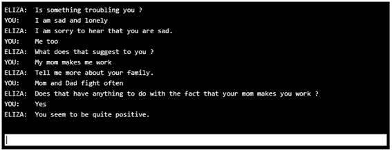
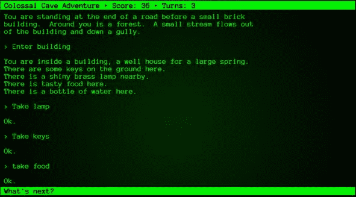

在《星际迷航》中，演员们经常对着电脑说话。计算机理解他们的请求，并立即交付预期的结果。虽然这种理解水平还有很长的路要走，但这是人工智能的目标之一——让计算机准确理解英语(和其他语言)，并能够从单词中提取意义。

现在很多智能手机都自带虚拟助手。例如，你可能会问 Siri，“我明天需要雨衣吗？”程序将确定您的问题是问“下一个日历日在我的位置会下雨吗”，还是用伪代码编程:

返回 RainCheck(zipCode，date()+1)

助手软件将确定下雨的概率，并根据该概率返回一个答案，例如“很有可能你需要你的雨衣。”我问了 Cortana 同样的问题，图 1 显示了天气图。

图 1-明天的雨衣？


早在 1966 年，约瑟夫·韦森鲍姆(Joseph Weizenbaum)就写了一个名为 ELIZA 的程序，该程序旨在模拟一个罗格安心理治疗师。图 2 显示了一个示例“会话”。

图 2–伊莱扎会议



许多早期的电脑游戏都受到了 ELIZA 的影响，允许用户输入简短的句子来指导程序下一步该做什么。“巨大洞穴”是一个非常早期的电脑游戏，允许你探索“附近的洞穴”寻找宝藏。它完全基于文本；你可以输入一两个单词的命令来“探索”这个世界。图 3 显示了程序的开始。

图 3–巨大的洞穴



伊莱扎、庞贝洞穴和类似的游戏都没有理解能力，而只是聪明的基于规则的编程来“模拟”理解。然而，他们确实展示了使用自然语言作为交互方法的潜力。

SHRDLU(以英语中第七到第十二个最常见的字母命名)是由 Terry Winograd 在 1970 年编写的，它在一个块字的受控环境中展示了一些非常令人印象深刻的自然语言处理能力。图 4 显示了程序的示例对话框。

图 4–SHRDLU 对话框

**`Person:`** `Pick up a big red block.`

`Computer: OK.`

**`Person:`** `Grasp the pyramid.`

`Computer: I DON'T UNDERSTAND WHICH PYRAMID YOU MEAN.`

**`Person:`** `Find a block which is taller than the one you are holding and put it into the box.`

`Computer: BY "IT", I ASSUME YOU MEAN THE BLOCK WHICH IS TALLER THAN THE ONE I AM HOLDING.`

`Computer: OK.`

**`Person:`** `What does the box contain?`

`Computer: THE BLUE PYRAMID AND THE BLUE BLOCK.`

理解水平相当令人印象深刻，但仅限于虚拟世界中的区块。虽然这个项目引发了很多乐观情绪，但研究人员开始意识到模拟现实世界有多复杂。虽然解析文本并理解它是自然语言处理的一大部分，但建立所有已知事实的模型是一项极其复杂的任务。通过将领域限制在一个合理的大小，自然语言可以用来帮助系统，但是一个能够理解现实世界的所有细微差别和复杂性，并且能够回答任何问题的计算机程序，仍然还有很长的路要走。

## 引擎

互联网搜索引擎，如谷歌、微软必应、雅虎和 Duck Duck Go 都试图解释你的搜索文本背后的含义。然而，令人好奇的是，这些“问题”得到了怎样的回答。例如，对于足球迷来说，你可能会问这样一个问题，“昨晚的比赛谁赢了？”结果可能是彩票游戏赢家或多个体育赛事结果的列表。

公司尽可能收集你的信息，部分原因是为了在你搜索时给出更好的答案。我经常打网球，所以当我问这个问题时，“昨晚的比赛谁赢了？”在美国网球公开赛期间，我真的很想看看网球比赛的结果。你可以通过广告看到这种程度的个性化，尤其是在社交媒体上。如果你从亚马逊购买产品，你下次去脸书很可能会看到与你购买相关的广告。计算机系统对你的了解越多，你的搜索结果就会越好。让谷歌“给我看看我附近的餐馆”，它就会明白(根据你电脑的 IP 地址)什么叫“我附近”。

聊天机器人是一种计算机程序，试图回答人类提出的问题。在小领域，聊天机器人可以非常有帮助，解决常见的问题。许多企业依靠聊天机器人技术来处理简单的请求，比如修理路由器，或者为用户查找电视上的内容。聊天机器人通常依赖于模式，如果他们检测到问题符合模式，他们会尝试提供响应。

ALICE(人工语言互联网计算机实体)是一个基于标记语言 AIML(人工智能标记语言)的应用。这种语言是一个结构化的文本文件，提供模式和预期的响应。清单 1 显示了一个简单的 AIML 文件，它寻找一个模式并提供一个模板响应。

清单 1–简单的 AIML

```cs
<aiml version =
"1.0.1" encoding = "UTF-8"?>
   <category>
      <pattern> HELLO *
</pattern>
      <template>
         Hello There!
      </template>
   </category>
</aiml>

```

这个文件简单地说:如果用户输入“Hello”，后面跟着任何文本，用模板回应“HELLO 那里！”还有许多额外的特性，例如允许响应是几个随机模板之一，嵌入先前的响应，等等。

通过保持对话空间小，可以创建足够的模式和模板响应。有一个叫三木的聊天机器人，它使用 AIML 文件作为一个来自利兹的 18 岁女子进行交谈。你可以访问[三木网站](https://www.pandorabots.com/mitsuku/)查看一个正在运行的聊天机器人样本。图 5 显示了一个与机器人聊天的示例。

图 5–聊天机器人示例


## 测试

第二次世界大战中杰出的密码学家艾伦·图灵建议进行一项“测试”，以表明计算机是否达到了一定的智能水平。这项以他的名字命名的测试，只是允许人们通过电脑键盘与另一边的陌生人或电脑互动。如果一台计算机能够说服与之交互的 30%的人相信它是一个人，那么测试就被认为通过了。请注意，他并不是试图确定计算机是否能“思考”，而是计算机是否能以类似人类的对话做出回应。

罗布纳奖是一项竞赛，看是否有任何计算机软件能够通过图灵测试。金牌(和 100，000 美元)将颁发给一个可以使用视觉和听觉组件通过测试的程序，而银牌(25，000 美元)将颁发给一个使用纯文本消息通过测试的程序。铜牌授予最像人类的项目。截至本书撰写之时，金牌和银牌尚未颁发。

英语是出了名的难学，因为它有太多的歧义和微妙之处。很多词有多种用法，同一句话有不同的表达方式。通常，我们从上下文和其他线索中找出含义，这在计算机中很难解决。下面几段描述了英语的一些复杂性。

想想“他射杀了一只鹰”这句话对一个猎场看守人来说，这是个坏消息，也许是一个要对付的偷猎者。然而，对于高尔夫球手来说，这是个好消息，因为老鹰比标准杆低两杆。

另一个问题是讽刺。如果一个评论者写道“我真的很喜欢剧院里的噪音”，计算机程序可能会把这解释为一个积极的评论。一个人的背景知识，即剧院通常是安静的，会清楚地表明评论者在发表负面评论。

在英语中，有三个使一个单词成为复数的一般规则。

*   添加字母 **s**

*   如果单词以 **y** 结尾，将 **y** 改为 **ies**

*   如果单词以“s”音结尾，则在单词中添加 **es**

然而，规则也有很多例外。有些词不管是单数还是复数都是一样的(绵羊)，有些词会改变一些字母(男人/男人)，有些词有特定的复数形式(孩子/小孩)

这本书的目标是描述创建一个似乎理解自然语言的系统所需的各种组件，并对英语问题提供合理的回答。我们将设计一个简单的系统来获取问题文本，并从一组特定的数据中提供答案。

我们还将介绍微软、Cloudmersive 和谷歌的一些 API，它们为 NLP 应用提供了各种方法。了解了所涉及的步骤后，您应该能够使用其中一个 API 向应用添加自然语言支持。

如果你的目标是创造 Siri 更老、更聪明的妹妹，或者通过下一次图灵测试，希望本书中给出的描述和代码，以及可用的 API，能给你一个合理的起点。