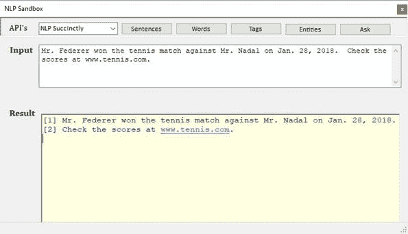
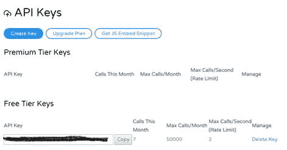

这本书的目标是构建一个简单的自然语言处理库，并将该库的代码用作问答自然语言处理应用程序的一部分。我们将查询的库和数据库的完整源代码可在 Syncfusion 作者的网站上获得，网址为[http://www.joebooth-consulting.com/.](http://www.joebooth-consulting.com/)

前几章将讨论用于将句子解析成可操作结构以查询数据集的一些关键函数。到第 6 章结束时，你应该能够从一个句子中获得单词和标签的列表。在第 9-11 章中，我们将探索一些可以用来获取单词标签列表的 API 调用(Cloudmersive、Google 和 Microsoft)。其中一些网络服务提供了超出我们的问题回答目标的额外的自然语言处理任务，所以阅读它们来看看自然语言处理还能做什么是值得的。

在第 7 章和第 8 章中，我们展示了如何获取一个带标签的单词列表，并使用它来提问和获得答案，首先是通过构建知识和代码来访问它，然后展示如何将问题与适当的函数相匹配来提供答案。如果你只是对回答问题感兴趣，可以跳过第 3-6 章，使用一个网络服务来建立你的标签单词列表。

在接下来的章节中，我们还将使用 Cloudmersive 的另一个 NLP web 服务产品。我建议用 Cloudmersive 注册一个 API 密钥；它允许您每天在免费帐户上进行多达 50，000 次请求。在本章中，我们将展示如何设置 API 调用，并在前面的章节中使用这些调用来补充我们的代码。

这个类库项目将包含解析和标记例程，从用户输入的自由格式文本中创建结构化集合。除了解析器逻辑，类库还将包括解释用户文本所必需的单词和短语的字典。虽然我们的示例代码将具有独立的单词和标签列表，但我们也将考虑使用 web 服务来辅助一些功能。有许多公司提供 API 来补充我们内部存储的数据。

NLP 项目中的 tagger 静态类包含我们想要理解的单词和词性列表。我们有一个小列表:大约 500 个顶级动词、副词和形容词，以及代词。您可以创建自己的单词列表，或者依靠各种网络服务和免费提供的词典来帮助查找和解释您在句子或问题中找到的单词。

我们的样本数据集只是作为对象集合存储的事实集合(在我们的示例中，是网球大赛)。如果数据集很小并且是静态的，那么这种方法是可行的。但是，对于大型或频繁变化的数据集，您很可能会使用 SQL 查询从数据库后端提取数据。

操场是一个简单的项目，允许你测试应用编程接口调用。它是一个 Windows 应用程序，允许您输入一些文本，然后解析它，或者询问数据集的问题。图 6 显示了操场窗口。

图 6–Windows NLP 测试操场



## 服务

Cloudmersive 是一家 web 服务公司，提供几种不同的 web 服务来解决经常困扰开发人员的问题。其中包括光学字符识别、数据验证和文档转换，以及我最喜欢的自然语言应用编程接口调用。用他们自己的话说:

*Cloudmersive 自然语言处理 API 允许您执行词性标注、实体识别、句子解析、语言检测、文本分析等等，以帮助您理解一系列编程语言中非结构化文本的含义——Node。JS、Python、C#、Java、PHP、Objective-C、Ruby。*

要注册 Cloudmersive(并获得每天 50，000 次免费网络服务呼叫)，请转到[此网页](https://account.cloudmersive.com/default)并创建一个登录帐户。

完成后，下次登录时，您将被指引到管理中心，在那里您可以管理您的应用编程接口密钥。您将需要一个 API 键来调用网络服务。图 7 显示了应用编程接口密钥管理页面。

图 7–应用编程接口密钥



一旦有了应用编程接口密钥，就可以使用 NuGet 将包安装到应用程序中。

安装包。版本 1.2.3

您需要添加一些参考资料:

使用 Cloudmersive。API client . net . NLP . API；

使用 Cloudmersive。客户端；

使用 Cloudmersive。模型；

现在，让我们进行第一次测试。

一个有用的特性是能够检测输入文本字符串是哪种语言。让我们看看 Cloudmersive web 服务是如何提供这种功能的。清单 2 显示了一个示例 API 调用。

清单 2–语言检测应用编程接口

```cs
static
public LanguageDetectionResponse DetectLanguage(string text)
{
    //
Configure API key authorization: Apikey

Configuration.Default.AddApiKey("Apikey", APIKey);

    var
apiInstance = new LanguageDetectionApi();       // Which API to call
    try
      {

// Detect language of text

LanguageDetectionResponse result =  

apiInstance.LanguageDetectionPost(text);
         return
result;
      }
  catch
(Exception e)
      {

return null;
      }
}

```

这是 API 调用的一般结构。首先，设置您的应用编程接口密钥，然后创建您想要调用的应用编程接口的实例。最后，一试就打电话...catch 块(因为您正在向 web 服务发帖)并返回 NULL 的结果。

您可以[访问网站](https://api.cloudmersive.com/docs/nlp.asp)来探索提供的各种 API 调用。为了方便起见，第 9 章提供了从 Cloudmersive 调用 API 的示例 C#代码，用于我们在后面几章中讨论的内部 NLP 函数。

为了让计算机能够处理和理解文本，在开始之前，我们应该先熟悉几个概念。

### 用法

了解您的应用程序将使用什么样的数据，以及用户可能会使用什么样的输入和问题，可以让您的应用程序更好地理解问题和答案。Siri 和其他“智能助手”已经对用户了如指掌，只需访问手机或设备中的信息即可。如果你想知道明天的天气，Siri 可以访问你手机中的位置信息来确定你询问的位置。

如果您正在向人事系统添加自然语言支持，您将会遇到关于员工、申请者、角色等方面的问题。问题是，“谁是总统？”会用公司总裁的名字来回答，而不是美国总统。日程安排系统会回答关于约会、空闲时间等问题。如果我告诉调度系统我明天想和罗杰打网球，我希望它能在我的联系人中找到罗杰，而不是让我和罗杰·费德勒一起上场。

了解您的预期使用情况和数据可以让您做出假设，以帮助返回最有可能的响应。英语是高度歧义的，所以我们能提供的任何帮助解决歧义的上下文都会改善理解的外观。

假设我们可以创建一个庞大的知识库来理解世界上每一个可以想象到的事实是过于雄心勃勃的。但是如果我们保持知识领域的小规模，比如商家使用的供应商和产品，或者橄榄球联盟中的足球队和统计数据，我们可以创建一个合理的系统来处理基本的英语查询。

### 表达式

后续章节中的许多解析技术将使用*正则表达式*(或*正则表达式*，它们是用于执行字符串搜索的模式。正则表达式是一个紧凑的字符串，指示应该如何搜索数据。它非常强大，非常神秘，非常容易出错。为了理解正则表达式，让我们探索一个简单的例子。

假设您想在文本字符串中找到单词“CAT”。很简单，对吧？正则表达式就是 CAT。但是，您的需求有点复杂:您需要任何以 C 开头、以 T 结尾的三个字母的单词。您可以使用 C.T(句点代表任何字符)。但是等等，这会发现意想不到的事情，比如 C#T。没问题——把表达式改成 C[a-z]T。只允许元音？那我们就用 C[aeiou]T 吧

正则表达式可以处理很多，比如下面的表达式:^[0-9]{5}([- /]？[0-9]{4})?$.该表达式要求五个数字和一个可选的空格或破折号，可选地后跟四个数字(如美国邮政署​邮政编码)。

这样的正则表达式可以通读文本语料库，并尝试识别可能的邮政编码、电话号码、电子邮件地址或网址。正则表达式寻找匹配的文本模式。表情会变得非常复杂。清单 3 中的神秘表达式展示了一种验证文本看起来像有效文件名的方法。

清单 3–文件名正则表达式

```cs
^(([a-zA-Z]:|\\)\\)?(((\.)|(\.\.)|([^\\/:\*\?"\|<>\.
](([^\\/:\*\?"\|<>\.
])|([^\\/:\*\?"\|<>]*[^\\/:\*\?"\|<>\.
]))?))\\)*[^\\/:\*\?"\|<>\. ](([^\\/:\*\?"\|<>\.
])|([^\\/:\*\?"\|<>]*[^\\/:\*\?"\|<>\. ]))?$

```

它非常强大，但可能非常晦涩难懂。您不一定需要了解正则表达式是如何工作的，但是您会在整本书中看到对两个关键正则表达式方法的引用。

#### Regex。拆分()

此方法的工作方式类似于正则字符串拆分函数，但使用正则表达式来拆分字符串。例如，使用 StringSplit，我们可以使用下面的代码按标点符号进行拆分。

char[] EndChars =新 char[] { ' . '，'！'，'？'，'；'}：

字符串[]句子=文本。拆分(结束字符，

string splitting options-字串分割选项。removeemptyentries

使用 Regex。分割功能，我们可以使用以下代码执行相同的功能:

string regexendoftence = @ "[。！？；]";

字符串[]句子= Regex。拆分(文本、正则表达式、内容)；

您将看到使用 Regex 的例子。当拆分条件比简单的字符串拆分复杂一点时，在代码中进行拆分。

#### Regex。IsMatch()

此方法将文本与正则表达式模式进行比较，并返回一个布尔值，以确定文本是否与正则表达式中的搜索规则相匹配。例如，测试时间字符串(如 10:00)的简单 Regex 是:

@"^([0-1][0-9]|[2][0-3]):([0-5][0-9])$"

如果单词字符串中的值看起来像时间值，下面的代码片段将把 IsTime 标志设置为 true。

bool IsTime =（Regex.IsMatch（Word_，@"^（[0-1][0-9]|[2][0-3]）:([0-5][0-9]）$"））;

了解您的应用程序，并保持您的域较小——这将有助于减少歧义，并让您有更好的机会从输入的文本中获得有意义的结果。

如果您想滚动自己的解析例程，您应该花一些时间探索正则表达式语法，这对于解析文本非常有用。你可以在这里下载我的正则表达式书[。](https://www.syncfusion.com/ebooks/regularexpressions)