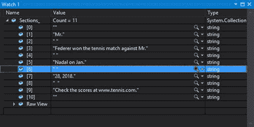

乍一看，将一篇文章分解成一个个句子似乎是一件微不足道的事情。只需使用。NET Split()方法，如清单 4 所示。

清单 4–简单拆分

```
char[] CharSep = new char[] { '.', '!','?',';' };
string[] Sentences = theText.Split(CharSep,     
                     StringSplitOptions.RemoveEmptyEntries);

```

代码表示一旦找到句点、感叹号、问号或分号，就向字符串数组添加新元素。如果一个元素是空的，不要将它包含在结果中。

然而，英语有自己的一套标点规则，句号字符不仅仅是一个句子结束的指示器。句点字符的一些用途包括:

*   缩写(先生、夫人)
*   首字母缩略词(身份证、身份证)
*   货币(32.55 美元)
*   网站网址(www.cnn.com)
*   IP 地址(127.0.0.1)
*   省略

此外，英语语法规则规定，如果首字母缩略词或缩写结束了一个句子，你不应该添加第二个句号。

用 NLP 的说法，从文本中提取句子的问题叫做 ***句子边界消歧*** 。解决这个问题有多种方法，我们将在本章中探讨其中的两种。

想象一下，我们需要把下面的文字分成句子。

2018 年 1 月 28 日，费德勒在与纳达尔的网球比赛中获胜。查看[www.tennis.com](http://www.tennis.com)的分数。

我们期望的结果是两句话，告诉谁赢了，以及如何检查分数。让我们创建一个静态类 SimpleSentenceSplit 来处理我们的解析需求。

我们可以采取的一种方法是在文本中搜索包含句点的缩写列表，并用占位符替换句点字符。接下来，我们将调用 Split 函数。最后，在保存句子之前，我们用句号替换占位符。

第一步是把我们的测试句子改成下面的文字:

2018 年 1 月 28 日，费德勒先生在与纳达尔先生的网球比赛中获胜。在[www ~网球~com](http://www.tennis.com) 查看成绩。

一旦转换了文本，Split 函数将产生以下结果。

*   [0]2018 年 1 月 28 日~费德勒先生战胜纳达尔先生赢得网球比赛。
*   【1】在[www ~网球~com](http://www.tennis.com) 查看成绩。

我们现在循环“句子”，用句号替换~字符。

第一次调用类时，句子解析器会将一些设置声明为常量变量。这包括你的句尾字符和任何预期的缩写。

清单 5–静态变量

静态公共类 NLP

{

公共静态字符[]EndCharacters =新字符[] {“.”, '!','?', ';'};

公共静态字符串[]缩写=

新弦[] {“先生”、“夫人”、“博士”、“女士”、“老”、“小”等。”,

"珊"、“我的”、“做”、“结婚”、“由此”，“冷”、“坐”，

“一月”、“二月”、“三月”、“四月”、“五月”六月，七月，

“八月”、“九月”、“十月”、“十一月”、“十二月”，

" www ",".com“，”。组织“，”。net " }；

可以添加自己的缩写；清单 5 中显示的列表只是文本中可能遇到的单词的一个示例。清单 6 显示了进行解析的代码。

清单 6–解析方法

```
public
static List<string> SimpleSentenceSplit(string paragraph)
    {

char[] CharSep = new char[] { '.', '!', '?', ';' };

foreach (string curAbbr in Abbreviations)
      {

paragraph = Regex.Replace(paragraph,curAbbr,

curAbbr.Replace(".","~"), 

                    RegexOptions.IgnoreCase);
      }

List<string> Sentences_ = new List<string>();

string curSentence;

string[] Sentences = paragraph.Split(CharSep,

StringSplitOptions.RemoveEmptyEntries);

foreach (string sentence in Sentences)
      {

curSentence = sentence.Replace("~", ".").Trim();

Sentences_.Add(curSentence);
      }

return Sentences_;
 }

```

|  | 注意:C#没有不区分大小写的 Replace 方法，所以代码使用了 Regex。方法提供不区分大小写的替换。 |

这种方法效果相当好，但是需要对文本中可能出现的缩写有所了解。您可以调整分隔符和缩写来微调这个解析策略。如果您的目标是解析一组合理一致的文本，这种简单的方法可以为您提供一个可用的句子拆分器。

第二种方法是先执行拆分。然后，检查每个潜在的“句子”，看看它是否是有效的句尾，或者句点是否用于另一个目的，句子是否应该继续。如果我们将这种方法应用于我们的测试输入，我们将得到下面的数组。

*   [0]先生
*   [1]费德勒在网球比赛中战胜了史密斯先生。
*   [2]纳达尔在 1 月
*   [3] 28, 2018.
*   [4]
*   [5]在 www 上查看分数。
*   [6]网球。
*   [7] com。

这种方法的第一个关键是调整 split 函数，以确保包含分隔符，因为我们需要它来组合最终的句子。清单 7 显示了拆分字符串的正则表达式，但是使用回溯来保留分隔符。

清单 7–保留分隔符的 Regex

```
string punctuation =
@"(\S.+?[.!?\u2047])(?=\s+|$)";

```

|  | 提示:如果您的目标语言不是英语，您可以在[ ]字符之间添加额外的分隔符，例如双问号的\U2047。 |

我们现在可以编写代码，从输入文本字符串中提取这些部分。清单 8 显示了代码的第一个片段。

清单 8–收集部分

```
static
public List<string> ExtractSentences(string Paragraph)
{
List<string> Sentences_ = new List<string>();
List<string> Sections_ = new List<string>();
if
(!string.IsNullOrEmpty(Paragraph))
  {
      //
Split by new line character

List<string> FirstPass = 

Regex.Split(Paragraph, @"((?:\r ?\n |\r)+)",  

      RegexOptions.IgnorePatternWhitespace).

      Where(s => s != Environment.NewLine &&       

      !string.IsNullOrEmpty(s)).ToList<string>();

foreach (string curSentence in FirstPass)
      {

string[] chunks = Regex.Split(curSentence, punctuation);

Sections_.AddRange(chunks.ToList<string>());
      }
  }

```

这段代码运行后，Sections_ string 列表包含拆分元素，包括分隔符。图 8 显示了 Sections_ list 的内容。

图 8 -第一遍



我们现在进行第二次传递，检查当前列表元素是一个句子还是分隔符的不同用法。我们的第一步是构建一个正则表达式模式来寻找分隔符的潜在用途，而不是句尾。

Regex Rabbrevs = new Regex(@ " \ b(dr | Mrs | Mr | ms | assn | dept | corp | rte | ave | blvd | hwy "+

" | www | com | edu |政府| 1 月| 2 月| 3 月| 4 月| 5 月| 6 月| 7 月| 8 月| 9 月|"+

“10 月| 11 月| 12 月)[。！？] *$ "，正则表达式选项。ignore case)；

字符串首字母缩写= @"^(？:[A-Z]\。){2,}$";

您可以在此列表中添加自己期望的缩写。知道问题的类型和输入的文本将非常有帮助。

我们还将使用一点 LINQ 从我们收集的部分列表中删除空字符串。

节 _ =节 _。其中(s => s .长度> 0)。to list<string>()；</string>

我们现在循环浏览我们收集的部分，并尝试确定该部分是其本身还是另一个单词的一部分。清单 9 显示了代码。

清单 9 -解析收集的部分

```
for (int
x = 0; x < Sections_.Count; x++)
    {

string curPart = Sections_[x];          // Current word 

string nextPart = "";                   // Next word

if (x + 1 < Sections_.Count)

{

nextPart = Sections_[x + 1];

if (nextPart.Length > 0 

&& (rAbbrevs.IsMatch(curPart) || curPart.Length == 1))

      {

Sections_[x + 1] = curPart + nextPart;

}

else

{

int pv = Sentences_.Count - 1;

 if (pv >= 0 && Regex.IsMatch(Sentences_[pv], acronyms))
                     {

Sentences_[pv] += curPart;

}

else 

{

Sentences_.Add(curPart);

}

}

}
  else
         {

// Last item, add to the sentence stack
            if
(curPart.Trim().Length > 0)

{

Sentences_.Add(curPart);

}

}
    }

```

我们基本上比较当前和下一个短语，所以在我们的例子中。

[1]先生

[2]费德勒在网球比赛中战胜了史密斯先生。

先生是通过正则表达式找到的，第二个元素被添加到其中，

费德勒先生赢了这场网球比赛。

该过程继续进行，直到处理完所有部分。您可以添加自己的规则，例如:如果这两个部分是数字(如货币或 IP 地址)，请将它们组合起来。这允许您根据应用程序微调句子提取。

如果您已经安装了 Cloudmersive API，您可以使用清单 10 中的代码从段落中提取句子。

清单 10–模糊句子提取

```
static
public List<string> ExtractSentencesFromString(string Paragraph)
{ 

Configuration.Default.AddApiKey("Apikey", APIKey);
    var
apiInstance = new SentencesApi();
    try
       {

// Extract sentences from string

string result = apiInstance.SentencesPost(Paragraph);

string[] Sentences_ = result.Replace("\\n", "").

Split(new String[] { "\\r" }, 

StringSplitOptions.RemoveEmptyEntries);

for(int x=0;x<Sentences_.Length;x++)

{

Sentences_[x] = Sentences_[x].Replace("\"", "");
            }

return Sentences_.ToList<string>();
        }

catch ()

{

return null;

}
 }

```

|  | 注意:一定要查看从应用编程接口返回的字符串，以确定您可能需要哪些字符。在清单 10 所示的例子中，我们不是返回一个字符串，而是返回一个字符串列表，在此之前，我们拆分了新的行字符，并删除了段落两端多余的引号。 |

尝试下面的示例段落来确认程序在拆分句子方面的表现。

凯里以 6-2，6-2 赢得了比赛。瑞秋/多莉也以 6-4，6-3 获胜。青蛙洞协会的施密特博士在现场观看。麻省理工学院提供了评分软件。玩家支付 18 美元玩游戏。

这应该测试解析器处理句点字符各种用法的能力。

一旦你有了句子，你可能想要确定这个句子是否在问一个问题(特别是在系统提供答案的情况下)。下面的清单 11 显示了一个简单的函数来确定这个句子是否在提问。

清单 11 - IsQuestion

```
public
static bool IsQuestion(string text)
 {
    bool
isQuestion = text.Trim().EndsWith("?");   // Assumes English only
    if
(!isQuestion)
       {

isQuestion = Regex.IsMatch(text, @"(Who|What|Where|When|How)\s.*",

RegexOptions.IgnoreCase);

}

return isQuestion;
 }

```

这个函数允许你从输入文本中读取每个检索到的句子，并确定哪些句子需要答案。

我们触及了提取句子的基础，但没有触及所有可能出现的细微差别。比如我们忽略了表情符号，只提供了处理英文的代码。**句子边界消歧是一个需要完全解决的复杂问题，但代码应该能让你对它的工作原理有一个基本的了解。**