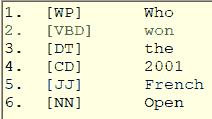
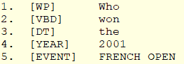

一旦有了标记的单词集合，就应该在列表中扫描命名实体。命名实体可以是类似城市、个人或公司的东西。本质上，它可能是一个对你的应用有意义的名词或形容词和名词。如果您正在处理一个旅行申请，并希望用户能够说，“我想从费城飞往奥兰多”，您的系统应该将机场城市视为从句子中提取的重要实体。

除了命名实体，还有一些具有特殊含义的“名词”，如电子邮件地址、电话号码或信用卡号码。识别这些实体可以提高应用程序确定文本内容的能力。

我们能收集到的关于这个单词的信息越多，我们就能更好地提取意思并找到用户英语问题的答案。

|  | 注意:根据您需要回答的问题类型，您的应用程序可能需要扩展实体类型。例如，如果您正在开发人力资源应用程序，您可能希望包括身份证号(社会保障号)、电话号码和电子邮件地址。 |

## 类型

表 7 包含了我们在应用程序中可能考虑的实体类型标签的列表。

表 7 -实体类型标签

| 实体标签 | 描述 |
| --- | --- |
| 人 | 人名 |
| 空军前进引导员(forward air controller) | 建筑物、机场等。 |
| （同 organic）有机 | 像公司和机构这样的组织 |
| GPE | 像州和国家这样的地理实体 |
| 事件 | 法国公开赛和狂欢节等命名活动 |
| 人口统计学的 | 关于某人的字段，如电话号码和电子邮件 |
| 日期 | 日期值，如月/日/年或明天 |
| 时间 | 小时和分钟，时钟时间 |
| 钱 | 货币价值 |

### 实体

查找命名实体的最简单方法是在字典对象中查找它们。如果创建一个简单的字符串列表，将它们与标签列表中的单词进行比较是一件简单的事情。我们可能想为我们的旅行应用程序添加一些新标签，如机场、人员、城市、组织或事件。清单 22 显示了遍历标签和单词列表的代码，如果可能的话，更新标签以将其识别为实体。

清单 22–检查特定实体的标签

```
 static
private Dictionary<string, string> NamedEntities = 

new Dictionary<string, string>

{

{ "US OPEN"         ,"EVENT" },   

{ "FRENCH OPEN"     ,"EVENT" },   

{ "AUSTRALIAN OPEN" ,"EVENT" },   

{ "WIMBLEDON"       ,"EVENT" },   

{ "MARDI GRAS"      ,"EVENT" },   

{ "MICROSOFT"       ,"ORG" },     

{ "GOOGLE"          ,"ORG" }     
        };

static
public void UpdateNamedEntities(List<string> Words_, List<string>
Tags_)
{
     var
WordArray = Words_.ToArray();

foreach (KeyValuePair<string, string> pair in NamedEntities)
     {

string[] tags = pair.Key.ToString().Split(' ');

int nSize = tags.Length;

int nStart = Array.FindIndex(WordArray, ne => ne.Equals(tags[0], 

StringComparison.InvariantCultureIgnoreCase));

if (nStart >= 0)  {

if (nStart + nSize <= Words_.Count)    {

bool FoundIt = true;

int TagPos = 1;

for (int x = nStart + 1; x < nStart + nSize; x++) {

if (Words_[x].ToUpper() != tags[TagPos].ToUpper()) {

FoundIt = false;

break;

}

TagPos++;

}

if (FoundIt)

{

Tags_[nStart] = pair.Value;

        Words_[nStart] = pair.Key;

       if (nSize > 1 && (nSize + nStart <= Words_.Count))

{

Tags_.RemoveRange(nStart + 1, nSize - 1);

Words_.RemoveRange(nStart + 1, nSize - 1);

               }

}

}

}

}

}

```

除了单词列表，我们还将创建一个模式字典(通过正则表达式)来帮助我们识别“实体”一般来说，如果一个单词与定义的模式之一匹配，我们将把它指定为一个实体。

清单 23 显示了我们正在寻找的一些模式。

清单 23 - Regex 列表

```
static
public Dictionary<string, string> Patterns = 

new Dictionary<string, string>
{

{@"^\$(\d{1,3}(\,\d{3})*|(\d+))(\.\d{2})?$","CURRENCY"  },

{@"(?i)^[a-zA-Z0-9\-\.]+\.(com|org|net|mil|edu)$","URL"  
},

   {@"^([a-zA-Z0-9_\-\.]+)@((\[[0-9]{1,3}\.[0-9]{1,3}\.[0-9]{1,3}\.)|
     (([a-zA-Z0-9\-]+\.)+))([a-zA-Z]{2,4}|[0-9]{1,3})(\]?)$","EMAIL"
},

{@"^((\(\d{3}\) ?)|(\d{3}-))?\d{3}-\d{4}$","PHONE" },

{@"^((\d{2})|(\d))\/((\d{2})|(\d))\/((\d{4})|(\d{2}))$","DATE"
},

{@"^(\d{4})$","YEAR"  },

{@"(?i)^(Mr|Ms|Miss|Ms)$","TITLE"},

{@"^(\d+)$","CD"},

{@" (?i)^(Jan(uary)?|Feb(ruary)?|Mar(ch)?|Apr(il)?|May|Jun(e)?| Jul(y)?|Aug(ust)?|Sep(tember)?|Sept|Oct(ober)?|Nov(ember)?|
Dec(ember)?)$","MONTH"
}
};

```

同样，了解您的应用程序类型将有助于指明您应该查找哪些正则表达式。如果您的系统是人力资源应用程序，识别社会保障号码是一个好主意。对于支付系统，您可能需要识别信用卡。如果你正在处理电子邮件，表情符号会很有用。

清单 24 显示了循环遍历单词并更新您定义的正则表达式模式的标签的代码。

清单 24–Regex 模式匹配

```
for (int
x = 0; x < Words_.Count; x++)
{

string curWord = Words_[x];

foreach (KeyValuePair<string, string> pair in Patterns)
     {

if (Regex.IsMatch(curWord, pair.Key))

{

Tags_[x]= pair.Value;
             break;
         }
     }
}

```

有几件事要记住。首先，确保将正则表达式按顺序排列，以便在基数正则表达式(任意位数)之前检查 YEAR 标记(四位数)。其次，您可能需要在代码中进行额外的检查。例如，在我们认为一个四位数是一年之前，我们想确认它是在 1960 年到 2029 年之间。清单 25 显示了这样一个检查。

清单 25–确认年份

```

int yyyy = Convert.ToInt32(Word_);

if (yyyy < 1960 || yyyy > 2029)

{

continue;

}

```

在人力资源应用程序中，您可能希望考虑四位数的数字只有在低于当前年份(询问某人的出生日期)时才应被视为年份。

正则表达式的一个很好的来源是 [Regex 库网站](http://www.regexlib.com/)。他们有大量用户贡献的正则表达式。

另一种识别命名实体的方法是寻找提示实体的标签模式，而不是单个单词。例如，标签 TITLE 后面跟一个或多个标签 NNP(专有名称)暗示一个人。每当我们看到这种模式时，我们应该创建一个单人实体。我们的模式字典将非常类似于我们在标记单词时调整标记列表时使用的规则。

清单 26–实体模式

```
static
public Dictionary<string, string> EntityPatterns = new
Dictionary<string, string>

{

{"TITLE|NNP|NNP","PERSON" },

{"TITLE|NNP","PERSON" }

};

```

这条规则是这样的:如果我们发现标题后面有一两个专有名词，我们就把它组合成一个带标签的单词，并把它标记为 PERSON。所以，约瑟夫·布斯先生作为三个标签，变成了一个单人标签，具有约瑟夫·布斯先生的价值。

清单 27 显示了处理模式列表的代码。

清单 27 -流程标签模式

```
foreach
(KeyValuePair<string, string> pair in TagPatterns)
{

string[] tags = pair.Key.ToString().Split('|');

string EntityValue = "";
    int
nSize = tags.Length;
    int
nStart = Tags_.IndexOf(tags[0]);
    if
(nStart >= 0)
    {

if (nStart + nSize <= Tags_.Count)    

{

EntityValue += Words_[nStart];
            bool
FoundIt = true;
            int
TagPos = 1;

for (int x = nStart + 1; x < nStart + nSize; x++)

{
                if
(Tags_[x] != tags[TagPos])
                {
                   FoundIt
= false;
                   break;
                 }

EntityValue += " " + Words_[x];

TagPos++;

}

if (FoundIt)

{

Tags_[nStart] = pair.Value;

     Words_[nStart] = EntityValue;

if (nSize > 1 && (nSize + nStart <= Words_.Count))

     {

       Tags_.RemoveRange(nStart + 1, nSize - 1);

      Words_.RemoveRange(nStart + 1, nSize - 1);

}

}

}
       }
   }

```

假设用户问了以下问题:

谁获得了 2001 年法网冠军？

标记后，结果如图 9 所示。

图 9–标记结果



在我们应用命名实体识别之后，结果如图 10 所示。

图 10–命名实体之后



根据这个句子结构，我们可以确定一个行动方案:查找 2001 年法网冠军。

一旦你从一个问题中获得信息，你的应用程序应该记住关键的组件。查询网球成绩的用户可能会看到如下对话框:

谁获得了 2001 年法网冠军？

古斯塔沃·库尔腾赢得了男子比赛，珍妮弗·卡普里亚蒂赢得了女子比赛。

谁输了？

莱克斯·科雷亚输给了古斯塔沃·库尔腾，吉姆·克里斯特尔斯输给了珍妮弗·卡普里亚蒂。

因为您的代码需要知道比赛的年份和名称，所以它应该记住前面问题中的关键变量。您对数据和问题类型了解得越多，就越能确定保留哪些信息并插入到以后的问题中。

您可能还想考虑系统要求额外的信息，以防句子中缺少什么。例如:

谁赢了法网？

你可以假设问题指的是最近一次法网，或者你可以用一个问题来提示以获得缺失的信息:**哪一年？**

很多关于如何计划交互的决定将有助于确定你的应用程序有多受欢迎。例如，在我们的网球应用程序中，许多人用姓氏来称呼运动员。我们可以考虑将姓氏添加到我们命名的实体堆栈中，所以有人会问“纳达尔在 2014 年赢得法网了吗？”会在不知道纳达尔名字的情况下给出答案。

在标记和应用命名实体和一些分块逻辑之后，我们应该能够得出足够的信息来确定用户想要知道什么。在接下来的几章中，我们将看到如何构建我们的知识库，以及之后如何向用户提供答案。