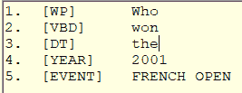

我们已经达到了这一点，能够从文本中生成一个标签单词列表。无论您是依赖 Cloudmersive(或其他应用编程接口)还是使用书中提供的代码，这个带有标签的单词对象列表都给了我们一个很好的机会，让计算机以某种友好的方式响应用户的文本。我们的基本方法将是接受标记的句子，并尝试提供一个响应。

静态公共字符串 GetResponse(List<string>word _，List <string>Tags_)</string></string>

单词列表和标签列表作为参数传递。通过搜索列表，我们应该能够确定用户在问什么，以及如何回答。

我们现在有了关于数据的短语和一组函数。在这一章中，我们将整合各个部分，并允许您提问和获得答案。图 12 显示了与网球专业应用的对话。

图 12–会说话的网球

谁获得了 2001 年法网冠军？

古斯塔沃·库尔腾赢得了男子比赛，珍妮弗·卡普里亚蒂赢得了女子比赛。

谁输了？

莱克斯·科雷亚输给了古斯塔沃·库尔腾，吉姆·克里斯特尔斯输给了珍妮弗·卡普里亚蒂。

谁赢得了第一个温布尔登？

罗德·拉弗在一场精彩的比赛中战胜了托尼·罗奇，比利·简·金在一场精彩的比赛中战胜了朱迪·特加特。

|  | 注:我们的数据集只能追溯到 50 年前，所以“第一次”指的是我们数据集中的第一次温布尔登锦标赛，当时第一次真正的温布尔登锦标赛于 1877 年举行，由斯潘塞·戈尔赢得。 |

谁赢得了最多的温网冠军？

罗杰·费德勒已经赢得了 8 次温网冠军。

我们的目标听起来很简单——我们需要确定三件事来回答这个问题。首先，问的是什么。第二，哪个函数调用有答案。第三，如果我们能从 word info 对象列表中获得函数调用所需的信息。

如果我们复习上一章的函数，我们知道如何回答以下问题。表 8 列出了函数和我们需要确定的调用函数的信息。

表 8–功能和参数

| **功能** | **参数** |
| --- | --- |
| 谁赢了 | 锦标赛、年份、性别 |
| 谁输了 | 锦标赛、年份、性别 |
| 最后得分 | 锦标赛、年份、性别 |
| 大多数胜利 | 锦标赛，性别 |
| 大多数损失 | 锦标赛，性别 |
| 玩家获胜 | 锦标赛，游戏名称 |
| 玩家角色 | 锦标赛，游戏名称 |

至少，我们需要锦标赛名称(所有函数都希望锦标赛是第一个参数)。其他参数会有所不同，具体取决于所提问题的类型。

我们的第一个问题是“2001 年法网冠军是谁？*”*如果我们查看我们的标记短语，我们会得到如图 13 所示的标记单词列表。

图 13–标记单词



YEAR 和 EVENT 标签让我们知道问题指的是哪个锦标赛。我们有两个参数可以传递给前三个函数调用中的任何一个。由于我们不知道性别，我们将报告男女比赛的结果。

这个动词可能表示我们想要的功能，锦标赛的赢家或输家。因为我们的动词是 wind 这个词，所以我们应该报告获胜者。因为问题是谁，我们知道用户需要一个名字。

有了这些信息，我们就可以调用函数并生成答案。

我们想做的一件事是创建变量来保存用户给我们的信息，这些信息可以作为参数重用。清单 37 显示了我们声明用来记住参数的静态类变量。

清单 37–记忆的变量

```cs

private static int TournamentYear;

private static string Tournament;

private static string Gender;

private static string PlayerName;

```

每当我们从问题文本中确定参数时，我们就更新类变量，这样用户就不必重复他们自己。

#### 初始化变量

如果可以确定它们，那么在构造函数中为类变量提供默认值可能会有所帮助。对于我们的网球应用，我们知道有四场比赛，它们在不同的月份进行。清单 38 显示了我们根据当前月份提供的锦标赛和年份值。如果用户简单的问“谁赢了网球？”系统将根据每年的时间报告相应锦标赛的结果。

清单 38–默认值

```cs

static TennisMajors() {

int MM = DateTime.Now.Month;

if (MM<=2) { Tournament = "AUS"; };

if (MM>3 && MM <= 5) { Tournament = "FRENCH"; };

if (MM> 5 && MM <= 7) { Tournament = "WIMBLEDON"; };

if (MM>7) { Tournament = "USOPEN"; };

TournamentYear = DateTime.Now.Year;

}

```

#### 回答问题

我们现在将创建一个函数，该函数将获取标记的单词列表并尝试生成一个答案。清单 39 显示了该函数。

清单 39–回答网球问题

```cs
static
public string GetResponse(List<string> Words_,List<string> Tags_)
{

string ans_ = "";
     for
(int x = 0; x < Tags_.Count; x++)
     {

if (Tags_[x] == "YEAR")

{

TournamentYear = Convert.ToInt16(Words_[x]);

}
         if
(Tags_[x] == "EVENT")

{

 Tournament = Words_[x];

 if (Tournament.Contains("FRENCH")) { Tournament =
"FRENCH"; }

  if (Tournament.Contains("US ")) { Tournament = "USOPEN";
}

   if (Tournament.Contains("AUS ")) { Tournament = "AUS"; }

}

if (Tags_[x].StartsWith("VB"))  { LastVerb = Words_[x].ToUpper();

}

if (Tags_[x] == "PERSON")   {  PlayerName = Words_[x].ToUpper();

}
      }

    if
(LastVerb == "WON") {

if (Gender == "B")

{

ans_ = WhoWon(Tournament, TournamentYear, "M");

string ansW = WhoWon(Tournament, TournamentYear, "F");

if (ansW.Length>0) { ans_ += " and " + ansW; }

}
          else

{

ans_ = WhoWon(Tournament, TournamentYear, Gender);

}
       }
    if
(LastVerb == "LOST") {

if (Gender == "B")

{

ans_ = WhoLost(Tournament, TournamentYear, "M");

string ansW = WhoLost(Tournament, TournamentYear, "F");

if (ansW.Length > 0) { ans_ += " and " + ansW; }

}

else

{

ans_ = WhoLost(Tournament, TournamentYear, Gender);

}

}
     if
(ans_.Length < 1) { ans_ = "I don't know..."; }

return ans_;
  }

```

这个基本代码处理几个关键动词(WON 和 LOST)，并调用适当的函数来返回一个答案。它在句子标签中做一个循环，看看它是否能找到传递给呼叫的参数，以缩小用户询问的锦标赛和年份。

当人们回答一个问题时，他们可能每次都用不同的措辞。我们希望我们的“谁赢了”节目有点创意。清单 40 显示了确定答案的例程，但是基于随机选择对其进行了不同的格式化。

清单 40–谁赢了

```cs
static
public string WhoWon(string Tournament, int Year, string Gender)
 {

string[] PossibleReplies = {

"{0} was the {1}'s winner",

"{0} won the {1}'s",

"{0} won on the {1}'s side",

"{0} defeated {2} in the {1}'s draw",

"{0} won in {3} sets over {2} ",

"It was won by {0} in {3} sets"

};

string ans_ = "";

Tournament Results_ = GetResults(Tournament, Year, Gender);
    if
(Results_ != null)
       {

string GenderText = "men";

if (Gender=="F") { GenderText = "women"; }

int reply = rnd.Next(1, PossibleReplies.Length) - 1;
         //
Some tennis vocabulary

string SetText = Results_.SetsPlayed.ToString();

if (Results_.SetsPlayed == 3 && Gender=="M") 

{ SetText = "straight"; }

if (Results_.SetsPlayed == 2 && Gender == "F")

 { SetText = "straight"; }

ans_ = string.Format(PossibleReplies[reply], 

Results_.Winner.FullName, 

GenderText,

Results_.RunnerUp.FullName,

SetText);
       }
  return
ans_;
}

```

虽然可以简单地提取答案并返回人的名字，但如果应用看起来更人性化(在这种情况下，通过给出不同的方式来提供答案)，它会显得更友好、更容易使用。

根据您的应用，您可以通过理解您的数据来真正增强应用。在我们的例子中，匹配的分数被存储为字符串。通过一点字符串操作，我们可以猜测这场比赛有多接近(或有多片面)。

了解您的用户和应用语言是有帮助的，并且可以使您的应用看起来更加“人性化”比如在网球比赛中，如果一个人赢了所有的盘而没有输掉一盘，就说是直落一盘的胜利。如果一个玩家赢了所有的游戏，他们就“赢”了另一个玩家。

#### 赢得的比赛

数据中的分数字符串如下所示。

6–2, 6–2, 6–2

清单 41 显示了如何根据分数字符串确定游戏的输赢。

清单 41–赢得的游戏

```cs
static
public int GamesWon(string Scores)
{
    int
TotalWon = 0;

string[] Sets_ = Scores.Split(',');

foreach(string CurSet in Sets_)
      {

string[] WinLoss = CurSet.Split(',');

if (WinLoss.Count()==2)

{

TotalWon += Convert.ToInt16(WinLoss[0]);

}
       }

return TotalWon;
}
static
public int GamesLost(string Scores)
{
     int
TotalLost = 0;

string[] Sets_ = Scores.Split(',');

foreach (string CurSet in Sets_)
       {

string[] WinLoss = CurSet.Split(',');

if (WinLoss.Count() == 2)

{

// Deal with tiebreakers

int x = WinLoss[1].IndexOf("(");

if (x>0) { WinLoss[1] = WinLoss[1].Substring(0, x - 1); }
                       TotalLost
+= Convert.ToInt16(WinLoss[1]);

}
       }

return TotalLost;
}

```

游戏输了非常相似，但处理决胜局字符串，如果它出现。通过观察一场比赛并运用一些网球逻辑，我们可以确定这场比赛是否势均力敌。我们可能需要进一步调整我们的回复。让我们确定这场比赛是一边倒，势均力敌，还是一场精彩的比赛。

我们将在我们的股票回复中添加以下文本回复。

“{0}在{4}对{2}的比赛中获胜”

为了简单起见，我们使用以下公式。

如果不是直落两盘(男三盘，女两盘)，就说明胜者至少输了一盘。所以，我们可以假设这是一场势均力敌的比赛。如果比赛是直落两盘决出的，胜者赢的比赛比败者多 2-3 倍，我们就称之为一边倒的比赛。清单 42 显示了对匹配进行评级猜测的函数。

清单 42–匹配评级

```cs
static
public string MatchRate(bool StraightSets,int GamesWon,int GamesLost)
 {

string ans_ = "good";

if(!StraightSets)
      { 
ans_ = "close";

if (GamesWon-GamesLost < 4) { ans_ = "very close"; }
      }
    else
     {

if (GamesWon > GamesLost*2.5)

{

ans_ = "one-sided";

}
     }

return ans_;
}

```

将这段代码添加到我们的函数中，应用变得有点固执己见(纳达尔赢了 6-2，6-3，6-1)，如图 14 所示。

图 14–固执己见的网球应用

*2017 年法网冠军是谁？*

**拉斐尔·纳达尔在一边倒的比赛中战胜了斯坦·瓦林卡，jeļena·奥斯塔彭科在一场势均力敌的比赛中战胜了西蒙娜·哈勒普。**

当然，计算机对实际匹配一无所知，只知道它看到的数据告诉它什么。当你的应用在响应中变得更有创意时，一定要考虑你的受众。

第二个问题很简单:“*谁输了*？”由于用户没有给我们一年或锦标赛名称，我们将依赖以前的答案。从前面的问题，我们知道是 2001 年法网，所以系统找到了动词 LOST，并且有足够的信息来决定调用哪个函数。

记住以前的回复将使系统对用户更加友好。如果我输入“*谁是*人力资源经理*？*“系统回复”**朱莉**，“你可以假设我的后续问题是“她的邮件*是什么？*“指朱莉而可答。如果你的系统识别一个人，代词 **he** 和 **she** 应该在系统的记忆中用这个人的名字代替。

第三个问题是:“谁赢得了第一个温布尔登？”世卫组织的问题和事件告诉我们，我们正在寻找一个人，但我们不知道是哪一年。然而，关键字 FIRST 告诉我们要获得我们有数据的第一年。所以，我们扫描单词表，寻找第一个、最早的等等。，关键字-搜索单词数组。

缺点之一是必须知道一个人可能使用的所有同义词。有一个名为[WordAPI](https://www.wordsapi.com/)的网络服务可以让你找到给定单词的同义词。清单 43 显示了一个 JSON 响应的例子。

清单 43–单词应用编程接口同义词应用编程接口调用

```cs
{ "word":
"first", 
   "synonyms": 
   [  "1st", 
       "inaugural", 
        "maiden", 
        "kickoff", 
        "start", 
        "foremost", 
   ]
}

```

通过使用 API，您可以预测预期的单词，如*第一个*或*最新的*，并让 API 预先构建可能的同义词。您也可以将列表本地存储在字典中。如果您正在使用自己的代码，您可能希望保留一个可能被您的受众使用的同义词词典。

最后一个问题是:“谁赢得了最多的温网冠军？”在这个例子中，我们依靠标签来识别事件(温布尔登)和动词(赢)。我们也最期待关键词(副词或形容词)。通过检测动词(WON 或 LOST)和修饰词最多，我们可以确定在数据集中调用哪个方法。我们可以稍微改变一下问题，仍然会得到一个合理的答复，如图 15 所示。

图 15 -谁输了

`WHO HAS LOST THE US OPEN THE MOST?`

`Ivan Lendl has lost 5 times`

通过解析标记的句子来提取缺失的数据，并依靠动词来猜测调用哪个函数，我们通常可以很好地将输入句子与提供答案的函数进行匹配。同样，你对你的申请了解得越多，你就能更好地预测你可能发现的问题类型。

我建议，至少在最初，记录下你的申请中提出的问题和提供的答案。你可能会根据用户的要求不断调整你的代码。当你得到一组常见问题，并调整代码来回答它们时，你的系统每次都会显得更聪明。

简单地返回一个人想要的确切答案是可能的，但是如果你使用随机的回答，甚至幽默的回答来提供信息，系统会显得更有用。我们正在设计一个与人互动的系统，所以我们不需要像在计算机系统之间交谈时所需要的协议那样严格。人们会喜欢所产生的反应的多样性和轻松性。

产生回应很有趣，但要了解你的听众。如果你正在为军队设计一个系统，他们可能不会喜欢一个更轻的，不同的反应。(而且他们带着枪。)