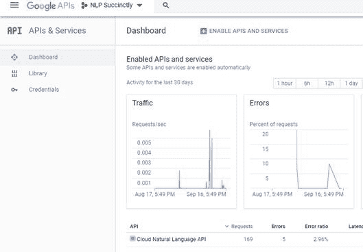
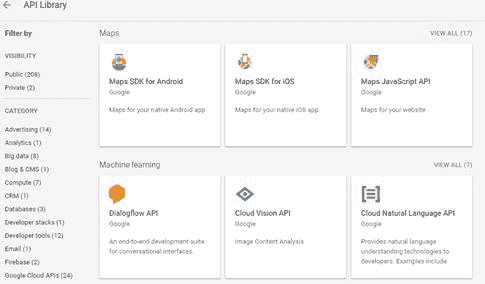
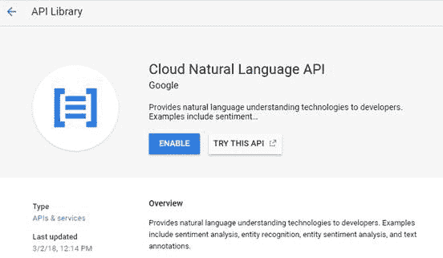
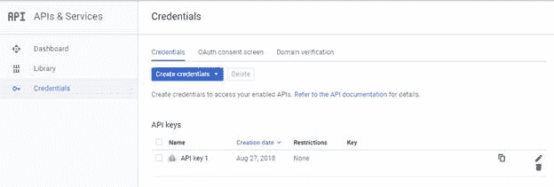
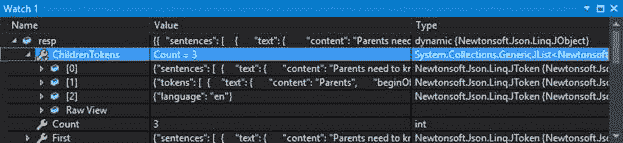
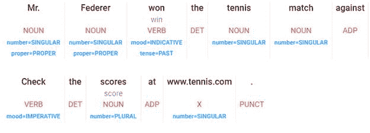

# 十、谷歌云 NLP API

谷歌提供了许多应用编程接口网络服务，包括一组处理文本的应用编程接口调用。在本章中，我们将讨论如何设置使用该服务，以及可用的服务呼叫。

您可以在这里找到应用编程接口文档[。](https://cloud.google.com/natural-language/docs/basics)

要获得应用编程接口密钥，您必须首先有一个谷歌帐户。访问[本网站](http://console.developers.google.com/)并使用您的用户名和密码登录。

### 仪表盘

开发人员的仪表板(图 16)提供了对所有谷歌应用编程接口的访问，您可以通过点击库图标来浏览这些接口。

图 16–谷歌开发者仪表板



#### 应用编程接口库

您将需要通过首先找到云自然语言应用编程接口并单击它来创建凭据。图 17 显示了谷歌提供的 API 库。

图 17–谷歌应用编程接口库



通过点击框选择应用编程接口，如图 18 所示。点击**启用**启用 API。

图 18–启用您的应用编程接口

****

#### 正在创建凭据

一旦选择了应用编程接口，就需要为使用该应用编程接口创建凭据。一旦你这样做了，你会得到一个应用编程接口，这是你在代码中需要的。(我把我的藏在这里了。)

图 19–谷歌凭证



就这样。保存该应用编程接口密钥，您就可以开始与自然语言应用编程接口接口了。

我们将编写一个静态类，它将包含处理与谷歌应用接口交互的私有方法和公开您希望在应用中使用的应用接口的公共方法。

清单 50 是调用谷歌应用编程接口的基本类。请务必将 GOOGLE_KEY 变量设置为您之前获得的 API。

清单 50–谷歌基类

```cs

static public class GoogleNLP
{
  static private string BASE_URL = 
        "https://language.googleapis.com/v1/documents:";
  static private string GOOGLE_KEY = " your API key
";

  static private dynamic BuildAPICall(string Target,string
msg)
  {
      dynamic results = null;
      string result;
      HttpWebRequest NLPrequest = (HttpWebRequest)WebRequest.
                Create(BASE_URL + Target+"?key=" + GOOGLE_KEY);
      NLPrequest.Method = "POST";
      NLPrequest.ContentType = "application/json";
      using (var streamWriter = new 
             StreamWriter(NLPrequest.GetRequestStream()))
      {
          string json = "{\"document\":
{\"type\":\"PLAIN_TEXT\"," +

"\"content\":\"" + msg + "\"} }";
          streamWriter.Write(json);
          streamWriter.Flush();
          streamWriter.Close();
      }
      var NLPresponse =
(HttpWebResponse)NLPrequest.GetResponse();
      if (NLPresponse.StatusCode == HttpStatusCode.OK)
      {
           using (var streamReader = new 
                  StreamReader(NLPresponse.GetResponseStream()))
           {
                result = streamReader.ReadToEnd();
           }
           results =
JsonConvert.DeserializeObject<dynamic>(result);
       }
       return results;
 }

```

构建这个类后，公开方法的公共方法都只是包装器调用。清单 51 显示了直接调用谷歌应用编程接口调用的公共方法。

清单 51。–公开谷歌应用编程接口调用

```cs
static
public dynamic analyzeEntities(string msg)

{

dynamic ans_ = BuildAPICall("analyzeEntities", msg);

if (ans_ == null) return null;

return ans_;
        }

static
public dynamic analyzeSentiment(string msg)

{

dynamic ans_ = BuildAPICall("analyzeSentiment", msg);

if (ans_ == null) return null;

return ans_;

}

static
public dynamic analyzeSyntax(string msg)

{

dynamic ans_ = BuildAPICall("analyzeSyntax", msg);

if (ans_ == null) return null;

return ans_;

}

static
public dynamic classifyText(string msg)

{

dynamic ans_ = BuildAPICall("classifyText", msg);

if (ans_ == null) return null;

return ans_;

}

static
public dynamic analayzeEntitySentiment(string msg)

{

dynamic ans_ = BuildAPICall("analyzeEntitySentiment", msg);
            if
(ans_ == null) return null;

return ans_;

}

```

这些调用返回动态对象，您可以进一步解析这些对象以提取信息。谷歌文档提供了通过应用编程接口返回的响应数据的详细信息。

从直接的应用编程接口调用中返回的数据将是一个动态的 JSON 对象。您可以在调试器中浏览该对象，以查看正在返回哪些属性。图 20 显示了来自 AnalyzeSyntax 调用的调试器快照。

图 20–美国石油学会的回应



您可以通过名称访问对象的任何属性。例如，使用 resp.language.Value 语法将返回字符串 **en** 。resp .句子. count 语法将返回响应中的句子数，resp .句子[x]将允许您访问句子集合中的各个项目。

在第 2 章中，我们引入了一个函数来返回段落中的句子列表。清单 52 显示了 Google analyzeSyntax 调用的包装函数，它返回一个字符串列表。

清单 52–提取句子

```cs
static
public List<string> GoogleExtractSentences(string Paragraph)
 {

List<string> Sentences_ = new List<string>();
     var
ans_ = analyzeSyntax(Paragraph);
     if
(ans_ !=null)
        {

for(int x=0;x<ans_.sentences.Count;x++)

{

Sentences_.Add(ans_.sentences[x].text.content.Value);

}

}

return Sentences_;
 }

```

在第 5 章中，我们介绍了使用佩恩树库标记集标记单词的概念。(见附录 a)Google 使用了一组不同的标签，因此我们需要做一些转换工作，将 Google 标签映射到 Penn Treebank 集合。

谷歌的应用编程接口为解析后的单词列表中的每个单词返回一个标记。这些标签基于通用标签列表(见附录 B)。每个令牌都有一个词性成分，共有 12 个属性。我们需要将这些属性映射到适当的佩恩树库标签。清单 53 显示了从谷歌应用编程接口获取一个标记单词列表的代码(通过将谷歌部分的搜索信息转换成佩恩树银行标记)。

清单 53–谷歌标记的单词

```cs
static
public List<string> GoogleTaggedWords(string Sentence,bool
includeLemma=false)
{

List<string> tags = new List<string>();
   var
ans_ = analyzeSyntax(Sentence);
   if
(ans_ != null)       {

for (int x = 0; x < ans_.tokens.Count;x++)          {

string Tag = GoogleTokenToPennTreebank(ans_.tokens[x].partOfSpeech, 

ans_.tokens[x].text.content.Value.ToLower());

if (includeLemma)     {

Tag += ":" + ans_.tokens[x].lemma.Value;

}

tags.Add(Tag);

}
      }

return tags;
}

```

我们包含了一个返回引理的选项。引理是一个词的基本形式，所以表示赢、赢、赢等。都会有一个胜利的引理。添加引理值简化了确定动词或名词所代表的概念的任务。Google 的 API 包含一个引理，所以该方法可以将引理追加到返回的标签中。图 21 显示了一个来自 API 的示例语法分析调用，包括引理。

图 21–谷歌应用编程接口语法分析示例



清单 54 显示了将通用词性标签转换为树库代码的代码，它依赖于通用标签和其他一些字段，每个单词返回 12 个属性。

清单 54–映射部分语音标签

```cs
 static
private Dictionary<string, string> TagMapping = new Dictionary<string,
string>
    {

{"ADJ","JJ" },

{"ADP","IN" },

{"ADV","RB" },

{"CONJ","CC" },

{"DET","DT" },

{"NOUN","NN" },

{"NUM","CD" },

{"PRON","PRP" },

{"PUNCT","SYM" },

{"VERB","VB" },

{"X","FW" },
    };

static
private string GoogleTokenToPennTreebank(dynamic Token)
{

string ans = "";

string GoogleTag = Token.tag.Value.ToUpper();
    if
(TagMapping.ContainsKey(GoogleTag))      {

ans = TagMapping[GoogleTag];
    }
    //
Tweak certain tags
    if (ans=="NN")
      {
        string
number = Token.number.Value.ToUpper();

string proper = Token.proper.Value.ToUpper();

if (number == "PLURAL" && proper == "PROPER" ) 

 { ans = "NNPS"; }    // Plural proper noun

if (number == "SINGULAR" && proper == "PROPER")

     { ans = "NNP"; }     // Singular proper noun

if (ans=="NN" && number=="PLURAL")  

    { ans = "NNS"; }               // Plural common noun
      };
    if
(ans=="VB")
      {
        string
tense = Token.tense.Value.ToUpper();

string person = Token.person.Value.ToUpper();

if (tense == "PAST") { ans = "VBD"; }    // Past tense verb

if (tense == "PRESENT") { ans = "VBG"; }    // Present
tense verb
      };
 return
ans;
}

```

代码获取 Token 对象，并将其映射到适当的 Treebank 标记。然而，谷歌令牌中还有额外的信息，让我们进一步映射，确定名词的类型和动词的大小写。

谷歌云应用编程接口提供了一套很好的自然语言处理接口调用，有助于建立你的单词标签列表。该应用编程接口还提供分类、命名实体识别和情感分析，所有这些功能在处理自然语言文本时都很方便。