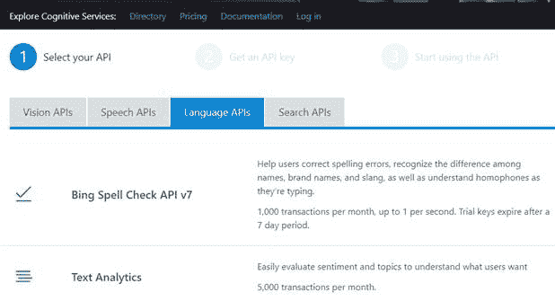
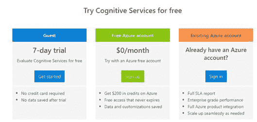
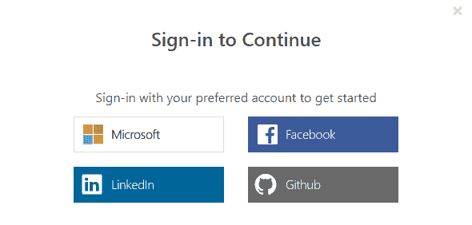
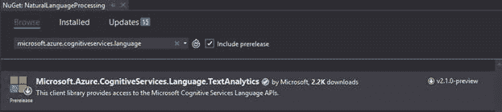

微软认知服务是微软为解决人工智能(AI)问题而开发的各种机器学习算法。有许多服务可用；我们将在本章探讨文本分析服务。

要开始使用微软认知服务，您首先需要访问[这个网站](https://azure.microsoft.com/en-us/try/cognitive-services/)并注册一个应用编程接口密钥。

图 22 -认知服务



如果您已经有一个 Azure 帐户，您可以向该帐户添加认知服务；否则，要先看一下，选择图 23 所示的**客用 7 天试用**选项。

图 23–认知服务注册



图 24–登录



登录后，您将获得一个端点和一个应用编程接口密钥。保存这两个，因为您需要它们通过 API 检索数据。

安装认知服务的微软文档可以在这里找到[。本页描述如何为许多不同的编程语言安装应用编程接口。图 25 显示了将 NuGet SDK 包安装到您的 C#解决方案或项目中。](https://docs.microsoft.com/en-us/azure/cognitive-services/text-analytics/quickstarts/csharp)

图 25–NuGet 包



一旦您有了凭据(端点和应用编程接口密钥)，您就可以调用服务并返回数据供您的应用程序使用。为了简单起见，我们将直接调用网络服务(非常类似于我们调用谷歌应用编程接口的方法)。清单 55 显示了使用认知服务网络应用编程接口的静态类的基本设置。

清单 55–对认知服务的网络服务调用

```cs
static
public class MicrosoftNLP
{

static private string API_KEY = "";

static private string ENDPOINT = ""

static private dynamic BuildAPICall(string Target, string msg)
   {

dynamic results = null;

string result;

HttpWebRequest NLPrequest = (HttpWebRequest)WebRequest.

Create(ENDPOINT + "/"+Target );

NLPrequest.Method = "POST";

NLPrequest.ContentType = "application/json";

NLPrequest.Headers.Add("Ocp-Apim-Subscription-Key", API_KEY);

using (var streamWriter = new StreamWriter(NLPrequest.GetRequestStream()))

{

string json = "{\"documents\": [
{\"id\":\"1\"," +

"\"text\":\"" + msg + "\"}] }";

streamWriter.Write(json);

streamWriter.Flush();

streamWriter.Close();

}

var NLPresponse = (HttpWebResponse)NLPrequest.GetResponse();

if (NLPresponse.StatusCode == HttpStatusCode.OK)

{

using (var streamReader = new 

StreamReader(NLPresponse.GetResponseStream()))

{

result = streamReader.ReadToEnd();

}

results = JsonConvert.DeserializeObject<dynamic>(result);

}

return results;
  }

```

这是到达端点并将数据传递给认知服务的基本代码。请确保将端点和 API_KEY 设置为您从注册中获得的端点和 API _ KEY。此方法将结果对象作为 JSON 对象返回；您需要让您的方法调用提取您的应用程序需要的任何信息。

清单 56 是提取 JSON 信息供应用程序使用的大量包装器调用。

清单 56–对认知服务的包装调用

```cs

static public string DetectLanguage(string text)
        {

var ans = "";

var results = BuildAPICall("languages", text);

try

{

ans = results.documents[0].detectedLanguages.First.name.Value;

}

catch

{

  ans = "UNKNOWN";

}

return ans.ToString();

}

static public double AnalyzeSentiment(string msg)

{

double ans = 0;

var results = BuildAPICall("sentiment", msg);

try
            {

ans = Convert.ToDouble(results.documents[0].score);

}

catch

{

ans = -1;

}

return ans;

}

        static
public List<string> classifyText(string text)

{

List<string> ans = new List<string>();

var results = BuildAPICall("keyPhrases", text);

try

{

foreach (var curPhrase in results.documents[0].keyPhrases)

{

         ans.Add(curPhrase.Value);

}

}

catch

{

}

return ans;

}

static public List<string> analyzeEntities(string text)

{

List<string> ans = new List<string>();

var results = BuildAPICall("entities", text);

try

{

foreach (var curEntity in results.documents[0].entities)

{

ans.Add(curEntity.name.Value);

      }

}

catch

{

}

return ans;

}

```

这些调用进行 API 调用并提取返回的数据，可以是字符串、列表或其他对象，具体取决于您的应用程序需求。

认知服务是微软的一个有用的应用编程接口，它处理自然语言处理中一些更棘手的问题。您可以探索通过这些 API 提供的文本分析来增强您的应用程序。