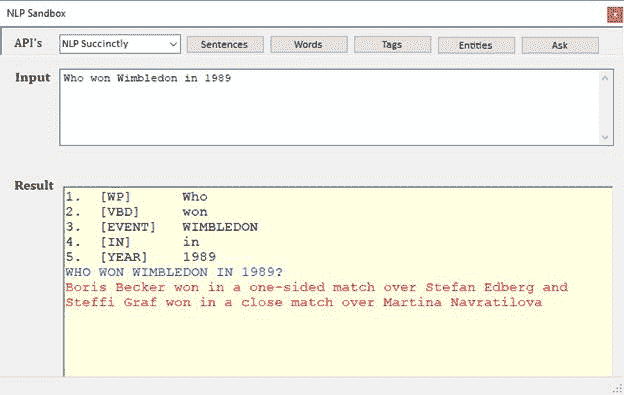

这本书的代码由一个包含三个项目的解决方案组成。主要项目是自然语言处理类库，其中包含本书中讨论的代码示例。你也可以在 [Syncfusion GitHub 资源库](https://github.com/SyncfusionSuccinctlyE-Books/Natural-Language-Processing-Succinctly)找到它们。

这是一个类库，包含执行自然语言方法的类。小三班是:

*   NLP:解析句子和单词的核心库。
*   标记器:获取单词列表并为每个单词生成标记
*   实体:处理标记单词列表，在需要的地方分配实体。

你可能需要复习单词词典、正则表达式等。在 tagger 和 Entities 中为您的应用程序需求定制它们。

还有三个包装类，它们与我们在整本书中讨论的各种 API 进行交互。您将需要获取密钥和端点，然后用您的凭据更新这些 API 类。这些类别是:

*   cloudmersivanlp
*   GoogleNLP
*   MicrsoftNLP

所有的源文件都可以在[上找到。](https://github.com/SyncfusionSuccinctlyE-Books/Natural-Language-Processing-Succinctly)

这个项目只是一个 Windows 窗体应用程序，允许您输入一个句子并查看各种 NLP 操作的结果。它只是寻找一个输入文本，然后执行请求的 API 调用。应用编程接口下拉列表允许您指定执行请求操作的应用编程接口(或书的内部代码)(见图 28)。

图 28 -操场

网球数据项目是加载数据的代码，并使用 LINQ 查询来创建回答用户可能提出的问题的函数。您可能会使用 SQL、实体框架等编写自己的版本。