# 第 2 章部署 PHP

## 在 Windows 环境下安装 PHP

### 先决条件

为了在 Windows 上安装 PHP，必须满足以下要求:

*   计算机应该安装并运行 Windows 操作系统
*   应该安装和配置 IIS(互联网信息服务)。

### 安装过程

#### 设置 IIS

要在 Windows 10 上安装 IIS，我们将打开**控制面板**并点击**程序**类别链接。

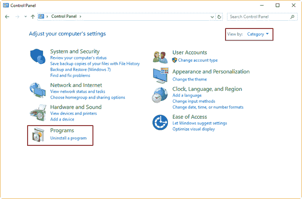

图 1:控制面板中的程序部分

显示**程序**对话框后，点击**打开或关闭**窗口功能，显示**窗口功能**对话框。

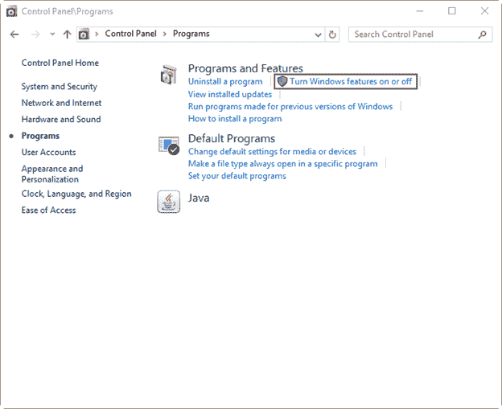

图 2:在程序部分打开或关闭窗口功能

在**窗口功能**对话框中，点击**互联网信息服务**复选框，选择在计算机中托管网站所需的所有功能。您还必须在**万维网服务|应用开发特性**下选择 **CGI** 条目，因为 PHP 使用 CGI，您很快就会看到。

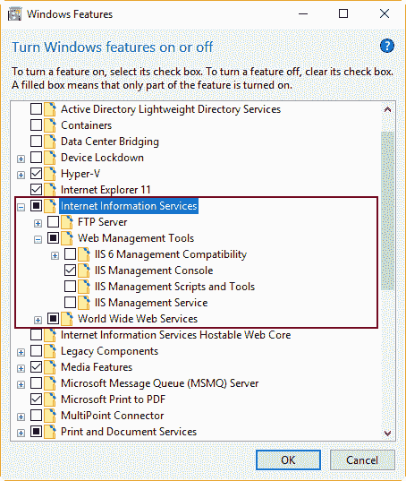

图 3:选定的互联网信息服务功能

之后，点击**确定**开始安装过程。

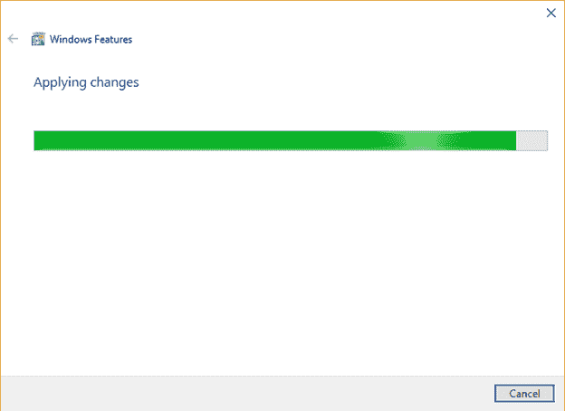

图 4:功能安装进度

过程结束后，运行您的网络浏览器并导航至 **http://127.0.0.1** 以测试安装。

浏览器应该显示下图所示的页面。

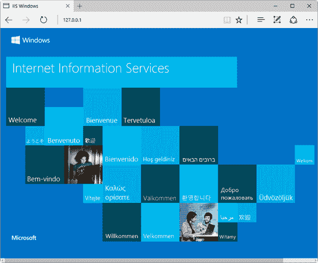

图 5:互联网信息服务主页

如果浏览器中出现图 5 所示的页面，则 IIS 安装成功。

#### 安装 PHP

在 Windows 上安装 PHP 最快最简单的方法是使用 Microsoft Web Platform Installer，它可以自动完成在目标系统中安装和配置 PHP 的过程。安装 PHP 的第二种方法是使用压缩 zip 文件安装。在这种情况下，安装和配置 PHP 应该手动完成。

出于本书的目的，我们将解释 zip 文件的安装过程和手动 PHP 配置。

下载 PHP

每个 PHP 版本都有两个可用的版本:线程安全版本和非线程安全版本(NTS)。线程安全版本适用于网络服务器可以将 PHP 引擎保存在内存中的环境，能够同时为不同的网络请求运行多个执行线程。由于 IIS 的体系结构及其 FastCGI 扩展提供了一个隔离模型，可以将请求分开，因此不需要 PHP 线程安全版本。其结果是在 IIS 上的一个重要的性能改进，因为 PHP 的 NTS 版本避免了不必要的线程安全检查。

根据前面的解释，我们将下载 PHP 的 NTS 版本，并将其安装在我们的计算机上。对于 32 位系统，PHP NTS 版本可以从[这个位置](http://windows.php.net/downloads/releases/php-7.1.4-nts-Win32-VC14-x86.zip)获得。对于 64 位系统，下载网址是[这里](http://windows.php.net/downloads/releases/php-7.1.4-nts-Win32-VC14-x64.zip "笈牘뿸幝ĵ竊")。

部署 PHP

一旦下载了 PHP 包，我们应该将 zip PHP 包中的文件解压到安装 IIS 的计算机系统中我们自行决定的目录中(建议使用 C:\PHP)。

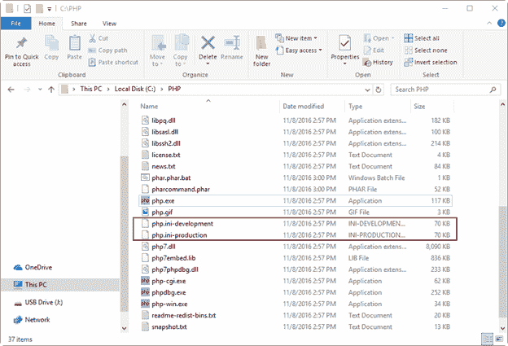

图 6:解压了 PHP 文件的 C:\PHP 文件夹

图 6 显示了 **C:\PHP** 目录下的 PHP 文件。我们可以看到 **php.ini-development** 和 **php.ini-production** 文件被突出显示。这些文件包含使 PHP 工作的配置设置。正如它们的名称所示，文件的一个版本用于开发目的，另一个版本用于在生产环境中部署。为了本书的目的，我们将复制 **php.ini-development** 文件，并将其保存为 **php.ini** (因此我们有原始文件作为备份)。

配置 PHP

我们将使用文本编辑器(通常是记事本. exe)打开 **php.ini** 文件，然后取消注释并修改以下设置。

1.  取消注释并设置`fastcgi.impersonate = 1`。FasctCGI IIS 扩展支持模拟来自调用客户端的安全令牌的能力，允许 IIS 定义运行请求的安全上下文。
2.  取消注释并设置`cgi.fix_pathinfo = 0`。该设置向 PHP 表明`PATH_TRANSLATED`将被设置为`SCRIPT_FILENAME`。
3.  Set `cgi.force_redirect = 0`.
4.  设置`open_basedir`指向网站内容所在的目录(一般为 **C:\inetpub\wwwroot** )。
5.  取消注释并将`extension_dir`设置为指向 PHP 扩展所在的目录(通常为`extension_dir = "./ext"`)。
6.  取消注释并设置`error_log="php_errors.log"` 这对于处理故障排除很有用。
7.  取消注释对应于 PHP 所需的窗口扩展 DLL 的每一行，如图 7 所示。

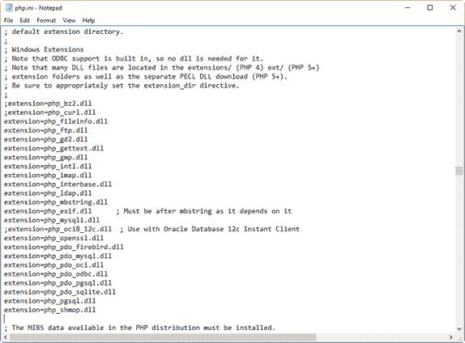

图 7:带有未注释的必需扩展的 php.ini

现在，我们将保存并关闭 **php.ini** 文件。

向系统路径添加 PHP 位置

我们需要将 PHP 位置(通常是 **C:\PHP** )添加到系统路径变量中，以便让 PHP 引擎可供执行。我们应该执行以下步骤来完成这项任务。

首先，右键点击桌面上的**这台电脑**图标。然后，从显示的上下文菜单中单击**属性**选项。将出现以下对话框。

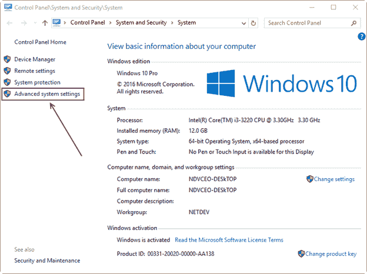

图 8:高级系统设置链接

现在，点击位于对话框左侧面板的**高级系统设置**链接，将出现**系统属性**对话框。接下来，点击**环境变量**按钮。

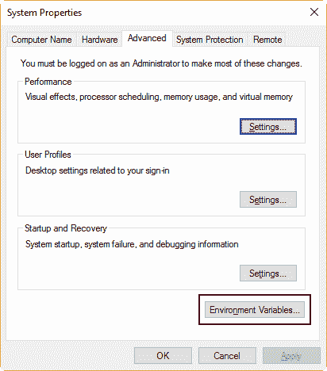

图 9:环境变量按钮

将出现**环境变量**对话框。现在，我们需要在**系统变量**部分选择**路径**变量。

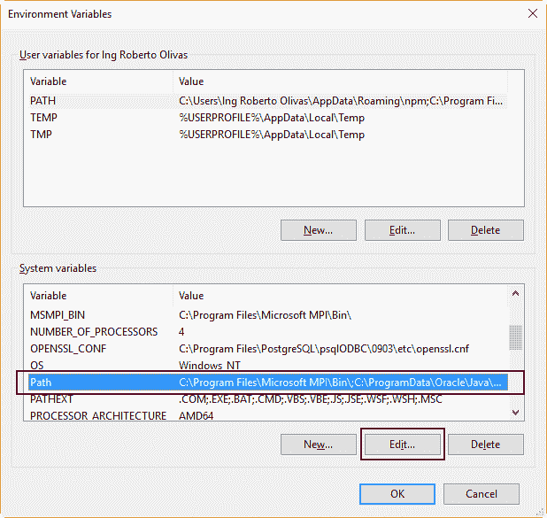

图 10:环境变量对话框中的路径系统变量

接下来，点击**编辑**显示**编辑环境变量**对话框。

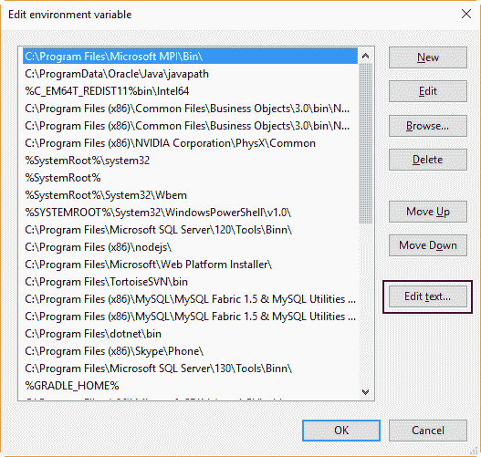

图 11:列表中路径系统变量值

如图 11 所示，Path 系统变量的所有值都显示在一个列表中，可以编辑该列表来添加新的变量或删除一些显示的值。单击**编辑文本**按钮，该按钮可用于使用单行文本修改值。在文本行末尾添加以分号开头的 **C:\PHP** 路径，如下图所示。

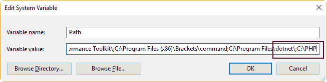

图 12:向路径系统变量添加 C:\PHP 路径

现在，我们要点击**确定**直到我们已经退出**系统属性**窗口。

在 IIS 上配置 PHP

从位于**开始**菜单的**窗口管理工具**部分启动 **IIS 管理器**。

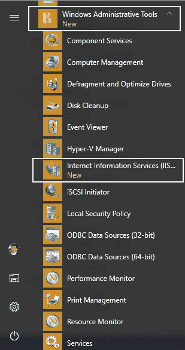

图 13:开始菜单中的 Windows 管理工具

现在，当显示 **IIS 管理器**窗口时，单击标识用作服务器的计算机的主机名。该主机名位于窗口左侧的面板中。

当主机名高亮显示时，双击位于窗口中间面板内 **IIS 部分**中的**处理程序映射**图标，如下图所示。

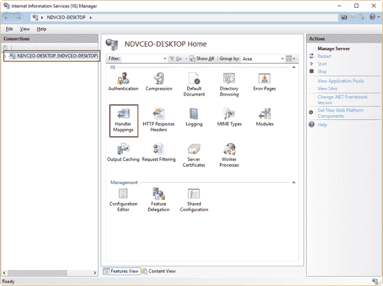

图 14:主机名和处理程序映射按钮

显示**处理程序映射**操作面板。现在，我们应该告诉 IIS 哪个模块负责处理来自客户端的所有 PHP 请求。换句话说，我们将确定哪个程序或库将处理位于服务器中的所有 PHP 代码。要完成此任务，单击位于窗口右侧的**操作**面板中的**添加模块映射** 链接，如下图所示。

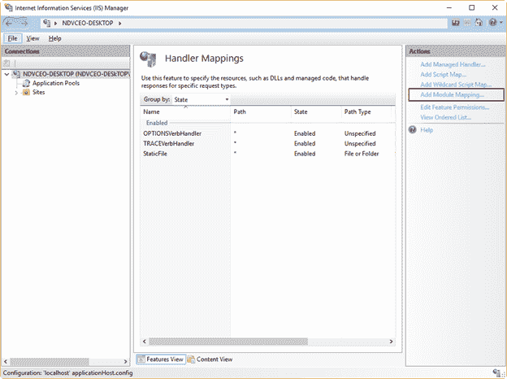

图 15:处理程序映射操作面板

现在，我们将提供以下数据:

*   请求路径: ***。php**
*   模块:**快速计算模块**
*   可执行文件: **C:\PHP\php-cgi.exe**
*   名称: **FastCGI**

有了这些数据，我们告诉 IIS，所有以 **php** 文件扩展名结尾的请求都将由 **FastCGImodule** 扩展名处理，使用位于 php 安装文件夹中的**php-cgi.exe**程序(本例中为 **C:\PHP** )。FastCGI 名称用于标识系统中的模块映射。下图显示了**添加模块映射**对话框中的数据。

|  | 注意:如果快速 CGIModule 条目不在模块下拉控件中，这意味着您没有在 IIS 管理器中启用 CGI。 |

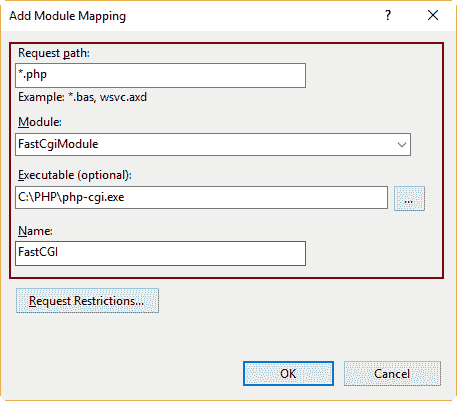

图 16:添加 PHP 模块映射

一旦 PHP 模块映射被添加到系统中，我们需要告诉 IIS 每次接收到 web 请求时，哪些文件将被视为要处理的默认文档。换句话说，我们要指出每次用户在 web 浏览器地址栏中键入 **http://127.0.0.1** 时将执行哪些 php 文件。

为此，单击位于 **IIS 管理器**窗口左侧的计算机主机名。然后，双击**默认文档**图标，如下图所示。

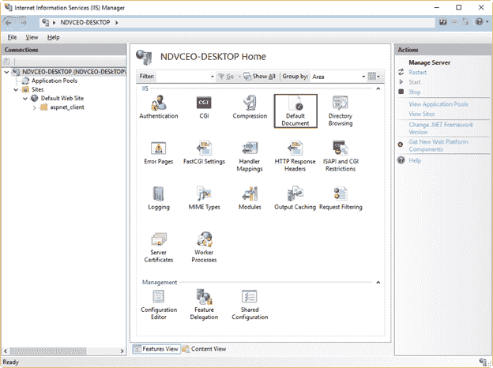

图 17:IIS 部分中的默认文档图标

现在将显示**默认文档**操作面板，所有默认文档定义将出现在屏幕上。要添加新的默认文档，点击窗口右侧的**添加**链接，如下图所示。

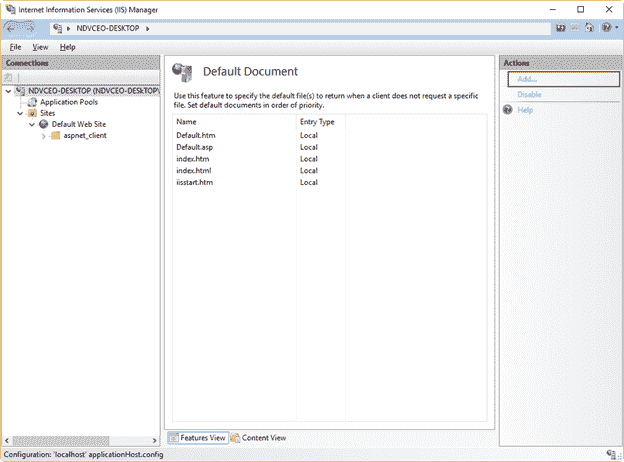

图 18:默认文档操作面板

现在，我们将通过在**添加默认文档**对话框中输入名称，然后单击**确定**来添加**index.php**作为默认文档。下图显示了该任务。

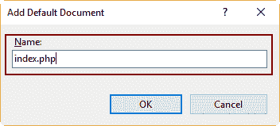

图 19:添加默认文档

如果我们也想添加**default.php**作为默认文档，我们将重复这个过程。

要应用所有这些更改，我们需要重新启动 IIS。为此，单击位于 **IIS 管理器**窗口左侧的计算机主机名。然后，点击窗口右侧的**重启**。

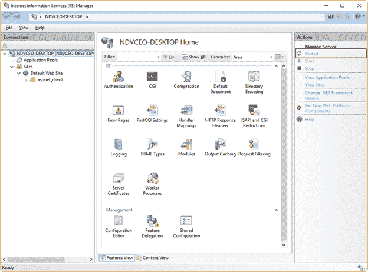

图 20:IIS 管理器窗口中的重启链接

|  | 注意:IIS 根据默认文档操作面板中显示的列表从上到下搜索默认文档。当找到其中一个文档时，将执行该操作并停止搜索。 |

## 测试安装过程

现在我们应该测试安装过程。为了完成这个任务，创建一个名为**phpinfo.php**的文本文件，并将其保存到网站根文件夹中(通常是 **C:\inetpub\wwwroot** )。该文件应包含以下代码。

代码清单 1: PHP 测试程序

```php
  <?php phpinfo();
  ?>

```

### 在本地计算机中测试

启动微软 Edge 的一个实例，在地址栏输入**http://127 . 0 . 0 . 1/phpinfp . PHP**，按**进入**。结果应该如下图所示。

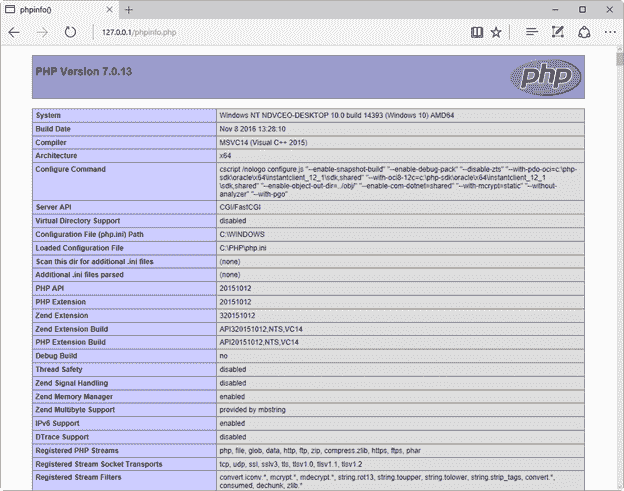

图 21:从本地计算机测试 PHP 安装

### 从远程计算机进行测试

在连接到 IIS 计算机插入的同一网络的计算机上启动 web 浏览器实例。然后，假设 IIS 计算机 IP 地址为 192.168.0.67，在地址栏中键入**http://192 . 168 . 0 . 67/phpinfo . PHP**，按**进入**。在我的例子中，我使用了一台带有 Ubuntu Desktop 的计算机作为操作系统，使用了 Mozilla Firefox 作为网络浏览器。结果如下图所示。

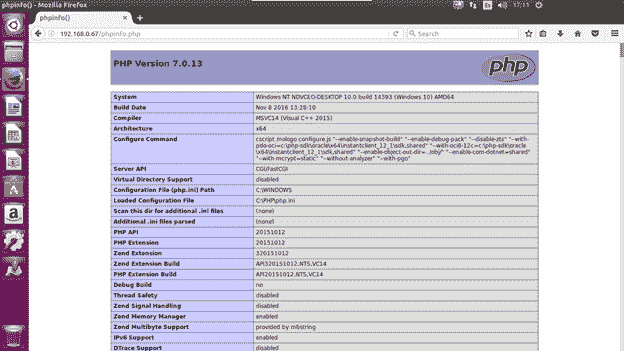

图 22:从运行 Ubuntu 的远程计算机测试 PHP

## 章节总结

本章解释了如何在使用 IIS(互联网信息服务)作为网络服务器的 Windows 环境中部署 PHP。要执行此部署，应满足以下要求:

*   计算机应该安装并运行 Windows 操作系统。
*   已安装并配置 IIS。

要在 Windows 10 计算机上安装 IIS，您应该转到**控制面板**中的**程序**部分，然后单击**打开或关闭 Windows 功能**。之后，您应该点击**窗口功能**对话框中的**互联网信息服务**复选框，以便为网络服务器安装带有默认功能的 IIS。点击**确定**按钮即可开始 IIS 安装过程。

现在，要在计算机上安装 PHP，您应该从 32 位系统的[这个位置](http://windows.php.net/downloads/releases/php-7.1.4-nts-Win32-VC14-x86.zip "翂ቘ뿾빝į⒀窴")下载 zip 安装包，或者从 64 位系统的[这个位置](http://windows.php.net/downloads/releases/php-7.1.4-nts-Win32-VC14-x64.zip "翂ቘ뿾빝į⒀窴")下载 zip 安装包。下载完成后，您应该将 zip 文件解压到名为**的文件夹中。**

要配置 PHP，文件 **php.ini-development** 应该改名为 **php.ini** 。然后，为了调整一些 PHP 工作参数以符合 IIS 要求，应该对其进行编辑。

作为最后一步，您应该将 **C:\PHP** 添加到 Path 系统变量中，并打开 IIS 管理器将 PHP 设置为将处理所有内容的程序。来自网络中任何客户端的 php web 请求。

现在，您应该通过在网站根文件夹(通常为 **C:\inetpub\wwwroot** )中创建名为**phpinfo.php 的文本文件来测试安装过程。该文件应包含以下编程代码:`<?php phpinfo(); ?>`。然后，你应该从网页浏览器中输入**http://127 . 0 . 0 . 1/phpinfo . php**，结果应该会显示 PHP 安装信息。**