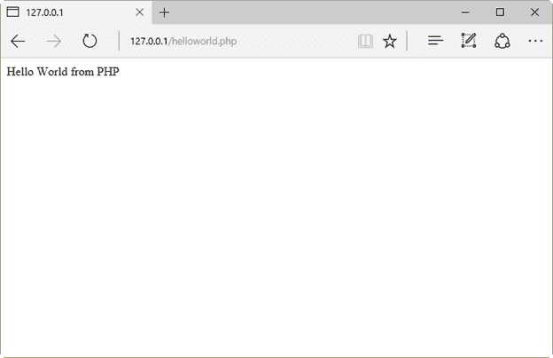
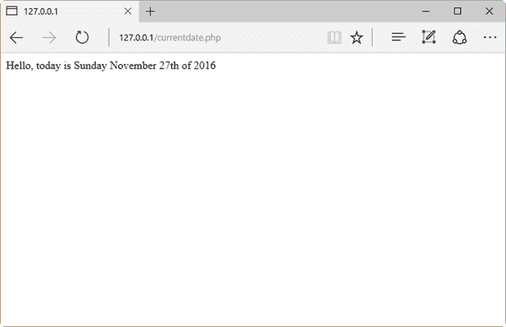
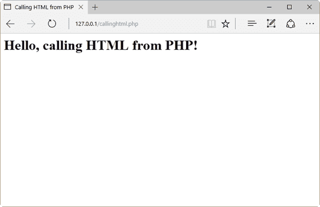
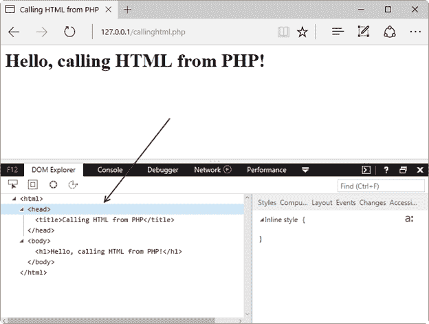
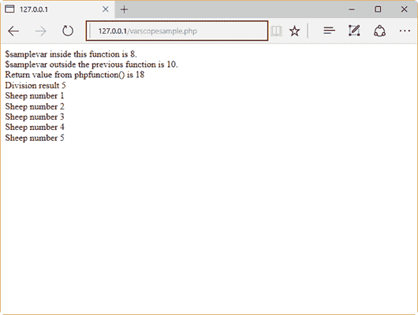
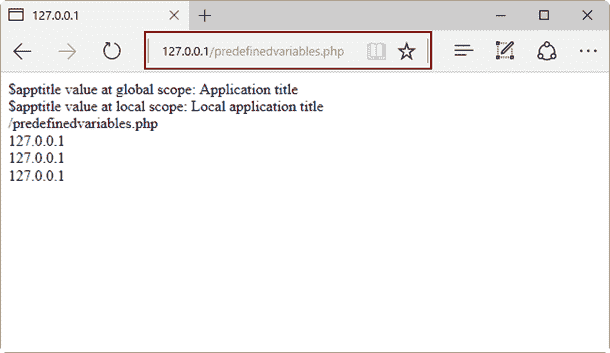

# 第三章 PHP 基础

## 脚本:PHP 的基本概念

### 什么是剧本？

PHP 中的脚本是用。包含纯 php 编程代码的 PHP 扩展，或者嵌入到 HTML 中的 PHP 编程代码。那个。文件名中需要 php 扩展名，这样文件就可以被 PHP 引擎识别为功能脚本。

每个 PHP 脚本都有以下语法。

代码清单 2: PHP 脚本语法

```
  <?php
     /* PHP code goes
  here */ 
  ?>

```

我们可以将 PHP 代码嵌入到 HTML 中。在这种情况下，脚本的语法与前面代码清单中显示的代码相同，但它在 HTML 语句中。下面的代码展示了一个嵌入到 HTML 中的 PHP 示例。

代码清单 3:嵌入到 HTML 中的 PHP

```
  <html>
  <head></head>
  <body>
  Hello, today is
  <?php echo date("l F jS \of Y"); ?>
  </body>
  </html>

```

### 脚本样本

#### 永远存在的你好世界

为了用 PHP 说“你好世界”，我们将创建一个名为**helloworld.php**的文件，并将其保存到我们的网站根文件夹中。该文件的代码显示在下面的示例中。

代码清单 4:你好世界示例

```
  <?php
    echo 'Hello World
  from PHP';
  ?>

```

现在，如果我们在网页浏览器的地址栏中输入**http://127 . 0 . 0 . 1/hello world . PHP**，应该会看到如下图所示的内容。



图 23:你好世界示例输出

#### 显示当前日期

以下示例使用纯 PHP 代码显示当前日期。您应该将文件保存为**currentdate.php**。

代码清单 5:显示当前日期

```
  <?php
    echo 'Hello, today is
  '; 
    echo date("l F
  jS \of Y");
  ?>

```

再次，在 web 浏览器地址栏中键入**http://127 . 0 . 0 . 1/current date . PHP**，应该会看到如下图所示的内容。



图 24:显示当前日期样本的输出

#### 从 PHP 示例调用 HTML

正如第 1 章所解释的，PHP 能够调用 HTML 代码。下面的代码示例演示了这个特性。

代码清单 6:从 PHP 调用的 HTML

```
  <?php 
    echo
  "<html>\n<head>\n<title>Calling HTML from
  PHP</title>\n</head>\n<body>\n<h1>Hello, calling HTML
  from PHP!</h1>\n</body>\n</html>";
  ?>

```

至此，`echo`语句已经出现在所有样本中。该语句将放置在它旁边的字符串内容发送到标准输出设备。对于网络服务器，标准输出设备向调用客户端(通常是网络浏览器)发送请求响应。

在上一个示例中，`echo`语句向调用客户端发送显示**所需的 HTML 代码“你好，从 PHP 调用 HTML！”**在网络浏览器中。为了测试这个示例，我们应该将代码保存在名为**callinghtml.php**的文件中。然后，从网页浏览器的地址栏中，我们会键入**http://127 . 0 . 0 . 1/calling html . PHP**，显示的输出会如下图所示。



图 25:从一个 PHP 脚本中调用 HTML

如果我们想知道哪个响应被发送到浏览器，我们应该按下 **F12** 键，在 DOM Explorer 中获得以下代码。

代码清单 7:发送给浏览器的 PHP 响应

```
  <html>
  <head>
  <title>Calling
  HTML from PHP</title>
  </head>
  <body>
  <h1>Hello,
  calling HTML from PHP!</h1>
  </body>
  </html>

```

下图显示了 DOM 资源管理器。



图 26:显示 PHP 响应的 DOM 浏览器

如图 26 所示，示例 PHP 脚本发送纯 HTML 代码作为对 web 浏览器请求的响应。

## 变量

和大多数编程语言一样，在 PHP 程序中存储数据的主要方式是使用变量。变量是一个可以动态保存数据的标识符，这意味着存储在变量中的数据可以在执行流程中根据程序的需要而变化。

### 在 PHP 中声明和使用变量

变量声明以及这些变量在 PHP 中的使用应该符合以下要求。

*   所有变量名都用前导美元符号(`$`)表示。
*   变量名必须以字母或下划线字符开头。
*   像+、-、%、(、)、。、和&不能使用。
*   变量可以在赋值前声明，但这不是绝对必要的。
*   变量没有内部类型；变量不能预先知道它将用于存储数字还是字符串。
*   将变量从一种类型转换为另一种类型是自动执行的。
*   使用`=`运算符执行变量赋值，将变量放在左侧，将待求值的表达式放在右侧。
*   变量值是其最近赋值的值。

### 变量类型

下表总结了 PHP 中可用的数据类型。

表 2: PHP 数据类型

| 数据类型 | 描述 |
| --- | --- |
| 整数 | 没有小数点的整数 |
| 两倍 | 浮点数，如 1.31313 或 34.5 |
| 布尔代数学体系的 | 有两个可能值的类型，真或假 |
| 空 | 空值 |
| 线 | 像“你好世界”或“姓氏”这样的字符序列 |
| 排列 | 值的命名和索引集合 |
| 目标 | 程序员定义的类的实例，这些类封装了特定于该类的属性(值)和方法(函数) |
| 资源 | 保存对 PHP 外部资源引用的特殊数据类型，如数据库连接 |

下面的代码示例显示了一系列声明的变量，每个变量存储一个值，该值对应于上表中描述的数据类型之一。

代码清单 8:用 PHP 声明变量

```
  $var_double = 3 +
  0.14159;
  $var_integer = 4;
  $var_string =
  "This is a PHP variable";
  $var_array =
  array("An array element","Other element");
  $var_boolean = TRUE;
  $var_null = NULL;

```

### 可变范围

变量的范围可以定义为该变量的可用性范围，从声明该变量的程序开始。因此，在这种情况下，我们可以有以下几种范围。

*   局部变量——只能在声明程序中引用的变量。一旦这个程序完成了它的执行，所有的局部变量都会被销毁。
*   全局变量——可在执行线程的任何部分访问的变量，从声明该变量的程序开始。为了让 PHP 将一个变量识别为全局变量，必须在变量名称前声明前缀`GLOBAL`。当执行的线程结束时，所有全局变量都被销毁。
*   函数参数–在函数名后和括号内声明的变量。函数参数的范围是函数本身。
*   静态变量–在函数内部声明的变量，其名称前带有单词`STATIC`。与函数参数不同，静态变量在函数退出时保持其值，当再次调用函数时，该值将被保留。

下面的示例代码显示了不同的作用域是如何工作的。

代码清单 9:变量范围

```
  <?php
  //Local variables
  $samplevar = 10;
  function sumvars() {
         $a = 5;
        $b = 3;
         $samplevar = $a
  + $b;   //$samplevar is local variable inside this function
        echo
  "\$samplevar inside this function is $samplevar. <br />";
  }
  sumvars();
  echo "\$samplevar
  outside the previous function is $samplevar. <br />";
  //Function parameters
  function
  phpfunction($parameter1,$parameter2)
  {
        return
  ($parameter1 * $parameter2);
  }
  $funcval =
  phpfunction(6,3);
  echo "Return value
  from phpfunction() is $funcval <br />";

  //Global
  variables
  $globalvar =
  55;

  function
  dividevalue() {
        GLOBAL
  $globalvar;
        $globalvar/=
  11;
        echo
  "Division result $globalvar <br />";
  }

  dividevalue();

  //Static variables
  function
  countingsheeps()
  {
     STATIC $sheepnumber
  = 0;
     $sheepnumber++;
     echo "Sheep
  number $sheepnumber <br />";   
  }

  countingsheeps();
  countingsheeps();
  countingsheeps();
  countingsheeps();
  countingsheeps();

  ?>

```

如果我们将前面的代码复制到网站根文件夹( **C:\Inetpub\wwwroot** )中名为**varscopesample.php**的文件中，并在 web 浏览器的地址栏中键入**http://127 . 0 . 0 . 1/varscopesamle . PHP**，应该会显示以下输出。



图 27:变量范围示例结果

### 预定义变量

任何运行的脚本都可以使用一系列变量。此外，PHP 提供了一组预定义的数组，包含来自环境、web 服务器和用户输入的变量。这些阵列被称为*超全局*。下表总结了超级全局变量。

表 3: PHP 超级全局摘要

| 超全球 | 描述 |
| --- | --- |
| `$GLOBALS` | 该数组包含对脚本中每个全局变量的引用。每个全局变量的名称都是这个数组的一个键。 |
| `$_SERVER` | 此数组包含有关 web 服务器环境的信息，如标题、路径和脚本位置。由于这些值是由正在使用的 web 服务器创建的，因此其中一些值在某些环境中可能不存在。 |
| `$_GET` | 这个数组包含通过 HTTP `GET`方法传递给脚本的所有变量的关联。 |
| `$_POST` | 这个数组包含通过 HTTP `POST`方法传递给脚本的所有变量的关联。 |
| `$_FILES` | 该数组包含通过 HTTP `POST`方法上传到脚本的所有项目的关联。 |
| `$_COOKIE` | 该数组包含通过 HTTP cookies 传递给脚本的所有变量的关联。 |
| `$_REQUEST` | 该数组包含与`$_GET`、`$_POST`和`$_COOKIE`内容的关联。 |
| `$_SESSION` | 该数组包含与脚本可用的所有会话变量的关联。 |
| `$_PHP_SELF` | 包含使用此变量的脚本文件名的字符串。 |
| `$php_errormsg` | 包含 PHP 生成的最后一条错误消息的字符串变量。`$php_errormsg` 变量不是真正的超全局对象，但关系密切。 |

下面的代码显示了预定义变量的一些示例。

代码清单 10:预定义变量示例

```
  <?php
    /* $GLOBALS example*/
    $apptitle =
  "Application title"; //This is a global variable
    function locals()
    {
          $apptitle =
  "Local application title";
          echo
  "\$apptitle value at global scope: " .
  $GLOBALS["apptitle"] . "<br />";
          echo
  "\$apptitle value at local scope: " . $apptitle . "<br
  />";
    }

    locals();

    /* $_SERVER example
  */
    echo
  $_SERVER['PHP_SELF'] . "<br />"; //Script filename relative
  to the website root
    echo
  $_SERVER['SERVER_NAME'] . "<br />"; //Server name or Server
  IP Address
    echo
  $_SERVER['REMOTE_ADDR'] . "<br />"; //The IP address of the
  client computer
    echo
  $_SERVER['REMOTE_HOST'] . "<br />"; //The host name or IP
  address of the client computer

  ?>

```

|  | 注意:所有超级全局的详细示例超出了本书的范围。 |

假设前面的示例保存在名为**predefinedvariables.php**的文件中，如果我们在 web 浏览器的地址栏中键入**http://127 . 0 . 0 . 1/predefinedvariables . PHP**，应该会得到如下输出。



图 28:超级全局样本输出

## 常数

常数是保存简单值的标识符。该值在脚本执行期间不能更改。

### 命名常数

默认情况下，常量区分大小写。PHP 中的一个很好的做法是常量名称应该总是大写。常量名称可以以字母或下划线开头。

### 定义常数

在 PHP 中，所有常量都是由`define()`函数定义的。要检索常量的值，我们必须指定它的名称。我们也可以使用`constant()`功能读取一个常量值。与变量不同，我们不需要在常量名称的开头使用美元(`$`)符号。

下面的代码示例显示了如何定义和读取常数值。

代码清单 11:常数示例

```
  <?php

  define("WEBPAGEWIDTH", 100);

     echo WEBPAGEWIDTH;
  //Retrieving constant value using its name directly
     echo
  constant("WEBPAGEWIDTH"); //Retrieving constant value with
  constant() function
  ?>

```

## 操作员

运算符是一种符号，用于将过程执行到表达式中。这个过程也被称为操作。

代码清单 12:运算符示例

```
  $total = $subtotal +
  $tax;

```

在这个代码示例中，`$subtotal + $tax`是一个表达式。该表达式中要执行的过程是将`$subtotal`变量的值与`$tax`变量的值相加。这个过程用加号(`+`)表示，这个符号叫做运算符。$ `subtotal`和$ `tax`变量称为操作数。

PHP 支持一些类型的操作符，这将在下面的章节中解释。

### 算术运算符

下表总结了算术运算符的使用，这些运算符用于执行算术运算。

表 4: PHP 算术运算符摘要

| 操作员 | 描述 |
| --- | --- |
| `+` | 将两个操作数的值相加 |
| `-` | 从第一个操作符中减去第二个操作符的值 |
| `*` | 将两个操作数相乘 |
| `/` | 将分子操作数(位于左侧)除以去分子操作数(位于右侧) |
| `%` | 获取两个操作数之间整数除法的余数 |
| `++` | 将整数运算符的值增加 1 |
| `--` | 将整数运算符的值减少 1 |

|  | 注意:从技术上讲，++和-也可以被认为是赋值运算符。 |

### 比较运算符

正如类型名所暗示的，比较运算符用于检查两个操作数之间的标准是否满足。如果操作数符合检查的标准，比较操作返回的结果将是`true`布尔值。否则，将返回一个`false`布尔值。下表总结了这些运算符。

表 5: PHP 比较运算符摘要

| 操作员 | 描述 |
| --- | --- |
| `==` | 检查两个操作数的值是否相等 |
| `!=` | 检查放在左边的操作数的值是否不等于放在右边的操作数的值 |
| `>` | 检查放在左边的操作数的值是否大于放在右边的操作数的值 |
| `<` | 检查左侧操作数的值是否小于右侧操作数的值 |
| `>=` | 检查左侧操作数的值是否大于或等于右侧操作数的值 |
| `<=` | 检查左侧操作数的值是否小于或等于右侧操作数的值 |

### 逻辑运算符

这些运算符用于在两个操作数之间执行逻辑运算。逻辑运算是返回`true`或`false`的过程，这取决于两个操作数的逻辑状态(真或假)。下表总结了这些运算符。

表 6:逻辑运算符摘要

| 操作员 | 描述 |
| --- | --- |
| `and` | 逻辑`AND`。如果两个操作数都为真，则返回`true`。 |
| `or` | 逻辑`OR`。如果两个操作数中的任何一个为真，则返回`true`。 |
| `xor` | 如果两个操作数中的任何一个为真，则返回`true`，但不是两个都为真。 |
| `&&` | 逻辑`AND`。如果两个操作数都为真，则返回`true`。 |
| `&#124;&#124;` | 逻辑`OR`。如果两个操作数中的任何一个为真，则返回`true`。 |
| `!` | 逻辑`NOT`。反转其操作数的逻辑状态；如果操作数为真，则变为`false`，反之亦然。 |

### 赋值运算符

这些运算符用于将值存储到操作数中。在这种情况下，要存储的值放在右侧，而将接收该值的操作数放在左侧。下表总结了这些运算符。

表 7:分配运算符汇总

| 操作员 | 描述 |
| --- | --- |
| `=` | 简单赋值运算符。存储从右侧到左侧操作数的值。 |
| `+=` | 添加并分配运算符。将右侧操作数的值与左侧操作数的值相加，然后将结果赋给左侧操作数。 |
| `-=` | 减法和赋值运算符。从左边操作数的值中减去右边操作数的值，然后将结果赋给左边操作数。 |
| `*=` | 乘法和赋值运算符。将右侧操作数的值乘以左侧操作数的值，然后将结果赋给左侧操作数。 |
| `/=` | 除法和赋值运算符。将左侧操作数的值除以右侧操作数的值，然后将结果赋给左侧操作数。 |
| `%/` | 模数和赋值运算符。将左侧操作数的值除以右侧操作数的值，然后将余数赋给左侧操作数。 |

### 条件运算符

条件运算符(表示为`? :`)执行内联决策过程。它计算位于`?`符号左侧的表达式的逻辑状态，然后执行两个给定表达式中的一个，两个表达式都用`:` 符号分隔。如果表达式的逻辑状态为真，则执行置于`:`符号左侧的表达式；否则，执行右侧表达式。下面的代码示例说明了这一点。

代码清单 13:条件运算符代码示例

```
  $total = $subtotal +
  $tax;
  $discount = $total <
  150 ? $total*0.15 : $total*0.20;
  /*
  $discount receives a
  value depending of $total value. If $total is less than 150, then $discount
  receives the result of multiplying $total by 0.15\. Otherwise, the result of
  multiplying $total by 0.20 is assigned to $discount
  */

```

### PHP 中运算符的优先级

运算符优先级是在表达式中执行某种操作(由运算符本身定义)的顺序。让我们考虑下面的代码示例。

代码清单 14:解释运算符优先级的表达式示例

```
  $tax = $subtotal -
  $discount * $taxrate;

```

这个表达式将执行三种运算:减法、乘法和赋值。这里要找出的重要事情是计算机执行操作的顺序。这取决于运算符的优先级。

为了更好地理解运算符优先级，我们应该将运算符分为以下几类。

*   一元运算符:位于单个操作数之前的运算符
*   二进制运算符:接受两个操作数的运算符
*   三元运算符:根据第一个操作数的值，取三个操作数并计算第二个或第三个操作数的运算符
*   赋值运算符:为操作数赋值的运算符

考虑到这些类别，下表规定了在表达式中从上到下执行运算符的顺序。

表 8:运算符优先级表

| 结合性 | 操作员 | 附加说明 |
| --- | --- | --- |
| 非联想性的 | *克隆* *新* | 克隆和新建 |
| 左边的 | *[* | 数组() |
| 正确 | **** | 算术 |
| 正确 | *++**-**~**(int)**(float)**(string)**(array)**(object)**(bool)**@* | 类型和增量/减量 |
| 非联想性的 | 实例 | 类型 |
| 正确 | *！* | 逻辑学的 |
| 左边的 | *** */* *%* | 算术 |
| 左边的 | *+* *-* *。* | 算术和字符串 |
| 左边的 | *< <* *> >* | [逐位](http://php.net/manual/en/language.operators.bitwise.php) |
| 非联想性的 | *<**<=**>**>=* | [对比](http://php.net/manual/en/language.operators.comparison.php) |
| 非联想性的 | *==* *！=* *===* *！= =**<>**<=>* | [对比](http://php.net/manual/en/language.operators.comparison.php) |
| 左边的 | *&* | [逐位](http://php.net/manual/en/language.operators.bitwise.php)和 |
| 左边的 | *^* | [逐位](http://php.net/manual/en/language.operators.bitwise.php) |
| 左边的 | *&#124;* | [逐位](http://php.net/manual/en/language.operators.bitwise.php) |
| 左边的 | *& &* | [逻辑](http://php.net/manual/en/language.operators.logical.php) |
| 左边的 | *&#124;&#124;* | [逻辑](http://php.net/manual/en/language.operators.logical.php) |
| 正确 | *？？* | [对比](http://php.net/manual/en/language.operators.comparison.php) |
| 左边的 | *？:* | [三元](http://php.net/manual/en/language.operators.comparison.php#language.operators.comparison.ternary) |
| 正确 | *=**+=**-=*** =*** * =**/=**。=**% =**&=**&#124; =**^=**<<=**>>=* | [分配](http://php.net/manual/en/language.operators.assignment.php) |
| 左边的 | *和* | [逻辑](http://php.net/manual/en/language.operators.logical.php) |
| 左边的 | *异或* | [逻辑](http://php.net/manual/en/language.operators.logical.php) |
| 左边的 | *或* | [逻辑](http://php.net/manual/en/language.operators.logical.php) |

现在，如果我们查看代码清单 14，计算机将首先用$ `discount`乘以$ `taxrate`(乘法运算符优先)，然后从$ `subtotal`中减去运算结果。

## 字符串

字符串是一个字符序列，就像“简洁地欢迎使用 PHP 电子书示例”，它可以被分配给一个变量或者直接由一个 PHP 语句处理。

下面的代码示例演示了字符串的使用。

代码清单 15:使用字符串

```
  <?php

    $salutation =
  "Good morning";
    echo $salutation .
  ", today is " . date("l F jS \of Y") . "<br
  />";

  ?>

```

请注意，字符串有两种不同的用途:一种是分配给变量的字符串，另一种是由 PHP 语句直接处理的字符串(本例中为`echo`)。`echo`语句后面的表达式中使用的点称为连接运算符，用于连接两个字符串的内容，从左到右计算它们。

字符串可以用单引号(')或双引号(")来分隔，但是根据使用的分隔符，字符串的处理方式有很大的不同。用单引号分隔的字符串按字面意思处理，而双引号字符串用它们的值替换变量，以防字符串中包含变量名。此外，双引号字符串解释以反斜杠(`\`)开头的某些字符序列，也称为转义序列替换。下表总结了这些序列。

表 9:转义序列替换汇总

| 换码顺序 | 更换 |
| --- | --- |
| `\n` | 替换为换行符 |
| `\r` | 替换为回车符 |
| `\t` | 替换为制表符 |
| `\$` | 换成了美元符号本身。这避免了将美元符号解释为变量名的起始字符。 |
| `\"` | 替换为单双引号 |
| `\'` | 替换为单引号 |
| `\\` | 替换为反斜杠 |

下面的代码展示了一点关于字符串处理的知识。

代码清单 16:根据分隔符处理字符串

```
  <?php
     $somevariable =
  "Hello";
     $literalstring =
  'The $somevariable will not print its contents';

  print($literalstring);
     print("<br
  />");

     $literalstring =
  "$somevariable will print its contents";
     echo $literalstring;
  ?>

```

如前一个示例所示，当变量名出现在单引号字符串中时，它被视为字符串本身的一部分。但是，当相同的变量名被放入双引号字符串中时，它会在打印字符串时被替换为自己的内容。

## 阵列

我们可以将数组定义为用于保存一个或多个相似类型值的数据结构。也就是说，如果我们需要存储 50 个不同的字符串，我们可以使用一个数组来放置它们，而不是声明 50 个字符串变量。我们可以在 PHP 中创建以下类型的数组:

*   数字数组–具有数字索引的数组，其值以线性顺序访问和存储
*   关联数组–以字符串为索引的数组。存储在其中的值与键值而不是线性索引顺序相关联
*   多维数组–包含一个或多个数组及其值的数组使用多个索引进行访问

可以使用`array()`函数创建数组，或者通过声明将存储数组的变量的名称，后跟括在括号中的索引来创建数组。下面的代码示例演示如何创建数组。

代码清单 17:PHP 中的数组

```
  <?php
     /* First method to
  create array. */
     $intnumbers = array(
  1, 2, 3, 4, 5);

     /* We iterate the
  array */  
     foreach( $intnumbers
  as $value ) {
      echo "Array
  member value is $value <br />";
     }

     /* Second method to
  create array. */
     $letternumbers[0] =
  "one";
     $letternumbers[1] =
  "two";
     $letternumbers[2] =
  "three";
     $letternumbers[3] =
  "four";
     $letternumbers[4] =
  "five";

     foreach(
  $letternumbers as $value ) {
     echo "Array
  member value is $value <br />";
   }
  ?>

```

我们刚刚看到了如何创建一个数字数组。现在，让我们看看如何创建一个关联数组。

代码清单 18:关联数组

```
  <?php
     $intnumbers =
  array("one" => 1,"two" => 2,"three" =>
  3,"four" => 4,"five" => 5);

     /* We iterate the
  array */  
     foreach( $intnumbers
  as $k => $value ) {
      echo "$k =>
  $value <br />";
     }
  ?>

```

## 决策

PHP 提供了一组关键词来根据条件采取行动。如果满足条件，则执行一些语句；否则，脚本可能什么也不做，或者执行另一组不同的语句。

### 如果其他人…还有

如果满足某个条件，`if`语句会执行一些代码。如果没有，执行跳转到`elseif`子句，并计算放在其后的表达式。当`elseif`子句后的表达式计算为`true`时，将执行该子句中的代码。如果表达式的计算结果为`false`，则执行`else`子句中的代码。

让我们看看下面的代码示例。

代码清单 19:if else if 的使用...else 语句

```
  <?php

  date_default_timezone_set("Etc/GMT+7");
    $hour = date('H');
    if ($hour >=0
  && $hour < 12)
        echo "Good
  Morning!";
    elseif ($hour >=
  12 and $hour < 19)
      echo "Good
  afternoon!";
    else
        echo "Good
  Evening!";
  ?>

```

前面的代码根据一天中的小时显示问候消息，该消息存储在$ `hour`变量中。`if elseif … else`语句从位于`if`语句之后的条件开始计算`$hour`变量。如果满足条件，将打印语句中的问候语。否则，现在评估`elseif`声明后的状况。同样，如果满足该条件，将打印`elseif`内的问候信息。如果没有，则打印`else`语句中的问候信息。然后，执行结束。

|  | 注意:我们可以省略 elseif 语句，以获得双向决策。 |

### 切换语句

`switch`语句允许我们根据一个表达式的比较来执行一段代码，该表达式放在语句声明后的括号内，一系列值放在单独的`case`子句中的每一个值中。每个`case`子句都有一个关联的代码块。当链接到`switch`语句的表达式等于该`case`子句中的值时，将执行该代码。下面的示例说明了该语句的用法。

代码清单 20:使用 Switch 语句

```
  <?php

  date_default_timezone_set("Etc/GMT+7");
    $hour = date('H');
    $dow  =
  date("D");

    if ($hour >=0
  && $hour < 12)
        $greeting =
  "Good Morning!";
    elseif ($hour >=
  12 and $hour < 19)
      $greeting =
  "Good afternoon!";
    else
        $greeting =
  "Good Evening!";

    switch ($dow){
              case
  "Mon":
                 echo
  $greeting . ", today is Monday";
                 break;
              case
  "Tue":
                 echo
  $greeting . ", today is Tuesday";
                 break;
              case
  "Wed":
                 echo
  $greeting . ", today is Wednesday";
                 break;
              case
  "Thu":
                 echo
  $greeting . ", today is Thursday";
                 break;
              case
  "Fri":
                 echo
  $greeting . ", today is Friday";
                 break;
              case
  "Sat":
                 echo
  $greeting . ", today is Saturday";
                 break;
              case
  "Sun":
                 echo
  $greeting . ", today is Sunday";
                 break;
              default:
                 echo
  $greeting . "What day is this?";
           }  
   ?>

```

在这个代码示例中，`switch`语句用于显示星期几的名称以及问候消息。首先，我们调用`date(‘D’)`函数，它在`$dow`变量中存储一周中某一天名称的缩写版本。然后，根据存储在$ `dow`变量中的值，我们使用`switch`来执行带有相应全天名称的`echo`语句。

## 循环

循环语句允许您重复执行同一个代码块，或者在满足特定条件的情况下执行特定次数，或者直到数据结构中的一系列元素都被迭代。PHP 支持以下循环语句:

*   `for`–在代码块中循环指定次数
*   `while`–当满足特定条件时，循环通过一个代码块
*   `do … while`–在一个代码块中循环一次，只要建立的条件为真，就重复执行
*   `foreach`–循环遍历一个代码块的次数与数组中元素存在的次数相同

下面的代码片段解释了前面每个循环语句的语法。

代码清单 21:用于语句语法

```
  for(initializer=initial
  value; condition; increment)
  {
         //code to be
  executed
  }
  /*
  The initializer is used
  as a counter of the number of times the code block will be executed.

  The condition is an
  expression which can be evaluated either true or false, and in this case this
  condition establishes the final value the initializer can take, before the
  loop ends.

  The increment is a
  value which will be added to or subtracted from the initializer, in order to keep
  the initializer from going beyond the final value established in the
  condition, making the loop end.
  */

  //Example.
  for( $iteration =
  0;$iteration <= 10;$iteration++)
  {
       echo
  "$iteration";
  }

```

代码清单 22: while 语句语法

```
  while(condition)
  {
         //code to be
  executed
  }
  /*
  Condition is an
  expression which evaluates either true or false. When it evaluates to false,
  the loop ends.
  */

  //Example.
  $sheepnumber = 0;
  while ($sheepnumber
  < 11)
  {
        echo "Sheep
  number $sheepnumber";
        $sheepnumber++;
  }

```

代码清单 23:做...while 语句语法

```
  do
  {
         //code to be
  executed
  }
  while(condition)
  /*
  The code block within
  curly brackets is executed once. After that, condition is evaluated.
  Condition is an
  expression which evaluates either true or false. When it evaluates to false,
  the loop ends.
  */

  //Example.
  $sheepnumber = 1;
  do
  {
     echo "Sheep number
  $sheepnumber";
     $sheepnumber++;
  }
  while ($sheepnumber
  < 11);
  $totalsheeps =
  $sheepnumber – 1;
  echo "We count
  only $sheepnumber sheeps";

```

代码清单 24: foreach 语句语法

```
  foreach (arrayname as
  value)
  {
    //Code to be executed
  }
  /*
  The code block within
  curly brackets is executed as many times as there are elements in the array that
  is evaluated.
  */

  //Example.
  $sheepsarray =
  array(1,2,3,4,5,6,7,8);
  foreach($sheepsarray as
  $value)
  {
     echo "Sheep
  number $value <br/>";
  }

```

### 继续和中断特殊关键字

循环中有两个特殊的关键词可以使用:`break`和`continue`。

*   `break`关键字提前终止循环的执行。
*   `continue`关键字暂停循环的执行并开始新的迭代。

让我们看看下面的代码示例。

代码清单 25:中断并继续示例

```
  <?php
    $subtotal = 3.5;
    while (true)
    {
      $taxrate =
  rand(0,10);
      if ($taxrate == 10)
  break;

      if ($taxrate == 0)
  continue;
      $taxvalue =
  $subtotal*($taxrate/100);
      echo "Tax to
  be payed $taxvalue <br />";
    }   
  ?>

```

该代码显示无限期执行`while`循环(建立的条件始终是`true`)。用来结束这个循环的机制是`break`关键字。仅当变量$ `taxrate`取值为`10`时，才执行该关键字。如果不是，则继续执行代码，如果$ `taxrate`变量求值为`0`，则循环停止并开始新的迭代，因此不执行`echo`语句。

## 章节总结

本章从脚本的概念开始，讲述了 PHP 的基础知识。PHP 中的脚本是一个文本文件，其中包含纯 PHP 编程代码，或者嵌入到 HTML 中的 PHP 编程代码，并在 web 服务器中执行。

与大多数编程语言一样，在 PHP 程序中存储数据的主要方式是使用变量，变量是用于动态保存数据的标识符，这意味着变量中存储的数据在执行流程中可能会发生变化。

PHP 中的变量是通过用前导美元符号(`$`)表示它们的名称，然后用字母或下划线开头来声明的。变量可以自动从一种数据类型转换为另一种数据类型。

一个变量只能在 PHP 脚本的特定区域中被知道。这就是所谓的可变范围。PHP 有以下变量作用域: *local* ，用于仅在声明它们的程序中可用的变量；*全局*，用于可在执行程序的任何部分访问的变量；*函数参数*，它们是使用它们的函数中可用的变量；和 *static* ，它们是在函数内部声明的变量，在每次函数调用之间保持其值。

PHP 还允许您使用常量。常量是一种标识符，它保存一个简单的值，在脚本执行期间不能更改。常量标识符名称区分大小写。PHP 中的最佳实践规定常量名称应该是大写的。使用`define()`函数定义常数。

PHP 使用表达式来执行计算。使用一组符号来执行这些计算。这些符号被称为*运算符，*，运算符之间声明的标识符被称为*操作数*。PHP 有以下类型的运算符:算术运算符，用于对数字进行运算；比较运算符，用于检查两个操作数之间是否满足某些标准；逻辑运算符，用于根据两个操作数的逻辑状态获得真值或假值；赋值运算符，用于将表达式的值存储到操作数中；和条件运算符，用于执行内联决策。

当一个表达式包含多个运算符时，计算将按照严格的顺序执行，称为运算符优先级。为了解释这种优先顺序，我们可以将运算符分为以下几类:一元运算符，即单个操作数之前的运算符；二进制运算符，它接受两个操作数；三元运算符，采用三个操作数，根据第一个操作数的值计算第二个或第三个操作数；和赋值运算符，它们将值存储到操作数中。

运算符优先级相当复杂。表达式中常见的运算符按以下顺序执行:递增和递减、一元、乘法和除法、加法和减法、关系、等式、按位、三元、赋值、逻辑`AND`、逻辑`XOR`、逻辑`OR`。

在 PHP 中，我们可以使用存储在变量中或直接放在语句右侧的字符序列。这些序列称为字符串。字符串可以用单引号或双引号分隔。PHP 根据字符串的分隔方式以不同的方式处理字符串。每个 PHP 语句都被认为是单引号字符串。当变量名出现在双引号字符串中时，PHP 用其内容替换变量名。

当我们需要存储几个相似类型的值时，PHP 为我们提供了一个称为数组的数据结构。我们可以使用这种结构来代替声明许多变量。在 PHP 中，我们有以下类型的数组:数值型，存储可以使用数值索引访问的值；关联，使用字符串作为索引，并将它们与存储的值相关联；和多维，它们包含一个或多个使用多个索引访问其值的数组。可以使用`array()`函数创建数组，或者声明一个变量，后跟一个用括号括起来的索引。

PHP 提供了一组语句来根据条件采取行动。这些语句称为决策语句，它们是:`if … elseif … else`，当`if`语句后的条件为`true`时执行一个代码块，或者当`if`语句的条件为`false`时执行`elseif`语句内的代码块，当`elseif`语句的条件为`true`时执行`else`语句内的代码，或者当两个条件都为`false`时执行`else`语句内的代码；以及`switch`语句，该语句根据表达式的相等性与一系列值的比较来执行代码块，每个值都放在`case`子句之后，如果表达式值等于与该特定`case`子句相关联的值，则该语句还包含要执行的代码。

最后，我们了解了循环语句，它允许您重复执行特定的代码块，或者满足特定的条件，或者重复特定的次数，或者直到数据结构中的一系列元素都被迭代。这些语句是:`for`，它在一个代码块中循环指定的次数；`while`，当满足某个条件时，循环通过一个代码块；`do … while`，在一个代码块中循环一次，只要条件为`true`，就重复执行；和`foreach`，当一个数组中存在元素时，它在一个代码块中循环多次。

PHP 提供了两个在循环内使用的特殊关键字:`break`，它提前终止循环的执行；和`continue`，它在一个循环内停止语句的执行，并开始新的迭代。