# 第五章文件和数据库

## 用 PHP 管理文件

PHP 提供了一系列帮助我们操作文件的功能，执行诸如打开、读取、写入和关闭文件等操作。

### 读取文件

如果我们想读取一个文件的内容，函数`fopen()`、`filesize()`、`fread()`和`fclose()`应该一起使用。下面的代码示例演示如何使用网页读取文件并显示其内容。

代码清单 33:读取文件

```
  <?php
    $filename =
  "license.txt";
    $file = fopen(
  $filename, "r" );

    if( $file == false )
     {
      echo ( "Error
  when opening file" );
      exit();
     }

     $filesize =
  filesize( $filename );
     $filecontents =
  fread( $file, $filesize );
     fclose( $file );

     echo "<html>\n";
     echo
  "<head>\n<title>Reading a file using
  PHP</title>\n</head>\n";
     echo
  "<body>\n<pre>$filecontents</pre></body>\n";
     echo
  "</html>\n";

  ?>

```

该代码试图使用`fopen()`功能打开名为**license . txt***的文件。传递给函数的`"r"`参数值表示文件应该以只读方式打开。如果操作失败，将显示一条错误消息，并使用`exit()`功能暂停脚本执行。*

 *文件指针保存在`$file`变量中。该指针将用于执行脚本中的其余文件操作。

文件打开后，我们需要计算它的大小，以便告诉 PHP 我们需要读取多少字节。使用`filesize()`功能执行该任务，实际尺寸存储在`$filesize`变量中。

现在，我们使用`fread()`函数存储 **license.txt** 文件的内容，假设该文件与 PHP 脚本在同一个目录中。要执行此操作，`fread()`需要接收先前存储在`$file`变量中的文件指针，以及存储在`$filesize`变量中的文件大小。文件内容被放入`$filecontents`变量。之后，我们使用`fclose()`功能关闭文件，文件指针保存在`$file`变量中。

最后的语句发送创建网页所需的 HTML 代码，包括先前读取的文本文件的内容，包含在 HTML `<pre>`标签中。

### 将文本写入文件

我们也可以使用 PHP 将文本写入文件。这类似于读取文件，但是我们需要使用`fwrite()`函数来代替。下面的代码将网页写入文本文件，然后使用文件内容在网页浏览器中显示网页。

代码清单 34:将文本写入文件

```
  <?php

  require("commonfunctions.php");

    function
  createwebpage()
    {
         $greetingfunction
  = getgreetingfunction();
         $greeting =
  $greetingfunction(true);

         $webpagecontent
  = "<html>\n<head>\n<title>Writing a file using PHP</title>\n</head>\n";
         $webpagecontent
  = $webpagecontent .
  "<body>\n<pre>$greeting</pre>\n<pre>This web
  page was created writing a file with
  PHP</pre>\n</body>\n</html>\n"; 
       $filename =
  "webpage.txt";      
         $file =
  fopen($filename,"w");
         fwrite($file,$webpagecontent);
         fclose($file);
    }

    createwebpage();

    $filename =
  "webpage.txt";
    $file = fopen(
  $filename, "r" );

    if( $file == false )
     {
      echo ( "Error
  when opening file" );
      exit();
     }

     $filesize =
  filesize( $filename );
     $filecontents =
  fread( $file, $filesize );
     fclose( $file );

     echo
  "$filecontents";

  ?>

```

在这个示例中，我们使用文件包含来使用在**commonfunctions.php**文件中定义的函数集。`createwebpage()`函数将网页的 HTML 代码存储在名为`$webpagecontent`的变量中，然后将该内容写入**网页. txt** 文件中，假设 PHP 脚本具有允许写入当前目录的权限。现在，为了显示网页，我们首先调用`createwebpage()`，然后我们将**网页. txt** 文件读入`$filecontents`变量。最后，我们显示`$filecontents`变量，这是网页本身。

## 连接到 MySQL 数据库

正如在第 1 章中所解释的，PHP 支持广泛的数据库管理系统(RDBMS)，其中 MySQL 是最常用的数据库系统。PHP 7 包含一个名为*MySQL*(MySQL 改进版)的扩展，允许我们访问 MySQL 4.1 及以上版本。这个扩展是通过一个名为`mysqli`的类实现的。出于本书的目的，我们将使用这个类来连接 MySQL 数据库。

### 先决条件

为了完成本节中介绍的练习，您的计算机应该安装了最新版本的 MySQL 和 MySQL 工作台实用程序。

### 在本地计算机安装 MySQL

MySQL 为 Windows 环境提供了一个安装程序。这个程序可以在[这里](http://cdn.mysql.com/Downloads/MySQLInstaller/mysql-installer-community-5.7.16.0.msi)下载。

程序下载完成后，我们只需要双击文件名，安装过程就会显示如下对话框。

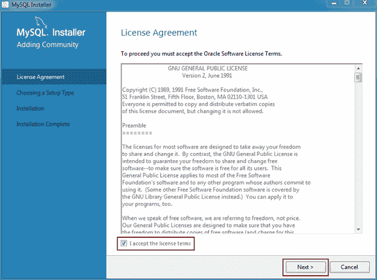

图 29: MySQL 安装程序许可协议

要继续这个过程，我们应该勾选**我接受许可条款**复选框，然后点击**下一步**。

现在，安装程序要求一个适合我们安装情况的安装类型。因为我们正在练习使用 PHP 连接 MySQL，所以一个**开发者默认**类型对我们来说是可以的。这是安装过程的默认设置类型，所以我们只需要点击**下一步**，过程就会继续。

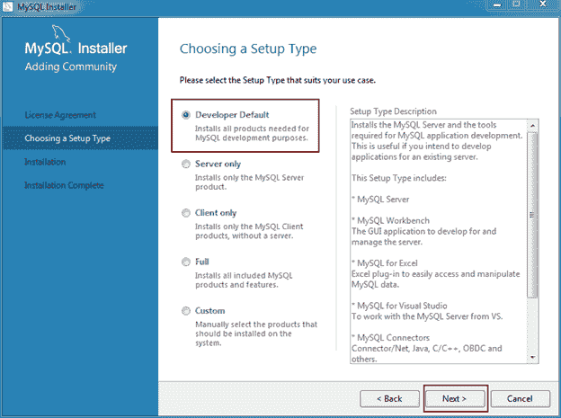

图 30:选择设置类型

MySQL 安装程序现在会检查计算机系统是否有安装上一个对话框中选择的产品所需的所有外部要求。安装程序可以下载并安装一些先决条件，但在某些情况下需要手动干预。在这种情况下，我们应该点击那些标有手动图例的需求，以便下载所需的文件。一旦我们完成了手动先决条件的安装，我们可以使用**检查** 按钮来检查这些要求现在是否得到满足。然后，我们需要点击**执行**按钮来自动安装那些仍然缺少的需求。最后，当所有的需求都安装好之后，我们应该点击**下一步**继续这个过程。

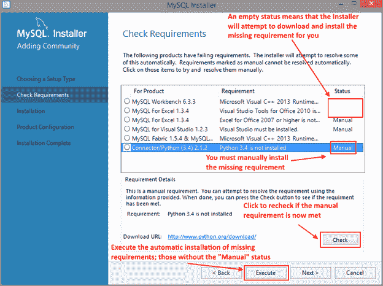

图 31:检查安装要求

MySQL 安装程序显示的下一个对话框列出了计划安装的所有产品。点击**执行** 按钮，安装程序开始部署产品。列表的“状态”列下方将显示一个进度条。产品部署完成后，将显示“完成”状态。

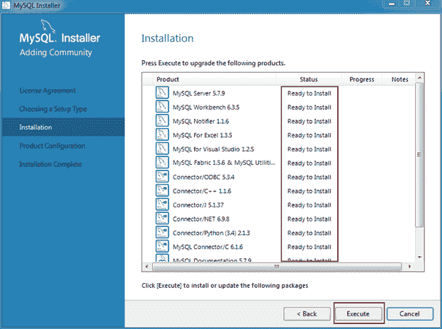

图 32:准备安装对话框

所有产品安装完毕后，安装程序显示**配置**对话框，列出所有需要配置的产品。通常，MySQL Server、Samples 和 Examples 产品是可配置的，因此它们会以“准备配置”的状态出现在对话框中。我们应该点击**下一步**开始产品配置。

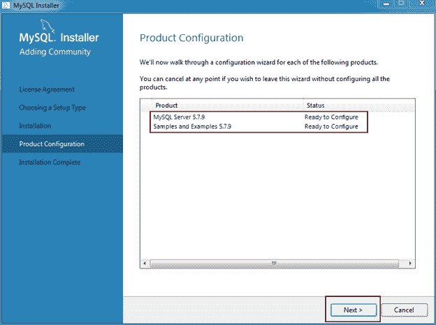

图 33:产品配置对话框

此时，将出现一个对话框，显示我们在安装过程开始时选择的安装类型，并要求更改默认连接值。此对话框允许我们显示或隐藏高级配置选项。尽管下图显示了选中的**高级选项**，但建议隐藏该对话框并让 MySQL 安装程序设置默认的高级值。还建议保留默认的连接值，因为它们可以确保正确的数据库功能。

要继续配置过程，单击**下一步**。

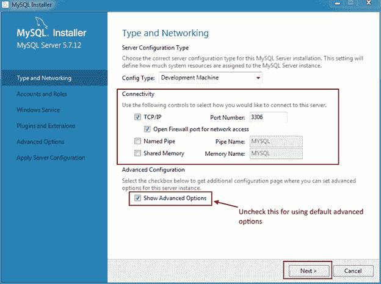

图 34: MySQL 服务器配置

显示的下一个对话框是**账户和角色**。这就是我们要为根用户建立密码的地方。我建议输入一个配置程序认为强的密码。完成后，点击**下一步**继续。

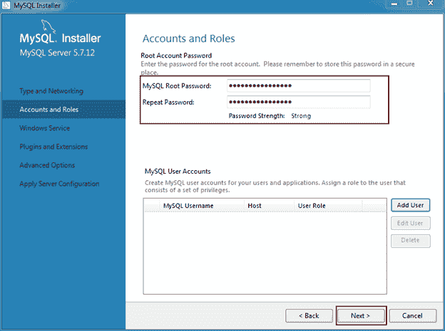

图 35:设置根帐户密码

下一步是配置 Windows 服务的详细信息，例如服务名称、MySQL Server Windows 服务是如何执行的，以及启动时是否应该加载 MySQL 服务器。配置程序显示一系列默认值。如果您没有与此特定配置相关的特殊需求，我建议您使用默认值。

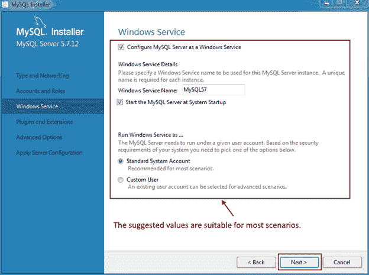

图 36:设置窗口服务

插件和扩展超出了本书的范围，由于**高级选项**复选框被禁用，接下来将出现**应用服务器配置**对话框。点击**执行**按钮开始配置过程。当这个过程完成时，打开的对话框被重新加载，我们可以执行另一个安装和配置。

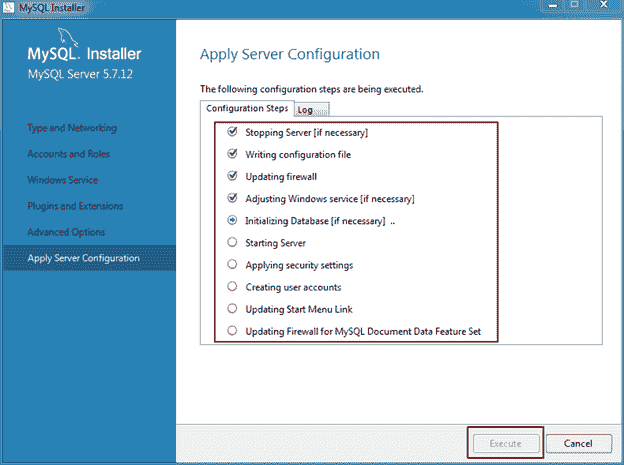

图 37:将配置值应用于服务器

### 使用 MySQL 工作台创建数据库

一个名为 MySQL 工作台的实用程序与 MySQL 服务器开发安装类型一起安装。这个程序将帮助我们管理我们的服务器，包括创建数据库的能力。我建议为这个程序创建一个桌面快捷方式，这样你就可以在任何需要的时候快速访问它。

创建快捷方式后，双击它启动 MySQL 工作台实用程序。程序启动后，将出现以下对话框。

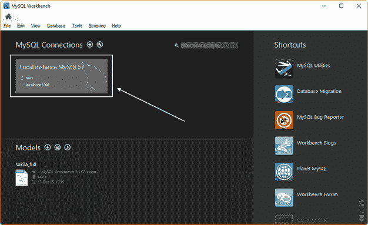

图 38: MySQL 工作台实用程序主屏幕

图 38 显示了 MySQL 工作台主屏幕。这个主屏幕分为三个区域:MySQL 连接，保存一个或多个指向特定 MySQL 服务器的快捷方式；Models，它保存指向数据库模型文件的快捷方式(对这些文件的讨论超出了本书的范围)；和快捷方式，保存其他 MySQL 实用程序或论坛的快捷方式。

默认情况下，我们本地 MySQL 服务器实例的快捷方式出现在主屏幕中。因此，要连接到这个实例，我们应该单击快捷方式。然后，主屏幕将如下图所示。

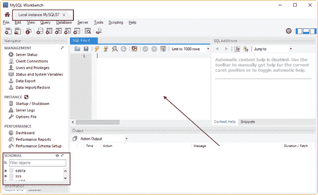

图 39: MySQL 本地实例主窗口

图 39 显示了 MySQL 本地实例管理器。这是我们使用数据库服务器的地方。红色箭头指示的区域称为查询选项卡，用于输入管理服务器所需的所有 SQL 语句。这些语句包括数据库和表创建。红色方块所包围的区域是显示服务器中所有可用模式的地方。实际上，数据库和模式是一样的。

现在，我们要创建我们的数据库。

#### contactinfo 数据库

以下章节中讨论的练习将依赖于名为 **contactinfo** 的数据库，该数据库将包含一个表格来保存我们的联系人信息。下面的代码片段将使用 MySQL 工作台实用程序创建这个数据库。

代码清单 35:创建联系信息数据库

```
  CREATE SCHEMA
  contactinfo;

  USE contactinfo;

  CREATE TABLE contacts
  (ID INT AUTO_INCREMENT PRIMARY KEY,
  NAME VARCHAR(200)
  DEFAULT '' NOT NULL,
  EMAIL VARCHAR(300)
  DEFAULT '' NOT NULL,
  PHONENUMBER VARCHAR(50)
  DEFAULT '' NOT NULL,
  SUBJECT VARCHAR(200)
  DEFAULT '' NOT NULL,
  MESSAGE TEXT);

```

现在，MySQL 工作台的查询选项卡将如下图所示。

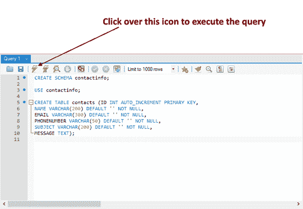

图 40:从查询选项卡创建数据库

如图 40 所示，我们需要单击闪电图标来执行代码并创建数据库。代码执行后， **contactinfo** 数据库将显示在模式列表中。(您可能需要点击**刷新**图标才能看到。)

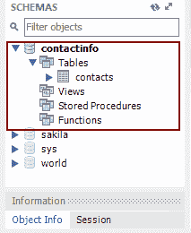

图 41:模式列表中的联系信息数据库

现在，我们准备使用 PHP 来访问我们的数据库。

### 我们的第一个数据库连接

我们要做的第一件事是测试 MySQL 到 **contactinfo** 数据库的连接。这可以通过执行以下代码来完成。

代码清单 36:测试到 contactinfo 数据库的连接

```
  <?php

    $dbhost =
  'localhost';
    $dbuser = 'root';
    $dbpass = 'your
  password'; 
    $database =
  'contactinfo';
  $mysqli = new
  mysqli($dbhost, $dbuser, $dbpass, $database);

  if
  ($mysqli->connect_errno) {
      echo "We're
  sorry. The website can not connect to the database";
      echo "Error:
  MySQL connection failed: \n";
      echo "Errno: " .
  $mysqli->connect_errno . "\n";
      echo
  "Error: " . $mysqli->connect_error . "\n";

      exit;
  }
  echo "MySql
  connection succeeded";
  $mysqli->close();

  ?>

```

该代码试图连接到 **contactinfo** 数据库。连接凭证在$ `dbhost`、$ `dbuser`和$ `dbpass`变量中提供，数据库名称存储在名为$ `database`的变量中。我们使用`mysqli`类来创建连接。当我们试图创建类的实例并将其保存到$ `mysqli`变量中时，会传递用于建立连接的凭据。如果类的属性`connect_errno`评估为`true`，将显示一系列错误消息，表明无法建立连接。然后，`exit`语句结束脚本。

假设一切都成功执行，web 浏览器显示的输出应该如下图所示。

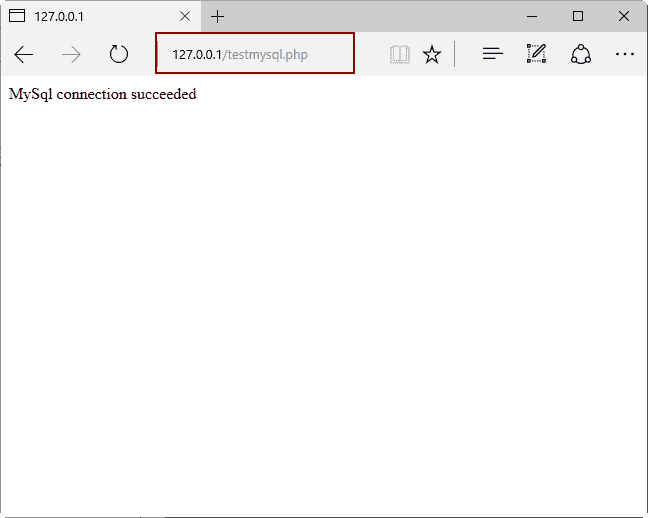

图 42:成功连接到 MySQL

### 在联系人表中插入一行

因为我们的数据库是最近创建的，所以它是空的。因此，我们无法执行任何类型的查询，因为没有可查看的数据。因此，我们要做的第一件事是在联系人表中插入几行。

代码清单 37:在联系人表中插入行

```
  <?php

    $dbhost =
  'localhost';
    $dbuser = 'root';
    $dbpass =
  'mypassword'; 
    $database =
  'contactinfo';
  $mysqli = new
  mysqli($dbhost, $dbuser, $dbpass, $database);

  if
  ($mysqli->connect_errno) {
      echo "We're
  sorry. The website can not connect to the database <br />";
      echo "Error:
  MySQL connection failed: <br />";
      echo "Errno: " .
  $mysqli->connect_errno . "<br />";
      echo
  "Error: " . $mysqli->connect_error . "<br />";

      exit;
  }

  $sql = "INSERT
  INTO contacts (name,email,phonenumber,subject,message) VALUES ('John Doe',
  'johndoe@myemaildomain.com', '(253)001-2345','Test data row','Testing data
  insertion')";

  if
  ($mysqli->query($sql) === TRUE) {
      echo "New
  record created successfully";
  } else {
      echo
  "Error: " . $sql . "<br>" . $mysqli->error;
  }

  $mysqli->close();

  ?>

```

前面的代码使用分配给变量$ `sql`的`SQL INSERT`语句在联系人表中添加一个新行。代码做的第一件事是尝试连接到数据库。如果连接成功，`SQL INSERT`语句由`$mysqli`类实例的`query()`方法执行。如果该方法返回的值评估为`true`，则显示一条指示操作成功的消息。否则，将显示一条错误消息。在这两种情况下，使用`mysqli`类的`close()`方法在末端关闭连接。

### 使用参数插入数据

SQL 语句允许使用参数，以便查询可以像函数一样接收要处理的数据。下面的代码显示了一个参数化的 SQL 语句。

代码清单 38:参数化的 SQL 语句

```
  INSERT INTO contacts
  (name, email, phonenumber, subject, message) VALUES (?,?,?,?,?);

```

该代码示例中的问号(`?`)对应于参数的声明。在这种情况下，语句有五个参数来接收将插入表中的数据。为了成功执行该语句，SQL 语句必须在其执行之前接收相应的数据。为了执行这个操作，我们需要将参数与保存数据的变量绑定在一起。这可以通过使用`mysqli`类`statement`属性的`bind_param`方法来完成。但是，与上一节讨论的插入代码示例不同，`statement`要求在绑定数据之前编译 SQL 语句。编译语句并不意味着执行它，而是检查它是否正常。要执行此操作，我们应该使用`statement`属性的`prepare`方法。现在，让我们看看下面的代码。

代码清单 39:使用参数插入行

```
  <?php

    $dbhost =
  'localhost';
    $dbuser = 'root';
    $dbpass =
  'mypassword'; 
    $database =
  'contactinfo';
  $mysqli = new mysqli($dbhost,
  $dbuser, $dbpass, $database);

  if
  ($mysqli->connect_errno) {
      echo "We're
  sorry. The website can not connect to the database <br />";
      echo "Error:
  MySQL connection failed: <br />";
      echo "Errno: " .
  $mysqli->connect_errno . "<br />";
      echo
  "Error: " . $mysqli->connect_error . "<br />";

      exit;
  }
  $contact_name =
  "Another John Doe";
  $email_addr =
  "anotherjohndoe@myemaildomain.com";
  $phonenumber =
  "(654)290-4567";
  $subject = "Adding
  rows with parameters";
  $message = "This
  row was added using parameters";

  $sql = "INSERT
  INTO contacts (name,email,phonenumber,subject,message) VALUES
  (?,?,?,?,?)";

  $statement =
  $mysqli->stmt_init();

  if
  ($statement->prepare($sql))
  {

  $statement->bind_param("sssss",$contact_name,$email_addr,$phonenumber,$subject,$message);
        $statement->execute();
        $statement->close();
  }

  $mysqli->close();
  ?>

```

这段代码首先要注意的是分配给`$sql`变量的参数化 SQL 语句。在赋值语句之前，声明一组五个变量，并将插入新行的数据赋给每个变量。$ `statement`变量通过`stmt_init()`方法接收语句对象。现在，使用`prepare()`方法编译 SQL 语句，如果可以，程序将 SQL 语句中声明的参数与保存数据的变量绑定。

为了执行数据绑定，采用方法`bind_param()`。这个方法的第一个参数是一个由一系列字符组成的字符串，只要要绑定的参数数量。在这种情况下，有五个参数出现在 SQL 语句中，因此字符串有五个字符长。字符串第一个位置的`s`代表出现在 SQL 语句中的第一个参数的字符串数据类型。因为句子的所有参数都是字符串数据类型，字符序列仅由`s`构成。

现在，为了进行插入操作，执行语句对象的`execute()`方法。之后，执行语句对象的`close()`方法，释放所有使用的资源。最后，使用`mysqli`类的`close()`方法关闭连接。

### 查询联系人表

现在 contacts 表有了可以查询的数据，我们将创建一个 PHP 脚本，显示 contacts 表中所有行的前三列的内容。

代码清单 40:查询联系人表的脚本

```
  <?php

    $dbhost =
  'localhost';
    $dbuser = 'root';
    $dbpass = 'mypassword';

    $database =
  'contactinfo';
  $mysqli = new
  mysqli($dbhost, $dbuser, $dbpass, $database);

  if
  ($mysqli->connect_errno) {
      echo "We're
  sorry. The website can not connect to the database <br />";
      echo "Error:
  MySQL connection failed: <br />";
      echo "Errno: " .
  $mysqli->connect_errno . "<br />";
      echo
  "Error: " . $mysqli->connect_error . "<br />";

      exit;
  }

  $sql = "SELECT
  contacts.* FROM contacts ORDER BY contacts.name";
  $resultset =
  $mysqli->query($sql);

  if
  ($resultset->num_rows > 0)
  {
        while ($datarow =
  $resultset->fetch_assoc())
        {
              echo
  "Contact Id: " . $datarow["ID"] .  " - Contact Name:
  " . $datarow["NAME"] . " - Contact Email: " .
  $datarow["EMAIL"] . "<br />";
        }
  }
  else
  {
     echo "No contacts
  available";    
  }
  $mysqli->close();
  ?>

```

正如我们在代码清单 40 中看到的那样，`$sql`变量的内容已经变成了一个 SQL `SELECT`语句。虽然使用了`mysqli`类的`query`方法，但本示例中的方法略有不同。方法返回的结果存储在名为`$resultset`的变量中，它应该是一个包含联系人表中所有行的数据集。条件`if`语句查询返回的行数。如果该数字大于零，则`while`循环遍历所有数据集，并显示每行的`ID`、`NAME`和`EMAIL`列的内容。现在，假设前面的示例保存在名为**queryingcontacts.php 的文件中，**如果我们在 web 浏览器的地址栏中键入**http://127 . 0 . 0 . 1/query contact . PHP**，显示的输出应该如下图所示。

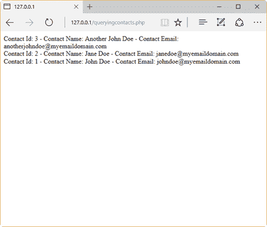

图 43:在网络浏览器中显示联系人

### 在网页中显示联系人

在本节中，我们将使用联系人表中的数据在网络浏览器中显示一个 HTML 表。以下代码应保存在名为**contactswebpage.php**的文件中。

代码清单 41:在 HTML 表格中显示联系人

```
  <?php

    $dbhost =
  'localhost';
    $dbuser = 'root';
    $dbpass =
  'mypassword'; 
    $database =
  'contactinfo';
  $mysqli = new
  mysqli($dbhost, $dbuser, $dbpass, $database);

  if
  ($mysqli->connect_errno) {
      echo "We're
  sorry. The website can not connect to the database <br />";
      echo "Error:
  MySQL connection failed: <br />";
      echo "Errno: " .
  $mysqli->connect_errno . "<br />";
      echo
  "Error: " . $mysqli->connect_error . "<br />";

      exit;
  }

  $sql = "SELECT
  contacts.* FROM contacts ORDER BY contacts.name";
  $resultset =
  $mysqli->query($sql);

  echo "<!DOCTYPE
  html>\n<html>\n";
  echo
  "<title>Displaying Contacts List</title>\n";
  echo
  "</head>\n";
  echo
  "<body>\n";

  if
  ($resultset->num_rows > 0)
  {
     echo
  "<section>\n";
     echo "<div style=" . '"color:#FFFFFF;
  background-color:#5F5F5F; text-align: center;"' . ">\n";
     echo
  "<h3>OUR CONTACT LIST</h3>\n";
     echo
  "</div>\n";
     echo
  "<div>\n";
     echo "<table
  width=100%>\n";
     echo
  "<thead>\n";
     echo
  "<tr><th style=" . '"color:#FFFFFF;
  background-color:#5F5F5F; text-align: center;"' . ">ID</th>\n";
     echo "<th
  style=" . '"color:#FFFFFF; background-color:#5F5F5F; text-align:
  center;"' . ">Contact Name</th>\n";
     echo "<th
  style=" . '"color:#FFFFFF; background-color:#5F5F5F; text-align:
  center;"' . ">Contact
  Email</th>\n</tr>\n</thead>\n";
     echo
  "<tbody>\n";
        while ($datarow =
  $resultset->fetch_assoc())
        {
              echo
  "<tr>\n<td>".$datarow["ID"]."</td><td>".$datarow["NAME"]."</td>
  <td>".$datarow["EMAIL"]."</td>\n</tr>\n";
        }
     echo
  "</tbody>\n";
     echo
  "</table>\n</div>\n"; 
     echo "</section>\n";
  }
  else
  {
     echo
  "<section>\n<p>No Contacts
  available</p>\n</section>";
  }

  echo
  "<footer>\n<div style=" . '"color:#FFFFFF;
  background-color:#5F5F5F; text-align: center;"' .
  ">\n<p>Copyright (C)2016 All PHP Web
  Developers</p>\n</div>\n</footer>\n";
  echo
  "</body>\n</html>\n";

  $mysqli->close();

  ?>

```

这段代码开始在`localhost`中连接到 MySQL，就像前面的数据访问代码示例一样。如果连接失败，脚本将结束。否则，脚本使用`mysqli`类的`query`方法查询联系人表。查询返回的数据存储在$ `resultset`变量中。之后，脚本开始创建将在网络浏览器中显示的 HTML 文档。在这种情况下，HTML `head`和`body`部分的开头作为 web 服务器响应的一部分发送。HTML 文档的下一部分取决于`query`方法返回的行数。如果没有返回行，则在 HTML 文档中放置一个带有“没有可用联系人”句子的段落；否则，使用$ `resultset`变量中所有数据行的内容创建一个 HTML 表。每个数据行对应一个 HTML 表格行。脚本以创建网页的`footer`部分并关闭与 MySQL 的连接结束。

现在，如果我们在 web 浏览器的地址栏中键入**http://127 . 0 . 0 . 1/contact swebpage . PHP**，应该会得到如下输出。

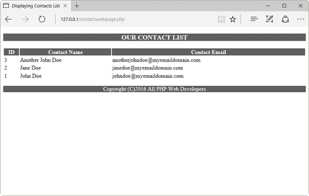

图 44:显示在 HTML 表格中的联系人

由 PHP 脚本生成的 HTML 如下:

代码清单 42:动态生成的代码

```
  <!DOCTYPE html>
  <html>
  <title>Displaying
  Contacts List</title>
  </head>
  <body>
  <section>
  <div
  style="color:#FFFFFF; background-color:#5F5F5F; text-align: center;">
  <h3>OUR CONTACT
  LIST</h3>
  </div>
  <div>
  <table
  width=100%>
  <thead>
  <tr><th
  style="color:#FFFFFF; background-color:#5F5F5F; text-align:
  center;">ID</th>
  <th
  style="color:#FFFFFF; background-color:#5F5F5F; text-align:
  center;">Contact Name</th>
  <th style="color:#FFFFFF;
  background-color:#5F5F5F; text-align: center;">Contact
  Email</th>
  </tr>
  </thead>
  <tbody>
  <tr>
  <td>3</td><td>Another
  John Doe</td> <td>anotherjohndoe@myemaildomain.com</td>
  </tr>
  <tr>
  <td>2</td><td>Jane
  Doe</td> <td>janedoe@myemaildomain.com</td>
  </tr>
  <tr>
  <td>1</td><td>John
  Doe</td> <td>johndoe@myemaildomain.com</td>
  </tr>
  </tbody>
  </table>
  </div>
  </section>
  <footer>
  <div
  style="color:#FFFFFF; background-color:#5F5F5F; text-align:
  center;">
  <p>Copyright
  (C)2016 All PHP Web Developers</p>
  </div>
  </footer>
  </body>
  </html>

```

这是在服务器端动态创建的。这意味着，随着表中联系人数据行数的增加，该代码将变得更大。

## 章节总结

本章的目的是解释如何使用 PHP 对文件执行输入和输出操作，以及如何连接到 MySQL 数据库来插入或检索数据。

PHP 提供了一系列的功能，帮助我们通过打开、读取、写入和关闭文件等操作来操作文件。功能`fopen()`、`filesize()`、`fread()`和`fclose()`应该一起使用，以便读取文件的内容。如果我们想将文本写入文件，我们需要使用`fwrite()`功能，而不是`fread()`。

如第 1 章所述，PHP 支持多种数据库管理系统(RDBMS)，而 MySQL 是最常与 PHP 结合使用的数据库系统。PHP 7 包含一个名为`mysqli`的扩展(MySQL 改进版)，允许你访问 MySQL 4.1 及以上版本。就本书而言，将 MySQL 与 PHP 结合使用需要在用作网络服务器的计算机上安装 MySQL 的活动实例，并安装 MySQL 工作台实用程序。

本章中讨论的练习依赖于名为 **contactinfo** 的数据库，该数据库包含一个保存我们的联系人信息的表格。我们使用 MySQL 工作台工具来创建这个数据库。之后，解释了插入数据和查询联系人表的一系列练习。这些练习通过一个名为`mysqli`的类使用了`mysqli`扩展。这个类的工作方式如下:构造函数`mysqli()`创建一个到 MySQL 服务器的连接，并使用属性`connect_errno`通知连接是否成功。如果成功，我们可以使用`query()`方法插入或检索数据。另外，我们可以通过`statement`对象使用参数化的 SQL 语句，通过`bind_param()`方法将参数绑定到数据变量。

最后，我们解释了一个代码示例，以便用联系人表的内容创建一个 HTML 表。*