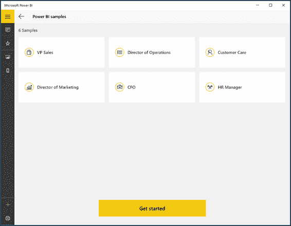

# 第四章移动应用

Power BI 在以下操作系统的应用中可用:Windows 8、Windows 10、Windows Phone、iPhone 和 Android。应用版本允许我们连接到 Power BI 服务，并浏览可用的仪表板和报告。

## Windows 8 和 Windows 10

在 Windows 商店中寻找微软 Power BI。

图 98:视窗商店

点击**安装**安装应用。

图 99:电力商业智能应用清单

运行应用，点击**开始**。

图 100:电力商业智能应用

第一部分选择样本，如图 101 所示。

图 101:电力商业智能应用

通过继续“开始”，我们可以访问连接请求。您可以连接到高级商务智能服务或 SQL Server 2016 的报告服务。在我们的示例中，我们将连接到 Power BI 服务。

图 102:电力商业智能应用

向 Power BI 服务提供访问凭证，如图 103 所示。

图 103:电力商业智能应用

此时，您将被重定向。

图 104:电力商业智能应用

图 105 向我们展示了身份验证已经成功。

图 105:电力商业智能应用

图 106 显示了我们可以浏览 Power BI 服务中的报告和仪表板。

图 106:电力商业智能应用

通过选择一个仪表板，我们可以激活上下文菜单来邀请人们并共享我们的仪表板，将其添加到收藏夹仪表板列表中，或将仪表板插入开始面板。

图 107:电力商业智能应用

当我们邀请仪表板可视化外部的用户时，会出现一个上下文窗口，我们必须在其中指定要与其共享仪表板的一个或多个用户。我们必须在发送邀请时插入上下文消息，并指定收件人是否能够与其他用户共享仪表板。

图 108:智能商务应用—邀请选项

如果您选择仪表板或报告，右侧会出现一系列图标，允许您放大正在查看的图表/信息。您现在可以:

*   Invite people.
*   将仪表板或报告添加到收藏夹列表中。
*   将仪表板插入开始面板。
*   更新您正在显示的仪表板或报告。
*   在您的 Power BI 服务中搜索仪表板或报告。

图 109:电力商业智能应用

图 110 显示了一个研究样本。

图 110:电力商业智能应用

接下来，回到您的仪表板并单击图表。右上角的菜单将变为一组新图标。放大到全屏，打开**报告**、**分享**、**搜索**。

图 111:电力商业智能应用

如果单击“打开报告”，还可以根据过滤器选择数据，设置自定义过滤器，并获得新结果。

图 112:电力商业智能应用

## 安卓应用

从 [Google Play](https://play.google.com/store) 开始，你可以安装应用，认证到 Power BI，马上开始使用内容。

在菜单的右上角，您可以添加注释或浏览报告。

图 113:智能智能安卓应用

如果您想要编辑和添加注释，在报告下方您会看到面板，您可以在其中插入文本、在报告上绘图、添加表情符号、删除注释或与其他用户共享所有内容。

图 114:智能智能安卓应用

  

图 115:智能智能安卓应用——序列

## iPhone 的 App

从商店安装应用，向 Power BI 进行身份验证，然后立即开始使用内容。

 

图 116:智能手机应用—序列

iPhone 的程序与安卓相同。如果要编辑报告并添加注释，可以在显示面板的报告下方插入文本。您还可以在报告上绘图、添加表情符号、删除笔记或与其他用户共享所有内容。

图 117: Power BI 安卓应用

  

图 118:智能手机应用—序列

## Windows Phone 应用

从商店安装应用。

图 119:移动商务智能视窗 10

接下来，点击**开始**，如图 120 所示。

图 120:移动商务智能视窗 10

接下来，请求连接类型。您可以连接到高级商务智能服务或 SQL Server 2016 的报告服务。在我们的示例中，我们将连接到 Power BI 服务，如图 121 所示。

图 121:移动商务智能视窗 10

请注意，您需要提供凭据才能访问 Power BI 服务。

 

图 122: Power BI Windows 10 移动登录—顺序

此时，身份验证已经成功，您可以单击“开始探索”栏。

如果您愿意，您也可以接受盒装产品，上面写着:“向我们发送有关您的 Power BI 使用情况和 Power BI 性能的信息，以帮助改善您的微软体验。”

图 123:移动商务智能视窗 10

现在，您可以开始使用服务中的仪表板或报告了。

图 124:移动商务智能视窗 10

在右上角，您将看到搜索图标，它允许我们研究与我们连接的服务上显示的仪表板和报告。

图 125:移动商务智能视窗 10

如果选择仪表板，您可以邀请其他用户使用内容，将报告添加到收藏夹列表，将仪表板插入开始面板，或者更新报告。

图 126:移动商务智能视窗 10

如果您邀请其他用户使用仪表板，您需要插入您想要包括的用户的电子邮件地址。

图 127:Windows 10 移动商务智能-邀请用户

如果您选择了一个报告，您可以共享或打开它。

图 128:移动商务智能视窗 10

除了连接到手机的社交配置文件之外，共享选项还提供了适合接受这些信息的应用。

图 129:移动商务智能视窗 10-共享

在我们的示例中，我们选择通过电子邮件共享报告。默认情况下，电子邮件中插入的附件只是我们决定共享的报告的快照图像。

| 

图 130:商务智能视窗 10 移动版—通过电子邮件共享