# 第五章解决方案模板

现在让我们来看看最新的共享模式，这是最具创新性的模式，为我们提供了创建内容包的能力。

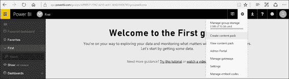

图 131:电源商业智能设置菜单

为了创建一个新的内容包，首先我们去右上角，点击设置图标，选择**创建内容包**，如图 131 和 132 所示。

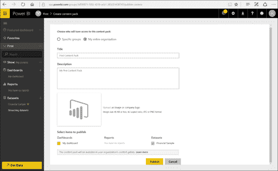

图 132:创建内容包

我们可以快速决定是要与整个组织共享，还是只与特定的群体共享。事实上，我们可以指定:

*   The user/users or the group/groups.
*   The name of the content pack.
*   A description of the content pack.
*   The icon matched to the content pack.
*   Any contents we want to share.

对于我们想要共享的任何项目，也可以选择相关的报告和数据集。我们还可以添加其他数据集和报告，而不会出现与相互依赖限制相关的问题。

配置完成后，点击**发布**即可进行发布。

接下来，我们可以通过图 133 中的图标以用户身份输入获取数据。

图 133:获取数据

如图 134 中的图形所示，我们接下来可以选择**我的组织**，在这里我们可以看到所有之前发布的内容包。当我们选择内容包时，会显示所有者。通过点击**获取**，我们将其添加到工作区。

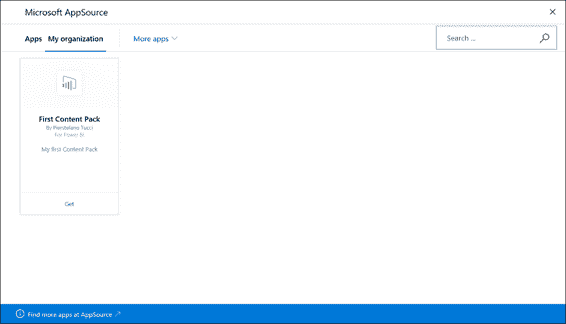

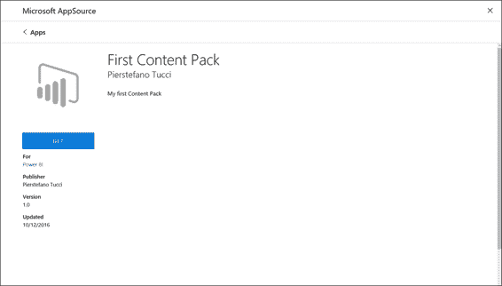

图 134:微软 AppSource—序列

接下来，我们转到右上角，点击设置图标，选择**查看内容包**以删除一个内容包。接下来，我们单击与要删除的内容包对应的**删除**条目。

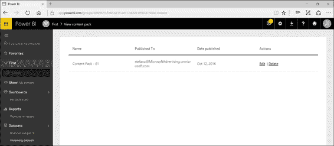

图 135:查看内容包

## 内容包

内容包是三种共享模式之一，允许我们收集报表和数据集仪表板，并在组织内共享它们。

软件即服务(SaaS)可由 Power BI 通过称为连接器的内容嵌入，连接器可直接在 Power BI 门户网站上获得，只是专门为此应用程序创建的内容包。一旦使用了其中一个连接器，并且提供了连接数据(如身份验证帐户)，我们就可以登录到像 CRM Online、Google Analytics 和 Salesforce 这样的源数据。我们还可以使用连接器链接到云中的源数据，例如 Azure SQL 数据库、Azure SQL 数据仓库和 Azure HDInsight 上的 Spark。(请注意，Apache Spark 是一个通用引擎，用于使用 Azure HDInsight 进行大规模数据存储)。

内容包注意事项:

*   这些连接需要现有的订阅。
*   每个内容包都提供预构建的仪表板和报告。
*   它们几乎每个月都会更新。

数据库和数据服务是可连接的，许多 Azure(基于云的)服务提供了**直接连接**的可能性:

*   查询被发送到 Azure，而用户导出数据和报告(仪表板切片每 15 分钟更新一次)。
*   此功能适用于已经对数据库及其连接的实体有经验的用户。
*   它仅在 Power BI Pro 许可证下可用。

例如，使用 Azure Online 服务(如 Azure Stream Analytics)会引导我们进入有趣的场景，例如使用 Azure Stream Analytics 创建实时仪表板的可能性。

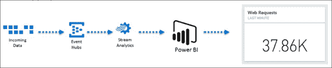

图 136:流分析流程

在大数据领域，我们可以收集大量来自传感器的数据，在这种情况下，我们可以通过 Azure 事件中心服务收集数据流。之后，我们可以使用 Azure 流分析服务对数据进行实时分析。最后，我们可以使用 Power BI 显示数据，并将其直接与数据源(如 Azure Stream Analytics)集成。

例如，我们可以想象数据来自一个网络应用程序，可能是一个电子商务网站。在这种情况下，我们可以收集与用户网上冲浪相关的数据，我们可以分析时间窗口，并显示分析摘要，可以是最后一分钟收到的网络请求数量。我们可以确定一个时间窗口，因为 Azure Stream Analytics 允许我们进行实时分析。因为 Power BI 提供了实时更新的可视化，所以在这种情况下不需要刷新。

我们需要为 SaaS 应用程序使用连接器，以便将 Power BI 连接到在线源。因此，我们参考获取数据，然后转到服务，在这里我们可以显示可用连接器的数量。我们可以使用微软动态 CRM Online，点击**连接**。我们将被要求动态的数据服务网址，也是一个认证帐户。我们收到的结果将与以下报告非常相似，因为报告是自动创建的。

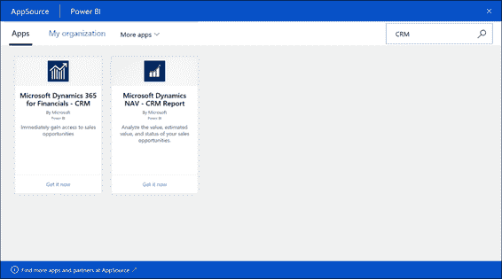

图 137:微软 AppSource

报告中还有几页可供我们阅读。数据来自客户关系管理在线测试。同时，我们有一个数据集，可以从我们的客户关系管理在线开始实施进一步的报告。

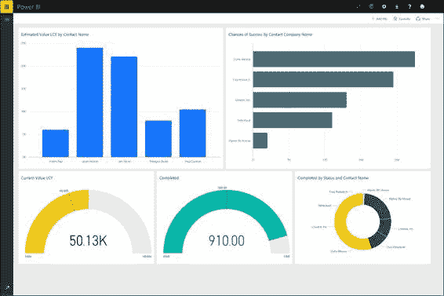

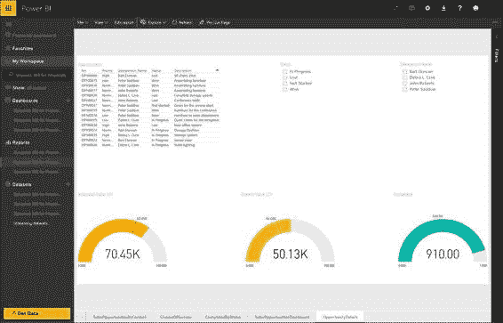

图 138:仪表板—顺序

我们还可以使用数据库在线数据源，特别是 Azure SQL 数据库、Azure SQL 数据仓库、SQL Server 分析服务和 Azure HDInsight 上的 Spark。在这种情况下，我们只需要选择 **Azure SQL 数据库**，点击**连接**，然后提供服务器地址、数据库名称和认证信息。自动地，我们有一个可用的数据模型，大约每 15 分钟更新一次。

## 数据刷新和调度

有些数据源需要刷新，以便在 Power BI 中保持数据更新。例如，连接到 SQL Server 的 Excel 工作簿需要通过刷新功能进行更新。当工作簿加载到 Power BI 上时，我们必须对原始数据源 SQL Server 进行刷新，该数据源是内部的。我们还可以运行间隔的自动刷新，然后决定是否需要以计划的或手动的方式更新数据源。如果我们选择计划，我们必须决定更新应该每天进行还是每小时进行。

Power BI 允许更新从以下位置加载的数据集的在线和内部数据:

*   高级商务智能桌面文件
*   Excel 工作簿(使用超级查询或 PowerPivot 连接到数据)

数据更新可以按需进行，也可以按计划进行。如果已安排，最大频率为:

*   Power BI free license: daily
*   Power BI Pro license: hourly

图 139:刷新频率

我们需要保留凭据，以便在 Power BI 中保持数据更新。此外，我们必须为数据集中包含的数据源提供访问凭据。凭据被安全保存，以便 Power BI 可以代表用户进行连接。

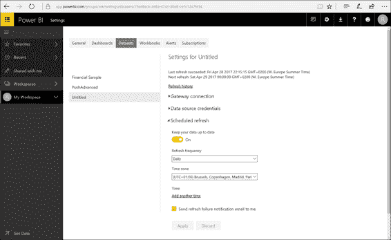

图 140:数据集—计划刷新

当我们计划数据刷新时，Power BI 应该保留用于执行数据源查询的凭据。我们将被要求提供凭据，这些凭据将被安全地保存在云中。

现在让我们看一个如何为 Excel 工作簿实现自动刷新的例子。

通常，在内部工作时，我们可以更新数据。如果我们在 SQL Server 上使用带有数据源的 Excel 工作簿，那么数据库就是 AdventureWorks，如果我们修改一些数据，那么在 Power BI 的报表和仪表盘中也应该提到修改。

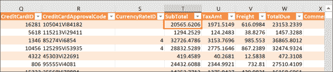

图 141: Excel 工作簿

在 Power BI Service 中，我们添加了一个新的报告页面，其中包含关于 SubTotal 列总和的新可视化。

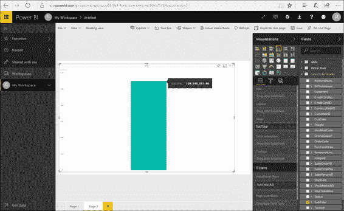

图 142:电力商业智能服务报告

接下来，让我们做一个在我们的报告中不能被忽视的修改。我们将 SubTotal 字段从 20565.6206 更新为 205656.206。现在让我们打开 Excel 工作簿并运行数据刷新。

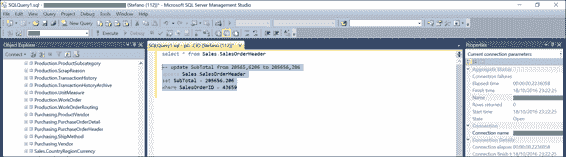

图 143:在微软 SQL Server 管理工作室中更新查询

等待后，我们应该看到一切正常。

图 144 显示了对 Excel 工作簿数据集的更新，这是通过运行手动刷新实现的。

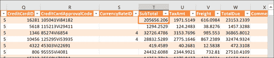

图 144: Excel 工作簿

## 电力 BI 网关

在考虑了前面的例子后，我们需要配置个人网关来刷新 Excel 数据。对于没有连接到外部源的 Excel 工作簿，错误消息不会出现，数据将被更新，没有任何问题。

要安装个人网关，我们需要通过访问[https://powerbi.microsoft.com/en-us/gateway](https://powerbi.microsoft.com/en-us/gateway)的网关页面下载程序并安装。安装完成后，我们可以设置个人网关。

图 145 显示了安装和配置我们的个人网关的步骤。

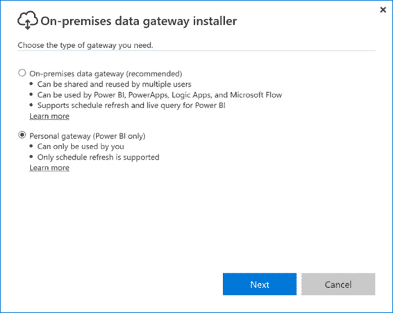

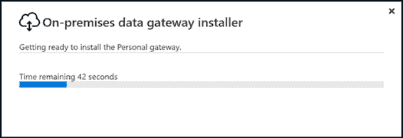

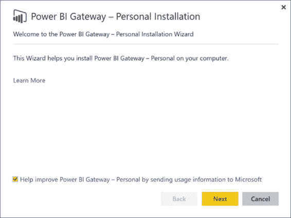

图 145:个人网关安装—顺序

我们从个人安装向导开始。我们会看到一些广告，然后我们可以点击**下一步**。

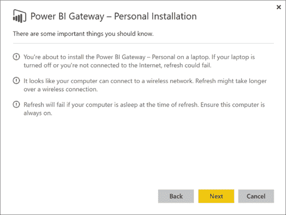

图 146:个人网关安装

如图 147 所示，您将被要求接受许可协议。这样做。

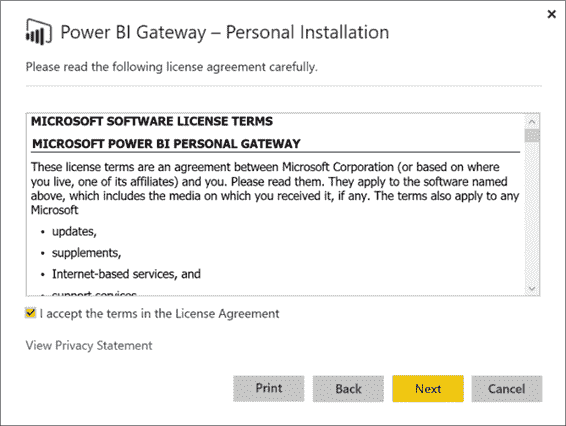

图 147:个人网关安装

接下来，让我们选择安装文件夹。

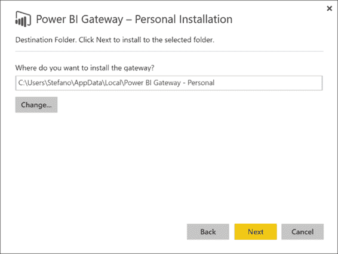

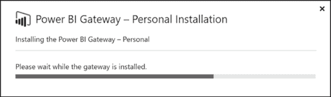

图 148:个人网关安装—顺序

接下来，我们登录并提供我们的凭据。

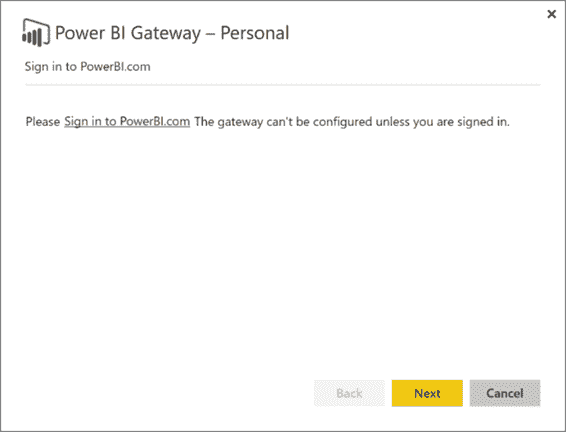

图 149:个人网关-登录

图 150 显示了登录过程。

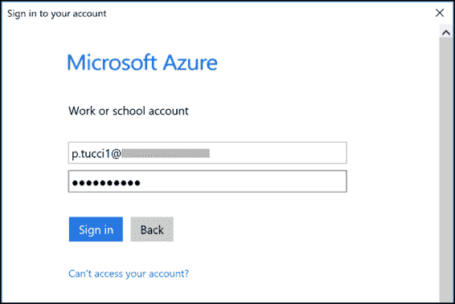

图 150:登录

这是个人网关如何连接到专用的 Azure 服务总线通道，以便与 Power BI 建立通信。身份验证成功后，个人网关处于在线状态。

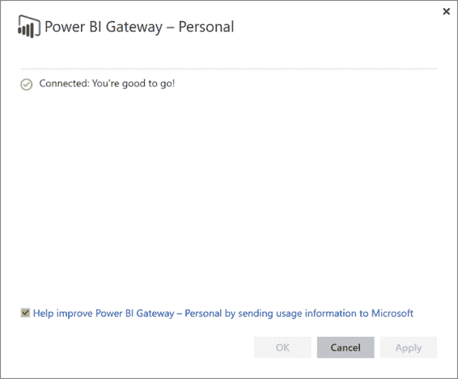

图 151:个人网关—连接状态

我们还需要提供 Power BI 用于执行刷新的凭据。我们可以检查电力商业智能服务的状态。

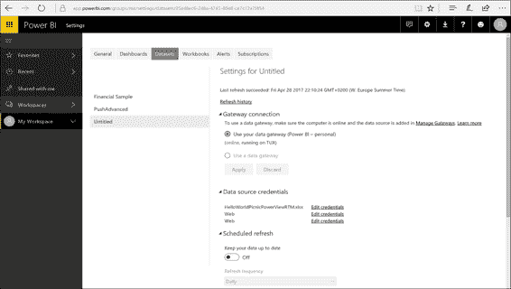

图 152:网关连接设置

在这种情况下，我们使用 Windows 身份验证，这意味着没有必要提供凭据，因为将使用个人网关服务凭据。在此阶段，刷新已设置好，可以进行计划。

请注意，我们可以添加不同的时间表，因为我们使用的是 Power BI Pro 许可证；相反，如果我们使用 Power BI Free 许可证，我们每天只能更新一次。

我们可以返回数据集，单击包含外部 SQL 数据连接的数据源，然后运行“立即刷新”

因此，即使数据源在内部，我们也可以使用个人网关来完成数据更新。

接下来，在数据集刷新之后，我们可以转到报表并查看数据更新。显示小计，如图 153 所示。

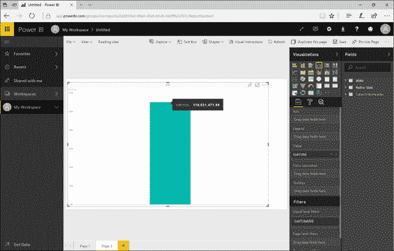

图 153:电力商业智能服务报告