# 六、开发者

Power BI 不是一个封闭的环境，我们可以定制它，也可以将其嵌入应用中。

开发人员可以使用两种模式来扩展和个性化 Power BI:

*   动力商业智能休息应用编程接口
*   自定义视觉，允许我们开发视觉效果，在视觉图库中我们可以看到其他人开发的所有视觉效果。我们也可以自己开发一个新的，并决定是否与其他用户共享(通过发布到图库)。

通过在办公文档中使用 Power BI Tile，可以在其他应用/文档中嵌入 Power BI。

## Power BI REST API

我们可以通过 API Power BI 进行连接，通过直接编程来推送 Power BI 数据。Power BI 开发人员的参考站点是 dev.powerbi.com，在那里您可以找到关于不断更新的 API 的示例和文档。你可以从点击条目**开始，尝试 API** 并通过交互式操作系统工作。

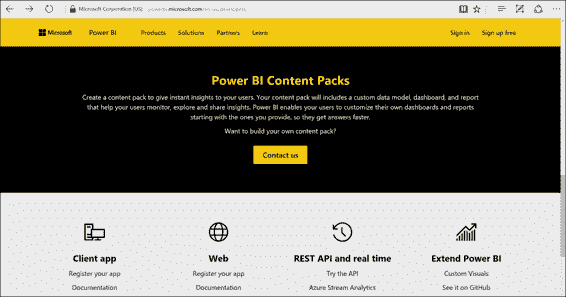

图 154:电力商业智能开发人员站点

试着去控制台，执行对服务的调用，看看会发生什么。

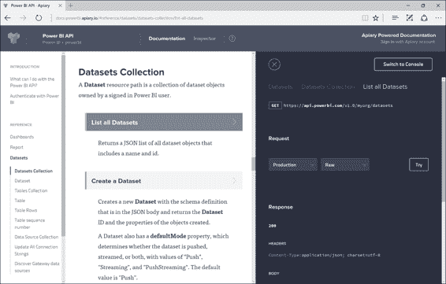

图 155:电源商务智能控制台入口

在屏幕的左侧，您可以找到到各种 API 的连接的引用，在数据集下面，您可以找到可以调用的对 API 的调用。

我们的第一个操作是使用我们的应用编程接口来查询当前保存在 Power BI 中的数据集。通过选择数据集和数据集集合，我们将找到几个可以调用的 API。接下来，我们将获得所有数据集的列表。在屏幕的右侧，您将看到可以调用的 web 服务、您想要调用的 URL、请求类型的详细信息(请求传输所必需的)以及您将从调用返回中获得的格式。通过点击**尝试**，请求得到执行，但请记住，您必须验证并授权 Power BI。

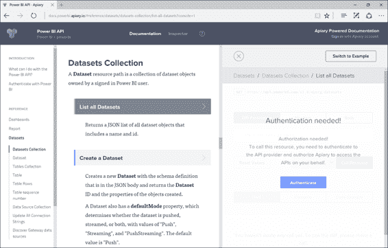

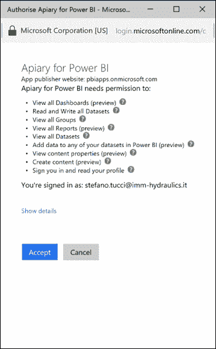

图 156:电源商务智能控制台入口，身份验证—序列

此时，选择您的帐户并接受条件。

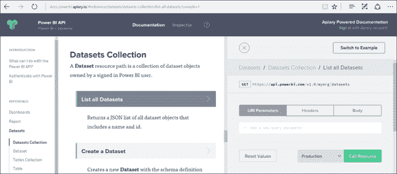

图 157: Power BI 控制台门户—数据集收集

通过点击条目**调用资源**，我们允许应用编程接口调用所需的资源。所以第一次调用只是列出了可用的数据集。

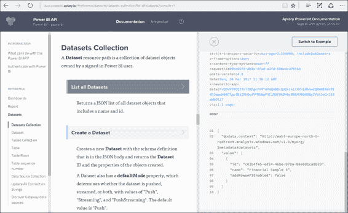

图 158: Power BI 控制台门户—数据集收集

调用的结果将显示在基础部分。在屏幕的左侧，您将看到您可以执行的可能呼叫，而在右侧，您将看到用于唤起呼叫的交互式控制台。这个电话的回答很快，通常不到一秒钟就能回复。

接下来，我们回到数据收集，通过专用的应用编程接口创建数据集。从左侧，我们点击条目**创建数据集**。控制台会更改信息。我们可以从主体部分构建一个新的数据集。


图 159:智能商务智能控制台门户—创建数据集

“呼叫资源”条目将执行请求。回到 Power BI，您将看到新创建的数据集。

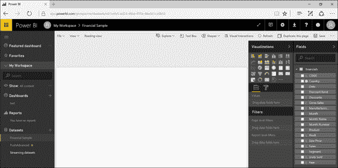

图 160:高级商业智能服务—数据集更新

现在，您将注意到新数据集的存在，您可以开始使用它，但请注意数据不存在。只定义了数据的结构。

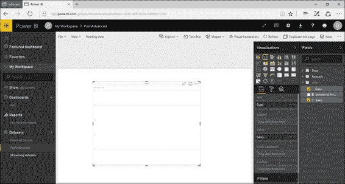

图 161:电力商业智能服务报告

在填充数据之前，我们应该保存报告和仪表板。

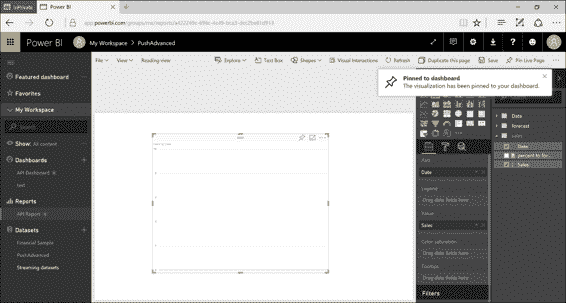

图 162:电力商业智能服务报告

返回控制台插入数据，并选择条目**在数据集中向表添加行**。在参数中的“URI 参数”部分，指定数据集的标识和要填充的表的名称(在我们的例子中是“销售”)。

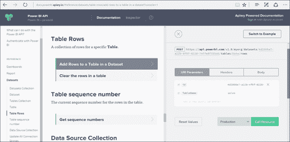

图 163:商务智能控制台门户—表格行，添加行

在正文部分，指定要插入的数据，如图 164 示例所示，点击**调用资源**:

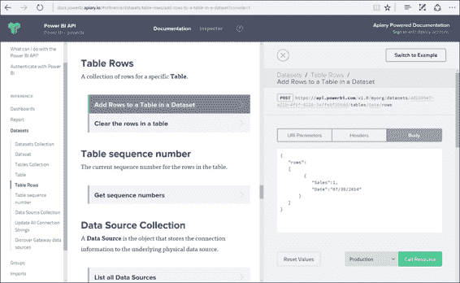

图 164:商务智能控制台门户—表格行，添加行

从这一刻开始，数据将持续保存在我们的仪表板中。您可以保持原样，也可以更改内容。如果是这样，您会注意到仪表板中的变化。

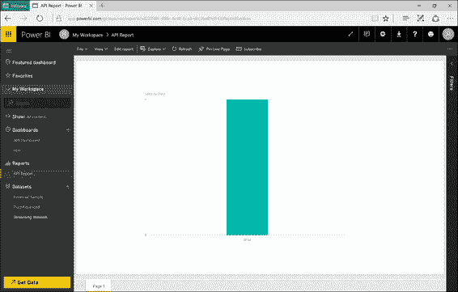

图 165:电力商业智能服务—报告更新

可以从我们的应用中调用相同的 API 函数来创建实时显示数据的仪表板。

## Power BI 定制视觉

开发人员可以轻松地在 Power BI 中创建定制的视觉元素，用于他们自己的仪表板和报告。首先，GitHub 上所有图形效果的代码都是可用的。可视化有一些参考点，还有一个测试套件和工具来帮助为 Power BI 创建高质量、定制的可视化元素。所有这些都可以在 https://github.com/Microsoft/PowerBI-Visuals 的 GitHub 上作为开源项目获得。

要创建可视化对象，首先需要设置开发环境。然后需要安装 NodeJS 4.0+ Required(推荐 5.0)。接下来，使用代码清单 1 中的代码。

代码清单 1: NodeJS 命令

```cs
  npm install -g powerbi-visuals-tools

```

为了确认安装成功，您可以执行代码清单 2 中的命令。

代码清单 2: NodeJS 命令

```cs
  pbiviz

```

您将获得如下结果，如图 166 所示。

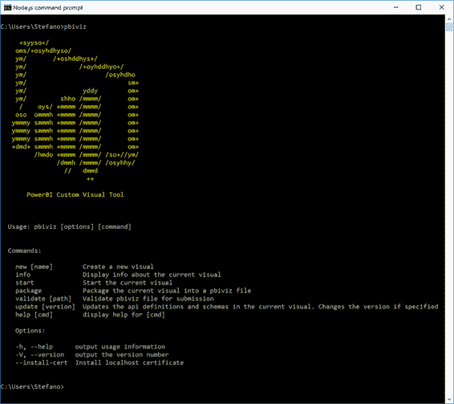

图 166: Pbiviz 命令执行

为了启用可视对象的实时预览，我们必须安装一个在 HTTPS 使用的 SSL 证书。这将允许通过浏览器显示和上传对象，它将适用于 Windows 或 OSX 的用户。

代码清单 3: NodeJS 命令

```cs
  pbiviz --install-cert

```

在针对 Windows 用户的过程中，将出现如下窗口，如图 167 所示:

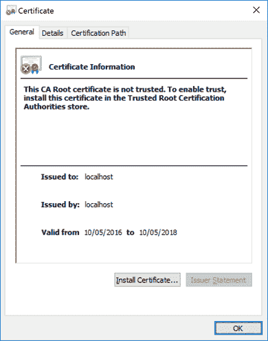

图 167:证书信息

接下来，点击**安装证书**，也如图 167 所示。


图 168:证书导入向导

现在我们选择**当前用户**，点击**下一步**。


图 169:证书导入向导

接下来，我们选择**将所有证书放入以下商店**并点击**浏览...**在那条线旁边。


图 170:证书导入向导

图 170 显示了接下来的步骤——我们选择**可信根证书颁发机构**并点击**确定**。然后我们回到上一个屏幕，在那里我们选择**下一个**。


图 171:证书导入向导

我们点击**完成**完成安装。


图 172:安全警告

现在我们通过选择**是**来验证安装。

在 Mac OS X 用户的过程中，将出现图 173 中的窗口。

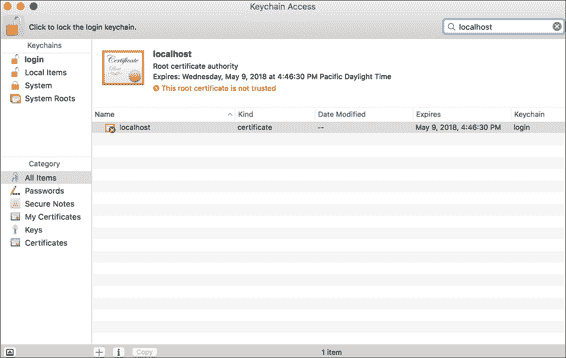

图 173: MAC 钥匙串访问

如果屏幕上的锁确实被锁定，请单击它解锁。

接下来，在搜索框中输入“localhost”。

现在选择新证书。

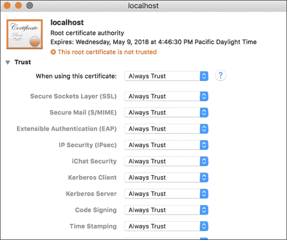

图 174:媒体访问控制根证书颁发机构

请注意，这里我们必须选择“始终信任”。

接下来，我们关上窗户。

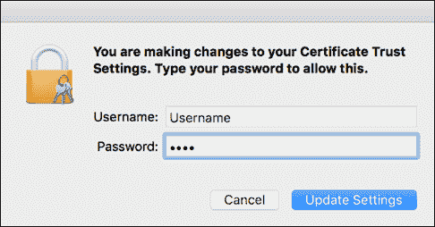

图 175:凭证请求

图 175 显示了下一个界面，我们在其中输入我们的用户名和密码，然后点击**更新设置**。

至此，我们已经完成了安装。

当创建第一个可视化时，我们遵循 Node.js 控件的提示，如代码清单 4 所示。

代码清单 4: NodeJS 命令

```cs
  pbiviz new Name of visual

```

用适合您需要的名称重命名“视觉名称”。生成可视化后，您可以在文件 pbiviz.json 中更改名称。

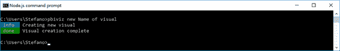

图 176:创建新视觉

接下来，输入新创建的文件夹，并执行代码清单 5 中的命令。

代码清单 5: NodeJS 命令

```cs
  pbiviz start

```

您将获得如下结果，如图 177 所示。

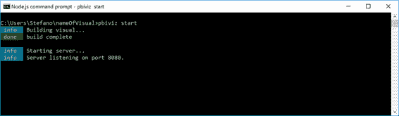

图 177: Pbiviz 执行

以下步骤使模式开发人员能够进行可视化测试——从 PowerBI 服务，我们转到**设置**。

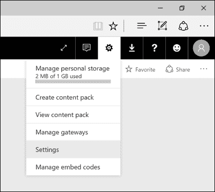

图 178:电源商业智能服务设置

接下来，点击条目**开发者**。

现在我们选择**启用开发者可视化进行测试**。

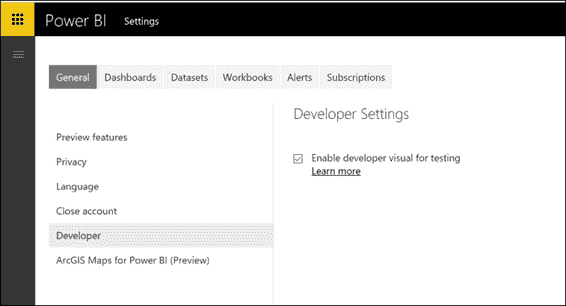

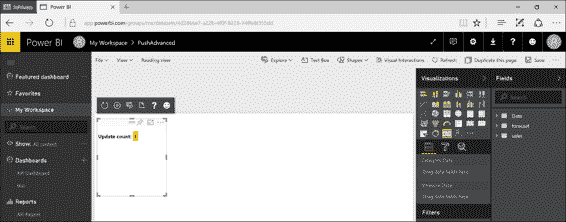

图 179:电源商业智能服务-报告和新的视觉-序列

从左到右，您将看到以下工具栏图标:

*   刷新视觉效果-如果自动加载关闭，您可以手动选择视觉效果。
*   切换自动加载—当可视化打开时，它将在每次保存文件时自动更新。
*   显示数据视图—显示用于调试的可视化基础数据视图。
*   获取帮助—指向文档的链接。
*   发送反馈—用于分享经验。

为了创建分发包，请按照 Node.js 提示找到包含可视内容的文件夹，并执行代码清单 6 中的命令。

代码清单 6: NodeJS 命令

```cs
  pbiviz package

```

您将获得如图 180 所示的结果。

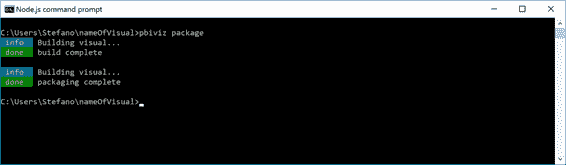

图 180:创建新包

通过导航到子文件夹“dist”，您会注意到。pbiviz 文件，用于在可视化对象中作为自定义视觉导入。

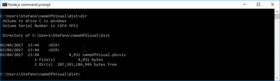

图 181:包路径