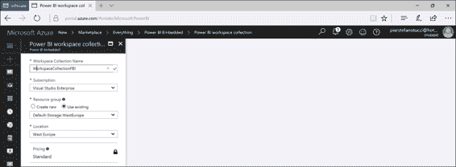

# 第七章电力 BI 嵌入

## 功率 BI 瓦

Power BI 可以嵌入到办公套件中(例如，PowerPoint)。

在 PowerPoint 中，通过“插入，存储在外接程序”部分从功能区插入外接程序就足够了。我们必须在商店中寻找 Power BI Tiles 并安装它；如果安装了它，我们必须在加载项部分重新调用它。


图 182:在线演示文稿—办公室加载项

现在，我们使用“从电源 BI”按钮选择数据。


图 183: PowerPoint 在线—增强商务智能插件

我们在个人工作区自动登录我们的 Power BI。


图 184: PowerPoint Online—Power BI 插件，身份验证

接下来，我们选择一个仪表板。


图 185:电源点在线—为 BI 插件供电

可选择的报告根据选定的仪表板显示。


图 186:在线幻灯片—增强商务智能插件

我们还可以运行切片刷新。Power BI 允许您动态更新数据和信息，这种方式有点类似于在线演讲者加入和离开群组对话的方式。


图 187:使用 Power BI 仪表板的 PowerPoint 在线演示

## 电源 BI 嵌入式

### 什么是电力 BI 嵌入式

借助 Power BI 嵌入式系统，我们可以将 Power BI 报告直接集成到我们的网络或移动应用程序中。

Power BI Embedded 是一项 Azure 服务，允许应用程序开发人员将 Power BI 体验和智能带到他们的应用程序中。集成 Power BI Embedded 的应用程序拥有拥有不同许可功能的用户。这些应用程序还可以访问合并为图形和报告的数据元素，这些数据元素现在可以通过微软 Power BI Embedded 进行馈送。用户使用该应用程序不需要超级商务智能帐户。他们可以像以前一样在没有身份验证的情况下继续访问应用程序，还可以显示 Power BI 报告并与之交互，而不需要更多许可。

### 微软 Power BI 嵌入式许可

在微软 Power BI Embedded 的使用模式中，Power BI 的许可不是最终用户的责任。相反，会话和服务是由应用程序开发人员购买的，他们一直在消费图形，并为配备这些资源的订阅付费。

#### 概念模型


图 188:概念模型

与任何 Azure 服务一样，Power BI Embedded 的资源是通过 Azure 资源管理器 API 提供的。在这种情况下，所提供的资源出现在 Power BI 工作区集合中。

### 工作区集合

工作区集合是 Azure 的上层容器，包含资源以及零个或多个工作区的可能性。工作区集合具有所有标准的 Azure 属性:

*   访问键——我们安全调用 Power BI 的 API 时使用的键。
*   用户—Azure 活动目录(AAD)用户，他们拥有通过 Azure ARM API 管理 Power BI 工作区集合的可用管理员权限。
*   区域—作为工作区集合供应的一部分，我们可以选择一个区域来执行供应。

### 工作区

工作区是 Power BI 的内容容器，可以包括数据集、报告和仪表板。请记住，工作空间在创建时是空的。通过使用 Power BI REST APIs，Power BI 桌面可以在其自己的工作空间中使用和发布。

#### 工作区集合和工作区的使用

工作区集合和工作区是内容容器，它们用于安排和改进正在创建的应用程序的设计。我们可以用很多方法来安排它们里面的内容。我们可以选择将整个内容放在一个工作区中，然后在以后使用应用程序身份验证令牌(应用程序令牌)进一步分割内容。

### 缓存数据集

可以预览缓存中保存的数据集。但是，一旦在 Power BI Embedded 上上传了缓存中保存的数据，就无法对其进行更新。

### 通过应用令牌进行认证和授权

Power BI Embedded 指的是执行必要的用户身份验证以及对应用程序的授权。Azure AD 的工作方式不同—应用程序通过使用应用程序令牌向 Power BI Embedded 传达执行 Power BI 报告呈现的授权。这些应用令牌是在应用程序需要呈现报告时创建的。

应用程序令牌用于 Power BI 嵌入式中的身份验证。有三种类型的应用令牌:

*   调配令牌—在工作区集合中提供新工作区期间使用。
*   开发令牌——用于直接调用 Power BI 的 REST APIs 的情况。
*   嵌入标记—用于为呈现包含在 iframe 中的报告而执行的调用。

这些令牌用于与 Power BI Embedded 交互的各个阶段。这些令牌旨在将授权从我们的应用程序委托给 Power BI。

借助微软 Power BI Embedded，我们可以将 Power BI 报告直接集成到我们自己的网络应用程序或移动应用程序中。

以下是几个官方在线示例:

*   [Sample dashboard web app](http://go.microsoft.com/fwlink/?LinkId=761493)
*   [Power BI Embedded API reference](https://msdn.microsoft.com/library/mt711493.aspx)
*   [Power BI Embedded .NET SDK](http://go.microsoft.com/fwlink/?LinkId=746472) (available via NuGet)

## 配置示例应用程序

我们需要 Visual Studio 来显示这些示例。即使是 2015 年或 2017 年的 Communty Edition 版本也能正常工作。

1.  下载并解压:Power BI 嵌入式。将报告集成到 GitHub 上的 web 应用程序示例中。
2.  在 Visual Studio 中打开 PowerBI-embedded.sln。您可能需要执行命令来更新解决方案中使用的 NuGET 数据包。
3.  构建解决方案。
4.  运行控制台资源调配示例应用程序。在这个例子中，控制台应用程序提供了一个工作空间，并且可以导入一个 PBIX 文件。
5.  在现有工作区集合中设置新工作区。


图 189:控制台应用程序

接下来，我们插入工作区集合的名称和访问键。图 190 显示了 Azure 门户中的这个过程。




图 190: Azure 门户—嵌入式智能商务智能，创建工作区集合—序列

复制并保存新创建的工作区标识。您将在 Azure 门户中找到这个。


图 191: Azure 门户网站—Power BI 嵌入式工作区集合

要将 PBIX (Power BI 桌面文件)导入 Azure 工作区，您可以使用现有的工作区或创建新的工作区。如果您没有 PBIX 文件，您可以尝试使用微软的零售销售分析 PBIX 文件示例。

如果需要，插入数据集内容的描述性名称。

此时，Power BI PBIX 文件已经导入到自己的工作空间中。

### 运行示例网络应用

web 应用程序示例是一个示例仪表板，用于呈现工作区中导入的报告。

以下是设置示例 web 应用程序的步骤:

1.  在 Power BI 嵌入式 Visual Studio 解决方案中，选择 web 应用程序**嵌入示例**，然后选择**设置为启动项目**。
2.  打开与嵌入示例 web 应用程序相关联的 web.config 文件，然后编辑 appSettings 部分以提供 AccessKey、WorkspaceCollection 和 WorkspaceId 键的值。

代码清单 7

```cs
  <appSettings>
      <add key="powerbi:AccessKey" value="" />
      <add key="powerbi:ApiUrl" value="https://api.powerbi.com" />
      <add key="powerbi:WorkspaceCollection" value="" />
      <add key="powerbi:WorkspaceId" value="" />
  </appSettings>

```

3.  运行网络应用程序嵌入示例。
4.  运行嵌入示例 web 应用程序后，左侧的导航面板会显示报告。扩展报告以显示导入的报告，并选择报告。如果您导入样本“零售分析样本 PBIX”，您将会看到类似于图 192 中的下图。


图 192: Power BI 嵌入式示例网络应用程序

选择一个报告后，web 应用程序嵌入示例将如图 193 所示。


图 193: Power BI 嵌入式示例网络应用程序

### 探索样本代码

微软 Power BI 嵌入式示例是一个仪表板网络应用程序的示例，显示了如何将 Power BI 报告集成到应用程序中。它使用模型-视图-控制(MVC)设计模式。

示例代码分为几个部分，其中包括 PowerBI-embedded.sln 解决方案的文件名，以便可以在示例中轻松找到代码。

#### 模型

该示例由报表视图模型和报表视图模型组成。

代码清单 8 中的 ReportsViewModel.cs 代表了 Power BI 报告。

代码清单 8 报告视图模型

```cs
  public class ReportsViewModel
  {
      public List<Report>
  Reports { get; set;
  }
  } 

```

代码清单 9 中的 ReportViewModel.cs 代表一个单一的 Power BI 报告。

代码清单 9

```cs
  public class classReportViewModel
  {
      public IReport
  Report { get; set;
  }
      public string
  AccessToken { get; set;
  }
  } 

```

#### connectionstring

连接字符串必须如代码清单 10 所示组成。

代码清单 10 连接字符串

```cs
  Data
  Source=tcp:MyServer.database.windows.net,1433;Initial Catalog=MyDatabase

```

使用公共服务器和数据库属性会带来负面结果。例如，参见代码清单 11。

代码清单 11 连接字符串

```cs
  Server=tcp:MyServer.database.windows.net,1433;Database=MyDatabase

```

#### 视角

该视图显示和管理报告和报表。

与模型交互。创建操作链接的报告。操作链接由以下部分组成:

**标题**(报告名称)和**查询提示**(报告标识的链接)。

代码清单 12

```cs
  <div id="reports-nav"
  class="panel-collapse
  collapse">
      <div class="panel-body">
          <ul class="nav navbar-nav">
              @foreach (var report in Model.Reports)
              {

  var reportClass
  = Request.QueryString["reportId"] == report.Id ? "active"
  : "";

  <li class="@reportClass">

  @Html.ActionLink(report.Name,
  "Report", new
  { reportId = report.Id })

  </li>
              }
          </ul>
      </div>
  </div> 

```

报告建立了模型。访问令牌和 PowerBIReportFor 的 Lambda 表达式。

代码清单 13

```cs
  @model
  ReportViewModel
  …
  <div class="side-body
  padding-top">
      @Html.PowerBIAccessToken(Model.AccessToken)
      @Html.PowerBIReportFor(m
  => m.Report, new { style = "height:85vh" })
  </div>

```

#### 控制器

DashboardController.cs 创建一个 PowerBIClient，并将应用令牌传递给它。一个 JSON 网络令牌(JWT)是由凭证的签名密钥生成的。凭据用于为 PowerBIClient 创建应用程序请求。一旦 PowerBIClient 被实例化，就可以调用 GetReports()和 GetReportsAsync()。

代码清单 14 仪表板控制器

```cs
  CreatePowerBIClient()
  private IPowerBIClient CreatePowerBIClient()
  {
      var credentials = new
  TokenCredentials(accessKey, "AppKey");
      var client = new PowerBIClient(credentials)
      {

  BaseUri = new Uri(apiUrl)
      };
      return client;
  }
  ActionResult Reports()
  public
  ActionResult Reports()
  {
      using (var client =
  this.CreatePowerBIClient())
      {
          var reportsResponse = client.Reports.GetReports(this.workspaceCollection, this.workspaceId);
          var viewModel = new
  ReportsViewModel
          {

  Reports = reportsResponse.Value.ToList()
          };
          return PartialView(viewModel);
      }
  }
  Task Report(string reportId)
  public async
  Task<ActionResult> Report(string
  reportId)
  {
      using (var client =
  this.CreatePowerBIClient())
      {
          var reportsResponse = await
  client.Reports.GetReportsAsync(this.workspaceCollection,
  this.workspaceId);
          var report = reportsResponse.Value.FirstOrDefault(r
  => r.Id == reportId);
          var embedToken =
  PowerBIToken.CreateReportEmbedToken(this.workspaceCollection,
  this.workspaceId, report.Id);
          var viewModel = new ReportViewModel
          {

  Report = report,

  AccessToken = embedToken.Generate(this.accessKey)
          };
          return View(viewModel);
      }
  }

```

#### 将报告集成到您的应用程序中

当您有可用的报告时，您可以使用 iframe 封装 Power BI 报告。

图 194 显示了 powerbi.js 在 powerbi 嵌入式示例中的片段。


图 194:电源 BI 嵌入式初始化功能

#### 过滤应用程序中嵌入的报告

我们可以使用网址语法过滤封装的报告。

为了做到这一点，我们必须为带有特定过滤器的 iframe src url 添加一个带有 URL 转义的 **eq** 运算符的$filter。代码清单 15 显示了一个查询语法。

代码清单 15 查询语法网址

```cs
  https://app.powerbi.com/reportEmbed?reportId=d2a0ea38-...-9673-ee9655d54a4a&$filter=tableName/fieldName}%20eq%20'{fieldValue}'

```