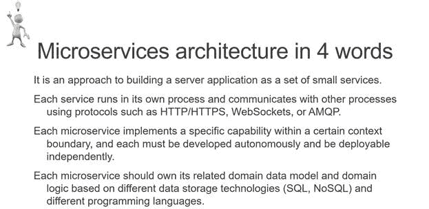
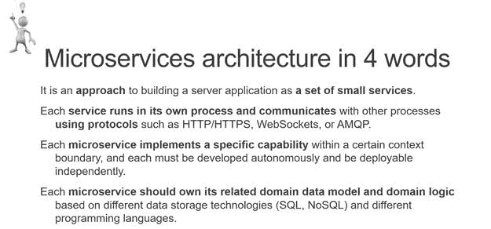
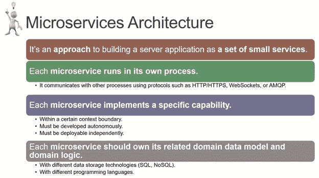
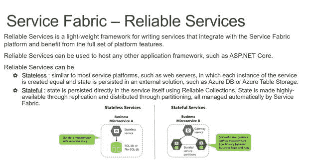
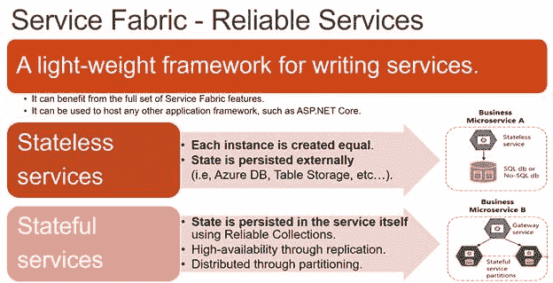
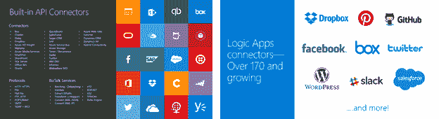
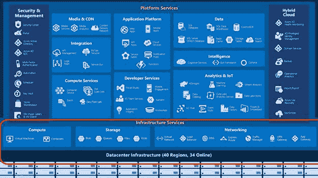
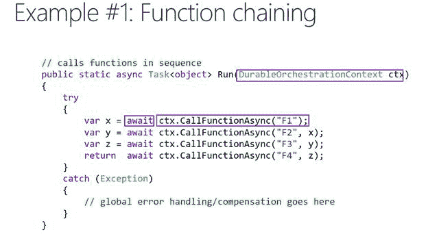

# 四、准备演示：面向极客还是不面向极客？

你还记得上一章开头我们提到的第二种极客吗？你见过有这些品质的演讲吗？

*   幻灯片上的文本太多，字体很小。
*   项目符号太多(四个以上)，子项太多。
*   整份文件贴在幻灯片上，最后有一个很长的链接。
*   源代码使用微小的字体粘贴在幻灯片上，或者显示在编辑器中，而不增加字体或使用像 ZoomIt 这样的工具。 [23](Public_Speaking_for_Geeks_0012.htm#_ftn23)
*   太多难以阅读的图形、图片和图表。
*   缓慢且耗时的干扰过渡。

永远记住，人们倾向于阅读你放在幻灯片上的所有内容。如果需要添加参考幻灯片，可以在演示过程中隐藏它们，或者将它们移到附录中。

|  | 提示:与非技术人员进行演练可以帮助您提高幻灯片质量，减少分散注意力的内容，并提高演示文稿的可读性。 |

下次你带着之前的品质参加演示时，注意你对每张幻灯片的反应，你花了多少时间阅读它们，有多少时间被不必要的复杂图表或模式分散了注意力。

你必须拥有的幻灯片只有第一张和最后一张。第一个是当人们进入房间时，在你开始展示之前，投射的，包括会议的标题、你的名字、联系方式(可选)、会议标识等。

当人们进入房间时，播放标题幻灯片是很重要的。它给人一种积极的印象，即演讲者已经准备好了，帮助人们了解他们是否在正确的房间，并允许他们记下您的联系信息(如果幻灯片上有)。

|  | 提示:有时创建一个小的(最多三四张幻灯片)滚动演示会很有用，其中包含人们在参加讲座之前应该知道的重要信息。您可以使用标题幻灯片和一些在屏幕上循环播放的信息性幻灯片(带有“在我们开始之前”或类似标题)创建单独的幻灯片组。准备好正式的演示文稿，这样开始的时候就不会浪费时间了。 |

最后一张幻灯片至关重要:如果会议组织者正在收集反馈，它应该包含您的联系方式(必填)、反馈请求以及会议代码或会议标题。你应该在做问答的时候把它放在屏幕上，除非你需要一些幻灯片来回答问题。

如果您在“无幻灯片会议”上进行演示，或者如果您决定完全避免幻灯片，您可以打开文本编辑器，将字体大小增加到 40 或更大，并在演示结束时写下您的联系方式。您还可以在演示过程中使用您的联系方式和演示标题作为桌面背景—这不是幻灯片，而是背景！

您应该避免会议模板中经常出现的“关于我”和“议程”幻灯片，因为人们关心的是演示文稿的价值，而不是演讲者，并且因为议程仅适用于一天或多天的课程。如果您愿意，可以将“关于我”和“议程”幻灯片保存在演示文稿的可下载或打印版本中。

如果你真的想用一张“关于我”的幻灯片，最好把它放在演示的主要价值之后。首先，告诉观众为什么他们应该听你的，然后如果你无法避免，你可以花几秒钟谈论你。

一个更好的“议程”幻灯片，如果你正在展示一天或多天的课程，可以设计成一个时间线，而不是一个无聊的要点列表。

将资源和其他“无聊”的幻灯片保留在附录中，并且仅在需要时才显示。

“回顾”幻灯片比“议程”幻灯片更好，但有时重复相同的概念会有浪费时间的风险。只有当演示文稿中有许多重要主题，并且您需要明确阐明您的行动要求时，才最好使用它们。

|  | 注意:如果您应该避免使用“关于我”和“议程”幻灯片，为什么会议模板一直使用它们？“我们一直都是这样做的”是典型的答案。记住，生活始于你舒适区的尽头。 |

“*代码重构是重组现有计算机代码的过程——改变*因子*——而不改变其外部行为*。” [24](Public_Speaking_for_Geeks_0012.htm#_ftn24)

同样，我们将使用*幻灯片重构*来提高典型极客幻灯片的可读性和可理解性。

|  | 注意:您不能在不丢失信息的情况下过度简化技术幻灯片，但是您可以尝试使用正确的字体、颜色、动画和图片来改进它。 |

让我们从下面这张幻灯片开始，它取自一个关于微服务和物联网的真实演示。

图 19:大量文本的幻灯片

我们可以从突出最重要的单词开始。

图 20:用粗体突出显示单词

我们可以使用上下文菜单中的**转换为 SmartArt** 来更好的突出重要部分，如下图所示。

图 21:将项目符号点转换为智能艺术

将项目符号列表转换为 SmartArt 后，您可以使用其属性、形状、颜色和动画来获得可读性更强的幻灯片。

图 22:幻灯片重构完成！

在前面的例子中，我们决定保持幻灯片的复杂性，但使用排版和智能艺术来提高可读性。

在下一个示例中，我们将尝试简化一张关键思想不明显的复杂幻灯片，同时保持原始含义。

图 23:文本太多，没有明确的分隔，没有明确的值

一张更好的幻灯片可以有一个清晰的定义(一个轻量级框架…)和两种不同类型的服务(无状态和有状态)之间的清晰区分，每种服务都有其主要属性和一个图像。

图 24:明确的定义，明确区分无状态和有状态

图 24 中显示的幻灯片，加上正确的动画，可能比原始幻灯片更有效。

根据观众的不同，我们可以决定从幻灯片中剪切更多的文本，或者我们可以将幻灯片拆分为两张不同的幻灯片，并添加更大的图片。

|  | 注意:SmartArt 向导仅在编写时在 PowerPoint 中可用。您可以在 Keynote 或其他工具中通过对齐不同的对象来创建它们，但整体结果可能更难模拟。 |

要点是不好的——它们扼杀了人们的注意力。大多数时候你无法避免它们，但是你可以尝试在幻灯片中添加一些图片和颜色来吸引你的观众。

很容易想象用来制作下面这张幻灯片的丑陋无聊的要点列表。

图 25:呈现列表的更好方式

你喜欢哪一个？

我们能做得更好吗？我们当然可以！最后一项过于冗长，字体比其他项目中使用的字体小，但正如我们之前所说的，有时您不能过于简化幻灯片，这取决于受众。

|  | 提示:您不需要阅读幻灯片，但有时在屏幕上显示详细的列表可以帮助您记忆。如果屏幕上有更多的项目可以帮助你记住重要的东西，那就更好了。下次向其他观众演示时，您可以随时删除它们。 |

请看下面两张幻灯片。

图 26:如何在不减少差异的情况下降低复杂性

左边的幻灯片更完整；它描述了许多元素，上面有 20 个标志。右边的幻灯片更简单，徽标更少，但提供了相同的一般信息。简化幻灯片时，重要的是保持一定的可变性，以增加趣味性。例如，在右边的幻灯片上，有消费者和商业服务，个人和企业服务，等等。

如果你知道一个或多个项目对你的观众很重要，那就保留它们吧！如果你知道有些项目是你的观众意想不到的，那就添加它们，甚至更好——将它们制作成动画，以产生“哇”的效果。

避免使用项目符号、SmartArt 和类似组件的一种方法是创建每张幻灯片只有一个想法的幻灯片。优点很明显:你可以使用大字体，有一个漂亮的图片，谈论几秒钟的想法，然后你可以继续下一张幻灯片。

实际上，很难每张幻灯片只有一个想法，因为人们往往对一个主题说得太多，对下一个主题说得太少，如果没有适当的预演，很难估计演示所需的时间。

有时候展示一张充满东西的幻灯片是有用的，只是为了突出某个特定的部分，让人们知道主题的复杂性，就像下面这张幻灯片一样。

图 27:带有高亮子集的复杂幻灯片

如果下一张幻灯片是对突出显示的主题的深入探讨，您可以使用变形过渡来更好地连接两张幻灯片。

图 28:只显示相关源代码的幻灯片

在图 28 中，您可以看到重要的信息被突出显示，错误处理代码被删除(在上下文中并不重要)，代码中只留下相关的注释。试着限制你放在幻灯片上的源代码的数量，并且总是检查它从观众的最后一行是可见的。

作为一名演讲者，你必须问自己这个简单的问题。 [25](Public_Speaking_for_Geeks_0012.htm#_ftn25)

残疾可能是永久性的，也可能是暂时性的。当向某人展示时，不同学习风格的人或说其他语言的人 [26](Public_Speaking_for_Geeks_0012.htm#_ftn26) 可能会有类似于残疾人的问题。

演示文稿中的每张图片都应该有一个可以被屏幕阅读器阅读的书面描述，每段视频都应该有字幕，字体应该可读，演讲者应该尝试给难以理解的图形和图片提供上下文。

|  | 提示:PowerPoint 在“审阅”选项卡中提供了“检查辅助功能”命令。使用它来检查您的演示文稿，并使它们更容易访问。 |

|  | 注:“可及性”和“包容性”这两个术语密切相关。粗略地说，可访问性指的是与残疾相关的方面(如视力障碍)，而包容性是与可用性相关的一个稍微宽泛的术语，由最多的人使用。 |