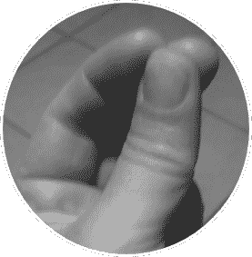
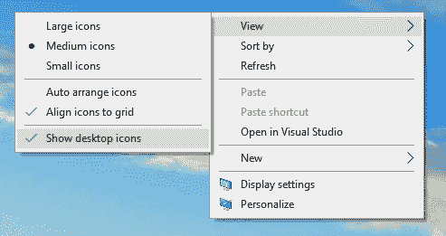
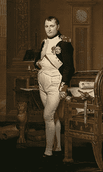

# 第六章谈话中:做一个更好的你！

多少次有人告诉你，“做好自己，一切都会好的！”这是一些最常用的建议，每个人在进入狮穴之前都会对别人说。这是不对的！

做你自己是不够的——做你自己会降低你的能量，因为你没有离开你的舒适区。“不要试图成为别人”可能是更好的建议，但你可能知道，在那些时刻，我们的大脑更喜欢接受积极的命令，而不是消极的命令。

“做更好的自己”应该是在演讲前给别人的建议。这是一个很好的建议，因为它会让你走出舒适区。它说你总是可以提高的，即使在做了多年的公共演讲人之后。

成为更好的你意味着你在那一刻处于最佳状态。这意味着人们可以看到你眼中的火焰，你在那里以最好的方式向他们传递价值。

你必须努力达到你的最佳状态，如果你的最佳状态从一个演示到另一个不同，这是正常的。

|  | 注:一个个人故事:在 Visual Studio 2010 发布会期间，我在意大利各地做巡回演出，我爷爷住院了。就在我去威尼斯开会之前，我姐姐在电话里告诉我，他凌晨去世了。我没想到会这样。我很震惊，但我决定完成我的疗程，然后回家。我们离家很远，所以即使我心情不好，我也决定展示我的会议。我决定这样做是为了参加活动的人，也是为了我自己。这并不容易。这不是我最好的表现，但我仍然记得那些时刻。我尽力做到最好，即使我最好的不是那个在那一刻之前和之后做了很多其他会议的人。 |

### 如何做一个更好的你

如果你已经录下了你的预演，就很容易开始了。观察它，在你的姿势、声音、穿着或肢体语言中找到一些让你感到不舒服的东西，并努力去做。

与人交谈，寻求直接反馈。问他们在你的会议期间什么让他们不舒服。也许这是一件小事，或者他们不知道确切的问题是什么，但是你应该试着去理解什么是可以改进的。

从意识到什么是不好的开始。没有手册可以成为更好的你；这是反复试验。

|  | 注意:呼吸是必不可少的。我认识一位年轻的演讲者，她表现出色，但在她的演讲中，有些东西让人们感到不舒服。许多人告诉我“她是一个很好的演讲者，但我并不完全喜欢她的会议。”我去了她的一些会议，试图了解哪里出了问题，我发现在演讲开始时，她的呼吸非常焦虑，这种焦虑毁了一些观众的会议。我的建议很简单:在开始前几分钟开始和某人谈论会议的主题，让焦虑消失。 |

如果你需要更多的灵感，你可以看看詹姆斯·惠特克的帖子“少吸点” [33](Public_Speaking_for_Geeks_0012.htm#_ftn33) 获得一些直接的提示。

您也可以从避免一些在演示过程中多次听到的句子开始:

*   “不好意思，这是我第一次在公众场合发言。”别这么做。你不必事先抱歉；它降低了你的信心和观众对你的信心。
*   “我就长话短说。”没人会相信你。演示必须有价值，必须在规定的时间内完成。长度不是关键。
*   “我的信息很多，时间不够，所以我会走得很快，真的很快！”你必须在规定的时间内给出价值；你不必列举所有你知道的事情。在演示文稿中创建一个附录，列出所有不适合的内容，并告诉人们您可以稍后讨论这些内容。
*   “我累了”、“我的飞机晚点了”或“我没有时间准备。”这是首先要避免的。人们在那里接受价值，信任你。如果你没有把每件事都做好，那是你的错；在这些句子之后，他们不会再相信你了。

|  | 提示:你不应该在演讲中使用亵渎或粗鲁的语言。
它们让你听起来不专业，你应该不惜一切代价避免它们。如果你的会话包含使用诅咒语的故事，并且你无法避免，最好在开始就说出来。如果你是一个例外的演讲者，你可能是证明规则的[例外](https://medium.com/@docjamesw/ode-to-the-f-word-15d783c81556)。 |

|  | 注意:许多会议和用户组都采用了一套行为准则，演讲者和与会者在会议期间和在线时都应该遵守。向组织者索要，或者在他们的网站上寻找。如果你不舒服，提前告诉他们。如果他们没有行为准则，那就表现得专业一点，避免做一些可能让别人不高兴的事情，尤其是观众来自不同国家的时候。 |

如果你想在每次演讲中成为一个更好的自己，你可以做很多事情，但最好的办法是建立你的一套仪式。

开始的时候，你要找到自己的套路，找出适合自己的。把你的日常事务写成清单是个好主意。

你的会议应该直接从价值开始，充满活力——它应该吸引人们。

你必须避免像“你能听到我吗？”您应该在演示开始前检查音频。你应该至少提前十五分钟到达，检查音频和视频连接，确保你的演示远程工作，检查当你走路时地板是否吱吱作响，等等。

你需要掌握这个房间，想出在不失去眼神交流的情况下你能去哪里。如果你需要做一个演示，你有一个手拿麦克风，你应该排练一下；你不能把麦克风放在桌子上。

如果你必须在讲台上讲话，因为麦克风是有线的，你应该提前知道。如果你需要讲台、白板之类的东西，最好提前和组织者核实多次。

人们能从房间后面看到你的幻灯片和字体吗？提前检查。如果你不习惯工具，比如 ZoomIt，不要相信它们。在会议期间，你会忘记使用它们。最好加大字号。

你有大计时器吗？你能让某人跟踪时间并在会议中途提醒你，然后当你还剩 15、10 或 5 分钟时？不要相信小手表，比如你的手机。如果你一直看着它，你会给你的观众传递错误的信息，告诉他们你很着急，因为你有更好的事情要做。

|  | 小贴士:有些人害怕提前到达并提前安排好一切，因为他们不想在观众面前停留几分钟而不说话，焦虑感越来越强。你可以通过利用额外的几分钟与前排的人聊天，询问他们的期望，试图了解他们对这件事的知识水平，等等来避免这种情况。 |

正如我们在前面几章中看到的，你应该避免从你是谁开始——直接进入正题。稍后，你可以在演讲中介绍自己，当它更适合你的时候，你也可以解释你为什么要做这个演讲。有时候打破这个规则更好；例如，如果你在一个正式的环境中交谈，最好在开始时介绍自己。也许你可以请组织者介绍你。

有很多放松技巧你可以学习，也可以在训练前使用。但是，在会议开始前或演出期间，你如何克服焦虑呢？

你可以使用的一个技巧是:当你学习和运用你最喜欢的放松技巧时，使用一个简单的手势，比如在放松的时候保持三个手指在一起。

图 29:引起放松的简单手势

然后，当你焦虑的时候，你可以用这个简单的手势回忆你的放松状态。通常，像这样的手势很容易使用，并且可以在其他人不知道的情况下完成。

另一种让你达到最佳状态的方法是力量摆姿势。研究表明，采用一种力量姿势可以让你处于更好的状态。最好的力量姿势之一是所谓的神奇女侠力量姿势:双手放在臀部，双脚分开，肩膀向后。

你可以看看艾米·卡迪(Amy Cuddy)的 TED 演讲《权力的摆出》， [34](Public_Speaking_for_Geeks_0012.htm#_ftn34) 然后你可以和她一起阅读最近的一篇 Q & A [35](Public_Speaking_for_Geeks_0012.htm#_ftn35) 获取主题的更新。

|  | 注意:当我让我的一个同事画我的头像时，她选择用我在演讲前总是使用的力量姿势来代表我。 |

图 30:神奇女侠力量姿势中的作者头像

当你从演示切换到演示时，不要让桌面上的杂物或你花哨的壁纸分散你的观众的注意力，反之亦然。

选择标准的壁纸，或者更好的背景色。您可以用一个简单的命令隐藏所有图标，如下图所示。

图 31:在 Windows 10 中显示或隐藏桌面图标

如果您需要从演示切换到演示，或者切换到多组演示，您可以创建许多虚拟桌面，并通过简单的手势从一个切换到另一个。有了这个技巧，你就可以在移动到演示时保持 PowerPoint 的运行；当您正在播放动画幻灯片时，它尤其有用。

|  | 注:MacOS 从 2007 年开始支持虚拟桌面(当时称为“空间”)，在 OS X Leopard 和更高版本中提供。微软在 Windows 10 中原生增加了虚拟桌面支持；对于以前的版本，您需要第三方工具。自 20 世纪 90 年代以来，Linux 和其他类似 Unix 的操作系统中的虚拟桌面支持已经出现。您始终可以使用快捷方式或触控板手势(如果可用)在虚拟桌面之间切换。 |

请记住关闭桌面和手机上的通知。

不管你是内向还是外向，不管你是坐在桌子后面还是站在观众面前:没有眼神交流，你会在几分钟内失去大多数人。你需要有一个关于眼神交流的仪式。你应该让你的朋友看着你，并在会议结束时告诉你你看起来像机器人，还是像洒水器。他们可以让你知道你是否一直盯着你的脚或天花板，或者像大多数人一样，盯着幻灯片。

你必须在一对一的谈话、小型会议和面对大观众的演讲中锻炼眼神交流。 [36](Public_Speaking_for_Geeks_0012.htm#_ftn36)

|  | 提示:通过一个简单的练习，你可以在一对一的讨论中改善眼神交流。你看着你的对话者的眼睛，告诉他们一系列事情，而不会失去眼神交流，使用填充词，或者暂停。另一方选择第一个主题；然后，轮到你选择话题，你的伴侣也应该这样做。 [37](Public_Speaking_for_Geeks_0012.htm#_ftn37) |

|  | 小贴士:在大房间里，你可以使用一种技巧来展示眼神交流，而不必看着房间里的每个人。你可以简单地把注意力集中在你前面的几排，看看那里的人。你视线里的所有人都会觉得和你有联系。 |

许多人认为，一个人总是需要采用一种强大的沟通方式来给与会者留下深刻印象，并有更大的成功机会。有时候，无力的沟通可以给出更好的结果。 [38](Public_Speaking_for_Geeks_0012.htm#_ftn38)

|  | 注意:你可以用同样的幻灯片，同样的演示，同样的内容，进行充满诗意或无力的交流；这就是为什么这一段在本章而不是在第三章。 |

让我们看看这两种风格有什么不同。

表 1:沟通风格的差异

| 强大的风格 | 无力风格 |
| --- | --- |
| 当我们有权威，当人们信任我们，当我们有信誉或地位使我们能够毫无疑问地陈述事实时，这是有用的。 | 当与会者对我们的专业知识持怀疑态度时，当我们和观众之间存在重大差异时(年龄、角色等)，这一点非常有用。)，或者当有问题的与会者试图破坏我们的可信度时。 |
| 基于精确的断言、事实、规则、指示。使用*强词夺理*。 | 基于问题，寻求建议，试探性地交谈，有时，表达脆弱。 |
| 你是来教他们东西的。 | 你在那里与观众一起理解和创造一些东西。 |

想象一下，你需要向更有经验的观众展示一些东西，而他们并不了解你。

你可以尝试建立信任，但这将是一个漫长的过程，有时可能会适得其反。或者你可以从一种无能为力的风格开始，承认你和他们之间的差异，通过说你想更好地理解他们对这个话题的看法，如何利用他们的经验来适应它，等等来设定标准。

没有人能保证第二种方法效果更好，但大多数情况下这是最简单的方法，至少在观众非常有凝聚力的时候(例如，在公司的研讨会上)。

如果你正在为类似的听众做一系列的课程，你可以利用第一节课的反馈来调整你的沟通风格，以适应接下来的课程。假设你收到的反馈是“缺乏自信”你可以尝试采用更有力的风格。如果你收到类似“他的内容不符合我们的背景”的反馈，最好采用一种无能为力的风格，从关于与会者环境的问题开始，并尝试给出与他们的背景相关的实际例子。

|  | 提示:你可以在一张充满要点、事实和指示的幻灯片上试探性地说话。你可以在充满问号的幻灯片上使用强大的风格。最重要的是你的交流方式，你的肢体语言，你的语气要匹配。 |

你可以在谈话中多次转换风格。例如，当你需要定义问题时，你可以使用一种无能为力的风格，当你制定解决方案时，你可以切换到一种有力的风格。当你觉得观众信任你的时候，你也可以在多天的接触中从一种无能为力的风格转变为一种强大的风格。

在标题为[如何成为更好的你](#_How_to_be_a_better_you)的部分中，“我们告诉过你要避免像“对不起，这是我第一次在公共场合发言”这样的句子。”

那么，如何才能在不影响可信度的情况下表达脆弱呢？你可以尝试使用一些幽默，并期待观众的评论。例如，如果你是一名 40 多岁的主持人，你在千禧一代的创业类型面前演讲，你可以从一个关于你年龄的笑话开始，问他们是否知道一些 80 年代的著名电影或系列，然后你可以搬到 90 年代。

|  | 注意:作为一个意大利人，我总是拿我的肢体语言、手势、语调和其他典型的刻板印象开玩笑，尤其是在国外演讲的时候。 |

预测关于年龄差异、文化差异和技术背景的评论可以是一种很好的方式来表达脆弱性，并在不失去信任或使用弱句子的情况下找到与观众的联系。

永远记住要真实。如果你不关心你的听众，如果你的演讲试图以一种非常傲慢的方式推销一些东西，如果你穿着一件有力量的 t 恤，或者如果你的肢体语言与你的无能风格不匹配，你就不能使用无能为力的交流。 [39](Public_Speaking_for_Geeks_0012.htm#_ftn39)

演示失败，投影仪失败，你的声音可能会失败——演示过程中可能会出现很多问题。

你有幻灯片的备份吗？云中还有一个？

|  | 提示:打印一份演示文稿，每页两张或三张幻灯片。您可以将其用于注释。不要依赖演示者视图及其注释部分—当您看打印的幻灯片时，比盯着屏幕时更可信。 |

没有互联网你能做你的会话吗？当技术不起作用时，你能提供价值吗？你是否有一个可行的解决方案来显示你的代码或一个部署的网站是否出了问题？

|  | 提示:在纸上画出演示的流程，并将其放在键盘附近。如果有人正在录制会话，请检查它是否在摄像机中不可见。 |

如果演示至关重要，您可以提前录制演示作为备份，尤其是在涉及外部硬件、互联网或云访问的情况下。

记住，你不需要幻灯片来传递价值。你也不需要道具、演示或其他任何东西。你可以用你的声音、肢体语言和存在来传递价值。很难，但有时候值得！

|  | 注:一个个人故事:几年前，在罗马的一次大型会议上，我在两台不同的电脑上准备了两套演示文稿。第一张幻灯片很少，连接到投影仪，最后是一张“碎屏”幻灯片。我用那张幻灯片作为借口，关掉了投影仪，继续没有它。第二组幻灯片在第一排的电脑上，只有我可以看到，它们被用来跟随我准备的流程。会议进行得很顺利，以两次起立鼓掌结束！ |

你还记得拿破仑·波拿巴吗？他经常被描绘成一只手插在马甲里。这个姿势，手放在肚子上，可以让你用横膈膜轻松呼吸。

图 32:雅克-路易·大卫的画作《杜伊勒里宫书房里的拿破仑皇帝》，1812 年。来源:维基百科。

当你遇到麻烦，声音开始颤抖时，用横膈膜呼吸会有很大帮助。看起来像个过去的皇帝，总比说不完话好得多！

如果你是会议组织者、房间经理或下一个发言人，有人在会议期间遇到了麻烦，请站出来帮助发言人。你可以开始一轮掌声，作为鼓励。你可以给他或她一瓶水。这是拯救演讲者和演讲免于灾难的好方法。

你也可以在演讲结束时，在问答环节，通过成为第一个提出(简单的)问题来打破僵局的人来帮助演讲者。

许多事情可能会毁了你的演讲，但你可以克服其中的大部分:

*   有些人发现用手拿麦克风进行会话非常复杂。忘掉它！大多数时候你是被迫使用它们的，所以做好功课，挑一个小瓶子，做大量的练习。
*   有些人在演讲时喜欢走很多路。走路可以是一件好事，但是你不应该走得太远。如果录制了会话，最好限制说话者的移动。在这种情况下，与摄影师交谈以了解范围。如果你愿意，用胶带在地板上画一个 X，并留在它后面。
*   用另一种语言做报告需要更多的准备。你至少还需要三四次试跑；你应该检查语法(你应该经常检查，但在外语中它更重要)。你应该仔细听你的排练，了解一些单词或句子是否很难记住，并改变它们或制作一张有意义的幻灯片来有效地传达这一点。
*   如果一个演讲格式有自动推进幻灯片， [40](Public_Speaking_for_Geeks_0012.htm#_ftn40) 你需要排练很多次。当幻灯片继续播放时，很尴尬，演讲者开始恳求组织者回到上一张幻灯片。如果一个概念不符合分配的幻灯片时间，您应该复制幻灯片(失去一个位置)或简化它。

你不是一个应该逐字逐句传递东西的演员。你只需要可信地传递价值。背诵一篇演讲非常困难，容易出现错误、停顿和填充词，给你的听众留下错误的印象。

如果你死记硬背你的演示文稿，有可能你会专注于准确地回忆它，而不是自然和灵活。

一些扬声器喜欢使用提词器、带音符的辅助显示器或类似的东西。你可以很容易地发现他们，因为他们的表演听起来是录制好的。同样的事情发生在你用心学习一切的时候；感觉不自然。

你应该做的是记住两件事:

*   以最佳方式打开您的演示文稿，直接进入价值。一种方法是精心设计一些非常有力的开场白，然后逐字逐句地从其中一个开始。不是整个演讲——只是让你的演讲突飞猛进的第一句话！
*   以最佳方式结束演示。大多数演讲者都有声音表演，但在最后会逐渐消失，没有发出明确的行动号召，没有给出如何留下反馈的指示，也没有让与会者知道会议已经结束。

## 结束会话

永远不要通过立即开始问答来结束一个演示。做好问答会把你表演的命运掌握在观众手中。有些人可能会问一些烦人的问题，或者试图破坏你的演示。和上一段一样，你应该通过传递你的信息和接受掌声来结束会议，只有这样你才应该开始问答。人们必须知道会议已经结束，问答是额外的东西。

您可能想宣布，您很乐意在问答后立即在演示室外面回答其他问题，这样与会者就不会急于立即提问。

如果会议正在收集反馈，记得要求人们提交他们的输入，并向他们展示您的会议代码或标题，这样他们就不必做额外的工作来找到这些信息。

出于礼貌，一定要结束你的演讲，清理讲台或舞台，给下一位演讲者留出足够的时间来准备他们的演讲。