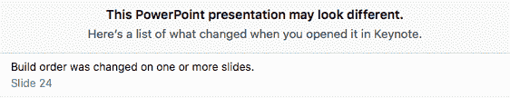
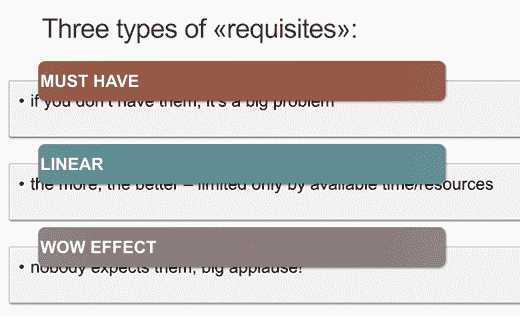
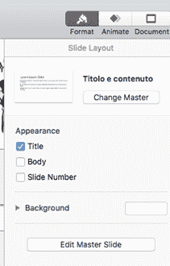
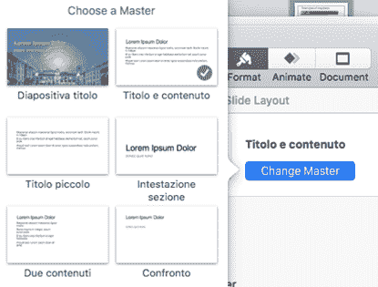
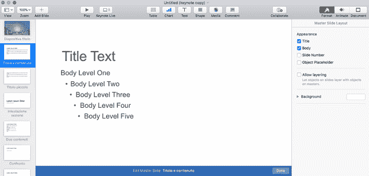
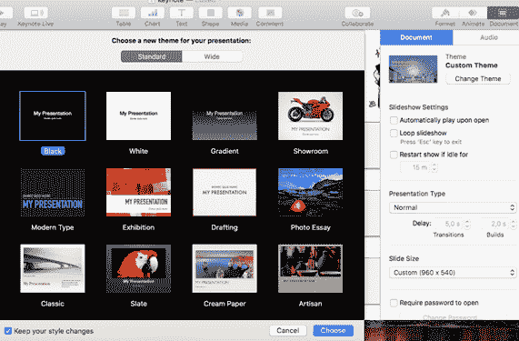
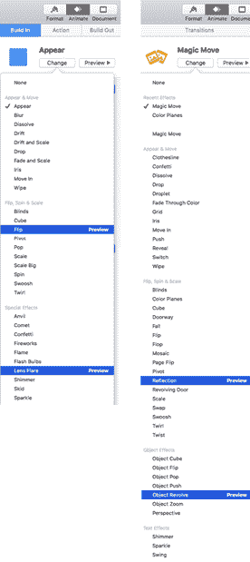
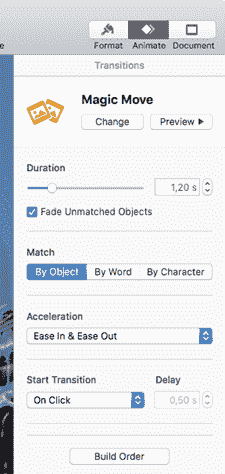

# 附录 B:关于 Keynote 的一些注意事项

苹果的 Keynote 在 macOS 和 iOS 上都有。在本附录中，我们将使用 macOS 版本。

|  | 注:本附录假设您已经阅读了[第 3 章](3.html#_Chapter_3_)，不会重复所有概念。请始终记住，Keynote 没有您在 PowerPoint 中可以找到的所有功能，因为它的设计目标之一是简单。 |

您可以在 Keynote 中打开 PowerPoint 演示文稿。Keynote 将尝试保留大部分内容和格式，但有些事情会有所不同。

图 33:在 Keynote 中打开 PowerPoint 演示时的警告

您需要仔细检查您的演示文稿，无论是在编辑器中还是在全屏显示时，因为有些过渡和动画将完全不同，而有些将完全缺失。此外，字体和 SmartArt 可能不同，如下图所示。

图 34:转换 SmartArt 时的一些问题

|  | 注意:撰写本文时，Keynote 可以打开在 PowerPoint 中创建的 SmartArt，但没有 SmartArt 的概念。每个对象都是独立打开的，例如，没有一个工具可以轻松地从项目符号列表创建智能艺术。 |

您也可以将 PPT 或 PPTX 幻灯片从 Keynote 保存到 PowerPoint，但同样的问题也将适用于转换的这个方向。在使用不同的程序进行演示之前，请务必检查您的演示。

如果选择一张幻灯片(或多张)并打开**格式**边栏，可以更改幻灯片中使用的主幻灯片，如下图所示。

图 35:编辑幻灯片布局

图 36:更改当前幻灯片的母版

您可以通过选择**编辑主幻灯片**来编辑或创建新的主幻灯片。您可以修改所有主幻灯片，完成后，点击**完成**。

图 37:编辑主幻灯片

您也可以通过选择**文档**边栏，然后单击**更改主题**来完全更改演示文稿的主题。 [42](Public_Speaking_for_Geeks_0012.htm#_ftn42)

图 38:改变主题

幻灯片动画和过渡都在窗口右侧的**动画**边栏下。如果选择一个对象(或多个对象)，可以对其进行动画制作；如果您选择了整张幻灯片，您将更改该幻灯片和下一张幻灯片之间的过渡。

下图显示了 Keynote 中可用的不同动画和过渡 [44](Public_Speaking_for_Geeks_0012.htm#_ftn44) 。

图 39:动画(左边)和过渡(右边)

魔法移动是 PowerPoint 中变形过渡的 Keynote 等价物(它是在它的竞争对手之前引入的)。

这两种过渡是不可互操作的，因此如果您在 PowerPoint 中有一个带有变形过渡的演示文稿，并且您在 Keynote 中打开它，您需要将“神奇移动”过渡应用到需要它的幻灯片。

你可以在窗口右侧的**动画**边栏下找到**魔法移动**。您需要在窗口左侧选择一张幻灯片，以查看**动画**下的**过渡**边栏。 [45](Public_Speaking_for_Geeks_0012.htm#_ftn45) 可以对对象、单词甚至单个字符进行动画处理(每个字符都应该在自己的文本框中)。

图 40:魔法移动过渡