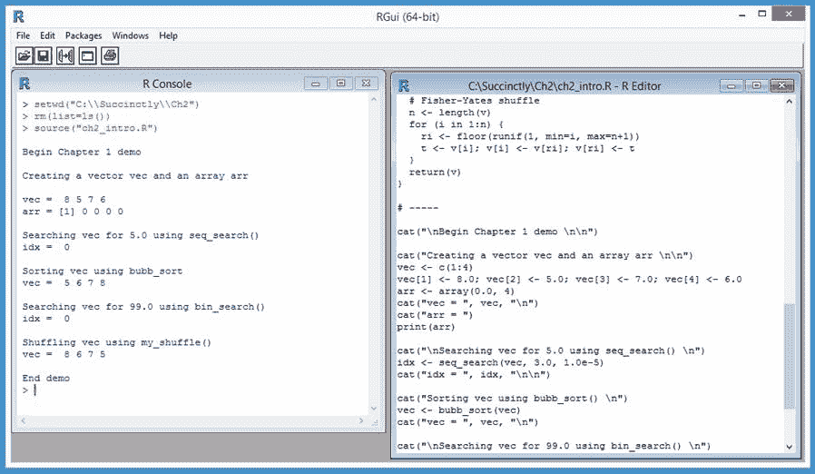

# 第二章向量和函数

可以说，R 语言中五个最基本的对象是向量、列表、数组、矩阵和数据框。然而，我们应该注意到，R 使用的术语与大多数其他编程语言有些不同。在其他语言中，R 向量对应于所谓的数组，而 R 数组和矩阵对应于其他语言中数组风格的数据结构。能够处理五个基本对象并编写操作它们的函数是关键技能。

图 19 的屏幕截图让您了解了这一章的发展方向。



图 19:向量和函数演示

在 2.1 节中，我们将查看 R 中的五个基本集合对象(向量、列表、数组、矩阵和数据框)，您将学习如何编写程序定义的函数来处理这些集合对象。在 2.2 节中，我们将看到如何使用内置函数(如`which.max()`和`is.element()`)以及程序定义函数对向量执行顺序搜索。

在 2.3 节中，您将学习如何使用程序定义的函数执行二分搜索法。在 2.4 节中，我们将研究如何使用内置的`sort()`函数对向量进行排序，以及如何编写程序定义的排序函数。最后，在 2.5 节中，您将学习如何打乱向量中的值，以及如何选择向量中值的样本。

## 2.1 向量、列表、矩阵、数组和数据框

一个 R `vector`有固定数量的单元格，每个单元格保存相同数据类型(整数、字符等)的值。).A `list`可以保存不同类型的值，一个列表的长度可以在运行时改变。A `matrix`在两个维度(行和列)上有固定数量的单元格，每个单元格都保存相同的数据类型。

一个`array`在一个、两个、三个或更多维度上有固定数量的单元格，每个单元格都保存相同的数据类型。A `data.frame`的列中值的数量和数据类型可以不同。

代码清单 2:R

```
  # vectorsVsArrays.R
  # R 3.2.4

  cat(“\nBegin vectors vs. arrays demo \n\n”)

  cat(“Creating three demo vectors \n\n”)
  v <- c(1:3)  # [1 2 3]
  cat(v, “\n\n”)

  v <- vector(>mode=“numeric”, 4)  # [0.0 0.0 0.0 0.0]
  cat(v, “\n\n”)

  v <- c(“a”, “b”, “x”)
  cat(v, “\n\n”)

  cat(“Creating two demo lists \n\n”)
  ls <- list(“a”, 2.2)
  ls[3] <- as.integer(3)
  print(ls)
  cat(“\n”)
  cat(“Cell [2] is: “, ls[[2]], “\n\n”)

  ls <- list(lname=“Smith”, age=22)
  cat(“Cells by cell names are: “, ls$lname, “-”, ls$age)
  cat(“\n\n”)

  cat(“Creating a 2x3 matrix \n\n”)
  m <- matrix(0.0, nrow=2, ncol=3)
  print(m)
  cat(“\n”)

  cat(“Creating 1 and 2-dim arrays \n\n”)
  arr <- array(0.0, 3)  # [0.0 0.0 0.0]
  print(arr)
  cat(“\n”)

  arr <- array(0.0, c(2,3))  # 2x3 matrix
  print(arr)
  cat(“\n”)

  # arr = array(0.0, c(2,5,4)) # 2x5x4 n-array
  # print(arr)  # 40 values displayed
  # cat(“\n”)

  cat(“Creating a data frame \n\n”)
  people <- c(“Alex”, “Barb”, “Carl”)
  ages <- c(19, 29, 39)
  df <- data.frame(people, ages)
  names(df) <- c(“NAME”, “AGE”)
  print(df)

  cat(“\nEnd vectors vs. arrays demo \n\n”)

```

```
  >
  setwd(“C:\\Succinctly\\Ch2”)
  >
  rm(list=ls())
  >
  source(“vectorsVsArrays.R”)

  Begin
  vectors vs. arrays demo 

  Creating
  three demo vectors 

  1
  2 3 

  0
  0 0 0 

  a
  b x 

  Creating
  two demo lists 

  [[1]]
  [1]
  “a”

  [[2]]
  [1]
  2.2

  [[3]]
  [1]
  3

  Cell
  [2] is:  2.2 

  Cells
  by cell names are:  Smith - 22

  Creating
  a 2x3 matrix 

  [,1] [,2] [,3]
  [1,]   
  0    0    0
  [2,]   
  0    0    0

  Creating
  1 and 2-dim arrays 

  [1]
  0 0 0

  [,1] [,2] [,3]
  [1,]   
  0    0    0
  [2,]   
  0    0    0

  Creating
  a data frame 

  NAME AGE
  1
  Alex  19
  2
  Barb  29
  3
  Carl  39

  End
  vectors vs. arrays demo  

```

通过发出`setwd()`命令指向源代码目录，调用`rm()`命令移除当前上下文中的所有现有对象，并使用`source()`命令开始程序执行来启动演示程序。接下来，演示创建并显示三个向量:

`v <- c(1:3) # [1 2 3]
cat(v, “\n\n”)`

`v <- vector(mode=“numeric”, 4) # [0.0 0.0 0.0 0.0]
cat(v, “\n\n”)`

`v <- c(“a”, “b”, “x”)
cat(v, “\n\n”`

`c()`函数的名字是“组合”的缩写，当你知道初始单元格值时，这个函数可以用来创建一个向量。

向量的单元格数据类型(`integer`、`numeric` / `double`、`character`、`logical`、`complex`、`raw`)是通过传递给`c()`函数的值来推断的。如果要明确指定单元格类型，可以使用带有如图所示的`mode`参数值的`vector()`函数。

使用基于 1 的索引访问向量单元值，例如`v[1] <- 3.14`或`x <- v[3]`。接下来，演示程序展示了如何创建、操作和访问一个简单的列表:

`ls <- list(“a”, 2.2)
ls[3] <- as.integer(3)
print(ls)
cat(“Cell [2] is: “, ls[[2]], “\n\n”)`

第一条语句创建了一个包含两个值的列表，字符 *a* 和数字 2.2。第二条语句通过在单元格索引[3]处添加新的整数值 3 来动态扩展列表的长度。与几乎所有的 R 复合对象一样，列表使用基于 1 的索引，而不是基于 0 的索引。

请注意，为了访问列表单元格[2]中的值，演示使用了双方括号“`ls[[2]]`”，而不是单方括号(这将返回一个具有一个值的列表对象)。但是，为了在列表的单元格[3]中存储一个值，演示使用了单个方括号:`ls[3] <- as.integer(3)`。通常但不总是正确的两个经验法则——第一，在赋值语句的右侧或单独使用时使用双方括号；第二，在赋值语句的左侧或访问列表中的项目时使用单个方括号。

接下来，演示创建了一个列表，在该列表中可以按名称和索引访问单元格值:

`ls <- list(lname=“Smith”, age=22)
cat(“Cells by cell names are: “, ls$lname, “-”, ls$age)`

名为`ls`的列表通过存储姓氏和年龄来表示一个人。请注意，使用`$`标记可以访问单元格值。作为另一个通用的经验法则，为了清楚起见，在使用列表存储相关值时，最好是按单元格名称而不是按索引进行访问。

接下来，演示创建并显示一个 2x3 数字矩阵:

`m <- matrix(0.0, nrow=2, ncol=3)
print(m)`

**`matrix`** 函数有几个可选参数，但演示示例使用了最常见的模式。接下来，演示程序演示了 R 数组类型:

`arr <- array(0.0, 3)
print(arr)`

`arr <- array(0.0, c(2,3))
print(arr)`

第一个示例创建一个一维数组，该数组有三个单元格，每个单元格都初始化为 0.0。第二个示例创建了一个有两行三列的二维数组，其中六个单元格都初始化为 0.0。请注意，一维数组可用于使用向量的情况，二维数组可用于使用矩阵的情况。

一个数组可以有三维或更多维。例如，`arr <- array(0.0, c(2,5,4))`创建一个三维数组——第一个包含两个单元格，第二个包含五个单元格，第三个包含四个单元格，总共 40 个单元格。

接下来，演示程序创建一个 **`data.frame`** 对象:

`cat(“Creating a data frame \n\n”)
people <- c(“Alex”, “Barb”, “Carl”)
ages <- c(19, 29, 39)
df <- data.frame(people, ages)
names(df) <- c(“NAME”, “AGE”)
print(df)`

虽然 R 数据框与其他语言中的表对象有些相似，但数据框是按列而不是按行手动创建的。前两个语句用三个人的名字创建一个列向量，用他们的年龄创建第二个列向量。`data.frame()`函数有几个可选参数，为创建数据框对象提供了极大的灵活性。

创建数据框后，演示为这两列提供标题名“名称”和“年龄”。标题名称是可选的，但是它们很有用，因为许多内置的 R 函数都使用它们。

在许多情况下，您会希望使用`read.table()`函数或密切相关的`read.csv()`或`read.delim()`函数从存储在文本文件中的数据创建数据框，而不是通过编程方式从列向量构建数据框。

总之，R `vector`对应于大多数其他编程语言中所谓的数组。使用基于 1 的索引访问向量。一个 R `matrix`正好有两个维度。一个 R `array`可以有一个、两个或更多的维度，因此可以像向量或矩阵一样运作。一个 R `list`可以保存不同类型的值，可以动态改变大小。使用索引访问列表值时，通常应该使用双方括号，而不是单方括号。一个 R `data.frame`是一个类似于表的对象，它通常有包含不同数据类型的列。

### 资源

有关创建和使用向量的更多详细信息，请参见:
[。](https://stat.ethz.ch/R-manual/R-devel/library/base/html/vector.html) 

有关创建和使用列表的更多详细信息，请参见:
[。](https://stat.ethz.ch/R-manual/R-devel/library/base/html/list.html) 

有关创建和使用矩阵的更多详细信息，请参见:
[。](https://stat.ethz.ch/R-manual/R-devel/library/base/html/matrix.html) 

有关创建和使用数组的更多详细信息，请参见:
[。](https://stat.ethz.ch/R-manual/R-devel/library/base/html/array.html) 

有关创建和使用数据框的更多详细信息，请参见:
[。](https://stat.ethz.ch/R-manual/R-devel/library/base/html/data.frame.html)

## 2.2 矢量顺序搜索

R 语言有几种内置的方式来搜索向量的目标值，包括`match()`、`is.element()`和`which.max()`函数以及`%in%`运算符。在一些使用数字向量的情况下，你会想要编写一个程序定义的顺序搜索函数。

代码清单 3:顺序搜索

```
  # seqsearching.R
  # R 3.2.4

  seq_search = function(v, t, eps) {
    # search vector v for target value t
    # eps is epsilon tolerance for equality

    n <- length(v)
    for (i in 1:n) {
      if (abs(v[i] - t) <= eps) {
        return(i)
      }
    }
    return(0)
  }

  my_print = function(v, dec) {
    n <- length(v)
    for (i in 1:n) {
      x <- v[i]
      xx <- formatC(x, digits=dec, format=“f”)
      cat(xx, “ “)
    }
    cat(“\n”)
  }

  cat(“\nBegin sequential search demo \n\n”)

  vec <- c(1.0, 5.0, 2.0, 3.0, 4.0)
  target <- 2.0
  epsilon <- 1.0e-5

  cat(“Vector is: “)
  my_print(vec, dec=2)
  cat(“\n”)

  cat(“Target is “)
  cat(formatC(target, digits=1, format=“f”), “\n”)
  cat(“Epsilon is “, epsilon, “\n”)
  cat(“Search using program-defined seq_search() \n”)
  idx <- seq_search(vec, target, epsilon)
  cat(“idx = “, idx, “\n\n”)

  cat(“Search using base %in% operator \n”)
  there <- target %in% vec
  cat(“there = “, there, “\n\n”)

  cat(“Search using base which.max() \n”)
  idx <- which.max(vec)
  cat(“idx of largest = “, idx, “\n\n”)

  target <- c(5.0, 3.0)
  cat(“Target is “, target, “\n”)
  cat(“Search using base match() \n”)
  matches <- match(vec, target)
  cat(“matches = “, matches, “\n\n”)

  cat(“Search using base is.element() \n”)
  matches <- is.element(vec, target)
  cat(“matches = “, matches, “\n\n”)

  cat(“End demo\n”)

```

```
  >
  source(“seqsearching.R”)

  Begin
  sequential search demo 

  Vector
  is: 1.0  5.0  2.0  3.0  4.0  

  Target
  is 2.0 
  Epsilon
  is  1e-05 
  Search
  using program-defined seq_search() 
  idx
  =  3 

  Search
  using base %in% operator 
  there
  =  TRUE 

  Search
  using base which.max() 
  idx
  of largest =  2 

  Target
  is  5 3 
  Search
  using base match() 
  matches
  =  NA 1 NA 2 NA 

  Search
  using base is.element() 
  matches
  =  FALSE TRUE FALSE TRUE FALSE 

  End
  demo

```

在向量中搜索值的最简单方法是使用`%in%`运算符。在演示程序中，关键代码是:

`vec <- c(1.0, 5.0, 2.0, 3.0, 4.0)
target <- 2.0
cat(“Search using base %in% operator \n”)
there <- target %in% vec
cat(“there = “, there, “\n\n”)`

存储在变量`there`中的返回结果是`TRUE`，因为目标值 2.0 在索引[3]处的源向量中。在大多数情况下，使用`%in%`运算符既简单又有效。但是，当您比较两个浮点值时，没有一个内置的 R 搜索机制能让您准确地控制相等的含义。

因为浮点值只是近似值，比较两个浮点值是否完全相等可能非常棘手。例如:

`> x <- 0.15 + 0.15 # 0.30
> y <- 0.20 + 0.10 # 0.30
> if (x == y) { cat(“equal”) } else { cat(“NOT equal”) }
> “NOT equal” # what the heck?`

通常最好使用内置的`abs()`(绝对值)函数来检查两个值是否非常接近，而不是比较两个浮点值是否完全相等。演示程序定义了使用这种方法的自定义搜索功能:

`seq_search = function(v, t, eps) {
n <- length(v)
for (i in 1:n) {
if (abs(v[i] - t) <= eps) {
return(i)
}
}
return(0)
}`

该函数使用 for 循环遍历源向量 v 的每个单元格。如果正在检查的当前值接近于一个小值 EPS(ε)，则该函数返回目标值的索引。如果没有一个单元格值足够接近目标值，则函数返回 0，这是无效的向量索引。

下面是关键的调用代码:

`vec <- c(1.0, 5.0, 2.0, 3.0, 4.0)
target <- 2.0
epsilon <- 1.0e-5`

`cat(“Target is “)
cat(formatC(target, digits=1, format=“f”), “\n”)
cat(“Epsilon is “, epsilon, “\n”)
cat(“Search using program-defined seq_search() \n”)
idx <- seq_search(vec, target, epsilon)
cat(“idx = “, idx, “\n\n”)`

不同的问题域倾向于使用不同的ε值，但是演示中使用的 0.00001 值在机器学习中非常常见。有几种方法可以显示格式良好的浮点值。我比较喜欢使用内置的`formatC()`功能。

内置的`which.max()`函数返回向量中包含最大值的索引。例如:

`vec <- c(1.0, 5.0, 2.0, 3.0, 4.0)
idx <- which.max(vec)`

这些语句将值 2 返回到变量`idx`中，因为`vec`中的最大值是 5.0，位于单元格[2]。还有一个类似的内置`which.min()`功能。

内置的`match()`函数对于搜索向量中的多个值非常有用。例如:

`vec <- c(1.0, 5.0, 2.0, 3.0, 4.0)
target <- c(5.0, 3.0)
matches <- match(vec, target)`

这里存储在变量`matches`中的返回值是列表`(NA, 1, NA, 2, NA)`，因为`vec`中的第一个值与`target`中的任何值都不匹配，`vec`中的第二个值与`target`中的【1】处的值匹配，以此类推。

内置的`is.element()`函数与`match()`函数非常相似，只是返回列表包含布尔值而不是整数索引。例如:

`vec <- c(1.0, 5.0, 2.0, 3.0, 4.0)
target <- c(5.0, 3.0)
matches <- is.element(vec, target)`

这些语句返回一个值为`(FALSE, TRUE, FALSE, TRUE, FALSE)`的列表，因为位于【2】和【4】的`vec`中的单元格的值与`target`中的值相匹配。

总之，如果你想搜索一个包含浮点值的向量，并且你想控制等式的ε容差，你可以很容易地编写一个程序定义的函数。搜索包含非浮点类型值的向量时，使用`%in%`运算符简单有效。为了找到向量中最大值的位置，可以使用`which.max()`功能。在向量中搜索多个值时，内置的`match()`和`is.element()`功能是不错的选择。

### 资源

关于`match`功能和`%in%`运算符的更多详细信息，请参见:
[。](https://stat.ethz.ch/R-manual/R-devel/library/base/html/match.html) 

有关`which.max()`和`which.min()`功能的更多信息，请参见:
[https://stat . ethz . ch/R-manual/R-dev/library/base/html/white . min . html](https://stat.ethz.ch/R-manual/R-devel/library/base/html/which.min.html)。

## 2.3 矢量二分搜索法

当搜索具有许多单元的排序向量或列表时，二分搜索法算法比顺序搜索快得多。基本的 R 语言没有二分搜索法算法。相反，您可以使用 gtools 包中的`binsearch()`函数，或者编写自己的二分搜索法函数。

代码清单 4:二分搜索法

```
  # binsearching.R
  # R 3.2.4

  bin_search = function(v, t, eps) {
    # search sorted vector v for target value t
    # eps is epsilon tolerance for equality
    lo <- 1
    hi <- length(v)
    while (lo <= hi) {
      mid <- as.integer(round((lo + hi) / 2)) # always even!
      cat(“lo, mid, hi = “, lo, mid, hi, “\n”)

      if (abs(v[mid] - t) <= eps) {
        return(mid)
      }
      else if (v[mid] < t) { # C format OK in a function
        lo <- mid + 1
      }
      else {
        hi <- mid - 1
      }
    }
    return(0)
  }

  cat(“\nBegin binary search demo \n\n”)

  vec <- c(1.5, 3.5, 5.5, 7.5, 9.5, 11.5, 13.5, 15.5, 17.5, 19.5)
  target <- 17.5
  epsilon <- 1.0e-5

  cat(“Vector is: \n”)
  print(vec)
  cat(“Target is “, target, “\n”)
  cat(“Epsilon is “, epsilon, “\n\n”)

  cat(“Begin search \n\n”)
  idx <- bin_search(vec, target, epsilon)
  if (idx == 0) {
    cat(“\nTarget not found \n\n”)
  } else {
    cat(“\nTarget found at cell index “, idx, “\n\n”)
  }

  cat(“End demo \n”)

```

```
  >
  source(“binsearching.R”)

  Begin
  binary search demo 

  Vector
  is: 
   [1] 
  1.5  3.5  5.5  7.5  9.5 11.5 13.5 15.5 17.5 19.5
  Target
  is  17.5 
  Epsilon
  is  1e-05 

  Begin
  search 

  lo,
  mid, hi =  1 6 10 
  lo,
  mid, hi =  7 8 10 
  lo,
  mid, hi =  9 10 10 
  lo,
  mid, hi =  9 9 9 

  Target
  found at cell index  9 

  End
  demo 

```

演示程序首先设置一个向量，该向量包含 10 个浮点值、一个要搜索的目标值和一个ε容差，ε容差决定了两个浮点值必须有多接近才能被视为相等:

`vec <- c(1.5, 3.5, 5.5, 7.5, 9.5, 11.5, 13.5, 15.5, 17.5, 19.5)
target <- 17.5
epsilon <- 1.0e-5`

`cat(“Vector is: \n”)
print(vec)
cat(“Target is “, target, “\n”)
cat(“Epsilon is “, epsilon, “\n\n”)`

程序定义的二分搜索法函数`bin_search()`是这样调用的:

`idx <- bin_search(vec, target, epsilon)
if (idx == 0) {
cat(“\nTarget not found \n\n”)
} else {
cat(“\nTarget found at cell index “, idx, “\n\n”)
}`

如果找不到目标值，返回值为 0；如果目标在向量中，返回值为目标值第一次出现的索引。

`bin_search()`函数的结构如下:

`bin_search = function(v, t, eps)
lo <- 1
hi <- length(v)
while (lo <= hi) {
# compute a midpoint
# if target at midpoint return index
# otherwise search left or sight part of v
}
return(0)
}`

虽然原则上很简单，但二分搜索法算法相当微妙，有许多可能的实现变化。为了计算指数`lo`和`hi`之间的中点，演示函数使用以下语句:

`mid <- as.integer(round((lo + hi) / 2))`

与许多其他编程语言相比，R `round()`函数是不寻常的，因为它使用 IEEE 754-2008“舍入到偶数”以下是二分搜索法实施的核心:

`if (abs(v[mid] - t) <= eps) { # found it!
return(mid)
}
else if (v[mid] < t) { # search left side
lo <- mid + 1
}
else { # search right side
hi <- mid - 1
}`

维基百科上关于二分搜索法算法的条目描述了核心的左搜索、右搜索实现的几种可选变体。

总之，基本的 R 语言没有二分搜索法函数。gtools 包有一个`binsearch()`函数，但是它不允许你控制浮点相等的ε容差，所以在某些情况下你会想要写一个自定义的二分搜索法函数。

### 资源

有关工具`binsearch()`功能的信息，请参见:
[。](http://svitsrv25.epfl.ch/R-doc/library/gtools/html/binsearch.html) 

关于令人惊讶的棘手的`round()`、`ceiling()`和相关函数的详细信息，请参见:
[。](https://stat.ethz.ch/R-manual/R-devel/library/base/html/Round.html)

## 2.4 矢量排序

基础 R 语言有一个`sort()`函数，可以用来排列向量中的值。`sort()`函数可以使用三种不同的排序算法:壳排序、快速排序和基数排序。您还可以为特殊情况编写自定义排序函数。

代码清单 5:排序

```
  # sorting.R
  # R 3.2.4

  bubb_sort = function(v) {
    # -----
    exchange = function(ii, jj) {
      tmp <<- v[ii]
      v[ii] <<- v[jj]
      v[jj] <<- tmp
    }
    # -----
    n <- length(v)
    for (i in 1:(n-1)) {
      for (j in (i+1):n) {
        if (v[i] > v[j]) {
          exchange(i, j)
          # tmp = v[i]; v[i] = v[j]; v[j] = tmp
        }
      }
    }
    return(v)
  }

  my_print = function(v, h, t) {
    n <- length(v)
    cat(“[1]    “)
    cat(head(v, h), “\n”)
    cat(“ . . . “, “\n”)
    idx <- n-t+1
    cat(“[“, idx, “]  “, sep=““)
    cat(tail(v, t), “\n\n”)
  }

  cat(“\nBegin sorting demo \n\n”)

  cat(“Generating 5,000 random values \n”)
  set.seed(0)
  vec <- rnorm(5000)
  cat(“Vector to sort is : \n”)
  my_print(vec, 4, 4)
  cat(“\n”)

  cat(“Sorting vector using built-in shell sort() \n”)
  start_t <- proc.time()
  sorted <- sort(vec, method=“shell”)
  end_t <- proc.time()
  times <- end_t - start_t
  cat(“Sorted vector is \n”)
  my_print(sorted, 4, 4)
  e_time <- formatC(times[3], digits=2, format=“f”)
  cat(“Elapsed time =“, e_time, “sec. \n”) 
  cat(“\n”)

  cat(“Sorting with user-defined bubb_sort() \n”)
  start_t <- proc.time()
  sorted <- bubb_sort(vec)
  end_t <- proc.time()
  times <- end_t - start_t

  cat(“Sorted vector is \n”)
  my_print(sorted, 4, 4)
  cat(“Elapsed time =“, times[3], “sec.\n”) 
  cat(“\n”)

  cat(“Verifying result is sorted using is.sorted() \n”)
  unsorted <- is.unsorted(sorted)
  if (unsorted == T) {
    cat(“Error. Result not sorted \n\n”)
  } else {
    cat(“Result verified sorted \n\n”)
  }

  cat(“End demo \n”)

```

```
  >
  source(“sorting.R”)

  Begin
  sorting demo 

  Generating
  5,000 random values 
  Vector
  to sort is : 
  [1]   
  1.262954 -0.3262334 1.329799 1.272429 
   .
  . .  
  [4997] 
  2.162363 1.175956 0.6190771 0.008463216 

  Sorting
  vector using built-in shell sort() 
  Sorted
  vector is 
  [1]   
  -3.703236 -3.236386 -3.115391 -3.082364 
   .
  . .  
  [4997] 
  2.961743 3.023597 3.039033 3.266415 

  Elapsed
  time = 0.00 sec. 

  Sorting
  with user-defined bubb_sort() 
  Sorted
  vector is 
  [1]   
  -3.703236 -3.236386 -3.115391 -3.082364 
   .
  . .  
  [4997] 
  2.961743 3.023597 3.039033 3.266415 

  Elapsed
  time = 27.57 sec.

  Verifying
  result is sorted using is.sorted() 
  Result
  verified sorted 

  End
  demo 

```

演示程序首先创建一个有 5000 个随机值的向量:

`set.seed(0)
vec <- rnorm(5000)
cat(“Vector to sort is : \n”)
my_print(vec, 4, 4)`

与一些允许您创建随机数生成对象的编程语言不同，R 有一个全局随机数生成器。调用`set.seed()`函数可以获得可重现的结果。

默认情况下，`rnorm()`函数返回平均值= 0.0、标准差= 1.0 的正态(高斯)分布的值，这意味着 5000 个演示值中的绝大多数将在-4.0 和+4.0 之间。

当使用非常大的向量时，您通常会发现显示所有单元格值是不切实际的。使用内置的`head()`或`tail()`功能在向量的开始或结束显示一些值通常是有用的。演示程序定义了一个自定义的`my_print()`函数，允许你在一个向量的开头和结尾看到一些单元格。

演示程序这样调用`sort()`函数:

`start_t <- proc.time()
sorted <- sort(vec, method=“shell”)
end_t <- proc.time()
times <- end_t - start_t`

该演示将对`sort()`的调用与对`proc.time()`函数的调用相结合，以确定排序需要多长时间。请注意，因为 R 函数是通过值而不是引用来调用的，所以结果被存储到名为`sorted`的新向量对象中。

`proc.time()`函数返回一个有三个值的向量。用于确定经过时间的值是单元格[3]中的值:

`e_time <- formatC(times[3], digits=2, format=“f”)
cat(“Elapsed time =“, e_time, “sec. \n”)`

有趣的是，如果`method`参数值没有提供给`sort()`函数，默认算法取决于单元格值的数据类型。对于包含整数、布尔值或因子值的向量，默认算法是基数排序。对于所有其他向量类型(如浮点值和字符值)，默认为壳排序算法。

这个演示有一个程序定义的函数，实现了一个粗糙的冒泡排序算法。一般来说，您只想在不寻常的情况下实现自定义排序函数。因为冒泡排序算法是最慢的合理算法，所以它有时被用作基线。

`bubb_sort = function(v) {
# -----
exchange = function(ii, jj) {
tmp <<- v[ii]; v[ii] <<- v[jj]; v[jj] <<- tmp
}
# -----
n = length(v)
for (i in 1:(n-1)) {
for (j in (i+1):n) {
if (v[i] > v[j]) { exchange(i, j) }
}
}
return(v)
}`

自定义`bubb_sort()`函数有一个名为`exchange()`的嵌套函数，用于交换数组中要排序的值。请注意，`exchange()`可以访问参数`v` `,`，但是为了更改`v`，必须使用特殊的`<<-`操作符。`bubb_sort()`功能是这样调用的:

`sorted <- bubb_sort(vec)
unsorted <- is.unsorted(sorted)
if (unsorted == T) { cat(“Error. Result not sorted \n\n”) }`

总之，基本 R 语言可以使用内置的`sort()`函数对向量进行排序，该函数可以使用壳排序算法、快速排序算法或基数排序算法。您可以使用`proc.time()`函数返回结果的单元格[3]中的值对 R 中的函数调用计时。R 语言支持嵌套函数定义，但在我看来，这些定义很少值得麻烦。内置的`is.unsorted()`功能可以用来测试向量是否排序。

### 资源

关于基础`sort()`功能的详细信息，请参见:
[。](https://stat.ethz.ch/R-manual/R-devel/library/base/html/sort.html) 

`rnorm()`功能及相关`dnorm()`、`pnorm()`、`qnorm()`详见:
[https://stat . ethz . ch/R-manual/R-dev/library/stats/html/normal . html](https://stat.ethz.ch/R-manual/R-devel/library/stats/html/Normal.html)。

## 2.5 矢量采样和洗牌

基本的 R 语言有一个通用的`sample()`功能，可以从给定的范围中选择一个数字子集，也可以将向量中的值随机排列。当您需要特殊行为时，还可以编写自定义函数来采样和打乱向量值。

代码清单 6:采样和洗牌

```
  # sampling.R
  # R 3.2.4

  my_sample = function(N, k) {
    # select k random ints between 1 and N
    result <- c(1:k) # [1, 2, . . k]
    for (i in (k+1):N) {  # reservoir sampling algorithm
      j <- floor(runif(1, min=1.0, max=i+1)) 
      if (j <= k) {
        result[j] = i 
      }   
    }
    return(result)
  }

  my_shuffle = function(v) {
    # Fisher-Yates shuffle
    n = length(v)
    for (i in 1:n) {
      ri <- floor(runif(1, min=i, max=n+1))
      t <- v[i]; v[i] <- v[ri]; v[ri] <- t
    }
    return(v)
  }

  cat(“\nBegin vector sampling demo \n\n”)
  set.seed(20) # arbitrary

  N <- 9
  k <- 4
  cat(“N = “, N, “\n”)
  cat(“k = “, k, “\n\n”)

  cat(“Sampling 4 items using program-defined my_sample() \n”)
  samp <- my_sample(N, k)
  cat(“Sample = “, samp, “\n\n”)

  cat(“Sampling 4 items using built-in sample() \n”)
  samp <- sample(N, k)
  cat(“Sample = “, samp, “\n\n”)

  cat(“Sampling 4 items using built-in sample(replace=TRUE) \n”)
  samp <- sample(N, k, >replace=T)
  cat(“Sample = “, samp, “\n\n”)

  cat(“Shuffling (1,2,3,4,5,6) using built-in sample() \n”)
  v <- c(1:6)
  vv <- sample(v)
  cat(“Shuffled v = “, vv, “\n\n”)

  cat(“Shuffling (1,2,3,4,5,6) using program-defined my_shuffle() \n”)
  v <- c(1:6)
  vv <- my_shuffle(v)
  cat(“Shuffled v = “, vv, “\n\n”)

  cat(“End demo\n”)

```

```
  >
  source(“sampling.R”)

  Begin
  vector sampling demo 

  N
  =  9 
  k
  =  4 

  Sampling
  4 items using program-defined my_sample() 
  Sample
  =  1 7 3 4 

  Sampling
  4 items using built-in sample() 
  Sample
  =  9 1 8 2 

  Sampling
  4 items using built-in sample(replace=TRUE) 
  Sample
  =  4 7 7 1 

  Shuffling
  (1,2,3,4,5,6) using built-in sample() 
  Shuffled
  v =  5 1 2 6 3 4 

  Shuffling
  (1,2,3,4,5,6) using program-defined my_shuffle() 
  Shuffled
  v =  5 4 3 1 2 6 

  End
  demo

```

演示程序显示了如何使用内置的`sample()`功能选择一系列值的随机子集:

`set.seed(20)
N <- as.integer(9)
k <- as.integer(4)
samp <- my_sample(N, k)
cat(“Sample = “, samp, “\n\n”)`

使用`set.seed()`功能，以便演示结果可再现。种子值 20 本质上是任意的。变量`N`设置为 9，是源数据的大小。变量`k`，设置为 4，是子集大小。对`sample(N, k)`的调用返回四个随机(默认情况下，所有不同的)整数，其值从 1 到 9，包括 1 和 9。

演示程序定义了一个名为`my_sample()`的自定义采样函数，该函数使用了一种非常聪明的技术，称为储层采样:

`my_sample = function(N, k) {
result <- c(1:k) # [1, 2, . . k]
for (i in (k+1):N) {
j <- floor(runif(1, min=1.0, max=i+1))
if (j <= k) {
result[j] = i
}
}
return(result)
}`

从一组值中选择 k 个随机且唯一的值令人惊讶地棘手。储层算法从(1，2，.。，k)，则它会概率性地替换这些值。`runif()`函数(随机均匀)调用返回一个从 1.0 到 i+1(不包括)的随机浮点值。`floor()`函数从`runif()`函数中去掉返回值的小数部分。

通过将逻辑`True`传递给`replace`参数，内置的`sample()`函数可以返回允许重复值的子集:

`samp <- sample(N, k, replace=T)
cat(“Sample = “, samp, “\n\n”)`

内置`sample()`函数的行为被重载，因此该函数也可以充当洗牌函数。例如:

`cat(“Shuffling (1,2,3,4,5,6) using built-in sample() \n”)
v <- c(1:6)
vv <- sample(v)
cat(“Shuffled v = “, vv, “\n\n”)`

如果您传递`sample()`一个向量，但没有子集大小，该函数将对向量中的所有值进行采样，这本质上是执行一个洗牌操作。当您想要以随机顺序遍历向量中的所有单元格时，这种技术非常有用(这是许多机器学习算法中的常见任务)。例如:

`m <- matrix(0.0, nrow=9, ncol=3)
# populate the matrix with data
indices <- sample(1:9)
for (i in 1:9) {
idx <- indices[i]
# process row at [idx]`

演示程序定义了一个名为`my_shuffle()`的自定义函数，该函数可以在一个向量中打乱值:

`my_shuffle = function(v) {
n = length(v)
for (i in 1:n) {
ri <- floor(runif(1, min=i, max=n+1))
t <- v[i]; v[i] <- v[ri]; v[ri] <- t
}
return(v)
}`

这个定制函数使用了一个简洁的迷你算法，叫做费希尔-耶茨洗牌法。将向量中的值打乱成随机的顺序是很有挑战性的，而且编写代码产生看似随机但实际上严重偏向某些模式的结果是非常容易的。幸运的是，费希尔-耶茨算法非常简单有效。

演示程序这样调用`my_shuffle()`:

`cat(“Shuffling (1,2,3,4,5,6) using program-defined my_shuffle() \n”)
v <- c(1:6)
vv <- my_shuffle(v)
cat(“Shuffled v = “, vv, “\n\n”)`

回想一下，R 函数通过值传递参数，而不是通过引用传递参数，这意味着尽管函数`my_shuffle()`似乎操纵了它的输入参数`v`，但在幕后复制了`v`，这样传递给`my_shuffle()`的实际参数不会改变。如果您想打乱源向量，可以使用以下调用模式:

`v <- my_shuffle(v)`

综上所述，内置的`sample()`函数可以生成一个没有重复值的随机子集，一个允许重复值的随机子集，或者一个所有源值都没有重复的随机子集，这就是洗牌。如果需要定义具有自定义采样行为的函数，可以使用储层采样算法，如果需要定义具有自定义洗牌行为的函数，可以使用 Fisher-Yates 迷你算法。

### 资源

`sample()`功能详情见:
[https://stat . ethz . ch/R-manual/R-dev/library/base/html/sample . html](https://stat.ethz.ch/R-manual/R-devel/library/base/html/sample.html)。

关于`runif()`和三个相关随机函数的信息，见:
[。](https://stat.ethz.ch/R-manual/R-devel/library/stats/html/Uniform.html) 

有关储层采样算法的更多信息，请参见:
[【https://en.wikipedia.org/wiki/Reservoir_sampling】](https://en.wikipedia.org/wiki/Reservoir_sampling)。