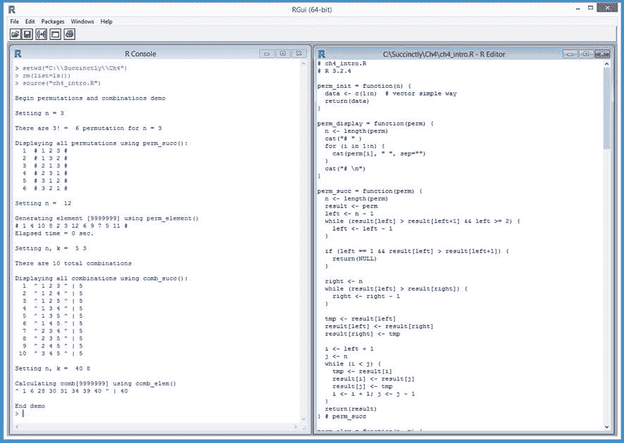

# 第四章排列组合

数学排列是项目的重新排列。数学组合是项目的子集。组合和排列有时被称为组合学。R 语言对排列和组合的内置支持非常有限，但是可以编写自己的程序定义函数。图 21 向您展示了本章的发展方向。



图 21:排列和组合演示

在 4.1 节中，我们将了解如何仅使用列表对象和相关函数(如`perm_init()`、`perm_display()`)来创建置换库。在第 4.2 节中，我们将研究如何通过编写一个`perm_elem()`函数来直接(而不是通过迭代)生成一个指定的置换元素，这个函数使用了一个叫做数的因式分解的巧妙思想。

在 4.3 节中，您将学习如何仅使用列表对象和相关函数(如`comb_init()`、`comb_display()`)来创建组合库。在 4.4 节中，我们将看到如何通过编写一个`comb_elem()`函数来直接(而不是迭代)生成一个指定的组合元素，该函数使用了一个被称为数字的组合的巧妙思想。

## 4.1 排列

虽然排列被用于统计和机器学习的许多领域，但 R 对排列的内置支持非常有限。您可以编写程序定义的函数来创建、显示和操作排列。

代码清单 11:排列

```
  # permutations.R
  # R 3.2.4

  perm_init = function(n) {
    data <- c(1:n)  # vector simple way
    return(>data)
  }

  perm_display = function(perm) {
    n <- length(perm)
    cat(“# “ )
    for (i in 1:n) {
      cat(perm[i], “ “, sep=““)
    }
    cat(“# \n”)
  }

  perm_succ = function(perm) {
    n <- length(perm)
    result <- perm
    left = n - 1
    while (result[left] > result[left+1] && left >= 2) {
      left <- left - 1
    }

    if (left == 1 && result[left] > result[left+1]) {
      return(NULL)
    }

    right <- n
    while (result[left] > result[right]) {
      right <- right - 1
    }

    tmp <- result[left]
    result[left] <- result[right]
    result[right] <- tmp

    i <- left + 1
    j <- n
    while (i < j) {
      tmp <- result[i]
      result[i] <- result[j]
      result[j] <- tmp
      i <- i + 1; j <- j - 1
    }
    return(result)
  } # perm_succ

  # =====

  cat(“\nBegin permutations demo \n\n”)

  n <- as.integer(4)
  cat(“Setting n =“, n, “\n\n”)

  cat(“Displaying all permutations using perm_succ(): \n”)
  p <- perm_init(n)
  i <- as.integer(1)
  while (is.null(p) == FALSE) {
    cat(formatC(i, digits=2), “ “)
    perm_display(p)
    p <- perm_succ(p)
    i <- i + 1
  }
  cat(“\n”)

  cat(“End permutations demo \n”)

```

```
  >
  source(“permutations.R”)

  Begin
  permutations demo 

  Setting
  n = 4 

  Displaying
  all permutations using perm_succ(): 

  1  # 1 2 3 4 # 

  2  # 1 2 4 3 # 

  3  # 1 3 2 4 # 

  4  # 1 3 4 2 # 

  5  # 1 4 2 3 # 

  6  # 1 4 3 2 # 

  7  # 2 1 3 4 # 

  8  # 2 1 4 3 # 

  9  # 2 3 1 4 # 
   10 
  # 2 3 4 1 # 
   11 
  # 2 4 1 3 # 
   12 
  # 2 4 3 1 # 
   13 
  # 3 1 2 4 # 
   14 
  # 3 1 4 2 # 
   15 
  # 3 2 1 4 # 
   16 
  # 3 2 4 1 # 
   17 
  # 3 4 1 2 # 
   18 
  # 3 4 2 1 # 
   19 
  # 4 1 2 3 # 
   20 
  # 4 1 3 2 # 
   21 
  # 4 2 1 3 # 
   22 
  # 4 2 3 1 # 
   23 
  # 4 3 1 2 # 
   24 
  # 4 3 2 1 # 

  End
  permutations demo 

```

n 阶的数学排列是数字 1 到 n 的一种可能排列。例如，n = 6 阶的排列之一是(3，1，6，5，4，2)。当按字典顺序列出时，n = 3 的所有 6 种排列顺序为:

1 2 3
1 3 2
2 1 3
2 3 1
3 1 2
3 2 1

有几种方法可以为排列设计自定义库。演示程序将排列定义为具有三个相关函数的整数向量:`perm_init()`、`perm_display()`和`perm_succ()`。您还应该考虑使用替代的、更复杂的设计，例如列表封装或 S3、S4 或 RC 类。

`perm_init()`功能定义为:

`perm_init = function(n) {
data = c(1:n)
return(data)
}`

演示程序这样调用`perm_init()`:

`n <- 4
p <- perm_init(n)`

`perm_display()`函数打印一个置换向量，包含前导和尾随#字符，值由空格分隔:

`perm_display = function(perm) {
n <- length(perm)
cat(“# “ )
for (i in 1:n) {
cat(perm[i], “ “, sep=““)
}
cat(“# \n”)
}`

请注意，置换的顺序可以由基础向量的长度决定。

当处理排列时，您通常希望生成所有排列或给定排列的后继排列。演示程序为此定义了一个`perm_succ()`函数。该函数可以这样调用，以便生成 n 阶的所有置换:

`p <- perm_init(n)
while (is.null(p) == FALSE) {
perm_display(p)
p <- perm_succ(p)
}`

停止条件假设`perm_succ()`已被定义，因此最后一个置换元素的后继元素为空。请注意，您必须使用内置的`is.null()`函数而不是`==`运算符来检查对象是否为空。

在迭代 n 阶的所有置换之前，应该考虑使用内置的`factorial()`函数确定有多少个置换元素。例如:

`numPerms <- factorial(n)
cat(“Total number of permutations is”, numPerms, “\n”)`

在大多数情况下，当 n 大于约 9 时，迭代所有排列是不切实际的，因为 9！= 362，880，但是 10！= 3，628，800 和 15！= 1,307,674,368,000.

排列中的整数值通常用于映射到向量或列表索引。例如，您可以编写一个函数，以这种方式对列表应用置换:

`perm_applyTo = function(perm, lst) {
result <- list()
n <- length(lst)
for (i in 1:n) {
result[i] <- lst[[perm[i]]]
}
return(result)
}`

总之，置换是数字 1 到 n 的重新排列。本质上，R 中置换的唯一内置支持是`sample()`和`factorial()`函数。实现自己的置换库相对容易，在置换库中，置换被定义为整数加上相关函数的向量，以便初始化、显示和返回后继。

### 资源

有关`factorial()`和其他专门数学函数的信息，请参见:
[。](https://stat.ethz.ch/R-manual/R-devel/library/base/html/Special.html) 

关于`sample()`功能的信息，见:
[https://stat . ethz . ch/R-manual/R-dev/library/base/html/sample . html](https://stat.ethz.ch/R-manual/R-devel/library/base/html/sample.html)。

## 4.2 置换元素

处理置换时，一个有用的函数是返回第 m 个字典式元素的函数。比如 n = 4，就有 4！=总共 24 个元素。对`perm_element(1)`的呼叫将返回(1，2，3，4)，对`perm_element(23)`的呼叫将返回(4，3，1，2)。

代码清单 12:置换元素的直接生成

```
  # permelements.R
  # R 3.2.4

  perm_init = function(n) {
    data <- c(1:n)
    return(>data)
  }

  perm_display = function(perm) {
    n <- length(perm)
    cat(“# “ )
    for (i in 1:n) {
      cat(perm[i], “ “, sep=““)
    }
    cat(“# \n”)
  }

  perm_succ = function(perm) {
    n <- length(perm)
    result <- perm
    left <- n - 1
    while (result[left] > result[left+1] && left >= 2) {
      left <- left - 1
    }

    if (left == 1 && result[left] > result[left+1]) {
      return(NULL)
    }

    right <- n
    while (result[left] > result[right]) {
      right <- right - 1
    }

    tmp <- result[left]
    result[left] <- result[right]
    result[right] <- tmp

    i <- left + 1
    j <- n
    while (i < j) {
      tmp <- result[i]
      result[i] <- result[j]
      result[j] <- tmp
      i <- i + 1; j <- j - 1
    }
    return(result)
  } # perm_succ

  perm_elem = function(n, m) {
    # mth element of perm order n
    m <- m - 1 # make m 0-based
    result <- c(1:n)
    factoradic <- c(1:n)

    for (j in 1:n) {
      factoradic[n-j+1] <- m %%j 
      m <- m %/% j
    }

    for (i in 1:n) {
      factoradic[i] <- factoradic[i] + 1
    }

    result[n] <- 1 # last value to 1

    i <- n-1
    while(i >= 1) {
      result[i] <- factoradic[i]
      for (j in (i+1):n) {
        if (result[j] >= result[i]) {
          result[j] <- result[j] + 1
        }
      }
      i <- i - 1
    }

    return(result)
  } # perm_element

  # =====

  cat(“\nBegin permutation element demo \n\n”)

  n <- as.integer(12)
  cat(“Setting n = “, n, “\n\n”)
  cat(“Generating element [9999999] using perm_element() \n”)
  start_t <- proc.time()
  pe <- perm_elem(n, 9999999)
  end_t <- proc.time()
  times <- end_t - start_t
  perm_display(pe)
  cat(“Elapsed time =“, times[3], “sec.\n”) 
  cat(“\n\n”)

  cat(“Generating element [9999999] using perm_succ() \n”)
  start_t <- proc.time()
  p <- perm_init(n)
  m <- 9999999
  for (j in 1:(m-1)) {
    p = perm_succ(p)
  }
  end_t <- proc.time()
  times <- end_t - start_t
  perm_display(p)
  cat(“Elapsed time =“, times[3], “sec.\n”) 
  cat(“\n”)

  cat(“End permutations demo \n”)

```

```
  >
  source(“permelements.R”)

  Begin
  permutation element demo 

  Setting
  n =  12 

  Generating
  element [9999999] using perm_element() 
  #
  1 4 10 8 2 3 12 6 9 7 5 11 # 
  Elapsed
  time = 0 sec.

  Generating
  element [9999999] using perm_succ() 
  #
  1 4 10 8 2 3 12 6 9 7 5 11 # 
  Elapsed
  time = 98.33 sec.

  End
  permutation element demo 

```

有 12 个！= 479，001，600 个排列元素，n = 12。演示程序以两种不同的方式计算元素 9，999，999。生成置换的 mth 元素的简单方法是从第一个元素开始，然后调用后续函数 m-1 次。然而，这种方法仅适用于相对较小的 m 值。使用这种迭代方法，演示程序需要大约 98 秒:

`n <- as.integer(12)
p <- perm_init(n)
m <- 9999999
for (j in 1:(m-1)) {
p = perm_succ(p)
}
perm_display(p)`

我们也可以利用一个数的因式直接计算置换集的 mth 元素。数字的因子是基于因子的表示。例如，在普通的 10 进制表示中，数字 794 是(7 * 100) + (9 * 10) + (4 * 1)。

因为 6！= 720, 5!= 120, 4!= 24, 3!= 6, 2!= 2 和 1！= 1，数字 794 也可以写成(103020)，因为 794 = (1 * 6！) + (0 * 5!) + (3 * 4!) + (0 * 3!) + (2 * 2!) + (0 * 1!).虽然不是很明显，但是您可以通过计算 m 的 factoradic 来计算 mth 置换元素，然后将它映射到元素。

在函数`perm_element()`中，下面是计算`m`因子的代码:

`m <- m - 1
factoradic <- c(1:n)
for (j in 1:n) {
factoradic[n-j+1] <- m %%j
m <- m %/% j
}`

`for (i in 1:n) {
factoradic[i] <- factoradic[i] + 1
}`

首先，m 从通常的基于 R 1 的索引转换为基于 0 的索引。`%%`运算符是整数模。例如，13 %% 5 = 3，因为 5 在还剩 3 的情况下两次进入 13。`%/%`运算符是整数除法。例如，7 / 2 = 3.5，但 7 %/% 2 = 3。

计算出`m`的因子后，用这种方法生成结果置换元素:

`result <- c(1:n)
result[n] <- 1
i <- n-1
while(i >= 1) {
result[i] <- factoradic[i]
for (j in (i+1):n) {
if (result[j] >= result[i]) {
result[j] <- result[j] + 1
}
}
i <- i - 1
}`

总之，如果你想生成置换集的 mth 元素，如果 m 很小，你可以使用后继函数进行迭代。对于 m 的大值，可以编写一个函数，通过使用 m 的 factoradic 直接计算 mth 元素。

### 资源

有关一个数的因式分解的更多信息，请参见:
[【https://en.wikipedia.org/wiki/Factorial_number_system】](https://en.wikipedia.org/wiki/Factorial_number_system)。

## 4.3 组合

虽然数学组合被用于统计和机器学习的许多领域，但 R 对组合的内置支持非常有限。您可以编写函数来创建、显示和操作组合。

代码清单 13:组合

```
  # combinations.R
  # R 3.2.4

  comb_init = function(n, k) {
    data <- c(1:(k+1))
    data[k+1] <- n  # store n in dummy last cell
    return(>data)
  }

  comb_display = function(comb) {
    len <- length(comb)
    k <- len - 1
    n <- comb[len]

    cat(“^ “ )
    for (i in 1:k) {
      cat(comb[i], “ “, sep=““)
    }
    cat(“^ |”, n, “\n”)
  }

  comb_succ = function(comb) {
    len <- length(comb)
    k <- len - 1
    n <- comb[len]

    if (comb[1] == n - k + 1) {
      return(NULL)
    }

    result <- comb

    i <- k
    while (i > 1 && (result[i] == (n-k+i))) {
      i <- i - 1
    }

    result[i] = result[i] + 1
    j <- i + 1
    while (j <= k) {
      result[j] <- result[j-1] + 1
      j <- j + 1
    }

    return(result)
  } # comb_succ

  # -----

  cat(“\nBegin combinations demo \n\n”)

  n <- as.integer(6)
  k <- as.integer(4)
  cat(“Setting n, k = “, n, k, “\n\n”)
  nc <- choose(n, k)
  cat(“There are”, nc, “total combinations \n\n”)

  cat(“Displaying all combinations: \n”)
  cmb <- comb_init(n, k)
  i <- as.integer(1)
  while (is.null(cmb) == FALSE) {
    cat(formatC(i, digits=2), “ “)
    comb_display(cmb)
    cmb <- comb_succ(cmb)
    i <- i + 1
  }
  cat(“\n”)

  cat(“End combinations demo \n”)

```

```
  >
  source(“combinations.R”)

  Begin
  combinations demo 

  Setting
  n, k =  6 4 

  There
  are 15 total combinations 

  Displaying
  all combinations: 

  1  ^ 1 2 3 4 ^ | 6 

  2  ^ 1 2 3 5 ^ | 6 

  3  ^ 1 2 3 6 ^ | 6 

  4  ^ 1 2 4 5 ^ | 6 

  5  ^ 1 2 4 6 ^ | 6 

  6  ^ 1 2 5 6 ^ | 6 

  7  ^ 1 3 4 5 ^ | 6 

  8  ^ 1 3 4 6 ^ | 6 

  9  ^ 1 3 5 6 ^ | 6 
   10 
  ^ 1 4 5 6 ^ | 6 
   11 
  ^ 2 3 4 5 ^ | 6 
   12 
  ^ 2 3 4 6 ^ | 6 
   13 
  ^ 2 3 5 6 ^ | 6 
   14 
  ^ 2 4 5 6 ^ | 6 
   15 
  ^ 3 4 5 6 ^ | 6 

  End
  combinations demo 

```

顺序(n，k)的数学组合是从数字 1 到 n 的 k 个数字的一个可能子集，其中顺序无关紧要。例如，阶(n = 7，k = 4)的组合之一是(2，3，5，7)。集合(3，2，7，5)被认为与(2，3，5，7)相同，因为值的顺序无关紧要。

按字典顺序列出，以下是全部 10 种顺序组合(n = 5，k = 3):

1 2 3
1 2 4
1 2 5
1 3 4
1 3 5
1 4 5
2 3 4
2 3 5
2 4 5
3 4 5

请注意，如果您看到一个组合元素，您可以从元素中的值的数量推断出 k，但不能推断出 n。

组合的自定义库可以通过几种方式设计。演示程序将顺序(n，k)的组合定义为一个由 k 个整数组成的向量，并带有一个额外的单元格，用于保存 n 加上三个相关函数的值:`comb_init()`、`comb_display()`和`comb_succ()`。您还应该考虑使用列表封装或使用 S3、S4 或 RC 类。

`comb_init()`功能定义为:

`comb_init = function(n, k) {
data <- c(1:(k+1))
data[k+1] <- n # store n in dummy last cell
return(data)
}`

功能`comb_init()`可以这样调用:

`n <- as.integer(6)
k <- as.integer(4)
cmb <- comb_init(n, k)`

这些语句将创建一个名为`cmb`的整数向量，该向量有五个单元格。前四个单元格将保存(1，2，3，4)，第五个单元格将保存 6，即 n 的值。

`comb_display()`功能定义为:

`comb_display = function(comb) {
len <- length(comb)
k <- len - 1
n <- comb[len]

cat(“^ “ )
for (i in 1:k) {
cat(comb[i], “ “, sep=““)
}`

`cat(“^ |”, n, “\n”)
}`

`length()`函数直接产生 k 的值(长度为- 1)，间接产生 k 的值(存储在单元格[长度]中的值)。`comb_display()`函数打印一个组合元素，包含前导和尾随^字符，n 值由|字符分隔。您有许多格式可供选择。

使用组合时，您通常希望生成所有组合或给定组合的后续组合。演示程序为此定义了一个`comb_succ()`函数。该函数可以这样调用，以便生成所有顺序组合(n，k):

`cmb <- comb_init(n, k)
while (is.null(cmb) == FALSE) {
comb_display(cmb)
cmb <- cmb_succ(cmb)
}`

停止条件假设`comb_succ()`已被定义，因此最后一个组合元素的后继元素为空。在迭代顺序(n，k)的所有组合之前，您应该考虑使用内置的`choose()`函数来确定有多少元素。例如:

`numCombs <- choose(n, k)`

总之，组合是数字 1 到 n 的子集。`choose()`函数和`sample()`函数本质上是 r 中组合的唯一内置支持。实现您自己的组合库相对容易，其中组合被定义为整数加上初始化、显示和返回后继的相关函数的向量。

### 资源

有关`choose()`和其他专门数学函数的信息，请参见:
[。](https://stat.ethz.ch/R-manual/R-devel/library/base/html/Special.html) 

关于`sample()`功能的信息，见:
[https://stat . ethz . ch/R-manual/R-dev/library/base/html/sample . html](https://stat.ethz.ch/R-manual/R-devel/library/base/html/sample.html)。

## 4.4 组合元素

当处理组合时，你会发现有用的函数是那些返回 mth 词典元素的函数。例如，如果 n = 10 且 k = 3，则共有 choose(10，3) = 120 个元素。对`comb_element(1)`的呼叫将返回(1，2，3)，对`comb_element(120)`的呼叫将返回(8，9，10)。

代码清单 14:组合元素的直接生成

```
  # combelements.R
  # R 3.2.4

  comb_init = function(n, k) {
    data <- c(1:(k+1))
    data[k+1] <- n
    return(>data)
  }

  comb_display = function(comb) {
    len <- length(comb)
    k <- len - 1
    n <- comb[len]

    cat(“^ “ )
    for (i in 1:k) {
      cat(comb[i], “ “, sep=““)
    }
    cat(“^ |”, n, “\n”)
  }

  comb_succ = function(comb) {
    len <- length(comb)
    k <- len - 1
    n <- comb[len]

    if (comb[1] == n - k + 1) {
      return(NULL)
    }

    result <- comb

    i <- k
    while (i > 1 && (result[i] == (n-k+i))) {
      i <- i - 1
    }

    result[i] = result[i] + 1
    j <- i + 1
    while (j <= k) {
      result[j] <- result[j-1] + 1
      j <- j + 1
    }

    return(result)
  }

  comb_elem = function(n, k, m) {
    # mth element, combinadic

    m <- m - 1  # zero-based m
    maxM <- choose(n, k) - 1  # largest z-index
    ans <- c(1:(k+1))  # extra cell for [0]

    a <- n  # look for a v less than this
    b <- k
    x <- maxM - m  # x is the dual of m

    for (i in 1:k) {
      v <- a - 1
      while (choose(v, b) > x) {
        v <- v - 1
      }

      ans[i] <- v
      x <- x - choose(v, b)
      a <- v
      b <- b - 1
    }

    for (i in 1:k) {
      ans[i] <- n - ans[i]  # (+1) to [1]-based
    }
    ans[k+1] <- n  # recall n goes in last cell

    return(ans)
  }

  # -----

  cat(“\nBegin combination element demo \n\n”)

  n <- as.integer(40)
  k <- as.integer(8)
  cat(“Setting n, k = “, n, k, “\n\n”)

  cat(“Calculating comb[9999999] using comb_elem() \n”)
  m <- as.integer(9999999)

  cmb <- comb_elem(n, k, m)
  comb_display(cmb)
  cat(“\n\n”)

  cat(“Calculating comb[9999999] using comb_succ() \n”)
  cmb <- comb_init(n, k)
  for (i in 1:(m-1)) {
    cmb <- comb_succ(cmb)
  }
  comb_display(cmb)

  cat(“\nEnd combination element demo \n”)

```

```
  >
  source(“combelements.R”)

  Begin
  combination element demo 

  Setting
  n, k =  40 8 

  Calculating
  comb[9999999] using comb_elem() 
  ^
  1 6 28 30 31 34 39 40 ^ | 40 

  Calculating
  comb[9999999] using comb_succ() 
  ^
  1 6 28 30 31 34 39 40 ^ | 40 

  End
  combination element demo 

```

对于 n = 40 和 k = 8 的顺序，有 choose(40，8) = 76，904，685 个不同的组合元素。演示程序以两种不同的方式计算元素 9，999，999。从第一个元素开始，然后调用后续函数 m-1 次，这是一种生成组合的 mth 元素的简单方法。然而，这种方法仅适用于相对较小的 m 值。使用这种迭代方法，演示程序需要大约 25 秒钟:

`n <- as.integer(40)
k <- as.integer(8)
cmb <- cmb_init(n, k)
m <- 9999999
for (j in 1:(m-1)) {
cmb = cmb_succ(cmb)
}
cmb_display(cmb)`

您也可以直接使用所谓的数字组合来计算组合集的 mth 元素。数字的组合是基于 choose()函数的表示。例如，在普通的 10 进制表示中，数字 27 是(2 * 10) + (7 * 1)。

假设 n = 7，k = 4。数字 27 也可以写成(6，5，2，1)，因为:

27 =选择(6，4) +选择(5，3) +选择(2，2) +选择(1，1) = 15 + 10 + 1 + 1

虽然不是很明显，但是您可以通过计算 m 的 combinadic 来计算 mth 组合元素，然后将 m 映射到关联的组合元素。

在函数`comb_element()`中，计算 m 的组合的代码以下列代码开始:

`m <- m - 1
maxM <- choose(n, k) - 1
ans <- c(1:(k+1))
a <- n
b <- k
x <- maxM - m # x is the dual of m`

输入参数 m 被转换为基于 0 的索引。该算法实际上不是计算 m 的组合，而是计算 x 的组合，即 m 的基于 0 的对偶。但是`comb_elem()`的演示实现有一个限制——对于大的 n 和 k 值，内置的`choose()`函数可能会溢出。一个更健壮的实现将使用一个 BigInteger 版本的 select 函数，比如 gmp 附加包中的那个。

函数`comb_elem()`使用该代码将初步结果计算成向量`ans`:

`for (i in 1:k) {
v <- a - 1
while (choose(v, b) > x) {
v <- v - 1
}
ans[i] <- v
x <- x - choose(v, b)
a <- v
b <- b - 1
}`

当这段代码完成执行时，所需的组合元素值从 0 开始存储，作为 n 的补码，这意味着它们被转换为从 1 开始的值并被去补码。此外，n 的值被放入`ans`的最后一个单元格:

`for (i in 1:k) {
ans[i] <- n - ans[i]
}
ans[k+1] <- n`

总之，如果您想要生成顺序(n，k)组合的 mth 元素，并且如果 m 很小，您可以使用后继函数进行迭代。对于 m 的大值，可以编写一个函数，通过使用 m 的 combinadic 直接计算 mth 元素。

### 资源

有关数字组合的更多信息，请参见:
[【https://en.wikipedia.org/wiki/Combinatorial_number_system】](https://en.wikipedia.org/wiki/Combinatorial_number_system)。

有关名为 combint 的附加 R 包的信息，请参见:
[。](https://cran.r-project.org/web/packages/combinat/combinat.pdf)