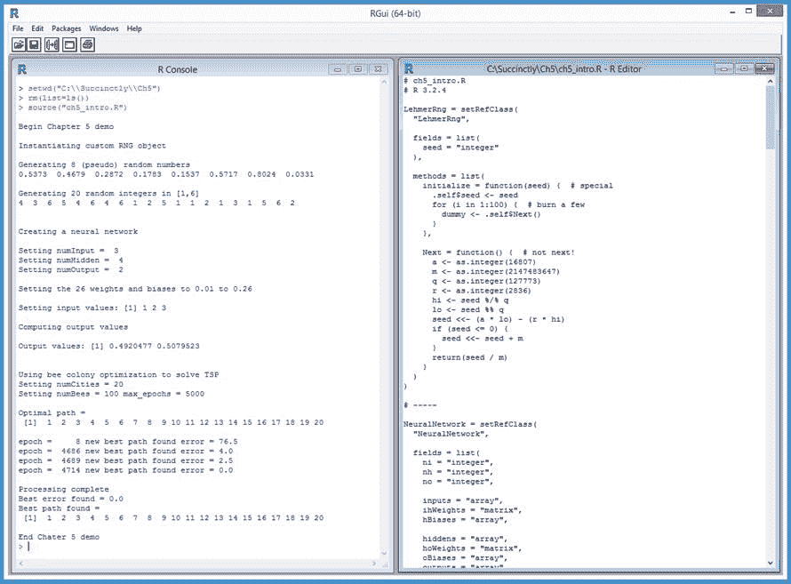
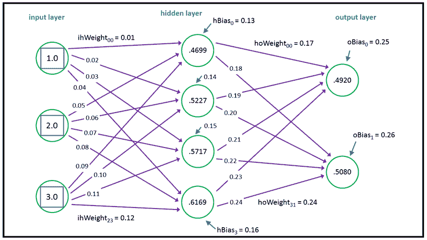

# 第五章高级 R 编程

R 编程语言包含了创建非常复杂的程序所需的所有特性。本章介绍三个主题(随机数生成、神经网络和组合优化)，说明 R 的力量，演示有用的 R 编程技术，并为您提供个人代码库的起点。图 22 给出了本章的方向。



图 22:高级 R 编程主题

在 5.1 节中，您将学习如何使用 RC 模型和莱默随机数生成算法创建程序定义的随机数生成器(RNG)对象。

在 5.2 节中，我们将了解如何设计和创建神经网络，以及如何编写实现神经网络前馈、输入-处理-输出机制的代码。

在第 5.3 节中，您将学习如何使用模拟蜜蜂行为的生物启发算法来解决组合优化问题。特别是，你会逐渐理解如何解决旅行推销员问题，可以说是最著名的组合优化问题。

## 5.1 程序定义的 RNG

大多数编程语言都允许您创建随机数生成器的多个实例。R 语言使用了一个单一的全球系统 RNG，这多少有些局限性。但是，你可以用 r 写你自己的 RNG 类

代码清单 15:随机数生成器类

```
  # randoms.R
  # R 3.2.4

  LehmerRng = setRefClass(
    “LehmerRng”,

    fields = list(
      seed = “integer”
    ),

    methods = list(
      initialize = function(seed) {  # special
        .self$seed <- seed
        for (i in 1:100) {  # burn a few
          dummy <- .self$Next()
        }
      },

      Next = function() {  # not next!
        a <- as.integer(16807)
        m <- as.integer(2147483647)
        q <- as.integer(127773)
        r <- as.integer(2836)
        hi <- seed %/% q
        lo <- seed %% q
        seed <<- (a * lo) - (r * hi)
        if (seed <= 0) {
          seed <<- seed + m
        }
        return(seed / m)
      }
    )
  )

  # -----

  cat(“\nBegin custom RNG demo \n\n”)

  cat(“Instantiating custom RNG object \n\n”)
  my_rng <- LehmerRng$new(as.integer(1))

  cat(“Generating 8 (pseudo) random numbers \n”)
  for (i in 1:8) {
    x <- my_rng$Next()
    xx <- formatC(x, digits=4, format=“f”)
    cat(xx, “ “)
  }
  cat(“\n\n”)

  cat(“Generating 20 random integers in [1,6] \n”)
  lo <- as.integer(1)
  hi <- as.integer(7)
  for (i in 1:20) {
    n <- floor((hi - lo) * my_rng$Next() + lo)
    cat(n, “ “)
  }
  cat(“\n\n”)

  cat(“End custom RNG demo \n”)

```

```
  >
  source(“randoms.R”)

  Begin
  custom RNG demo 

  Instantiating
  custom RNG object 

  Generating
  8 (pseudo) random numbers 
  0.5373 
  0.4679  0.2872  0.1783  0.1537  0.5717  0.8024  0.0331  

  Generating
  20 random integers in [1,6] 
  4 
  3  6  5  4  6  4  6  1  2  5  1  1  2  1  3  1  5  6  2  

  End
  custom RNG demo 

```

下面是一个用其他编程语言创建 RNG 的例子:

`Random my_rng = new Random(0); // C# and Java
my_rnd = random.Random(0) # Python`

有许多不同的 RNG 算法。最常见的有线性同余算法、莱默算法、威奇曼-希尔算法和滞后斐波那契算法。演示程序使用莱默算法，并创建一个名为`LehmerRng`的参考类定义。下面是这个类的结构:

`LehmerRng = setRefClass(
“LehmerRng”,
fields = list( . . . ),
methods = list( . . . )
)`

Lehmer 算法是 X(i+1) = a * X(i) mod m .用英语来说，就是“下一个随机值是某个数字 *a* 乘以当前值模某个数字 *m* 例如，假设当前随机值为 104，其中 a = 3，m = 100。下一个随机值是 3 * 104 mod 100 = 312 mod 100 = 12。RNGs 的标准做法是返回一个介于 0.0 和 1.0 之间的浮点值，因此 RNG 的下一个函数将返回 12 / 100 = 0.12。

下一个随机值将是 3 * 12 mod 100 = 36，下一个函数将发出 0.36。大多数 RNG 算法中的 X(i)被称为“种子”`LehmerRng`类定义的`fields`部分很简单:

`fields = list(
seed = “integer”
),`

RNG 的习俗包含两种方法。`Next()`函数实现了 Lehmer 算法，但使用代数技巧来防止算术溢出:

`Next = function() {
a <- as.integer(16807)
m <- as.integer(2147483647)
q <- as.integer(127773); r <- as.integer(2836)
hi <- seed %/% q; lo <- seed %% q
seed <<- (a * lo) - (r * hi)
if (seed <= 0) { seed <<- seed + m }
return(seed / m)
}`

整数值 *a* 和 *m* 是乘数和模常数。他们的价值观来自数学理论，你不应该改变他们。q 值为(m / a)，r 值为(m mod a)。通过使用 q 和 r，该算法防止了算法中 a * X(i)乘法部分的算术溢出。局部变量 a、m、q 和 r 可以被定义为类字段。

我使用`Next()`大写而不是`next()`小写，因为`next`是 R 中的保留字(用于短路到 for 循环的下一次迭代)。类定义还有特殊的参考类`initialize()`功能:

`initialize = function(seed) {
.self$seed <- seed
for (i in 1:100) { # burn a few
dummy <- .self$Next()
}
},`

如果您在 S4 或 RC 类中定义了一个`initialize()`函数，当您使用`new()`函数实例化该类的一个对象时，控制将转移到`initialize()` 。这里，`initialize()`功能设置`seed`字段，然后生成并丢弃前 100 个值。请注意使用`.self`关键字访问`seed`字段和`Next()`功能。

种子值可能已设置为:

`seed <<- seed`

这里`<<-`赋值运算符左侧的`seed`是类字段，赋值右侧的`seed`是输入参数。但是这个语法看起来有点奇怪。每当我使用同名参数设置字段值时，我喜欢使用显式`.self`语法。但是，请注意，当您使用`.self`分配 RC 类字段值时，您必须使用常规的`<-`分配运算符，而不是`<<-`分配运算符。

演示程序以这种方式实例化一个对象:

`my_rng <- LehmerRng$new(as.integer(1))`

初始种子值 1 被传递给`new()`函数。一些 RNG 算法可以使用初始种子值 0，但是对于莱默算法，初始种子必须是 1 或更大，这意味着您可以向`initialize()`函数添加错误检查。因为类有一个定义好的`initialize()`函数，控制从`new()`传递到`initialize()`。将输入参数值 1 赋给`seed`字段，然后生成前 100 个随机值并丢弃。在 RNG 实现中，燃烧几百或几千个初始值是一种常见的技术。

演示程序使用 RNG 对象生成一些随机浮点值:

`for (i in 1:8) {
x <- my_rng$Next()
xx <- formatC(x, digits=4, format=“f”)
cat(xx, “ “)
}`

演示程序显示了如何将 0.0 到 1.0 之间的随机浮点值映射为[1，6]之间的整数，包括这种方式:

`lo <- as.integer(1)
hi <- as.integer(7) # note: 1 more than 6
for (i in 1:20) {
n <- floor((hi - lo) * my_rng$Next() + lo)
cat(n, “ “)
}`

总之，如果您想要多个独立的随机数生成器对象，您可以定义自己的 RC 类。如果您定义了可选的`initialize()`函数，当分配与输入参数同名的字段值时，请考虑使用`.self`语法。

### 资源

描述如何实现莱默·RNG 算法的一篇优秀而著名的论文是:
[http://www.firstpr.com.au/dsp/rand31/p1192-park.pdf](http://www.firstpr.com.au/dsp/rand31/p1192-park.pdf)。

有关莱默 RNG 算法的更多信息，请参见:
[。](https://en.wikipedia.org/wiki/Lehmer_random_number_generator)

## 5.2 神经网络

本节解释神经网络的 R 语言实现的输入-处理-输出机制。这种机制被称为神经网络前馈。

代码清单 16:神经网络

```
  # neuralnets.R
  # R 3.2.4

  NeuralNetwork = setRefClass(
    “NeuralNetwork”,

    fields = list(
      ni = “integer”,
      nh = “integer”,
      no = “integer”,

      inputs = “array”,
      ihWeights = “matrix”,
      hBiases = “array”,

      hiddens = “array”,
      hoWeights = “matrix”,
      oBiases = “array”,
      outputs = “array”
    ),

    methods = list(
      initialize = function(ni, nh, no) {
        .self$ni <- ni
        .self$nh <- nh
        .self$no <- no

        inputs <<- array(0.0, ni)
        ihWeights <<- matrix(0.0, nrow=ni, ncol=nh)
        hBiases <<- array(0.0, nh)

        hiddens <<- array(0.0, nh)
        hoWeights <<- matrix(0.0, nrow=nh, ncol=no)
        oBiases <<- array(0.0, no)
        outputs <<- array(0.0, no)
      }, # initialize()

      setWeights = function(wts) {
        numWts <- (ni * nh) + nh + (nh * no) + no
        if (length(wts) != numWts) {
          stop(“FATAL: incorrect number weights”)
        }

        wi <- as.integer(1) # weight index
        for (i in 1:ni) {
          for (j in 1:nh) {
            ihWeights[i,j] <<- wts[wi]
            wi <- wi + 1
          }
        }
        for (j in 1:nh) {
          hBiases[j] <<- wts[wi]
          wi <- wi + 1
        }
        for (j in 1:nh) {
          for (k in 1:no) {
            hoWeights[j,k] <<- wts[wi]
            wi <- wi + 1
          }
        }
        for (k in 1:no) {
          oBiases[k] <<- wts[wi]
          wi <- wi + 1
        }
      }, # setWeights()

      computeOutputs = function(xValues) {
        hSums <- array(0.0, nh) # hidden nodes
  scratch array
        oSums <- array(0.0, no) # output nodes
  scratch

        for (i in 1:ni) {
          inputs[i] <<- xValues[i]
        }

        for (j in 1:nh) { # pre-activation hidden node sums
          for (i in 1:ni) {
            hSums[j] <- hSums[j] + (inputs[i] * ihWeights[i,j])
          }
        }

        for (j in 1:nh) { # add bias
          hSums[j] <- hSums[j] + hBiases[j]
        }

        for (j in 1:nh) { # apply activation
          hiddens[j] <<- tanh(hSums[j])
        }

        for (k in 1:no) { # pre-activation output node sums
          for (j in 1:nh) {
            oSums[k] <- oSums[k] + (hiddens[j] * hoWeights[j,k])
          }
        }

        for (k in 1:no) { # add bias
          oSums[k] <- oSums[k] + oBiases[k]
        }

        outputs <<- my_softMax(oSums) # apply activation
        return(outputs)

      }, # computeOutputs() 

      my_softMax = function(arr) {
        n = length(arr)
        result <- array(0.0, n)
        sum <- 0.0
        for (i in 1:n) {
          sum <- sum + exp(arr[i])
        }
        for (i in 1:n) {
          result[i] <- exp(arr[i]) / sum
        }
        return(result) 
      }

    ) # methods
  ) # class

  # -----

  cat(“\nBegin neural network demo \n”)

  numInput <- as.integer(3)
  numHidden <- as.integer(4)
  numOutput <- as.integer(2)
  cat(“\nSetting numInput = “, numInput, “\n”)
  cat(“Setting numHidden = “, numHidden, “\n”)
  cat(“Setting numOutput = “, numOutput, “\n”)

  cat(“\nCreating neural network \n”)
  nn <- NeuralNetwork$new(numInput, numHidden, numOutput)

  cat(“\nSetting input-hidden weights to 0.01 to 0.12 \n”)
  cat(“Setting hidden biases to 0.13 to 0.16 \n”)
  cat(“Setting hidden-output weights to 0.17 to 0.24 \n”)
  cat(“Setting output biases to 0.25 to 0.26 \n”)
  wts <- seq(0.01, 0.26, by=0.01)
  nn$setWeights(wts)

  xValues <- c(1.0, 2.0, 3.0)
  cat(“\nSetting input values: “)
  print(xValues)

  cat(“\nComputing output values \n”)
  outputs <- nn$computeOutputs(xValues)
  cat(“\nDone \n”)
  cat(“\nOutput values: “)
  print(outputs)

  cat(“\nEnd demo\n”)

```

```
  >
  source(“neuralnets.R”)

  Begin
  neural network demo 

  Setting
  numInput =  3 
  Setting
  numHidden =  4 
  Setting
  numOutput =  2 

  Creating
  neural network 

  Setting
  input-hidden weights to 0.01 to 0.12 
  Setting
  hidden biases to 0.13 to 0.16 
  Setting
  hidden-output weights to 0.17 to 0.24 
  Setting
  output biases to 0.25 to 0.26 

  Setting
  input values: [1] 1 2 3

  Computing
  output values 

  Done

  Output
  values: [1] 0.4920477 0.5079523

  End
  demo

```

让我们把神经网络想象成一个复杂的数学函数，它接受数字输入值，以松散地模拟生物神经元的方式进行一些处理，并产生可以解释为预测的数字输出值。

以下是创建神经网络的演示程序代码的关键行:

`numInput <- as.integer(3)
numHidden <- as.integer(4)
numOutput <- as.integer(2)`

`nn <- NeuralNetwork$new(numInput, numHidden, numOutput)`

输入和输出节点的数量由预测问题决定。隐藏节点的数量是一个自由参数，必须通过反复试验来确定。

演示神经网络有三个输入节点、四个隐藏节点和两个输出节点。例如，如果你试图根据收入水平、教育水平和年龄水平(三个输入值)来预测一个人是政治保守派还是自由派(两种输出可能性)。

创建神经网络对象后，使用以下代码行对其进行初始化:

`wts <- seq(0.01, 0.26, by=0.01)
nn$setWeights(wts)`

神经网络有称为权重和偏差的常数，这些常数与输入值一起决定输出值。具有 x 个输入节点、y 个隐藏节点和 z 个输出节点的神经网络具有(x * y) + y + (y * z) + z 个权重和偏差。这意味着演示 3-4-2 网络有(3 * 4) + 4 + (4 * 2) + 2 = 26 个权重和偏差。演示使用内置的`seq()`函数生成 26 个从 0.01 到 0.26 的值，然后使用类函数/方法`setWeights()`将这些值复制到神经网络的权重和偏差中。

该演示使用以下代码计算输入集(1.0、2.0、3.0)的输出值:

`xValues <- c(1.0, 2.0, 3.0)
outputs <- nn$computeOutputs(xValues)
print(outputs)`

两个输出值是(0.4920，0.5080)。此图显示了演示神经网络的概念结构:



图 23:神经网络架构

连接一对节点的每条紫色线代表一个权重。此外，每个隐藏节点和输出节点(但不是输入节点)都有一个代表偏差的蓝色箭头。神经网络从左到右计算其输出。计算最上面的隐藏节点值:

tanh((1.0 * 0.01)+(2.0 * 0.05)+(3.0 * 0.09)+0.13)= tanh(0.51)= 0.4699

tanh(双曲正切)在神经网络术语中被称为激活函数。换句话说，我们会说“为了计算隐藏节点值，您将每个输入值乘以相关的输入到隐藏权重，求和，加上隐藏节点偏差值，然后取和的 tanh。”

两个输出节点的值计算方式略有不同。首先，计算初步总和:

osms[1]=(0.46 * 0.17)+(0.52 * 0.19)+(0.57 * 0.21)+(0.61 * 0.23)+0.25 = 0.69
osms[2]=(0.46 * 0.18)+(0.52 * 0.20)+(0.57 * 0.22)+(0.61 * 0.24)+0.26 = 0.72

然后，这些值被用来通过使用称为 **`softmax`** 函数的特殊函数来确定最终输出值:

输出[] = softmax(oSums[1]，oSums[2]) = (0.4920，0.5080)

这些输出值可以解释为概率。在这种情况下，因为第二个值(只是勉强)大于第一个值，所以神经网络预测收入水平为 1.0、教育水平为 2.0、年龄水平为 3.0 的人是自由主义者(第二种结果可能性)。

下面是演示神经网络 RC 类的结构:

`NeuralNetwork = setRefClass(
“NeuralNetwork”,
fields = list( . . . ),
methods = list( . . .)
)`

这些是类字段:

`fields = list(
ni = “integer”, nh = “integer”, no = “integer”,
inputs = “array”,
ihWeights = “matrix”,
hBiases = “array”,`

`hiddens = “array”,
hoWeights = “matrix”,
oBiases = “array”,
outputs = “array”
),`

字段`ni`、`nh`和`no`是输入、隐藏和输出节点的数量。矩阵`ihWeights`保存输入到隐藏的权重，其中行索引对应于输入节点索引，列索引对应于隐藏节点索引。数组`hBiases`保存隐藏节点的偏差值。矩阵`hoWeights`保存隐藏到输出的权重，数组`oBiases`保存输出节点偏差。

`initialize()`功能定义为:

`initialize = function(ni, nh, no) {
.self$ni <- ni
.self$nh <- nh
.self$no <- no` 

`inputs <<- array(0.0, ni)
ihWeights <<- matrix(0.0, nrow=ni, ncol=nh)
hBiases <<- array(0.0, nh)`

`hiddens <<- array(0.0, nh)
hoWeights <<- matrix(0.0, nrow=nh, ncol=no)
oBiases <<- array(0.0, no)
outputs <<- array(0.0, no)
},`

虽然所有定义为数组类型的字段都可以成为向量，但是在与矩阵对象交互时使用数组类型更有原则。

如果使用`.self`语法修改 RC 类中的字段，可以使用`<-`赋值运算符，但是如果不使用`.self` `,`限定字段，则必须使用`<<-`赋值运算符。

类方法`setWeights()`的定义如下:

`setWeights = function(wts) {
numWts <- (ni * nh) + nh + (nh * no) + no
if (length(wts) != numWts) {
stop(“FATAL: incorrect number weights”)
}
. . .`

函数`setWeights()`接受所有权重和偏差的数组或向量。如果输入`wts`参数中的权重和偏差数量不正确，该函数将调用内置的`stop()`函数立即停止程序执行。功能`setWeights()`通过在`wts`数组/向量参数中设置索引`wi`继续，然后以行顺序(从左到右，从上到下)填充输入到隐藏权重矩阵:

`wi <- as.integer(1)
for (i in 1:ni) {
for (j in 1:nh) {
ihWeights[i,j] <<- wts[wi]
wi <- wi + 1
}
}`

注意修改成员矩阵需要`<<-`赋值运算符，但是普通的`<-`赋值用于`wi`局部变量。函数`setWeights()`通过将值从`wts`参数复制到隐藏节点偏差中来完成，然后是隐藏到输出权重，最后是输出节点偏差:

`for (j in 1:nh) {
hBiases[j] <<- wts[wi]
wi <- wi + 1
}`

 `for (j in 1:nh) {
for (k in 1:no) {
hoWeights[j,k] <<- wts[wi]
wi <- wi + 1
}
}`

`for (k in 1:no) {
oBiases[k] <<- wts[wi]
wi <- wi + 1
}`

简而言之，`setWeights()`函数首先以行顺序方式将其输入数组/向量值反序列化为输入到隐藏权重矩阵，然后反序列化为隐藏节点偏差，然后以行顺序方式反序列化为隐藏到输出权重矩阵，最后反序列化为输出节点偏差。复制权重没有标准顺序，如果您正在使用另一个神经网络实现，您必须检查以了解使用的是哪种顺序。

成员函数`computeOutputs()`的定义开始于:

`computeOutputs = function(xValues) {
hSums <- array(0.0, nh) # hidden nodes scratch array
oSums <- array(0.0, no) # output nodes scratch
for (i in 1:ni) {
inputs[i] <<- xValues[i]
}
. . .`

局部数组`hSums`保存隐藏节点的预激活和。本地阵列`oSums`保存输出节点的预软最大激活总和。输入参数`xValues`数组/向量中的值随后被复制到神经网络的`input`数组中。

隐藏节点的值是用以下代码行计算的:

`for (j in 1:nh) {
for (i in 1:ni) {
hSums[j] <- hSums[j] + (inputs[i] * ihWeights[i,j])
}
}
for (j in 1:nh) {
hSums[j] <- hSums[j] + hBiases[j]
}
for (j in 1:nh) {
hiddens[j] <<- tanh(hSums[j])
}`

如前所述，首先计算输入值乘以相关权重的乘积之和，然后加上偏差，然后应用`tanh()`激活函数。

输出值的计算和返回方式如下:

`for (k in 1:no) {
for (j in 1:nh) {
oSums[k] <- oSums[k] + (hiddens[j] * hoWeights[j,k])
}
}
for (k in 1:no) {
oSums[k] <- oSums[k] + oBiases[k]
}
outputs <<- my_softMax(oSums)
return(outputs)`

请注意，与隐藏节点不同，隐藏节点每次计算一个值，输出节点值由`my_softMax()`程序定义的函数一起计算。一组值之一的 **`softmax`** 函数是该值的 exp()除以所有值的 exp()之和。例如，在演示中，softmax 激活前的输出总和为(0.6911，0.7229)。两个总和的最大值为:

输出[1]= exp(0.6911)/(exp(0.6911)+exp(0.7229))= 0.4920
输出[2]= exp(0.7229)/(exp(0.6911)+exp(0.7229))= 0.5080

softmax 输出激活函数的目的是强制输出值，使它们的总和为 1.0，然后可以粗略地解释为概率，进而可以用来确定预测。

前馈输入过程输出机制只是神经网络的一部分。下一个关键部分，不在本电子书的范围内，叫做训练网络。在示例神经网络中，权重和偏差值被设置为 0.01 到 0.26，以演示前馈如何工作。在真实的神经网络中，您必须确定正确的权重和偏差值，以便网络生成准确的预测。

通过使用一组具有已知输入值和已知正确输出值的数据来完成训练。训练搜索权重和偏差的值，以便计算的输出与已知的正确输出值紧密匹配。有几种神经网络训练算法，但最常见的称为反向传播算法。

总之，实现一个定制的神经网络是完全可能的，R 参考类非常适合实现。编写`initialize()`函数时，对与其关联参数同名的字段使用`.self`语法，并使用`<-`赋值运算符而不是`<<-`运算符。

### 资源

`new()`和`initialize()`函数的关系详见:
[https://stat . ethz . ch/R-manual/R-dev/library/methods/html/refclass . html](https://stat.ethz.ch/R-manual/R-devel/library/methods/html/refClass.html)。

## 5.3 蜂群优化

当目标是以最佳方式排列一组项目时，就会出现组合优化问题。旅行商问题可以说是最著名的组合优化问题，蜂群优化(BCO)是一种松散地模拟蜜蜂行为的算法，被用来寻找旅行商问题的解决方案。

代码清单 17:蜂群优化

```
  # beecolony.R
  # R 3.2.4

  Bee = setClass(  # S4 class
    “Bee”,

    slots = list(
      type = “integer”, #1 = worker, 2 = scout
      path = “vector”,
      error = “numeric”
    )

  ) # Bee

  # -----

  make_data = function(nc) {
    result <- matrix(0.0, nrow=nc, ncol=nc)
    for (i in 1:nc) {
      for (j in 1:nc) {
        if (i < j) {
          result[i,j] <- 1.0 * (j - i)
        }
        else if (i > j) {
          result[i,j] <- 1.5 * (i - j)
        }
        else {
          result[i,j] <- 0.0
        }
      }
    }
    return(result)
  }

  error = function(path, distances) {
    nc <- nrow(distances)
    mindist <- nc - 1
    actdist <- 0
    for (i in 1:(nc-1)) {
      d <- distances[path[i], path[i+1]]
      actdist <- actdist + d
    }
    return(actdist - mindist)
  }

  solve = function(nc, nb, distances, max_epochs) {
    # create nb random bees
    numWorker <- as.integer(nb * 0.80)
    numScout <- nb - numWorker
    hive <- list()

    for (i in 1:nb) {
      b <- new(“Bee”)

      # set type
      if (i <= numWorker) {
        b@type <- as.integer(1) # worker
      }
      else {
        b@type <- as.integer(2) # scout
      }
      # set a random path and its error
      b@path <- sample(1:nc)
      b@error <- error(b@path, distances)

      hive[[i]] <- b # place bee in hive
    }

    # find initial best (lowest) error
    best_error <- 1.0e40 # really big
    best_path <- c(1:nc) # placeholder path
    for (i in 1:nb) {
      if (hive[[i]]@error < best_error) {
        best_error <- hive[[i]]@error
        best_path <- hive[[i]]@path
      }
    }

    cat(“Best initial path = \n”)
    print(best_path)
    cat(“Best initial error = “)
    cat(formatC(best_error, digits=1, format=“f”))
    cat(“\n\n”)

    # main processing loop
    epoch <- 1
    while (epoch <= max_epochs) {

      # cat(“epoch =“, epoch, “\n”)
      if (best_error <= 1.0e-5) { break }

      # process each bee
      for (i in 1:nb) { 
        if (hive[[i]]@type == 1) { # worker
          # get a neighbor path and its error
          neigh_path <- hive[[i]]@path
          ri <- sample(1:nc, 1)
          ai <- ri + 1
          if (ai > nc) { ai <- as.integer(1) }
          tmp <- neigh_path[[ri]]
          neigh_path[[ri]] <- neigh_path[[ai]]
          neigh_path[[ai]] <- tmp
          neigh_err <- error(neigh_path, distances)

          # is neighbor path better?
          p <- runif(1, min=0.0, max=1.0)
          if (neigh_err < hive[[i]]@error || p < 0.05) {
            hive[[i]]@path <- neigh_path
            hive[[i]]@error <- neigh_err

            # new best?
            if (hive[[i]]@error < best_error) {
              best_path <- hive[[i]]@path
              best_error <- hive[[i]]@error
              >cat(“epoch =“, formatC(epoch, digits=4))
              >cat(“ new best path found “)
              >cat(“error = “)
              >cat(formatC(best_error, digits=1, format=“f”))
              >cat(“\n”)
            }
          } # neighbor is better

        }
        else if (hive[[i]]@type == 2) { # scout
          # try random path
          hive[[i]]@path <- sample(1:nc)
          hive[[i]]@error <- error(hive[[i]]@path, distances)
          # new best?
          if (hive[[i]]@error < best_error) {
            best_path <- hive[[i]]@path
            best_error <- hive[[i]]@error
            cat(“epoch =“, formatC(epoch, digits=4))
            cat(“ new best path found “)
            cat(“error = “)
            cat(formatC(best_error, digits=1, format=“f”))
            cat(“\n”)
          }

          # waggle dance to a worker
          wi <- sample(1:numWorker, 1)  # random worker
          if (hive[[i]]@error < hive[[wi]]@error) {
            hive[[wi]]@error <- hive[[i]]@error
            hive[[wi]]@path <- hive[[i]]@path 
          }
        } # scout

      } # each bee
      epoch <- epoch + 1
    } # while

    cat(“\nProcessing complete \n”)
    cat(“Best error found = “)
    cat(formatC(best_error, digits=1, format=“f”))
    cat(“\n”)

    cat(“Best path found = \n”)
    print(best_path)
  } # solve

  # -----

  cat(“\nBegin TSP using bee colony optimization demo \n\n”)

  set.seed(7) # 
  numCities <- as.integer(20)
  numBees <- as.integer(100)
  max_epochs <- as.integer(5000)

  cat(“Setting numCities =“, numCities, “\n”)
  cat(“Setting numBees =“, numBees, “max_epochs =“, max_epochs, “\n\n”)

  distances <- make_data(numCities ) # city-city
  distances

  optPath <- c(1:numCities)
  cat(“Optimal path = \n”)
  print(optPath)
  cat(“\n”)

  solve(numCities, numBees, distances, max_epochs)

  cat(“\nEnd demo \n”)

```

```
  >
  source(“beecolony.R”)

  Begin
  TSP using bee colony optimization demo 

  Setting
  numCities = 20 
  Setting
  numBees = 100 max_epochs = 5000 

  Optimal
  path = 
   [1] 
  1  2  3  4  5  6  7  8  9 10 11 12 13 14 15 16 17 18 19 20

  Best
  initial path = 
   [1]
  20 12  9 10  3  5  4  2  7  6  1 17 16 18 19 11  8 15 13 14
  Best
  initial error = 77.5

  epoch
  =     8 new best path found error = 76.5
  epoch
  =    10 new best path found error = 71.5
  epoch
  =    14 new best path found error = 59.0
  epoch
  =    34 new best path found error = 57.5
  epoch
  =    45 new best path found error = 45.0
  epoch
  =    55 new best path found error = 40.0
  epoch
  =   124 new best path found error = 37.5
  epoch
  =   288 new best path found error = 35.5
  epoch
  =   292 new best path found error = 25.5
  epoch
  =   520 new best path found error = 23.5
  epoch
  =   541 new best path found error = 21.0
  epoch
  =   956 new best path found error = 20.5
  epoch
  =  3046 new best path found error = 19.0
  epoch
  =  3053 new best path found error = 16.5
  epoch
  =  3056 new best path found error = 14.0
  epoch
  =  3059 new best path found error = 11.5
  epoch
  =  3066 new best path found error = 10.0
  epoch
  =  3314 new best path found error = 7.5
  epoch
  =  4665 new best path found error = 6.0
  epoch
  =  4686 new best path found error = 4.0
  epoch
  =  4689 new best path found error = 2.5
  epoch
  =  4714 new best path found error = 0.0

  Processing
  complete 
  Best
  error found = 0.0
  Best
  path found = 
   [1] 
  1  2  3  4  5  6  7  8  9 10 11 12 13 14 15 16 17 18 19 20

  End
  demo 

```

在使用 BCO 寻找 TSP 的解决方案时，演示设置了一个问题，其中存在 20 个城市，目标是找到访问所有 20 个城市的最短路径。这个演示通过定义一个`make_data()`函数和一个相关的`error()`函数来制造一个问题。代码清单 18 显示了函数`make_data()`的定义。

代码清单 18:以编程方式生成 TSP 城市到城市的距离

```
  make_data = function(nc) {
    result <- matrix(0.0, nrow=nc, ncol=nc)
    for (i in 1:nc) {
      for (j in 1:nc) {
        if (i < j) {
          result[i,j] <- 1.0 * (j - i)
        }
        else if (i > j) {
          result[i,j] <- 1.5 * (i - j)
        }
        else {
          result[i,j] <- 0.0
        }
      }
    }
    return(result)
  }

```

该函数接受一个参数`nc`—城市的数量。返回对象是一个定义两个城市之间距离的矩阵，其中行索引是“从”城市，列索引是“到”城市。每个城市都与其他城市相连。两个连续城市之间的距离最好用例子来解释:距离(3，4)= 1.0；距离(4，3)= 1.5；和距离(5，5) = 0.0。

这样定义，访问全部 20 个城市的最优路径是 1 -> 2 ->。。-> 20.该路径的总距离为 19.0。在现实场景中，城市之间的距离可能会存储在一个文本文件中，您可以编写一个助手函数，将文件中的数据读入一个矩阵。

以下是相关的`error()`功能:

`error = function(path, distances) {
nc <- nrow(distances)
mindist <- nc - 1
actdist <- 0
for (i in 1:(nc-1)) {
d <- distances[path[i], path[i+1]]
actdist <- actdist + d
}
return(actdist - mindist)
}`

该函数接受一条有 20 个城市索引的路径，遍历该路径，并使用距离矩阵中的信息累计总距离。从实际路径距离中减去最佳路径距离，得到误差值。

在大多数现实场景中，你不知道问题的最优解，这意味着你不能将误差函数定义为最优减去实际。另一种方法是将误差定义为非常大的值(例如。机器$integer.max)减去实际值。

BCO 是一种元启发式算法，而不是指令式算法。这意味着 BCO 是一套通用的设计准则，可以通过多种方式实施。演示程序模拟了一群合成蜜蜂。每只蜜蜂都有一条通往食物来源的路径，以及这条路径质量的相关衡量标准。有两种蜜蜂——工蜂以可控的方式尝试不同的路径，侦察蜂尝试随机路径。

演示程序使用 S4 类定义了一个`Bee`对象:

`Bee = setClass(
“Bee”,
slots = list(
type = “integer”, #1 = worker, 2 = scout
path = “vector”,
error = “numeric”
)
)`

Bee 类有数据字段，但没有类函数/方法。 **`Bee`** 对象类型被硬编码为工人 1 和侦察员 2。在许多编程语言中，你会使用一个符号常量，但是 R 不支持这个特性。

所有的工作都由程序定义的`solve()`函数完成。用高级伪代码表示，这是使用的算法:

*用随机路径值初始化蜜蜂集合
循环 max _ epoch 次
循环每只蜜蜂
如果蜜蜂是工蜂则
检查相邻路径
如果相邻路径更好，则更新蜜蜂
否则如果蜜蜂是侦察兵则
检查随机路径
随机挑选工蜂
将随机路径传送给工蜂【waggle】
结束循环每只蜜蜂
结束循环 max _ epoch
显示找到的最佳路径【T11*

函数`solve()`的定义开始于:

`solve = function(nc, nb, distances, max_epochs) {
numWorker <- as.integer(nb * 0.80)
numScout <- nb - numWorker
hive <- list()
. . .`

蜜蜂总数，`nb` `,`作为参数传入。工蜂的数量被设置为总数的 80%，其余的是侦察蜂，尽管你可以用其他百分比进行实验。 **`Bee`** 对象的集合存储在一个列表对象中。即使蜜蜂的总数是已知的，当处理 S4 或 RC 对象的集合时，我发现使用可变长度的列表对象比使用固定长度的向量对象更好。

**`Bee`** 对象是这样初始化的:

`for (i in 1:nb) {
b <- new(“Bee”)
if (i <= numWorker) {
b@type <- as.integer(1) # worker
}
else {
b@type <- as.integer(2) # scout
}`

`b@path <- sample(1:nc)
b@error <- error(b@path, distances)
hive[[i]] <- b # place bee in hive
}`

内置的`sample()`函数用于生成随机排列。计算并存储随机路径的相关误差。请注意双方括号符号。

在所有 **`Bee`** 对象被初始化后，检查它们以找到最佳初始路径和相关错误:

`best_error <- 1.0e40 # really big
best_path <- c(1:nc) # placeholder path
for (i in 1:nb) {
if (hive[[i]]@error < best_error) {
best_error <- hive[[i]]@error
best_path <- hive[[i]]@path
}
}`

这个初始化最佳路径逻辑可以放在前面的初始化循环中，但是使用单独的循环稍微干净一点。主 while 循环处理配置单元对象中的每个蜜蜂。下面是工作蜂生成当前路径的邻居路径的代码:

`neigh_path <- hive[[i]]@path
ri <- sample(1:nc, 1)
ai <- ri + 1
if (ai > nc) { ai <- as.integer(1) }
tmp <- neigh_path[[ri]]
neigh_path[[ri]] <- neigh_path[[ai]]
neigh_path[[ai]] <- tmp
neigh_err <- error(neigh_path, distances)`

变量`ri`是随机指标。变量`ai`是仅比随机指数大一的相邻指数。您可能希望通过将邻居路径定义为在两个随机选择的索引处交换城市的路径来研究替代设计。或者你可以定义两种不同类型的工蜂，它们有不同的邻居世代策略。

以下是更新`Bee`对象路径的代码:

`p <- runif(1, min=0.0, max=1.0)
if (neigh_err < hive[[i]]@error || p < 0.05) {
hive[[i]]@path <- neigh_path
hive[[i]]@error <- neigh_err
. . .`

生成概率，并且在 5%的时间内，即使邻居路径不比当前路径好，也更新路径。这有助于防止蜜蜂陷入局部最小值。

总之，BCO 是一个受生物启发的群体智能元启发式算法，可以用来解决组合问题。群体算法可以使用 S4 对象列表。

### 资源

有关蜂群优化的更多信息，请参见:
[https://en.wikipedia.org/wiki/Bees_algorithm](https://en.wikipedia.org/wiki/Bees_algorithm)。