# 二、启动并运行 Rider

当您第一次运行 Rider 时，您将会看到一系列用于设置环境的屏幕。首先，你将有机会从以前版本的 Rider 中导入设置。当你升级 Rider 时，这将变得相关——工具箱让这变得非常容易。

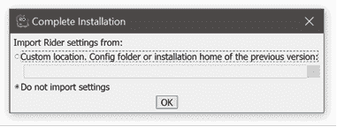

图 3

接下来，您可以选择是希望 Rider 使用浅色还是深色 UI 主题。我不能强烈推荐黑暗主题(称为 Darcula)，尤其是如果你运行多显示器设置，不想灼伤你的眼睛。

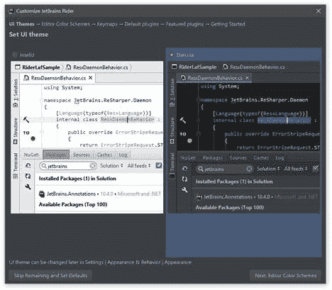

图 4

下一步是定义*配色方案*。这与*主题*有很大不同:主题决定了用户界面的外观，而配色方案决定了用什么颜色来突出你的代码。

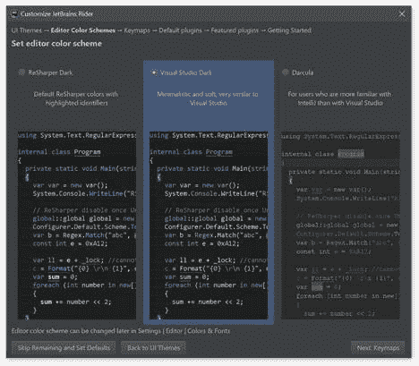

图 5

这里的选项有:

*   **ReSharper Dark** 与 Visual Studio 附带的非常相似，但是您会注意到它在 Visual Studio 没有的地方使用了相当多的颜色。这个设置实际上叫做*颜色标识符*，非常个人化的选择。就我个人而言，我认为它给已经拥挤的编辑器增加了太多的色彩。
*   **Visual Studio 暗黑**是对暗黑 Visual Studio 布局的近乎完美的复制(*没有* ReSharper)。唯一的区别是在 Visual Studio 懒得突出显示的地方，例如正则表达式中的标记。
*   **Darcula** 是 IntelliJ IDEA 和其他基于 JetBrains IDEA 的 ide 附带的配色方案。如果您之前已经在 JB 产品线的其他 ide 上使用过这个主题，并且希望保持视觉一致性，那么使用这个主题是有意义的。

接下来，您可以选择*键图*，即哪些键盘按键执行编译、运行等操作。

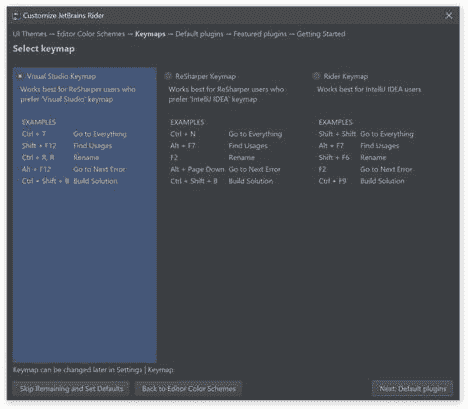

图 6

这里的选项是使用 Visual Studio 键图(请记住，它永远不会与 VS 完全匹配，因为 VS 本身在版本之间是内部不一致的)、ReSharper 键图或新的 Rider 键图。

接下来，你可以选择一些*默认的*(喷气大脑创建的)插件。其中包括版本控制、web 开发等插件。如果您不需要，可以使用**禁用**超链接来禁用任何插件:否则，它们将包含在您的安装中。

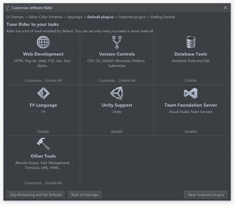

图 7

禁用不需要的东西通常是有意义的——您可以随时在以后安装这些插件。例如，就源代码控制插件而言，我怀疑 99%的用户会简单地离开 Git(GitHub 也有特殊的支持)，并且可以安全地禁用其他一切。需要注意的一件有趣的事情是:即使 F#语言支持作为一个插件被包含，并且可以被禁用，C++语言支持也不能以同样的方式被移除。

选择“默认”(官方)插件后，下一个屏幕显示一组*特色的*插件，这些插件不是必需的，但可能对某些用户有用。

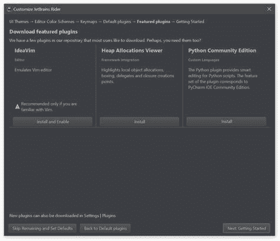

图 8

这个插件的选择是从网上下载的，很可能会被 JetBrains 更改。只需点击**安装**按钮即可安装，但要注意:有些插件(如 IdeaVim)会从根本上改变 IDE 的运行，让你陷入无法正常运行 IDE 的状态。这解释了图 8 所示的警告。

配置到此为止。下面的*入门*屏幕给你一些链接，让你了解更多关于 Rider 的信息。此时，您可以关闭对话框，并在“开始”屏幕结束。

“开始”屏幕看起来会有所不同，这取决于您是否是第一次使用它。如果您以前使用过 Rider，左侧包括一个您可以立即点击的最近项目列表。

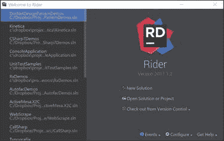

图 9:Rider 开始屏幕

在右侧，您可以看到打开项目的三种方式。选项包括:

*   制定新的解决方案。就像 Visual Studio 一样，Rider 提供了许多项目模板供您开始使用。
*   打开现有的解决方案或项目。Rider 使用 Visual Studio 项目系统，因此团队成员可以在 Rider 或 Visual Studio 中工作，不会以任何激烈的方式影响开发过程。当然也有不同之处，我们会边走边讨论。
*   从 VCS 打开一个项目(版本控制系统)。Rider 支持所有流行的 VCS 系统。

“开始”屏幕还允许通过“配置”下拉列表项直接访问 Rider 的各种设置，以防您想在不首先打开解决方案的情况下访问它们:

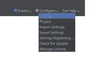

图 10:Rider 配置下拉菜单

从“配置”菜单中，您可以看到以下选项可用:

*   **设置**:让你自定义一个财富(我是说它，有很多)与 IDE 相关的设置
*   **插件** : 让你管理插件，这也不是看起来那么简单的过程——我们将在后面讨论
*   **导入/导出设置**:允许你把设置捆绑成一个单独的 JAR 文件，和别人分享。
*   **设置存储库**:允许你将自己的设置粘贴到 GitHub 或者 BitBucket 等源码控制服务中，然后使用这些设置，与自己的合并。

剩下的两个选项“检查更新”和“管理许可证”是不言自明的。

作为一个集成开发环境，Rider 本质上是一个被大量不同的*工具窗口*包围的文本编辑器。每个工具窗口占据屏幕的一小部分；其中一些可以标签在一起。这是许多工具窗口打开的 Rider 视图:

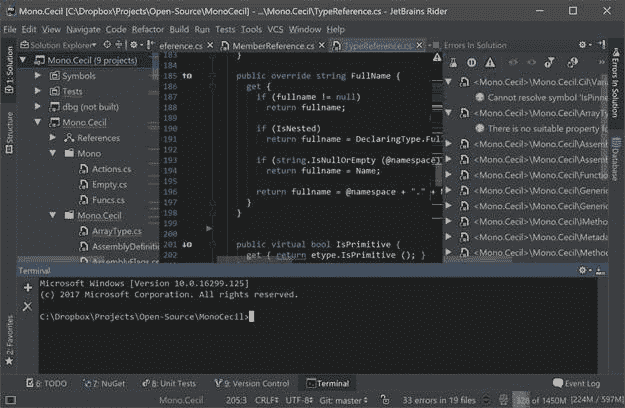

图 11

如您所见，左边是解决方案资源管理器，右边是解决方案中的错误窗口，底部是终端。

你可以用鼠标来显示和隐藏这些窗口，但是有一个更好的方法:使用键盘和一个叫做切换器的东西**。**

要调出开关，请按 **Ctrl+Tab** 。屏幕中央将显示一个类似于以下内容的弹出窗口:

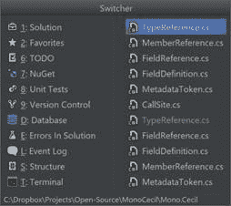

图 12

切换器分为两部分。左侧是一些可用工具窗口的列表。每一个都有一个快捷键，你可以按它来切换显示或隐藏这个窗口。此快捷键还与 Alt 键结合使用—要切换解决方案资源管理器的可见性，您可以简单地按下 **Alt** + **1** ，而无需首先打开切换器。切换器的右侧是我们最近使用的一些文件的列表。我们可以使用箭头键选择其中一个，然后按**进入**打开该文件。是的，鼠标也在这里工作。

现在我们来谈谈编辑窗格。每个文件占用一个单独的选项卡，默认情况下，一次只能看到一个文件。您可以左键单击打开一个选项卡，或者中键单击(假设您有一个鼠标中键)关闭一个选项卡。选项卡也可以重新排序。您还可以在中央编辑窗格中显示多个文件；为此，您可以通过右键单击选项卡并选择适当的选项来垂直或水平拆分编辑器:

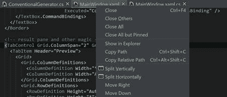

图 13

Rider 还带有几个*编辑模式*，控制代码在屏幕上的显示方式。它们是:

*   **无分心模式**:除了标题栏和菜单栏之外，大部分 UI 元素都被移除，编辑器装饰也被移除，代码出现在屏幕正中间。

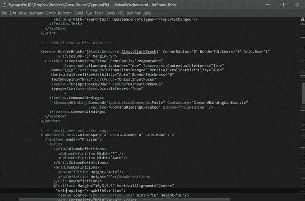

图 14

*   **演示模式**:用于演示。隐藏除代码、行号和滚动条之外的所有内容。也试图隐藏菜单，但如果您将光标移动到屏幕顶部，它就可用了。
*   **全屏模式**:隐藏标题栏，自动隐藏菜单栏；Rider 的其余部分和以前一样出现。

首先也是最重要的是**解决方案资源管理器**，这是一个显示整个解决方案结构的工具窗口:

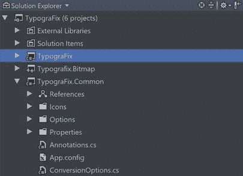

图 15

虽然使用解决方案资源管理器来导航单个文件很有诱惑力，但是还有很多其他导航机制(在本书后面描述)可以让您更高效地进行导航。

另一个特定于 Rider 的窗口叫做**文件结构**。这是一个窗口，显示您当前使用的文件成员的轮廓:

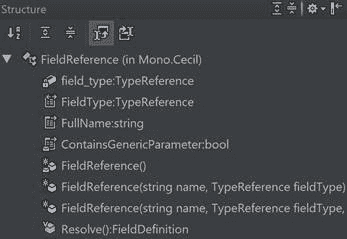

图 16

第三个值得一提的工具窗口(因为虽然可以隐藏，但是真的无法避免)是**输出**窗口。“输出”窗口收集来自编译和发生在 Rider 中的其他过程的所有文本输出。

本书后面还会提到其他几个窗口。

集成开发环境的定制不限于选择要在设置屏幕上使用的主题。还有很多额外的定制选项值得讨论。

首先，您可能希望详细定制用于呈现文本的字体和颜色，无论是集成开发环境用户界面的文本、正在编辑的代码还是其他窗口(如终端窗口)中的文本。这并不像看起来那么简单，因为 IDEA 使用一组分层的字体和颜色定义来呈现文本。

字体和颜色的默认设置在*配色方案*设置中定义。这是您在安装 Rider 时选择的配色方案，但是如果您在“设置”窗口中打开它，您会发现更多设置:

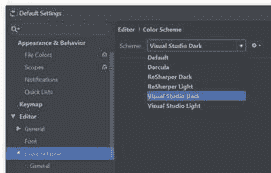

图 17

如您所见，配色方案集大致对应于您是选择了 ReSharper 还是 Visual Studio 方案以及浅色还是深色主题。根据定义，Darcula 是黑暗的，并且在所有基于 jet brains IDEA 的 IDEs 中都有表现。正如您可能已经猜到的，也可以导入和导出配色方案，您可以在网上找到大量可用的方案。

配色方案是一个复杂的概念。在顶层，它定义了一般使用的字体和颜色，这是一组在所有文本编辑器中使用的设置，与编程语言无关:

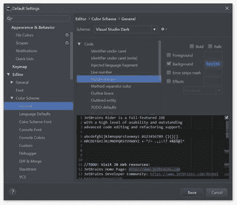

图 18

您会注意到，对于每个元素，都有一个预览窗口，但奇怪的是，只有字体的前景/背景颜色设置，无论是粗体还是斜体，无论是错误条纹(参见预览窗格右边距中的那些行？)显示的是什么颜色。此外，您可以指定不同的效果，例如文本用波浪线加下划线。

这一切都很好，但是字体系列和大小呢？这些设置位于字体部分，它就在配色方案的上方:

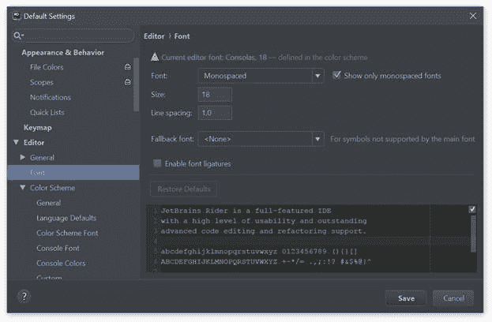

图 19

这绝对需要一个解释。默认情况下，您选择的方案还要求使用特定的字体。这就是顶部的感叹号图标告诉我们的。你*可以*不过，把字体改成你喜欢的。以下是您可以指定的内容:

*   **字体系列**:这决定了代码使用的字体(不是其他东西，比如 Console 窗口)。请注意，某些等宽字体(如 Lucida Console)没有被 Rider 识别为等宽字体，这可能要求您取消选中*仅显示等宽字体*选项，以使它们出现在下拉列表中。
*   **字体大小**，以像素为单位测量:这可能会引起不愉快，因为像素是 DPI 特定的，所以如果你在低 DPI 和高 DPI 屏幕的电脑之间同步设置，就不会好看了！
*   **行距**控制后续两条线之间的距离。您确实希望将该值保持在 1.0 和 1.2 之间。小于 1.0 的值将导致行重叠，而大的值将在行之间留下太多的空白。

|  | 注意:Rider 不支持分数字体大小。与 Visual Studio 以磅为单位保存字体大小不同，Rider 以像素为单位存储字体大小。这意味着，如果你习惯了，比如说，在 Visual Studio 中的 10 点字体，你将永远不会在 Rider 中得到这个字体大小。很抱歉！ |

*   **回退字体**是当前选择的字体没有特定字符时 IDE 要使用的字体。例如，有些字符集没有西里尔字符，所以如果您开始在源代码中键入俄语(顺便说一下，完全合法)，将使用回退字体。

IDEA 也支持连字。如果你以前没有遇到过连字，它们本质上是编码在字体中的特殊规则，将一起书写的符号的呈现方式更改为更易读的形式。别担心，底层代码还是和以前一样出现！这里有一个例子:

代码清单 1:连字示例

```cs
  // without ligatures
  public bool Covers(int
  x) { return x >= start && x
  <= end; }
  // with ligatures
  public bool Covers(int
  x) { return x ≥ start &&
  x ≤ end; }

```

Rider 支持连字，而且比 Visual Studio 做得更好——在撰写本文时，某些连字，如`<=`、`>=`在 Visual Studio 中被打断，这是在整个 WPF 子系统中被打断的直接后果！不过，Rider 可以很好地处理这些字体，所以在你决定购买昂贵的商业级字体之前，请随意尝试支持连字的字体，比如免费的 [FiraCode](https://github.com/tonsky/FiraCode) (我推荐 [PragmataPro](https://www.fsd.it/shop/fonts/pragmatapro/) )。

在通用文本设置之后，每种配色方案还带有与编程相关的设置部分，称为*语言默认值*。我想我们都可以同意所有编程语言都有某些共同点(比如变量)，对吗？这就是你可以微调这些东西的地方:

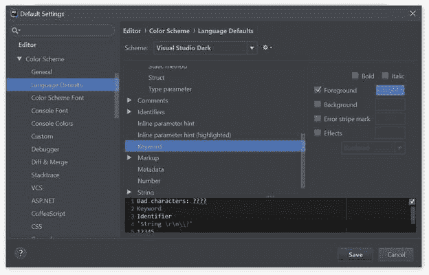

图 20

在图 20 所示的截图中，我正在更改一个关键字的设置。当然，特定于语言的设置可以覆盖事物的外观，但是默认情况下，我的所有关键词都是浅蓝色的。

主流编程语言，如 C#、VB.NET 和 F#都被前面的一组特性完美地覆盖了，所以它们在*配色方案*下没有任何额外的部分。其他语言也有特定的设置:例如，JavaScript 在独立时和嵌入 Razor 视图时都有设置。

不用说，所有这些设置都可以根据你的内心内容进行定制。你甚至可以设计自己的配色方案并在网上发布。

让我们来谈谈代码风格。虽然 C# 对代码风格并不严格，但团队和个人开发人员通常对事物的命名有自己的偏好。例如，您是否在字段名称前使用下划线？有些人喜欢，有些人不喜欢。有些人使用制表符，有些人使用空格。有人讨厌`var`，也有人几乎无处不在`var`。对我们来说幸运的是，Rider 是非常可配置的，即使是最复杂的开发人员也一定会满意。

代码样式设置因语言/技术而异，差异很大。让我们来看看 C# 可用的一些设置:

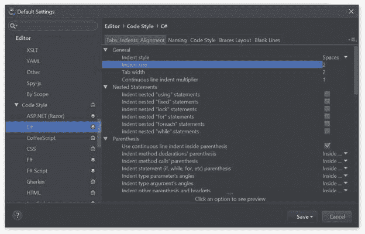

图 21

如你所见，这里有很多要讨论的。我们有专门的部分:

*   **制表符、缩进、对齐**:控制每个打开文件中的空格分布。这里最重要的设置是您是否想要使用制表符或空格，以及缩进实际有多大。正确应用这些设置可以防止浪漫的分手。[【1】](9.html#_ftn1)
*   **命名**:控制变量的命名方式。Rider 附带了一组可能不符合所有人喜好的默认设置，因此您肯定会在此菜单中花费时间来按照您想要的方式微调事物。
*   **代码风格**:你控制 Rider 在你的 C# 源代码中强制执行编码风格的方式。例如，假设您想要设置使用`var`关键字的策略。你有很多选择:

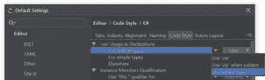

图 22

如您所见，您可以选择`var`声明的检查位置(对于内置类型、简单类型和其他地方)；Rider 实际上打算建议什么(明确使用`var`，仅在“明显”时使用，或使用明确的类型名称)；最后，展示了什么样的突出显示。

但是我们还没有讨论突出显示，是吗？现在是解释这是什么的好时机。为了更好地欣赏高亮显示，这里有一个简单的 Hello World 程序的截图:

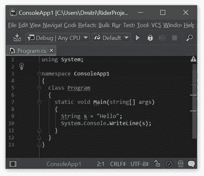

图 23

这么简单的程序，编辑器还挺挤的！让我们讨论所有有趣的部分:

*   类名`Program`下方有绿色波浪下划线。当代码元素加下划线时，这意味着 Rider 试图告诉我们一些事情。在这种特殊的情况下，它告诉我们类永远不会被直接实例化，如果你愿意，你可以让它成为`static`。波浪线用于*警告*和*错误*—这种区别在后面会很重要。
*   参数`args`显示为灰色，而不是像代码的其余部分一样显示为白色。这告诉我们这个代码元素是*未使用的*，可以安全移除。
*   类型`String`下面有一条虚线，但没有覆盖类型的整个名称。这些虚线高光用于表示*提示*和*建议*。

现在看看窗口右边的滚动条。除了滚动条本身，还有各种颜色的横线。这些行表示代码中可能存在的问题。每一行都是可点击的，点击它会把你带到它对应的代码行。高光和标记之间是一一对应的。

在滚动条的最顶端，你可以看到一个感叹号图标。这是文件中发现的所有问题的摘要；只有当你修复了 Rider 发现的每一个问题(或者显式抑制它们，这也是可能的)时，它才会变绿。

现在，回到我们之前讨论的`var`设置，您可以欣赏到 Rider 为该特定代码样式设置提供的不同选项:

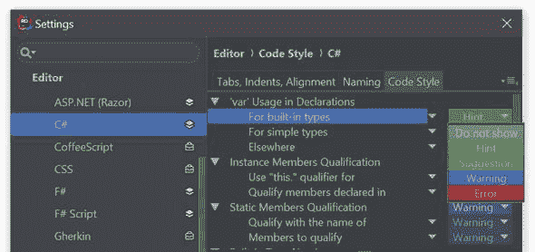

图 24

您可以设置五个可能的选项:

*   **不显示**就是不显示检查。您没有任何带下划线的代码，滚动条中也没有任何标记。
*   **提示**和**建议**如果你想的话可以帮你解决这些问题，但是没有直接拼版来“此时此地”解决这些问题
*   **警告**和**错误**是给开发者增加一点负担的设置。这会产生红色波浪下划线和相应的橙色/红色标记条。

希望这些设置与编辑体验的关系是清楚的。拼图的最后一部分，快速修复，将在本书后面解释。

虽然 Rider 的开发不能称之为 100%无鼠标，但它的大部分功能都可以通过各种键盘快捷键获得。Rider 附带了几个键盘快捷键设置包(称为*键图*)，它们模仿了其他知名开发环境的行为:

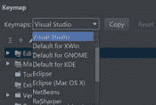

图 25:键图选择下拉列表

你最有可能使用的两个关键点图是 ReSharper(如果你以前使用过 ReSharper)或者 Visual Studio(如果你没有使用过 ReSharper 但是*使用了*Visual Studio)。

|  | 注意:您不能修改预定义的键盘映射。 |

除了使用预定义的按键映射，您还可以单独自定义每个按键。如果你像我一样，已经陷入了机械键盘的狂热中，并且丢失了，比如说，F 键行(我在 FC660C 上键入这个，只是想让你知道)，这一点就特别相关。

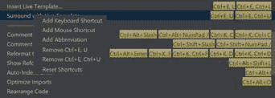

图 26:快捷方式定制

您会注意到，每个动作可以有一个或多个快捷键(或者根本没有)，每个快捷键不仅可以是一次按键，还可以是一系列按键(以逗号分隔)。

但这还不是全部！除了键盘快捷键，Rider 的动作也可以使用鼠标快捷键和缩写来调用。它们是什么？

鼠标快捷方式是通过单击一个或多个鼠标按钮或使用滚轮调用的快捷方式。这也可以与修饰键(Ctrl、Alt 和 Shift)结合使用。

最后一个更特别的选项叫做缩写。这可以通过一个例子得到最好的说明:假设你选择了退出动作，并给它一个`quit`的缩写。现在，如果你打开**进入任何东西**(更多信息参见搜索&导航部分)并输入该单词，你的最佳匹配将是退出动作。

注册处是 Rider 的一个秘密部分。您可以通过在代码中的任意位置按 **Alt+Enter** 并输入单词**注册表**来访问它—它没有键盘快捷键。本质上，注册表窗口如下所示:

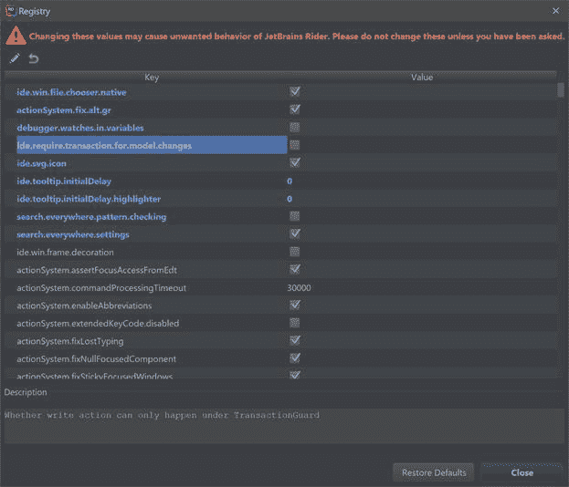

图 27

这些都是影响莱德运营方式的深层内部设置。例如，您可以强制 Rider 使用操作系统本地的文件打开对话框，而不是 IDEA 平台提供的对话框。虽然其中一些设置有描述，但这些描述不是很直观，除非你是一名 Rider 开发人员。