骑手集成开发环境不仅仅是一个纯文本编辑器。集成开发环境有许多相当低级(非常精细)的方法来改进代码编写流程。

例如，考虑支架完成。当您键入左大括号`{`时，右大括号`}`会自动添加。圆括号和方括号也是如此。当您在括号或大括号之间输入您需要的任何内容时，在已经有大括号的情况下键入右大括号将触发*改写支持*—骑手检测到您正在键入一个相同的符号，并防止虚假的重复。

骑手还支持*匹配大括号高亮*，所以当你将光标定位在左大括号或右大括号上时，它会自动高亮对应的大括号。当您试图理解深度嵌套的代码时，这非常有用。

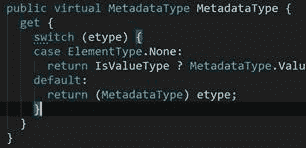

图 53

最后，一个非常有用的快捷方式( **Ctrl+D** 在所有布局中)只是复制当前行(或当前选择，如果你已经选择了一些东西)。这可能看起来是一件微不足道的事情，但它非常有用。

当 Visual Studio 多年前问世时，它有一个震惊世界的杀手级功能:智能感知。IntelliSense 的非微软术语是*代码完成*，它是在给定上下文中显示可用选项下拉列表的简单想法，例如，显示一个类的成员:

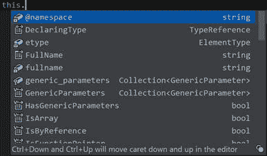

图 54

Rider 附带了几种不同的代码完成机制，它们比 Visual Studio 提供的任何东西都更强大。

响应您键入的内容而显示的代码完成选项称为*自动完成*，并且远远超出了搜索成员的范围。例如，当您要声明一个变量时，会得到命名建议:

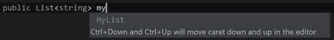

图 55

自动完成将产生以下建议:

*   基于类型的变量名称建议，如图 54 所示。这些包含了关于你喜欢的编码风格的知识。
*   对班级成员的建议。
*   完成可见类型的建议，这意味着类型在当前范围内已经可用。如果类型为*不可用*(例如缺少一条`using`语句)，则需要完全键入并按 **Alt+Enter** 自动导入。
*   关键字建议完成了一些简单的事情，如可见性修饰符、真/假文字以及任何其他预定义的 C#关键字。
*   静态方法的参数列表中的`this`文字的建议，以防你正在做一个扩展方法。
*   枚举成员的完成。
*   未解析符号的完成。例如，假设您正在使用某个类型的某个成员，但是该类型没有该成员！即使代码是无效的，一旦 Rider 了解到您对它的使用，它将在代码完成时提供该元素，希望您以后能解决这个问题。
*   方法调用中参数名称的完成。
*   完成`dynamic`类型的建议成员。这与 Rider 处理未解析符号的方式类似。

在骑手中，代码完成是*统计*—骑手正在跟踪呼叫频率，并首先为您提供最常用的选项。同样，就像导航一样，代码完成使用 CamelHumps:如果你在一个名为`HasGenericParameters`的符号之后，你可以简单地键入`hgp`，然后完成所需的符号。

智能完成是一种机制，它使用先进的算法为您提供在特定时间点适用的元素。你需要一个特殊的快捷方式(VS 布局中的 **Ctrl+Alt+Space** )来调用它，但是一旦你这么做了，你的大量完成列表就会大幅缩小。

这里有一些例子。假设你在一个`bool`返回方法中，你有几个`bool`参数，一些局部布尔变量，还有，别忘了，各种布尔文字。在`return`声明中调用智能完成将把范围缩小到*仅仅*产生`bool`的事物:

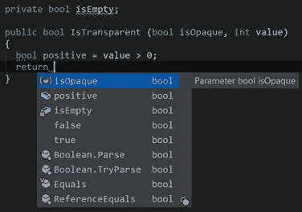

图 56

同样，如果您在赋值语句中，智能完成将在显示完成列表时考虑您要赋值的变量的类型:

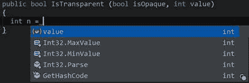

图 57

智能完井可能有所帮助的其他一些情况包括:

*   将表达式转换到作业的右侧(因为您想要转换到的内容非常明显)
*   对象初始值设定项:智能完成将属性集过滤到那些尚未在此初始值设定项中赋值的属性
*   Lambda 表达式:智能完成在这里生成 lambda 表达式语法
*   从`out`参数创建局部变量也由智能完成处理

驼峰也可以智能完成。

这种完成形式(通过 **Shift+Alt+Space** 调用)允许您完成没有适当导入的符号。这组符号不仅取自当前项目的一组引用程序集，还取自附近的项目及其引用。

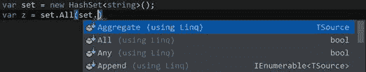

图 58

如您所见，导入完成不仅适用于普通成员，也适用于扩展方法。自然，驼峰也是支持的。

Rider 可以快速使用语句和引用。我们先来处理前者。每当您使用一个没有对应`using`的类型时，您将首先在代码完成中遇到它，其中包含适当引用的选项是自动的:

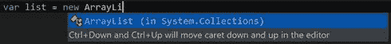

图 59

在这里调用代码完成不仅会完成`ArrayList`名称，还会在文件顶部的 using 语句集中添加一个`using System.Collections;`。

好吧，这很简单，如果你放弃了这个选项(比如你只是粘贴了一大块代码)呢？在这种情况下，您将看到以下内容:


图 60

这是一个批量操作:您可以一次导入几个引用。例如，如果您从互联网上粘贴了一大块代码，这将非常有用——您只需按下 **Alt+Enter** ，骑手将尝试填补空白。当然，并不总是能够明确地导入所有类型，Rider 会就此向您发出警告。

一旦你打开一个解决方案，莱德就开始持续分析你的代码，并向你展示关于*当前打开文件*中的代码的提示和建议。骑手给你的提示是基于*检查*，这只是它用来检查代码是否正常的规则。

最简单的检查是检查未使用的代码，如未使用的`using`语句、未使用的类、未使用的参数，以及任何其他没有人使用并且可以安全删除的代码:

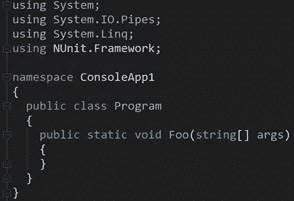

图 61

如您所见，这些元素是灰色的。如果您将光标移动到其中一个指令上(比如，未使用的`using`指令)，并按下 **Alt+Enter** ，您将看到以下菜单:

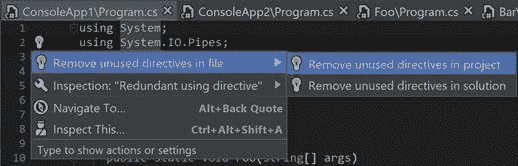

图 62

所示的第一个选项**删除文件**中未使用的指令，只对当前文件进行操作。但是，由于此特定操作可能与多个文件相关，因此您也可以在文件夹、项目或整个解决方案中运行它，如展开的菜单所示。这个机制被称为*范围修复*:它不是在骑手支持的所有动作上都可用，只是其中的一些。

给定光标下的代码，上下文操作是 Rider 可以执行的一些操作。这些操作通常是非破坏性的，在大多数情况下，是操作代码的非常简单的方式。它们不是针对代码中可能出现的问题而提供的；相反，它们是以不同方式做事的机会。

考虑以下场景:

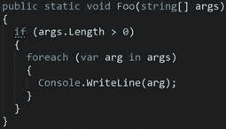

图 63

如果您将插入符号移动到`foreach`上并按下 **Alt+Enter** ，您的顶部选项(显示为锤子)是一个上下文操作，允许您将`foreach`循环更改为`for`循环:

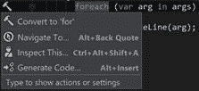

图 64

当您调用此上下文操作时，Rider 将重写整个循环以使用`for`而不是`foreach`:

代码清单 2

```cs
  for (var index = 0; index <
  args.Length; index++)
  {
    var arg = args[index];
    Console.WriteLine(arg);
  }

```

骑手配备了大量的上下文动作，每一个都可以通过**检查设置>上下文动作**下的设置单独配置:

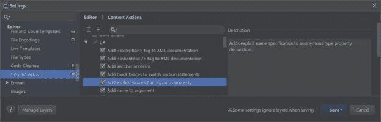

如您所见，上下文操作是按语言分组的；对于每个选定的上下文操作，您会看到一个复选标记，以决定是否希望该操作可用。右侧的描述窗格会告诉您该操作实际上做了什么。

我们已经谈到了检查，但让我们再次回顾一下。检查不同于上下文操作，因为即使它们也是我们检查源代码所依据的规则，这些规则也不是机会主义的:它们至少是*可以改进代码的好想法*。总的分类是:

*   **暗示**只是——暗示在这里可以做一些整洁的事情。用于提示的突出显示是代码元素开头的绿色虚线，可以改进。
*   **暗示**是更强的暗示形式。可以改进的整个代码块用波浪下划线标出；此外，标记栏中显示的每个建议都有一个绿色标记。建议更难忽视。
*   **警告**根据莱德的说法，这些地方可能会出现严重的问题。例如，您可能会以导致程序崩溃的异常结束，或者您正在执行没有成功机会的强制转换。警告用波浪橙色给代码加下划线，并在标记栏上有相应的橙色标记。
*   **错误**是一些甚至不会编译的代码。它们或者用红色下划线标出，或者在无法识别符号的情况下，代码本身也是红色的。标记栏上还有一个红色标记。你别无选择，只能解决所有这些问题。

当然，仅仅有检查是不够的:许多*静态分析*工具对源代码进行分析，但是 Rider 超越了这一点。它给你的是自动纠正问题的能力。

速战速决是对检查采取行动的一种方式。当骑手提出提示或建议时，您可以在相关代码元素上按 **Alt+Enter** ，您将看到一个或多个带有黄色灯泡的项目:

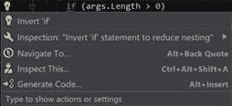

图 65

同样，如果您有警告或建议(比如，您返回的类型与方法签名不匹配)，Rider 将为您提供快速修复来快速纠正这种情况:

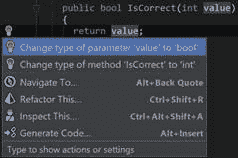

图 66

检查以不同于上下文操作的方式进行配置，正如我们在讨论设置时已经讨论过的那样。

默认情况下，Rider 会分析您当前打开的文件。相反，SWA 会继续分析整个解决方案中的每一个文件，并可以为您列出它发现的所有问题。

要启用或禁用 SWA，您需要单击状态栏中带有横条图标的红色圆圈。它将显示以下菜单:

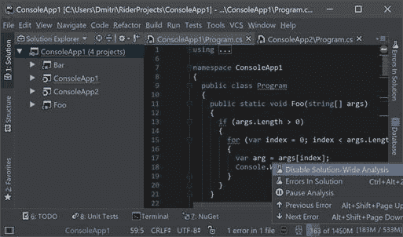

图 67

为什么 SWA 是可配置的？因为大型解决方案的解决方案范围分析在计算上非常昂贵。虽然 Rider 有能力禁用对单个文件的检查(例如，对生成的代码)，但在足够大的解决方案上进行 SWA 仍然非常费力。

然而，如果你付出代价，你会得到很多好处。首先，如图 67 所示，您获得了从一个错误到另一个错误的适当快捷方式。此外，还有解决方案中的**错误**窗口，这是一个单独的工具窗口，为您提供代码中所有问题位置的列表:

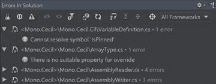

图 68

即使 SWA 通常显示错误，您也可以让它显示警告。双击每个元素会将您带到违规的位置，您也可以打开**自动滚动到源**让骑手在列表中选择错误时为您执行。