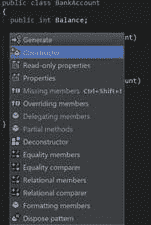
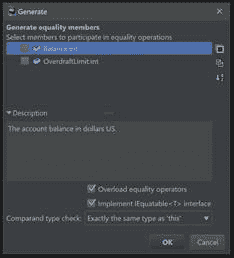
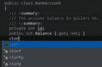
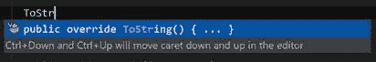
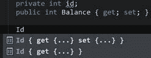
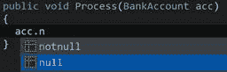
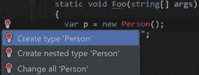
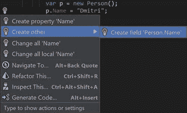
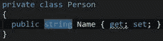

# 六、代码生成

就像重构、导航和其他功能丰富的菜单一样，Rider 提供了一个单独的生成菜单( **Alt+Insert** 在 VS 布局中)，为您创建通用样板代码提供了一系列代码生成选项。这里有一个选择:



图 69

让我们更详细地讨论一些选项:

*   **构造函数**生成一个构造函数，让您指定要用构造函数参数初始化哪些字段或属性。
*   **属性**和**只读属性**为您选择的字段生成属性。生成的属性还可以支持高级功能，如`INotifyPropertyChanged`。
*   **覆盖成员**允许你为这个类想要覆盖的任何成员自动插入存根。
*   **委派成员**真的很酷，因为它可以让你很容易地构建一个装饰器(按照 GoF 设计模式)。比如说你想要自己的`StringBuilder`样的班级，但是`StringBuilder`其实是`sealed`。你是做什么的？聚合`StringBuilder`的一个实例，然后使用*生成委派成员*来转发每个呼叫。
*   **相等成员**生成与对象比较相关的典型标志:`Equals()`、`GetHashCode()`、对`IEquatable`和`=`以及`!=`运算符的支持。类似地，**相等比较器**根据您选择的字段和属性生成特定的比较器。
*   **关系成员**和**关系比较器**以类似于等式的方式生成关系比较。
*   **格式化成员**创建了一个很好的`ToString()`实现，输出一个你选择的所有字段和属性的列表。
*   **Dispose 模式**至少会生成一个`IDisposable`的实现，该实现为类中的每个一次性成员显式调用`Dispose()`，最多实现完整的`Dispose`模式。

这些菜单项中的大多数实际上都显示了一个对话框，允许您根据自己的喜好微调代码生成过程:



图 70

在图 70 中，您可以看到，除了选择用于比较的成员，您还可以选择重载等式运算符(`=`和`!=`)或实现`IEquatable<T>`，甚至可以选择如何比较不同变量的类型以进行类型安全的等式比较。

值得注意的是，Rider 并不能确保生成代码的事后一致性。这意味着，如果底层结构发生变化，生成的结构的实现可能需要手动重新生成。

“生成”菜单非常好，但是有时您希望在不破坏工作流的情况下生成代码。为了帮助实现这一点，Rider 在代码完成时构建了一些重构。

以构造函数为例。除了使用“生成”菜单，Rider 还提供了生成完全初始化构造函数的快捷方式，该构造函数初始化所有字段(`ctorf`)、所有属性(`ctorp`)或所有字段*和*属性(`ctorfp`)。



图 71

如果我们选择图 71 所示的`ctorfp`选项，我们的代码将如下所示:

代码清单 3

```cs
  public
  BankAccount(int id, int balance)
  {
    this.id = id;
    Balance = balance;
  }

```

创成式完成的另一部分是自动创建相关字段的覆盖和属性。只需开始键入重写的名称，您将获得完成重写签名的代码:



图 72

属性也是如此:给定一个字段，开始键入相应的属性名称，您将看到以下选项:



图 73

正如您可能已经猜到的，这些选项允许您为字段生成读写或只读属性。

后缀结束是一种特殊的结束形式，也就是说，结束显示在符号的尾部点(句点)上。它添加了更多的代码完成元素，允许您对完成主题执行常见操作。

例如，给定一个普通变量，你会看到完成项，如`null`或`notnull`:



图 74

调用此`notnull`完成将变量的使用转换为`if`语句，该语句包含对变量执行的空检查:

代码清单 4

```cs
  public
  void Process(BankAccount acc)
  {
    if (acc != null)
    {
      |
    }
  }

```

典型的开发工作流程是首先创建类，然后使用它们。但是*从用法*创建机制允许你做相反的事情——使用尚未声明的字段、方法和整个类，然后使用 Rider 的快速修复选项来生成适当的代码构造。

这里有一个小例子。假设我写了以下内容:

代码清单 5

```cs
  var p = new Person();
  p.Name = "Dmitri";

```

假设`Person`类不存在，标识符会显示为红色。将插入符号放在违规的(红色)符号上，我可以按下**Alt+输入**，并显示以下选项:



图 75

前两个选项允许您自动创建一个名为`Person`的类型，作为顶级类或当前类中的嵌套类。最后一个选项**更改所有**，允许你将代码中的所有`Person`位置重命名为其他位置；例如，当您正在导入依赖于某个类型的代码，但在您自己的代码中该类型已被重命名时，这很有用。

使用创建非常聪明。在大多数情况下，它会尝试猜测预期的类型。例如，在语句`p.name = “Dmitri”`中，Rider 提供生成字段或属性:



图 76

默认情况下，Rider 假设我们想要一个房产；由于我们设置的命名约定(属性以大写字母开头)，它得到了这个想法。然而，它确实知道我们可能想要别的东西，并且额外的选项出现在**创建其他**中；在我们的例子中，`Name`也可以是一个字段。选择这些选项中的任何一个都会在`Person`类中生成适当的成员。

执行**创建属性**操作后，您将看到以下占位符:



图 77

在这种特殊情况下，Rider已经正确地猜到了类型为`string`。这个推论只有在你指定了明确的东西时才起作用；如果我们写了`person.Name = null;`，我们会得到类型`object`。

从使用中创建范例允许非常快速地原型化您的想法:您首先编写您想要的代码，并动态地生成支持该代码的数据结构。

Emmet(以前被称为 Zen Coding)是一种小型 DSL(领域特定语言)，用于以网络语言(HTML 和 CSS)快速创建复杂的代码结构。这是一种代码生成形式，它使用特殊的解释器来读取定义并将其扩展成(可能相当复杂的)结构。

Rider 自带对 Emmet 的内置支持，所以如果你写了，比如说`table>tr*3>td*2`，按 **Tab** ，Rider 会变成:

代码清单 6

```cs
  <table>
      <tr>

  <td></td>

  <td></td>
      </tr>
      <tr>

  <td></td>

  <td></td>
      </tr>
      <tr>

  <td></td>

  <td></td>
      </tr>
  </table>

```

值得注意的是，在生成代码清单 5 所示的 HTML 时，Rider 还会创建热点——您可以输入`<td>`元素内容的地方——并允许您使用 Tab 键从一个移动到另一个。

有关该 DSL 支持哪些命令的更多信息，请参考埃米特文档。

助记模板是我自己发明的。本质上，目标是为常见的编程语言(如 C#、Kotlin 和其他语言)提供类似 Emmet 的功能。助记模板项目为[开源](http://github.com/nesteruk/mnemonics)，用 F#编程语言编写。

你可以把助记模板想象成“面向对象语言的埃米特”，因为它追求类似的目标:允许用户通过简写符号快速生成类、方法、属性和其他构造。虽然 DSL 不直接支持嵌套，但是您可以轻松地创建通用代码结构。以下是他们创建的一些模板和构造:

*   `c`创建一个普通类。
*   `C`创建一个静态类。
*   `m`和`M`分别创建实例和静态方法。默认情况下，这些是无参数的 void-return 方法。
*   `m<type>`创建一个返回`<type>` `:`的方法。例如，mf 创建一个返回`float`的方法。其他数据类型(`double`、`int`、`DateTime`等。)是受支持的。
*   `ps`使用公共的 getter 和 setter 创建类型字符串的自动属性。同样，您可以用其他类型替换`s`。

助记符支持的类型集合如下:

表 1

| **缩写** | **数据类型** |
| --- | --- |
| `b` | `bool` |
| `c` | `char` |
| `f` | `float` |
| `by` | `byte` |
| `d` | `double` |
| `i` | `int` |
| `m` | `decimal` |
| `s` | `string` |
| `l` | `long` |
| `u` | `uint` |
| `g` | `Guid` |
| `t` | `DateTime` |
| `sb` | `StringBuilder` |

除了 C# 和 VB.NET，助记项目还支持其他编程语言和 ide。查看其自述页面，了解有关不同可用模板的更多信息。还值得注意的是，助记符完全是一个基于代码生成的项目(它生成表 1 中列出的模板和类型的笛卡尔乘积)，是使用 F#编程语言的一个很好的案例研究。