重构是一种改变，它保持代码像以前一样运行，但让代码看起来更好，处于更易维护的状态。Rider 提供的自动化重构总是让代码保持一致(或者，在最坏的情况下，明确警告您最终会得到损坏的代码)。

首先，你需要知道重构这个菜单(VS 布局中的 **Ctrl+Shift+R** 或者菜单栏中的**重构>重构这个**)。该菜单为您提供了可以在插入符号位置对代码进行的所有重构的列表:

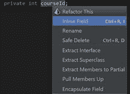

图 78

接下来是对单个重构及其不同调用方式的讨论。

*重命名*重构可能是目前最常用的重构。它不仅重命名插入符号下的符号(这几乎是给定的)，而且重命名还继续搜索相关符号。或者，您也可以选择在注释和字符串文字中搜索符号。

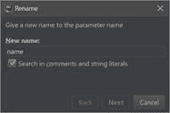

图 79

例如，字段的名称可能与构造函数参数或属性的名称相关。在这种情况下，骑手报告如下:

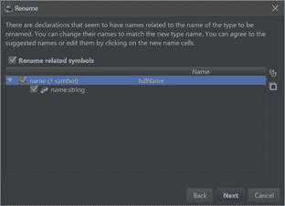

图 80

方便的是，Rider 还会在注释和 XML 文档中搜索该名称，再次提供用更新的名称替换它。

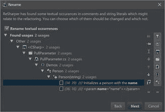

图 81

如您所见，这是一个非常复杂的对话框。它不仅向您显示您要重命名的符号的确切提及位置，而且还有许多过滤选项。此外，对于每个找到的元素，您可以跳转到编辑器中的源代码，当然，您可以从重构中删除它。

*引入*重构系列，允许您获取任意表达式，并将其转换为封闭方法的字段、变量或参数。例如，这允许非常快速地将魔法常数升级为私有常数。

*引入变量*允许您获取子表达式，并将其转化为代码旁边的局部变量。例如，您可以轻松地将它:

代码清单 7

```cs
  var rootDisc = Math.Sqrt(b * b - 4
  * a * c);

```

变成这样:

代码清单 8

```cs
  var
  disc = b * b - 4 * a * c;
  var rootDisc =
  Math.Sqrt(disc);

```

这大大提高了代码的可读性。

有时候你想把一个方法的一部分放入一个单独的方法中。例如，考虑求解二次方程的代码:

代码清单 9:二次方程求解器

```cs
  public class
  QuadraticEquationSolver
  {
    public static (double, double)
  Solve(double a, double b, double c)
    {
      var rootDisc = Math.Sqrt(b * b
  - 4 * a * c);
      return ((-b + rootDisc) / 2 /
  a, (-b - rootDisc) / 2 / a);
    }
  }

```

假设您想将判别式的计算(T1 位)移到一个单独的类中。首先，将光标放在`Math.Sqrt()`调用中的某个位置，我们使用*展开选择*快捷方式(**在 VS 布局中 Ctrl+W** )直到选择整个子表达式。

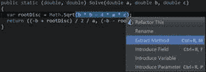

图 82

然后，调用**提取方法**重构，我们首先看到这个相当不起眼的对话框:

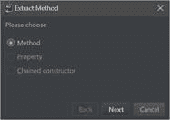

图 83

正如您所看到的，即使我们被限制在当前上下文中提取一个方法(因为代码块依赖于本地参数)，理论上您也可以将调用提取到一个`readonly`属性(实际上是一个方法)中，或者在某些情况下，提取到一个链式构造函数调用中。

不管怎样，选择了唯一可用的选项后，我们现在看到了以下更全面的对话框:

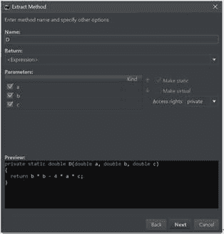

图 84

在这里，您可以选择方法的新名称、采用哪些参数以及一些附加选项。请注意 Rider 如何正确地确定该方法可以静态化。在底部，您可以看到生成方法的预览。

只要单击**下一步**，新方法将被添加到当前类中，并且当前选择的代码块将被对新方法的调用所替换——当然是用所有正确的参数！

*Extract* 系列重构允许您获取任意数量的类/接口成员，并将它们提取到超类、接口或部分类中。

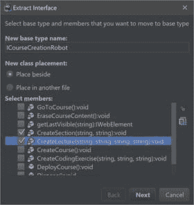

图 85

提取类的成员时，您有两个选项:您可以指定新生成的类型将被调用什么，它是放在同一个文件中还是放在一个全新的文件中，最关键的是，您实际上想要提取什么成员。

值得注意的是，Rider 在访问修饰符时非常小心:例如，如果您试图将一个`private`成员提取到基类中，并且该成员在原始类的其他地方使用，它的可见性将自动更改为`protected`以保持代码工作。

在 Rider 中不可能涵盖每一个重构，但是我想再提几个，而不是仅仅让你阅读 Rider 的文档。

**将抽象类转换为接口**和**将接口转换为抽象类**是对称重构，将数据结构从一种类型转换为另一种类型。如果您尝试将接口转换为抽象类，并且该接口的实现者已经定义了基类，那么 Rider 将会显示一个错误:

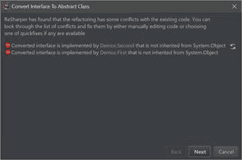

图 86

**更改签名** 是一个重构，当 Rider 检测到你已经更改了一个方法的签名时，这个重构就可用了。例如，您可能刚刚向一个方法添加了一个新参数，使该方法的现有调用无效:

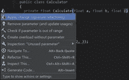

图 87

“更改签名”重构的对话框向您展示了实际更改的内容。在添加额外参数的情况下，我们得到以下结果:

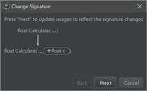

图 88

现在我们已经添加了一个额外的参数，对这个方法的调用变得无效，因为缺少了一个参数。我们如何解决这个问题？嗯，骑手提供了不少于*四种*不同的可能性来纠正这种情况:

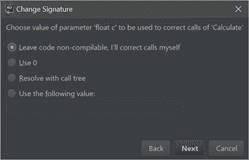

图 89

让我们讨论所有可能的选项:

*   如果您选择**让代码不可编译**，那么您随后将不得不遍历调用中断的每个位置，并手动纠正它。幸运的是，由于 Rider 的解决方案范围分析，这些地方很容易找到(即使没有编译)。
*   使用 0 (零)的选项基本上是建议用该类型的默认值将参数添加到每个调用中。由于我们的方法获得了一个类型为`float`的新参数，Rider 提供了一个零值。
*   **使用以下值**允许您指定自己要添加的值。

这里最后一个选项叫做**用调用树**解析，有点特别。选择此选项会显示一个工具窗口，其中包含附加选项的下拉列表:


图 90

工具窗口左侧的列表列出了需要指定参数的所有位置。在我们的例子中，我们只有一个，但在现实世界中，你可以有几十个位置。在右侧，您会看到该位置的选项下拉列表。您当然可以选择自己编辑位置，但是您也可以在每个包含方法中创建一个参数；您也可以在包含类中创建一个字段，或者使用现有字段，如最后一个选项所示。

Rider 的大部分重构都集中在代码层:将插入符号放在代码元素上，并对其调用重构。然而，Rider 还附带了一些在解决方案资源管理器中可用的更高级别的重构。

就像普通的代码编辑一样，我们得到了重构这个菜单:

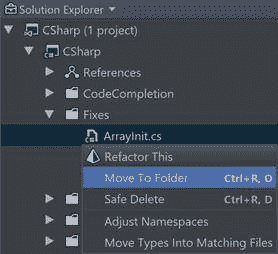

图 91

图 91 中列出的重构非常简单明了，但是我们还是来讨论一下:

*   **移动到文件夹** 将文件移动到您选择的文件夹。请注意，一般来说，Rider 试图保持文件中声明的名称空间的名称及其在磁盘上的位置之间的内部一致性。
*   **安全删除**是一个安全删除文件的命令，在删除之前检查代码没有被使用。顺便说一下，这个命令也可以在单独的类上使用。
*   **调整命名空间**通过确保类型的命名空间与其物理位置相对应来加强内部一致性。正如您可能已经猜到的，它还调整了它们的用法(特别是导入)，以便即使在名称空间被更改之后，使用这些类型的其余代码仍然有效。
*   **将类型移动到匹配文件中**尝试实施每个文件一个类的规则，将每个单独的顶级类移动到自己的单独文件中。

这组重构可以应用于单个文件和文件夹。命令**调整名称空间**和**将类型移入匹配文件**也可以在项目或解决方案中调用。

我在这里展示的所有例子都集中在纯 C# 上。值得注意的是，Rider 对其他编程语言也有很多重构。其中包括 web 三元组(HTML/CSS/JavaScript)，以及它与诸如 Razor 等视图引擎的交互。还值得注意的是，这些功能在其他语言中使用的语言中是可用的。例如，如果您在 Razor 视图中使用 C# 内部的 JSON，您将获得一致的体验——当然不仅仅是在重构方面，还有其他特性，比如导航。

另外还有不同标记语言(如 XAML)的重构组，以及 Rider 也支持的不同编程语言(F#)。