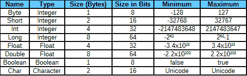
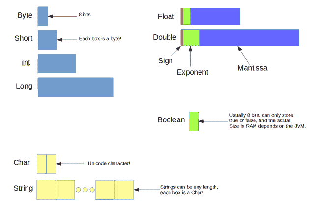

# 值

变量是用于指向不同值的名称。例如，我们可以创建一个名为`personAge`的整数变量，并将其指向`35`。我们可以将一个变量指向不同的值，这意味着我们可以稍后更改`personAge`并将其指向`36`。从这个意义上说，Scala 变量类似于其他语言中的引用。在 Scala 中，我们使用`var`关键字定义变量。

值是一个固定的量或对象。值不会改变，它们由变量指向。在其他语言中，值被称为常量，我们可以定义一个名为`PI`的值，并将其设置为`3.14159`。在 Scala 中，我们通过使用`val`关键字来定义值。

代码清单 3:设置和更改变量和 val

```
  object MainObject {
         def main(args: Array[String]): Unit = {
                // Create a variable called
  myVariable.
                var myVariable = 0

                // Create a value called myValue.
                val myValue = 0

                // We can change the value that
  myVariable points to:
                myVariable = 10

                // But we can't change a val!
  The following line is an error!
                myValue = 10
         }
  }

```

在代码清单 3 中，我们创建了一个名为 **`myVariable`** 的变量，并将其设置为 **`10`** 。我们还创建了一个名为 **`myValue`** 的值，再次设置为 **`0`** 。接下来，我们将 **`myVariable`** 的设置改为 **`10`** 。这很好，因为变量可以在整个程序中设置为许多不同的设置。但是在下一行我们尝试将 **`myValue`** 设置为**`10`**——这一行是错误的，我已经用红色突出显示了。请注意，我们不能重新分配值。为了重新分配一个 **`val`** 就像给数字 3 或圆周率重新分配一个意义一样——这个操作没有任何意义，也不合法。

定义变量的语法以 **`var`** 或 **`val`** 关键字开始，后跟标识符名称，如 **`myVariable`** 或 **`myValue`** 。我们使用赋值操作符“ **`=`** ”遵循这一点，并提供一个值、变量或文字。代码清单 3 中使用的这个方法是一种简写语法。Scala 将从初始赋值中推断变量的数据类型。

我们还可以通过包含冒号和数据类型的名称来显式地声明变量的数据类型(我们将很快查看所有可用的数据类型)。代码清单 4 展示了使用这种更长的语法通过指定数据类型来定义`Int`、`String`和`Double`变量的一些例子。

代码清单 4:指定数据类型

```
  object MainObject {
         def main(args: Array[String]): Unit = {
                // Create an Int variable
  called myInt
                var myInt: Int = 0

                // Create a String variable called
  personName
                var personName: String = "Thomas"

                // Create a double val set
  to the Golden Ratio
                val goldenRatio: Double = 1.61803398875
         }
  }

```

### 标识符名称

标识符是我们在程序中用来代表某种东西的名称。标识符用于命名`val`和`var`，以及函数、类和对象。Scala 在命名标识符方面非常灵活。几乎没有任何限制，不像 Java 这样的语言，不允许任意的符号。相比之下，Scala 允许所有类型的字符串都是标识符，包括像“`&`”和“`Days of the week!`”这样的选项。

Scala 中的简单标识符可以像其他语言一样使用。这些标识符由以字母或下划线开头的字符串组成。字符串可以包含数字，但不能以数字开头。例如:`userName`、`_height`、`record56`、`Square_Root`。

我们也可以使用运算符符号作为标识符。在面向对象编程中，当我们命名成员方法作为对象的操作符时，通常会出现这种情况。我们将在研究类时研究命名成员方法。例如:`+`、`++`、`:::`。通常，用这些符号或这些符号的字符串来命名我们的常规变量不是一个好主意，因为这样做会使代码难以阅读。

最后，我们可以使用反引号来分隔任意字符串。这些字符串可以包含空格，符号，数字，任何东西。标识符名称是不带引号的字符串。我们可以单独使用标识符名称，但只能在特定的情况下使用，因为编译器有时需要使用引号来理解变量名的开始和结束位置。代码清单 5 显示了一些带有简单和复杂名称的 Scala 标识符的例子。

代码清单 5:标识符示例

```
  object MainObject {
      def main(args: Array[String]): Unit = {
                // Identifiers for variables are
  usually descriptive strings
                // of letters and digits:
                var root2 = Math.sqrt(2)

                // We can also define identifiers
  beginning with underscore: 
                val _someVar = 23

                // But, we can define an
  identifier as a series of operators.
                // Note that this doesn’t make
  sense in the current context, and
                // this type of identifier is much
  more useful when we are
                // defining classes in Object-Oriented
  programming!
                def +&^%(i: Int, y: Int): Int = 42

                // We can name a variable an
  arbitrary string of characters, but
                // sometimes we have to use back quotes
  to delimit the name:
                val `#*^`: Int = 623

                // And we can use back quotes to
  define arbitrary identifiers:
                val `my identifier has 4's in its name,
  and $ as well!` = 9

                // If it can, Scala will recognize
  the identifiers without quotes
                // even their name consists of
  arbitrary operator symbols:
                println("The value of #*^ is " +
  #*^)
                // We can include the back quotes
  if our names are confusing:
                println("The value of #*^ is " +
  `#*^`) 

                // If the names of the variable
  have spaces, we need to use
                // back quotes because the Scala
  compiler
                // will split the name into tokens
  unless it is delimited
                // with back-quotes:
                println("The value of my silly val is: " +
                       `my
  identifier a 4 in its name, and $ as well!`)

                // The following is indecipherable
  and will generate an error!
                //println("The value of my
  silly val is: " +
                //     my identifier has 4's in
  its name, and $ as well!)
         }
  }

```

|  | 注意:虽然我们可以像`def,`一样命名标识符的关键字，但这不是一个好主意(事实上，您必须使用反引号来实现这一点)。我们应该始终尝试以描述性的方式命名标识符，我们不应该试图通过创建同名的标识符来重新定义关键字。 |

|  | 提示:通常使用 Camel Case 来命名 Scala 标识符。标识符以小写字母开头，标识符中的每个后续单词都以大写字母开头，如`averageIncome`和`computePerimiter`。这只是一个约定，当我们给类命名时，我们通常用一个大写字母来开始同一个名字中的每个单词，比如`MyClass`。这使得区分变量和类变得很容易。 |

Scala 区分大小写，这意味着标识符`MYID`和`myID`是完全不同的标识符，`def`是关键字，而`DEF`不是。



*图 13:数据类型*

基本数据类型与 Java 中的相同，只是它们以大写字母开头。Scala 编译器通常足够聪明，能够从上下文中推导出数据类型，因此当我们定义变量和值时，数据类型经常会被忽略，但是，如果我们想显式地声明变量的数据类型，我们可以使用图 13 第一列中的名称。图 14 描述了 Scala 中基本数据类型的一些特征的概述。



图 14:基本数据类型概述

代码清单 6 展示了一些声明和定义变量和值的例子(注意这个清单没有 main 方法，不能运行)。

代码清单 6:定义变量和值

```
  var someInteger: Int = 190 // Declare and define an integer.
  val someChar: Char = 'A' // Declare and define a character.
  var someBool: Boolean = false
  // Declare and define
  a Boolean.
  var someFloat = 3.14f // Declare and define a float.
  var someDouble = Math.sqrt(2)
  // Declare and define
  a double.

```

在最后两个例子中，我没有使用数据类型，但是 Scala 知道 **`someFloat`** 应该是一个浮点数，因为字面上 **`3.14f`** 是一个浮点数(它以 **`f`** 结束，这是一个浮点数的后缀)。同样的， **`someDouble`** 也会有`Double`的类型，因为 **`Math.sqrt(2)`** 是返回`Double`的函数。

整数是整数。例如，一个整数可以设置为 **`178`** 或 **`-59`** 。不同的整数类型(**`Byte`****`Short`****`Int`**和 **`Long`** )在我们需要或多或少的数字范围时使用。字节只能存储-128 到 127(含)之间的值，所以如果你有一个变量你知道只会落在这些值之间，你可以保存 RAM 并将这个变量存储为 **`Byte`** 。否则，如果你的变量需要很大的范围，你可以使用 **`Long`** ，因为它的范围是-2 <sup>63</sup> 到 2 <sup>63</sup> -1。我们通常使用 **`Int`** 表示整数，只有当我们知道范围很小并且想要节省 RAM 时，或者当我们需要与使用这些较小数据类型之一的系统进行互操作时，才使用 **`Byte`** 或 **`Short`** 。同样，除非我们知道特定变量需要该范围，否则很少使用 **`Long`** 。

Scala 使用与其他语言相同的整数算法。这意味着运算导致截断而不是舍入。例如，10/6 将给出结果 1，尽管实际值 1.66666 更接近 2。整数算术总是截断答案的小数部分，并返回剩余的整数部分作为结果。如果需要知道除法后的余数，可以用%运算符返回。所以，就整数运算而言，10/6 等于 10/6，等于 1，余数返回 10%6，等于 4；换句话说，10/6 等于 1，余数为 4。

浮点数(**`Float`****`Double`**)能够表示分数，如**`67.8`****`-99.24`**。浮点运算经常会出错，而且有很多分数浮点不能准确表示。例如，浮点不可能表示 1/3，因为 Scala 使用的是 IEEE 754 标准，而这个标准只允许 2 的完美幂和的精确表示。当我们将 **`Double`** 变量设置为 1/3 时，存储的数字非常接近 1/3，但并不精确。这有时很重要——例如，当检查两个双精度是否相等时，我们有时必须考虑少量的误差，例如 0.3333333333 将等于 0.333333332，因为最后的 2 可能是舍入误差。代码清单 7 显示了一个使用`Math.abs`测试双精度相等的例子。

代码清单 7:测试双精度相等

```
  object MainObject {
      def main(args: Array[String]): Unit = {
         // Define two variables which are
  mathematically
         // equal:
         var a = (10.0 / 3.0)
         var b = (1.0/3.0) * 2.0 * 5.0

         // This will not work! Testing the
  exact
         // values of doubles for equality
  is often
         // a waste of time!
         if(a
  == b)
                println("The two are equal!")
         else
                println("The two are not equal...")

         // Allowing some small error using
  Math.abs
         // makes more sense. The following
  report
         // that a and b are equal:
         if(Math.abs(a -
  b) < 0.0001)
                println("The two are equal!")
         else
                println("The two are not equal...")
         }
  }

```

在代码清单 7 中，我们创建了两个变量，`a`和`b`，理论上应该设置为完全相同的值；—10/3 在数学上与(1/3)*2*5 相同。但是在 IEEE 754 中，我们将为这些表达式获得两个不同的值，因此在比较它们时，我们应该使用`Math.abs`，并且我们应该考虑到小程度的误差(示例中的`0.0001`将报告相等的值，只要双精度值类似于 1/10000 以内)。用于比较浮点类型的小值通常称为ε值。当比较`Float`值时，我们可以使用完全相同的技术，因为浮点运算有相同的舍入误差。

布尔变量用于逻辑表达式中，以便进行决策和过滤。它们只有两个值: **`true`** 或 **`false`** 。

字符数据类型用于字符和字符串。它代表 Unicode 字符，如`'A'`或`'@'.`

文字是出现在代码中的值，如 **`190`** 或 **`'A'`** 。它们用于设置变量和值，也用于形成表达式。所有的文字都是值，就像 **`val`** 一样，不能重新定义。然而，我们可以将变量指向它们。

### 整数文字

整数文字显示为整数，如`899`或`-77162`。它们可以有一个负号来表示小于`0`的值。不带后缀的整数文字被读作十进制或十进制文字，因此 899 的意思是“八百九十九”带`0x`后缀的整数文字被读作十六进制，即以 16 为基数的数字。例如，`0xff0a`和`0x772e`(十六进制是一种位置符号，与十进制相同，除了有 16 个数字，从 0 到 9，A，B，C，D，E 和 F——有关十六进制的更多信息，请访问维基百科:[https://en.wikipedia.org/wiki/Hexadecimal](https://en.wikipedia.org/wiki/Hexadecimal))。长整型文字以 L 结尾，如 **`789827L`** 或 **`-898827L`** 。长整型文字的范围为-2 <sup>63</sup> 到 2 <sup>63</sup> -1。

|  | 注意:在 Scala 的早期版本中，我们可以使用前导“0”来表示八进制数。例如，037 表示十进制值 31。八进制文字现在已经过时，在整数文字的开头放一个前导 0 会导致错误。 |

### 浮点文字

类型`Double`文字包含小数点，例如 **`90.7`** 或 **`-178.5`** 。类型`Float`文字也可以包含小数点，并且以“ **`f`** 结尾。例如， **`271f`** 或 **`-90.872f`** 。您也可以对 **`Float`** 和 **`Double`** 文字使用科学符号——例如 **`54.9e2`** ，这与 **5490.0** 相同(或 54.9 乘以 10 的 2 次方)。您也可以使用“ **`f`** ”后缀和科学符号来创建一个 **`Float`** 文字，例如， **16e-1f** 表示 1.6 或 16 乘以 10 的负 1 次方。

### 其他文字

字符文字用单引号括起来，如**`'A'`****`'%'`**，或 **`'6'`** 。注意 **`'6'`** 与 **`6`** 这个整数有很大的不同。 **`'6'`** 是一个 Unicode 字符，其`Int`值为`54`。有关 Unicode 字符的完整表格，请访问[http://unicode-table.com/en/](http://unicode-table.com/en/)。也有一些转义序列可以作为字符文字使用: **`'\n'`** 表示新行， **`'\r'`** 表示回车， **`'\t'`** 表示制表符，**`'`**\**“**表示双引号。为了直接使用一个 Unicode 代码，我们把 **`'\u`** 后缀后面加上数字，这样 **`'\u0065'`** 就和 **`'A'`** 一样了，因为 **`'6'`** 有一个 Unicode 值 65。

布尔文字是 **`true`** 和 **`false`** 。代码清单 8 显示了一些布尔文字。我们可以使用**`true`****`false`**关键词，也可以使用其他文字和逻辑运算符，如“ **`>`** ”(表示大于)来形成逻辑表达式。在代码清单 8 中，2 不大于 5，这意味着名为 **`twoGreaterThanFive`** 的布尔值将被设置为 **`false`** 。

代码清单 8:布尔文字

```
  val myBoolean = true
  var myOtherBoolean = false
  val twoGreaterThanFive = 2 > 5

```

**`String`** 不是一个基础数据类型，但是字符串是如此的常用，我们可以把它们和其他基础数据类型一起介绍。 **`String`** 文字由双引号括起来的文本组成。我们也可以使用三双引号来表示多行字符串文字。多行文字可以包含新的行字符。代码清单 9 显示了字符串文字的两个例子——单行文字和多行文字。

代码清单 9:字符串文字和多行字符串文字

```
  var str = "This
  is a string!"
  var multiLineString = """
  This is
  also a string, only this one
  can
  span many lines because it is delimited with
  triple
  quotes! It can also contain single quotes,
  like
  ".
  """

```

注释是程序员为自己和其他程序员在代码中放置的注释。Scala 编译器会忽略注释。Scala 允许和 Java 一样的注释。我们使用//来指定单行注释或对一行中的剩余文本进行注释，我们使用/*和*/来包含块注释(参见代码清单 10 中使用单行和多行注释的示例)。

代码清单 10:注释示例

```
  /*
  HelloWorld
  *
  Displays the text 'Hello world' to the user
  *
  CommandLine Args: None
  *
  Returns: None
  * */

  object MainObject {
         def main(args: Array[String]): Unit = {
                // Print 'Hello world!' to the
  console:
                println("Hello world!") // Single line comment!
         }
  }

```

|  | 注意:Scala 还允许称为 ScalaDoc 注释的特殊注释。这些注释以/**开头，以*/结尾。它们用于为我们的代码生成文档。有关 ScalaDoc 注释的语法和用法的更多信息，请访问:http://docs.scala-lang.org/style/scaladoc.html. |

强制转换就是改变变量、值或文字的数据类型。Scala 中的转换是通过调用每个数据类型提供的函数来实现的。例如，要将`Int`转换为`String`，我们可以使用`someInt.toString`。要将`Double`铸造成`Float`，我们将使用`someDouble.toFloat`。代码清单 11 显示了不同类型之间的转换示例。

代码清单 11:强制转换

```
  object MainObject {
         def main(args: Array[String]) {

                // Casting numerical types to other
  types and strings:
                var someDouble = 1.3
                println("As a float: " +
  someDouble.toFloat)
                println("As a char: " + someDouble.toChar)
                println("As an Int: " + someDouble.toInt)
                println("As a String: " +
  someDouble.toString)

                // Casting strings to numerical
  types:
                val myInt = "192".toInt
                val myFloat = "192.2".toFloat

         }
  }

```

|  | 注意:`toInt`方法是一种数字解析方法，这意味着如果我们使用整数不可用的任何符号，我们将导致错误。为了将字符串“`72.5`”转换为整数，我们首先需要将其转换为`Double`或`Float`，然后将其转换为`Int`。 |

|  | 注意:将`Float`或`Double`投射到`Int`使用截断。当我们将`Float`类型更改为`Short`、`Int`或`Long`时，情况确实如此。数字不会被舍入，而是被截断为最接近零的整数值。 |