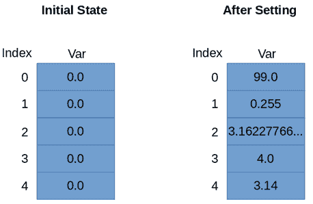
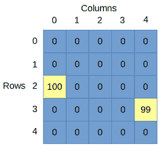

Scala 通常将对象存储在集合中。两种最基本的集合类型是数组和列表。在本节中，我们将研究如何在这些简单的集合中存储数据，并且我们将查看 Scala 为操作这些集合提供的一些丰富的集合特性。

数组将具有相同数据类型的对象集合存储在连续的内存中。数组的大小是固定的，因此在定义了数组之后，我们就不能添加和删除项目了。如果您想在类似数组的结构中添加和删除项目，请参见列表中的下一部分。

代码清单 33:定义数组

```scala
  // Array
  of 5 Ints
  var myIntArray: Array[Int] = new Array[Int](5)
  // Array
  of 10 Doubles
  var myDoubleArray = new Array[Double](10)
  // Array
  of 3 Strings
  val myStringArray = new Array[String](3)
  > 

```

代码清单 33 显示了三个数组的定义。为了定义数组，我们使用 **`var`** 或`val`关键字，后跟标识符名称。我们以 **`Array[dataType]`** 为例，这里 **`dataType`** 是我们希望数组存储的任何类型。然后我们用 **`= new Array[dataType](count)`** ，其中 **`count`** 是数组中元素的个数。或者，我们可以跳过定义中多余的声明部分，使用快捷符号，如 **`myDoubleArray`** 。

为了访问数组的元素，无论是为了设置还是为了读取，我们都使用括号(使用普通括号，而不是其他使用方括号的基于 C 的语言)。需要注意的是，数组访问是从 0 开始的。这意味着当我们创建 n 个元素的数组时，第一个元素的索引为 0，最后一个元素的索引为 n-1。代码清单 34 显示了手动设置数组元素的几个例子，一次一个。

代码清单 34:设置和访问元素

```scala
  object MainObject {
         def main(args: Array[String]): Unit = {
                // Define a double array with 5
  elements:
                val doubleArray: Array[Double] = new
  Array[Double](5)

                // Set the values of the array
                doubleArray(0)
  = 99.0
                doubleArray(1)
  = 25.5 /
  100.0
                doubleArray(2)
  = Math.sqrt(10)
                doubleArray((7
  >> 2)
  + 2)
  = 4.0
                doubleArray(4)
  = 3.14
                // doubleArray(5) = 100 //
  Illegal!

                // Access elements and output.
                println("doubleArray(0) = " +
  doubleArray(0))
                println("doubleArray(1) = " +
  doubleArray(1))
                println("doubleArray(2) = " +
  doubleArray(2))
                println("doubleArray(3) = " +
  doubleArray(3))
                println("doubleArray(4) = " +
  doubleArray(4))

                // println("doubleArray(5) =
  " + doubleArray(5))// Illegal!
         }
  }

```

代码清单 34 显示了一个包含五个元素的 **`Double`** 数组的基本示例。我们可以通过使用数组标识符后跟括号中的索引来设置元素的值。注意 **`doubleArray(0)`** 表示第一个元素 **`doubleArray(4)`** 表示最后一个元素。并且没有元素(5)——元素编号为 0 到 n-1。

当我们设置一个数组元素的值时，我们可以使用任何我们喜欢的表达式，因为每个元素都是一个完全正常的双 **`var`** 。还要注意，我们可以用表达式访问元素。在代码清单 34 中， **`doubleArray(3)`** 的值是使用索引表达式设置的: **`((7>>2)+2)`** 。此表达式的计算结果为 **`3`** 。当我们使用表达式来访问数组元素时，它们的计算结果必须是正整数——数组中没有元素 3.5 或-6。

图 15 显示了设置元素值前后代码清单 34 中的双数组。



图 15:设置元素前后的数组

### Val 与 var 数组

代码清单 35 说明了 **`val`** 和 **`var`** 数组之间的区别。如果我们定义一个 **`val`** 数组，我们就不能将数组标识符指向 **`someOtherArray`** ，因为它是一个 **`val`** 。但是，我们可以改变 **`val`** 阵列的元素。 **`val`** 阵的元素是 **`var`** ，可以根据需要改变。

代码清单 35:值与值数组

```scala
  object MainObject {
         def main(args: Array[String]): Unit = {

                // Define a val and var array:
                val myValArray = new Array[Int](10)
                var myVarArray = new Array[Int](10)

                // Define some other array:
                var someOtherArray = new Array[Int](10)

                // Set the var array to point to
  someOtherArray
                myVarArray = someOtherArray
                // myValArray = someOtherArray //
  Illegal!

                // However, we can change the
  elements of a val array!
                myValArray(0)
  = 100
         }
  }
```

一个 **`var`** 数组可以指向一个新的数组，在代码清单 35 中我们创建一个 **`var`** 数组，然后我们将其指向 **`someOtherArray`** 。如同一个 **`val`** 数组一样，一个 **`var`** 数组的元素本身就是 **`var`** ，我们可以自由地将它们更改为我们需要的任何值。

多维数组对于以网格、盒状排列或更高维度存储对象非常有用，就其元素数量和所需的内存量而言，它们通常非常大。通常使用嵌套循环或具有多个迭代器的循环来处理它们。

代码清单 36: 2D 阵列

```scala
  object MainObject {
         def main(args: Array[String]): Unit = {
                // Declare a 2D array of Int
                val array2D = Array.ofDim[Int](5, 5)

                // Set elements in the array:
                array2D(2)(0) = 100
                array2D(3)(4) = 99

                // Read elements:
                println("Element(0)(0): " +
  array2D(0)(0))
                println("Element(2)(0): " +
  array2D(2)(0))
                println("Element(3)(4): " +
  array2D(3)(4))
         }
  }

```

代码清单 36 显示了如何创建多维数组。我们使用 **`val name =`** 的语法，其中 **`name`** 是数组的标识符。我们将此设置为 **`Array.ofDim[dataType]`** ，其中 **`dataType`** 是我们数组元素的类型。然后我们指定尺寸的大小，在这个例子中是 **`(5, 5)`** 。这将创建一个 **`Int`** 的 2D 矩阵，每个元素将被初始化为 **`0`** 。图 16 显示了在元素设置为 100 和 99 之后代码清单 36 中的数组，如代码清单所示。



图 16: 2D 阵列

图 16 显示了绘制的 **`array2D`** 数组，第一个索引代表行，第二个索引代表列。这个决定是任意的，我们可以很容易地画出其他方向的数组。

代码清单 36 中的行 **`array2D(2)(0) = 100`** 将第 2 行第 0 列的数组值设置为 100。上面写着 **`array2D(3)(4) = 99`** 的行将第 3 行第 4 列的数组值设置为 99。

高维数组也是可能的。我们可以用类似 **`var my3DArray = Array.ofDim[Int](10, 10, 10)`** 的东西来定义一个三维数组。与 2D 阵列一样，3D 阵列中元素的方向纯粹是概念上的，重要的是我们每次访问元素时都以相同的方式设想和说明阵列。

|  | 注意:高维数组会快速消耗大量内存。数组中元素的总数是维度大小的乘积。所以，如果我们有一个三维的 Int 数组，每个维度有 100 个元素，那么我们的数组中 Int 变量的总数是 100*100*100，也就是一百万。每个 Int 变量消耗 4 个字节的内存来存储在系统中，因此 100x100x100 Int 数组将需要大约 4 兆字节的内存。 |

|  | 提示:如果您有许多数组，或者您想使用 Scala 中提供的几个有用的函数来使用数组，您可以在程序的顶部导入 Array。导入数组时，可以使用速记 var someArray = ofDim[Int](10，10)而不是 var some Array = Array . ofDim[Int](10，10)来定义新数组。 |

ArrayBuffer 类似于数组，只是我们可以添加和删除项目。代码清单 37 显示了一个 ArrayBuffer 的基本示例。该程序从用户那里读取一个双精度列表，将它们存储在 ArrayBuffer 中，并计算总和。注意，要使用 ArrayBuffer，我们导入 **`scala.collection.mutable.ArrayBuffer`** 。

代码清单 37:数组填充器基础

```scala
  import scala.io.StdIn._
  import
  scala.collection.mutable.ArrayBuffer

  object MainObject {
         def main(args: Array[String]) {

                val userInput = ArrayBuffer[Double]()

                while(true) {
                // Output a prompt:
                print("Input a number (use -1.0 to continue): ")

                // Read some input:
                val x
  = readDouble

                // If the user inputs something
  other than -1
                // add it to the array buffer:
                if(x
  != -1)
                       userInput += x // += adds the item to the end end
                //userInput.insert(0, x)// We can
  also insert items at the start

                // When the user inputs -1: 
                else {
                       // Init a summation
  variable     
                       var sum = 0.0
                       // Use a for loop to add the items
  together
                       for(y
  <- userInput) {
                             print("Adding " + y
  + " ")
                             sum += y
                       }

                       // Output the sum of items:
                       println("Sum is " + sum)

                       return // Return from main
                       }
                }
         }
  >}

```

我们可以使用 **++=** 运算符一次向数组中添加多个项目。我们还可以通过向 insert 方法提供多个值，一次向 ArrayBuffer 的任何位置添加多个项。代码清单 38 显示了从数组缓冲区添加和删除单个和多个项目的几个例子。

代码清单 38:从数组填充器中添加和移除项目

```scala
  import scala.io.StdIn._
  import
  scala.collection.mutable.ArrayBuffer

  object MainObject {
         def printArrayBuffer(arr: ArrayBuffer[Int]) {

                print("Array Buffer: ")

                // Print out the values in the array
  buffer
                for(x
  <- arr)
                       print(x
  + " ")

                // Print a new line:
                println
         }

         def main(args: Array[String]) {

                // Create a new ArrayBuffer
                val nums = new ArrayBuffer[Int]()

                // Add a 1 to end of the array
  buffer:
                nums += 1
                printArrayBuffer(nums)

                // Add multiple items at once to
  the end:
                nums ++= Array(2, 5)
                printArrayBuffer(nums)

                // Add a 3 and a 4 after position
  2:
                nums.insert(2,
  3, 4)

                printArrayBuffer(nums)

                // To remove an item by its index:
                nums.remove(3)
                printArrayBuffer(nums)

                // Remove 2 items beginning at
  index 1:
                nums.remove(1,
  2)
                printArrayBuffer(nums)

         }
  }
  > 

```

请注意，迭代一个`ArrayBuffer`类似于一个`Array`。我们可以按照代码清单 38 使用一个简单的 for 循环。我们也可以使用名为`ArrayBuffer.length`的属性，并循环遍历这些项目。

列表类似于数组，只是元素不是存储在连续的内存中，而是存储为链表。列表从开始到结束的遍历速度很快，但是在中间查找项目的速度很慢。此外，我们不能改变列表中的项目，它们是不可变的。代码清单 39 展示了一些定义和遍历简单列表的例子。

|  | 注意:各种集合类型都有不同的实现。这导致不同任务的性能不同。例如，我们可以在恒定时间内将项目添加到列表的开头或结尾；但是，ArrayBuffer 以恒定的时间向末尾添加元素，但向开头添加元素需要线性时间。有关某些任务性能的完整比较，请参见 [`http://docs.scala-lang.org/overviews/collections/performance-characteristics.html`](http://docs.scala-lang.org/overviews/collections/performance-characteristics.html) 。 |

|  | 提示:为算法选择集合时，我们通常会尽量减少对集合执行操作所花费的时间。如果经常需要向集合的开头添加项，则应使用实现为链接列表(如列表)的集合。如果需要在任意位置引用或索引元素(如元素号 1000 或元素号 789)，应该使用存储在连续内存中的集合，如数组。 |

代码清单 39:列表

```scala
  object MainObject {
         def main(args: Array[String]) {

                // List of 3 integers:
                var integerList: List[Int] = List(100, 101, 102)

                // List of strings:
                var capitalCities: List[String] = List(
                       "Melbourne",
                       "Hobart",
                       "Brisbane",
                       "Sydney")

                // Concatenate items to a list: 
                capitalCities = capitalCities.:::(List[String]("Darwin"))

                // Print out the items of a list:
                println(capitalCities)

                // Traverse a list:
                for(i
  <- integerList)
                       println("Element: " + i)
         }
  }

```

我们也可以使用 **`::`** 定义列表，称为 **`cons`** ，是 construct 的缩写，我们还可以使用`Nil`，作为列表的尾部。当你以这种方式创建列表时，你应该总是在最后使用`Nil`来完成列表(参见代码清单 40，注意这不是一个完整的代码清单，不能作为程序运行)。

代码清单 40:有缺点和无的清单

```scala
  //
  Empty list:
  var anEmptyList = Nil

  // List
  with cons and Nil
  var directions = "North" :: "South" :: "East" ::
         "West" :: Nil

```

Scala 中还有其他创建简单列表的方法。例如，我们也可以使用`List.range`方法，它允许我们以数字顺序快速创建项目列表。还有`List.fill`方法，它允许我们创建一个设置为相同值的项目列表，如代码清单 41 所示。

代码清单 41:创建带有范围和填充的列表

```scala
  // Create
  a list of 100 integers from 1 to 100:
  var rangeList = List.range(1, 100)

  // List
  filled with 10 copies of String 'Empty'
  var filledList = List.fill(10)("Empty")

```

列表有三个非常重要的方法:`head`、`tail`和`isEmpty`。方法`head`指向列表的第一个元素，方法`tail`指向第一个之后的所有元素。方法`isEmpty`用于判断列表是否为空。代码清单 42 显示了使用`head`、`tail`和`isEmpty`的例子

代码列表`42: Head, Tail, and IsEmpty`

```scala
  //
  Empty list:
  var anEmptyList = Nil

  // List
  with cons and Nil
  var directions = "North" :: "South" :: "East" :: "West" :: Nil

  println("First element of directions: " +
  directions.head)
  println("Final element of directions: " +
  directions.tail)
  println("Directions is empty? " +
  directions.isEmpty)
  println("anEmptyList is empty? " +
  anEmptyList.isEmpty)

```

### 多维列表

我们还可以创建列表列表。这些列表中的每个元素本身就是一个列表。从概念上讲，这与创建多维列表相同。代码清单 43 显示了一个创建简单的 2D 整数列表的例子。

代码清单 43: 2D 列表

```scala
  //
  Create a list of lists:
  var twoDList =
         List(
                List(1, 2,
  3),
                List(4, 5,
  6),
                List(7, 8,
  9)
         )

  //
  Loop1:
  for(l1 <- twoDList) {
         println("Element: " + l1) 
  }

  //
  Loop2:
  //
  Traverse using nested for loops
  for(l1 <- twoDList) {
         for(l2 <- l1) {
                println(l2)
         }
  }

```

代码清单 43 创建了一个名为 **`twoDList`** 的列表，该列表由三个元素组成，每个元素本身就是一个`List`。为了遍历列表，我们可以使用一个简单的 for 循环，但这只会访问每个内部列表。为了遍历嵌套列表的每个元素，我们可以嵌套循环。代码清单 43 的输出如代码清单 44 所示。

代码清单 44:代码清单 43 的输出

```scala
  Element:
  List(1, 2, 3)
  Element:
  List(4, 5, 6)
  Element:
  List(7, 8, 9)
  1
  2
  3
  4
  5
  6
  7
  8
  9

```

### 列表上有用的方法

列表和其他集合有很多有用的方法，比如`List.length`，它返回列表中元素的数量；`List.last`，返回列表的最后一个元素；和`List`。`first`，返回列表中的第一个元素。下一节提供了一些使用列表可用的其他运算符和方法的额外示例。感兴趣的读者应该查阅每种收藏类型的文档，以便充分了解这些物品的多样性。 **`List`** 课程的文档可从[http://www.scala-lang.org/api/2.7.7/scala/List.html](http://www.scala-lang.org/api/2.7.7/scala/List.html)获得。

### 制表方法

我们也可以使用列表创建列表。这允许我们使用表达式甚至“如果”语句为列表中的每个项目创建复杂的列表项目模式。

代码清单 45:列表

```scala
  object MainObject {
         def main(args: Array[String]) {

         // Create a tabulated list:
         val tabulatedList = List.tabulate(10)(n
  => 
                if(n
  % 2
  == 0)
  "" +
  n +
  " is even"
                else "" + n
  + " is odd")

         // Print the items of the list:
         for(s
  <- tabulatedList)
                println(s)
         }
  }

```

代码清单 45 显示了一个创建列表的例子。代码列表使用`tabulate`方法和`=>`运算符来创建交替的`n is even`和`n is odd`元素的列表。稍后我们将看到更多的`=>`符；目前，这个代码清单的重要方面是`tabulate`方法。对于列表中的每个元素，结果将应用“if”语句，因此`n is even`或`n is odd`将成为我们列表的元素。

### 连接运算符

为了将两个列表连接在一起，我们使用了 concatenate 运算符，该运算符由三个冒号( **`:::`** )表示。代码清单 46 显示了使用 concatenate 运算符将两个列表连接在一起并生成第三个列表的示例。

代码清单 46:连接运算符

```scala
  object MainObject {
         def main(args: Array[String]) {

                // Create some lists
                var list1 = List(1,
  2, 3)
                var list2 = List(4,
  5, 6)

                // Concatenate list1 and list2
                var list3 = list1 ::: list2

                // Print 1, 2, 3, 4, 5, 6
                for(i
  <- list3)
                       println(i)
         }
  }

```

### 拿着，放下，然后分开

代码清单 47:获取、删除和拆分

```scala
  object MainObject {
         def main(args: Array[String]) {
                // Create a list:
                var integerList = List(
                       1, 2, 3,
  4, 5,
  6, 7,
  8, 9,
  10)

                // Take: Prints List(1, 2, 3, 4,
  5)
                println(integerList take 5)

                // Drop: Prints List(6, 7, 8, 9,
  10)
                println(integerList drop 5)

                // SplitAt: Prints (List(1, 2, 3,
  4, 5),List(6, 7, 8, 9, 10))
                println(integerList splitAt 5)
         }
  }

```

代码清单 47 显示了在列表中使用`take`、`drop`和`splitAt`运算符的示例。`take`方法创建一个具有指定项目数的列表。在本例中，提供的数字是 5，这意味着`integerList`的前五项将作为新列表返回。

`The operator` `drop`与`take`相反——实际上`drop`会从列表中移除 x 个项目，并返回一个新列表。在本例中，为跌落提供的数字是 5，因此`integerList`中的前五项将被移除，剩下 6、7、8、9 和 10 项。

最后一个例子展示了如何使用`splitAt`操作符将列表拆分成更小的列表。对`splitAt` 5 的调用将导致列表被分成两个较小的列表，第一个包含从 0 到索引 4 的元素(即五个元素)，第二个包含从索引 5 到尾部的元素。

折叠是一种处理列表的技术。假设我们想输入 x，用列表中的每个项目对 x 执行一个操作，然后返回 x。例如，假设我们想从 0 开始，将`Int`列表中的每个整数相加，以计算列表元素的总和。根据代码清单 48，我们可以用 for 循环来完成这项工作，不会有太多麻烦。

代码清单 48:使用 For 循环对列表元素求和

```scala
  object MainObject {
    def main(args: Array[String]): Unit = {

      // Define a list:
      val myList = List(1,
  2, 3,
  4, 5)

      // Define a summing variable:
      var sum = 0

      // Sum the elements using a for
  loop:
      for(listElement <- myList)
        sum += listElement 

      // Output the total:
      println("Sum is: " + sum)
    }
  }

```

Scala 还提供了另一种有趣的方法来解决这个问题，叫做折叠。代码清单 49 显示了与代码清单 48 相同的例子，只是这次我们使用了`foldLeft`。

代码清单 49:使用 foldLeft 对列表元素求和

```scala
  object MainObject {
    def main(args: Array[String]): Unit = {

      // Define a list:
      val myList = List(1,
  2, 3,
  4, 5)

      // Define the sum, foldLeft using
  a closure:
      var sum = myList.foldLeft(0)((x,y) => x+y)

      // Output the total:
      println("Sum is: " + sum)
    }
  }

```

**`foldLeft`** 功能属于 **`List`** 类。它需要两个参数，第一个， **`(0)`** ，是一个整数。第二个是要执行的函数(这个函数实际上是一个闭包——我们将在单独的一章中更详细地研究闭包)。在代码清单 49 的例子中，我们说 **`x`** 的值从 **`0`** 开始。然后每个列表项被传递到闭包 **`(x, y) => x+y`** 。每个列表元素在闭包中充当 **`y`** 变量， **`x`** 的值将一个接一个地对元素求和。如果这令人困惑，第 9 章将集中讨论闭包的语法。

我们可以在 **`0`** 以外的值启动 **`x`** 变量。例如，如果我们在 **`10`** 开始 **`x`** 变量，那么总和将被报告为 **`25`** ，因为 **`10+1+2+3+4+5`** 是 **`25.`**

|  | 提示:我们也可以使用 foldRight，它与 foldLeft 相同，只是遍历列表的迭代顺序相反。当我们使用 foldLeft 时，列表从第一个元素迭代到最后一个元素。使用 foldRight，列表从最后一项迭代到第一项。 |

这是对 Scala 折叠功能的简单介绍。操作类似于 reduce，感兴趣的读者可以查找其他话题，如 **`foldRight`** 和 reduce。