# 第 1 章雷盖克斯机器人

## 快速介绍

僵尸工具是在 Skype 或 Skype for Business 中与用户互动的绝佳方式。在某种程度上，机器人是用户可以与之互动的对话代理，就像与人对话一样。

在我的电子书 [*微软机器人框架简洁地*](https://www.syncfusion.com/resources/techportal/details/ebooks/Microsoft_Bot_Framework_Succinctly) 中，我涵盖了创建和使用机器人以及向 Skype 发布机器人的大部分方面。

尽管您应该能够相当容易地完全理解这一章，但您可能希望快速浏览一下这本书，以此来熟悉 Bot 框架并了解构建 Bot 的基本基础模块，这在这一章中不会完全介绍。

相反，我们将把注意力集中在*微软机器人框架简洁地*中没有讨论的机器人方面。那么，让我们开始吧。

本章的完整源代码可以在[这里](https://1drv.ms/u/s!AgBX7xIEoO8BkOx0u9jNAJENq_NSTA)找到。

## 建立我们的 bot 项目

为了开始创建我们的蛋糕机器人，我们需要首先为 Visual Studio 安装[机器人模板。](http://aka.ms/bf-bc-vstemplate)

下载模板后，将其解压缩并放在此文件夹下:**% user profile % \ Documents \ Visual Studio 2017 \ Templates \ project Templates \ Visual c# \**。这将显示一个机器人应用程序模板，我们将使用它来创建我们的机器人。

首先，让我们启动 Visual Studio 2017，并使用 bot 应用程序模板创建我们的新 Bot。您可以通过打开“新建项目”窗口，如下所示:**文件** > **新建** > **项目**。

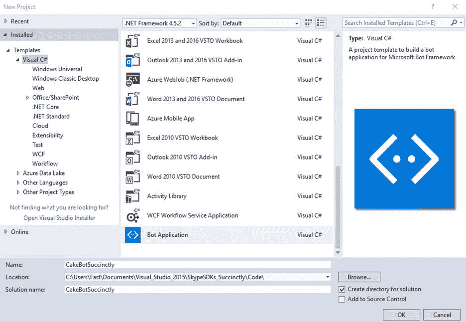

图 1-a:创建一个新的机器人应用项目

我决定简单地称这个新项目为 cakebotbot，但是你可以选择你想要的任何其他名字。

创建好项目后，让我们通过创建一些我们需要的文件来定义结构。

但首先，让我们解决任何遗漏的依赖性问题。打开**解决方案浏览器**，右键点击**参考**，然后选择**管理 NuGet 包**。我们这样做是因为可能并非所有必需的引用都是最新的。

在我的例子中，有几个参考文献处于这种情况(不是最新的)，如下图所示。

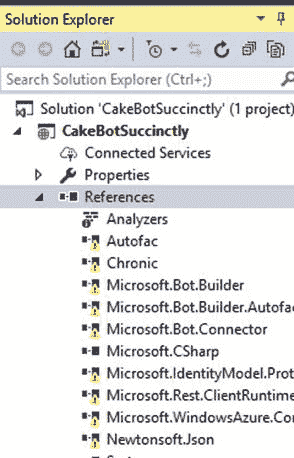

图 1-b:需要更新的项目参考

因此，让我们使用 NuGet 包管理器更新它们。点击屏幕右上角的**恢复**，如下图所示。

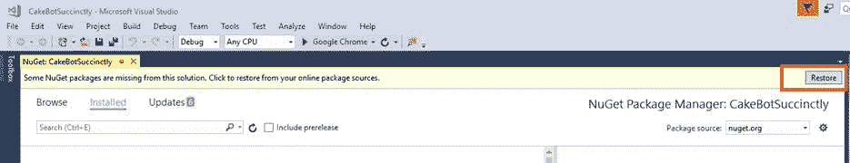

图 1-c:更新项目参考

点击**恢复**后，所有不是最新的引用都会被更新。这可以通过点击打开**对象浏览器**的**解决方案资源管理器**中的任何引用来确认。请注意，在点击其中一个后——在**对象浏览器**打开后不久——所有引用现在都显示为正确。

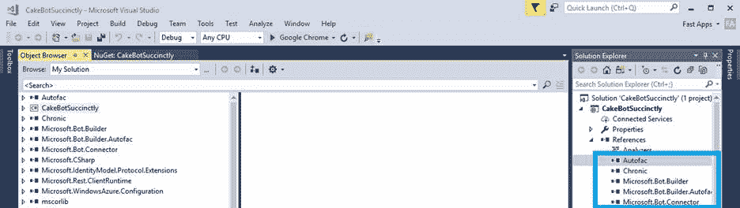

图 1-d:更新的项目参考

太棒了。我们现在已经更新了所有的项目参考。这样，让我们创建基本的项目结构，并添加创建 Skype bot 应用程序所需的文件。

## Bot 项目结构

当创建 Skype bot 或者一般来说，任何使用微软 bot 框架的 bot 时，没有关于如何组织将要使用的项目文件的特定规则。但是，可以就如何定义一个易于记忆和实现的易于遵循的项目结构提出一些建议。这就是我们现在要关注的。

Visual Studio 的 bot 模板在为我们的 Bot 定义基本项目结构方面做得非常好；然而，仍然缺少一些东西，这就是我们现在要补充的。

机器人模板定义的最重要的元素是**控制器**和**对话框**文件夹。

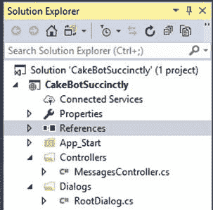

图 1-e:基本的 Bot 项目结构

**对话框**文件夹是我们创建机器人将要使用的对话框类的地方。我们还将创建一个**模型**文件夹，在这里我们将添加我们的机器人的数据模型和任何需要的[表单流](https://docs.microsoft.com/en-us/bot-framework/dotnet/bot-builder-dotnet-formflow)逻辑。

首先，让我们在**对话框**文件夹下创建一个*福利对话文件。为此，右键单击**对话框**文件夹，单击**添加**，然后单击**类**。我们将使用**welconerialog . cs**文件来保存我们的机器人用来问候用户的所有逻辑。*

接下来，让我们按照刚才创建*福利对话. cs* 的相同步骤创建一个*cakebodialog . cs*文件。我们的*cakebodialog . cs*文件将包含我们的机器人的对话逻辑。

先不说这个，让我们现在创建一个**模型**文件夹，它将包含 C#类，该类将包含机器人的 FormFlow 逻辑。我们可以通过右键单击机器人的名称来创建**模型**文件夹，在我的例子中，是*简单地说*，然后**添加** > **新文件夹**。

在**模型**下，创建一个新的 C#类文件——我称之为我的*糕点. cs*——我们将在机器人的大部分对话表单流逻辑、数据模型和数据验证中使用它。点击**对话框**文件夹，然后点击**添加**，点击**类**即可。

太好了——按照这些步骤，我们的机器人的项目结构现在应该如图 1-f 所示

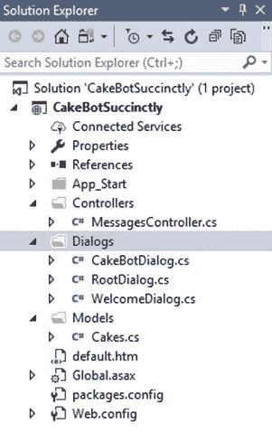

图 1-f:更新的 Bot 项目结构

*RootDialog.cs* 包含由 Bot Template 自动添加的对话逻辑，目前我们不会使用它；相反，我们将使用*cakebodialog . cs*。

有了这个结构，我们现在可以开始以有组织的方式向我们的机器人添加逻辑。

## 机器人的欢迎对话框

*welconicalog . cs*文件的目的是包含必要的机器人逻辑，以便启动机器人与用户的对话。让我们直接进入代码。这就是完整的*福利对话文件的样子。*

代码清单 1-a

```
  using System;
  using System.Threading.Tasks;
  using Microsoft.Bot.Builder.Dialogs;
  using Microsoft.Bot.Connector;
  using CakeBotSuccinctly.Models;

  namespace CakeBotSuccinctly.Dialogs
  {
      [Serializable]
      public class WelcomeDialog : IDialog
      {
          public async Task StartAsync(IDialogContext context)
          {
              // Str class defined in
  Models.Cakes.cs
              await context.PostAsync(Str.cStrHi);
              await Respond(context);

  context.Wait(MessageReceivedAsync);
          }

          private static async Task Respond(IDialogContext context)
          {
              var userName = string.Empty;

  context.UserData.TryGetValue(Str.cStrName,
  out userName);

              if (string.IsNullOrEmpty(userName))
              {
                  await context.PostAsync(Str.cStrNameQ);

  context.UserData.SetValue(Str.cStrGetName,
  true);
              }
              else
              {
                  await context.PostAsync(
                    string.Format(

  "Hi {0}, how may I help you today? You may order...", 

  userName));
                  await context.PostAsync(string.Join(",
  ", 
                     Str.CakeTypes));
              }
          }

          public async Task MessageReceivedAsync(IDialogContext context, 
            IAwaitable<IMessageActivity> argument)
          {
              var msg = await
  argument;
              string userName = string.Empty;
              bool getName = false;

  context.UserData.TryGetValue(Str.cStrName,
  out userName);

  context.UserData.TryGetValue(Str.cStrGetName,
  out getName);

              if (getName)
              {
                  userName
  = msg.Text;

  context.UserData.SetValue(Str.cStrName,
  userName);

  context.UserData.SetValue(Str.cStrGetName,
  false);
              }

              await Respond(context);

  context.Done(msg);
          }
      }
  }

```

现在让我们将这段代码分解成更小的块，以便理解发生了什么。我们需要做的第一件事是添加引用我们需要的名称空间的`using`语句。

代码清单 1-b:福利模拟类引用

```
  using System.Threading.Tasks;
  using Microsoft.Bot.Builder.Dialogs;
  using Microsoft.Bot.Connector;
  using CakeBotSuccinctly.Models;

```

我们需要的最重要的是`Microsoft.Bot.Builder.Dialogs` 和微软机器人连接器

因为*类位于我们的 Visual Studio 项目结构中的**对话框**文件夹下，所以我们的`WelcomeDialog`类默认属于`CakeBotSuccinctly.Dialogs`命名空间。*

非常重要的是，我们将`Serializable`属性设置为`WelcomeDialog`类，以便 bot 框架将其视为一个 bot 对话框，否则，当执行 Bot 时将产生运行时异常。

`WelcomeDialog`从`IDialog`接口继承也很重要。这需要类实现`StartAsync`方法，该方法触发该对话框的开始。

代码清单 1-c:StartAsync 方法

```
  {
      await context.PostAsync(Str.cStrHi);
      await Respond(context);

  context.Wait(MessageReceivedAsync);
  }

```

在`StartAsync`内，调用`context.PostAsync`，负责向用户发送`hi`字符串消息。这个字符串由常量`cStrHi`表示，属于 *Cakes.cs* 的`Str`类(后面会讲到)。`Str`类只是用来存储我们的机器人将要使用的字符串常量。另一种方法是使用。NET 资源存储技术。

然后，调用`Respond`方法(我们接下来会看到)，最后调用`context.Wait`，将`MessageReceivedAsync`方法作为回调函数传递。

让我们看看`Respond`方法内发生了什么。

代码清单 1-d:响应方法

```
  private static async Task Respond(IDialogContext context)
  {
      var userName = string.Empty;

  context.UserData.TryGetValue(Str.cStrName,
  out userName);

      if (string.IsNullOrEmpty(userName))
      {
          await context.PostAsync(Str.cStrNameQ);

  context.UserData.SetValue(Str.cStrGetName,
  true);
      }
      else
      {
          await context.PostAsync(
              string.Format(
              "Hi
  {0}, how may I help you today? You may order...", 
              userName));
          await context.PostAsync(string.Join(",
  ", Str.CakeTypes));
      }
  }

```

`WelcomeDialog`类逻辑背后的思想是机器人会问候用户，然后询问用户的名字。这样，通过提示包含用户姓名的下一个问题，可以开始友好的对话。

为了实现这一点，`Respond`方法将调用`context.UserData.TryGetValue`来检查用户名是否已经存储在机器人的状态中——这将表明用户名已经被提供(由用户输入)。存储在机器人状态中的值随后被分配给`userName`变量。

如果没有为`userName`变量赋值，那么机器人将通过请求用户名来响应——这是通过调用`context.PostAsync`来完成的——然后在机器人的状态中将名为`GetName`(由常数`Str.cStrGetName`表示)的标志设置为`true`。这样做是为了让机器人知道它已经向用户请求了名称。

相反，如果`userName`确实有一个赋值，这表明机器人知道用户是谁，并通过建议可以下什么订单来回复。这也可以通过在`else`条款中两次调用`context.PostAsync`来实现。

现在我们来看看`MessageReceivedAsync`方法的实现。

代码清单 1-e:消息接收同步方法

```
  public async Task MessageReceivedAsync(IDialogContext context, 
      IAwaitable<IMessageActivity> argument)
  {
      var msg = await
  argument;
      string userName = string.Empty;
      bool getName = false;

  context.UserData.TryGetValue(Str.cStrName,
  out userName);

  context.UserData.TryGetValue(Str.cStrGetName,
  out getName);

      if (getName)
      {
          userName =
  msg.Text;

  context.UserData.SetValue(Str.cStrName,
  userName);

  context.UserData.SetValue(Str.cStrGetName,
  false);
      }

      await Respond(context);
      context.Done(msg);
  }

```

基本上，这个方法检查机器人的状态，以便知道是否已经设置了`Name`和`GetName`变量。

如果`GetName`已被设置为`true`(这是通过`Respond`方法完成的)，则假设`msg.Text`中包含的用户响应是用户名(由用户在机器人请求后输入)。

在这种情况下，用户的名字使用`UserName`变量存储在机器人的状态中，`GetName`设置为`false`，这意味着用户的名字是已知的，机器人不需要询问。

最后，调用`Respond`方法，然后调用`context.Done`。所以，机器人的*福利对话*逻辑到此结束。它实际上非常简单，一点也不复杂。

我们现在将注意力转移到*cakebodialog . cs*上，在这里我们将学习一些新的令人兴奋的技术。

## 蛋糕机器人对话框

在我们的机器人的第一次迭代中，我们还不会使用任何人工智能功能——比如 [LUIS](https://www.luis.ai/) ，我们将在后面探索和研究。

因为我们的机器人没有复杂的(人工智能驱动的)方法来了解用户的意图(用户想要执行的动作)，我们必须以某种方式指示机器人应该使用哪个对话框来响应用户的请求。这是将在*cakebodialog . cs*中创建的逻辑的主要目标。

那么，机器人如何预测将用户意图路由到哪里——使用哪个对话框来响应给定的请求？这是一个好问题，没有一个答案。一种方法是使用`Switch`语句。那么，让我们看看如何实现这个对话路由逻辑。这种方法有时被称为基于规则逻辑。

我们需要做的第一件事是进入 Visual Studio 内的**解决方案资源管理器**，双击**cakebodialog . cs**文件打开它。在`CakeBotDialog`类中，添加以下只读变量，称为`dialog`，如下所示。

代码清单 1-f:启动 CakeBotDialog 类

```
  using Microsoft.Bot.Builder.Dialogs;

  namespace CakeBotSuccinctly.Dialogs
  {
      public class CakeBotDialog
      {
          public static readonly IDialog<string> dialog;
      }
  }

```

这个`dialog`将要创建一个链，它只是一系列被调用的对话框，一个接一个。

创建代码清单 1-f 中所示的代码片段后，我们要做的第一件事是编写`Chain.PostToChain`，它基本上是这样说的:从用户那里获取一条消息，并开始通过一个链运行它。然后，我们将从该消息中选择我们需要的内容，并使用`select`语句。

正如我们将在接下来的代码清单中看到的，我们真正关心的是`msg.Text`属性的值，所以这就是我们的`select`语句逻辑的基础。

我们需要从两个对话框中选择:一个是`WelcomeDialog`，另一个是`CakeBotDialog`。

目标是当用户键入单词“hi”时，我们能够实例化`WelcomeDialog`类，而当用户键入任何其他内容时，我们希望进入`CakeBotDialog`的 FormFlow 逻辑——这发生在对话已经开始并且机器人知道用户的名字之后。

为了实现这一点，我们需要使用`Switch`语句和正则表达式来搜索单词 **hi** 。我们先放入`Switch`语句，然后放入正则表达式，`RegexCase`。

`RegexCase`基本上是一个回调函数，将`context`和`text`传递给链中的下一个对话框，也就是`WelcomeDialog`。

`RegexCase`准备找一个正则表达式，检查是否能找到“hi”这个词(忽略大小写)，然后调用链中的下一个对话框。

为了继续`WelcomeDialog`，我们需要使用`Chain.ContinueWith`方法，该方法将采用两个变量:一个是我们想要链接和使用的对话框，另一个是对话框完成后将被调用的内容。

第一个变量将是`WelcomeDialog`的新实例，第二个变量将是一个名为`AfterWelcomeContinuation`的新方法，我们将很快创建它。

这解决了一个路由问题。代码清单 1-g 显示了代码现在的样子。

代码清单 1-g:继续 CakeBotDialog 类

```
  using Microsoft.Bot.Builder.Dialogs;
  using System.Text.RegularExpressions;

  namespace CakeBotSuccinctly.Dialogs
  {
      public class CakeBotDialog
      {
          public static readonly IDialog<string> dialog = 
              Chain.PostToChain()
              .Select(msg
  => msg.Text)
              .Switch(
              new RegexCase<IDialog<string>>(new Regex("^hi", 
                  RegexOptions.IgnoreCase), (context, text) =>
              {
                  return Chain.ContinueWith(new WelcomeDialog(), 

  AfterWelcomeContinuation);
              }
              )
      }
  }

```

请注意，这段代码在语法上还不正确——我们仍然缺少部分`Switch`语句细节，以及`AfterWelcomeContinuation`方法的实现。

这个想法是一步一步地向你展示正在做什么以及如何做，而不是一口气展示已经完成的`CakeBotDialog`课。

让我们探索另一条路由路径——当用户在对话开始后键入“hi”以外的任何内容时会发生什么。

另一条路径将使用缺省情况，即简单地回调到对话链的下一部分，为此我们将使用`ContinueWith`方法。

在`ContinueWith`中，我们将调用`FormDialog.FromForm`，传递一个`BuildForm`方法——稍后我们将在 *Cakes.cs* 文件中创建该方法。`BuildForm`方法将返回一个`FormDialog`对象。

到`FormDialog.FromForm`，我们还想传入选项`PromptInStart`，当我们进入这段代码时，它会自动启动我们的 FormFlow。这样做是因为，否则我们将不得不向机器人发送额外的消息，以便启动对话。

第二个`ContinueWith`接受对`AfterFormFlowContinuation`回调方法的调用。最后，在`Switch`之后，有一个对`Unwrap`和`PostToUser`方法的调用。

代码清单 1-h 显示了代码现在的样子，还没有实现`AfterWelcomeContinuation`和`AfterFormFlowContinuation`方法。

代码清单 1-h:继续 CakeBotDialog 类

```
  using CakeBotSuccinctly.Models;
  using Microsoft.Bot.Builder.Dialogs;
  using Microsoft.Bot.Builder.FormFlow;
  using System.Linq;
  using System.Text.RegularExpressions;
  using System.Threading.Tasks;

  namespace CakeBotSuccinctly.Dialogs
  {
      public class CakeBotDialog
      {
          public static readonly IDialog<string> dialog = 
              Chain.PostToChain()
              .Select(msg
  => msg.Text)
              .Switch(
              new RegexCase<IDialog<string>>(new Regex("^hi", 
              RegexOptions.IgnoreCase), (context, text) =>
              {
                  return Chain.ContinueWith(new WelcomeDialog(), 

  AfterWelcomeContinuation);
              }),
              new DefaultCase<string, IDialog<string>>((context, text) =>
              {
                  return 
                    Chain.ContinueWith(FormDialog.FromForm(Cakes.BuildForm, 
                    FormOptions.PromptInStart),
  AfterFormFlowContinuation);
              }))
              .Unwrap()

  .PostToUser();

          private async static Task<IDialog<string>> 

  AfterWelcomeContinuation(IBotContext context, 
              IAwaitable<object> item)
          {
          }

          private async static Task<IDialog<string>> 

  AfterFormFlowContinuation(IBotContext context, 
              IAwaitable<object> item)
          {
          }
      }
  }

```

完成后，让我们实现`AfterWelcomeContinuation`和`AfterFormFlowContinuation`方法。

代码清单 1-i:延续方法实现

```
  private async static Task<IDialog<string>> 

  AfterWelcomeContinuation(IBotContext context, 
      IAwaitable<object> item)
  {
      var tk = await item;

      string name = "User";

  context.UserData.TryGetValue("Name", out name);
      return Chain.Return("Type one..." + name);
  }

  private async static Task<IDialog<string>> 

  AfterFormFlowContinuation(IBotContext context, 
      IAwaitable<object> item)
  {
      var tk = await item;
      return Chain.Return("Thanks, you're awesome");
  }

```

`AfterWelcomeContinuation`方法向当前用户返回一条消息，要求输入——这样用户就可以指示所需的`CakeTypes`值:杯形蛋糕、三层蛋糕或奶油蛋糕。这些值将在后面的*蛋糕. cs* 中定义。

用户输入的`CakeTypes`值没有实际验证。

另一方面，`AfterFormFlowContinuation`方法只是在 FormFlow 流程完成后，向用户发回一条感谢消息。

`CakeBotDialog`类的完整源代码现在应该类似于代码清单 1-j

代码清单 1-j:cakebodialog 类

```
  using CakeBotSuccinctly.Models;
  using Microsoft.Bot.Builder.Dialogs;
  using Microsoft.Bot.Builder.FormFlow;
  using System.Linq;
  using System.Text.RegularExpressions;
  using System.Threading.Tasks;

  namespace CakeBotSuccinctly.Dialogs
  {
      public class CakeBotDialog
      {
          private const string cStrUser = "User";
          private const string cStrName = "Name";
          private const string cStrTypeOne = 
             "Type one...";

          public static readonly IDialog<string> dialog = 
              Chain.PostToChain()
              .Select(msg
  => msg.Text)
              .Switch(
              new RegexCase<IDialog<string>>(new Regex("^hi", 
              RegexOptions.IgnoreCase), (context, text) =>
              {
                  return Chain.ContinueWith(new WelcomeDialog(), 

  AfterWelcomeContinuation);
              }),
              new DefaultCase<string, IDialog<string>>((context, text) =>
              {
                  return 
                  Chain.ContinueWith(FormDialog.FromForm(Cakes.BuildForm, 
                  FormOptions.PromptInStart),
  AfterFormFlowContinuation);
              }))
              .Unwrap()

  .PostToUser();

          private async static Task<IDialog<string>> 

  AfterWelcomeContinuation(IBotContext context, 
              IAwaitable<object> item)
          {
              var tk = await item;
              string name = cStrUser;

  context.UserData.TryGetValue(cStrName, out name);
              return Chain.Return($"{cStrTypeOne} {name}");
          }

          private async static Task<IDialog<string>> 

  AfterFormFlowContinuation(IBotContext context, 
              IAwaitable<object> item)
          {
              var tk = await item;
              return Chain.Return("Thanks, you're awesome");
          }
      }
  }

```

如您所见，唯一的区别是我们在类级别创建了一些字符串常量，而不是直接在`AfterWelcomeContinuation`方法内部使用那些字符串；其余的保持不变。

所以，我们现在结束了我们的`CakeBotDialog`课。让我们在我们的*消息控制器. cs* 文件中连线。

转到**解决方案浏览器**并打开**控制器**文件夹下的*消息控制器. cs* 文件。`MessagesController`类的`Post`方法看起来像代码清单 1-k

代码清单 1-k:messages controller 类的“开箱即用”发布方法

```
  public async Task<HttpResponseMessage> Post([FromBody]Activity activity)
  {
      if (activity.Type == ActivityTypes.Message)
      {
          await Conversation.SendAsync(activity, () => new 
              Dialogs.RootDialog());
      }
      else
      {

  HandleSystemMessage(activity);
      }

      var response = Request.CreateResponse(HttpStatusCode.OK);
      return response;
  }

```

`Post`方法是我们的机器人接收任何传入请求的地方。

我们暂时不会使用`RootDialog`类，因为我们想要连接`WelcomeDialog`和`CakeBotDialog`类，我们需要做的是将`new Dialogs.RootDialog()`改为`Dialogs.CakeBotDialog.dialog`。

所以让我们开始吧。`Post`方法现在应该如下所示。

代码清单 1-1:消息控制器类的“连接”发布方法

```
  public async Task<HttpResponseMessage> Post([FromBody]Activity activity)
  {
      if (activity.Type == ActivityTypes.Message)
      {
          await Conversation.SendAsync(activity, () => 
              Dialogs.CakeBotDialog.dialog);
      }
      else
      {

  HandleSystemMessage(activity);
      }

      var response = Request.CreateResponse(HttpStatusCode.OK);
      return response;
  }

```

随着事情的发展，我们现在可以将注意力集中在表单流逻辑上。接下来我们要做的是实现 *Cakes.cs* ，它也将包含我们的机器人模型。

## 机器人的形态流程和模型

**模型**文件夹下的 *Cakes.cs* 文件是我们创建机器人的 FormFlow 逻辑和模型的地方。

让我们从创建我们的机器人对话将遵循的表单流开始。为此，让我们创建一个`Cakes` *可序列化的*类，它将包含以下逻辑。

代码清单 1-m:流类的蛋糕

```
  [Serializable]
  public class Cakes
  {
      [Prompt(Str.cStrQuantity)]
      public string Quantity;

      [Prompt(Str.cStrOptions)]
      public string When;

      public static IForm<Cakes> BuildForm()
      {
          OnCompletionAsyncDelegate<Cakes> 
              processOrder
  = async (context, state) =>
          {

  context.UserData.SetValue(Str.cStrGetName,
  true);

  context.UserData.SetValue(Str.cStrName,
  string.Empty);

              await context.PostAsync(
                  $"{Str.cStrProcessingReq} {Validate.DeliverType}");
          };

          return new FormBuilder<Cakes>()
              .Field(nameof(Quantity))

              .Message(Str.cStrWhen)
              .Field(nameof(When),
              validate: async (state, value) =>
              {
                  return await Task.Run(() =>
                  {
                      string v = value.ToString();

                      return Validate.ValidateType

  (state, value.ToString(), Str.DeliverTypes);
                  });
              })

  .OnCompletion(processOrder)
              .Build();
      }
  }

```

让我们看看这里发生了什么。`Cakes`类包含两个问题，我们的机器人会以顺序的方式问用户。

第一个问题由变量`Quantity`表示，提示用户指出他或她想要点多少蛋糕。

第二个问题由变量`When`表示，提示用户指定他或她希望订单何时交付——首选交付选项。

这两个都是问题，因为它们有一个提示属性，指示要问的问题，这是由两个常数指定的:`Str.cStrQuantity`和`Str.cStrOptions`，我们稍后将声明这两个常数。

`Cakes`类的第三个也是最重要的部分是`BuildForm`方法。为了理解它的作用，让我们把它分成两部分。

`BuildForm`法的第一部分是`OnCompletionAsyncDelegate`。当用户回答了这两个问题时，这将在表单流的末尾执行。你可以把它想象成一个蛋糕订单提交后执行的事件。

`BuildForm`法的第二部分是`FormBuilder`链。这就提出了第一个问题(没有进行验证)。当用户回答后，会提出第二个问题，然后进行验证，以检查用户对第二个问题的回答是否有效。如果是，调用`OnCompletion(processOrder)`时将执行`OnCompletionAsyncDelegate`。

需要注意的是，第二个问题的验证过程是通过匿名的`async`函数执行的，该函数接收 FormFlow 的当前`state`和用户为第二个问题输入的值。

问题输入的完全验证不能在匿名`async`函数内部完成，这没有技术上的原因。然而，我认为将特定的验证逻辑放在一个专门用于此目的的单独的类中更好、更干净，我们称之为`Validate`。

因为`Validate`类被绑定在机器人的 FormFlow 逻辑中——换句话说，绑定到`Cakes`类逻辑中——我们将在同一个 *Cakes.cs* 文件中声明`Validate`类，所以两者并行。

## 元组

在我们为`Validate`类编写代码之前，我将利用 C# 7 中一个名为[元组](https://blogs.msdn.microsoft.com/dotnet/2017/03/09/new-features-in-c-7-0/)的改进特性，该特性现在将派上用场。为了使用元组，我们首先需要向我们的 bot 项目添加一个 NuGet 包，它是从 Visual Studio 外部获得的。

为一个几乎没用的构造添加一个外部依赖并不是非常令人兴奋。然而，对于我们的 bot 示例，具有返回多个值的特定验证是有用的——因此在这种情况下，这是展示这个 C#特性的好机会——即使它对于 Bot 框架来说不是必需的。

打开解决方案资源管理器，右键单击**引用**，选择**管理 NuGet 包**。

一旦“获取软件包管理器”窗口打开，选择**浏览**项，在搜索中输入**系统。ValueTuple** 。然后，选择该包，点击**安装**。

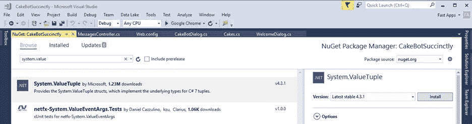

图 1-g:系统。值元组否获取包

当包安装完成后，我们可以编写`Validate`类代码，这就是我们接下来要做的。

## 验证类

一个常见的良好实践是在我们的代码中分离关注点。实现这一点的一种方法是让机器人的 FormFlow 验证由它自己的类来管理——这就是我们现在要关注的。这是属于`CakeBotSuccinctly.Models`命名空间的`Validate`类的完整源代码。

代码清单 1-n:验证类

```
  public class Validate
  {
      public static string DeliverType = string.Empty;

      public static (bool
  v, string t) TypeExists(string c, string[]
  types)
      {
          bool v = false;
          string t = string.Empty;

          foreach (string ct in
  types)
          {
              if (ct.ToLower().Contains(c.ToLower()))
              {
                  v = true;
                  t = ct;

                  break;
              }
          }

          return (v, t);
      }

      public static ValidateResult ValidateType(Cakes
  state, string value, 
          string[] types)
      {
          ValidateResult result = new ValidateResult { IsValid = false, 
              Value = string.Empty };

          var res = TypeExists(value, types);

          string r = $"{Str.cStrDeliverBy} {res.t}";
          DeliverType =
  res.t;

          return (res.v) ?
              new ValidateResult { IsValid = true, Value = res.t, Feedback 
                  = res.t
  } : result;
      }
  }

```

让我们试着了解一下发生了什么。`ValidateType`方法返回一个`ValidateResult`对象；默认情况下，它的`IsValid`属性设置为`false`，它的`Value`属性设置为空的`string`，这意味着找不到(验证)用户的输入。

`ValidateType`方法所做的只是调用`TypeExists`方法，该方法返回一个元组，该元组包括一个布尔变量(设置为`true`(如果找到一个`DeliverTypes`值)和对应于用户输入的实际`DeliverTypes`值，该值被分配给静态`DeliverType`变量。

然后在`Cakes`类的`OnCompletionAsyncDelegate`内使用`DeliverType`值。

`TypeExists`方法基本上循环通过现有的`DeliverTypes`(由`string`数组`types`变量表示)并检查用户的输入(由`string`变量`c`表示)是否匹配任何一个`DeliverTypes`。

如果找到匹配，元组的`v`变量被设置为`true`，其`t`变量被设置为匹配的`DeliverTypes`值。

注意`ValidateType`方法只在 FormFlow*——*的第二个问题“你想什么时候送蛋糕？”—已执行。

`Validate`课到此结束。为了最终确定我们的 *Cakes.cs* 文件，让我们实现对应于`Str`类的剩余部分——它包含了`DeliverTypes`值和其他在整个机器人中使用的有用常数。

## Str 类

机器人的所有常量都在`Str`类中实现，这就是这个类所做的一切。代码如下所示。

清单 1-o:字符串类

```
  public class Str
  {
      public const string cStrHi = "Hi,
  I'm CakeBot";
      public const string cStrNameQ = "What is your name?";
      public const string cStrName = "Name";
      public const string cStrGetName = "GetName";

      public const string cStrWhen = 
         "When would you like the cake
  delivered?";
      public const string cStrProcessingReq = 
         "Thanks for using our
  service. Delivery has been scheduled for: ";

      public const string cStrDontUnderstand = 
         "I'm sorry I don't understand
  what you mean.";

      public const string cStrQuantity = "How many?";
      public const string cStrOptions = "Now or Tomorrow";
      public const string cStrDeliverBy = "Deliver by: ";

      public static string[] DeliverTypes = 
         new string[] { "Now", "Tomorrow" };
      public static string[] CakeTypes = 
         new string[] { "Cup Cake", "Triple
  Layer Cake", "Cream Cake" };

      public static string cStrNoPush = "NO_PUSH";
      public static string cStrTemplateType = "template";
      public static string cStrPayloadTypeGeneric = "generic";
  }

```

`Str`、`Validate`和`Cakes`类都属于`CakeBotSuccinctly.Models`命名空间。

这就是我们机器人的代码。但是在我们运行它之前，请确保您安装了[机器人框架模拟器](https://docs.microsoft.com/en-us/bot-framework/debug-bots-emulator)，可以在这里[找到](https://github.com/Microsoft/BotFramework-Emulator/releases)。您可能会收到防火墙警告。

请记住，完整的源代码可在本章开头下载。

## 运行我们的机器人

安装 Bot 框架模拟器后，打开它并运行您的 Visual Studio 解决方案。点击**运行**，在我这里默认设置为使用谷歌 Chrome。

第一次运行时，您将收到如何向微软注册您的机器人的说明，这需要一个具有 HTTPS 协议功能的网络服务器或端点——这是一个相对较新的要求，截止到 2016 年 6 月 23 日(参见[此链接](https://github.com/Microsoft/BotBuilder/issues/530))。

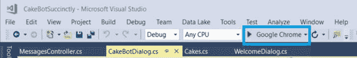

图 1-h:Visual Studio 中的运行按钮

一旦我们的应用程序和模拟器运行，让我们开始一个非常基本的对话，用一个 **hi** 消息问候机器人——这触发了机器人的`WelcomeDialog` 类逻辑。

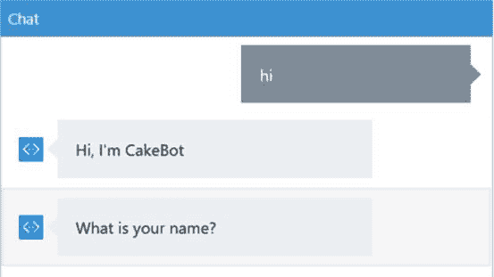

图 1-i:使用模拟器开始与我们的机器人对话

根据您安装的 Bot 仿真器的版本，屏幕可能会稍微偏离图 1-i 中的屏幕截图。在我的例子中，我使用的是 Bot 仿真器版本 3.0.0.59。

请注意，因为我们已经输入了单词 **hi** ，所以*cakebodialog . cs*中的`RegexCase`已经触发了`WelcomeDialog`对象的执行，这就是为什么机器人要问我们的名字。

虽然这并不是非常复杂，因为我们需要通过键入单词 **hi** 来正确地开始对话，但这是一个很好的例子，说明我们如何使用`Chain.PostToChain`和`Chain.ContinueWith`方法来开始对话，以及我们如何将对话与 FormFlow 结合起来。

当我们探索 LUIS 时，我们将通过能够使用其他单词来开始对话来改进这一点。

让我们通过提供我们的名字和回答任何其他问题来继续与我们的机器人对话。

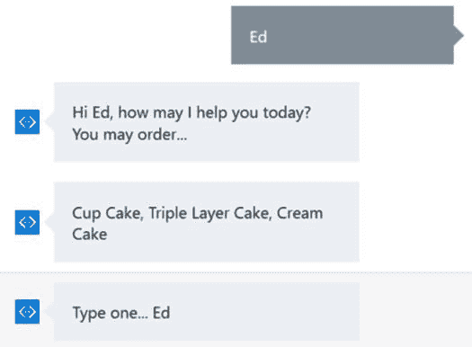

图 1-j:使用模拟器继续与我们的机器人对话

我们可以在图 1-j 中看到，来自机器人的前两个响应对应于包含在*福利对话*的`Respond`方法中的逻辑。第三个响应对应于执行包含在*cakebodialog . cs*中的`AfterWelcomeContinuation`方法。

让我们给机器人一个回应。就我而言，我会输入**三层**。请注意，这个值根本没有被验证——我们可能只需要键入任何内容，但是我们不要这样做。

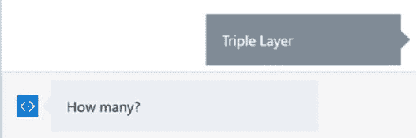

图 1-k:使用模拟器继续与我们的机器人对话

在指出我对机器人上一个问题的答案后，请注意 FormFlow 对话框是如何触发的，我们被问及想要多少蛋糕。

所以在这个阶段，*福利对话逻辑*的执行已经完成，并且控制已经被传递给 FormFlow 逻辑——这是由包含在*cakebodialog . cs*的`DefaultCase`部分中的逻辑的执行所触发的。

接下来，我将回答 FormFlow 的第一个问题。我会注明 **2** 作为我的回答。

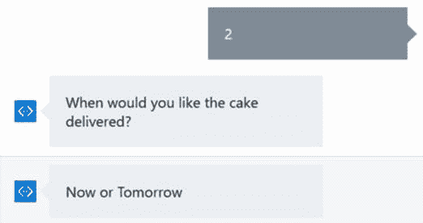

图 1-1:使用模拟器继续与我们的机器人对话

请注意机器人如何请求对表单流的第二个问题进行输入，并提供两个可能的答案选项——可用的`DeliverTypes: Now`或`Tomorrow`，这将由 *Cakes.cs* 中的`Validate`类进行验证。

我会指出这个问题的答案，在我的例子中是**现在是**。一旦我这样做了，`Cakes`类的`OnCompletionAsyncDelegate`就被执行了，我从机器人那里得到了以下输出。

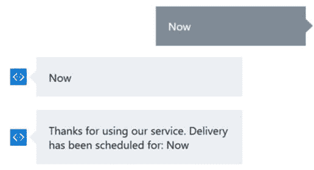

图 1-m:使用模拟器继续与我们的机器人对话

最后，还有最后一位将被执行:`CakeBotDialog`类的`AfterFormFlowContinuation`方法。

最终输出如下所示:

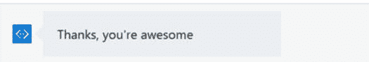

图 1-n:我们机器人的最终回应

通过下面这个小而有趣的对话，我们已经看到了到目前为止我们编写的各种类的所有部分是如何很好地结合在一起的。

对话在*福利对话*和包含在`Cakes`类中的表单流逻辑之间流动。

## 总结

在这一章中，我们已经了解了如何构建一个超越 FormFlow 的基本机器人——这主要是*微软机器人框架简洁地*的范围。我们还设法将对话框和表单流组合成一个单一的代码库。

我们还看到了如何使用链接来触发正确的流:简单的对话框或表单流对话框——这取决于用户提供的输入——并看到了如何通过运行我们的机器人将所有这些很好地联系在一起。

考虑了关注点的分离，以便保持一个易于维护和更新的简洁代码库。

尽管有这样的实现，我们注意到我们在如何发起对话方面有点受限，因为我们必须从键入“hi”开始。

在下一章中，我们将开始探索 LUIS，它将赋予我们的应用程序超能力，这样我们就可以用额外的单词开始对话，并在整个对话中使用其他变体——而不需要使用任何`RegexCase`或`Switch`语句。

别忘了本章的完整源代码可以在[这里](https://1drv.ms/u/s!AgBX7xIEoO8BkOx0u9jNAJENq_NSTA)找到。更多精彩的东西就在前方！