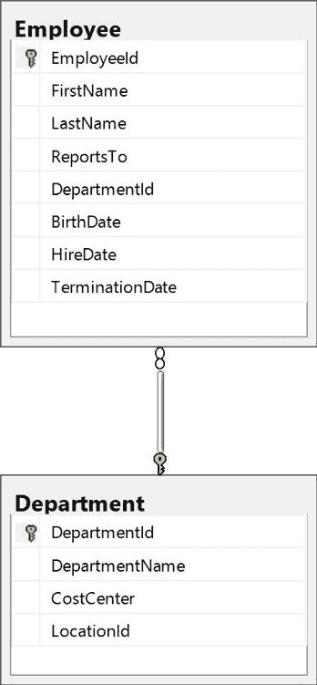
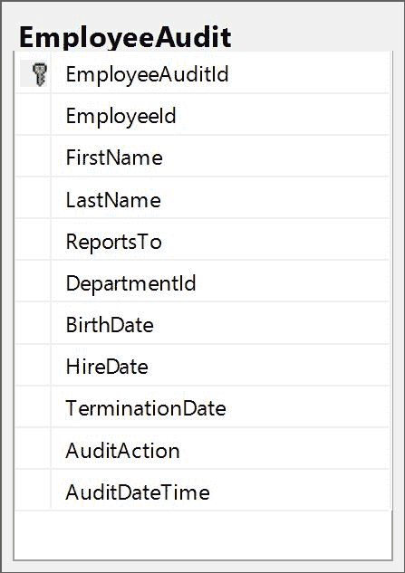
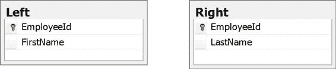

CRUD 是一个常见的首字母缩略词，指的是基本数据操作语言语句`CREATE`、`READ`、`UPDATE`和`DELETE`；或者`INSERT`、`SELECT`、`UPDATE`和`DELETE`(但 ISUD 听起来不那么酷)。

我们将依次研究这些类型的语句。在本章中，我们将讨论使用这些语句的基础知识。第 3 章将使用这些基本语句介绍一些更高级的场景。这本书的其余部分将集中于阅读或选择数据相关的所有变化和复杂性。毕竟，我们是通过`SELECT`语句来切割数据的。

对于我们对基本 CRUD 语句的讨论，我们将经常使用图 2-1 所示的简单数据模型来关联员工和部门:



图 2-1:我们简单的数据模型

生成这些表的 SQL 如代码清单 2-1 所示。

代码清单 2-1:创建员工和部门表

```sql
  CREATE TABLE [dbo].[Employee](
        [EmployeeId]
  [int] IDENTITY(1,1) NOT NULL,
        [FirstName]
  [varchar](50)
  NOT NULL,
        [LastName]
  [varchar](50)
  NOT NULL,
        [ReportsTo]
  [int] NULL,
        [DepartmentId]
  [int] NULL,
        [BirthDate]
  [datetime] NULL,
        [HireDate]
  [datetime] NOT NULL,
        [TerminationDate]
  [datetime] NULL,
   CONSTRAINT [PK_Employee] PRIMARY
  KEY CLUSTERED ([EmployeeId] ASC)
  )

  CREATE TABLE [dbo].[Department](
        [DepartmentId]
  [int] IDENTITY(1,1) NOT NULL,
        [DepartmentName]
  [varchar](50)
  NULL,
        [CostCenter]
  [varchar](50)
  NULL,
        [LocationId]
  [int] NULL,
   CONSTRAINT [PK_Department] PRIMARY
  KEY CLUSTERED ([DepartmentId] ASC)
  ) 
  ALTER TABLE [dbo].[Employee]  WITH CHECK ADD  CONSTRAINT [FK_Employee_Department] FOREIGN KEY([DepartmentId])
  REFERENCES [dbo].[Department] ([DepartmentId])

```

我们通过`INSERT`语句将数据输入数据库。一般来说，这些将在应用程序代码中用业务逻辑来处理。我们通常不会在数据库中进行大量的临时插入。应用程序中的业务逻辑可能处理引用完整性和其他可能未在数据库中完全定义的约束。您的应用程序中可能还有审计和跟踪机制，这些机制不应该被忽略。

业务应用程序实际上是控制数据库访问的 SQL 级防火墙。业务逻辑可以实现无法用数据库约束轻松定义的规则，并且可以定义可能随时间或不同业务领域而变化的流程流，这使得将它们嵌入数据库结构不切实际。不管什么原因，您可能会有需要遵循的规则，但是这些规则只在应用程序逻辑中实现。

|  | 提示:理想情况下，所有这些约束都会被烘焙到数据库中。实际上，会有许多约束，数据库对此一无所知，也无法帮助确保它们得到遵守。 |

如果你发现一个`INSERT`语句需要定期运行，那么将它适当地集成到你的应用程序代码中是符合你的最大利益的，而不是依赖于每次有人需要手动运行它的时候都把它做对。

把所有的警告都放在一边，让我们看看基本的`INSERT`语句；我们将使用`Employee`表。

`INSERT`语句的一般形式是:

代码清单 2-2:基本的 INSERT 语句

```sql
  INSERT INTO dbo.Employee

  ( FirstName ,

  LastName ,

  ReportsTo ,

  DepartmentId ,

  BirthDate ,

  HireDate ,

  TerminationDate )
  VALUES 
  ( '' , -- FirstName -
  varchar(50)
            '' , -- LastName - varchar(50)
            0 , -- ReportsTo - int
            1 , -- DepartmentId - int
            GETDATE() , -- BirthDate - datetime
            GETDATE() , -- HireDate - datetime
            GETDATE()  -- TerminationDate - datetime
            )

```

这里要做的关键是确保`INSERT`子句中的列顺序与`VALUES`子句中的列顺序相匹配。如果你跳过了`INSERT`子句中的一栏，你也必须跳过`VALUES`子句中的一栏。如果跳过某一列，则不会在该列中插入值。

|  | 注意:因为我们已经定义了从雇员表到部门表的外键，所以我们需要给出一个有效的部门值。我们可以将 DepartmentId 留空(使用空值)，它仍然会传递引用约束，但是如果我们为它赋值，它必须与 Department 表中的值匹配。如果我们想确保始终获得部门的有效值，并且该值不为空，我们需要将该列标记为非空，并设置外键关系。 |

如果我们不指定列的值，它将获得该列的默认值。如果没有为列指定默认值，并且在插入过程中没有指定值，则该列将获得空值。

|  | 注意:空值不同于留空。对于像“名字”和“姓氏”这样的文本字段，您可以将值指定为“”以将其留空，但它仍然有一个值。但是如果您没有指定值，并且没有与该列相关联的默认值，则该值将默认为空。 |

现在让我们来看看`Employee`表定义的一些细节。我们可能有一个默认部门，新员工可以加入其中。如果是这种情况，并且我们没有指定部门，新插入的记录将与该部门相关联。如果为具有默认值的列指定了值，则指定的值将优先。

要将`DepartmentId`列的默认值设置为 1，我们可以这样定义该列:

代码清单 2-3:指定默认部门

```sql
  ALTER TABLE dbo.Employee ADD DEFAULT (1) FOR DepartmentId,

```

您也可以将`HireDate`默认为今天的日期:

代码清单 2-4:指定默认的雇佣日期

```sql
  ALTER TABLE dbo.Employee  ADD DEFAULT  (GETDATE()) FOR HireDate

```

|  | 提示:这里需要记住的重要一点是，即使在 INSERT 语句中没有指定值，如果有一个默认值与该列相关联，新记录也可能有一个值。 |

您可能已经注意到，在我们的标准语法中，我们没有提到`EmployeeId`列。这是默认值的特殊情况。将表的主键与标识列相关联是常见的最佳实践。这就是 SQL Server 处理跟踪有效值、下一个值等的方式。在处理身份列时，我们需要记住几个重要的规则:

*   当列作为初始表创建的一部分被创建时，或者当列通过添加新列而改变时，可以将`identity`属性分配给列。
*   一旦添加了一列，就不能通过修改来添加`identity`属性；它需要在创建表或添加列时添加。
*   每个表只能有一个标识列。
*   您不能显式设置标识列的值。我们马上就会看到这个例外。
*   您也不能更新标识列的值。

这有助于确保此表和任何依赖于它的表的数据完整性，但会使从备用源导入数据变得更加困难，例如将数据从一个环境复制到另一个环境。

|  | 注意:数据库管理员已经开发了复杂的策略来处理复制环境中表上的标识列。在大多数情况下，除非您是数据库管理员，否则您不会受到这些问题的影响。我们只需要意识到这些策略中的许多会导致身份价值的差距。 |

由于各种原因，您可能会发现有合法的需要将特定的值插入到标识列中。尽管到目前为止我们已经说过了，但事实证明您可以直接更改该值，但是您必须跳过一些障碍才能做到这一点，并且您需要小心，因为您很容易危及数据完整性或创建未来的主键违规。

代码清单 2-5:在插入过程中重写标识列

```sql
  SET IDENTITY_INSERT
  dbo.Employee ON;

  INSERT  INTO dbo.Employee

  ( EmployeeId,
  FirstName, LastName )
  VALUES 
  ( 200, 'Nick', 'Harrison' );

  SET IDENTITY_INSERT
  dbo.Employee OFF;

```

|  | 提示:请务必在完成后立即明确打开标识插入。否则，您可能会危及您的数据完整性。 |

可以定义约束来限制列中的值。这有助于确保数据的完整性，但是如果不遵守约束中定义的规则，也会在插入过程中造成混乱。

让我们重新访问`Employee`表，并添加一个约束，说明`TerminationDate`必须在`HireDate`之后。

代码清单 2-6:约束我们何时可以解雇员工

```sql
  ALTER TABLE dbo.Employee  ADD CONSTRAINT ck_termination_date 
  CHECK
  ( TerminationDate >
  HireDate);

```

现在，如果我们用标准语法尝试前面看到的原始`INSERT`语句，我们将会得到一个错误，因为员工不能同时被雇用和解雇。

代码清单 2-7:违反约束的 INSERT 语句

```sql
  INSERT INTO dbo.Employee

  ( FirstName ,

  LastName ,

  ReportsTo ,

  DepartmentId ,

  BirthDate ,

  HireDate ,

  TerminationDate )
  VALUES 
  ( 'New' , -- FirstName -
  varchar(50)
            'Employee' , -- LastName - varchar(50)
            0 , -- ReportsTo - int
            0 , -- DepartmentId - int
            GETDATE() , -- BirthDate - datetime
            GETDATE() , -- HireDate - datetime
            GETDATE()  -- TerminationDate - datetime
            )

  Msg 547, Level
  16, State 0, Line 1
  The INSERT
  statement conflicted with the CHECK constraint
  "ck_termination_date". The conflict occurred in database
  "Playground", table "dbo.Employee".
  The statement
  has been terminated.

```

|  | 提示:如果您正在设计数据库，请尽可能定义所有合理的约束。这将确保验证规则不会被轻易违反。如果您使用的是预先存在的数据模型，请注意，许多约束将会丢失，因此您可能必须更加努力地处理基于应用程序的业务逻辑，以确保数据完整性。 |

触发器是在数据库中触发的逻辑，无需您的任何直接干预。它们就像数据库的事件。例如，我们可以有一个插入触发器，每当记录被插入到该表中时，就会调用该触发器。这可用于进一步支持引用完整性，设置对关键表更改的审核，或在数据库中实施业务规则。

|  | 提示:通过数据库中的触发器强制执行业务规则意味着业务规则不能被绕过，但是很容易被忽略。当规则改变时，您可能很难记住规则是在触发器中实现的，因为它们很容易被忽略。此外，如果多个应用程序使用同一个数据库，它们可能不会都同意这些业务规则，因此它们的实现最好在应用程序代码中实现。 |

回顾我们一直使用的`Employee`表，我们可能想要定义一个`EmployeeAudit`表，每当有人修改该表中的数据时，该表都会进行跟踪。触发器可以用来轻松处理这种跟踪。

首先创建一个名为`EmployeeAudit`的新表，其列与`Employee`表相同。对于这个新表，`EmployeeId`将不是主键。它也不会是一个身份列。相反，我们将添加一个名为`EmployeeAuditId`的新列，它将是主键和标识列。让我们也为`AuditAction`和`AuditDate`增加几个新的栏目。



图 2- 2:一个简单的审计表

|  | 提示:即使我们希望在 Employee 表中定义尽可能多的约束，我们也希望禁用 Audit 表中的大多数约束。通过这种方式，我们可以记录 Employee 表中发生的所有事情，即使约束被暂时禁用。 |

代码清单 2-8:创建雇员审计表

```sql
  CREATE TABLE [dbo].[EmployeeAudit](

  [EmployeeAuditId] [int] IDENTITY(1,1) NOT NULL,

  [EmployeeId] [int] NOT NULL,
     [FirstName]
  [varchar](50)
  NOT NULL,
     [LastName]
  [varchar](50)
  NOT NULL,
     [ReportsTo]
  [int] NULL,

  [DepartmentId] [int] NULL,
     [BirthDate]
  [datetime] NULL,
     [HireDate]
  [datetime] NOT NULL,

  [TerminationDate] [datetime] NULL,
     [AuditAction]
  [char](1) NOT NULL,
     [AuditDateTime]
  [datetime] NOT NULL,
     CONSTRAINT [PK_EmployeeAudit_1] PRIMARY KEY CLUSTERED ([EmployeeAuditId]
  ASC)
  ) 

```

现在我们已经准备好了`Audit`表，让我们看看`Employee`表的插入触发器可能是什么样子的。

代码清单 2-9:审核雇员表插入的触发器

```sql
  CREATE TRIGGER
  trEmployeeInsert ON dbo.Employee
    FOR INSERT
  AS
      INSERT  INTO dbo.EmployeeAudit

  ( EmployeeId ,

  FirstName ,

  LastName ,

  ReportsTo ,

  DepartmentId ,

  BirthDate ,
                HireDate
  ,

  TerminationDate ,

  AuditAction ,

  AuditDateTime )
              SELECT  Inserted.EmployeeId
  ,

  Inserted.FirstName ,

  Inserted.LastName ,

  Inserted.ReportsTo ,

  Inserted.DepartmentId ,

  Inserted.BirthDate ,

  Inserted.HireDate ,

  Inserted.TerminationDate,

  'I' ,  -- I is for insert

  GETDATE()
              FROM    Inserted;  

```

|  | 注意:我们将在下一章更全面地探讨这个 insert 语句的语法。当插入操作向表中添加多条记录时，可以使用 SQL INSERT 语句和 SELECT 语句来支持日志记录 |

`Trigger`定义中提到的`Inserted`表是 SQL Server 为我们维护的纯内存表。我们不能通过添加索引或操作任何数据来修改这个表，但是它可以非常有助于跟踪插入的内容并采取适当的措施。

现在，当我们在`Employee`表中插入一条记录时，我们将获得一份在`EmployeeAudit`表中插入的记录的副本。

代码清单 2-10:插入触发器可能会改变受 Insert 语句影响的行数

```sql
  INSERT INTO dbo.Employee

  ( FirstName ,

  LastName ,

  ReportsTo ,

  DepartmentId ,

  BirthDate ,

  HireDate ,

  TerminationDate )
  VALUES 
  ( 'New' , -- FirstName -
  varchar(50)
            'Employee' , -- LastName - varchar(50)
            0 , -- ReportsTo - int
           1 , -- DepartmentId - int
            GETDATE() , -- BirthDate - datetime
            GETDATE() , -- HireDate - datetime
            GETDATE() + 60  -- TerminationDate
  - datetime
            )

  (1 row(s)
  affected)

  (1 row(s)
  affected)

```

如果在 Management Studio 中运行此命令，您将看到两行受到影响:`Employee`表中的新记录和`EmployeeAudit`表中的新记录。

|  | 注意:使用触发器，一条 INSERT 语句可能会影响多条记录，可能会影响不同但相关的表中的记录。 |

现在让我们看看如何在触发器中实施业务规则。假设你的公司有一条规定，所有员工必须年满 18 岁。您可能会使用这样的触发器来实现此规则:

代码清单 2-11:定义一个触发器来执行业务逻辑

```sql
  CREATE TRIGGER
  trEmployeeInsertVerifyAge ON dbo.Employee
      AFTER INSERT
  AS
      IF EXISTS ( SELECT  *

  FROM    Inserted

  WHERE   DATEDIFF(YEAR, Inserted.BirthDate, GETDATE()) < 18 )
          BEGIN
              RAISERROR ('New hires must be at least 18 years old', 16, 10);
              ROLLBACK TRANSACTION;
              RETURN;
          END;

```

现在如果我们运行`INSERT`语句，我们会得到一个错误，抱怨新员工的年龄。

代码清单 2-12:插入触发器定义了不可绕过的业务规则

```sql
  INSERT INTO dbo.Employee

  ( FirstName ,

  LastName ,

  ReportsTo ,

  DepartmentId ,

  BirthDate ,

  HireDate ,

  TerminationDate )
  VALUES 
  ( 'New' , -- FirstName -
  varchar(50)
            'Employee' , -- LastName - varchar(50)
            0 , -- ReportsTo - int
           1 , -- DepartmentId - int
            GETDATE() , -- BirthDate - datetime
            GETDATE() , -- HireDate - datetime
            GETDATE() + 60  -- TerminationDate
  - datetime
            )

  Msg 50000,
  Level 16, State 10, Procedure trEmployeeInsertVerifyAge, Line 8
  New hires must
  be at least 18 years old
  Msg 3609,
  Level 16, State 1, Line 1
  The transaction
  ended in the trigger. The batch has been aborted.

```

因为我们回滚了事务，所以在`Employee`或`EmployeeAudit`表中都不会有记录。

|  | 注意:这不是验证员工年龄的好方法。在许多情况下，这个简单的测试会错误地失败，也会错误地通过。确定年龄有点复杂，但为了展示触发器，让我们保持简单。 |

我们从数据库中读取数据`SELECT`语句。最简单的形式是:

代码清单 2-13:基本的 SELECT 语句

```sql
  SELECT fields 
  FROM table
  WHERE conditions ARE true 

```

我们将在这里看到这种模式的一些变化，然后用这本书的剩余部分来探索你可能想要看到的所有变化。

只要我们只考虑单个表，查询就保持相对简单。

代码清单 2-14:从单个表中查询

```sql
  SELECT  EmployeeId ,

  FirstName ,

  LastName ,

  ReportsTo ,

  DepartmentId ,

  BirthDate ,

  HireDate ,

  TerminationDate
  FROM    dbo.Employee
  WHERE   EmployeeId <
  100;

```

这将为我们提供一份所有`EmployeeId`值小于 100 的员工记录列表。这不一定和前 100 名员工一样。如果删除了任何一条，那么`EmployeeId`序列就会有空白，你就不会得到 100 条记录。

为了获得前 100 条员工记录，我们可以运行一个稍微不同的查询。

代码清单 2-15:获取前 100 条员工记录

```sql
  SELECT  TOP 100
  EmployeeId ,

  FirstName ,

  LastName ,

  ReportsTo ,

  DepartmentId ,

  BirthDate ,

  HireDate ,

  TerminationDate
  FROM    dbo.Employee
  ORDER BY EmployeeId

```

`Employee`表中的任何一列都可以用来过滤`WHERE`子句中返回的记录。

代码清单 2-16:在 WHERE 子句中过滤记录

```sql
  SELECT  EmployeeId ,

  FirstName ,

  LastName ,

  ReportsTo ,

  DepartmentId ,

  BirthDate ,

  HireDate ,

  TerminationDate
  FROM    dbo.Employee
  WHERE   ReportsTo =
  51486
          AND ( HireDate < '01/01/2000'
                OR BirthDate < '01/01/1980' )
          AND ( TerminationDate IS
  NULL
                OR TerminationDate >
  GETDATE() )
  ORDER BY EmployeeId;

```

我们可以任意组合这些不同的过滤器。在这里，我们将获得一个向特定员工报告的员工列表，这些员工要么是在 2000 年之前被雇用的，要么是在 1980 年之前出生的，要么是没有被终止或计划在未来被终止的。

通常需要组合多个表来获得所需的数据。组合两个表中的数据的最简单方法是使用内部连接。对于内部联接，用于定义联接的相应数据必须在两个表中。

我们可以将`Employee`和`Department`表加入到今年被解雇的员工及其部门的列表中:

代码清单 2-17:使用外键连接两个表

```sql
  SELECT  FirstName ,

  LastName ,

  TerminationDate, DepartmentName ,

  CostCenter ,

  LocationId
  FROM    dbo.Employee
          INNER JOIN dbo.Department ON
  Department.DepartmentId = Employee.DepartmentId
  WHERE   TerminationDate >
  DATEADD(yy, DATEDIFF(yy, 0, GETDATE()), 0); 

```

如果员工没有设置`DepartmentId`，或者`DepartmentId`不在`Department`表中，则该员工记录不会被返回。任何没有与`WHERE`条款中的过滤器匹配的记录的部门也将被省略。

|  | 注意:因为我们通过“员工”和“部门”之间的外键定义添加了引用约束，所以“员工”表中列出的任何部门标识都将出现在“部门”表中，但并非所有部门都可能出现在“员工”表中。希望今年每个部门都没有解雇人。 |

|  | 注意:不要担心 WHERE 子句中的日期函数。我们将在第 6 章探讨所有与日期相关的事情。这些函数的最终结果是得到当年的第一天 |

外部连接可能稍微复杂一点。为了理解与外部连接可以采取的各种形式相关的差异，让我们添加几个新表来考虑。

我们称之为`Left`和`Right`:



图 2- 3:设计的示例表展示了不同类型的外部连接

我们将在`EmployeeId`上连接这两张桌子。因为我们明确展示了当两个表没有相同的记录时会发生什么，所以我们省略了外键约束，这些主键都没有被设置为标识列。

|  | 注意:在实际操作中，您永远不会像这样设置两个表，但是这使得展示合法出现的数据场景变得很容易，但是在比我们在这里要处理的更神秘的业务场景下。 |

让我们用一些虚构的示例数据加载这些表。对于表格`Left`:

| 员工 Id | 西方人名的第一个字 |
| --- | --- |
| one | 图像读取器设备（figure-reader electronic device 的缩写） |
| Two | 大吵大闹 |
| three | 嗡嗡声 |
| four | 汉族 |
| five | 挤进 |

结果集 2-1:左表中的数据

对于表`Right`:

| 员工 Id | 姓 |
| --- | --- |
| one | 飞力斯顿 |
| Two | 碎石 |
| six | 有机金属的 |
| seven | 杰生 |
| eight | 帕克 |

结果集 2-2:右表中的数据

加载这些数据后，我们可以看到我们会有一些匹配的记录和一些不匹配的记录。

简单的内部连接将返回以下记录:

代码清单 2-18:左和右之间的内部连接

```sql
  SELECT  *
  FROM    dbo.[Left]
          JOIN [Right] ON
  [Right].[EmployeeId] =
  [Left].[EmployeeId]; 

```

|  | 注意:如果没有显式指定联接，则联接类型是内部联接。 |

| 员工 Id | 西方人名的第一个字 | 员工 Id | 姓 |
| --- | --- | --- | --- |
| one | 图像读取器设备（figure-reader electronic device 的缩写） | one | 飞力斯顿 |
| Two | 大吵大闹 | Two | 碎石 |

结果集 2-3:仅显示两个表中匹配的记录

我们得到了所有匹配的记录。左外部连接将返回以下记录:

代码清单 2-19:左和右之间的左外部连接

```sql
  SELECT  *
  FROM    dbo.[Left]
          LEFT OUTER JOIN [Right] ON [Right].[EmployeeId]
  = [Left].[EmployeeId];

```

这是联接中第一个表的所有记录加上第二个表的匹配记录。对于第二个表中没有匹配记录的记录，我们用空值填充空白。

| 员工 Id | 西方人名的第一个字 | 员工 Id | 姓 |
| --- | --- | --- | --- |
| one | 图像读取器设备（figure-reader electronic device 的缩写） | one | 飞力斯顿 |
| Two | 大吵大闹 | Two | 碎石 |
| three | 嗡嗡声 | 空 | 空 |
| four | 汉族 | 空 | 空 |
| five | 挤进 | 空 | 空 |

结果集 2-2:左表中的所有记录加上右表中的任何匹配记录

右外连接将返回以下记录:

代码清单 2-20:左和右之间的右外连接

```sql
  SELECT  *
  FROM    dbo.[Left]
          RIGHT OUTER JOIN [Right] ON [Right].[EmployeeId]
  = [Left].[EmployeeId]

```

这是联接中第二个表的所有记录加上第一个表的匹配记录。

| 员工 Id | 西方人名的第一个字 | 员工 Id | 姓 |
| --- | --- | --- | --- |
| one | 图像读取器设备（figure-reader electronic device 的缩写） | one | 飞力斯顿 |
| Two | 大吵大闹 | Two | 碎石 |
| 空 | 空 | six | 有机金属的 |
| 空 | 空 | seven | 杰生 |
| 空 | 空 | eight | 帕克 |

结果集 2-3:右侧的所有记录，以及左侧的任何匹配

完全外部联接将返回以下记录。

代码清单 2-21:左和右之间的完全外部连接

```sql
  SELECT  *
  FROM    dbo.[Left]
          FULL OUTER JOIN [Right] ON [Right].[EmployeeId]
  = [Left].[EmployeeId];

```

这是两个表中与匹配的记录相匹配的所有记录，用空值填充两个表中的空白。

| 员工 Id | 西方人名的第一个字 | 员工 Id | 姓 |
| --- | --- | --- | --- |
| one | 图像读取器设备（figure-reader electronic device 的缩写） | one | 飞力斯顿 |
| Two | 大吵大闹 | Two | 碎石 |
| three | 嗡嗡声 | 空 | 空 |
| four | 汉族 | 空 | 空 |
| five | 挤进 | 空 | 空 |
| 空 | 空 | six | 有机金属的 |
| 空 | 空 | seven | 杰生 |
| 空 | 空 | eight | 帕克 |

结果集 2-4:任一表中的记录尽可能匹配

交叉连接将返回两个表中的每个组合。在这种情况下，它将返回 25 条记录。

代码清单 2-22:左右表之间的交叉连接

```sql
  SELECT  *
  FROM    dbo.[Left]
          CROSS  JOIN [Right]

```

|  | 提示:由于交叉连接可以返回的记录数量，您很少会想要使用交叉连接；另外，它经常会返回无意义的数据。稍后我们将看到几个实际的例子。 |

`UPDATE`语句允许我们更改数据库中的数据。与我们之前看到的`INSERT`语句不同，`UPDATE`语句不会产生新记录；他们根据现有记录进行操作。原始记录中的数据将替换为您指定的新值。

一个简单的`UPDATE`语句的例子是:

代码清单 2-23:一般的 UPDATE 语句

```sql
  UPDATE  dbo.Employee
  SET     FirstName =
  'New Value' ,

  LastName = 'New Last
  Name' ,

  ReportsTo = 1 ,

  DepartmentId = 0 ,

  BirthDate = '7/4/1776'
  ,

  HireDate = '1/20/2017'
  ,

  TerminationDate = NULL
  WHERE   EmployeeId =
  404;

```

我们可以在 set 子句中更新任意数量的列。更新后的值可以基于其他列值，可以是计算的结果，也可以是操作其原始值的结果。

在`WHERE`子句中，我们可以筛选出想要更新的特定记录。通过主键进行更新是非常常见的。你知道你只会更新一条记录。

|  | 提示:UPDATE 语句中的 WHERE 子句可以用在 SELECT 子句中，以便提前知道有多少记录会受到影响。 |

我们来看几个例子。

假设您想更改`Employee`表，以便所有向 ID 为`34149`的人报告的员工现在都向 ID 为`35624`的人报告:

代码清单 2-24:一个基本的 UPDATE 语句，将员工从一个经理转移到另一个经理

```sql
  UPDATE  dbo.Employee
  SET     ReportsTo =
  35624
  WHERE   ReportsTo =
  34149;

```

我们可能希望将尚未被解雇的员工的解雇延迟 30 天:

代码清单 2-25:根据 WHERE 条件调整终止日期

```sql
  UPDATE  dbo.Employee
  SET     TerminationDate =
  DATEADD(DAY, 30, TerminationDate)
  WHERE   TerminationDate >
  GETDATE();

```

您可能会发现需要更改现有标识列的现有值。遗憾的是，我们无法更新标识列的值。即使我们可以用`Set IdentityInsert`插入特定的值，也没有`Set Identity_Update`。

我们可能仍然需要能够更改标识列的值，但是我们还有一些额外的步骤要完成。

1.  基于我们要更新的表创建一个新的临时表，但不要将主键作为标识列。
2.  将需要更新的值插入到这个新表中，指定主键所需的任何值。
3.  从原始表中删除要更新的记录。
4.  打开`Identity INSERT`。
5.  将暂存表中的记录插回到原始表中。
6.  关闭`Identity INSERT`。

|  | 注意:这些步骤很多，但并不难做到。在下一章中，我们将看到一种将一组记录从一个表移动到另一个表的简单方法。 |

更新表的触发器类似于插入触发器，只是有一些不同。从概念上讲，我们可以把更新想象成一个`DELETE`后跟一个`INSERT`。删除原始记录后，正在更新的记录的值会插入到表中。正如我们已经看到的，一个`UPDATE`声明可以并且经常影响许多记录。

在触发器的主体中，我们得到了 SQL Server 为我们维护的两个表:我们在`INSERT`触发器中看到的`Inserted`表和一个`Deleted`表。在更新的情况下，`Inserted`表将跟踪记录更新后的新值，`Deleted`表将跟踪更新前的原始值。

我们可以连接这两个表来跟踪这些值是如何随时间变化的。

代码清单 2-26:使用更新触发器跟踪变更

```sql
  CREATE  TRIGGER
  trEmployeeUpdate ON dbo.Employee
      FOR UPDATE
  AS
      SELECT  CONVERT(VARCHAR(10), Deleted.EmployeeId) + ' becomes '
              + CONVERT(VARCHAR(10), Inserted.EmployeeId) AS EmployeeId ,

  Deleted.FirstName +
  ' becomes ' +
  Inserted.FirstName AS
  FirstName ,

  Deleted.LastName +
  ' becomes ' +
  Inserted.LastName AS
  LastName ,
              CONVERT(VARCHAR(10), Deleted.ReportsTo) + ' becomes '
              + CONVERT(VARCHAR(10), Inserted.ReportsTo) AS ReportsTo ,
              CONVERT(VARCHAR(10), Deleted.DepartmentId) + ' becomes '
              + CONVERT(VARCHAR(10), Inserted.DepartmentId) AS DepartmentId ,
              CONVERT(VARCHAR(23), Deleted.BirthDate, 126) + ' becomes '
              + CONVERT(VARCHAR(23), Inserted.BirthDate, 126) AS BirthDate ,
              CONVERT(VARCHAR(23), Deleted.HireDate, 126) + ' becomes '
              + CONVERT(VARCHAR(23), Inserted.HireDate, 126) AS HireDate ,
              CONVERT(VARCHAR(23), Deleted.TerminationDate, 126) + ' becomes '
              + CONVERT(VARCHAR(23), Inserted.TerminationDate,
  126) AS
  TerminationDate
      FROM    deleted
              JOIN inserted ON
  Inserted.EmployeeId =
  Deleted.EmployeeId;

```

这里唯一复杂的是将所有原始值和新值连接成字符串的数据操作。

|  | 提示:在实际使用中，您可能希望将这个连接的输出存储到日志表中。您可能永远不会希望触发器直接返回结果集；这仅用于说明目的。 |

您实现为`INSERT`触发器的任何业务规则也应该实现为`UPDATE`触发器。SQL Server 使这变得很容易。在`CREATE TRIGGER`声明中，说明是针对`INSERT`和`UPDATE`的。

代码清单 2-27:用更新触发器实现业务逻辑

```sql
  CREATE TRIGGER
  trEmployeeInsertVerifyAge ON dbo.Employee
      AFTER INSERT, UPDATE
  AS
      IF EXISTS ( SELECT  *

  FROM    Inserted

  WHERE   DATEDIFF(YEAR, Inserted.BirthDate, GETDATE()) < 18 )
          BEGIN
              RAISERROR ('New hires must be at least 18 years old', 16, 10);
              ROLLBACK TRANSACTION;
              RETURN;
          END;

```

还有一些特定于域的业务规则与更新相关，而不是您可能想要考虑的插入，例如:

*   阻止员工被解雇后的更新。
*   阻止在关闭后更改贷款。
*   订单发货后禁止更新。

有时我们必须从数据库中删除数据。我们用`DELETE`语句来完成，该语句从数据库中删除已识别的记录。

最简单形式的示例`DELETE`语句是:

代码清单 2-28:基本的 DELETE 语句

```sql
  DELETE FROM dbo.Employee
  WHERE EmployeeId =
  44068

```

就像`UPDATE`语句一样，`DELETE`语句的`WHERE`子句可以用在`SELECT`语句中，以验证将受影响的记录。你可以在`SELECT`或`UPDATE`语句的`WHERE`子句中做的任何事情，你也可以在`DELETE`语句中做。

|  | 提示:在删除记录之前，请始终运行带有相同 Where 子句的 Select，以验证删除操作将删除多少条记录。 |

在某些环境中，您可能不使用`DELETE`语句。对于某些企业来说，数据可能永远不会被删除，而只是被标记为不再活动。在这种情况下，`DELETE`语句将采取软删除的形式，作为`UPDATE`语句实现。通常，这将涉及更新您想要删除的记录，并为指示该记录已被删除的列设置一个值，例如`DeletedDate`和可能的`DeletedBy`。

删除记录可能引起的问题之一是它会对引用完整性造成严重破坏。例如，您从`Department`表中删除了一条记录，但仍有员工记录与删除的部门相关联。只要外键关系定义正确，数据库就不允许删除。

代码清单 2-29:阻止删除的引用约束

```sql
  DELETE FROM dbo.Department WHERE
  DepartmentId = 1

  The DELETE statement conflicted with the REFERENCE constraint
  "FK_Employee_Department". The conflict occurred in database "SQL",
  table "dbo.Employee", column 'DepartmentId'.

```

如果外键关系没有正确定义，您将面临数据完整性问题的风险。

|  | 提示:如果不能在数据库中正确定义外键并允许数据库保证引用完整性，请定期运行报告以确保数据仍然干净。 |

可以使用`On Delete Cascade`选项定义外键。这意味着当一条记录被删除时，相关表中的每条记录也将被删除。显然这可能很危险，但也可以简化一些数据管理任务。

自然，我们不希望在`Department`和`Employee`之间启用级联删除。删除部门时，删除员工记录是没有意义的。

|  | 提示:如果外键列可以为空，则不适合级联删除。如果记录可以在没有外部表的情况下存在，则在删除外部表时不应删除该记录。 |

在订单跟踪数据库中，当`Order`记录被删除时，我们可能希望添加级联删除来自动删除`OrderDetail`记录。如果没有级联删除，您必须先删除`OrderDetail`记录，然后才能删除`Order`记录。

代码清单 2-30:阻止删除的约束

```sql
  DELETE  FROM dbo.[Order]
  WHERE   OrderId = 1;

  The DELETE
  statement conflicted with the REFERENCE constraint
  "FK_LoanCode_LoanCodeType". The conflict occurred in database
  "SQL", table "dbo.OrderDetail", column 'OrderId'.

```

如果我们删除了一条`Order`记录，而没有首先删除相关的`OrderDetail`记录，我们会得到代码清单 2-30 所示的引用约束冲突。

如果我们定义了启用级联删除的约束:

代码清单 2-31:改变表以级联删除

```sql
  ALTER TABLE dbo.OrderDetail  WITH CHECK ADD  CONSTRAINT [FK_OrderDetail_Order] FOREIGN KEY([OrderId])
  REFERENCES dbo.[Order] ([OrderId])
  ON UPDATE CASCADE
  ON DELETE CASCADE;

```

现在如果执行同一个`DELETE`语句，即使`OrderDetail`表中有多条记录，也不会出错。

代码清单 2-32:级联删除绕过约束冲突

```sql
  DELETE  FROM dbo.[Order]
  WHERE   OrderId = 1;

```

我们得到的消息只是说一条记录受到了影响，尽管所有相关的`OrderDetail`记录也被删除了。

|  | 提示:启用级联删除时要小心，可能会删除比报告的更多的记录。 |

在正常情况下，删除是永久性的。一旦你发出`DELETE`语句，记录就消失了，除非它作为交易的一部分被删除。

数据库事务代表一个逻辑工作单元。逻辑工作单元有四个属性，统称为 ACID:

*   **原子性**表示事务不能拆分成多个部分。要么事务的所有语句都成功，要么都不成功。
*   **一致性**是指在事务结束时，所有的数据都处于一致的状态，遵守所有的约束和数据完整性规则。否则，事务将回滚到事务开始之前的状态。
*   **隔离**表示在事务内部进行的修改与事务隔离，直到事务完成。此外，在事务之外进行的更改将与事务分开，直到事务完成。
*   **持久性**是指一旦交易完成，作为交易一部分的所有变更都是永久性的。这些更改已经完成并存储在磁盘上，因此即使系统出现故障，它们也能幸存下来。

事务有助于确保数据的完整性，并且可以在已知的状态下评估业务逻辑。它们也为`UPDATE`和`DELETE`语句提供了安全网。如果在执行`DELETE`或`UPDATE`语句之前启动事务，并且这些语句不影响预期的记录数，则可以回滚事务并撤消执行的任何 SQL 语句。

代码清单 2-33:作为事务的一部分删除

```sql
  -- Show the contents of the Order table before the Transaction
  Begins.
  SELECT * FROM dbo.[Order]
  BEGIN TRANSACTION
  -- Delete the contents of a single order.
  DELETE  FROM dbo.[Order]
  WHERE   OrderId != 1;
  -- Show the contents of the Order table after deleting an Order.
  SELECT * FROM dbo.[Order]
  -- Rollback will discard all changes made since the transaction
  started.
  ROLLBACK
  -- Show and confirm that the Order table is back to where we
  started from. 
  SELECT * FROM dbo.[Order] 

```

在本章中，我们已经看到了基本 CRUD 操作的基础。我们看到了如何使用`INSERT`语句创建数据，如何使用`SELECT`语句读取数据，以及如何使用`UPDATE`和`DELETE`语句来完成这些操作。

我们介绍了大量的资料，但是如果您已经在一个典型的应用程序中查看了 SQL，您就会知道我们几乎没有触及表面。在下一章中，我们将把封面向后拉一点，并探索稍微复杂一点的基本操作版本。