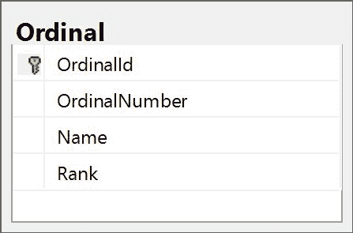
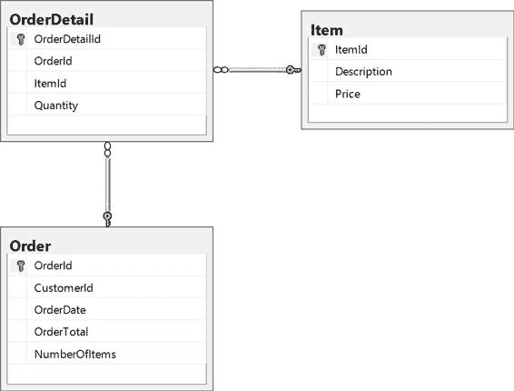

# 三、更高级的 CURD

如果我们事先知道所有的需求，并且能够设计数据库来考虑它们，我们的生活就会简单得多。在现实世界中，我们并不知道所有的前期需求。甚至我们预先给出的需求也会随着时间的推移而改变，最终，许多最初的需求可能不再有效，或者在足够长的时间内可能无法识别。

数据库是在一开始就设计好的，使用了我们当时拥有的最佳信息和最佳实践。随着时间的推移，这种精心设计的数据库将恶化，违反任何数量的最佳实践，通常是需求变化的结果。没有人打算创建一个设计糟糕的数据库，但是任何使用过相同数据模型很长时间的人都会告诉你他们希望不同的各种事情，或者如果他们可以从头开始，他们会做不同的事情。

|  | 注意:很多时间可以用来抱怨一个糟糕的设计，或者想知道为什么有人会提出你现在的设计。这种努力很少产生效果。 |

当我们查看带有插入触发器的审计时，我们简要地看到了这个语法。我们可以提供一个`SELECT`语句来提供这些数据，而不是显式地给出`INSERT`语句的输入值。这将为指定的`SELECT`语句中的每条记录插入一条记录。

`SELECT`驱动嵌件的一个例子是:

代码清单 3-1:选择驱动插入

```sql
  INSERT  INTO dbo.Department

  ( DepartmentName ,

  CostCenter ,

  LocationId )

  ( SELECT    'Accounting' ,

  ' 6MRTG99RAR3N6BI443CRY0M3'
  ,

  0);

```

此查询将插入一条记录，因为关联的 select 只返回一条记录。因为我们没有指定表名，所以将只返回在`SELECT`子句中显式给出的值。我们的`SELECT`语句可以像我们将看到的任何`SELECT`语句一样复杂，这意味着我们可以在这里做一些惊人的事情。

这是一个非常强大的技术。有了它，您可以轻松地将数据从一个表移动到另一个表，就像我们使用 insert 触发器一样。我们还可以使用它来填充缺少约束的缺失记录，以便您可以将其添加回来。

对于`SELECT`语句，我们有几个规则要遵循:

*   `SELECT`中的列必须与`INSERT`语句中的列和数据类型相匹配。
*   `SELECT`语句不能包含`Order By`语句。数据库会抱怨，因为不需要对插入的记录进行排序。

现在让我们重温一下上一章中的审计插入触发器。

代码清单 3-2:重新访问插入触发器

```sql
  CREATE TRIGGER trEmployeeInsert
  ON dbo.Employee
      FOR INSERT
  AS
      INSERT INTO dbo.EmployeeAudit

  ( EmployeeId ,

  FirstName ,

  LastName ,

  ReportsTo ,

  DepartmentId ,

  BirthDate ,

  HireDate ,

  TerminationDate ,

  AuditAction ,

  AuditDateTime )
              SELECT  Inserted.EmployeeId
  ,

  Inserted.FirstName ,

  Inserted.LastName ,

    Inserted.ReportsTo ,

  Inserted.DepartmentId ,

  Inserted.BirthDate ,

  Inserted.HireDate ,

  Inserted.TerminationDate,
                    'I' ,  -- I is for insert
                    GETDATE()
              FROM    Inserted;  

```

该查询基于这样一个事实，即`Inserted`表具有与触发器相关联的表相同的结构。此外，`Inserted`表对于插入的每条记录都有一条记录。大多数情况下，这将是一条记录，但如果碰巧有两条记录，甚至一千条记录，该查询将处理保持审核表最新的问题。

作为另一个例子，我们可以看看如果`Employee`和`Department`表之间的外键约束被意外删除会发生什么。当我们发现这个问题时，我们可能已经有了不存在的引用`DepartmentIds`的`Employee`记录。我们希望通过将丢失的记录添加到`Department`表来纠正这个问题，这样我们就可以启用约束并保持我们的数据干净。

我们可以运行这样的查询来查找缺失的`Department`记录:

代码清单 3-3:选择标识要插入的缺失记录

```sql

  SELECT DISTINCT
  DepartmentId
  FROM    dbo.Employee
  WHERE   DepartmentId NOT
  IN 
        ( SELECT    DepartmentId
        FROM      dbo.Department
  );

```

先不要担心这个`SELECT`语法——我们将很快介绍它。现在，只要知道它会产生一个不在`Department`表中的`DepartmentIds`列表。

在我们插入这些记录之前，我们需要更新数据库，以允许我们在`Identity`列中插入一个值。在插入这些记录之后，我们希望禁止显式地将值插入标识列。处理插入缺失记录的完整代码是:

代码清单 3-4:启用身份插入，为插入提供特定的部门标识

```sql
  SET IDENTITY_INSERT
  dbo.Department ON;  

  INSERT  INTO dbo.Department

  ( DepartmentId ,

  DepartmentName )

  ( SELECT DISTINCT

  DepartmentId ,
                      'Missing Department Added by Data Cleanup'
  DepartmentName
            FROM      dbo.Employee
            WHERE     DepartmentId NOT
  IN ( SELECT   
  DepartmentId

  FROM      dbo.Department
  ));

  SET IDENTITY_INSERT
  dbo.Department OFF;  

```

|  | 注意:我们可以根据“员工”表中的用法来推断缺少的部门标识值，但这并没有给我们关于部门名称应该是什么的任何指导。我们希望提供一个标准名称，它显然不是真实的名称，并且作为数据清理的第二步，我们可以轻松地跟踪并返回进行更正。 |

因为我们可以在插入过程中显式设置标识列的值，所以您可能想知道显式更新它的值。毕竟这也是常见的场景。假设在运营重组之后，您需要为特定日期之后雇用的每个员工更新身份列。原来这不像发布`UPDATE`声明那么简单；从概念上讲，这应该是一项相对简单的任务，需要经历许多步骤。

|  | 注意:在实际操作中，千万不要这样做。除了唯一标识记录之外，表的主键不应该有任何意义。如果你需要一个有商业意义的数字，这应该是一个独立的列，没有数据库的意义。在这种情况下，您可能需要一个 EmployeeId 列和一个 EmployeeNumber 列。“标识”列用于维护数据库中的数据，而“数字”列可能具有任何合适的业务含义。 |

更新标识列值的步骤如下:

1.  创建一个与我们要更新的表具有相同结构的新表，而不指定标识列。我们称之为`Staging`表。
2.  将需要更新的记录插入到新表中，并根据需要更新标识列。
3.  从原始表中删除刚刚复制的记录。
4.  允许插入到原始表的标识列中。
5.  将`Staging`表中的记录插回到原始表中。
6.  禁止插入标识列。
7.  放下`Staging`桌。

处理此类更改的完整代码如下所示:

代码清单 3-5:更新现有标识列值的完整过程

```sql

  SELECT  EmployeeId +
  1000 AS EmployeeId ,

  FirstName ,

  LastName ,

  ReportsTo ,

  DepartmentId ,

  BirthDate ,

  HireDate ,

  TerminationDate
  INTO    EmployeeStaging
  FROM    dbo.Employee
  WHERE   HireDate >
  DATEADD(MONTH, -3, GETDATE());

  DELETE  FROM dbo.Employee
  WHERE   HireDate >
  DATEADD(MONTH, -3, GETDATE());

  SET IDENTITY_INSERT
  dbo.Employee ON; 
  INSERT  INTO dbo.Employee

  ( EmployeeId ,

  FirstName ,

  LastName ,

  ReportsTo ,

  DepartmentId ,

  BirthDate ,

  HireDate ,

  TerminationDate )

  ( SELECT   
  EmployeeId ,

  FirstName ,

  LastName ,

  ReportsTo ,

  DepartmentId ,

  BirthDate ,

  HireDate ,

  TerminationDate
            FROM      dbo.EmployeeStaging);
  SET IDENTITY_INSERT
  dbo.Employee OFF;

```

在上一章中，当我们谈到连接表的各种方法时，我们简要地谈到了这一点。交叉联接将返回正在联接的表中的所有可能的组合。如果一个表中有两条记录，另一个表中有四条记录，交叉连接的结果将包括八条记录。

为了了解这是如何有用的，让我们添加一个新表。`Ordinal`表将如下所示:



图 3-1:序数表

有了这个表，我们可以很容易地生成一个查询，该查询将返回任意数量的记录，合并我们想要与之交叉连接的任何表的详细信息。例如，我们可以使用以下查询模拟每个部门的八条员工记录:

代码清单 3-6:在 Employee 表上强制一个八向笛卡尔乘积

```sql
  SELECT  'Employee'
  FirstName ,
          Name
  LastName ,

  DepartmentId
  FROM    dbo.Department
          CROSS JOIN dbo.Ordinal
  WHERE   OrdinalNumber <=
  8;

```

这会给我们以下结果:

| 西方人名的第一个字 | 姓 | DepartmentId |
| --- | --- | --- |
| 雇员 | 一个 | one |
| 雇员 | 二 | one |
| 雇员 | 三 | one |
| 雇员 | 四 | one |
| 雇员 | 五 | one |
| 雇员 | 六 | one |
| 雇员 | 七 | one |
| 雇员 | 八 | one |
| 雇员 | 一个 | Two |
| 雇员 | 二 | Two |
| 雇员 | 三 | Two |
| 雇员 | 四 | Two |
| 雇员 | 五 | Two |
| 雇员 | 六 | Two |
| 雇员 | 七 | Two |
| 雇员 | 八 | Two |

结果集 3-1:笛卡尔查询的结果

用`INSERT`语句包装，我们将为每个部门插入八个新的员工记录。这对于将虚拟数据加载到数据库中以执行负载测试或任何需要暂存大量数据的时候都是有用的。

|  | 提示:红门有一个很棒的生成数据的工具:SQL 数据生成器。您可以使用它轻松地为任何表生成数十万条记录。 |

您也可以使用这种技术为每个部门创建 12 个预算记录。这将是一年中每个月的一个记录，使得更容易验证从一开始就创建了每个可能的记录，并且后续处理可以集中于更新现有记录。

|  | 提示:只要您想确保插入了所有可能的记录，这项技术就非常有用。 |

我们在上一章中看到的更新都集中在一个表中。当记录被更新时，新的值要么被显式地给出，要么通过操纵被更新的记录中的其他值来确定。这往往是所有需要的，但并不总是——有时你需要一些更花哨的东西。

相关更新允许您根据`SELECT`语句定义`UPDATE`语句，并使用在`SELECT`语句中连接的任何表中的任何列来确定更新值。

为了展示这是如何工作的，让我们重温一下上一章中的订单跟踪表。



图 3-2:一个经典的订单跟踪数据模型

我们有一张`Order`桌子和一张`OrderDetail`桌子。这些是任何电子商务系统的主食。`Order`桌包括从`OrderDetail`桌卷起的一卷。

|  | 提示:汇总订单记录中的详细数据是一种常见的性能技巧，尽管它违反了良好数据库设计的几条规则。有时候好的设计会让位于性能。 |

我们可以用这样的查询来更新这些值:

代码清单 3-7:相关更新

```sql
  DECLARE @OrderID INT;
  SET @OrderID = 41867
  UPDATE  dbo.[Order]
  SET     NumberOfItems =
  Summary.NumberOfItems ,

  OrderTotal = Summary.OrderTotal
  FROM    dbo.[Order]
          JOIN ( SELECT   SUM(Quantity) NumberOfItems ,

  SUM(Quantity
  * Price)
  OrderTotal ,

  OrderId

  FROM     dbo.OrderDetail

  JOIN dbo.Item
  ON Item.ItemId
  = OrderDetail.ItemId

  GROUP BY
  OrderId ) Summary ON
  Summary.OrderId =
  [Order].OrderId
  WHERE   [Order].OrderId
  = @OrderID;

```

这个查询比相关查询中的典型查询稍微复杂一点，因为正在使用的查询不能直接包含`GROUP BY`，所以我们必须将`GROUP BY`移动到子查询中。

在这个例子中，我们定义变量`@OrderId`来将`UPDATE`约束到单个`Order`记录。如果没有`UPDATE`声明中的`WHERE`条款，每个`Order`记录都将被更新。这可能经常是您想要的，但是对于第一遍来说，更新单个记录并确保在强制更新每个记录之前获得预期的结果是一个好主意。添加一个变量是另一个很好的做法，因为它使查询没有文字值，并且如果您需要更改查询来更新不同的`Order`记录，可以更容易地发现在哪里更改文字值。

|  | 注意:不要担心查询中的 GROUP BY 语法。我们将在下一章详细介绍这个语法，以及像 SUM 这样的聚合函数。 |

子查询有点像 SQL 魔法，我们可以定义一条`SELECT`语句，并将结果集视为一个临时表，只要包含查询在运行，该表就存在。这可能非常有用，但是会导致难以阅读的查询，这取决于派生表的定义有多复杂。

通用表表达式(CTEs)类似于子查询，但功能更强大。像子查询一样，CTE 是一个命名查询，它只存在于紧接其定义之后的单个语句的持续时间内。使 CTEs 更强大的是它们可以在同一个查询中被多次引用。一个 CTE 也可以参考自己。这种递归查询开辟了一些非常有趣的可能性，我们将在第 5 章中探讨。

CTE 的基本语法是:

代码清单 3-8:CTE 的基本结构

```sql
  WITH CTE AS (SELECT statement)

```

对于`SELECT`语句，我们可以做任何我们在任何`SELECT`语句中可以做的任何事情。因此，我们可以用这样的 CTE 修改代码清单 3-7:

代码清单 3-9:通用表表达式的基本语法(CTE)

```sql
  WITH    Summary  (NumberOfItems,
  OrderTotal, OrderID)
            AS ( SELECT   SUM(Quantity)
  NumberOfItems ,

  SUM(Quantity
  * Price)
  OrderTotal ,

  OrderId

  FROM     dbo.OrderDetail

  JOIN dbo.Item
  ON Item.ItemId
  = OrderDetail.ItemId

  GROUP BY
  OrderId)
      UPDATE  dbo.[Order]
      SET     NumberOfItems =
  Summary.NumberOfItems ,

  OrderTotal = Summary.OrderTotal
      FROM    dbo.[Order]
              JOIN Summary ON
  Summary.OrderId =
  [Order].OrderId
      WHERE   [Order].OrderId = @OrderId;

```

`WITH`子句命名 CTE，并指定将包含在结果集中的列的名称。只要所有列都在查询中显式命名，就不必包括列列表。

|  | 提示:如果在 WITH 子句中指定了列的列表，列的数量必须与 SELECT 语句中的列的数量相匹配，但是名称不需要匹配。WITH 子句中的名称将是在 CTE 以外使用的名称，而不是 SELECT 语句中的名称。 |

我们可以在一个查询中包含多个 cte。每个 CTE 用逗号隔开。我们可以用两个 cte 重写`UPDATE`语句:

代码清单 3-10:单个查询中的多个 cte

```sql
  WITH    Units ( NumberOfItems,
  OrderID )
            AS ( SELECT   SUM(Quantity)
  NumberOfItems ,

  OrderId

  FROM     dbo.OrderDetail

  GROUP BY
  OrderId),
          Volume ( OrderTotal, OrderID )
            AS ( SELECT   SUM(Quantity * Price) OrderTotal ,

  OrderId

  FROM     dbo.OrderDetail

  JOIN dbo.Item
  ON Item.ItemId
  = OrderDetail.ItemId

  GROUP BY
  OrderId)
      UPDATE  dbo.[Order]
      SET     NumberOfItems =
  Units.NumberOfItems ,

  OrderTotal = Volume.OrderTotal
      FROM    dbo.[Order]
              JOIN Units ON Units.OrderID = [Order].OrderId
              JOIN Volume ON
  Volume.OrderID =
  [Order].OrderId
      WHERE   [Order].OrderId
  = @OrderID;

```

这里我们有两个 cte，`Units`和`Volume`。在实际操作中，您可能不想将它们分成两个 cte，但是这展示了如何在一个查询中包含多个 cte。

我们只触及了 CTEs 可能的表面，我们将在第 5 章中更全面地探讨它们。

有了`MERGE`语句，您可以用更容易维护的东西来替换许多混乱的代码。不幸的是，语法需要一些时间来适应，因为它支持几个不同的子句来支持多种类型的数据修改。

`MERGE`语句的一般语法是:

代码清单 3-11:带有更新的基本 MERGE 语句

```sql
  MERGE TargetTable 
  USING SourceTable 
  ON TargetTable.TargetId
  = SourceTable.TargetId

  WHEN MATCHED THEN 
    UPDATE SET
  ColumnName = value;

```

我们还可以包含一个通用的表表达式。该语法还包括不匹配源和不匹配目标的子句。

我们可以使用`MERGE`语句和一个有用的 CTE 来重写`UPDATE`语句:

代码清单 3-12:使用 CTE 的 MERGE 语句

```sql
  WITH    OrderSummary
            AS ( SELECT   OrderId ,

  SUM(Quantity) AS NumberOfItems ,

  SUM(Price) AS OrderTotal

  FROM     dbo.OrderDetail

  JOIN dbo.Item
  ON Item.ItemId
  = OrderDetail.ItemId

  GROUP BY
  OrderId)
      MERGE dbo.[Order]
      USING OrderSummary
      ON [Order].OrderId = OrderSummary.OrderId
      WHEN MATCHED THEN
          UPDATE SET

  NumberOfItems = OrderSummary.NumberOfItems ,

  OrderTotal = OrderSummary.OrderTotal ;

```

这里的`Target`表就是`Order`表。`Source`桌子是 CTE 的。对于单个`UPDATE`语句来说，这可能看起来过于复杂，但我们并不局限于单个语句。我们可以纳入任何数量的`WHEN`条款:

代码清单 3-13:处理多个业务规则的 MERGE 语句

```sql
  WITH    OrderSummary
            AS ( SELECT   OrderId ,

  SUM(Quantity) AS NumberOfItems ,

  SUM(Price) AS OrderTotal

  FROM     dbo.OrderDetail

  JOIN dbo.Item
  ON Item.ItemId
  = OrderDetail.ItemId

  GROUP BY
  OrderId)
      MERGE dbo.[Order]
      USING OrderSummary
      ON [Order].OrderId = OrderSummary.OrderId
      WHEN MATCHED THEN
          UPDATE SET

  NumberOfItems = OrderSummary.NumberOfItems ,

  OrderTotal = OrderSummary.OrderTotal
      WHEN MATCHED AND CustomerId =
  340419 THEN
          UPDATE SET

  NumberOfItems = 0 ,

  OrderTotal = 0
      WHEN NOT MATCHED BY SOURCE THEN
          UPDATE SET

  NumberOfItems = 0 ,
                 OrderTotal = 0 ;

```

一旦您熟悉了`MERGE`语句的语法，您会发现这为我们提供了一种非常简洁的格式，可以在一个可读的语句中表达多个业务规则。

删除很少是花哨的，我们也不希望它们花哨，因为它们会破坏现有的数据。即使我们喜欢枯燥、简单的`DELETE`语句，我们偶尔也需要比我们在上一章中看到的按主键删除更高级一点。

让我们首先回顾一下我们在删除一个`Department`记录和相关的`Employee`记录时遇到的问题，因为我们不想为这两个表启用级联删除。如果没有级联删除，我们会得到以下错误。

代码清单 3-14:由 DELETE 语句引发的引用约束

```sql
  DELETE FROM dbo.Department 
  WHERE DepartmentId =
  1

  The DELETE statement conflicted with the REFERENCE constraint
  "FK_Employee_Department". The conflict occurred in database
  "SQL", table "dbo.Employee", column 'DepartmentId'.

```

那么我们如何在不级联删除的情况下解决这个问题呢？

|  | 提示:如果没有外键值的记录可能存在(例如没有部门的员工)，则它不适合级联删除。 |

在删除主表中的目标记录之前，我们需要先删除相关表中的所有记录。如果我们想删除一条记录，这相对简单；它只需要两个`DELETE`语句的正确顺序。

代码清单 3-15:在删除外部记录之前显式删除相关记录

```sql
  DELETE  FROM dbo.Employee
  WHERE   DepartmentId =
  1;

  DELETE  FROM dbo.Department
  WHERE   DepartmentId =
  1;

```

但是如果你有一组`Department`记录要删除呢？

代码清单 3-16:一次删除多个部门

```sql
  DELETE  FROM dbo.Department
  WHERE    LocationId =
  95

```

显然我们不想一次处理一个删除。我们不知道目标位置有多少`Department`记录。幸运的是，我们可以编写一个查询来获得我们想要删除的`Department`记录的列表，并将其输入到`DELETE`语句中。

代码清单 3-17:根据位置识别要删除的部门

```sql
  SELECT  DepartmentId
  FROM    dbo.Department
  WHERE   LocationId =
  95;

```

这将为我们提供一个要删除的部门列表。现在我们可以将这个列表添加到`DELETE`语句中。

代码清单 3-18:一起删除相关记录和主记录

```sql
  DELETE  FROM dbo.Employee
  WHERE   DepartmentId IN ( SELECT    DepartmentId

  FROM      dbo.Department

  WHERE     LocationId =
  95 );

  DELETE  FROM dbo.Department
  WHERE   LocationId =
  95;

```

不管有多少`Department`记录将被删除，这两个查询将处理删除。

|  | 注意:这是一个很好的例子，用集合来思考，而不是用程序来思考。 |

解决这个问题的经典程序方法是一次迭代处理一个部门，甚至可能通过光标循环。这远远超过了必要的工作量。

用集合来思考要简单和有效得多。内部的`SELECT`语句创建了一组我们想要删除的部门。然后我们将集合的内容作为一个整体(概念上)删除，而不是一次删除一个。

我们已经谈到了`MERGE`声明是一个花哨的更新；我们也可以用它来处理插入和删除。我们可以通过以下查询来处理这些删除:

代码清单 3-19:作为 MERGE 语句删除相关记录

```sql
  MERGE dbo.Employee
  USING dbo.Department
  ON Employee.DepartmentId
  = Department.DepartmentId
  WHEN MATCHED AND LocationId = 95
  THEN
      DELETE;

```

这比以前的查询更容易处理删除。

我们已经将每个基本语句的复杂性提升了一个等级。我们在这些场景中看到的一个共同主题是如何使用查询来驱动和控制更复杂的数据操作场景。

我们还引入了几个新概念:通用表表达式和`MERGE`语句。这两个都是强大的工具，可以添加到我们的工具带上。

现在我们将把注意力转向更复杂的`SELECT`语句，并探索对数据进行切片和切割的各种方法。