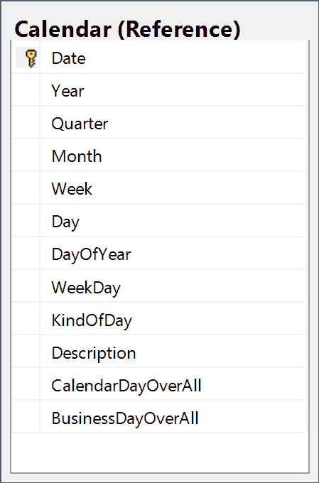

我们的世界很大程度上是围绕时间展开的，更不用说我们的很多业务逻辑经常依赖于日期和时间。很奇怪，我们的数据库中对日期和时间的支持如此之少。

事实证明，我们得到的支持比大多数人意识到的要多，只要我们付出一点努力，我们就能建立更多。

如果你查看许多数据库，很明显大多数人只知道一种用于表示日期和时间的数据类型，`DateTime`数据类型。在许多情况下，这不是最佳的数据类型。

`DateTime`数据类型仍然是最常用于表示日期和时间值的数据类型。它远不是最好的，但为了与其他系统或语言兼容，可能经常需要它。这种类型的列可以表示 1753 年 1 月 1 日到 9999 年 12 月 31 日之间的日期，也可以表示 00:00:00 到 23:59:59.997 之间的时间。对于大多数业务应用程序，这可能比您需要的更准确；我们一般不在乎秒的小数点后三位。通常我们根本不在乎时间，但无论如何我们都要分配空间来存储它，担心在不需要的时候把它剥离出来。

最重要的是，这种数据类型不符合 ANSI 或 ISO 标准。

`DateTime2`是`DateTime`的扩展，使其达到 ANSI 标准。它具有更大的日期范围、更大的时间范围、更大的默认精度以及用户定义的小数精度选项。这种类型的列可以表示 9999 年 1 月 1 日至 12 月 31 日之间的日期。它们可以表示 00:00:00 到 23:59:59.9999999 范围内的时间。这使得它们精确到 100 纳秒以内。

|  | 提示:添加的任何新列都应该使用 DateTime2 而不是 DateTime。 |

这种数据类型直到 2008 年 R2 才被引入到 SQL Server 中，所以如果你运行的是一个旧的数据库，你仍然需要使用`DateTime`。

`Date`数据类型也在 SQL 2008 R2 中引入。它相当于`DateTime2`列的`Date`部分，因此它的日期范围为 9999 年 1 月 1 日至 12 月 31 日。这对于你不关心时间，只关心日期的情况很有用。

`Time`数据类型也在 SQL 2008 R2 中引入。它相当于一个`DateTime2`列的`Time`部分，因此它的时间范围是 00:00:00.0000000 到 23:59:59.99999999。在某些情况下，您可能只关心关联日期上下文之外的时间。

`DateTimeOffset`数据类型类似于`DateTime2`数据类型，只是它也知道时区。它具有与`DateTime2`数据类型相同的所有范围。

#### 获取日期

我们有几个函数来获取当前的日期和时间。

*   `SYSDATETIME(),`
*   `SYSDATETIMEOFFSET(),`
*   `SYSUTCDATETIME(),`
*   `CURRENT_TIMESTAMP,`
*   `GETDATE(),`
*   `GETUTCDATE();`

通过运行以下 SQL 语句，您可以看到这些不同函数之间的细微差别:

代码清单 6-1:获取当前日期的日期函数

```
  SELECT  SYSDATETIME() AS SYSDATETIME ,
          SYSDATETIMEOFFSET()
  AS SYSDATETIMEOFFSET
  ,
          SYSUTCDATETIME()
  AS SYSUTCDATETIME
  ,
          CURRENT_TIMESTAMP AS
  [CURRENT_TIMESTAMP] ,
          GETDATE() AS GETDATE ,
          GETUTCDATE() AS GETUTCDATE;

```

#### 约会的一部分

我们还有几个功能可以用来提取部分日期:

*   `DATENAME (datepart, date)`
*   `DATEPART (datepart, date)`
*   `DAY (date)`
*   `MONTH (date)`
*   `YEAR (date)`

代码清单 6-2:获取部分日期的日期函数

```
  DECLARE @TestDate DATETIME2;
  SELECT  @TestDate = '7/4/2025';

  SELECT  DATENAME(WEEK, @TestDate) [Week]
  ,
          DATEPART(DAYOFYEAR,
  @TestDate) [DayOfYear] ,
          DAY(@TestDate) [Day] ,
          MONTH(@TestDate) [Month] ,
          YEAR(@TestDate) [Year];  

```

该查询的输出应该如下所示:

| **周** | **一年中的某一天** | **日** | **月** | **年** |
| Twenty-seven | One hundred and eighty-five | four | seven | Two thousand and twenty-five |

结果集 6-1:日期的各个部分

当您看到`DATEPART`时，它可以有以下任何值:

表 6-1

| 一天 | 十亿分之一秒 |
| 年复一年 | 四分之一 |
| 小时 | 第二 |
| 国际标准化组织 _ 周 | TZoffset |
| 微秒 | 周 |
| 毫秒 | 工作日 |
| 分钟 | 年 |
| 月 |  |

代码清单 6-3:命名日期的各个部分

```
  DECLARE @TestDate DATETIME2;
  SELECT  @TestDate = '7/4/2025';

  SELECT DATENAME(DAY, @TestDate) [Day],
         DATENAME(dayofyear,
  @TestDate)[DOY],
         DATENAME(hour, @TestDate) [H],
         DATENAME(microsecond,
  @TestDate) [Micro],
         DATENAME(millisecond,
  @TestDate) [MS],
         DATENAME(minute,
  @TestDate) [Min],
         DATENAME(month, @TestDate) [Month],
         DATENAME(nanosecond,
  @TestDate) [Ns],
         DATENAME(quarter,
  @TestDate) [Quart],
         DATENAME(second,
  @TestDate) [Sec],
         DATENAME(TZoffset, @TestDate) [Offset],
         DATENAME(week, @TestDate) [Week],
         DATENAME(weekday, @TestDate) [weekday],
         DATENAME(year, @TestDate) [Year]

```

| 一天 | DOY | H | 微观的，具体领域的 | 女士 | 福建话 | 月 | 纳秒 | 夸脱 | 一秒钟 | 抵消 | 周 | 工作日 | 年 |
| four | One hundred and eighty-five | Zero | Zero | Zero | Zero | 七月 | Zero | three | Zero | +00:00 | Twenty-seven | 星期五 | Two thousand and twenty-five |

结果集 6-2:命名日期的各个部分

#### 两个日期之间的差异

`DATEDIFF`函数取一个`DATEPART`和两个日期，并将返回两个日期之间的差值。因此，我们可以在前面看到的`DATEPART`的任何单位中找到两个日期之间的差异。

代码清单 6-4:日期之间的差异

```
  DECLARE @EndDate DATETIME2;
  SELECT  @EndDate = '7/4/2025';
  DECLARE @StartDate DATETIME2;
  SELECT  @StartDate = '1/1/2025';

  SELECT  DATEDIFF(DAY, @StartDate,
  @EndDate) [Day] ,
          DATEDIFF(DAYOFYEAR,
  @StartDate, @EndDate)
  [Day of Year] ,
          DATEDIFF(HOUR, @StartDate, @EndDate) [hour] ,
          DATEDIFF(MINUTE,
  @StartDate, @EndDate)
  [minute] ,
          DATEDIFF(MONTH,
  @StartDate, @EndDate)
  [month] ,
          DATEDIFF(QUARTER,
  @StartDate, @EndDate)
  [quarter] ,
          DATEDIFF(SECOND,
  @StartDate, @EndDate)
  [second] ,
          DATEDIFF(WEEK, @StartDate, @EndDate) [week] ,
          DATEDIFF(WEEKDAY, @StartDate, @EndDate)
  [weekday] ,
          DATEDIFF(YEAR, @StartDate, @EndDate) [year];

```

| 一天 | 一年中的某一天 | 小时 | 分钟 | 月 | 四分之一 | 第二 | 周 |
| --- | --- | --- | --- | --- | --- | --- | --- |
| One hundred and eighty-four | One hundred and eighty-four | Four thousand four hundred and sixteen | Two hundred and sixty-four thousand nine hundred and sixty | six | Two | Fifteen million eight hundred and ninety-seven thousand six hundred | Twenty-six |

结果集 6-3:日期之间的差异

|  | 注意:根据差异的大小，我们很容易得到一些数据部分的溢出错误，尤其是较小的日期部分。一般来说，我们可能不会关心 30 年期抵押贷款的秒数，更不用说起始日期和截止日期之间的纳秒数了。 |

#### 更改日期的值

我们也可以使用`DATEADD`功能改变日期的值。同样，该函数使用`DATEPART`逻辑来表示要添加日期的哪一部分。我们可以将刚才看到的`DATEDIFF`逻辑与`DATEADD`功能相结合，将`@StartDate`推到`@EndDate`:

代码清单 6-5:日期添加的效果

```
  DECLARE @EndDate DATETIME2;
  SELECT  @EndDate = '7/4/2025';
  DECLARE @StartDate DATETIME2;
  SELECT  @StartDate = '1/1/2025';
  SELECT  DATEADD(DAY, offset.Day, @StartDate) Day ,
          DATEADD(DAYOFYEAR,
  offset.[Day of Year],
  @StartDate) DOY ,
          DATEADD(HOUR, offset.hour, @StartDate) H ,
          DATEADD(MINUTE, offset.minute, @StartDate) M ,
          DATEADD(MONTH, offset.month, @StartDate) Month ,
          DATEADD(QUARTER, offset.quarter, @StartDate) Q ,
          DATEADD(SECOND, offset.second, @StartDate) Sec ,
          DATEADD(WEEK, offset.week, @StartDate) W ,
          DATEADD(WEEKDAY, offset.weekday, @StartDate) WD ,
          DATEADD(YEAR, offset.year, @StartDate) Y
  FROM   
  ( SELECT    DATEDIFF(DAY, @StartDate, @EndDate) [Day] ,

  DATEDIFF(DAYOFYEAR,
  @StartDate, @EndDate)
  [Day of Year] ,

  DATEDIFF(HOUR, @StartDate, @EndDate) [hour] ,

  DATEDIFF(MINUTE,
  @StartDate, @EndDate)
  [minute] ,

  DATEDIFF(MONTH, @StartDate, @EndDate) [month]
  ,

  DATEDIFF(QUARTER,
  @StartDate, @EndDate)
  [quarter] ,

  DATEDIFF(SECOND,
  @StartDate, @EndDate)
  [second] ,

  DATEDIFF(WEEK, @StartDate, @EndDate) [week] ,

  DATEDIFF(WEEKDAY, @StartDate, @EndDate)
  [weekday] ,

  DATEDIFF(YEAR, @StartDate, @EndDate) [year] ) offset;

```

该查询的最终结果显示每列的日期为 2025 年 7 月 4 日。

业务逻辑通常基于日期。有时它可能基于促销窗口期间发生的特定操作，有时它可能围绕着尊重流程启动时有效的业务逻辑。例如，你可能需要支付贷款发放时的利率。您可能需要根据订单下达或处理的时间来支付运输成本，或者您可能需要评估关键业务交易之间的周转时间。

有时日期逻辑基于日历日，有时基于工作日。我们需要清楚地了解其中的区别。日历日是日历上列出的任何一天。对于这样的逻辑，标准的内置函数就是你所需要的。有效期为 30 天的批准意味着 30 个日历日，因此您只需在批准日期上增加 30 天即可获得到期日期。但是，要求在三个工作日内生成特定文档是另一回事。

营业日是指开展业务的日子。一般来说，这不包括周末和联邦假日。如果你在一个不同的县，假期的清单会有所不同。对于许多节假日，实际日期可能会逐年变化，或者至少节假日的日期会发生变化。此外，如果假期在周末，我们有时会在接下来的周一或前一个周五庆祝，你甚至不想想追踪复活节的逻辑。

每当我们有这种程度的歧义时，有一个查找表是很好的。我们需要一个日历参考表，它可以让我们轻松地跟踪一些有用的日期属性。还有，因为确定节假日的逻辑很棘手，我们希望能够轻松地将节假日存储在我们的`Calendar`表中，并且知道它们不是工作日。

我们的`Calendar`表可能是这样的:



图 6-1:日历表

为了填充这个表，我们将看到一些正在运行的日期函数，以及我们一路上学到的一些其他技巧。

对于我们的第一个技巧，我们将使用递归 CTE 获得 2000 年 1 月 1 日到 2050 年 12 月 31 日之间的每个日期的列表。

代码清单 6-6:使用递归 CTE 获得日期列表

```
  WITH    Dates ( Date )

  AS ( SELECT   CAST('2000' AS DATETIME) Date

  UNION ALL

  SELECT   ( Date + 1 ) AS Date

  FROM     Dates

  WHERE    Date
  < CAST('2051' AS DATETIME) - 1

  )
      SELECT  *
      FROM    Dates
  OPTION  ( MAXRECURSION 0 );

```

最后的`MAXRECURSION`选项告诉我们的 CTE 不要担心这是多少个递归调用。通常情况下，如果递归调用超过了一个设置的限制，数据库会跟上这一步并发出抱怨，以防止递归调用中的循环。这里我们知道递归调用将在大约 19，000 次结束，这不是问题。将`MAXRECURSION`设置为 0 告诉数据库不要担心。

接下来，我们需要一个 CTE 来跟踪每个日期的周四日期。我们这样做是因为我们将通过计算星期四来计算周数。

代码清单 6-7:查找与每个日期相关的星期四

```
  WITH    Dates ( Date )

  AS ( SELECT   CAST('2000' AS DATETIME) Date

  UNION ALL

  SELECT   ( Date + 1 ) AS Date

  FROM     Dates

  WHERE    Date
  < CAST('2051' AS DATETIME) - 1

  ),

  DatesAndThursdayInWeek ( Date, Thursday )

  -- The weeks can be found by counting the Thursdays

            -- in a year so we find

  -- the Thursday in the week for a particular date.

  AS ( SELECT   Date ,

  CASE DATEPART(WEEKDAY, Date)

  WHEN 1 THEN Date + 3

  WHEN 2 THEN Date + 2

  WHEN 3 THEN Date + 1

  WHEN 4 THEN Date

  WHEN 5 THEN Date - 1

  WHEN 6 THEN Date - 2

  WHEN 7 THEN Date - 3

  END AS
  Thursday

  FROM     Dates

  )
      SELECT  *
      FROM   
  DatesAndThursdayInWeek

```

接下来，我们将按照`Year`对这些数据进行划分，并跟踪每个`Date`在一年中有多少周:

代码清单 6-8:计算每个星期四的周数

```
  WITH    Dates ( Date )

  AS ( SELECT   CAST('2000' AS DATETIME) Date

  UNION ALL

  SELECT   ( Date + 1 ) AS Date

  FROM     Dates

  WHERE    Date
  < CAST('2051' AS DATETIME) - 1

  ),

  DatesAndThursdayInWeek ( Date, Thursday )

  -- The weeks can be found by counting the Thursdays

            -- in a year so we find

  -- the Thursday in the week for a particular date.

  AS ( SELECT   Date ,

  CASE DATEPART(WEEKDAY, Date)

  WHEN 1 THEN Date + 3

  WHEN 2 THEN Date + 2

  WHEN 3 THEN Date + 1

  WHEN 4 THEN Date

  WHEN 5 THEN Date - 1

  WHEN 6 THEN Date - 2

  WHEN 7 THEN Date - 3

  END AS
  Thursday

  FROM     Dates

  ),

  Weeks ( Week, Thursday )

  AS ( SELECT   ROW_NUMBER() OVER 
                    ( PARTITION BY YEAR(Date) ORDER BY Date ) Week ,

  Thursday

  FROM     DatesAndThursdayInWeek

  WHERE    DATEPART(WEEKDAY, Date) = 4

  )
      SELECT  *
      FROM    Weeks

```

现在我们已经定义了所有的 cte，我们准备使用它们来收集每个日期的所有数据:

代码清单 6-9:构建每个日期的细节

```
  WITH    Dates ( Date )

  AS ( SELECT   CAST('1999' AS DATETIME) Date

  UNION ALL

  SELECT   ( Date + 1 ) AS Date

  FROM     Dates

  WHERE    Date
  < CAST('2026' AS DATETIME) - 1

  ),
          DatesAndThursdayInWeek ( Date, Thursday )

  -- The weeks can be found by counting the 
            -- Thursdays in a year so we find

  -- the Thursday in the week for a particular date.

  AS ( SELECT   Date ,

  CASE DATEPART(WEEKDAY, Date)

  WHEN 1 THEN Date + 3

  WHEN 2 THEN Date + 2

  WHEN 3 THEN Date + 1

  WHEN 4 THEN Date

  WHEN 5 THEN Date - 1

   WHEN 6 THEN Date - 2

  WHEN 7 THEN Date - 3

  END AS
  Thursday

  FROM     Dates

  ),
          Weeks ( Week, Thursday )

  AS ( SELECT   ROW_NUMBER() OVER 
                    ( PARTITION BY YEAR(Date) ORDER BY Date ) Week ,

  Thursday

  FROM     DatesAndThursdayInWeek

  WHERE    DATEPART(WEEKDAY, Date) = 4

  )
      SELECT  d.Date ,

  YEAR(d.Date) AS Year ,

  DATEPART(QUARTER, d.Date) AS Quarter ,

  MONTH(d.Date) AS Month ,

  w.Week as
  Week,

  DAY(d.Date) AS Day ,

  DATEPART(DAYOFYEAR, d.Date) AS DayOfYear ,

  DATEPART(WEEKDAY, d.Date) AS Weekday ,

  YEAR(d.Date) AS Fiscal_Year ,

  DATEPART(QUARTER, d.Date) AS Fiscal_Quarter
  ,

  MONTH(d.Date) AS Fiscal_Month ,

  CASE WHEN DATEPART(WEEKDAY, d.Date) = 6 THEN 'Saturday'

  WHEN DATEPART(WEEKDAY, d.Date) = 7 THEN 'Sunday'

  ELSE 'BusinessDay'

  END KindOfDay ,

  ''
      FROM    DatesAndThursdayInWeek d

  INNER JOIN
  Weeks w ON d.Thursday
  = w.Thursday
  OPTION  ( MAXRECURSION 0 );

```

用`INSERT`将`SELECT`包装到`Calendar`表中，我们已经填充好了。填充后，您可以通过并明确地将`KindOfDay`从`BusinessDay`切换到`Holiday`来查看您想要跟踪的任何节假日。

| 日期 | 四分之一 | 月 | 周 | 一天 | 年复一天 | 工作日 | 今天怎么样 |
| --- | --- | --- | --- | --- | --- | --- | --- |
| 2019-12-25 | four | Twelve | fifty-two | Twenty-five | Three hundred and fifty-nine | three | 营业日 |
| 2019-12-26 | four | Twelve | fifty-two | Twenty-six | Three hundred and sixty | four | 营业日 |
| 2019-12-27 | four | Twelve | fifty-two | Twenty-seven | Three hundred and sixty-one | five | 营业日 |
| 2019-12-28 | four | Twelve | fifty-two | Twenty-eight | Three hundred and sixty-two | six | 星期六 |
| 2019-12-29 | four | Twelve | fifty-two | Twenty-nine | Three hundred and sixty-three | seven | 星期日 |
| 2019-12-30 | four | Twelve | one | Thirty | Three hundred and sixty-four | one | 营业日 |
| 2019-12-31 | four | Twelve | one | Thirty-one | Three hundred and sixty-five | Two | 假期 |
| 2020-01-01 | one | one | one | one | one | three | 假期 |
| 2020-01-02 | one | one | one | Two | Two | four | 营业日 |
| 2020-01-03 | one | one | one | three | three | five | 营业日 |
| 2020-01-04 | one | one | one | four | four | six | 星期六 |
| 2020-01-05 | one | one | one | five | five | seven | 星期日 |

结果集 6-4:日期及其详细信息

一旦我们进入了我们想要追踪的假期，我们就准备好更新最后两列，`CalendarDayOverall`和`BusinessDayOverall`。每当我们更新一个节日，我们也需要更新`BusinessDayOverall`。

我们可以用如下查询更新`CalendarDayOverall`:

代码清单 6-10:初始化日历总体来说

```
  UPDATE  c
  SET     c.CalendarDayOverAll
  = cdo.cdo
  FROM    dbo.Calendar
  c
          INNER JOIN ( SELECT Date ,

  ROW_NUMBER()
  OVER ( ORDER BY Date ) AS cdo

  FROM   dbo.Calendar
  ) cdo ON cdo.Date = c.Date;

```

更新`BusinessDayOverall`有点复杂。对于每一条记录，我们都想把之前的所有工作日加起来。

代码清单 6-11:初始化业务日

```
  UPDATE c
  SET c.BusinessDayOverAll
  = bdo.BusinessDayOverAll
  FROM Reference.Calendar
  c 
  INNER JOIN (
  SELECT  Date ,

  BusinessDayOverAll =
  ( SELECT 
  Sum(CASE c2.KindOfDay

  WHEN 'BuninessDay'
  THEN 1

  ELSE 0

  END)

  FROM    reference.Calendar
  c2

  WHERE   c2.Date <= c1.Date)
  FROM    reference.Calendar
  c1) bdo ON
  bdo.Date = c.Date

```

现在我们可以用这个表来评估`BusinessDay`逻辑。

当你为你的抵押贷款再融资时，你就有了一个退出新抵押贷款的小窗口。这就是所谓的撤销权。你的解除权在平仓后三个工作日结束，所以我们经常需要在平仓后三个工作日确定日期。有了`Calendar`表，我们现在可以通过一个简单的查询来做到这一点。

代码清单 6-12:寻找未来的三个工作日

```
  SELECT  Closing.Date ClosingDate ,

  recission.Date
  RecissionDate ,

  Closing.BusinessDayOverAll ,

  recission.BusinessDayOverAll
  FROM    Reference.Calendar
  Closing
          INNER JOIN ( SELECT MIN(Date) Date ,

  BusinessDayOverAll

  FROM   Reference.Calendar

  GROUP BY
  BusinessDayOverAll ) recission 
         ON recission.BusinessDayOverAll
  = Closing.BusinessDayOverAll
  + 3; 

```

| 截止日期 | 重复日期 | 商业日报 | 商业日报 |
| --- | --- | --- | --- |
| 2019-09-29 | 2019-10-02 | Five thousand four hundred and eleven | Five thousand four hundred and fourteen |
| 2019-09-30 | 2019-10-03 | Five thousand four hundred and twelve | Five thousand four hundred and fifteen |
| 2019-10-01 | 2019-10-06 | Five thousand four hundred and thirteen | Five thousand four hundred and sixteen |
| 2019-10-02 | 2019-10-07 | Five thousand four hundred and fourteen | Five thousand four hundred and seventeen |
| 2019-10-03 | 2019-10-08 | Five thousand four hundred and fifteen | Five thousand four hundred and eighteen |
| 2019-10-04 | 2019-10-08 | Five thousand four hundred and fifteen | Five thousand four hundred and eighteen |
| 2019-10-05 | 2019-10-08 | Five thousand four hundred and fifteen | Five thousand four hundred and eighteen |
| 2019-10-06 | 2019-10-09 | Five thousand four hundred and sixteen | Five thousand four hundred and nineteen |
| 2019-10-07 | 2019-10-10 | Five thousand four hundred and seventeen | Five thousand four hundred and twenty |
| 2019-10-08 | 2019-10-13 | Five thousand four hundred and eighteen | Five thousand four hundred and twenty-one |

结果集 6-5:未来三个工作日

|  | 提示:该技术可用于评估任何取消窗口。 |

我们经常需要跟踪转弯时间。这是从工作流程的一个阶段到下一个阶段所需要的时间。我们可能需要跟踪这一点来验证服务级别协议，作为容量规划的指标，或者作为促销或绩效评估的指标。

对于许多流程，您可能需要一个类似于我们一直在研究的`Calendar`表的`Time`表来跟踪`BusinessHours`，以防您关心以小于一个工作日的增量进行的周转时间。出于我们这里的目的，我们将假设我们只关心工作日，因此`TurnTime`将跟踪两个日期之间的工作日数量。

想象一下，我们有一个名为`LoanMilestone`的表，它跟踪贷款中某个里程碑的发生时间。


图 6-2:贷款里程碑表

在这个系统中，`MilestoneId 25`指的是`InitialProcessor`被分配，`MilestoneId 30`指的是`FinalUnderwriter`被分配。我们有一个包含以下步骤的工作流程:

1.  分配初始处理器
2.  指定初始承销商
3.  分配最终处理器
4.  指定最终承销商

出于跟踪目的，我们希望跟踪从初始处理到最终承保需要多长时间。为了适应所有的业务场景，我们需要适应这些步骤可能会重复的情况。在处理过程中，贷款可能会发生事件，需要将其重新分配给初始处理器，或者重复管道中的任何步骤。为了跟踪周转时间，我们关心贷款第一次分配给初始处理和最后一次分配给最终核保的时间。

为了计算周转时间，我们需要找到这两个日期之间的工作日数。为了找到第一次贷款分配给初始处理器，我们将使用`MIN`功能。要查找最后一次分配给最终承销商的时间，我们将使用`MAX`功能。为了找到这两个日期之间的工作日数，我们将加入`Calendar`表两次，并减去两个`BusinessDayOverall`值。

代码清单 6-13:跟踪指定处理者和指定承保人之间的工作日

```
  SELECT  InitialProcessor.InitialProcessorAssigned
  ,

  InitialProcessor.LoanKey ,

  InitialUnderwriter.InitialUnderwriterAssigned
  ,

  ProcessorCalendar.BusinessDayOverAll ,

  UnderwriterCalendar.BusinessDayOverAll ,

  UnderwriterCalendar.BusinessDayOverAll
          - ProcessorCalendar.BusinessDayOverAll
  AS TurnTime
  FROM   
  ( SELECT    MIN(MilestoneDate) AS
  InitialProcessorAssigned ,

  LoanKey
            FROM      dbo.LoanMilestone
            WHERE     MilestoneId =
  25
            GROUP BY  LoanKey ) AS
  InitialProcessor
          INNER JOIN ( SELECT MAX(MilestoneDate) AS InitialUnderwriterAssigned ,

  LoanKey

  FROM   dbo.LoanMilestone

  WHERE  MilestoneId =
  30

  GROUP BY
  LoanKey ) InitialUnderwriter 
                ON InitialUnderwriter.LoanKey
  = InitialProcessor.LoanKey
          INNER JOIN
  Reference.Calendar ProcessorCalendar 
                ON InitialProcessor.InitialProcessorAssigned
  = ProcessorCalendar.Date
          INNER JOIN
  Reference.Calendar UnderwriterCalendar 

  ON InitialUnderwriter.InitialUnderwriterAssigned
  =  

  UnderwriterCalendar.Date
  ORDER BY TurnTime;

```

| 贷款密钥 | 初始承销商已分配 | 分配的初始处理器 | 营业日结束 | 营业日结束 | 转弯时间 |
| --- | --- | --- | --- | --- | --- |
| Two thousand six hundred and two | 2018-03-28 | 2018-01-31 | Four thousand nine hundred and seventy-nine | Five thousand and nineteen | Forty |
| Two thousand six hundred and six | 2018-03-26 | 2018-01-29 | Four thousand nine hundred and seventy-seven | Five thousand and seventeen | Forty |
| Two thousand seven hundred and ninety-eight | 2018-03-26 | 2018-01-25 | Four thousand nine hundred and seventy-five | Five thousand and seventeen | forty-two |
| Two thousand nine hundred and fifty-eight | 2018-03-21 | 2018-01-22 | Four thousand nine hundred and seventy-two | Five thousand and fourteen | forty-two |
| Two thousand seven hundred and seventy-two | 2018-03-31 | 2018-01-30 | Four thousand nine hundred and seventy-eight | Five thousand and twenty | forty-two |
| Two thousand eight hundred and twenty-one | 2018-03-31 | 2018-01-30 | Four thousand nine hundred and seventy-eight | Five thousand and twenty | forty-two |
| Two thousand four hundred and ninety-eight | 2018-03-26 | 2018-01-27 | Four thousand nine hundred and seventy-five | Five thousand and seventeen | forty-two |
| Two thousand four hundred and fifty-five | 2018-03-22 | 2018-01-23 | Four thousand nine hundred and seventy-three | Five thousand and fifteen | forty-two |
| Two thousand four hundred and sixty-eight | 2018-03-30 | 2018-01-29 | Four thousand nine hundred and seventy-seven | Five thousand and twenty | Forty-three |
| Two thousand nine hundred and sixty | 2018-03-27 | 2018-01-25 | Four thousand nine hundred and seventy-five | Five thousand and eighteen | Forty-three |

结果集 6-6:显示转弯时间数据

在本章中，我们探讨了时间和日期信息的重要性，并回顾了跟踪它们的各种数据类型。我们看到了从一个日期中获取不同日期部分的函数，以及如何以任意增量找到两个日期之间的差异，可作为`DatePart`使用。

最后，我们探讨了日历日和工作日之间的区别，并建立了`Calendar`表来跟踪这两种类型的天数，以便我们可以根据日期评估业务逻辑，并使用业务日期来评估衰退日期和生成周转时间报告。

日期和时间信息非常重要，有助于推动我们的业务逻辑。