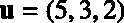
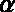
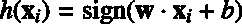

# 第一章先决条件

本章介绍了一些您需要了解的基础知识，以便更好地理解支持向量机。我们将首先看看向量是什么，并看看它们的一些关键属性。然后，在引入一个关键组件:超平面之前，我们将了解数据线性可分意味着什么。

## 向量

在支持向量机中，有**向量这个词。**为了理解支持向量机以及如何使用它们，了解一些关于向量的基础知识是很重要的。

### 什么是向量？

向量是可以用箭头表示的数学对象(图 1)。


图 1:向量的表示

当我们进行计算时，我们用一个向量的端点(箭头尖端所在的点)的坐标来表示这个向量。在图 1 中，点 A 的坐标是(4，3)。我们可以写道:


如果我们愿意，我们可以给向量取另一个名字，例如，。


从这一点来看，人们可能会认为矢量是由其坐标定义的。然而，如果我给你一张只有一条水平线的纸，并要求你追踪与图 1 中相同的向量，你仍然可以做到。

您只需要两条信息:

*   向量的长度是多少？
*   向量和水平线之间的角度是多少？

这就引出了向量的以下定义:

*矢量是一个既有大小又有方向的物体。*

让我们仔细看看这些组件。

#### 向量的大小

向量的大小或长度被写成，并被称为其**范数**。


图 2:这个向量的大小是线段 OA 的长度

在图 2 中，我们可以利用勾股定理计算向量的范数:


一般来说，我们通过使用**欧几里德范数**公式来计算向量的范数:


在 Python 中，通过调用 **numpy** 模块提供的**范数**函数，可以很容易地计算出范数，如代码清单 1 所示。

代码清单 1

```py
import numpy as np
 x = [3,4]
np.linalg.norm(x) # 5.0

```

#### 向量的方向

方向是向量的第二个分量。根据定义，它是一个新向量，其坐标是我们向量的初始坐标除以它的范数。

矢量的**方向**就是矢量:


它可以使用代码清单 2 中的代码在 Python 中进行计算。

代码清单 2

```py
import numpy as np

  # Compute the direction of a vector x.
  def direction(x):
      return x/np.linalg.norm(x)

```

它是从哪里来的？几何。图 3 显示了一个矢量及其相对于水平轴和垂直轴的角度。与横轴成角度(θ)与纵轴成角度(α)。


图 3:向量 u 及其相对于轴的角度

利用初等几何，我们看到和，这意味着也可以定义为:


的坐标由余弦定义。因此，如果与一个轴之间的角度改变，也就是说的方向改变了，也会改变。这就是为什么我们称这个向量为向量的方向。我们可以计算的值(代码清单 3)，我们发现它的坐标是。

代码清单 3

```py
u =
  np.array([3,4])
  w = direction(u)
  print (w) # [0.6 , 0.8]

```

有趣的是，如果两个向量具有相同的方向，它们将具有相同的方向向量(代码清单 4)。

代码清单 4

```py
u_1 =
  np.array([3,4])
  u_2 = np.array([30,40])

  print (direction(u_1)) # [0.6 , 0.8]
  print (direction(u_2)) # [0.6 , 0.8]

```

此外，**方向向量的范数总是 1** 。我们可以用向量来验证这一点(代码清单 5)。

代码清单 5

```py
np.linalg.norm(np.array([0.6, 0.8])) # 1.0

```

这是有意义的，因为这个向量的唯一目的是描述其他向量的方向——通过有一个 1 的范数，它保持尽可能简单。因此，像这样的方向向量通常被称为**单位向量**。

#### 向量的维数

注意，数字的书写顺序很重要。因此，我们说一个维向量是一组实数值。

例如，是二维向量；我们经常写 ( 属于)。
同样，矢量是三维矢量，。

### 点积

**点积**是对两个向量执行的运算，返回一个数字。数字有时被称为**标量**；这就是为什么点积也被称为**标量积**。

人们经常对点积有异议，因为它似乎是凭空而来的。重要的是，这是对**两个向量**进行的运算，其结果让我们对这两个向量如何相互关联有了一些了解。考虑点积有两种方法:几何方法和代数方法。

#### 点积的几何定义

几何学上，**点积**是两个向量的欧几里得大小和它们之间角度的余弦的乘积。


图 4:两个向量 x 和 y

这意味着如果我们有两个向量和，它们之间有一个角度(图 4)，它们的点积是:


看这个公式，可以看出点积受角度的影响很大:

*   当时，我们有和
*   当时，我们有和
*   当时，我们有和

请记住这一点——这在我们以后研究感知器学习算法时会很有用。

我们可以使用这个定义编写一个简单的 Python 函数来计算点积(代码清单 6)，并使用它来获得图 4 中点积的值(代码清单 7)。

代码清单 6

```py
import math
  import numpy as np

 def  geometric_dot_product(x,y, theta):
      x_norm = np.linalg.norm(x)
      y_norm = np.linalg.norm(y)
      return  x_norm * y_norm * math.cos(math.radians(theta))

```

然而，我们需要知道的值才能计算点积。

代码清单 7

```py
theta = 45 
  x = [3,5]
  y = [8,2]
  print (geometric_dot_product(x,y,theta)) 
  # 34.0

```

#### 点积的代数定义


图 5:使用这三个角度将允许我们简化点积

在图 5 中，我们可以看到三个角度、(β)和(α)之间的关系:


这意味着计算和计算是一样的。

利用余弦的差恒等式，我们得到:


如果我们将两边乘以，我们得到:


我们已经知道:


这意味着点积也可以写成:


或者:


更一般地说，对于维向量，我们可以这样写:


这个公式就是点积的**代数定义。**

代码清单 8

```py
def  dot_product(x,y):
      result = 0
      for  i in  range(len(x)):
          result = result + x[i]*y[i]
      return  result

```

这个定义是有利的，因为我们不需要知道角度来计算点积。我们可以编写一个函数来计算它的值(代码清单 8)，并得到与几何定义相同的结果(代码清单 9)。

代码清单 9

```py
x = [3,5]
  y = [8,2]
  print (dot_product(x,y)) # 34

```

当然，我们也可以使用 **numpy** 提供的点函数(代码清单 10)。

代码清单 10

```py
import numpy as np

  x = np.array([3,5])
  y = np.array([8,2])

  print (np.dot(x,y)) # 34

```

我们花了相当多的时间来理解点积是什么以及它是如何计算的。这是因为点积是一个基本概念，为了弄清楚支持向量机中发生了什么，你应该对它感到舒服。我们现在将看到另一个重要的方面，线性可分性。

## 理解线性可分性

在这一节中，我们将使用一个简单的例子来介绍线性可分性。

### 线性可分数据

想象你是一个葡萄酒生产商。你出售来自两个不同生产批次的葡萄酒:

*   一瓶售价 145 美元的高端葡萄酒。
*   一瓶 8 美元的普通葡萄酒。

最近，你开始收到购买昂贵瓶子的客户的投诉。他们声称他们的瓶子里装着廉价的葡萄酒。这会给你的公司带来严重的声誉损失，客户会停止订购你的葡萄酒。

#### 用酒精体积来分类葡萄酒

你决定找到区分这两种酒的方法。你知道其中一个比另一个含有更多的酒精，所以你打开几个瓶子，测量酒精浓度，并绘制出来。


图 6:线性可分数据示例

在图 6 中，你可以清楚地看到昂贵的酒比便宜的酒含酒精少。事实上，您可以找到一个点，将数据分成两组。这个数据被称为**线性可分**。现在，你决定在灌装一瓶昂贵的葡萄酒之前，自动测量葡萄酒的酒精浓度。如果大于 13%，生产链停止，你的一名员工必须进行检查。这一改进极大地减少了投诉，您的业务再次蓬勃发展。

这个例子太简单了——事实上，数据很少像那样工作。事实上，一些科学家确实测量了葡萄酒的酒精浓度，他们获得的图如图 7 所示。这是一个非线性可分离数据的例子。即使大部分时间数据不会是线性可分的，但很好地理解线性可分性是最基本的。在大多数情况下，我们将从线性可分的情况开始(因为它更简单)，然后导出不可分的情况。

同样，在大多数问题中，我们不会只处理一个维度，如图 6 所示。现实生活中的问题比玩具示例更具挑战性，其中一些问题可能有数千个维度，这使得处理这些问题更加抽象。然而，它的抽象性并没有使它变得更加复杂。本书中的大多数例子将是二维例子。它们足够简单，很容易可视化，我们可以在它们上面做一些基本的几何图形，这将使您了解支持向量机的基本原理。


图 7:根据真实数据集绘制酒精体积图

在图 6 的例子中，只有一个维度:也就是说，每个数据点由一个数字表示。当有更多的维度时，我们将使用向量来表示每个数据点。每次添加维度时，用于分隔数据的对象都会发生变化。事实上，虽然我们可以在图 6 中用一个点分离数据，但是一旦我们进入二维，我们就需要一条线(一组点)，而在三维，我们需要一个平面(也是一组点)。

总而言之，在下列情况下，数据是线性可分的:

*   在一个维度上，你可以找到一个分隔数据的**点**(图 6)。
*   在两个维度上，你可以找到一条**线**分隔数据(图 8)。
*   在三维空间中，你可以找到一个分离数据的**平面**(图 9)。


图 8:用一条线分隔的数据


图 9:用平面分隔的数据

同样，当数据非线性可分时，我们**无法**找到分离点、线或平面。图 10 和图 11 显示了二维和三维非线性可分离数据的例子。


图 10:2D 非线性可分数据


图 11:三维非线性可分数据

## 超平面

当有三个以上的维度时，我们用什么来分隔数据？我们使用所谓的**超平面**。

### 什么是超平面？

*在几何学中，**超平面**是比其周围空间小一维的子空间。*

这个定义虽然正确，但不是很直观。我们将尝试通过首先研究线是什么来理解什么是超平面，而不是使用它。

如果你回想一下学校里的数学，你可能会知道一条线有一个形式为的方程，常数被称为斜率，截取 y 轴。有几个的值，这个公式是对的，我们说解集是一条线。

经常令人困惑的是，如果你在微积分课程中学习函数，你将学习一个只有一个变量的函数。

但是需要注意的是，线性方程有两个变量，分别是和，我们可以随意命名。

比如我们可以把改名为，改名为，等式变成:。

这相当于。

如果我们定义二维向量和，我们得到一条线的方程的另一个符号(其中是和的点积):


最后这个等式的好处是它使用了向量。即使我们用二维向量导出它，它也适用于任何维度的向量。事实上，这是一个**超平面**的方程。

从这个方程中，我们可以对什么是超平面有另一个洞察:它是满足的点集。而且，如果我们只保留这个定义的本质:**超平面是一组点**。

如果我们已经能够从一条线的方程推导出超平面方程，那是因为一条线*就是*一个超平面。你可以通过再次阅读超平面的定义来说服自己。你会注意到，事实上，线是一个二维空间，被一个三维平面包围着。同样，点和平面也是超平面。

### 理解超平面方程

我们从直线方程推导出超平面方程。反其道而行之很有趣，因为它向我们更清楚地展示了两者之间的关系。

给定向量、和，我们可以定义一个超平面，其方程如下:


这相当于:


我们隔离以获得:


如果我们定义和:


我们看到当时，线方程的偏差只等于超平面方程的偏差。所以当你看到一个超平面的图时，如果不是垂直轴的交点，你不应该感到惊讶(这将是我们下一个例子中的情况)。而且如果和有相同的符号，斜率将为负。

### 用超平面对数据进行分类


图 12:线性可分数据集

给定图 12 的线性可分数据，我们可以使用超平面来执行二进制分类。

例如，通过向量和，我们得到了图 13 中的超平面。


图 13:一个超平面分离数据

我们将每个向量与一个标签相关联，该标签可以具有值或(分别是图 13 中的三角形和星星)。

我们定义一个假设函数:


这相当于:



它使用相对于超平面的位置来预测标签的值。超平面一侧的每个数据点将被分配一个标签，另一侧的每个数据点将被分配另一个标签。

例如，对于，在超平面之上。当我们计算时，我们得到，它是正的，所以。

同样的，对于，在超平面下方，会因为而返回。

因为它使用超平面的方程，产生值的线性组合，所以函数被称为**线性分类器**。

再用一个技巧，我们可以通过去掉 b 常数使的公式更加简单。首先，我们给向量添加一个分量。我们得到矢量(上面写着“帽子”，因为我们在上戴了一顶帽子)。同样，我们在向量中加入一个分量，变成。

|  | 注:在本书的其余部分，我们将把一个添加了人工坐标的向量称为<u>增强向量</u>。 |

当我们使用增广向量时，假设函数变成:


如果我们有一个像图 13 中那样分离数据集的超平面，通过使用假设函数，我们能够完美地预测每个点的标签。
主要问题是:我们如何找到这样的超平面？

### 怎样才能找到一个超平面(分离数据与否)？

回想一下超平面的方程是增广形式的。重要的是要理解影响超平面形状的唯一值是。为了说服你，我们可以回到二维情况，当超平面只是一条线。当我们创建增强的三维向量时，我们获得和。可以看到向量包含和，这是定义线条外观的两个主要组成部分。改变的值会给我们不同的超平面(线)，如图 14 所示。


图 14:**w**的不同值会给你不同的超平面

## 总结

在介绍了向量和线性可分性之后，我们了解了什么是超平面，以及如何使用它对数据进行分类。然后我们看到，学习算法试图学习线性分类器的目标是找到一个分离数据的超平面。最终，我们发现找到一个超平面相当于找到一个向量。

我们现在将研究学习算法使用哪种方法来找到分离数据的超平面。在研究支持向量机如何做到这一点之前，我们将首先研究一个最简单的学习模型:感知器。