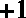
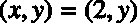

# 第三章 SVM 优化问题

## 支持向量机搜索最优超平面

感知器有几个优点:它是一个简单的模型，算法非常容易实现，我们有理论证明它会找到一个分离数据的超平面。然而，它最大的弱点是不会每次都找到相同的超平面。我们为什么在乎？因为不是所有的分离超平面都相等。如果感知器给你一个超平面，它非常接近一个类的所有数据点，你有权利相信当给定新数据时，它会很难推广。

SVM 没有这个问题。事实上，支持向量机并没有寻找*的*超平面，而是试图寻找*的*超平面。我们称之为**最优超平面**，我们会说它是最好地分离数据的超平面。

## 如何比较两个超平面？

因为我们不能根据自己的感觉选择最佳超平面，所以我们需要某种度量来比较两个超平面，并判断哪一个优于所有其他超平面。

在本节中，我们将尝试发现如何比较两个超平面。换句话说，我们将寻找一种计算数字的方法，让我们知道哪个超平面能最好地分离数据。我们将看看那些看似有效的方法，但接下来我们将看到为什么它们不起作用，以及我们如何纠正它们的局限性。让我们试着用一个简单的尝试，只用超平面的方程来比较两个超平面。

### 使用超平面方程

给定一个例子和一个超平面，我们希望知道这个例子如何与超平面相关。

我们已经知道的一个关键要素是，如果的值满足一条线的方程，那么就意味着它在线上。它对超平面的工作原理是一样的:对于一个数据点和一个由向量和偏差定义的超平面，如果在超平面上，我们将得到。

但是如果点不在超平面上呢？

让我们用一个例子看看会发生什么。在图 22 中，该线由和定义。当我们使用超平面方程时:

*   对于点，使用向量我们得到
*   对于点，使用向量我们得到
*   对于点，使用向量我们得到


图 22:等式返回的数字 A 比 B 大

如你所见，当点不在超平面上时，我们得到一个不同于零的数。事实上，如果我们使用一个远离超平面的点，我们将得到比使用一个更靠近超平面的点更大的数。

另一件需要注意的事情是，方程返回的数字的符号告诉我们点相对于线的位置。使用图 23 所示的等式，我们得到:

1.  为点
2.  为点
3.  为点


图 23:等式为 C 返回一个负数

如果方程返回一个正数，则该点在线下方，而如果是负数，则该点在线上方。请注意，它在视觉上不一定在上方或下方，因为如果您有一条如图 24 所示的线，它将是左侧或右侧，但同样的逻辑适用。超平面方程返回的数字的符号允许我们判断两个点是否在同一侧。事实上，这正是我们在第二章中定义的假设函数所做的。


图 24:一条线可以用不同的方式分隔空间

我们现在有了比较两个超平面的解决方案的开始。

给定一个训练示例和一个由向量和偏差定义的超平面，我们计算数字来知道该点离超平面有多远。

给定一个数据集，我们为每个训练示例计算，并说数字是我们遇到的最小的。


如果我们需要在两个超平面之间进行选择，那么我们将选择最大的一个。

需要明确的是，这意味着如果我们有超平面，我们将计算并选择具有这个的超平面。

### 反面例题

不幸的是，使用超平面方程的结果有其局限性。问题是取最小值不适用于负端的例子(方程返回负值的例子)。

请记住，我们总是希望取最接近超平面的点的。用正面的例子计算实际上做到了这一点。在具有和的两点之间，我们选择具有最小数量的一点，因此我们选择。但是在有和的两个例子之间，这个规则会选择，因为比小，但是最近的点其实是有的那个。

解决这个问题的一个方法就是考虑的绝对值。

给定一个数据集，我们为每个例子计算，并说是具有最小绝对值的:


### 超平面对数据的分类是否正确？

计算数字允许我们选择一个超平面。然而，仅使用这个值，我们可能会选择错误的值。考虑图 25 中的情况:例子是**正确分类**，使用最后一个公式计算的的值是 2。


图 25:正确分类数据的超平面

图 26 中的例子是**分类错误，**，的值也是 2。这是有问题的，因为使用，我们不知道哪个超平面更好。理论上，它们看起来一样好，但实际上，我们想从图 25 中选择一个。


图 26:没有正确分类数据的超平面

我们如何调整我们的公式来满足这个要求？

嗯，我们的训练示例中有一个我们没有使用的部分:！

如果我们将乘以的值，我们就改变了它的符号。让我们把这个新号码叫做:


的标志永远是:

*   如果点被正确分类，则为正
*   如果点分类不正确，则为负

给定一个数据集，我们可以计算:


有了这个公式，在比较两个超平面的时候，我们还是会选择最大的那个。额外的好处是，在像图 25 和图 26 这样的特殊情况下，我们总是会选择分类正确的超平面(因为将有一个正值，而它的值对于其他超平面将是负值)。

在文献中，数字有一个名字，它被称为**功能余量**的一个例子；它的值可以用 Python 计算，如代码清单 19 所示。同样，数字被称为数据集 的**功能余量。**

代码清单 19

```py
# Compute the
  functional margin of an example (x,y)
  # with respect to a hyperplane defined by w and b.
  def
  example_functional_margin(w,
  b, x, y):
      result = y * (np.dot(w, x) + b)
      return
  result

  #
  Compute the functional margin of a hyperplane
  # for examples X with labels y.
  def
  functional_margin(w,
  b, X, y):
      return
  np.min([example_functional_margin(w,
  b, x, y[i])
                    for  i, x in enumerate(X)])

```

使用这个公式，我们发现图 25 中的超平面的函数边界是+2，而在图 26 中是-2。因为它有更大的利润，我们将选择第一个。

|  | 提示:记住，我们希望选择边缘最大的超平面。 |

### 尺度不变性

看来这次我们找到了比较这两个超平面的好方法。然而，函数余量有一个主要问题:不是比例不变的。

给定一个向量和偏差，如果我们将它们乘以 10，我们得到和。我们说我们**重新缩放了**他们。

向量和表示相同的超平面，因为它们具有相同的单位向量。超平面是与向量正交的平面，向量有多长并不重要。唯一重要的是它的方向，正如我们在第一章中看到的，它是由单位向量给出的。而且，在图上追踪超平面时，纵轴与超平面的交点坐标将为，因此超平面也不会因为的重新缩放而改变。

问题是，正如我们在代码清单 20 中看到的，当我们用计算功能余量时，我们得到了一个比用大十倍的数字。这意味着，给定任何超平面，我们总能找到一个将具有更大功能裕度的超平面，只需重新缩放和。

代码清单 20

```py
x = np.array([1, 1])
y = 1

  b_1 = 5
  w_1 = np.array([2, 1])

w_2 = w_1 * 10
  b_2 = b_1 * 10

  print (example_functional_margin(w_1, b_1, x, y))  # 8
  print (example_functional_margin(w_2, b_2, x, y))  # 80

```

要解决这个问题，我们只需要做一个小小的调整。我们将使用它的单位向量，而不是使用向量。为此，我们将把除以的范数，使其也保持比例不变。

回想一下功能余量的公式:

我们对其进行修改，得到一个新的编号:


和以前一样，给定一个数据集，我们可以计算:


的优势在于，无论我们选择的向量有多大，它都会给我们相同的数字。数字还有一个名字——它被称为训练示例的**几何边距**，而是数据集的几何边距。代码清单 21 显示了一个 Python 实现。

代码清单 21

```py
# Compute the geometric margin of an example (x,y)
# with respect to a hyperplane defined by w and b.
  def  example_geometric_margin(w, b, x, y):
    norm = np.linalg.norm(w)
    result = y * (np.dot(w/norm, x) + b/norm)
    return  result

  # Compute the geometric margin of a hyperplane
# for examples X with labels y.
  def  geometric_margin(w, b, X, y):
    return  np.min([example_geometric_margin(w, b, x, y[i])
                  for  i, x in enumerate(X)])

```

我们可以验证几何边距的行为是否符合预期。在代码清单 22 中，该函数为向量或其重新缩放版本返回相同的值。

代码清单 22

```py
x = np.array([1,1])
y = 1

  b_1 = 5
  w_1 = np.array([2,1])

w_2 = w_1*10
  b_2 = b_1*10

  print (example_geometric_margin(w_1, b_1, x, y))  # 3.577708764
  print (example_geometric_margin(w_2, b_2, x, y))  # 3.577708764

```

它被称为几何边距，因为我们可以使用简单的几何来检索这个公式。它测量和超平面之间的距离。

在图 27 中，我们看到点是到超平面的正交投影。我们希望找到和之间的距离。


图 27:几何边距是 X 点到超平面的距离 d

向量与向量方向相同，所以它们共享同一个单位向量。我们知道的范数是，所以向量可以用来定义。

而且，我们可以看到，所以如果我们代入做一点代数，我们得到:


现在，点在超平面上。这意味着满足超平面方程，我们有:


最终，正如我们之前所做的，我们乘以以确保我们选择了一个正确分类数据的超平面，它给出了我们之前看到的几何边距公式:


| 图 28:由 w=(-0.4，-1)和 b=8 定义的超平面 | 图 29:由 w=(-0.4，-1)和 b=8.5 定义的超平面 |

现在我们已经定义了几何边界，让我们看看它如何允许我们比较两个超平面。我们可以看到，与图 29 中的例子相比，图 28 中的超平面更接近蓝星例子，而不是红色三角形例子。因此，我们预计它的几何余量会更小。代码清单 23 使用代码清单 21 中定义的函数来计算每个超平面的几何边距。如从图 29 中所预期的，由和定义的第二超平面的几何边界更大(0.64 > 0.18)。在这两者之间，我们会选择这个超平面。

代码清单 23

```py
# Compare two hyperplanes using the geometrical margin.

  positive_x = [[2,7],[8,3],[7,5],[4,4],[4,6],[1,3],[2,5]]
negative_x = [[8,7],[4,10],[9,7],[7,10],[9,6],[4,8],[10,10]]

X = np.vstack((positive_x, negative_x))
y = np.hstack((np.ones(len(positive_x)), -1*np.ones(len(negative_x))))

w = np.array([-0.4, -1])
b = 8

  # change the value of b
  print (geometric_margin(w, b, X, y))          # 0.185695338177
  print (geometric_margin(w, 8.5, X, y))        # 0.64993368362

```

我们看到，为了计算另一个超平面的几何余量，我们只需要修改的值。我们可以尝试通过一个小的增量来改变它，看看利润率是否会变大，但这是随机的，需要很多时间。我们的目标是在所有可能的超平面中找到数据集**的最佳超平面，并且存在无穷多个超平面。**

|  | 提示:找到最佳超平面只是找到 w 和 b 的值的问题，对于这两个值，我们获得了最大的几何余量。 |

如何才能找到产生最大几何余量的的值？对我们来说幸运的是，数学家已经设计了解决这些问题的工具。要找到，我们需要解决所谓的**优化问题**。在看什么是支持向量机的优化问题之前，让我们快速回顾一下什么是优化问题。

## 什么是优化问题？

### 无约束优化问题

**优化问题**的目标是相对于某个变量 x 最小化或最大化一个函数(也就是说，找到 x 的值，函数返回它的最小值或最大值)。例如，我们想求函数最小值的问题是这样写的:


或者，可选地:


在这种情况下，我们可以自由搜索的所有可能值。我们说这个问题是不受约束的。如图 30 所示，函数的最小值在为零。

|  |  |
| 图 30:无约束，最小值为零 | 图 31:由于约束 x-2=0，最小值为 4 |

### 约束优化问题

#### 单一等式约束

有时我们对函数本身的最小值不感兴趣，而是在满足某些约束时对它的最小值感兴趣。在这种情况下，我们写下问题，并添加以开头的约束，T0 通常缩写为，例如，如果我们希望知道的最小值，但将的值限制为特定值，我们可以写:


这个例子如图 31 所示。一般来说，约束是通过在等式右侧保持零来编写的，因此问题可以重写:


使用这个符号，我们清楚地看到约束是一个**仿射函数**，而目标函数是一个**二次函数**。因此我们称这个问题为**二次优化问题**或二次规划(QP)问题。

#### 可行集合

满足问题约束的变量集称为**可行集**(或可行域)。在求解优化问题时，将从可行集中选取解。在图 31 中，可行集只包含一个值，所以问题很小。然而，当我们操作带有几个变量的函数时，例如，它允许我们知道我们试图从哪些值中选择一个最小值(或最大值)。

例如:


在这个问题中，可行集是所有对点的集合，如。

#### 多重等式约束和向量表示法

我们可以添加任意多的约束。以下是函数有三个约束的问题示例:


当我们有几个变量时，我们可以切换到向量符号来提高可读性。对于向量，函数变为，问题写成:


添加约束时，请记住这样做会减少可行集。要使解决方案被接受，**必须满足所有约束**。

例如，让我们看看下面这个问题:


我们可以认为和是解决方案，但事实并非如此。当时，约束不满足；而当时，约束不满足。问题是**不可行**。

|  | 提示:如果你给一个问题添加了太多的约束，它可能变得不可行。 |

如果你通过增加一个约束来改变一个优化问题，你会使优化变得更糟，或者，充其量，你会让它保持不变(格什温，2010)。

#### 不等式约束

我们也可以用不等式作为约束:


我们可以结合等式约束和不等式约束:


### 我们如何解决一个优化问题？

有几种方法可以解决每种类型的优化问题。然而，呈现它们超出了本书的范围。感兴趣的读者可以查看*优化模型和应用* (El Ghaoui，2015)和*凸优化* (Boyd & Vandenberghe，2004)，这两本书是从这个主题开始的，可以在网上免费获得(详见参考书目)。相反，我们将再次关注支持向量机，并推导出一个优化问题，使我们能够找到最佳超平面。下一章将详细解释如何解决 SVMs 优化问题。

## 支持向量机优化问题

给定一个线性可分的训练集和一个带有法向量和偏差的超平面，回想一下超平面的**几何边界** **** 由 **:** 定义


其中是训练示例的几何边距。

**最优分离超平面**是由法向量和偏差定义的超平面，其几何余量 **** 最大。

要找到和，需要解决以下优化问题，约束条件是每个示例的边距都要大于等于 **** :


几何边距和功能边距之间有一种关系:


所以我们可以重写这个问题:


然后，我们可以通过移除不等式两边的范数来简化约束:


回想一下，我们正试图最大化几何余量，和的比例并不重要。我们可以根据需要选择重新缩放和，几何边距不会改变。因此，我们决定缩放和，以便。它不会影响优化问题的结果。

问题变成了:


因为它和:


而因为我们决定设置，这就相当于:


这个最大化问题相当于下面的最小化问题:


|  | 提示:你也可以在本页上阅读这个优化问题[的替代推导，在这里我用几何代替了函数和几何的边距。](http://www.svm-tutorial.com/2015/06/svm-understanding-math-part-3/) |

这个最小化问题给出了如下相同的结果:


添加了因子是为了以后方便，我们将使用 QP 解算器来解决问题，平方范数的优点是去掉了平方根。

最后，这里是优化问题，正如你将在大多数文献中看到的:


为什么我们要承受这样重写问题的痛苦？因为原来的优化问题很难解决。相反，我们现在有了**凸二次优化问题**，虽然不明显，但求解起来要简单得多。

## 总结

首先，我们假设一些超平面比其他超平面更好:它们在看不见的数据下会表现得更好。在所有可能的超平面中，我们决定称“最佳”超平面为**最优超平面**。为了找到最佳超平面，我们寻找一种方法来比较两个超平面，最终得到一个允许我们这样做的数字。我们意识到这个数字还有一个几何意义，叫做**几何余量**。

然后，我们声明最优超平面是具有最大几何余量的超平面，并且我们可以通过最大化余量来找到它。为了使事情变得更简单，我们注意到我们可以最小化的范数，即超平面的法线向量，并且我们将确定它将是最优超平面的(因为如果你回忆起来，在计算几何余量的公式中使用了)。