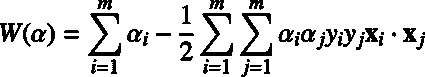
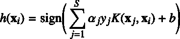

# 第六章仁

## 特征变换

### 我们可以对非线性可分的数据进行分类吗？

假设您有一些不可分离的数据(如图 38 所示)，您希望使用支持向量机对其进行分类。我们已经看到这是不可能的，因为数据不是线性可分的。然而，最后一个假设是不正确的。这里需要注意的重要一点是，数据在两个维度上并不是线性可分的**。**


图 38:直线不能分隔数据

即使你的原始数据是二维的，也没有什么能阻止你在把它输入 SVM 之前进行转换。例如，一种可能的变换是将每个二维向量变换成三维向量。

例如，我们可以通过应用由下式定义的函数来进行所谓的多项式映射:


代码清单 31 显示了用 Python 实现的这个转换。

代码清单 31

```
# Transform a two-dimensional vector x into a three-dimensional vector.
  def  transform(x):
    return  [x[0]**2, np.sqrt(2)*x[0]*x[1], x[1]**2]

```

如果您转换图 38 的整个数据集并绘制结果，您会得到图 39，它没有显示出太大的改进。但是，玩了一段时间图，我们可以看到数据其实是三维可分的(图 40 和图 41)！


图 39:数据在三维上看起来不可分离


图 40:数据实际上可以被一个平面分开


图 41:从侧面显示平面的另一个数据视图

以下是我们可以用来对数据集进行分类的基本方法:

1.  使用代码清单 31 的转换方法将每个二维向量转换成三维向量。
2.  使用三维数据集训练支持向量机。
3.  对于我们希望预测的每个新示例，在将其传递给`predict`方法之前，使用`transform`方法对其进行转换。

当然不是强迫你把数据转换成三维；可能是五维、十维或一百维。

### 我们如何知道应用哪个变换？

选择应用哪个转换在很大程度上取决于您的数据集。能够转换数据，使您希望使用的机器学习算法发挥最佳性能，这可能是机器学习领域成功的一个关键因素。不幸的是，没有完美的配方，它会随着经验通过反复试验而来。在使用任何算法之前，一定要检查是否有一些通用的规则来转换文档中详细描述的数据。有关如何准备数据的更多信息，您可以阅读 scikit-learn 网站上的[数据集转换部分](http://scikit-learn.org/stable/data_transforms.html)。

## 什么是内核？

在最后一节中，我们看到了一个用于不可分离数据集的快速方法。它的一个主要缺点是我们必须改变每一个例子。如果我们有数百万或数十亿个例子，而这种转换方法很复杂，那可能需要大量的时间。这是内核来拯救的时候。

如果你回想一下，当我们在 Wolfe 对偶拉格朗日函数中搜索 KKT 乘子时，我们不需要一个训练例子的值；我们只需要两个训练示例之间的点积的值:



在代码清单 32 中，我们应用了配方的第一步。想象一下，当数据用于学习时，我们唯一关心的是点积返回的值，在这个例子中是 8100。

代码清单 32

```
x1 = [3,6]
x2 = [10,10]

x1_3d = transform(x1)
x2_3d = transform(x2)

  print (np.dot(x1_3d,x2_3d))  # 8100

```

问题是这样的:**有没有办法不用变换向量**来计算这个值？

答案是:是的，有内核！

让我们考虑代码清单 33 中的函数:

代码清单 33

```
def  polynomial_kernel(a, b):
    return  a[0]**2 * b[0]**2 + 2*a[0]*b[0]*a[1]*b[1] + a[1]**2 * b[1]**2

```

将这个函数与前面的两个例子一起使用会返回相同的结果(代码清单 33)。

代码清单 34

```
x1 = [3,6]
x2 = [10,10]

# We do not transform the data.

  print (polynomial_kernel(x1, x2)) # 8100 

```

仔细想想，这真是不可思议。

向量和属于。核函数计算它们的点积，就好像它们已经被转换成属于的向量，并且它不做转换，也不计算它们的点积！

总结一下:一个内核**是一个函数**，返回在另一个空间执行的点积的结果。更正式地说，我们可以这样写:

**<u>定义</u>** : *给定一个映射函数* * * *，我们称该函数* *  * *由* *  * *定义，其中* *  * *表示***中的内积，一个**内核函数**。**

## 内核绝招

既然我们知道了什么是内核，我们就来看看 ***内核的绝招*** 是什么。

如果我们将内核定义为:，那么我们可以重写软边界对偶问题:


就这样。我们对双重问题做了一个单独的改变——我们称之为内核技巧。

|  | 提示:应用内核技巧仅仅意味着用内核函数替换两个例子的点积。 |

这个变化看起来非常简单，但是请记住，从最初的优化问题中导出 Wolf 对偶公式需要大量的工作。我们现在有能力改变内核函数，以便对不可分离的数据进行分类。

当然，我们还需要将假设函数改为使用核函数:



记住在这个公式中是支持向量的集合。通过这个公式，我们更好地理解了为什么支持向量机也被称为**稀疏核机器**。这是因为它们只需要计算支持向量上的核函数，而不是像其他核方法一样计算所有向量上的核函数(Bishop，2006)。

## 内核类型

### 线性核

这是最简单的内核。它的简单定义如下:


其中和是两个向量。

在实践中，您应该知道线性内核[对于文本分类](http://www.svm-tutorial.com/2014/10/svm-linear-kernel-good-text-classification/)非常有效。

### 多项式核

我们在前面介绍内核时已经看到了多项式内核，但这次我们将考虑内核的更通用版本:


它有两个参数:，代表常数项，，代表内核的度。这个内核可以很容易地在 Python 中实现，如代码清单 35 所示。

代码清单 35

```
def  polynomial_kernel(a,
  b, degree, constant=0):
      result = sum([a[i] * b[i] for  i in  range(len(a))]) + constant
      return
  pow(result, degree)

```

在代码清单 36 中，我们看到当我们使用程度 2 时，它返回与代码清单 33 的内核相同的结果。用这个内核训练 SVM 的结果如图 42 所示。

代码清单 36

```
x1 = [3,6]
  x2 = [10,10]
  #
  We do not transform the data.

  print (polynomial_kernel(x1,
  x2, degree=2)) # 8100

```


图 42:使用多项式核的 SVM 能够分离数据(次数=2)

#### 更新学位

次数为 1 且没有常数的多项式核只是线性核(图 43)。当增加多项式核的次数时，决策边界将变得更加复杂，并且有受单个数据示例影响的趋势，如图 44 所示。使用高次多项式是危险的，因为你经常可以在你的测试集上获得更好的性能，但是它会导致所谓的**过度拟合**:模型太接近数据，不能很好地概括。

| 图 43:次数= 1 的多项式核 | 图 44:次数= 6 的多项式核 |

|  | 注意:使用高次多项式核通常会导致过拟合。 |

### RBF 或高斯核

有时多项式核不够复杂，无法工作。当您有一个像图 45 所示的困难数据集时，这种类型的内核会显示出它的局限性。


图 45:这个数据集更难处理

正如我们在图 46 中看到的，决策边界在数据分类方面非常糟糕。


图 46:多项式核无法分离数据(次数=3，C=100)

这个案例要求我们使用另一个更复杂的内核:高斯内核。它也被称为径向基核，其中径向基代表径向基函数。径向基函数是一种其值仅取决于距原点或某一点的距离的函数。

径向基函数核函数是:


你会经常读到它将向量投射到无限维空间。这是什么意思？

回想一下这个定义:内核是一个**函数**，它返回在另一个空间中执行的点积的结果。

在我们前面看到的多项式内核例子中，内核返回在中执行的点积的结果。结果是，径向基函数内核返回在中执行的点积的结果。

这里我就不细说了，但是如果你愿意的话，你可以阅读[这个证明](http://pages.cs.wisc.edu/~matthewb/pages/notes/pdf/svms/RBFKernel.pdf)来更好的理解我们是如何得出这个结论的。


图 47:径向基函数内核正确分类数据，gamma = 0.1

[这个视频](https://www.youtube.com/watch?v=3liCbRZPrZA)对于理解 RBF 核如何能够分离数据特别有用。

#### 更改伽马值

|  |  |
| 图 48:gamma = 1e-5 的高斯核 | 图 gamma = 2 的高斯核 |

所示，模型表现得像线性 SVM。当 gamma 太大时，模型受每个支持向量的影响太大，如图 49 所示。有关伽马射线的更多信息，请阅读[科学工具包-学习文档页面](http://scikit-learn.org/stable/auto_examples/svm/plot_rbf_parameters.html)。

### 其他类型

关于内核的研究已经非常多了，现在有很多可用的内核。其中一些特定于某个域，例如[字符串内核](https://en.wikipedia.org/wiki/String_kernel)，可以在处理文本时使用。如果你想发现更多的内核，[这篇来自塞萨尔·苏扎](http://crsouza.com/2010/03/17/kernel-functions-for-machine-learning-applications/)的文章描述了 25 个内核。

## 应该用哪个内核？

推荐的方法是首先尝试径向基函数内核，因为它通常运行良好。然而，如果你有足够的时间，尝试其他类型的内核是很好的。**一个内核是两个向量之间相似性的度量**，所以这是手边问题的领域知识可能影响最大的地方。构建一个定制内核也是可能的，但是这需要你对内核背后的理论有很好的数学理解。你可以在(克里斯蒂亚诺尼&肖-泰勒，2000)中找到更多关于这个主题的信息。

## 总结

内核技巧是使支持向量机强大的一个关键因素。它允许我们在各种各样的问题上应用支持向量机。在这一章中，我们看到了线性核的局限性，以及多项式核如何对不可分的数据进行分类。最终，我们看到了最常用和最强大的内核之一:径向基函数内核。不要忘记有许多内核，并尝试寻找为解决您试图解决的那种问题而创建的内核。使用正确的内核和正确的数据集是你使用支持向量机成败的一个关键因素。