# 第七章 SMO 算法

我们看到了如何使用凸优化包解决 SVM 优化问题。然而，在实践中，我们将使用专门创建的算法来快速解决这个问题: **SMO(顺序最小优化** ) **算法**。大多数机器学习库使用 SMO 算法或一些变体。

SMO 算法将解决以下优化问题:

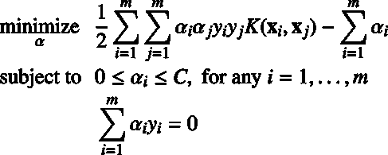

这是我们在第五章中看到的软边界公式的内核化版本。我们试图最小化的目标函数可以用 Python 编写(代码清单 37):

代码清单 37

```
def  kernel(x1, x2):
      return
  np.dot(x1,
  x2.T)
  def  objective_function_to_minimize(X,
  y, a, kernel):
      m, n = np.shape(X)
      return
  1 / 2 * np.sum([a[i] *
  a[j] * y[i] * y[j]* kernel(X[i, :], X[j, :])
                             for  j in  range(m)
                             for  i in  range(m)])\
             - np.sum([a[i] for  i in  range(m)])

```

这和我们用 CVXOPT 解决的问题是一样的。为什么我们需要另一种方法？因为我们希望能够在大数据集上使用支持向量机，而使用凸优化包通常涉及矩阵操作，随着矩阵大小的增加，这些操作会花费大量时间，或者由于内存限制而变得不可能。SMO 算法的目标是比其他方法更快。

## SMO 背后的想法

当我们试图解决 SVM 优化问题时，只要我们尊重约束，我们可以自由改变的值。我们的目标是修改，以便最终目标函数返回最小的可能值。在这种情况下，给定拉格朗日乘数的向量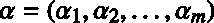，我们可以改变任何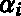的值，直到我们达到目标。

SMO 背后的想法很简单:我们将解决一个更简单的问题。也就是说，给定一个向量，我们将只允许自己改变的两个值，例如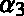。我们将改变它们，直到目标函数达到给定这组α的最小值。然后，我们将挑选另外两个字母并更改它们，直到函数返回其最小值，以此类推。如果我们继续这样做，我们将最终达到原始问题的目标函数的最小值。

SMO 解决了一系列更简单的优化问题。

## 我们是怎么到 SMO 的？

这种解决几个更简单的优化问题的想法并不新鲜。1982 年，Vapnik 提出了一种被称为“分块”的方法，将原来的问题分解成一系列更小的问题(Vapnik V .，1982)。使事情发生变化的是，在 1997 年，Osuna 等人证明，只要我们添加至少一个违反 KKT 条件的例子，解决一系列子问题将保证收敛(Osuna，Freund & Girosi，1997)。

利用这一结果，一年后的 1998 年，普拉特提出了 SMO 算法。

## 为什么 SMO 更快？

SMO 方法的最大优点是我们不需要 QP 解算器来解决两个拉格朗日乘子的问题——它可以解析地解决。因此，它不需要存储巨大的矩阵，这可能会导致机器内存的问题。此外，SMO 使用了几种启发式算法来加快计算速度。

## SMO 算法

SMO 算法由三部分组成:

*   选择第一个拉格朗日乘数的一种启发式方法
*   选择第二拉格朗日乘数的一种启发式方法
*   解析求解两个选择乘数的优化问题的代码

|  | 提示:附录 B:SMO 算法中提供了该算法的 Python 实现。本节中的所有代码清单都取自本附录，不能单独使用。 |

### 解析解

在算法的开始，我们从一个向量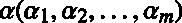开始，其中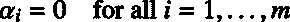。这个想法是选择这个向量的两个元素，我们将把它们命名为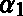和，并改变它们的值，以便约束仍然得到遵守。

第一个约束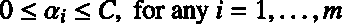是指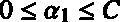和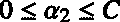。这就是为什么我们被迫选择一个位于图 50 蓝色框中的值(显示了一个例子，其中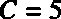)。

第二个约束是线性约束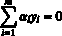。它强制值位于红色对角线上，第一对选中的和应该有不同的标签(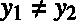)。

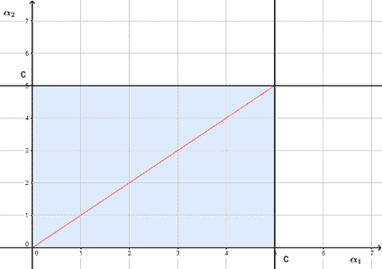

图 50:可行集是方框的对角线

一般来说，为了避免打破线性约束，我们必须更改乘数，以便:

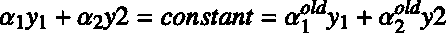

我们将不深入分析如何解决问题的细节，因为它在(cristiani & Shawe-Taylor，2000)和(Platt J. C .，1998)中做得非常好。

记住有一个公式可以计算新的:

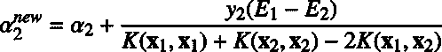

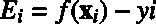是假设函数的输出和示例标签之间的差值。是内核函数。我们也计算边界，适用于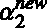；它不能小于下限，也不能大于上限，否则会违反约束。所以如果是这样的话就被夹住了。

一旦我们有了这个新值，我们就用它来计算新的，使用这个公式:

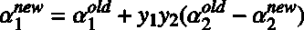

### 理解第一启发式

第一个启发背后的想法非常简单:每次 SMO 检查一个例子，它都会检查是否违反了 KKT 条件。回想一下，至少必须违反一个 KKT 条件。如果条件满足，那么它尝试另一个例子。因此，如果有数以百万计的例子，而其中只有少数违反了 KKT 条件，它将花费大量时间检查无用的例子。为了避免这种情况，算法将时间集中在拉格朗日乘数不等于 0 或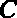的例子上，因为它们最有可能违反条件(代码清单 38)。

代码清单 38

```
def  get_non_bound_indexes(self):
    return  np.where(np.logical_and(self.alphas > 0,
                                   self.alphas < self.C))[0]

  # First heuristic: loop  over examples where alpha is not 0 and not C
# they are the most likely to violate the KKT conditions
# (the non-bound subset).
  def  first_heuristic(self):
    num_changed = 0
    non_bound_idx = self.get_non_bound_indexes()

    for i in  non_bound_idx:
        num_changed += self.examine_example(i)
    return num_changed

```

因为解析地解决这个问题涉及两个拉格朗日乘数，所以有可能一个有界乘数(其值在 0 和之间)已经违反了 KKT 定律。这就是为什么主例程在所有示例和非绑定子集之间交替(代码清单 39)。请注意，当不再取得进展时，算法结束。

代码清单 39

```
def  main_routine(self):
    num_changed = 0
    examine_all = True

    while num_changed > 0 or examine_all:
        num_changed = 0

        if  examine_all:
            for  i in  range(self.m):
                num_changed += self.examine_example(i)
        else:
            num_changed += self.first_heuristic()

        if  examine_all:
            examine_all = False
        elif num_changed == 0:
            examine_all = True

```

### 理解第二种启发式

第二个试探的目标是选择拉格朗日乘数，对于该乘数，所采取的步骤将是最大的。

我们如何更新？我们使用以下公式:

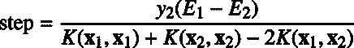

请记住，在这种情况下，我们已经选择了值。我们的目标是选择变化最大的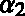。这个公式可以改写如下:

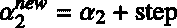

与:


因此，要在几个中选择最佳，我们需要计算每个的步长值，并选择步长最大的一个。这里的问题是我们每一步都需要调用内核函数三次，这代价很大。普拉特没有这样做，而是提出了以下近似方法:

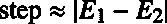

因此，如果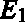为正，选择误差最小的，如果为负，选择误差最大的来选择最大的一步。

这个近似在代码清单 40 的方法`second_heuristic`中可见。

代码清单 40

```
def  second_heuristic(self, non_bound_indices):
    i1 = -1
    if  len(non_bound_indices) > 1:
    max = 0

    for  j in  non_bound_indices:
        E1 = self.errors[j] - self.y[j]
        step = abs(E1 - self.E2) # approximation
        if  step > max:
              max = step
              i1 = j
      return  i1

 def  examine_example(self, i2):
      self.y2 = self.y[i2]
      self.a2 = self.alphas[i2]
      self.X2 = self.X[i2]
      self.E2 = self.get_error(i2)

      r2 = self.E2 * self.y2

      if not((r2 < -self.tol and self.a2 < self.C) or 
             (r2 > self.tol and self.a2 > 0)):
          # The KKT conditions are met, SMO looks at another example.
          return  0

    # Second heuristic A: choose the Lagrange multiplier that
      # maximizes the absolute error.
    non_bound_idx = list(self.get_non_bound_indexes())
    i1 = self.second_heuristic(non_bound_idx)

    if  i1 >= 0 and self.take_step(i1, i2):
          return 1

    # Second heuristic B: Look for examples making positive 
     # progress by looping over all non-zero and non-C alpha,     # starting at a random point.
      if  len(non_bound_idx) > 0:
          rand_i = randrange(len(non_bound_idx))
          for  i1 in  non_bound_idx[rand_i:] + non_bound_idx[:rand_i]:
              if  self.take_step(i1, i2):
                  return  1

    # Second heuristic C: Look for examples making positive progress    # by looping over all possible examples, starting at a random     # point.
      rand_i = randrange(self.m)
      all_indices = list(range(self.m))
      for  i1 in  all_indices[rand_i:] + all_indices[:rand_i]:
          if  self.take_step(i1, i2):
          return  1

    # Extremely degenerate circumstances, SMO skips the first example.
      return  0

```

## 总结

理解 SMO 算法可能会很棘手，因为这里的很多代码都是出于性能原因，或者是为了处理特定的退化情况。然而，就其核心而言，该算法保持简单，比凸优化求解器更快。随着时间的推移，人们发现了新的启发式算法来改进这种算法，像 LIBSVM 这样的流行库使用了类似 SMO 的算法。请注意，即使这是解决 SVM 问题的标准方法，也存在其他方法，例如梯度下降和随机梯度下降(SGD)，它特别用于在线学习和处理庞大的数据集。

了解 SMO 算法的工作原理将有助于您决定它是否是解决您想要解决的问题的最佳方法。我强烈建议你自己尝试实现它。在斯坦福 CS229 课程中，可以找到[的描述，一个简化版的算法](http://cs229.stanford.edu/materials/smo.pdf)，这是一个很好的开始。然后，在*顺序最小优化*(普拉特 J. C .，1998)中，您可以阅读算法的完整描述。[附录 B](11.html#sigil_toc_id_102) 中可用的 Python 代码是根据本文的伪代码编写的，并在注释中指出代码的哪些部分对应于本文中的哪些等式。