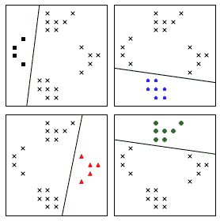
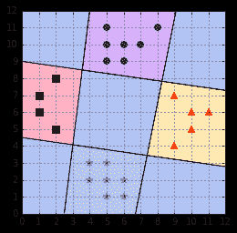
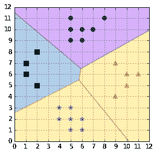
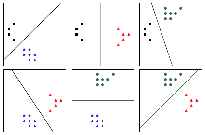
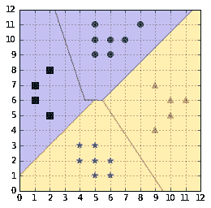
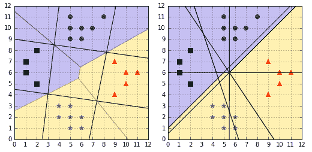
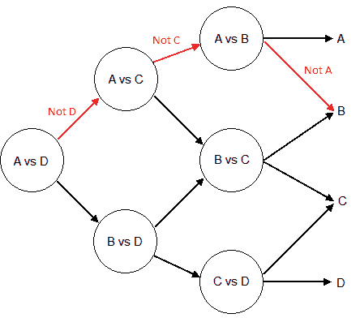
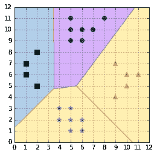
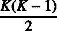

# 第八章多类支持向量机

支持向量机能够生成二进制分类器。然而，我们经常会遇到包含两个以上类的数据集。例如，原始葡萄酒数据集实际上包含来自三个不同生产商的数据。有几种方法允许支持向量机用于多类分类。在本章中，我们将回顾一些最流行的多类方法，并解释它们的来源。

对于本章中的所有代码示例，我们将使用代码清单 41 生成并显示在图 51 中的数据集。

代码清单 41

```
import numpy as np

  def  load_X():
    return  np.array([[1, 6], [1, 7], [2, 5], [2, 8],
                     [4, 2], [4, 3], [5, 1], [5, 2],
                     [5, 3], [6, 1], [6, 2], [9, 4],
                     [9, 7], [10, 5], [10, 6], [11, 6],
                     [5, 9], [5, 10], [5, 11], [6, 9],
                     [6, 10], [7, 10], [8, 11]])

  def  load_y():
    return  np.array([1, 1, 1, 1,
                     2, 2, 2, 2, 2, 2, 2,
                     3, 3, 3, 3, 3,
                     4, 4, 4, 4, 4, 4, 4])

```

图 51:一个四类分类问题

## 求解多个二元问题

### 一对多

也称为“一对其余”，这可能是最简单的方法。

为了对 K 类进行分类，我们构造了 K 个不同的二元分类器。对于给定的类，正面的例子是类中的所有点，而负面的例子是类中没有的所有点(代码清单 42)。

代码清单 42

```
import numpy as np
  from sklearn import svm

# Create
  a simple dataset
  X
  = load_X()
  y = load_y()
# Transform the 4 classes problem# in 4 binary classes problems.y_1 = np.where(y == 1, 1, -1)
y_2 = np.where(y == 2, 1, -1)
y_3 = np.where(y == 3, 1, -1)
y_4 = np.where(y == 4, 1, -1)

```

我们为每个问题训练一个二进制分类器(代码清单 43)。因此，我们为每个分类器获得一个决策边界(如图 52 所示)。

代码清单 43

```
# Train one binary classifier on each problem.
  y_list = [y_1, y_2, y_3, y_4]
  classifiers = []
  for  y_i in
  y_list:
      clf = svm.SVC(kernel='linear', C=1000)
      clf.fit(X, y_i)
      classifiers.append(clf)

```



图 52:一对多方法为每个类创建一个分类器

为了进行新的预测，我们使用每个分类器，并预测分类器的类，如果它返回肯定的答案(代码清单 44)。然而，这可能会产生不一致的结果，因为一个标签被同时分配给多个类，或者没有分配给任何类(Bishop，2006)。图 52 说明了这个问题；一对所有分类器不能预测每个角落的蓝色区域中的示例的类别，因为两个分类器正在做出肯定的预测。这将导致该示例同时具有两个类。同样的问题也发生在中心，因为每个分类器都会做出否定的预测。因此，在该区域中没有类可以分配给示例。

代码清单 44

```
def  predict_class(X, classifiers):
    predictions = np.zeros((X.shape[0], len(classifiers)))
    for  idx, clf in  enumerate(classifiers):
        predictions[:, idx] = clf.predict(X)

    # returns the class number if only one classifier predicted it
    # returns zero otherwise.
    return  np.where((predictions == 1).sum(1) == 1,
                    (predictions == 1).argmax(axis=1) + 1,
                    0)

```



图 53:一对多导致决策模糊

作为替代解决方案，弗拉基米尔·瓦普尼克建议使用决策函数值最大的分类器类别(瓦普尼克诉 n .，1998)。代码清单 45 演示了这一点。注意，我们使用`decision_function`而不是调用分类器的`predict`方法。此方法返回一个实值，如果示例位于分类器的正确一侧，则该值为正，如果位于分类器的另一侧，则该值为负。有趣的是，通过取值的最大值，而不是绝对值的最大值，当所有分类器不一致时，这种方法将选择最接近例子的超平面的类别。例如，图 52 中的示例点(6，4)将被分配蓝星类。**T3】**

代码清单 45

```
def  predict_class(X, classifiers):
    predictions = np.zeros((X.shape[0], len(classifiers)))
    for  idx, clf in  enumerate(classifiers):
        predictions[:, idx] = clf.decision_function(X)
    # return the argmax of the decision function as suggested by Vapnik.
    return  np.argmax(predictions, axis=1) + 1

```

如图 53 所示，应用这种启发式方法给我们的分类结果没有歧义。这种方法的主要缺陷是不同的分类器是在不同的任务上训练的，因此不能保证`decision_function`返回的数量具有相同的规模(Bishop，2006)。如果一个决策函数返回的结果比其他函数的结果大十倍，它的类将被错误地分配给一些例子。



图 54:应用简单的启发式避免了模糊的决策问题

一对多方法的另一个问题是训练集不平衡(Bishop，2006)。对于一个有 100 个类的问题，每个类有 10 个例子，每个分类器将被训练 10 个正例子和 990 个负例子。因此，反面例子会对决策边界产生很大的影响。

然而，一对所有仍然是一种流行的多类分类方法，因为它易于实现和理解。

|  | 注:“[...]在实践中，一对其余的方法是使用最广泛的方法，尽管它是临时制定的，而且有其实际局限性。”(毕晓普，2006 年)(普拉特，克里斯蒂亚诺尼和肖韦-泰勒，2000 年)。 |

使用`sklearn`时，`LinearSVC`默认自动使用一对多策略。您也可以通过将`multi_class`参数设置为`ovr`(一对其余)来明确指定它，如代码清单 46 所示。

代码清单 46

```
from sklearn.svm import LinearSVC
  import numpy as np

X = load_X()
y = load_y()

clf = LinearSVC(C=1000, random_state=88, multi_class='ovr')
clf.fit(X,y)

  # Make predictions on two examples.
  X_to_predict = np.array([[5,5],[2,5]])
  print (clf.predict(X_to_predict)) # prints [2 1]

```

### 一对一

在这种方法中，我们不是试图将一个类与所有其他类区分开来，而是试图将一个类与另一个类区分开来。因此，我们为每对类训练一个分类器，这导致为 *K* 类训练 *K(K-1)/2* 分类器。每个分类器都是在数据子集上训练的，并产生自己的决策边界(图 54)。

使用简单的**投票策略**进行预测。我们希望预测的每个示例都被传递给每个分类器，并且记录预测的类。然后，投票最多的类被分配给这个例子(代码清单 47)。

代码清单 47

```
from itertools import combinations from scipy.stats import mode
  from sklearn import  svmimport numpy as np

 # Predict the class having the max number of votes.
  def  predict_class(X, classifiers, class_pairs):
    predictions = np.zeros((X.shape[0], len(classifiers)))
    for  idx, clf in  enumerate(classifiers):
        class_pair = class_pairs[idx]
        prediction = clf.predict(X)
        predictions[:, idx] = np.where(prediction == 1,                                        class_pair[0], class_pair[1])
    return  mode(predictions, axis=1)[0].ravel().astype(int)

X = load_X()
y = load_y()

  # Create datasets.
  training_data = []
class_pairs = list(combinations(set(y), 2))
  for  class_pair in  class_pairs:
    class_mask = np.where((y == class_pair[0]) | (y == class_pair[1]))
    y_i = np.where(y[class_mask] == class_pair[0], 1, -1)
    training_data.append((X[class_mask], y_i))

  # Train one classifier per class.
  classifiers = []
  for  data in  training_data:
    clf = svm.SVC(kernel='linear', C=1000)
    clf.fit(data[0], data[1])
    classifiers.append(clf)

  # Make predictions on two examples.
  X_to_predict = np.array([[5,5],[2,5]])
  print (predict_class(X_to_predict, classifiers, class_pairs)) # prints [2 1]

```



图 55:一对一构造，每对类有一个分类器

采用这种方法，我们仍然面临着模糊的分类问题。如果两个类别具有相同的投票数，则建议选择具有较小指数的类别可能是可行的(虽然可能不是最佳的)策略(Hsu & Lin，*多类别支持向量机方法的比较，*2002【】)。



图 56:使用投票方案进行预测

图 55 向我们展示了一对一策略生成的决策区域不同于一对一策略生成的决策区域(图 53)。在图 56 中，有趣的是，对于由一对一分类器生成的区域，区域仅在穿过超平面(由黑线表示)后才改变其颜色，而一对一分类器则不是这种情况。



图 57:一对全(左)和一对一(右)对比

一对一方法是`sklearn`中使用的多类分类的默认方法。您将使用代码清单 48 的代码获得完全相同的结果，而不是代码清单 47。

代码清单 48

```
from sklearn import svm
  import numpy as np

X = load_X()
y = load_y()

  # Train a multi-class classifier.
  clf = svm.SVC(kernel='linear', C=1000)
clf.fit(X,y)

  # Make predictions on two examples.
  X_to_predict = np.array([[5,5],[2,5]])
  print (clf.predict(X_to_predict)) # prints [2 1]

```

一对多方法的一个主要缺点是分类器会过度过滤。
此外，分类器的大小随着类的数量呈超线性增长，因此这种方法对于大问题会很慢(Platt，Cristianini，& Shawe-Taylor，2000)。

### DAGSVM

DAGSVM 代表“有向无环图 SVM”这是约翰·普拉特等人在 2000 年作为一对一的改进而提出的(普拉特，克里斯蒂亚诺尼&肖韦-泰勒，2000)。

|  | 注:约翰·c·普拉特发明了 SMO 算法和普拉特标度，提出了 DAGSVM。对 SVMs 世界的巨大贡献！ |

DAGSVM 背后的思想是使用与一对一相同的训练，但是通过使用有向无环图(DAG)来选择使用哪些分类器来加速测试。

如果我们有四个类 A、B、C 和 D，六个分类器分别在一对类上训练:(A，B)；(甲、丙)；(一、四)；(二、三)；(二、四)；和(丙、丁)。我们用第一个分类器，(A，D)，它预测 A 类，和预测**不是**D 类一样，第二个分类器也预测 A 类(**不是**C 类)。这意味着分类器(B，D)、(B，C)或(C，D)可以忽略，因为我们已经知道该类既不是 C 也不是 D。最后一个“有用”的分类器是(A，B)，如果它预测 B，我们将 B 类分配给数据点。这个例子如图 57 中的红色路径所示。图的每个节点是一对类的分类器。



图 58:用于沿着有向无环图进行预测的路径图示

对于四个类，我们使用了三个分类器来进行预测，而不是一对一的六个。一般来说，对于 *K* 类的问题，会评估 *K-1* 决策节点。

用代码清单 49 中的函数替换代码清单 47 中的`predict_class` 函数会得到相同的结果，但好处是使用更少的分类器。

在代码清单 49 中，我们用一个列表实现了 DAGSVM 方法。我们从可能的类别列表开始，在每次预测之后，我们移除已经被取消资格的类别。最后，剩下的类应该被分配给这个例子。

请注意，这里的代码清单 49 是为了说明的目的，不应该在您的生产代码中使用，因为当数据集(X)很大时，它并不快速。

代码清单 49

```
def  predict_class(X, classifiers, distinct_classes, class_pairs):
    results = []
    for  x_row in  X:

        class_list = list(distinct_classes)

        # After each prediction, delete the rejected class 
        # until there is only one class.
        while len(class_list) > 1:
            # We start with the pair of the first and             # last element in the list.
            class_pair = (class_list[0], class_list[-1])
            classifier_index = class_pairs.index(class_pair) 
            y_pred = classifiers[classifier_index].predict(x_row)

            if  y_pred == 1:
                class_to_delete = class_pair[1]
            else:
                class_to_delete = class_pair[0]

            class_list.remove(class_to_delete)

        results.append(class_list[0])
    return  np.array(results)

```

|  | 注意:“评估 DAGSVM 的速度是 Max Wins 的 1.6 到 2.3 倍。”(普拉特，克里斯蒂亚诺尼和肖韦-泰勒，2000 年)。 |

## 求解单一优化问题

另一种方法是尝试解决单个优化问题，而不是尝试解决几个二元优化问题。这种方法是几年来几个人提出来的。

### 瓦普尼克、韦斯顿和沃特金斯

该方法是支持向量机优化问题的推广，直接解决多类分类问题。它是由瓦普尼克公司(1998 年)和韦斯顿&沃特金斯公司(1999 年)独立发现的。对于每个类，约束都被添加到优化问题中。因此，问题的大小与班级的数量成正比，训练起来可能非常慢。

### 克拉姆和辛格

克莱姆和辛格(C&S)提出了一种多类支持向量机的替代方法。像韦斯顿和沃特金斯一样，他们解决了一个单一的优化问题，但松弛变量较少(Crammer & Singer，2001)。这有减少记忆和训练时间的好处。然而，在他们的比较研究中，Hsu & Lin 发现当使用大值的 *C* 正则化参数 *(Hsu & Lin，多类支持向量机方法的比较，2002)* 时，方法特别慢。

在`sklearn`中，当使用`LinearSVC`时，可以选择使用 C & S 算法(代码清单 50)。在图 58 中，我们可以看到 C & S 的预测不同于一对所有和一对一的方法。

代码清单 50

```
from sklearn import svm
  import numpy as np

X = load_X()
y = load_y()

clf = svm.LinearSVC(C=1000, multi_class='crammer_singer')
clf.fit(X,y)

  # Make predictions on two examples.
  X_to_predict = np.array([[5,5],[2,5]])
  print (clf.predict(X_to_predict)) # prints [4 1]

```



图 59:克拉姆&辛格算法预测

## 应该用哪种方法？

有这么多选择，选择哪种多类方法更适合您的问题可能很困难。

徐和林写了一篇有趣的论文，比较了不同的多类支持向量机方法(徐和林，*多类支持向量机方法的比较*，2002)。他们得出结论，“一对一和 DAG 方法比其他方法更适合实际应用。”一对一的方法还有一个额外的优势就是已经在`sklearn`中可用了，所以应该是你默认的选择。

一定要记住`LinearSVC`默认使用一对多的方法，或许使用 Crammer & Singer 算法会更好的帮助你实现目标。在这个问题上，多安等人发现，尽管比其他算法快得多，但一对多产生的假设在统计上的准确性明显更差(多安，格拉斯马奇尔斯，&伊格尔，2011)。表 1 概述了本章介绍的方法，以帮助您做出选择。

表 1:多类 SVM 方法概述

| 方法名 | 一对多 | 一对一 | 韦斯顿和沃特金斯 | dag svm | 克莱默和辛格 |
| 首次使用 SVMs | One thousand nine hundred and ninety-five | One thousand nine hundred and ninety-six | One thousand nine hundred and ninety-nine | Two thousand | Two thousand and one |
| 方法 | 使用几个二进制分类器 | 使用几个二进制分类器 | 解决单个优化问题 | 使用几个二进制分类器 | 解决单个优化问题 |
| 培训方法 | 为每个类训练一个分类器 | 为每对类训练一个分类器 | 分解法 | 与一对一相同 | 分解法 |
| 训练分类器的数量(为类数) |  |  | one |  | one |
| 测试方法 | 选择决策函数值最大的类 | “最大赢家”投票策略 | 使用分类器 | 使用 DAG 对 K-1 分类器进行预测 | 使用分类器 |
| sci kit-学习类 | 线性调频 | 交换虚拟电路 | 无法使用 | 无法使用 | 线性调频 |
| 缺点 | 阶级不平衡 | 大 K 训练时间长 | 长时间训练 | 流行图书馆没有 | 长时间训练 |

## 总结

由于多年来的许多改进，现在有几种方法可以用支持向量机进行多类分类。每种方法都有优点和缺点，大多数情况下，您最终会使用您正在使用的库中可用的方法。但是，如果有必要，你现在知道哪种方法更有助于解决你的具体问题。

多类支持向量机的研究还没有结束。最近关于这个主题的论文集中在分布式训练上。例如，汉和伯格提出了一种新的算法，称为“分布式共识多类 SVM”，它使用共识优化与修改版本的克莱默和辛格的公式(汉和伯格，2012 年)。