# 第一章使用短信

## 简介

在社交网络起飞之前，短信是最常见的短信交流方式。

尽管维基百科报道短信仍然强劲且不断增长，但智能手机上可用的社交网络消息服务，如脸书 [Messenger](https://www.messenger.com/) 、 [WhatsApp](https://www.whatsapp.com/) 、 [Skype](https://www.messenger.com/) 和 [Viber](http://sidewaffle.com/) ，正越来越多地用于交换短信。

尽管如此，短信仍然广泛应用于企业营销、客户关系管理自动化、实时警报通知和用户身份两步验证的开发中。

考虑到短信技术被认为是成熟的、广泛使用的、成熟的和可靠的，短信在商业世界中的重要性仍然非常重要。

采用短信最普遍的使用案例之一是两步验证，也称为双因素身份验证(2FA)，包括用一个或多个短信代码加强或替换用户名或密码。这需要主密码和用户的移动电话，以便正确进行身份验证并允许用户访问特定资源。

短信技术的其他用途包括发送和接收标准通知和警报。

有了 Twilio 平台，短信可以发送到世界上任何地方的手机上，并且平台内置了消息跟踪功能。

在本章中，我们将探讨如何使用 Twilio API 助手库与 SMS 进行交互，如何实现 2FA，如何设置 Twilio 帐户，以及如何购买一次性电话号码。

我们将从如何发送和跟踪短信的简单例子开始，然后用它来构建一个简单但强大的 2FA 系统。

## 设置 Twilio 账户

在我们可以使用 Twilio API 帮助程序库发送短信之前，我们需要注册该服务。Twilio 是一项现收现付服务，这意味着您需要设置一个帐户并提供您的信用卡详细信息，以便获得信用，用于支付您发送的每条短信。

您还需要购买一个 Twilio 号码，这是一个用于发送消息的常规但一次性的电话号码。

Twilio 号码适用于许多国家。它们看起来像任何其他有效的电话号码，但它们是真正的电话号码，当你不再需要它们时，你可以处理它们。相当惊人。

要设置 Twilio 帐户，请将您的浏览器指向此[网址](https://www.twilio.com/api)。到达后，点击注册。您将看到一个类似于图 1 的屏幕。

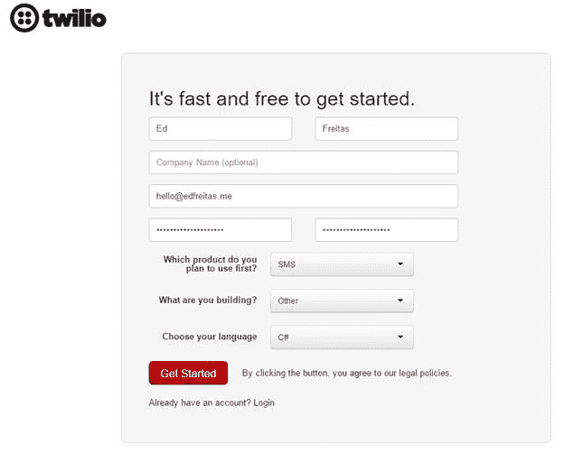

图 1: Twilio 的注册页面

如您所见，注册页面相当简单。您需要提供您的名字、姓氏、可选的公司名称、电子邮件地址和强密码(必须输入两次)。

Twilio 还要求提供更多信息，以便了解您最初将在他们的平台上尝试什么样的应用程序或项目。填写完详细信息后，您只需点击“开始”。

## 购买 Twilio 号码

当您的 Twilio 帐户准备就绪时，您需要先购买一个处置电话号码，然后才能发送短信。

为了向您的账户添加资金，您需要访问此[网址](https://www.twilio.com/user/billing)。首先，单击升级到完整帐户。然后，要添加基金，请单击红色链接的广告基金。

您可以选择使用信用卡或贝宝账户支付。最低起始余额为 20 美元。


图 2: Twilio 的计费概述页面

有了账户里的资金，让我们看看如何获得一个号码。这将是一个真实的电话号码，你可以随时处置。你可以选择你的号码属于哪个国家和城市。

为了做到这一点，当你点击购买号码时，将你的浏览器指向这个[网址](http://twiliosuccinctly.azurewebsites.net/)，t 


当您点击购买号码时，您将看到一个弹出屏幕，如图 4 所示。

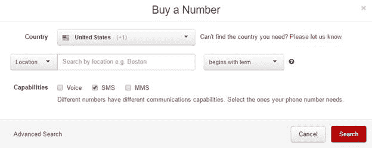

图 4:购买号码弹出屏幕

在这里，您可以选择从哪个国家购买号码以及具体位置。

您还可以指明该号码是仅用于短信，还是也用于语音和彩信。

您的号码，您将看到一个屏幕，显示最近创建的号码。

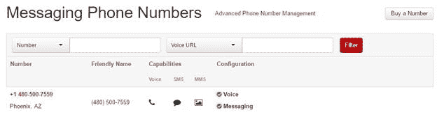

图 5:购买的 Twilio 号码列表

我们现在准备使用 Visual Studio 安装 Twilio API 帮助程序库。

## 安装 Twilio API 帮助器库

为了开始编码，我们需要创建一个 Visual Studio 控制台应用程序。在 Visual Studio 2015 中，依次转到文件、新建和项目。您将看到如图 6 所示的屏幕。选择控制台应用程序，并简洁地命名它。

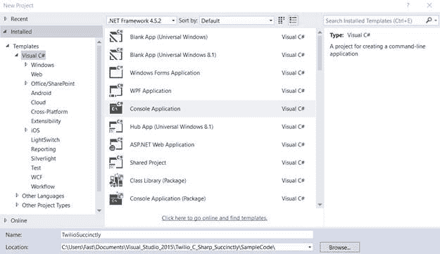

图 6:新的 Visual Studio 控制台应用程序

随着 Visual Studio 项目的创建，让我们添加两个类——一个名为`TwilioCore`，另一个名为`TwilioExample`，它们将作为`TwilioCore`的包装器。该项目应该如图 7 所示。

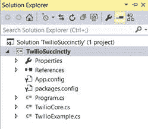

图 7:简洁的项目结构

接下来，让我们添加 Twilio API 帮助程序库，它在 NuGet 上可用。为此，右键单击`TwilioSuccinctly`项目，然后单击管理 NuGet 包。

在搜索框中键入 Twilio，并从返回的结果中选择 Twilio REST API 帮助程序库进行安装。

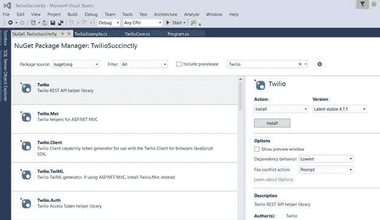

图 NuGet 上的 Twilio REST API 帮助程序库

安装了 Twilio API 助手库后，我们就可以开始编写代码了。

## 发送短信

应用程序将有一个名为`TwilioSuccinctly` `, that` 的命名空间，由两个类组成:`TwilioCore`和`TwilioExample`。

`TwilioCore`类将从`IDisposable`继承，并将包含直接处理 Twilio API 帮助程序库的所有逻辑。

`TwilioExample`类只是一个包装器，用于使用`TwilioCore`对象实现用例。

现在我们来实现 `TwilioCore`类。我们将实现核心类功能和一个负责发送短信的方法`SendSms`。

代码清单 TwilioCore 类

```
  using System;
  using Twilio;

  namespace TwilioSuccinctly
  {

  public class TwilioCore : IDisposable

  {

  protected bool
  disposed;

  public string SID

  {

  get;

  set;

  }

  public string aTk

  {

  get;

  set;

  }

  public TwilioCore()

  {

  SID = string.Empty;

  aTk = string.Empty;

  }

  public TwilioCore(string p1, string p2)

  {

  SID = p1;

  aTk = p2;

  }

  ~TwilioCore()

  {

  Dispose(false);

  }

  public virtual void Dispose(bool disposing)

  {

  if (!disposed)

  {

  if (disposing)

  {

  }

  SID = string.Empty;

  aTk = string.Empty;

  }

  disposed = true;

  }

  public void
  Dispose()

  {

  Dispose(true);

  GC.SuppressFinalize(this);

  }

  public Message SendSms(string from, string to, string msg)

       {

  if (SID != string.Empty && aTk != string.Empty)

  {

  TwilioRestClient client = new TwilioRestClient(SID, aTk);

  return client.SendMessage(from, to, msg);

  }

  else

  return null;

  }

  }
  }

```

让我们详细研究一下这门课。为了使用 Twilio API 助手库，我们需要包含`Twilio`命名空间。

`TwilioCore`继承自`IDisposable`接口，这意味着我们可以创建一个`TwilioCore`的实例，如果它在`using`语句中被调用，我们可以在以后自动处理它。这非常方便——它帮助我们编写干净的代码。

为了进行身份验证，Twilio 需要一个帐户 SID 和一个授权令牌(授权令牌)。

这些已经被添加到`TwilioCore`类中，作为一个构造函数的参数，也作为两个公共属性分别被称为`SID`和`aTk`。账户号和授权令牌可以在[网址](http://bit.ly/1UtECxw)找到。为了查看它们，您需要单击显示 API 凭证，如图 9 所示。


图 9: Twilio 应用编程接口凭据页面

到目前为止，实际的`TwilioCore`类非常简单。有两个构造函数，一个没有参数，没有给`SID`和`aTk`属性赋值，另一个初始化这两个属性。其余的由处置机制的实现和调用 Dispose 方法的类析构函数组成。

`SendSms`法特别有意思。这个方法返回一个`Message`对象，它是 Twilio API 帮助程序库命名空间的一部分。为了让`SendSms`做任何事情，`SID`和`aTk`属性都需要赋值。

`SendSms`方法使用 [RestSharp](http://restsharp.org/) 库创建`TwilioRestClient`的实例，该实例是 Twilio API 的包装器。为了发送短信，执行对`SendMessage`方法的调用。

`SendMessage`方法需要三个参数。第一个参数`from`是发送消息的号码。第二个参数`to`是接收它的号码。第三个参数`msg`是消息的实际文本。

既然我们已经看到了`TwilioRestClient`类允许我们发送短信有多容易，那么让我们写一个适当的例子。为了做到这一点，我们将实现`TwilioExample`类。

代码清单 TwilioExample 类

```
  using System;
  using Twilio;

  namespace TwilioSuccinctly
  {

  public class TwilioExample

  {

  // Your Twilio
  AccountSID 

  private const string cStrSid = 

  "<<Your
  Twilio Account SID goes here>>";

  // Your Twilio
  AuthToken

  private const string cStrAuthTk = 

  "<<Your
  Twilio Auth Token goes here>>";

  // Change these numbers
  to the ones you own...

  private const string cStrSender = "<< Your Twilio
  Number>>";

  private const string cStrReceiver = "+16500000000";

  public static Message SendSimpleSmsExample()

  {

  Message m = null;

  Console.WriteLine("Twilio
  SendSimpleSmsExample");

  using (TwilioCore tc = new TwilioCore(cStrSid, cStrAuthTk))

  {

  m = tc.SendSms(cStrSender, cStrReceiver, 

  "This is a test SMS");

  // Use C# 6
  interpolated string.

  Console.WriteLine($"The status of SMS is: {m?.Status}");

  }

  return m;

  }

  }
  }

```

静态方法`SendSimpleSmsExample`创建一个传递帐户 SID `cStrSId`和授权令牌`cStrAuthTk`的`TwilioCore`类的实例，然后使用发送者`cStrSender`和接收者`cStrReceiver`的电话号码调用方法`SendSms`。

我们现在只缺少主程序对`SendSimpleSmsExample`的调用。这在代码清单 3 中实现。

代码清单 3:主程序

```
  using System;

  namespace TwilioSuccinctly
  {

  public class Program

  {

  static void
  Main(string[] args)

  {

  TwilioExample.SendSimpleSmsExample();

  Console.ReadLine();

  }

  }
  }

```

运行这段代码会产生如图 10 所示的输出。

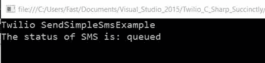

图 10:发送简单示例方法的输出

请注意，输出描述了短信的状态已排队。这意味着 Twilio 已经将短信放在队列中等待发送。

如果您要发送消息的目的号码是国际(非美国)号码，您需要启用某些权限才能允许 Twilio 执行该操作。这些权限可以在这个[网址](https://onedrive.live.com/redir)进行检查和配置。

## 追踪短信

到目前为止，我们已经探索了如何发送短信。但是我们怎么追踪它呢？

如果我们看一下`SendSimpleSmsExample`的实现，可以看到返回了一个`Message`对象。该对象包含一个`Status`属性，指示消息是“排队”还是“传递”

通常需要几秒钟(两到五秒钟)的时间，状态才会从“已排队”变为“已发送”，即使接收方可能已经收到了短信。

请注意，`Status`值“排队”或“交付”被引用，因为它在内部表示为字符串。

Twilio 非常有效—如果您的消息已经排队，它很可能会被传递。尽管如此，核实信息确实得到有效传递仍然是有用的。

让我们探索如何检查这一点。让我们给`TwilioCore`类添加一个检查短信状态的方法。

代码清单 TwilioCore 检查状态方法

```
  public Message CheckSmsStatus(string sid)
  {

  if (SID != string.Empty && aTk != string.Empty)

  {

      TwilioRestClient client = new TwilioRestClient(SID, aTk);

  return client.GetMessage(sid);

  }

  else

      return null;
  }

```

`CheckSmsStatus`方法通过从`TwilioRestClient`实例调用`GetMessage`来检查短信状态。

`GetMessage`方法需要我们要检查的消息的短信 ID `sid`。这就是为什么`TwilioCore`类的`SendSms`方法返回一个`Message`对象的原因——这样我们就可以从中获得短信标识。

接下来，让我们在`TwilioExample`类中实现一个例子，在`SendSms`周围添加一个`CheckSmsDelivered`包装器方法。

代码清单 TwilioExample CheckSmsDelivered 包装方法

```
  public static bool CheckSmsDelivered(string mid)
  {

  bool res = false;

  using (TwilioCore tc = new TwilioCore(cStrSid, cStrAuthTk))

  {

      Message m = tc.CheckSmsStatus(mid);

  res = (m?.Status == "delivered") ? true
  : false;

  }

  return res;
  }

```

功能非常简单。这个方法创建一个`TwilioCore`类的实例，然后调用`CheckSmsStatus`。通过检查`CheckSmsStatus`归还的`Message`物品的`Status`财产价值来确定状态。

如果`Status`属性的值为“已送达”，`CheckSmsDelivered`返回`true`，确认消息已送达。与此相反，`CheckSmsDelivered`返回`false`。

正如我们所看到的，Twilio 通常需要 2 到 5 秒的时间将 Status 属性的值从“排队”更新为“已送达”现在，让我们在主程序中实现一个在调用`CheckSmsDelivered`时考虑到这一点的方法。

代码清单 6:调整后的主程序

```
  using System;
  using System.Threading;
  using Twilio;

  namespace TwilioSuccinctly
  {

  public class Program

  {

  static void Main(string[]
  args)

  {

  SendSimpleSmsAndCheckIfDeliveredExample();

  Console.ReadLine();

  }

  public static void
  SendSimpleSmsAndCheckIfDeliveredExample()

  {

  Message m = TwilioExample.SendSimpleSmsExample();

  if (m != null)

  {

  Thread.Sleep(5500);

  bool res = TwilioExample.CheckSmsDelivered(m.Sid);

  Console.WriteLine($"SMS {m.Sid} delivered: {res}");

  }

  }

  }
  }

```

我们包含了一个名为`SendSimpleSmsAndCheckIfDeliveredExample`的新方法，该方法从`TwilioExample`包装类调用`SendSimpleSmsExample`，然后，如果返回的`Message`对象的值不为空，在调用`Thread.Sleep`之前等待 5.5 秒，然后调用`CheckSmsDelivered`。

运行这段代码会产生如图 11 所示的输出。

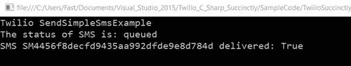

图 11:sendssimplesmsandcheckifdelived 方法的输出

我们已经看到了使用 Twilio 发送和跟踪短信是多么简单和直接。现在让我们探索如何使用这些功能来构建一个简单的 2FA 系统。

## 使用 Authy 设置 2FA

[Authy](https://www.authy.com/) 是一款功能强大且先进的 2FA 解决方案，可加强甚至取代网站、SaaS 产品和移动应用的传统用户名和密码登录。

Authy 使您可以轻松地使用智能手机在您的在线帐户上使用 2FA。

身份验证平台在您的设备上生成安全的两步验证码，因为使用 2FA 有助于通过验证两个身份因素来确保您的用户帐户的安全。它的工作原理是要求你在登录一个网站或应用程序时使用两种不同的东西来识别自己。

大多数登录系统只验证用户已经知道的东西，比如密码。简单来说，2FA 包括注册一次您的手机号码，然后接收一个一次性代码，该代码用于在身份验证时验证您的登录凭据。

验证的第二个因素与你拥有的东西有关(比如你的手机)。所以，你可以认为双因素验证是你知道的东西(你的密码)加上你拥有的东西(你的手机)。同样，增加这一额外的安全层有助于保护您的帐户免受黑客和劫持者的攻击。

授权服务完全集成到 Twilio 平台中，可以通过导航到此[网址](https://www.twilio.com/user/account/authy/getting-started)从您的 Twilio 帐户访问。当您打开该 URL 时，您将看到如图 12 所示的页面。

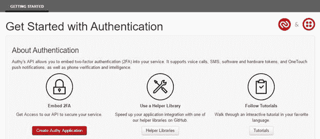

图 12:Twilio Authy 入门页面

要开始，请单击创建授权应用程序。这将把您重定向到图 13 中的授权仪表板。


图 13:授权仪表板页面

这个页面很容易理解——我们只需要创建第一个应用程序就可以开始了。这可以通过点击创建你的第一个应用程序来实现。

当您这样做时，您将看到以下弹出窗口。

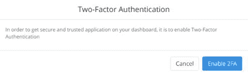

图 14:启用双因素身份验证弹出窗口

要启用 2FA，请单击启用 2FA。这样做将显示图 15 中的弹出窗口。

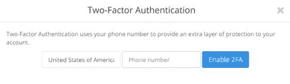

图 15:双因素身份验证弹出窗口的电话号码

在这里，您必须输入一个可以接收短信的有效电话号码。您可以从 Twilio 支持的国家列表中进行选择。默认情况下，国家/地区选项设置为美利坚合众国，但您可以对此进行更改。

您可以提供之前创建的接收短信的 Twilio 一次性号码，也可以使用您拥有的任何可以接收短信的号码。输入号码后，点击启用 2FA，将验证您的身份。

紧接着，Authy 将显示如图 16 所示的弹出窗口。

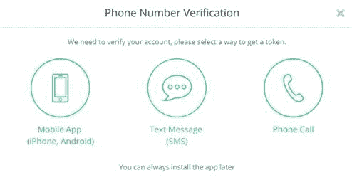

图 16:授权电话号码验证

您可以选择任何首选的号码验证方法，但由于我们正在创建 2FA 短信系统，Twilio 建议您通过短信验证您的号码。

当您点击验证方法时，Authy 将显示如图 17 所示的弹出窗口。

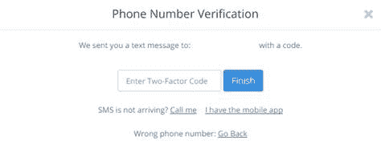

图 17:授权双因素验证码输入

此时，您在向 Authy 注册时使用的电话号码上应该至少收到了一个七位数的验证码。输入该代码，然后单击“完成”。

如果短信没有到达，Authy 会提供一个链接，以便给你打电话，或者让你可以使用他们的手机应用程序。大多数情况下，收到短信后就足够了。

一旦您收到验证，授权仪表板应该显示 2FA 已启用。


图 18:启用 2FA 的授权仪表板

## 创建授权应用

身份验证设置就绪后，下一步是创建身份验证应用程序。你首先需要给它起个名字。这可以通过单击仪表板上的创建您的第一个应用程序来完成。

然后，您将看到以下弹出窗口，允许您输入应用程序的名称。

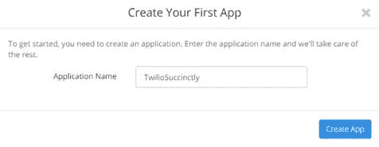

图 19:创建授权应用程序弹出窗口

输入应用程序名称后，单击创建应用程序。您将看到更多的屏幕，您可以跳过其中的一些屏幕，或者只需单击“下一步”。

在这个过程结束时，您将看到要使用的 API 密钥。


图 20:应用程序的授权应用编程接口键弹出窗口

现在有了 API 密钥，我们可以开始用 Visual Studio 设置 Authy 了。为此，请在 Visual Studio 中右键单击您的项目，然后选择“管理”“获取包”。在搜索框中，键入 Authy.Net。您将看到如图 21 所示的屏幕。

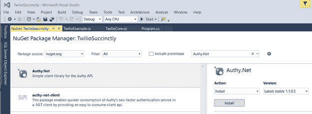

图 21:搜索 Authy.Net 的结果

单击安装将安装 Authy.Net。Auth.Net 套餐也可以在这里买到。

现在是时候重新编码了。我们将扩展最初的`TwilioCore`和 **`TwilioExample`** 类，并添加 Authy 2FA 功能。

## 注册授权收件人

为了通过短信接收验证令牌，需要注册用户(收件人)的手机号码。您可以通过授权仪表板或通过代码来实现这一点。

让我们修改`TwilioCore`类，以便添加一个注册用户号码的方法。

代码清单 7:带有 RegisterUser 方法的 TwilioCore 类

```
  using System;
  using Authy.Net;

  namespace TwilioSuccinctly
  {

  public class TwilioCore : IDisposable

  {

  protected bool
  disposed;

  public TwilioCore()

  {

  }

  ~TwilioCore()

  {

  Dispose(false);

  }

  public virtual void Dispose(bool disposing)

  {

  if (!disposed)

  {

  if (disposing)

  {

  }

  }

  disposed = true;

  }

  public void
  Dispose()

  {

  Dispose(true);

  GC.SuppressFinalize(this);

  }

  public RegisterUserResult RegisterUser(string
  apikey, string 

  uemail, string unumber, int cc, bool tmode)

  {

  if (apikey != string.Empty && uemail != string.Empty && 

  unumber != string.Empty)

  {

  AuthyClient client = new AuthyClient(apikey, tmode);

    return client.RegisterUser(uemail,
  unumber, cc);

  }

  else

  return null;

  }

  }
  }

```

`RegisterUser`方法很简单。它接收授权应用编程接口密钥`apikey`、收件人的电子邮件`uemail`、收件人的手机号码`unumber`和国家代码`cc`作为参数。最后一个参数`tmode`表示是否使用测试模式(设置为 **`true`** )或者是否使用生产模式(设置为 **`false`** )。

将`tmode`设置为 **`true`** 时，需要使用验证 API 密钥进行测试。如果你想在生产中使用这个(当`tmode`设置为 **`false`** 时)，你需要使用生产的应用编程接口密钥。两者都可以在 Authy 仪表板上找到。


图 22:授权生产和测试应用编程接口密钥

`RegisterUser`方法首先验证`apikey`、`uemail`和`unumber`不是空字符串，然后通过传递`apikey`和`tmode`创建一个`AuthyClient`的实例。为了注册用户，调用通过`uemail`、`unumber`和`cc`的方法`RegisterUser`。

有了这个，让我们为它创建一个包装器，稍后可以在主`program`中使用。让我们修改`TwilioExample`类并添加一个`RegisterUser`包装方法。

代码清单 8:twilio 示例中的 RegisterUser 包装方法

```
  using System;
  using Authy.Net;

  namespace TwilioSuccinctly
  {

  public class TwilioExample

  {

  public static RegisterUserResult RegisterUser(string apikey, 

  string uemail, string unumber, int cc, bool tmode)

  {

  RegisterUserResult res = null;

  using (TwilioCore tc = new TwilioCore())

  {

  res = tc.RegisterUser(apikey, uemail, unumber, cc, 

  tmode);

  }

  return res; 

  }

  }
  }

```

`RegisterUser`包装器方法的实现也非常简单。本质上，这里也使用了`TwilioCore` `RegisterUser`方法中使用的相同参数。

创建`TwilioCore`类的实例并调用`RegisterUser`方法。该调用返回的结果是一个`RegisterUserResult`对象，稍后将用于获取`UserId`。发送验证码需要`UserId`。

## 短信验证码

在`TwilioCore`和`TwilioExample`类上都实现了`RegisterUser`方法，下一步是创建一个方法，我们可以使用该方法将验证令牌作为短信发送。

我们也将分两步完成，在`TwilioCore`类上创建一个`SendSms`方法，在`TwilioExample`类上创建一个`SendSms`包装方法。

让我们实现`TwilioCore`类的`SendSms`方法。

代码清单 TwilioCore 类的发送短信令牌验证方法

```
  public SendSmsResult SendSms(string apikey, string userid, bool tmode)
  {

  if (apikey != string.Empty && userid != string.Empty)

  {

      AuthyClient client = new AuthyClient(apikey, tmode);

  return client.SendSms(userid);

  }

  else

      return null;
  }

```

该方法采用`apikey`、`userid`和`tmode`参数。如果`apikey`和`userid`不是空字符串，则会创建一个`AuthyClient`实例，然后通过传递`userid`立即调用`SendSms`。结果然后作为`SendSmsResult`对象返回给调用方法。

接下来，让我们在`TwilioExample`类中创建包装器方法。

代码清单 TwilioExample 类的发送短信包装方法

```
  public static SendSmsResult SendSms(string apikey, string
  userid, bool 

  tmode)
  {

  SendSmsResult res = null;

  using (TwilioCore tc = new TwilioCore())

  {

  res = tc.SendSms(apikey, userid, tmode);

  }

  return res;
  }

```

包装器方法的实现也非常简单。创建`TwilioCore`类的实例，并使用`apikey`、`userid`和`tmode`参数调用`TwilioCore` `SendSms`方法。一个`SendSmsResult`对象被返回到调用方法，然后将被用来检查验证码是否被成功发送。

有了这些，为了测试我们所做的工作，现在让我们创建一个方法，在我们的主程序中注册一个接收者并发送短信验证码。

代码清单 11:主程序

```
  using Authy.Net;
  using System;

  namespace TwilioSuccinctly
  {

  public class Program

  {

  private const string cStrAuthyKey = 

  "<<Your
  Authy Production API Key>>";

  public static void SendSmsAndVerifyToken()

  {

  RegisterUserResult user = 

  TwilioExample.RegisterUser(cStrAuthyKey, 

  "hello@edfreitas.me", "+16500000000", 1, false);

  if (user != null)

  {

  SendSmsResult smsRes = 

  TwilioExample.SendSms(cStrAuthyKey,
  user.UserId, false);

  if (smsRes.Success)

  {

  Console.WriteLine("Please introduce your
  verification 

  token: ");

  string tk = Console.ReadLine();

  if (tk != string.Empty)

  {

  AuthyResult res = 

  TwilioExample.VerifyToken(cStrAuthyKey, 

  user.UserId, tk, false);

  Console.WriteLine($"Status {res.Status} message: 

  {res.Message}");

  }

  }

  }

  }

  static void
  Main(string[] args)

  {

  SendSmsAndVerifyToken();

  Console.ReadLine();

  }

  }
  }

```

`main`方法调用从`TwilioExample`类调用`RegisterUser`方法的`SendSmsAndVerifyToken`方法。如果返回的`RegisterUserResult`对象不是`null`，将调用`SendSms`方法。

`TwilioExample`类的`SendSms`方法返回一个`SendSmsResult`对象，该对象有一个名为`Success`的属性，当设置为 **`true`** 时，表示验证令牌已经通过短信发送。

请注意，`RegisterUser`和`SendSms`方法上的`tmode`参数被设置为`false`，这表明 Authy 正在等待生产 API 密钥。

当我们稍后运行该程序时，收件人用户将被注册并显示在授权仪表板上。


图 23:授权仪表板上的注册用户

请注意，在我们的主`program`代码中，调用`SendSms`后，我们请求用户输入收到的验证码，以便我们检查。

这个验证可以用`VerifyToken`方法完成。让我们看看这个方法在`TwilioExample`类中的实现。

代码清单 TwilioExample 验证令牌包装方法

```
  public static VerifyTokenResult VerifyToken(string apikey, string
  userid, string token, bool tmode)
  {

  VerifyTokenResult res = null;

  using (TwilioCore tc = new TwilioCore())

  {

      res = tc.VerifyToken(apikey, userid, token, tmode);

  }

  return res;
  }

```

这个方法创建一个`TwilioCore`类的实例，然后从同一个实例中调用`VerifyToken`方法。返回的结果是一个`VerifyTokenResult`对象。

现在让我们检查一下`TwilioCore`类中的`VerifyToken`方法实现。

代码清单 TwilioCore 验证令牌方法

```
  public VerifyTokenResult VerifyToken(string
  apikey, string userid, string token, bool tmode)
  {

  if (apikey != string.Empty && userid != string.Empty && token != 

  string.Empty)

  {

      AuthyClient client = new AuthyClient(apikey, tmode);

  return client.VerifyToken(userid, token);

  }

  else

      return null;
  }

```

该方法检查`apikey`、`userid`、`token`和`tmode`是否不是空字符串。注意`token`是用户通过短信收到的值。我们将验证它是否正确——这是将 Authy 与 2FA 一起使用的目的。

令牌本身的验证是通过创建`AuthyClient`类的实例并从中调用`VerifyToken`方法来完成的。

当我们运行主`program`时，会产生如图 24 所示的结果。请注意，当您运行自己的示例时，您将收到一个不同于图 24 中输出截图上显示的验证码。

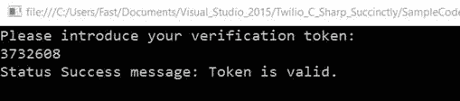

图 24:主授权应用程序的输出

## 总结

在这一章中，我们已经探讨了如何容易获得一个 Twilio 和 Authy 帐户的启动和运行。我们还看到了如何使用标准的 Twilio API 发送短信，以及如何使用 Authy 发送短信，从而实现 2FA。

由于 Twilio 通过创建友好、简单和可接近的 API 库来包装这些服务的复杂性，所以过程和代码非常简单且易于遵循。实施 Twilio 解决方案是一种令人愉快的体验。

在这一点上，您还应该对如何使用 Twilio 发送短信以及通过使用 C#助手库来启用带有 Authy 的 2FA 有一个相当好的了解。

在接下来的章节中，我们将探索 Twilio 提供的更多功能，包括处理呼叫和其他有用的支持语音的应用程序。