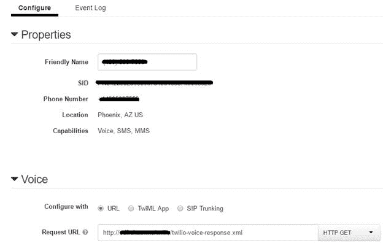
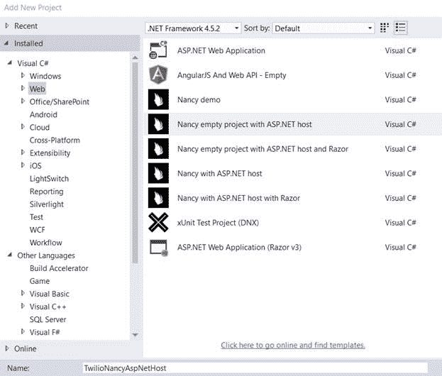
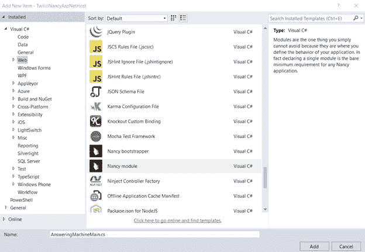
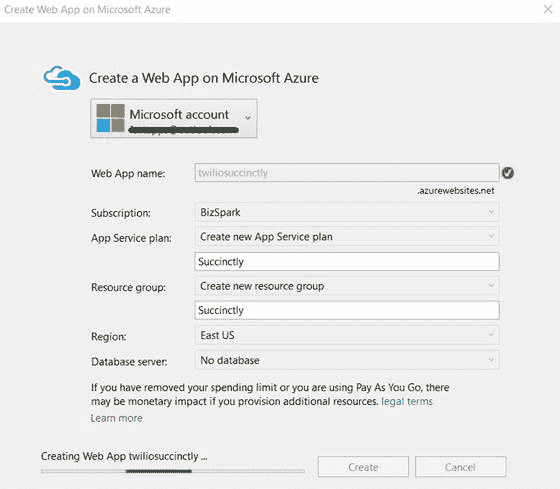
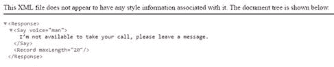
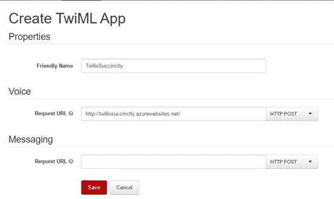
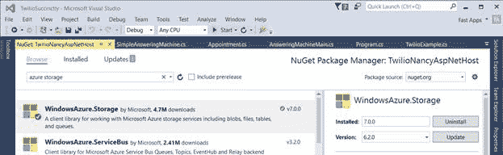
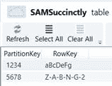

# 第三章接打电话

## 简介

我们已经看到，Twilio 是一个简单而强大的平台，用于支持短信通信，使用短信自动执行某些业务流程，甚至通过 2FA 进行身份验证。

然而，我们只是开始触及 Twilio 的表面。该平台最基本和最强大的功能之一是其接收、拨打和处理电话以及构建支持语音的应用程序的能力。

您可能熟悉类似[【powwnow】](http://www.powwownow.com/)[WebEx](https://www.webex.com/)或 [GotoMeeting](https://www.gotomeeting.com/) 的服务，这些服务允许您拨打电话会议号码、设置虚拟会议室以及与其他人通话。你可能也很熟悉自动电话菜单系统，在该系统中，你拨打银行或航空公司的电话，并被要求按 1、2 或 3 来做 X、Y 或 z。我们都去过那里，不是吗？

Twilio 允许我们开发人员构建任何这些专门定制的服务来满足我们自己的需求，而不需要太多的努力，也不会掏空我们的口袋。然而，我们必须谨慎对待我们正在建设的项目以及可能产生的潜在成本。也就是说，Twilio 几乎总是比我们自己构建整个电话基础设施更便宜。

Twilio 负责电话网络基础设施，并从我们的开发中完全抽象出这种复杂性。我们所要做的就是专注于我们的业务逻辑，让 Twilio 处理电话系统和协议的内部工作。

在本章和下一章中，我们将探讨如何利用 Twilio 语音 API 的强大功能。我们还将使用一种名为 TwiML 的 XML 标记语言，它使创建支持语音的响应变得容易。我们将了解在 Twilio 上使用语音功能的基础知识，处理来电和拨出电话，以及创建简单的应答机。

到本章结束时，您应该已经掌握了解决这些问题的技巧，以及使用 Twilio 和 TwiML 创建支持语音的响应和应用程序的基础知识。

在第 4 章中，我们将了解 Twilio 支持语音功能的更高级的问题，例如交互式电话菜单、会议和自动语音调查。

这些例子应该很容易理解，也很有趣。

## TwiML

为了使用 Twilio 轻松创建语音响应，您可以使用一种名为 Twilio 的 XML 标记语言，这只是一组指令，您可以使用它们来告诉 Twilio 在收到来电或短信时该做什么。

当您在您的 Twilio 号码上收到短信或电话时，Twilio 将获取与您的 Twilio 电话号码相关联的网址，并对该网址执行 HTTP(S)请求。该网址将包含一个带有标记指令的 XML 响应，指示 Twilio 需要执行哪些任务。这些任务中的一些将记录呼叫、播放消息、提示呼叫者输入一些数字等。

让我们在代码清单 20 中探索一个快速的例子。

代码清单 20: TwiML 示例

```
  <?xml
  version="1.0" encoding="UTF-8"?>
  <Response>
  <Say voice="man">I’m not available to take
  your call, please leave a message.</Say>
  <Record maxLength="20" />
  </Response>

```

如您所见，告诉 Twilio 使用 TwiML 执行特定的操作相对简单。标记语言由用蓝色突出显示的动词组成，表示 Twilio 将执行的动作。

在撰写本文时可用的一些 TwiML 动词有:`Say`、`Play`、`Dial`、`Record`、`Gather`、`Sms`、`Hangup`、`Queue`、`Redirect`、`Pause`、`Conference`、`Reject`和`Message`。

如何使用这些 TwiML 动词的完整细节可以在[这里](https://azure.microsoft.com/en-us/documentation/services/storage/)找到。

## 接听来电

让我们来看看使用 TwiML 处理来电的过程。

您需要提供一个可公开访问的网址，您的 TwiML XML 标记文件将被托管在这个网址上。Twilio 允许你为语音和短信应用程序都有一个默认响应的 TwiML 文件。这些可以托管在您自己的网络服务器上，甚至可以托管在亚马逊 S3 或 Azure 网站等服务上，这些服务可以托管静态资源。

您可以在您的 Twilio 帐户内的语音号码[仪表盘](https://azure.microsoft.com)上配置这些网址，然后单击您各自的 Twilio 号码。这将引导您找到您的 Twilio 号码的属性，您可以在其中设置语音响应的请求网址。



图 40:语音响应的 TwiML 网址

我们将在代码清单 21 中使用 TwiML 创建一个快速的语音响应，向呼叫者打招呼并指示发送一条 WhatsApp 消息或写一封电子邮件。

代码清单 21: TwiML 呼叫者问候响应

```
  <?xml
  version="1.0" encoding="UTF-8"?>
  <Response>
  <Pause length="1"/>
  <Say voice="man">Hello.</Say>
  <Say voice="man">You've reached Ed's
  phone.</Say>
  <Say voice="man">I cannot take your call
  now.</Say>
  <Say voice="man">
  Please
  send a Whats App message, to this same number.
  </Say>
  <Pause length="1"/>
  <Say voice="man">You may also contact me at</Say>
  <Say voice="man">hello, at</Say>
  <Say voice="man">ed freitas dot me</Say>
  <Pause length="1"/>
  <Say voice="man">Thank you.</Say>
  <Say voice="man">Have a great day.</Say>
  </Response>

```

请注意，通过使用多个`Say`动词以及中间的一秒`Pause`动词，响应被分解成了几个部分。发生这种情况是因为 Twilio 使用文本到语音引擎，以便向呼叫者读出书写的文本。

为了让这种体验看起来尽可能像是一个人在接听电话，重要的是分部分传递信息，并有必要的停顿。还要注意句子不长，使用了标点符号。

要做出“完美”的 TwiML 文本到语音响应，没有经验法则。为了让这个声音听起来不像一台机器，你可能不得不玩一会儿，直到你得到你喜欢的回应声音。

TwiML 是一个很好的资源，它允许我们在不需要编程的情况下快速添加语音功能。但是，因为响应是基于 XML 标记的，所以它们需要静态托管或嵌入到服务器端软件(如 PHP 或 ASP.NET)中。

TwiML 作为一种标记语言的局限性之一是它不允许使用变量，所以如果我们想要没有预定义的响应，我们必须在服务器上动态构建 XML，然后将其作为响应返回。

我们可以通过创建定制的 TwiML 响应来解决这个问题。让我们探索如何。

## 简易应答机

在探索了 TwiML 的一些基础知识之后，让我们创建一个简单的应答机，它将根据呼叫者在呼叫被应答后键入的数字向呼叫者提供特定的指令。

我们将创建一个`SimpleAnsweringMachine`类，它将包含我们的应答机应用程序所需的逻辑。

由于 TwiML 需要一个 URL 端点，我们将创建一个 [NancyFX](http://nancyfx.org/) 应用程序，我们可以将其部署为 Azure [网站](https://azure.microsoft.com/en-us/services/app-service/web/)。

如果你想了解更多关于 NancyFX 的深入信息，Syncfusion 有一个完全专用的[电子书](https://www.twilio.com/user/account/messaging/dashboard)，这是一个关于框架及其功能的很好的资源。请随意看一看。

为了创建一个 NancyFX 应用程序，首先要确保为 Visual Studio 安装 [SideWaffle 模板包。侧壁安装程序很容易理解，只需点击几下鼠标。](https://www.twilio.com/user/account/messaging/phone-numbers)

安装完 walkeffle 后，您可以通过选择带有 ASP.NET 主机的 *Nancy 空项目*来创建一个名为*twilionancyasspnethost*的新 NancyFX 项目，如图 41 所示。



图 41:创建一个新的 NancyFX 项目

创建项目后，下一步是创建一个 NancyFX 模块，它只是一个标准的 C#类。在图 42 中，我们将这个模块称为*应答机器内存*。



图 42:创建新的 NancyFX 模块

虽然不太可能，但是如果由于某种原因在您的*twilionancyasspnethost*项目中找不到您的 NancyFX 引用，请使用 NuGet 包管理器检查任何新的更新。

我们的*应答机器输入*模块将包含 HTTP REST 端点，用于向调用者发送正确的响应。为了测试这是否可行，我们可以将代码包含在代码清单 22 中。

代码清单 22: TwiML 呼叫者问候响应

```
  using Nancy;

  namespace TwilioNancyAspNetHost
  {

  public class AnsweringMachineMain : NancyModule

  {

  public AnsweringMachineMain()

  {

  Get["/"] = _ =>

  {

  return Response.AsText(

  "<Response>" +

  "<Say
  voice=\"man\" > I’m not available to take 

  your call, please leave a message.</Say>" +

  "<Record
  maxLength=\"20\" />" +

      "</Response>",

  "text/xml"

  );

  };

  }

  }
  }

```

为了检查我们的 REST 端点是否可以公开访问，我们可以使用 Visual Studio 中的发布选项将 NancyFX 应用程序部署到 Azure 网站。



图 43:将 NancyFX 应用程序部署到 Azure 网站

输入请求的详细信息，单击创建，并按照交互式向导中的步骤操作。只需点击几下鼠标，该解决方案就可以部署到 Azure 并投入使用。

网站应该可以通过这个[网址](https://www.syncfusion.com/resources/techportal/details/ebooks/nancyfx)进入。在这里，您应该会看到图 44 中描述的内容。



图 44:Nancy FX 应用程序的 TwiML 响应

随着 NancyFX 应用程序的启动和运行，接下来我们将连接 Twilio 号码，指向运行在 Azure 上的 NancyFX 应用程序。

为此，我们需要进入 Twilio 号码的[仪表盘](https://azurestorageexplorer.codeplex.com/)，然后点击我们想要链接的号码。您将被要求创建一个新的 TwiML 应用程序。



图 45:创建新的 TwiML 应用程序

输入 TwiML 应用程序的名称(您可以指定任何您想要的名称)，最重要的是，指出语音请求网址，这是从我们的 NancyFX 应用程序返回 TwiML 响应的网址。提供这些详细信息后，单击保存。

为了测试这一切是否有效，只需拿起你的电话，拨打你的 Twilio 号码。如果你听到的是你在 NancyFX XML 响应中键入的相同消息，那没关系。

设置和布线就绪后，我们现在可以专注于添加所需的功能，以扩展我们的应答机应用程序的功能。

应用程序应该快速问候调用者，并要求他们输入访问代码，以便返回一个要存储在名为 sam 简洁的 Azure 存储表上的秘密代码。

因为我们的 NancyFX (Azure 网站)应用程序将使用 Azure Storage，所以不要忘记从 NuGet 安装软件包。



图 46:为我们的 NancyFX 应用程序安装的 Azure 存储 NuGet 包

我们现在可以使用 Azure 存储资源管理器简单地创建我们的表，如图 47 所示。让我们将访问码存储为`PartitionKey`，将密码存储为`RowKey`。



图 47:Azure 上简洁的表格

我们可以使用下面的 TwiML 标记来问候调用者并询问他们的访问代码。

代码清单 23:我们应用程序的 TwiML 标记问候语

```
  <?xml
  version="1.0" encoding="UTF-8"?>
  <!--
  page located at http://twiliosuccinctly.azurewebsites.net/ -->
  <Response>

  <Gather action="/sam"
  method="GET">

  <Say>

  Please enter your access code,

  followed by the pound sign.

  </Say>

  </Gather>

  <Say>We didn't receive any access code.
  Bye.</Say>
  </Response>

```

请注意，这个负责收集访问代码的问候响应位于网站的根目录([http://twiliosuccinctly.azurewebsites.net/](https://www.twilio.com/docs/api/twiml))上。但是，行动响应可在/Sam([http://twiliosuccinctly.azurewebsites.net/sam](https://www.twilio.com/docs/api/twiml/conference)上获得。

现在，让我们实现我们的`SimpleAnsweringMachine`类。

代码清单 24:简单应答机器类

```
  using System;
  using Microsoft.WindowsAzure.Storage;
  using
  Microsoft.WindowsAzure.Storage.Table;

  namespace TwilioSuccinctly
  {

  public class SimpleAnsweringMachineData : TableEntity

  {

  public SimpleAnsweringMachineData(string p, string d)

  {

  PartitionKey = p;

  RowKey = d;

  }

  public SimpleAnsweringMachineData()

  {

  }

  }

  public class SimpleAnsweringMachine : IDisposable

  {

  protected bool
  disposed;

  private const string cStrConnStr = 

  "<< Your Azure Storage Connection String >>";

  private const string cStrAppTable = "SAMSuccinctly";

          public SimpleAnsweringMachine()

  {

  }

  ~SimpleAnsweringMachine()

  {

  Dispose(false);

  }

  public virtual void Dispose(bool disposing)

  {

  if (!disposed)

  {

  if (disposing)

  {

  }

  }

  disposed = true;

  }

  public void
  Dispose()

  {

  Dispose(true);

  GC.SuppressFinalize(this);

  }

  public string Get(string ac)

  {

  string res = string.Empty;

  try

  {

  var storageAccount = 

  CloudStorageAccount.Parse(cStrConnStr);

  CloudTableClient tableClient = 

  storageAccount.CreateCloudTableClient();

  CloudTable table = 

  tableClient.GetTableReference(cStrAppTable);

  TableQuery<SimpleAnsweringMachineData> query = new 

  TableQuery<SimpleAnsweringMachineData>().Where(

  TableQuery.GenerateFilterCondition("PartitionKey", 

  QueryComparisons.Equal, ac));

  foreach (SimpleAnsweringMachineData en in

  table.ExecuteQuery(query))

  {

  res = en.RowKey;

  break;

  }

  }

  catch (Exception ex)

  {

  Console.WriteLine(ex.ToString());

  }

           return (res == string.Empty) ? "Unknown" : res;

  }

  }
  }

```

我们的`SimpleAnsweringMachine`课其实很简单。它有一个`Get`方法，该方法使用访问代码(由`PartitionKey`表示)简洁地查询表，并返回一个也包含密码的`SimpleAnsweringMachineData`对象。

如您所见，使用 Azure 类简单地查询表看起来类似于我们在上一章中看到的。

现在，在代码清单 25 中，让我们看看扩展我们的`AnsweringMachineMain` NancyFX 模块的特性，这样我们就可以实现我们的`SimpleAnsweringMachine`类公开的功能。

代码清单 25:扩展的应答机器类

```
  using Nancy;
  using TwilioSuccinctly;

  namespace TwilioNancyAspNetHost
  {

  public class AnsweringMachineMain : NancyModule

  {

  public AnsweringMachineMain()

  {

  Get[@"/"] = _ =>

  {

  return Response.AsText(

  "<Response>" + 

  "<Gather
  action=\"/sam\" method=\"GET\">" +

  "<Say
  voice=\"woman\">Please enter your access 

  code, followed by the pound sign.</Say>" +

  "</Gather>" +

  "<Say
  voice=\"woman\">We didn't receive any 

  access code. Bye.</Say>" +

  "</Response>",

  "text/xml"

  );

  };

  Get[@"/sam"] = _ =>

  {

  string sc = "Unknown";

  string ac = Request.Query["Digits"].Value;

  string res = "<Response><Say
  voice=\"woman\">No access 

  code found.</Say>" +

          "</Response>";

  if (ac != null && ac != string.Empty)

  {

  using (SimpleAnsweringMachine sam = new 

  SimpleAnsweringMachine())

  {

  if (Request.Query["Digits"] != string.Empty)

  sc = sam.Get(ac);

  }

  res = "<Response><Say
  voice=\"woman\">You entered: " 

  + ac + "</Say>" +

  "<Say voice
  =\"woman\">Your secret code is: " + 

  sc + "</Say>" +

  "</Response>";

  }

  return Response.AsText(res,"text/xml");

  };

  }

  }
  }

```

我们的`AnsweringMachineMain` NancyFX 模块实现了两个 REST 端点。根/端点向调用者提供问候消息，并通过`Gather` TwiML 动词收集访问代码，这触发了对/sam 端点的操作。

当执行/sam 端点时(一旦调用者输入了访问代码数字并按下井号键)，将创建一个`SimpleAnsweringMachine`类的实例并调用其`Get`方法，传递调用者输入的数字(并存储在 HTTP `Request.Query` 对象中)。

然后`Get`方法简单地查询该表，并返回与被查询的`PartitionKey`(访问码)匹配的`RowKey`(代表密码)。

为了让 NancyFX 应用程序正常运行，需要在 Azure 网站上发布*twilionancyasspnethost*项目。拿起手机，拨打与此 TwiML 应用程序相关的 Twilio 号码，即可轻松测试此应用程序。

您应该能够提供您的访问代码(简单表中存在的两个代码之一)，并获得您的密码作为语音响应。

## 拨打呼出电话

我们已经看到了如何使用 TwiML 接收呼叫和处理语音请求。在结束本章并进入更高级的示例之前，让我们讨论如何使用 Twilio C#助手库进行出站调用。

我们将扩展我们的`TwilioCore`类，并添加一个方法来进行调用。让我们在代码清单 26 中实现这个方法

代码清单 TwilioCore 开始调用方法

```
  public void
  StartCall(string from, string to, string url)
  {

  // SID = Twilio
  AccountSID, aTk = Twilio AuthToken

  if (SID != string.Empty && aTk != string.Empty && from !=  

  string.Empty && to != string.Empty)

  {

      TwilioRestClient client = new TwilioRestClient(SID, aTk);

  client.InitiateOutboundCall(from, to, url);

  }
  }

```

可以看到`StartCall`的方法很简单。它有两个参数:`from`和`to`，分别代表被叫和接收方的电话号码。

第三个参数是一个网址资源，一旦电话被接听，电话另一端的人就会听到。该网址需要返回一个有效的 TwiML 响应。

正如我们一直以来在使用`TwilioCore`类方法时所做的那样，让我们在`StartCall`周围实现一个包装方法，我们可以从`Main program`调用它。

代码清单 StartRecordedCall 调用包装方法

```
  public static void StartRecordedCall()
  {

  using (TwilioCore tc = new TwilioCore(cStrSid, cStrAuthTk))

  {

      tc.StartCall(cStrSender, cStrReceiver, 

  "http://www.edfreitas.me/twilio/sayhello.xml");

  }
  }

```

现在，我们可以把这个方法称为`Main program`。

代码清单 28:从主程序中调用 StartRecordedCall 包装方法

```
  static void
  Main(string[] args)
  {

  TwilioExample.StartRecordedCall();

  Console.ReadLine();
  }

```

执行此代码时，您应该会听到电话号码上的录音，您在`TwilioExample`课程中已将其表示为`cStrReceiver`。

正如我们所看到的，使用 Twilio 拨打呼出电话很容易。只需几行代码，我们就可以开始打电话并播放消息。

如果您要拨打的目的号码是国际(非美国)号码，您需要启用某些权限，以允许 Twilio 执行该操作。这些权限可以在这个[网址](http://twiliosuccinctly.azurewebsites.net/)进行检查和配置。

您还可以修改这段代码，使应用程序能够给出个性化的消息或记录对它的反应。

## 总结

在这一章中，我们已经开始触及 Twilio 支持语音的功能的表面。

我们已经看到了如何接收来电，根据用户的输入给出具体的反馈，以及拨打呼出电话。

我们还看到了如何建立一个快速的 NancyFX Azure 网站，以创建一个简单的应答机。

在下一章中，我们将深入探讨如何使用 Twilio 的语音功能，并创建一些有趣且更高级的示例，这些示例在业务环境中非常有用。