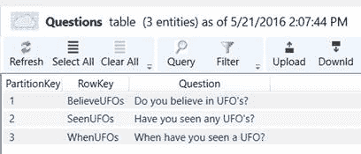

# 第四章使用语音的自动化

## 简介

我们已经探讨了 Twilio 语音功能的基础知识，这有望让您很好地了解如何使用 Twilio 和 C#帮助程序库来创建支持语音的应用程序。

现在，让我们探索如何进一步扩展，并使用 Twilio 的语音功能来自动化业务流程。

我们将主要使用 TwiML 来创建交互式电话菜单、简单的会议服务和令人兴奋的自动语音调查解决方案。

我们还将依赖 Azure 表存储和 Azure 网站，就像在第 3 章中一样，并且因为我们是基于第 3 章的代码，所以这些示例应该很容易理解，实现起来也很有趣。

## 互动电话菜单

交互式电话菜单是一个自动化的电话软件系统，可以促进和协调呼叫者和企业之间的通信。如果你曾经打电话给你的保险公司提出索赔，并回应了一系列自动提示，你已经使用了其中一个系统。

Twilio 使构建这个变得很容易。我们已经在第 3 章通过构建一个简单的应答机探索了一些基础知识。现在，让我们为一个部门位于不同地区的公司创建一个电话菜单系统。该系统将根据来电者输入的数字将来电者与特定部门联系起来。

为了启动电话菜单，我们需要配置我们的 Twilio 号码，以便当我们收到来电时，它会向我们的网络应用程序发送一个 HTTP 请求。我们将使用和修改我们在上一章中创建的现有 NancyFX 应用程序。

首先，我们[配置](https://www.twilio.com/user/account/phone-numbers/incoming)我们的 Twilio 号码，以指向我们的网络应用程序将用于处理来电的特定网址。接下来，我们修改我们简单地称为 TwiML 的 TwiML 应用程序，以指向我们新的传入 URL。该网址应该是我们的 NancyFX 应用程序在 Azure 网站上的位置，后跟/IPM/传入。


图 48:为我们的 TwiML 简洁地修改语音请求 URL

基于图 48，我们将假设我们的电话菜单应用程序将通过这个 REST 端点接收来电:/IPM/inlet。

我们将用它来问候我们的来电者。让我们在`AnsweringMachineMain` NancyFX 模块上添加这个端点逻辑。

代码清单 29:交互式电话菜单问候

```
  //
  In NancyFX, = _ = indicates that no parameters are used for this route.
  Get[@"/ipm/incoming"] = _ =>
  {

  string res = "<Response>" +

  "<Gather
  action=\"/ipm/response\" method=\"GET\">" +

  "<Say
  voice=\"woman\">Welcome to Cool Company.</Say>" +

  "<Say voice=\"woman\">Press
  1 to contact Sales.</Say>" +

  "<Say
  voice=\"woman\">Press 2 to contact Support.</Say>" +

  "<Say
  voice=\"woman\">Press 3 to for general
  inquiries.</Say>" +

  "</Gather>" +

  "<Say
  voice=\"woman\">We didn't get any response. Bye.</Say>" +

  "</Response>";

  return Response.AsText(res, "text/xml");
  };

```

使用 Visual Studio，让我们将 NancyFX 应用程序发布到 Azure 网站。如果我们随后拨打我们的 Twilio 号码，我们现在应该会听到这个回应。万岁！

向前看，TwiML 响应上的`Gather`动词指向另一个端点:/ipm/response。我们将使用这个端点根据调用者输入的信息创建菜单响应。

请注意，我们仍然可以使用和扩展我们的`SimpleAnsweringMachine`类，以便添加我们的电话菜单所需的任何特定逻辑。

让一个方法在字符串中的每个字符后插入一个空格也很有用。这样做是为了让 Twilio 可以逐位读取电话号码，而不是一次读取整个号码。我们稍后会探讨这个问题。

首先，让我们处理调用者的输入，并在我们的`AnsweringMachineMain` NancyFX 模块上创建我们的/IPM/响应端点。

就像我们在第 3 章中对简单的应答机示例所做的那样，我们将在 Azure 上查询 sam 简洁表并检索一个值。

但是，该值将是与用户输入的选项相对应的电话号码。用户输入的数字为`PartitionKey`，检索到的电话号码为`RowKey`。电话号码需要是国际格式，即+14800001111。

让我们使用 Azure 存储资源管理器简单地向表中再添加三行。


图 49:我们菜单系统的三个选项和数字

该电话号码将用于将来电者与公司内的相应部门联系起来。

代码清单 30:交互式电话菜单响应端点

```
  Get[@"/ipm/response"] = _ =>
  {

  string num = "Unknown";

  string ac = Request.Query["Digits"].Value; // Access Code

  string res = "<Response><Say
  voice=\"woman\">No phone number found 

  for that option.</Say>" +

  "</Response>";

  if (ac != null && ac != string.Empty)

  {

      if (ac == "1" || ac == "2" || ac == "3")

  {

      using (SimpleAnsweringMachine sam = new        

  SimpleAnsweringMachine())

  {

      if (Request.Query["Digits"] != string.Empty)

  {

      num = sam.Get(ac);

  res = "<Response><Say
  voice=\"woman\">You entered: " 

  + ac + "</Say>" +

  "<Say
  voice=\"woman\">I'll transfer you now to: 

  " + sam.InsertSpace(num)
  + 

  ", please hold
  on.</Say>" +

  "<Dial
  timeout=\"10\" record=\"false\">" + num 

  + "</Dial>" +

  "</Response>";

  }

  }

  }

  }

  return Response.AsText(res, "text/xml");
  };

```

正如你所看到的，我们又一次建立在我们已经在第三章学到的基础上。

主要区别在于，我们使用动词`Dial`将来电者与他们在电话菜单中输入的选项对应的部门联系起来，而不是使用动词`Say`来提供答案(就像我们在上一章中所做的那样)。

另一个不同之处是，我们现在在`SimpleAnsweringMachine`类中有一个程序定义的`InsertSpace`方法，它在字符串中的每个字符后插入一个空格。这将应用于电话号码，这样 Twilio 就可以一个数字一个数字地读取它，而不是作为一个完整的号码。

我们的`SimpleAnsweringMachine`类中的`InsertSpace`方法的实现类似于代码清单 31。

代码清单 31:插入空间方法

```
  public string InsertSpace(string s)
  {

  string res = string.Empty;

  int count = 1;

  foreach (char
  c in s)

  {

      if (char.IsDigit(c)
  && count < s.Length)

      res += c + "
  ";

  else

      res += c;

  count++;

  }

  return res;
  }

```

如果您现在在 Visual Studio 中将此应用程序发布到 Azure 网站，当您拨打您的 Twilio 号码时，您现在应该会听到电话菜单，能够输入 1、2 或 3，并连接到与所选选项对应的电话号码。由于 Azure 表中存储的数据，这是可能的。

这个例子可以通过更多的交互性进一步改进，但是这超出了我们在这里讨论的范围。但是，我们鼓励您查看 Twilio [文档](http://twiliosuccinctly.azurewebsites.net/sam)，并继续添加更多功能。

让我们建立一些其他很酷的例子。

## 简单会议服务

像[powwnow](https://www.twilio.com/user/account/settings/international)、 [WebEx](https://www.twilio.com/user/account/phone-numbers/incoming) 或 [GotoMeeting](http://www.powwownow.com/) 这样允许您拨打电话会议号码、建立虚拟会议室和与其他人通话的服务被称为会议服务。

Twilio 还允许我们构建这类服务。我们将探讨如何设置小型会议应用程序的基础知识。

首先，让我们扩展我们的 NancyFX 应用程序，以包括这一功能。

以我们配置电话菜单的相同方式，让我们[配置](https://www.twilio.com/user/account/phone-numbers/incoming)我们的 Twilio 号码，以指向我们的网络应用程序将用于处理来电的特定网址。

接下来，让我们简单地修改名为 TwiML 的 TwiML 应用程序，以指向新的传入网址。此网址应包含我们的 NancyFX 应用程序在 Azure 网站上的位置，后跟/conf/传入。

TwiML 简洁地说，TwiML 应用程序的语音请求网址应该如图 50 所示。


图 50:TwiML 简洁的 twilio 应用的语音请求网址

现在，让我们在`AnsweringMachineMain` NancyFX 模块上创建会议服务问候 REST 端点，如代码清单 32 所示

代码清单 32:会议服务问候

```
  Get[@"/conf/incoming"] = _ =>
  {

  string res = "<Response>" +

  "<Gather
  action=\"/conf/connect\" method=\"GET\">" +

  "<Say
  voice=\"woman\">Welcome to the coolest
  conference!</Say>" +

  "<Say
  voice=\"woman\">Press 7 to join as a listener.</Say>" +

  "<Say
  voice=\"woman\">Press 8 to join as a speaker.</Say>" +

  "<Say
  voice=\"woman\">Press 9 to join as the
  moderator.</Say>" +

  "</Gather>" +

  "<Say
  voice=\"woman\">We didn't get any response.
  Bye.</Say>"
  +

  "</Response>";

  return Response.AsText(res,"text/xml");
  };

```

这看起来和我们之前看到的没有什么不同。然而，事情即将有所改变。为了创建一个会议，我们需要使用带有一些属性的 TwiML `Conference`动词。

我们这样做是为了表明加入的人是作为听众(静音)、发言者(非静音)还是主持人。会议实际上直到主持人加入才开始，这是由动词的属性决定的。

我们将分两步进行。在我们问候来电者后，我们会要求他们选择想要加入的方式。`Gather`动词通过向/conf/connect 端点发送请求来实现这一点。

一旦呼叫者选择了他们想要加入电话会议的方式，就需要一个接入码。

代码清单 33:会议服务连接

```
  Get[@"/conf/connect"] = _ =>
  {

  string val = "Unknown";

  string moderator = false.ToString();

  string muted = false.ToString();

  string ac = Request.Query["Digits"].Value;

  string res = "<Response><Say
  voice=\"woman\">No valid option or  

  access code found.</Say>" +

  "</Response>";

  if (ac != null && ac != string.Empty)

  {

      using (SimpleAnsweringMachine sam = new SimpleAnsweringMachine())

  {

      if (ac == "7" || ac == "8" || ac == "9")

  {

      if (Request.Query["Digits"] != string.Empty)

  {

      val = sam.Get(ac);

  res = "<Response><Say
  voice=\"woman\">You entered: " 

  + ac + "</Say>" +

  "<Gather
  action=\"/conf/connect\" 

  method=\"GET\">" +

  "<Say
  voice=\"woman\">Please enter your access 

  code.</Say>"
  +

  "</Gather>" +

       "<Say
  voice=\"woman\">We didn't get any 

  response. Bye.</Say>" +

  "</Response>";

  }

  }

  else if
  (ac == "77" || ac == "88" || ac == "99")

  {

      if (Request.Query["Digits"] != string.Empty)

  {

      val = sam.Get(ac);

  if (val == "conf-muted")

      muted = true.ToString();

  if (val == "is-moderator")

                   moderator = true.ToString();

  string typ = 

  (Convert.ToBoolean(moderator)) ? " the moderator" : 

  (Convert.ToBoolean(muted)) ? 

  " a
  listener" : " a speaker";

  res = "<Response><Say
  voice=\"woman\">You entered: " + 

  ac + "</Say>" +

  "<Say
  voice=\"woman\">You're being connected to 

  the conference now as: " + typ +

                   ",
  please hold on.</Say>" +

  "<Pause
  length=\"2\"/>" +

  "<Say
  voice=\"woman\">You have joined the 

  conference.</Say>" +

  "<Dial>" +

                 "<Conference
  startConferenceOnEnter=\"" +

  moderator + "\"
  endConferenceOnExit=\"" +

  moderator + "\"
  muted=\"" +

  muted + "\"
  waitUrl=\"http://bit.ly/20gwxz4\"" +

                      ">CoolestConf</Conference>" +

  "</Dial>" +

  "</Response>";

      }

      }

      }

  }

  return Response.AsText(res, "text/xml");
  };

```

这个逻辑很容易理解。获取访问码后，`Gather`动词向自身发送请求(再次发送到/conf/connect 端点)，然后验证访问码。

如果访问代码存在于 Azure 表上，则通过返回包含设置了正确属性值的`Conference`动词的响应来启动会议，这将取决于所选择的菜单选项(这又取决于所提供的访问代码的值)。

为了做到这一点，在图 51 所示的简单表中创建值。


图 51:会议服务选项和访问代码

值为 7 的菜单选项(`PartitionKey`)的访问代码(`RowKey`)为 77。

值为 8 的菜单选项(`PartitionKey`)的访问代码(`RowKey`)为 88。

值为 9 的菜单选项(`PartitionKey`)的访问代码(`RowKey`)为 99。

值为 77 的接入码(`PartitionKey`)表示呼叫者静音加入会议(`RowKey`)。

值为 99 的访问代码(`PartitionKey`)表示呼叫者作为主持人(`RowKey`)加入会议。

代码将相应的值分配给正确的`Conference`动词属性，如`startConferenceOnEnter`、`endConferenceOnExit`和`muted`。

因为`startConferenceOnEnter`和`endConferenceOnExit` 的值被设置为版主变量的值，所以会议只在版主加入时开始，在版主离开时结束。

`waitUrl`属性指向一直播放到会议开始的背景音乐。

如果加入的人是一个侦听器，应用程序生成的 XML 响应将类似于代码清单 34。

代码清单 34:监听器的 TwiML 标记响应

```
  <?xml
  version="1.0" encoding="UTF-8"?>
  <Response>
  <Say voice="woman">You entered: 7</Say>
  <Say voice="woman">You're being connected to
  the conference now as, please hold on.</Say>
  <Pause length="2"/>
  <Say voice="woman">You have joined the
  conference.</Say>
  <Dial>
  <Conference
  startConferenceOnEnter="false"
  endConferenceOnExit="false" muted="true"
  waitUrl="http://bit.ly/20gwxz4">CoolestConf</Conference>
  </Dial>
  </Response>

```

请注意，使用监听器时，`startConferenceOnEnter`和`endConferenceOnExit`值被设置为`false`，`muted`被设置为`true`。

现在让我们检查一下为作为发言者加入的人生成的 XML 响应。

代码清单 35:扬声器的 TwiML 标记响应

```
  <?xml
  version="1.0" encoding="UTF-8"?>
  <Response>
  <Say voice="woman">You entered: 7</Say>
  <Say voice="woman">You're being connected to
  the conference now as, please hold on.</Say>
  <Pause length="2"/>
  <Say voice="woman">You have joined the
  conference.</Say>
  <Dial>
  <Conference
  startConferenceOnEnter="false"
  endConferenceOnExit="false" muted="false"
  waitUrl="http://bit.ly/20gwxz4">CoolestConf</Conference>
  </Dial>
  </Response>

```

请注意，使用扬声器时，`startConferenceOnEnter`和`endConferenceOnExit`值被设置为`false`，`muted`被设置为`false`。

最后，让我们检查一下为作为主持人加入的人生成的 XML 响应。

代码清单 36:主持人的 TwiML 标记响应

```
  <?xml
  version="1.0" encoding="UTF-8"?>
  <Response>
  <Say voice="woman">You entered: 7</Say>
  <Say voice="woman">You're being connected to
  the conference now as, please hold on.</Say>
  <Pause length="2"/>
  <Say voice="woman">You have joined the
  conference.</Say>
  <Dial>
  <Conference startConferenceOnEnter="true"
  endConferenceOnExit="true" muted="false" waitUrl="http://bit.ly/20gwxz4">CoolestConf</Conference>
  </Dial>
  </Response>

```

请注意，在有版主的情况下，`startConferenceOnEnter`和`endConferenceOnExit`值被设置为`true`，`muted`被设置为`false`。

为了测试这一点，只需使用 Visual Studio 中的发布选项部署到 Azure 网站。拨打您的 Twilio 号码，您就可以出发了。

您将需要至少两部手机，通过模拟两个用户加入会议来测试这一点。Twilio 可以用几行代码和几个动词和属性做的事情非常酷。

显然，可以在这个会议演示中添加更多功能，例如宣布呼叫者的姓名、录制会议以及其他交互式语音选项。可能性是无穷的。

我鼓励您访问 Twilio [文档](https://www.webex.com/)，了解更多关于`Conference`动词所提供的所有属性，并探索其他可能性。

让我们继续看最后一个例子。我们将看看如何实现自动语音调查解决方案，这应该会很有趣，也很有趣。

## 自动语音调查

自动调查允许最终用户拨打电话号码，该电话号码将用于进行调查，询问问题并提示用户提供每个问题的答案。

电话调查是从我们的用户那里收集有价值数据的好方法，而且它们有许多商业应用，尤其是在品牌知名度、产品洞察力和客户满意度方面。

首先，让我们解释一下如何使用 Twilio 进行语音调查。

Twilio 得到这个调用，并向我们的 twilio 简洁地向 twilio 应用程序发出一个 HTTP 请求——例如，请求如何响应的指令。

NancyFX 应用程序指示 Twilio(使用 TwiML)对用户的语音输入进行`Gather`。用户将被要求提供一个唯一的标识，我们将通过它来识别他们。

在每个问题之后，Twilio 将使用用户的输入向我们的 NancyFX 应用程序发出另一个请求，我们的应用程序将该请求存储在 Azure 表中。

存储答案后，该应用程序将继续指示 Twilio 将用户重定向到下一个问题，直到调查完成。简而言之，这就是语音调查应用程序应该做的。

我们将扩展我们的`SimpleAnsweringMachine`类，以包括一个将数据保存在 Azure 表中的方法，我们将称之为 ResponsesSuccinctly。

我们的响应成功表有三个字段。在`PartitionKey`上，我们会存储问题的 ID。在`RowKey`上，我们会存储用户的 ID。最后，我们将有第三个名为`Response`的字段，它也是一个字符串，将包含用户的响应。

我们还需要另外两个表——一个叫做问题，它将包含问题的标识(`PartitionKey`)和作为字符串的实际问题本身。我们还需要一个包含每个问题的可能答案的预定义表格。

因此，我们的调查应用程序将读取问题和预定义的问题表，并将用户的输入存储在 Azure 上的响应成功表中。

让我们使用 Azure 存储资源管理器创建问题和预定义的问题表。我们将从“问题”表开始，并用示例数据填充它。



图 52:Azure 上的问题表

可以看到表格的`RowKey`是问题本身的短 ID 表示，实际问题存储在`Question`字段，也是字符串。

现在让我们用 Azure 存储资源管理器创建预定义的数据表，并用这个示例数据填充它。


图 53:Azure 上的预定义任务表

在预定义的菜单`PartitionKey`上，我们存储答案号，在`RowKey`上，我们存储问题号。`Answer`字段是一个字符串，包含实际答案本身。

我们可以看到所有的问题都有多个预定义的答案，有些比其他的更多，这些将是呈现给用户的选项。然后，他们的答案将存储在 ResponsesSuccinctly 表中。

理论已经过去，让我们编写一些代码。首先，让我们[将我们的 TwiML 应用程序指向我们的新端点，我们将调用/调查/传入该端点。](https://www.twilio.com/user/account/phone-numbers/incoming)


图 54:我们 TwiML 简洁 TwiML 应用的语音请求网址

现在，让我们定义我们的调查问候语。我们将修改我们的`AnsweringMachineMain` NancyFX 模块来适应这一点。

代码清单 37:自动语音调查问候语

```
  Get[@"/survey/incoming"] = _ =>
  {

  string res = "<Response>" +

  "<Gather
  action=\"/survey/connect\" method=\"GET\">" +

  "<Say
  voice=\"woman\">You are about to join the UFO
  survey.</Say>"
  +

  "<Say
  voice=\"woman\">What is your Social Security Number?</Say>" +

  "</Gather>" +

  "<Say
  voice=\"woman\">We didn't get any response.
  Bye.</Say>"
  +

  "</Response>";

  return Response.AsText(res,"text/xml");
  };

```

问候语要求呼叫者提供一个社会安全号码以供识别。请记住，在非正常情况下，您永远不会向用户询问社会安全号码！收集信息后，将向/survey/connect REST 端点发送请求，该端点将处理大部分剩余的调查逻辑。为了初始化状态，我们稍后需要稍微修改这段代码(我们将在后面介绍)。

社会安全号码值将存储在响应成功表中，并将通过提供的相应答案来识别用户。

应用程序不会对社会保障号码进行任何验证(以验证它是有效的还是唯一的号码)，因为目的只是演示如何通过交互选项收集信息。应用程序总是可以用更具体的逻辑来改进和扩展，这些逻辑可以验证这个或其他方面。

在我们深入/survey/connect 端点的细节之前，我们需要向我们的`SimpleAnsweringMachine`类添加额外的特性，以包含一个将数据保存到 ResponsesSuccinctly 表中的方法，并且我们需要添加几个从 Questions 和 PredefinedAnswers 表中获取信息的其他方法。

现在让我们创建一个从“问题”表读取的方法和一个从“预定义的问题”表读取的方法。

我们需要创建一个`QuestionsData`类，它对应于 Questions Azure 表的结构。代码清单 38 显示了我们如何定义这个类。

代码清单 38:问题数据类

```
  public class QuestionsData : TableEntity
  {

  public QuestionsData(string p, string d)

  {

      PartitionKey = p;

  RowKey = d;

  }

  public QuestionsData()

  {

  }

  public string Question { get; set;
  }
  }

```

我们还需要在我们的`SimpleAnsweringMachine`类中包含代码清单 39 的`using`语句，因为我们将使用`List<string>`从“问题”表中获取问题。

代码清单 39:使用系统。集合。通用

```
  using System.Collections.Generic;

```

此外，我们需要将代码清单 40 的常量包含到我们的`SimpleAnsweringMachine`类中。

代码清单 40:简单应答机器类的附加常量

```
  private const string cStrSurveyResponses = "ResponsesSuccinctly";
  private const string cStrSurveyQuestions = "Questions";
  private const string cStrSurveyAnswers = "PredefinedAnswers";

```

现在，让我们在`SimpleAnsweringMachine`类中实现`GetQuestions`方法。

代码清单 41:获取问题方法

```
  public string[] GetQuestions()
  {

  List<string> q = new List<string>();

  try

  {

      var storageAccount = CloudStorageAccount.Parse(cStrConnStr);

  CloudTableClient tableClient =   

  storageAccount.CreateCloudTableClient();

  CloudTable table = 

  tableClient.GetTableReference(cStrSurveyQuestions);

  TableQuery<QuestionsData> query = new 

  TableQuery<QuestionsData>().Where(

  TableQuery.GenerateFilterCondition("PartitionKey", 

  QueryComparisons.NotEqual, "-1"));

  foreach (QuestionsData en in table.ExecuteQuery(query))

  {

      q.Add(en.Question);

  }

  }

  catch (Exception ex)

  {

      Console.WriteLine(ex.ToString());

  }

  return q.ToArray();
  }

```

让我们快速检查一下这个逻辑。

因为我们想要检索存储在“问题”表中的所有问题，所以我们只需查询所有`PartitionKey`不同于-1 的记录，这意味着所有记录都将被返回(因为当我们使用 Azure Storage Explorer 创建时，我们没有在“问题”表中为等于-1 的`PartitionKey`输入任何记录)。

就像问题一样，我们还需要为预定义的任务定义一个类，并为响应成功定义另一个类。我们将分别命名这些类`PredefinedAnswersData`和`ResponseData`。现在让我们在代码清单 42 中完成这个操作。

代码清单 42:预定义的数据和响应类

```
  public class PredefinedAnswersData : TableEntity
  {

  public PredefinedAnswersData(string p, string d)

  {

      PartitionKey = p;

  RowKey = d;

  }

  public PredefinedAnswersData()

  {

  }

  public string Answer { get; set;
  }
  }

  public class ResponseData : TableEntity
  {

  public ResponseData(string p, string d)

  {

      PartitionKey = p;

  RowKey = d;

  }

  public ResponseData()

  {

  }

  public string Response { get; set;
  }
  }

```

接下来，我们在`SimpleAnsweringMachine`类中实现一个方法，从预定义的表中检索记录，我们称之为`GetPredefinedAnswers`。

代码清单 GetPredefinedAnswers 方法

```
  public string[] GetPredefinedAnswers(string qn)
  {

  List<string> pa = new List<string>();

  try

  {

      var storageAccount = CloudStorageAccount.Parse(cStrConnStr);

  CloudTableClient tableClient = 

  storageAccount.CreateCloudTableClient();

  CloudTable table = 

  tableClient.GetTableReference(cStrSurveyAnswers);

  TableQuery<PredefinedAnswersData> query = new 

  TableQuery<PredefinedAnswersData>().Where(

  TableQuery.GenerateFilterCondition("RowKey", 

  QueryComparisons.Equal, "q" + qn));

  foreach (PredefinedAnswersData en in
  table.ExecuteQuery(query))

  {

      pa.Add(en.PartitionKey + "|" + en.Answer);

  }

  }

  catch (Exception ex)

  {

      Console.WriteLine(ex.ToString());

  }

  return pa.ToArray();
  }

```

该方法通过让`RowKey`查找与向调用者提出的问题相匹配的记录来查询预定义的数据表。然后，这些答案作为`string`数组返回，以供进一步处理。

现在，让我们创建一个方法来填充 ResponsesSuccinctly 表。我们还将在代码清单 44 中把这个方法添加到我们的`SimpleAnsweringMachine`类中。

代码清单 InsertSurveyResponse 方法

```
  public void
  InsertSurveyResponse(string qId, string uId, string aId)
  {

  try

  {

      var storageAccount = CloudStorageAccount.Parse(cStrConnStr);

  CloudTableClient tableClient = 

  storageAccount.CreateCloudTableClient();

  CloudTable table = 

  tableClient.GetTableReference(cStrSurveyResponses);

  TableOperation retrieveOperation = 

  TableOperation.Retrieve<ResponseData>(qId, uId);

  TableResult retrievedResult =
  table.Execute(retrieveOperation);

  ResponseData updateEntity = (ResponseData)retrievedResult.Result;

  if (updateEntity == null)

  {

  updateEntity = new ResponseData();            

  updateEntity.PartitionKey = qId;

  updateEntity.RowKey = uId;

  updateEntity.Response = aId;

  }

  TableOperation insertOrReplaceOperation = 

  TableOperation.InsertOrReplace(updateEntity);

  table.Execute(insertOrReplaceOperation);

  }

  catch (Exception ex)

  {

     Console.WriteLine(ex.ToString());

  }
  }

```

看这个方法，可以看到查询`ResponseSuccinctly`表，问题 ID ( `qId`)为`PartitionKey`，用户 ID ( `uId`)为`RowKey`。

如果没有找到记录(`updateEntity`是`null`)，则值被分配给`updateEntity`的属性，并且通过调用`Execute`方法将该对象插入到表中。

现在让我们看看我们的`SimpleAnsweringMachine`类和的完整更新代码。cs 文件。

代码清单 45:更新的简单应答机器文件

```
  using System;
  using Microsoft.WindowsAzure.Storage;
  using
  Microsoft.WindowsAzure.Storage.Table;
  using System.Collections.Generic;

  namespace TwilioSuccinctly
  {

  public class SimpleAnsweringMachineData : TableEntity

  {

  public SimpleAnsweringMachineData(string p, string d)

  {

  PartitionKey = p;

  RowKey = d;

  }

  public SimpleAnsweringMachineData()

  {

  }

  }

  public class QuestionsData : TableEntity

  {

  public QuestionsData(string p, string d)

  {

  PartitionKey = p;

  RowKey = d;

  }

  public QuestionsData()

  {

  }

  public string Question { get; set;
  }

  }

  public class PredefinedAnswersData : TableEntity

  {

  public PredefinedAnswersData(string p, string d)

  {

  PartitionKey = p;

  RowKey = d;

  }

  public PredefinedAnswersData()

  {

  }

  public string Answer { get; set;
  }

  }

  public class ResponseData : TableEntity

  {

  public ResponseData(string p, string d)

  {

  PartitionKey = p;

  RowKey = d;

  }

  public ResponseData()

  {

  }

       public string Response { get; set;
  }

  }

  public class SimpleAnsweringMachine : IDisposable

  {

  #region "private declarations"

  protected bool
  disposed;

  private const string cStrConnStr = 

  "<< Your
  Azure Storage Connection String >>";

  private const string cStrAppTable = "SAMSuccinctly";

  private const string cStrSurveyResponses = "ResponsesSuccinctly";

  private const string cStrSurveyQuestions = "Questions";

  private const string cStrSurveyAnswers = "PredefinedAnswers";

  public SimpleAnsweringMachine()

  {

  }

  ~SimpleAnsweringMachine()

  {

  Dispose(false);

  }

  public virtual void Dispose(bool disposing)

  {

  if (!disposed)

  {

  if (disposing)

  {

  }

  }

  disposed = true;

  }

  public void
  Dispose()

  {

  Dispose(true);

  GC.SuppressFinalize(this);

  }

  public string Get(string ac)

  {

  string res = string.Empty;

  try

  {

  var storageAccount = 

  CloudStorageAccount.Parse(cStrConnStr);

  CloudTableClient tableClient = 

  storageAccount.CreateCloudTableClient();

  CloudTable table = 

  tableClient.GetTableReference(cStrAppTable);

  TableQuery<SimpleAnsweringMachineData> query = new 

  TableQuery<SimpleAnsweringMachineData>().Where(

  TableQuery.GenerateFilterCondition("PartitionKey", 

  QueryComparisons.Equal, ac));

  foreach (SimpleAnsweringMachineData en in

            table.ExecuteQuery(query))

  {

  res = en.RowKey;

  break;

  }

  }

  catch (Exception ex)

  {

  Console.WriteLine(ex.ToString());

  }

  return (res == string.Empty) ? "Unknown" : res;

  }

  public string[] GetQuestions()

  {

  List<string> q = new List<string>();

  try

  {

  var storageAccount = 

                   CloudStorageAccount.Parse(cStrConnStr);

  CloudTableClient tableClient = 

  storageAccount.CreateCloudTableClient();

  CloudTable table = 

  tableClient.GetTableReference(cStrSurveyQuestions);

  TableQuery<QuestionsData> query = new 

  TableQuery<QuestionsData>().Where(

  TableQuery.GenerateFilterCondition("PartitionKey", 

  QueryComparisons.NotEqual, "-1"));

  foreach (QuestionsData en in table.ExecuteQuery(query))

  {

  q.Add(en.Question);

  }

  }

  catch (Exception ex)

  {

  Console.WriteLine(ex.ToString());

  }

  return q.ToArray();

  }

  public string[] GetPredefinedAnswers(string qn)

  {

  List<string> pa = new List<string>();

  try

  {

  var storageAccount = 

  CloudStorageAccount.Parse(cStrConnStr);

  CloudTableClient tableClient = 

  storageAccount.CreateCloudTableClient();

  CloudTable table = 

         tableClient.GetTableReference(cStrSurveyAnswers);

  TableQuery<PredefinedAnswersData> query = new 

  TableQuery<PredefinedAnswersData>().Where(

  TableQuery.GenerateFilterCondition("RowKey", 

  QueryComparisons.Equal, "q" + qn));

  foreach (PredefinedAnswersData en in 

  table.ExecuteQuery(query))

  {

  pa.Add(en.PartitionKey + "|" + en.Answer);

  }

  }

  catch (Exception ex)

  {

  Console.WriteLine(ex.ToString());

  }

  return pa.ToArray();

  }

  public void
  InsertSurveyResponse(string qId, string uId, 

  string aId)

  {

  try

  {

  var storageAccount = 

  CloudStorageAccount.Parse(cStrConnStr);

  CloudTableClient tableClient = 

  storageAccount.CreateCloudTableClient();

               CloudTable table = 

  tableClient.GetTableReference(cStrSurveyResponses);

  TableOperation retrieveOperation = 

  TableOperation.Retrieve<ResponseData>(qId, uId);

  TableResult retrievedResult = 

  table.Execute(retrieveOperation);

  ResponseData updateEntity = 

  (ResponseData)retrievedResult.Result;

  if (updateEntity == null)

  {

    updateEntity = new ResponseData();                    

  updateEntity.PartitionKey = qId;

  updateEntity.RowKey = uId;

  updateEntity.Response = aId;

  }

  TableOperation insertOrReplaceOperation = 

  TableOperation.InsertOrReplace(updateEntity);

  table.Execute(insertOrReplaceOperation);

  }

  catch (Exception ex)

  {

  Console.WriteLine(ex.ToString());

  }

  }

  public string InsertSpace(string s)

  {

  string res = string.Empty;

  int count = 1;

  foreach (char
  c in s)

  {

  if (char.IsDigit(c)
  && count < s.Length)

  res += c + "
  ";

  else

  res += c;

  count++;

  }

  return res;

  }

  } // end class
  SimpleAnsweringMachine
  } // end ns TwilioSuccinctly

```

借助我们最新的 SimpleAnsweringMachine 逻辑，让我们将注意力转移到我们的`AnsweringMachineMain` NancyFX 模块，以便我们可以为我们的/survey/connect REST 端点编写逻辑。

调查应用程序应该获取所有问题的列表，遍历每个问题，向呼叫者提供可用的预定义答案，然后存储每个回答。

为了保持我们的`AnsweringMachineMain` NancyFX 模块的状态，并知道调用者将被问及哪些问题，我们需要创建一些受保护的`AnsweringMachineMain` 类级属性。

我们需要维护状态，因为/survey/connect 端点为每个新的问题和答案调用自己，因此我们需要知道已经回答了什么。

代码清单 46:维护应答机器状态的受保护类级属性

```
  //
  The state member variables are declared using protected modifier just // in
  class you later inherit from the class.
  protected static string[] questions = null;
  protected static int currentQuestion = 0;
  protected static string userId = string.Empty;

```

`questions` `string`数组保存呼叫者将被要求回答的问题的名称。

`currentQuestion` `int`变量保存当前提示用户回答的问题的状态。

最后，`userId` `string`表示社会安全号码(唯一标识符)的值，该值将用于识别呼叫者为每个问题提供的答案。

为了简单起见，也为了避免唯一标识符被误认为是问题的答案，我们演示中对社会安全号码的唯一要求是用户输入任何至少包含两个字符的值。

正如您所记得的，我们之前讨论了为了初始化状态而容纳/survey/传入端点的需求。我们将在代码清单 47 中修改它。

代码清单 47:带有状态初始化的/调查/传入 REST 端点

```
  Get[@"/survey/incoming"] = _ =>
  {

  userId = string.Empty;

  currentQuestion = 0;

  questions = null;

  string res = "<Response>" +

  "<Gather
  action=\"/survey/connect\" method=\"GET\">" +

  "<Say
  voice=\"woman\">You are about to join the UFO
  survey.</Say>"
  +

  "<Say voice=\"woman\">What
  is your Social Security Number?</Say>" +

  "</Gather>" +

  "<Say
  voice=\"woman\">We didn't get any response.
  Bye.</Say>"
  +

  "</Response>";

  return Response.AsText(res, "text/xml");
  };

```

有了状态初始化，我们就可以创建/survey/connect 端点逻辑，这就是所有神奇的事情发生的地方。

代码清单 48:调查/连接 REST 端点

```
  Get[@"/survey/connect"] = _ =>
  {

  string res = "<Response><Say
  voice=\"woman\">No valid option 

  entered.</Say></Response>";

  string val = Request.Query["Digits"].Value;

  if (val != null && val != string.Empty)

  {

      using (SimpleAnsweringMachine sam = new SimpleAnsweringMachine())

  {

      if (userId == string.Empty)

  {

  if (val.Length > 1)

  {

     userId = val;

  if (questions == null)

     questions = sam.GetQuestions();

               res = ProcessQuestion(sam, string.Empty);

  }

  else

     res = "<Response><Say
  voice=\"woman\">No valid 

         option entered.</Say></Response>";

  }

  else

  {

    string[] pa = 

  sam.GetPredefinedAnswers(currentQuestion.ToString());

  foreach (string p in pa)

   {

        string[] parts = p.Split('|');

  if
  (parts[0].ToLower().Contains(val.ToLower()))

  {

     sam.InsertSurveyResponse("q" + 

  currentQuestion.ToString(), userId, parts[0]);

  string nxtQ = 

         (currentQuestion < questions.Length) ?

  "<Say
  voice=\"woman\">Please hold for the next 

  question...</Say>" :

  "<Say
  voice=\"woman\">The survey is complete. 

        Thank you.</Say>";

  if (currentQuestion <
  questions.Length)

  {

  res = "<Say
  voice=\"woman\">Answer... " + 

  parts[0][1] + "
  saved for question... " +

  currentQuestion.ToString() + "</Say>" + 

  nxtQ;

  res = ProcessQuestion(sam, res);

  break;

  }

  else

  {

     res = "<Response>" + nxtQ + "</Response>";

  break;

  }

      }

  else

     {

      res = "<Response><Say
  voice=\"woman\">No valid 

  answer entered.</Say></Response>";

  break;

  }

      }

      }

      }

  }

  return Response.AsText(res, "text/xml");
  };

```

让我们对此进行检查，以了解发生了什么。

因为我们已经通过将`questions` `string`数组设置为`null`、`currentQuestion` `int`值设置为 0、`userId`变量设置为空`string`来初始化状态，所以我们执行的第一个检查是验证`userId`是否确实为空。然后我们检查变量`val`是否包含一个至少包含两个字符的值(在此阶段，该值代表在/调查/输入端点上输入的社会保障号)。

我们想知道变量`val`是否至少是两个字符，因为我们想把它与任何其他响应区分开，其他响应将是一个字符长，代表一个问题的答案。

当我们确定`val`确实是我们要求呼叫者输入的社会安全号码时，我们将`userId`变量的状态分配给`val`变量的值。

如果`questions` `string`数组是`null`，我们通过从`SimpleAnsweringMachine`实例调用`GetQuestions`方法从 Questions Azure 表中获取可用问题列表。

有了问题列表，我们接下来通过调用`ProcessQuestion`方法请求应用程序处理第一个问题。`ProcessQuestion`方法是`AnsweringMachineMain` NancyFX 模块的静态方法，我们将很快对此进行探索。

`ProcessQuestion`方法的目的是让 Twilio 提问并描述可能的答案。然而，Twilio 没有处理对这个问题的回答。当`ProcessQuestion`方法调用/测量/连接端点时，会处理对问题的实际回答。

本质上，/survey/connect 是自重复的，也就是说，为了提出多个问题并获得每个问题的答案，`ProcessQuestion`方法触发对执行它的同一个端点的调用。这就是为什么保持状态很重要。

当第一个问题已经被询问时，下一次执行/调查/传入(当问题的答案被处理时)，控制流传递到主体`else`语句，该语句使得代码通过从`SimpleAnsweringMachine`实例调用`GetPredefinedAnswers`方法来获取所有可能的预定义答案。

检查包含在`val`变量中的从调用者接收的答案，以确保它存在于从预定义的 Azure 表中检索的预定义答案列表中。它通过调用`GetPredefinedAnswers`方法来实现。

如果答案存在于被问问题的预定义答案列表中(当前被问问题是已知的，因为状态由`currentQuestion`属性保存)，则通过调用`InsertSurveyResponse`方法，答案与问题编号和`userId`一起存储在 ResponsesSuccinctly 表中。

如果提供的问题答案不正确，并且不在所提问题的预定义答案列表中，调查将终止。这个特性可以在未来改进，但目前已经足够好了。

当所有的问题都被提出，答案被收集和处理后，信息可以在 Azure 上的 ResponsesSuccinctly 表中查看。

图 55 显示了完成的自动调查的结果是什么样子的(在用 Visual Studio 发布应用程序并拨打我们的 Twilio 号码之后)。


图 55:运行我们的调查后的响应成功表

让我们探索一下`ProcessQuestion`方法的作用。

代码清单 49:过程问题方法

```
  protected static string ProcessQuestion(SimpleAnsweringMachine sam, string r)
  {

  currentQuestion++;

  string res = "<Response>" +

  "<Gather
  action=\"/survey/connect\" method=\"GET\">" + r + 

  "<Say
  voice=\"woman\">Question " + currentQuestion + " .</Say>" +

  "<Say
  voice=\"woman\">" + questions[currentQuestion - 1] + "</Say>" +

  GetPossibleAnswers(sam, currentQuestion) + 

  "</Gather>" +

  "<Say
  voice=\"woman\">We didn't get any response.
  Bye.</Say>"
  +

  "</Response>";

  return res;
  }

```

如我们所见，`ProcessQuestion`方法调用/survey/connect 端点来处理所提问题的答案。

请注意，该方法在内部调用`GetPossibleAnswers`方法，该方法只返回带有所提问题的预定义答案的 TwiML XML 标记代码。

我们来看看`GetPossibleAnswers`法。

代码清单 50:获取可能性答案方法

```
  protected static string GetPossibleAnswers(SimpleAnsweringMachine sam, int
  q)
  {

  string res = string.Empty;

  string[] pAnswers =
  sam.GetPredefinedAnswers(q.ToString());

  if (pAnswers.Length > 0)

  {

      string tmp = string.Empty;

  foreach(string pa in pAnswers)

  {

      string[] parts = pa.Split('|');

  tmp += "<Say
  voice=\"woman\">Enter... " + parts[0][1] + 

  " for... " +
  parts[1] + "</Say>";

  }

  res = "<Say
  voice=\"woman\">Please choose from one of the 

  possible answers.</Say>" +

  "<Pause
  length=\"1\"/>" + tmp;

  }

  else

      res = 

  "<Say
  voice=\"woman\">No predefined answers found...</Say>";

  return res;
  }

```

`GetPossibleAnswers`方法获取当前被问问题的预定义答案列表，并将 TwiML 标记返回给调用的`ProcessQuestion`方法，以便向调用者给出正确的指令，从而允许用户回答问题。

我们的调查申请到此结束。这非常有趣，尽管由于/survey/connect 端点的自我重复特性，在技术上有点挑战性。

## 总结

我们已经看完了他的章节和这本电子书。我希望这是一次探索短信、2FA 和令人惊叹的 Twilio 平台的一些语音功能的奇妙旅程。

我给出的例子旨在让您很好地了解 Twilio 的可能性，并鼓励您进一步探索使用该平台的其他可能性。

Twilio 的一大优点是它支持当今最常见和最重要的编程语言。用 C#编写的示例可以很容易地转换成任何其他语言，因为这两种语言之间的 Twilio 助手库非常相似(略有不同)，这使得 Twilio 既独立于平台，也独立于语言。

谢谢你对这本电子书的兴趣。我希望这只是 Twilio 进一步探索短信和语音应用世界的一个起点。

干杯！