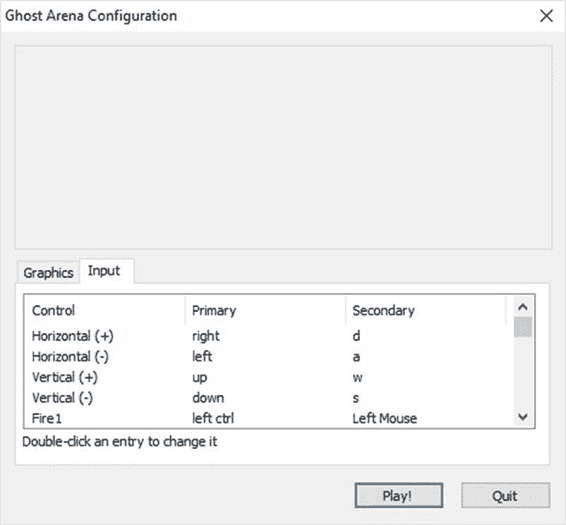

# 第五章输入

如果玩家不能控制游戏，我们就没有太多的游戏。游戏必须处理的主要输入类型是鼠标和键盘、游戏手柄和触摸。您也可以考虑语音和倾斜输入，尽管我们在这里不涉及这些。而且，触摸很难正确实现——它需要更多的解释，而不是我们这里的空间。如果你只制作手机游戏，你会希望同时研究触摸和倾斜输入方法。API 中的`Touch`、`TouchScreenKeyboard`、`Gyroscope`类将是很好的起点。

幸运的是，Unity 会自动处理大量输入。对于 PC 游戏，鼠标工作正常。不需要每一帧都画指针并计算它的位置。Unity 还为您处理了许多用户界面工作。几乎所有你需要做的就是为你点击的按钮写代码，当复选框被选中或取消选中时会发生什么，等等。我们将在用户界面部分看到这一点。

## 输入管理器

在处理获取输入之前，我们需要看看 Unity 是如何处理外设配置的。输入管理器跟踪哪些键/鼠标控制等。用于游戏中的动作，并允许玩家配置输入。图 27 中的截图显示了游戏运行时显示的窗口的输入标签。



图 27:游戏配置窗口

该窗口显示游戏编译时设置的输入值。这些值可以在统一编辑器的输入管理器窗口中更改，如图 28 所示。


图 28:输入管理器窗口

请注意，有些动作，如水平、垂直、开火、提交和跳转，会被多次列出。如果您打开一个动作的所有版本，您会看到它们是为多种类型的输入设备定义的。第一种水平类型是键或鼠标按钮——左/右或 a/d 键以及鼠标上的 x 轴将触发水平移动。第二种水平类型是操纵杆轴。你可能想知道为什么他们不简单地用鼠标定义操纵杆类型。个人电脑几乎总是有鼠标和键盘，但操纵杆通常很少。

为了让这更令人困惑，来看看 Fire1 的动作。两者都列为键或鼠标按钮，一个是左 Ctrl/鼠标 0，另一个是操纵杆按钮 0。这意味着配置您自己的操作需要一些反复试验。或者，您可以只使用 Input 类的 Get…方法来检查特定动作的特定输入，而不允许玩家自定义配置这些动作。然而，这会在一定程度上限制你的游戏。

## 输入类

你要面对的主要课程是`Input`课程。类中的所有内容都是静态的，这意味着您不需要类的实例。对于电脑来说，你要处理的变量是`inputString`、`mousePosition`，可能还有`anyKey`和`anyKeyDown`。这个类中有许多处理鼠标和键盘的方法(对于那些仍然使用它们的人来说还有操纵杆)。表 3 显示了输入法的部分列表。

表 3:个人电脑的输入类方法

| `GetAxis` | 返回由轴名称标识的虚拟轴的值。 |
| `GetAxisRow` | 返回未应用平滑滤波的轴名称所标识的虚拟轴的值。 |
| `GetButton` | 按住由按钮名称标识的虚拟按钮时，返回 true。 |
| `GetButtonDown` | 在用户按下由按钮名称标识的虚拟按钮的帧期间，返回 true。 |
| `GetButtonUp` | 当用户释放由按钮名称标识的虚拟按钮的第一帧时，返回 true。 |
| `GetJoystickNames` | 返回描述连接的操纵杆的字符串数组。 |
| `GetKey` | 当用户按住由名称标识的键时，返回 true。想想 autofire。 |
| `GetKeyDown` | 在用户开始按下由名称标识的键的帧期间，返回 true。 |
| `GetKeyUp` | 在用户释放由名称标识的密钥的帧期间，返回 true。 |
| `GetMouseButton` | 返回给定的鼠标按钮是否被按下。 |
| `GetMouseButtonDown` | 在用户按下给定鼠标按钮的帧期间返回 true。 |
| `GetMouseButtonUp` | 在用户释放给定鼠标按钮的帧期间返回 true。 |

幸运的是，出于我们的目的，我们只需要使用三个方法和`mousePosition`变量。我们没有任何文本输入要处理。如果你想通过为多人模式等项目添加登录和跟踪高分来增强游戏，你仍然不一定需要在`Input`类中使用任何更多的功能，因为用户界面控件将能够处理你的大部分需求。

我们将使用`GetKeyDown`方法来决定何时暂停和取消暂停游戏。我们将使用`GetAxis`方法来移动播放器。我们将使用`GetButton`方法来处理发射子弹。最后，我们将使用`mousePosition`来确定角色指向的位置，以便旋转角色精灵，这会影响子弹发射的位置。

在脚本文件夹中，添加一个我们将用来控制角色或玩家的类。我称它为 PlayerController，因为你会在很多 Unity 示例和教程中找到这个名字。添加代码清单 12 中的代码。

代码清单 12: PlayerController 类

```
  public float Speed;
  private float _fireRate = .5f;
  private float _nextFireTime = 0.0F;

  public GameObject Bullet;

  private bool
  _bulletFired = true;

  void OnTriggerEnter2D(Collider2D collider)
  {

  if (Globals.CurGameState == GameState.PlayingGame)

  {

  if (collider.gameObject.tag == "Ghost")

  {

  Globals.Health--;

  Destroy(collider.gameObject);

  }

  }
  }

  void Update()
  {

  if (Globals.CurGameState == GameState.PlayingGame)

  {
          Vector3 vel = new Vector3();

          vel.x = Input.GetAxis("Horizontal");
          vel.y = Input.GetAxis("Vertical");

          Vector3.Normalize(vel);
          vel *= Speed;

          float x, y;

  GetComponent<Rigidbody2D>().velocity = vel;

  x = Mathf.Clamp(transform.position.x, -4.5f,
  4.5f);

  y = Mathf.Clamp(transform.position.y, -3.0f,
  3.0f);

  transform.position = new Vector3(x, y, 0);

  //rotation

  Vector3 mouse = Input.mousePosition;

  Vector3 screenPoint = Camera.main.WorldToScreenPoint(transform.localPosition);

  Vector2 offset = new Vector2(mouse.x - screenPoint.x, mouse.y -
  screenPoint.y);

  float angle = Mathf.Atan2(offset.y, offset.x) * Mathf.Rad2Deg - 90.0f;

  transform.rotation = Quaternion.Euler(0, 0, angle);

  if (_bulletFired)

  {

  _nextFireTime += Time.deltaTime;

  if (_nextFireTime >= _fireRate)

  _bulletFired = false;

  }

  if (Input.GetButton("Fire1") && !_bulletFired)

  {

  //spawn bullet

  GameObject bullet = (GameObject)Instantiate(Bullet,
  transform.position, transform.rotation);

  _nextFireTime -= _fireRate;

  _bulletFired = true;

  }

  }
  }

```

每一帧都会调用`Update`方法。我们将使用当前的鼠标和键盘值来确定字符脚本将被绘制在哪里以及它将面向哪个方向。水平轴和垂直轴与在 Unity 编辑器中设置的恒定速度以及内置变换对象中精灵的当前位置一起使用，以确定新位置。输入类的`mousePosition`变量与子画面的位置一起使用，以确定子画面需要旋转多少才能面对鼠标——这样子画面看起来就像是朝着鼠标指向的地方发射。

该方法的最后一个动作将检查玩家是否按下了映射到 Fire1 动作的控件。如果是这样，如果玩家被允许开火，就会产生一颗子弹，并设置变量以确保玩家在被允许之前不能再次开火。

代码使用了几个我们需要添加到全局脚本中的全局变量。`CurGameState`和`Health`成员进入`Globals`类，枚举在它之外。

代码清单 13:与输入相关的全局代码

```
  public static GameState CurGameState;
  public static int Health;

  public enum GameState
  {

  PlayingGame,

  PauseGame,

  GameOver
  }

```

你可以考虑让玩家使用游戏手柄来控制角色。即使在个人电脑上，一些玩家也更喜欢使用游戏手柄进行游戏。允许你的游戏处理一个游戏手柄也将使它更容易转换到控制台版本。