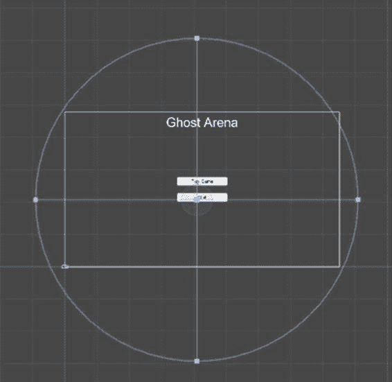
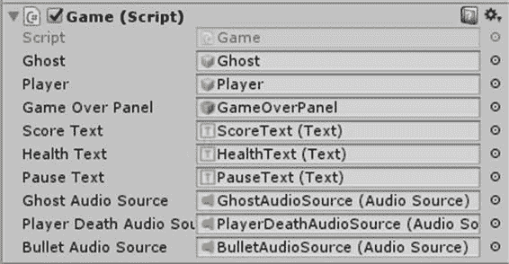

# 第七章音频

很少有游戏是完全没有某种音效、背景噪音或音乐的。甚至像*宝石迷阵*或*俄罗斯方块*这样最简单的游戏也有声音。很多 AAA 游戏的声音都很好听，如果闭上眼睛，你可能会觉得游戏就是真实的世界。

在最简单的层面上，Unity 中的声音包含两个对象——音频剪辑和音频源。

音频源有大量的属性来处理二维和三维游戏中的声音，但是我们不需要使用它们中的任何一个。AudioSource 只是我们需要播放的音频文件的容器。

我们将播放四个不同的音频文件——一个音乐文件将在菜单中播放，三个声音效果将在游戏中播放。您可以使用本章提供的音频文件，也可以使用自己的文件。Unity 支持。aif，。wav、. mp3 和。ogg 音频文件格式。

将文件添加到音频文件夹。在菜单场景中，右键单击层次并选择**音频|音频源**。将文件“warg _-_ kibelesbassrif . wav”拖到音频源的音频剪辑属性上。确保选中了“唤醒播放”和“循环播放”复选框。“醒着时播放”属性在场景开始时开始播放文件。场景打开时，“循环”属性将在文件每次完成时重新启动文件。不应选中任何其他复选框。“静音”复选框将导致音乐静音，而其他复选框用于未使用的功能。

添加音频源并选择它后，您会注意到场景中有一个圆圈包围了整个画布，如图 37 所示。



图 37:音频源区域

圆圈定义了三维游戏中可以听到声音的区域。如果您在检查器中打开“音频源”的“三维声音设置”部分，您将看到定义如何在三维游戏中听到声音的设置。对我们来说，它们无关紧要。不管怎样，声音都会被听到。

即使是在二维游戏中影响声音的设置，你会在三维声音设置部分找到，也很少需要修改。如果您想让播放器选择禁用声音或修改音量，也许您可以更改音量设置。

对于游戏的主要部分，我们需要三个音频源对象。将场景更改为游戏场景并添加它们。与菜单不同，您需要更改对象的名称。我使用了 BulletAudioSource、GhostAudioSource 和 PlayerDeathAudioSource。将适当的声音文件拖到音频源对象。这些都不会被设置为立即循环或播放。我们会控制他们什么时候玩剧本。

|  | 注意:播放预置的声音不起作用。 |

现在我们已经将音频源添加到场景中，我们需要修改游戏脚本来识别源。将代码清单 16 中的代码添加到声明部分。

代码清单 16:游戏音频声明

```cs

  public AudioSource GhostAudioSource;

  public AudioSource PlayerDeathAudioSource;
      public AudioSource BulletAudioSource;

```

保存脚本并返回到统一集成开发环境。选择您添加了游戏脚本的对象，您应该会在检查器窗口中看到您刚刚添加的三个音频源对象。将每个音频源对象从层次窗口拖到检查器中相应的对象中，如图 38 所示。



图 38:音频源脚本成员

接下来，将下面一行添加到全局脚本中。

代码清单 17:全局子弹音频源声明

```cs
  public static AudioSource BulletAudioSource;

```

现在在`Start`方法的`If`语句后添加以下一行。

代码清单 18:项目符号音频源分配

```cs
  Globals.BulletAudioSource = BulletAudioSource;

```

因为生成项目符号的代码在不同的脚本文件中，所以我们需要在代码中访问 AudioSource 对象。使其全球化将使我们能够做到这一点。为了实际播放子弹声，在 PlayerController 脚本中的`Update`方法末尾的`If`语句开头插入以下代码。

代码清单 19:播放子弹音频

```cs
  Globals.BulletAudioSource.Play();

```

接下来，我们将处理幽灵产卵。在`SpawnGhost`方法末尾的游戏脚本中，添加代码清单 20 中的代码。

代码清单 20:播放幽灵音频逻辑

```cs
  //If
  hard difficulty, only play sound every other time.

  if (Globals.DifficultyLevel == 2)

  _playSound = !_playSound;

  if(_playSound)

  GhostAudioSource.Play();

```

当鬼魂产卵时播放声音是一种很好的接触，但是你必须总是考虑当声音播放时会发生什么。在这种情况下，随着难度的不同，鬼魂可能会在不同的时间产卵。在硬难度等级(艰难等级== 2)的情况下，这意味着每半秒。如果你还没有尝试过没有代码的游戏，现在就试试。你几乎马上就会看到这个问题。这种声音播放得太频繁了，会自动播放。这将很快变得令人讨厌。我们添加的代码将在每隔一次幽灵产卵时播放产卵声音，这让它变得更容易忍受。您可以更改频率，使声音播放更少，但这将意味着更多的代码，并且您必须从使用布尔值来跟踪声音播放的时间。不难，但我选择了走容易的路线。如果您愿意，可以随意修改代码以进一步限制声音。

上面的代码使用了一个我们需要声明的开关变量。将以下代码放在`Game`类的声明部分的末尾。

代码清单 21:幽灵声音开关

```cs
  private bool _playSound;

```

我们需要在`ResetGame`方法中将变量设置为真。我们不能在声明中这样做，因为如果游戏是在硬难度下玩的，这个值最终可能会是假的。将以下代码添加到方法的末尾。

代码清单 22:重影声音开关初始化

```cs
  _playSound = true;

```

当角色因生命值达到 0 而死亡时，播放最后一个声音。在`Update`方法的开头插入以下代码。

代码清单 23:播放玩家死亡之声的代码

```cs
  //PlayerDeathAudioSource.Play();

```

为了弄清楚什么时候播放这个声音，我们将在后面添加逻辑，但是我们现在添加占位符，这样我们就知道逻辑去了哪里。

这就是我们播放声音所需的全部代码。这些都是非常简单的声音，不需要太多的逻辑来处理。你可以添加撞击对撞机时播放的声音。你可以用其他类型的逻辑来触发声音。还有许多其他场景可以播放声音。随意实验。例如，一个想法是当你点击用户界面按钮时播放声音。源代码包含一个声音文件，您可以使用它。