# 三、创建用户界面和控件

与 Windows 8.1 和 Windows Phone 8.1 的 Windows Store 应用程序相比，创建用户界面可能是最具挑战性的区别。在该平台的早期版本中，我们可以共享大部分业务逻辑，但最终，我们要处理两个不同的项目，因此很容易处理设备之间的差异，因为我们要创建两套完全不同的 XAML 页面。当然，这种方法更容易处理，但也更耗时，因为它需要我们创建两个完全不同的 XAML 页面，即使它们之间可能有许多相似之处。

在本章中，我们将探讨通用视窗平台创建用户界面所包含的各种控件。这些控件中的大多数已经针对“通用”的概念进行了优化，它们可能会根据应用程序运行的设备显示不同的行为和布局。例如，当应用程序在带有鼠标和键盘的设备上运行时，基于滑动手势的控件(如`FlipView`或`Hub`)会在屏幕的左侧和右侧自动显示一组按钮，使用户更容易移动到下一个或上一个项目。

布局控件是特殊的控件，在大多数情况下，它们不会在页面上真正显示任何内容。它们的目的是定义页面的布局，它们通常充当其他控件的容器。

### t1

`StackPanel`控件可用于将嵌套控件上下放置，这将自动适应所有可用空间。


图 23:堆栈面板控件。

您也可以通过将`Orientation`属性设置为`Horizontal`来选择水平对齐嵌套控件，如下例所示:

代码清单 88

```cs
  <StackPanel Orientation="Horizontal">
      <TextBlock Text="First Text" />
      <TextBlock Text="Second Text" />
  </StackPanel>
```

`Grid`控件用于创建表格布局，其中嵌套控件按行和列组织。下面是一个示例代码:

代码清单 89

```cs
  <Grid>
      <Grid.RowDefinitions>
          <RowDefinition Height="50"
  />
          <RowDefinition Height="Auto"
  />
      </Grid.RowDefinitions>
      <Grid.ColumnDefinitions>
          <ColumnDefinition Width="1*"
  />
          <ColumnDefinition Width="2*"
  />
      </Grid.ColumnDefinitions>

      <TextBlock Text="Text
  placed in the first row of the second column" Grid.Row="0" Grid.Column="1" />
  </Grid>
```

布局使用`RowDefinitions`和`ColumnDefinitions`属性定义。根据您想要创建的行数和列数，每个元素可以包含一个或多个`RowDefinition`或`ColumnDefinition`元素。对于每个表格元素，您可以指定一个固定的高度或宽度，或者使用相对值，如`*`来创建比例大小，或者`Auto`，使行或列适应其内容。在设计通用视窗平台应用程序的用户界面时，使用相对值是一种非常常见的模式。这样，布局可以自动适应屏幕大小和设备的分辨率。

在前面的代码中，您可以看到三个场景的示例:

*   第一行的固定高度为 50 像素，无论内容大小如何。
*   第二行设置为`Auto`:该行的高度将始终适合该行的内容。
*   这两列使用的是比例方法。理想情况下，我们将屏幕宽度分成三部分:第一列将使用 1/3 的空间(`1*`)，另一列将使用左侧 2/3 的空间(`2*`)。

要定义放置控件的单元格，需要使用两个特殊的附加属性，称为`Grid.Row`和`Grid.Column`，它们可以添加到任何控件中。这些属性只包含放置控件的行号和列号，从 0 开始作为基索引(因此，如果定义了两列，它们将由索引 0 和 1 标识)。

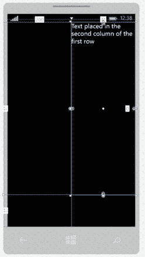

图 24:网格控件。

`Canvas`控件为开发人员提供了最大的灵活性，因为它使用了固定的布局。使用可应用于任何控件的附加属性`Canvas.Top`和`Canvas.Left`，您可以从左上角开始设置控件应该放置的确切距离(以像素为单位)。

但是，您需要小心使用此控件。由于它提供了固定的位置，它不能自动调整内容以适应屏幕的大小和分辨率，这使得很难创建一个在小平板电脑和大显示器上都能看到的布局。既然如此，除非您正在处理一个非常具体的场景，否则强烈建议不要在通用视窗平台应用程序中使用它。

代码清单 90

```cs
  <Canvas Width="640" Height="480" Background="White">
      <Rectangle Canvas.Left="30" Canvas.Top="30" Fill="Red" Width="200" Height="200" />
  </Canvas>
```

前面的示例显示了放置在从左上角开始的坐标 30，30 处的`Rectangle`控件。

`VariableSizedWrapGrid`控件可以自动将布局拆分为多行多列。与`Grid`控件不同，您不必手动指定要创建的行数和列数，您只需设置一行或一列中要放置的最大项目数及其大小。

以下示例代码可以更好地理解它的工作原理:

代码清单 91

```cs
  <VariableSizedWrapGrid MaximumRowsOrColumns="2" ItemHeight="200" ItemWidth="200">
      <Rectangle Fill="Red"
  />
      <Rectangle Fill="Blue"
  />
      <Rectangle Fill="Orange"
  />
      <Rectangle Fill="Green"
  />
      <Rectangle Fill="Brown"
  />
  </VariableSizedWrapGrid>
```

如您所见，我们已经设置了单个项目的大小(使用`ItemHeight`和`ItemWidth`属性)以及要创建的最大行数和列数(使用`MaximumRowsOrColumns`属性)。在`VariableSizedWrapGrid`控件中，我们放置了五个`Rectangle`控件。结果将是，由于我们已经设置了两个作为最大项目数，它们将被自动分成两行。

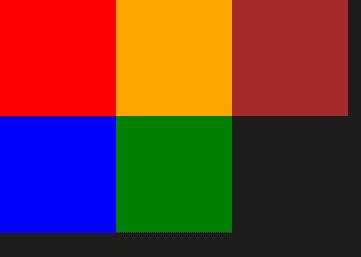

图 25:放置在 VariableSizedWrapGrid 控件中的一组矩形控件。

作为默认行为，嵌套项被拆分为行。从上图中可以看出，控件已经将五个矩形对齐为两行。如果您想要更改此行为并基于列拆分项目，只需将`Orientation`属性设置为`Horizontal`即可，如下例所示:

代码清单 92

```cs
  <VariableSizedWrapGrid MaximumRowsOrColumns="2" ItemHeight="200" ItemWidth="200" Orientation="Horizontal">
      <Rectangle Fill="Red"
  />
      <Rectangle Fill="Blue"
  />
      <Rectangle Fill="Orange"
  />
      <Rectangle Fill="Green"
  />
      <Rectangle Fill="Brown"
  />
  </VariableSizedWrapGrid>
```

`ScrollViewer`控件像前面的控件一样充当容器，但它并不试图安排嵌套控件的布局。这意味着它需要与其他布局控件结合使用。

当您需要显示比屏幕尺寸占用更多空间的内容时，可以使用`ScrollViewer`控件。以下示例显示了如何管理不适合屏幕的长文本。由于`ScrollViewer`控制，用户将能够向下滚动文本以继续阅读。

代码清单 93

```cs
  <ScrollViewer>
      <TextBlock TextWrapping="Wrap" Text="This can be a long text" />
  </ScrollViewer>
```

顾名思义，`Border`控件可以将嵌套控件包装在边框内。通过使用`BorderThickness`和`BorderBrush`属性，您可以设置边框的厚度和颜色。以下示例显示了一个包裹在红色边框内的`Image`控件，厚度为 5 像素:

代码清单 94

```cs
  <Border BorderThickness="5" BorderBrush="Red">
      <Image Source="/Assets/Image.jpg"/>
  </Border>
```

作为默认行为，`BorderThickness`值应用于边框的每一侧。但是，您也可以通过为每一侧指定不同的厚度(按以下顺序:左、上、右、下)来自定义它，如下例所示:

代码清单 95

```cs
  <Border BorderThickness="10, 15, 20, 15" BorderBrush="Red">
      <Image Source="/Assets/Image.jpg"/>
  </Border>
```

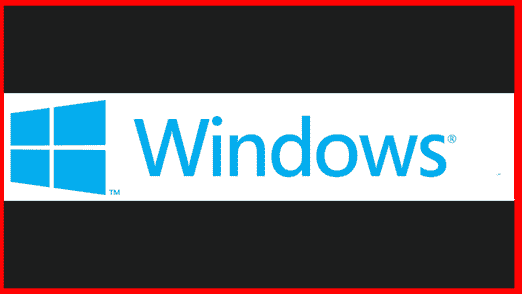

图 26:每边厚度不同的边框控件。

为了提高性能并减少您必须在 XAML 树中添加的控件数量，11 月更新为许多布局控件添加了内置边框支持，如`StackPanel`或`Grid`。这样，例如，如果您想要将边框应用到`StackPanel`中，就不必像在前面的示例中那样将其嵌入到`Border`控件中，您可以利用该控件直接暴露的`BorderBrush`和`BorderThickness`属性，如下例所示:

代码清单 96

```cs
  <StackPanel BorderBrush="Red" BorderThickness="2">
      <TextBlock Text="Text
  1" />
      <TextBlock Text="Text 2" />
  </StackPanel>
```

如果你已经有过一些基于 XAML 技术的开发经验，比如 WPF、Silverlight 或 Windows Store 应用程序，那么我们目前看到的所有控件应该都是你熟悉的。通用视窗平台增加了一个新的布局控件，它是专为支持自适应布局场景而生的，因为它可以更容易地重新定位放置在页面上的控件。

该控件被称为`RelativePanel`，它的名称来自于这样一个事实，对于每个子控件，我们可以指定:

*   控件和面板本身之间的关系。
*   一个控件和另一个控件之间的关系。

儿童控件简单地放在`RelativePanel`控件中。然后，您可以利用一组附加属性为每个控件指定其相对于面板或其他控件的位置。因为它们是附加属性，所以您可以通过使用语法`RelativePanel.NameOfTheProperty`简单地将它们用于任何控件。

让我们看看这两种方法的一个例子。

#### 与专家组的关系

`RelativePanel`控件允许您定义子控件相对于面板本身的位置。例如，您可以指定控件应始终与面板的底部或右侧对齐。这种方法更容易创建自适应布局体验，因为无论屏幕大小如何，子控件都将始终尊重我们已经建立的关系。让我们看一个示例代码:

代码清单 97

```cs
  <RelativePanel>
      <Button Content="Button
  1" 
              RelativePanel.AlignBottomWithPanel="True" 
              RelativePanel.AlignLeftWithPanel="True" />
      <Button Content="Button
  2" 
              RelativePanel.AlignBottomWithPanel="True" 
              RelativePanel.AlignHorizontalCenterWithPanel="True" />
      <Button Content="Button
  3" 
              RelativePanel.AlignBottomWithPanel="True" 
              RelativePanel.AlignRightWithPanel="True" />
  </RelativePanel>
```

`RelativePanel`控件提供了一个遵循命名约定`Align*Position*WithPanel`的附加属性(`bool`类型)，其中位置是面板的不同边之一。在前面的代码中，您可以看到不同的示例。当属性`RelativePanel.AlignBottomWithPanel`设置为`True`时，控件将放置在面板的底部；当`RelativePanel.AlignHorizontalCenterWithPanel`属性设置为`True`时，控件将在面板中心水平对齐。

这种方法的优点是，由于控件的位置是相对于面板的，所以运行应用程序的设备是大屏幕还是小屏幕并不重要，控件将始终停留在选定的位置。

下图显示了以前的 XAML 代码:

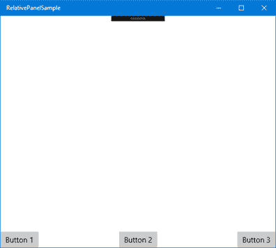

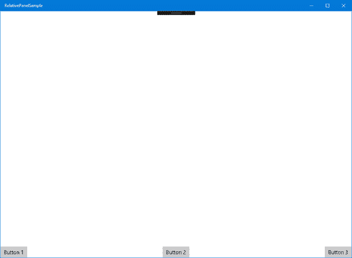

图 27:相对面板中的控件是基于与面板本身的关系来定位的。

从两张图片中可以看出，尽管应用程序在两个大小不同的窗口中运行，但这三个按钮始终放在同一个位置:一个在左边，一个在中间，一个在右边。此外，它们都放在屏幕的底部。如果我们在桌面上，开始调整窗口大小，三个按钮将继续保持相同的位置。

#### 与其他控件的关系

`RelativePanel`提供的另一个强大功能是能够定义子控件相对于其他控件的位置，使用名称作为限定符来标识关系。让我们先看一个例子:

代码清单 98

```cs
  <RelativePanel>
      <Rectangle x:Name="Rectangle1" 
                 RelativePanel.AlignHorizontalCenterWithPanel="True" 
                 Width="200" Height="200"
                 Fill="Red" />
      <Rectangle x:Name="Rectangle2" Fill="Yellow"
                 Width="200" Height="200"
                 RelativePanel.RightOf="Rectangle1" />
      <Rectangle Fill="Green"
                 x:Name="Rectangle3"
                 Width="200" Height="200"
                 RelativePanel.AlignHorizontalCenterWith="Rectangle1"
                 RelativePanel.Below="Rectangle1" />
  </RelativePanel>
```

如您所见，我们正在探索`RelativePanel`控件提供的另外两种不同类型的附加属性。第一个是`AlignPositionWith`，它允许您将一个控件与另一个控件的位置对齐。在此示例中，名称为`Rectangle3`的`Rectangle`控件基于名称为`Rectangle1`的控件的位置水平对齐。

另一种受支持的关系与控件的位置而不是对齐方式有关。我们可以利用附加属性，如`RelativePanel.Below`、`RelativePanel.RightOf`等。，定义一个控件应基于另一个控件的位置呈现在特定位置。在前面的示例中，名称为`Rectangle2`的`Rectangle`位于名称为`Rectangle1`的`Rectangle`的右侧；此外，`Rectangle3`控制位于`Rectangle1`下方。

下图显示了该代码的结果:

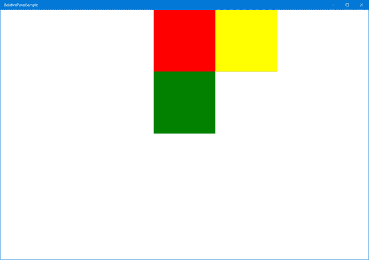

图 28:相对面板中的控件是基于与其他控件的关系来定位的。

您还会注意到，您可以自由地混合这两种方法。在前面的示例代码中，我们利用了面板和子控件之间的关系(`Rectangle1`在面板中水平居中)以及控件本身之间的关系(`Rectangle2`位于`Rectangle1`的右侧)。

你可以自由改变`RelativePanel`中控件之间的关系，这使得它成为一个关键控件，可以根据不同的屏幕调整应用程序的布局。当我在本系列的第二本书中更深入地讨论自适应布局时，我们将详细了解到，最常用的技术之一叫做**重新定位**，这意味着我们根据屏幕的大小来移动控件的位置。例如，我们可以决定，当屏幕很小时，三个矩形应该一个在另一个下面显示，而不是在当前布局中显示。这个目标很容易通过`RelativePanel`控件来实现，因为它足以改变孩子之间的关系(例如，每个`Rectangle`都可以利用附属属性`RelativePanel.Below`，这样我们就可以将他们一个放在另一个下面)。

在这个类别中，我们将看到用于向用户显示信息的所有控件，如文本、图像等。

### t1

`TextBlock`控件最广泛地用于在页面上显示文本。最重要的属性叫做`Text`，包含将要显示的文本。此外，您可以自定义文本的外观和感觉，这得益于像`FontSize`(更改尺寸)或`FontStyle`(更改字体类型)这样的属性。另一个经常使用的属性叫做`TextWrapping`。设置为`Wrap`时，确保文字多行换行，以防过长。

代码清单 99

```cs
<TextBlock Text="This is a long text" TextWrapping="Wrap" />
```

另一个有趣的属性叫做`TextTrimming`。启用此功能后，如果文本太长，会自动修剪，并在末尾添加省略号，这样用户就可以理解文本被剪掉了。您可以应用两种修剪类型:`CharacterEllipsis`(文本在字符级剪切)或`WordEllipsis`(文本在单词级剪切)。

代码清单 100

```cs
<TextBlock Text="This is a trimmed text" TextTrimming="CharacterEllipsis" />
```

由于有了`Run`控件，您也有机会将不同的样式应用于文本的各个部分，而不必将其拆分为多个`TextBlock`控件。在一个`TextBlock`控件内添加一个或多个`Run`控件就足够了；它们每一个都将包含文本的一部分。如果您想手动将文本拆分成多行，也可以使用`LineBreak`控件。

代码清单 101

```cs
  <TextBlock>
      <Run Text="First
  line" />
      <LineBreak />
      <Run Text="Second
  line in bold"
  FontWeight="Bold"
  />
  </TextBlock>
```

`RichTextBlock`控件是`TextBlock`更强大的版本，因为它为开发人员提供了更多的灵活性。您可以通过以下方式创建复杂的布局:

*   使用`Paragraph`控件将文本拆分成多个段落。
*   使用标签如`Bold`、`Italic`或`Underline`更改文本部分的样式。
*   使用`InlineUIContainer`控件添加其他 XAML 控件。

让我们看一个 XAML 代码示例:

代码清单 102

```cs
  <RichTextBlock>
      <Paragraph>
          <Bold>This is
  a bold text</Bold>
      </Paragraph>
      <Paragraph>
          <Italic>This is
  an italic text</Italic>
      </Paragraph>
      <Paragraph>
          <Underline>This is
  an underlined text</Underline>
      </Paragraph>
      <Paragraph>
          <InlineUIContainer>
              <Image Source="/Assets/image.jpg" Width="200" />
          </InlineUIContainer>
      </Paragraph>
  </RichTextBlock>
```

`RichTextBlock`控件包含多个`Paragraph`控件，每个控件都有一些以不同方式格式化的文本。此外，我们还使用了`InlineUIContainer`控件在文本底部显示图像。

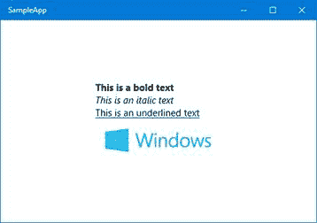

图 RichTextBlock 控件。

顾名思义，`Image`控件用于在页面上显示图像。使用`Source`属性设置图像路径，该属性支持不同种类的源。该映像可以存储在远程地址、应用程序包或本地存储中。我们将在本系列的下一本书中详细介绍使用网址访问各种存储的不同方式。

以下示例代码显示了显示远程图像的`Image`控件:

代码清单 103

```cs
<Image Source="http://www.website.com/image.png" />
```

`Image`控件还提供了对裁剪功能的内置支持，因此您可以轻松显示图像的一小部分。此功能使用`Clip`属性实现，该属性接受`RectangleGeometry`控件，定义裁剪区域，如下例所示:

代码清单 104

```cs
  <Image Source="http://www.website.com/image.png">
      <Image.Clip>
          <RectangleGeometry Rect="0,
  0, 100, 100" />
      </Image.Clip>
  </Image>
```

作物由四个值定义。前两个标识区域起点的 X 和 Y 坐标(0，0 表示图像的左上角)，而另外两个表示裁剪区域的大小(在示例中，矩形的大小为 100x100)。

另一个重要的属性叫做`Stretch`，用于定义图像将如何填充可用空间:

*   `Uniform`:默认值，通过保持原始比例，调整图像大小以适合控件的大小，使其看起来不失真。
*   `Fill`:图像被拉伸以使用所有可用空间，即使这意味着如果控件具有不同的大小，将忽略比例并创建扭曲的效果。
*   `UniformToFill`:结合了之前的模式，图像会被自动裁剪，以创建一个新的图像，该图像保持与原始图像相同的比例，但仍然填充所有可用的空间。
*   `None`:图像使用原始尺寸显示，与控件的尺寸无关。

在这个类别中，我们将详细看到用于接收用户输入的所有主要控件。

`TextBox`控件是从用户那里获取文本输入的最简单的控件。它的工作方式类似于`TextBlock`控件，只是`Text`属性不仅用于设置要显示的文本，还用于抓取用户插入的文本。

控件提供的一个有用的属性叫做`PlaceholderText`。它定义了一个占位符文本，可以显示在框内作为用户的提示，这样他们就可以更好地理解我们期望什么样的输入。一旦用户开始在框中键入文本，占位符文本就会消失。

另一个需要记住的重要场景是，通用视窗平台应用程序可以在带有触摸屏的设备上使用。在这种情况下，用户将使用虚拟键盘插入文本，而不是真正的键盘。作为开发人员，我们有机会定制虚拟键盘，以便针对我们要求用户输入的类型进行优化。这种定制是使用`InputScope`属性实现的，该属性可以采用许多值，例如:

*   `URL`显示为输入网址而优化的键盘。
*   `Number`显示为输入数字而优化的键盘。
*   `EmailSmtpAddress`显示为输入电子邮件地址而优化的键盘。

我们还可以启用或禁用自动更正功能(使用`IsSpellCheckEnabled`属性)或文本预测功能，当用户在键盘上键入时(使用`IsTextPredictionEnabled`属性)，它会向用户建议单词。

下面是定义`TextBox`控件的示例代码:

代码清单 105

```cs
<TextBox IsSpellCheckEnabled="True" IsTextPredictionEnabled="True" PlaceholderText="Placeholder Text" Text="Input text" />
```

通用视窗平台还提供了一个名为`PasswordBox`的自定义`TextBox`控件。它的工作原理与`TextBox`完全一样，但是默认情况下，它会将插入的文本替换为点，这样其他正在看屏幕的人就看不到它了。可以想象，它非常适合我们需要敏感数据的场景，比如密码或信用卡号。由于文本是自动隐藏的，`PasswordBox`控件提供的自定义方式不如`TextBox`控件多。唯一重要的可用选项叫做`IsPasswordRevealButtonEnabled`；当它设置为`True`时，它会在框的末端添加一个按钮，当按下该按钮时，会暂时清晰地显示文本，以便用户可以检查他们是否插入了正确的密码。

`DatePicker`和`TimePicker`控件用于管理应用程序中的日期和时间。

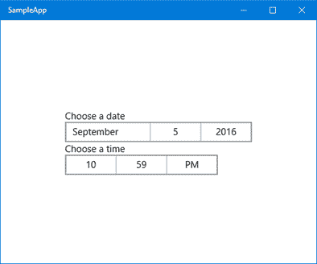

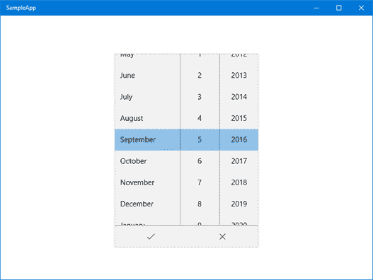

图 30:上图显示了日期选择器和时间选择器控件。下图显示了展开的日期选择器。

作为默认行为，`DatePicker`控件显示所有日期字段:日、月和年。可以使用名为`YearVisible`、`MonthVisible`或`DayVisible`的属性隐藏其中一个。如果一个或多个字段被隐藏，控件将自动向应用程序返回当前值(例如，如果隐藏年份，控件将返回当前年份)。

代码清单 106

```cs
<DatePicker x:Name="Date" YearVisible="False" />
```

您也可以使用`MinYear`和`MaxYear`属性定义日期范围。这在许多情况下都很有用，例如，如果您询问用户的生日；在这种情况下，显示 1900 年之前或之后的年份是没有用的。但是这些属性不能在 XAML 设置，只能在代码隐藏中设置，因为它们的类型是`DateTimeOffset`，在 XAML 无法表达。

代码清单 107

```cs
  protected override void OnNavigatedTo(NavigationEventArgs e)
  {
      DateTime minYear = new DateTime(1900, 1, 1);
      Date.MinYear = new DateTimeOffset(minYear);
      Date.MaxYear = new DateTimeOffset(DateTime.Now);
  }
```

如果您想要检索用户在代码隐藏中选择的日期，您需要使用`Date`属性，如下例所示，它使用弹出消息显示日期:

代码清单 108

```cs
  private async void OnGetDateClicked(object sender, RoutedEventArgs e)
  {
      DateTimeOffset selectedDate = Birthday.Date;
      MessageDialog dialog = new MessageDialog(selectedDate.ToString());
      await dialog.ShowAsync();
  }
```

`TimePicker`控件的工作方式类似，但与`DatePicker`控件不同，它只由两个元素组成:小时和分钟。您可以使用`MinuteIncrement`属性自定义时间范围。这样，它将只显示指定的范围，而不是显示分钟字段的所有可能值(从 0 到 59)。

例如，让我们看看下面的实现:

代码清单 109

```cs
<TimePicker MinuteIncrement="15" />
```

通过使用以前的 XAML 代码，分钟下拉列表将仅显示值 00、15、30 和 45。

用户在`TimePicker`控件中选择的值使用`TimeSpan`对象存储在`Time`属性中。以下示例显示了一种方法，该方法使用弹出消息向用户显示转换为小时的选定时间:

代码清单 110

```cs
  private async void OnGetDateClicked(object sender, RoutedEventArgs e)
  {
      TimeSpan timeSpan = StartTime.Time;
      MessageDialog dialog = new MessageDialog(timeSpan.TotalHours.ToString());
      await dialog.ShowAsync();
  }
```

这两个控件还支持通过利用`Header`属性来设置显示在控件上方的标题。

`CalendarDatePicker`和`CalendarView`是 Windows 10 中新增的两个控件，让开发人员更容易处理日期。

`CalendarDatePicker`的目标与我们之前看到的`DatePicker`相同。它允许用户选择日期。然而，在这种情况下，它提供了更愉快的用户体验。我们不能将用户选择限制在包含日期的信息子集上(就像日期和月份)，因为它显示完整的日历视图，就像您在 Windows 10 任务栏中单击当前日期和时间时看到的视图。

默认情况下，控件只显示一个占位符，邀请用户选择日期(可以使用`Placeholder`属性进行自定义)。用户点击后，控件会在占位符下方显示完整的日历，如下图所示。

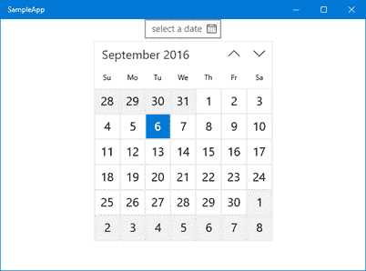

图 31:日历数据选择器控件。

由于`CalendarViewStyle`属性，控件可以多种方式定制，甚至深度重新设计。定制它的另外几个有趣的选项是:

*   `DisplayMode`:可设置为`Year`、`Decade`或`Month`。默认情况下，日历选取器打开，显示当前月份及其所有日期。通过将此属性更改为另一个值，您可以更改启动体验。例如，通过将其设置为`Year`，日历将打开并显示最近年份的列表，然后只有在用户选择了特定年份后才会切换到月视图。
*   `IsTodayHighlighted`:一个`bool`属性，当设置为`True`时，自动突出显示日历中的当前日期。默认情况下，此属性处于启用状态，您可以在上图中看到一个示例。
*   `IsOutOfScopeEnabled:`另一个 bool 属性默认启用。当设置为`True`时，当前选择范围之外的所有项目都以不同的背景显示。同样在这种情况下，上图显示了一个真实的例子。由于 9 月是选定的月份，因此属于前一个月(8 月)或后一个月(10 月)的所有日期都以灰色背景显示，而不是白色背景。

从交互的角度来看，`CalendarDatePicker`控件的工作方式与`DatePickerOne`非常相似。您可以通过利用`MinDate`和`MaxDate`属性来限制显示的日期范围，并且从代码隐藏中，您可以使用`Date`属性来获取选定的日期。

下面是一个关于如何将其插入页面的 XAML 代码示例:

代码清单 111

```cs
<CalendarDatePicker  DisplayMode="Month"  IsTodayHighlighted="True" IsOutOfScopeEnabled="True" />
```

从用户体验的角度来看，`CalendarView`控件提供了与`CalendarDatePicker`控件相同的用户界面，有许多共同的定制选项(例如突出显示当前日期或更改范围外日期的背景颜色的机会)。

然而，它不仅仅是一个简单的选择器。事实上，有一些主要的区别:

*   默认情况下，`CalendarDatePicker`仅显示一个选择器，只有当用户点击它时才会显示完整的日历。相反，`CalendarView`总是显示完整的日历。
*   `CalendarView`提供了一种深度的方式来定制日历的每一部分，如超出范围的日期、当天的样式等。
*   通过利用`SelectionMode`属性，您可以允许用户选择多个日期，而不是只选择一个。

由于这些差异，检索选定日期的方式也不同:

*   由于用户可以选择多个日期，所以它们都存储在名为`SelectedDates`的属性中，该属性是一个集合。在单个选择的情况下，它将只包含一个元素。
*   如果您想在用户选择了一个或多个日期时拦截，您可以利用`SelectedDatesChanged`事件。

以下示例显示了如何在 XAML 声明一个`CalendarView`控件，该控件在用户每次点击日期时调用`SelectedDatesChanged`事件:

代码清单 112

```cs
  <CalendarView 
  x:Name="Calendar"
  SelectedDatesChanged="OnSelectedDates" />
```

相反，下面是事件处理程序的定义:

代码清单 113

```cs
  private async void OnSelectedDates(CalendarView sender, CalendarViewSelectedDatesChangedEventArgs args)
  {
      DateTimeOffset selectedDate =
  Calendar.SelectedDates.FirstOrDefault();
      MessageDialog dialog = new MessageDialog(selectedDate.ToString("d"));
      await dialog.ShowAsync();
  }
```

通过利用`CalendarView`控件公开的`SelectedDates`属性，我们只需检索集合中的第一个结果(默认情况下，控件被配置为支持单一日期选择)，并使用`MessageDialog`类通过对话框向用户显示它。

`CalendarView`控件提供的另一个重要特性是，我们可以根据自己的逻辑定制每天的外观和感觉。例如，如果我们正在编写生日提醒应用程序，我们可以用不同的方式突出显示我们的一个朋友过生日的日子。为了达到这个目标，我们需要利用控件提供的另一个事件`CalendarViewDayItemChanging`，它在每次 XAML 树呈现一个可见日历的单元格时被触发。

代码清单 114

```cs
  <CalendarView 
  x:Name="Calendar"
  CalendarViewDayItemChanging="OnCalendarViewDayItemChanging" />
```

下面是事件处理程序的样子:

代码清单 115

```cs
  private void
  OnCalendarViewDayItemChanging(CalendarView sender, CalendarViewDayItemChangingEventArgs args)
  {
      if (args.Item.Date.Date == new
  DateTimeOffset(new
  DateTime(2016, 9, 10)))
      {

  args.Item.Background = new SolidColorBrush(Colors.Red);
      }
  }
```

正如您将注意到的，事件处理程序包括一个`CalendarViewDayItemChangingEventArgs`类型的参数，并包含一个名为`Item`的属性，一个`CalendarViewDayItem`类型。此对象表示正在呈现的单元格，因此包含所有关于它的信息，从视觉(如背景或字体大小)和逻辑(如所表示的日期)的角度来看都是如此。

在这种情况下，我们可以结合这两种信息来实现我们的目标。在前面的例子中，我们使用`Date`属性来检查当前渲染的日期是否是我们需要处理的特殊日期(例如，是朋友的生日)，然后我们可以利用 UI 属性来改变它的外观和感觉(在这个示例中，我们利用`Background`使用`SolidColorBrush`将颜色更改为红色)。

下图显示了结果，假设 2016 年 9 月 10 日是我们想要强调的特殊日期。当然，一个真正的应用程序会有更复杂的逻辑，所以我们可能不仅要处理一个日期，还要处理它们的列表，它们会存储在更复杂的基础设施中，比如数据库或 REST 服务。

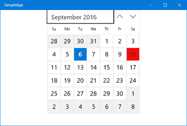

图 CalendarView 控件以不同于其他控件的外观和感觉显示日期。

`Button`控件是可用于与用户交互的最简单控件。当按下时，它会引发`Click`事件，您可以在代码隐藏中进行管理。按钮的内容由`Content`属性定义，它可以包含一个简单的文本，如下例所示:

代码清单 116

```cs
<Button Content="Click me" Click="OnButtonClicked" />
```

但是`Content`属性也可以用扩展语法表示。在这种情况下，您可以使用任何 XAML 控件来定义按钮的布局。以下示例显示了如何使用图像定义`Button`控件:

代码清单 117

```cs
  <Button Click="OnButtonClicked">
      <Button.Content>
          <Image Source="image.png"
  />
      </Button.Content>
  </Button>
```

通用视窗平台还提供了另一种按钮控制，称为`ToggleButton`。它的工作和行为就像一个普通的按钮，但是它能够管理两种不同的状态:启用和禁用。因此，该控件还提供了一个名为`bool`类型的属性`IsChecked`。按钮启用时，其值为`true`；否则，价值就是`false`。

下面的示例代码显示了控件的简单用法:

代码清单 118

```cs
<ToggleButton Content="This is a CheckedButton" IsChecked="True" />
```

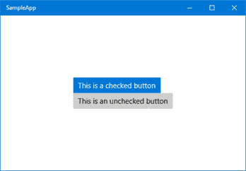

图 33:toggle button 控件可以呈现的两种不同状态。

`RadioButton`和`CheckBox`控件非常相似，都用于为用户提供多种选择。它们有许多共同的特点，例如:

*   显示在控件附近的文本是使用`Content`属性设置的。
*   要检查控件是否已被选中，您需要使用`IsChecked`属性。
*   如果想在用户点击控件时拦截，可以使用`Checked`和`Unchecked`事件。

`RadioButton`和`CheckBox`控件最大的区别是前者可以定义为一个组的一部分。在这种情况下，用户只能启用其中一个。如果他们尝试启用另一个控件，先前启用的控件将自动停用。`CheckBox`控件没有应用这个逻辑:用户可以根据自己的喜好启用任意多个控件。

`RadioButton`的分组使用`Group`属性实现。通过为一组`RadioButton`控件分配相同的值，用户一次只能启用其中一个控件。下面是如何使用这两种控件的示例:

代码清单 119

```cs
  <StackPanel>
      <CheckBox Content="First
  option" />
      <CheckBox Content="Second
  option" />
      <CheckBox Content="Third
  option" />

      <RadioButton Content="First
  option" GroupName="Options" />
      <RadioButton Content="Second
  option" GroupName="Options" />
      <RadioButton Content="Third
  option" GroupName="Options" />
  </StackPanel>

```

Windows 10 最具创新性的功能之一是墨迹支持，该功能已被一个又一个版本扩展。市场上大多数二合一设备(如 Surface Pro)都支持数字笔，因此用户可以像在纸上写字一样在设备屏幕上写字。通用视窗平台包括一组控件和应用程序接口，用于在应用程序中增加墨迹支持。

最基本的一个叫做`InkCanvas`，它只是一个画布，用户可以用数字笔写和画任何东西。在页面中添加它很简单，如下面的示例所示:

代码清单 120

```cs
  <StackPanel>
      <InkCanvas x:Name="Ink" Width="1200" Height="500"  />
  </StackPanel>
```

`InkCanvas`控件包含一个名为`InkPresenter`的属性，它是配置画布行为的基础。默认情况下，`InkCanvas`控件仅适用于数字笔(像 Surface Pro 附带的那种)。如果你试图用手指或鼠标画一些东西，什么也不会发生。但是，由于`InkPresenter`对象的`InputDeviceTypes`属性，您可以更改此行为，如下例所示:

代码清单 121

```cs
  protected override void OnNavigatedTo(NavigationEventArgs e)
  {

  Ink.InkPresenter.InputDeviceTypes = CoreInputDeviceTypes.Mouse
          | CoreInputDeviceTypes.Pen | CoreInputDeviceTypes.Touch;
  }
```

使用前面的代码，当页面加载时，我们允许用户使用任何支持的方法在画布上绘制:笔、鼠标和触摸屏。然而，正如我们将在接下来的章节中看到的那样，`InkPresenter`不仅仅是配置`InkCanvas`控件的一种方式。这是与画布交互和执行高级操作的主要途径。

#### 将画布的内容存储在图像中

其中一个`InkPresenter`功能允许您将`InkCanvas`控件的内容保存到 GIF 图像中。事实上，`InkPresenter`对象允许访问所有可用的笔画，也就是已经绘制到画布上的所有东西。为此，我们在页面中添加了一个按钮，其`Click`事件连接到以下事件处理程序:

代码清单 122

```cs
  private async void OnSaveImage(object sender, RoutedEventArgs e)
  {
      IReadOnlyList<InkStroke> strokes = Ink.InkPresenter.StrokeContainer.GetStrokes();
      if (strokes.Count > 0)
      {
          FileSavePicker savePicker = new FileSavePicker();

  savePicker.SuggestedStartLocation =
              PickerLocationId.PicturesLibrary;

  savePicker.FileTypeChoices.Add(
              "GIF",
              new List<string> { ".gif" });

  savePicker.DefaultFileExtension = ".gif";

  savePicker.SuggestedFileName = "InkSample";

          // Show the file picker.
          StorageFile file = await savePicker.PickSaveFileAsync();

          if (file != null)
          {
              IRandomAccessStream stream = await file.OpenAsync(FileAccessMode.ReadWrite);
              // Write the ink strokes to the
  output stream.
              using (IOutputStream outputStream =
  stream.GetOutputStreamAt(0))
              {
                  await
  Ink.InkPresenter.StrokeContainer.SaveAsync(outputStream);
                  await outputStream.FlushAsync();
              }

  stream.Dispose();
          }
      }
  }
```

第一步是检查用户是否真的在画布上画了什么。我们通过使用`InkPresenter`对象和调用`StrokesContainer`属性的`GetStrokes()`方法来实现这一点。此方法将返回画布中绘制的所有笔画的集合。只有当集合实际上包含至少一个元素时，我们才继续保存过程。

代码的其余部分利用存储 API 询问用户希望将图像文件保存在哪里，并有效地将画布的内容写入文件流中。在本章中，我不会详细描述存储 API 的用法，比如`FileSavePicker`或`StorageFile`，但它们将是第二本书其中一章的主题。对于这个演示，您只需要知道两件重要的事情:

*   `FileSavePicker` API 允许用户选择保存文件的文件夹。通过这种方法，用户将能够选择一个文件夹和一个名称来保存画布的内容。默认选项(使用`SuggestedStartLocation`和`SuggestedFileName`属性配置)是在计算机的图片库内创建一个名为 **InkSample.gif** 的文件。
*   利用`StorageFile`类、`OpenAsync()`方法、`IRandomAccessStream`接口获得对用户选择的文件流的写访问，这样我们就可以存储画布的内容。

当我们准备将数据写入用户选择的文件时，我们再次使用`InkPresenter`对象。`StrokeContainer`属性提供了另一种称为`SaveAsync()`的方法，该方法要求将数据写入流作为参数。

在操作结束时，我们的设备上将会有一个带有`InkCanvas`控件内容的 GIF 文件，无论它是一个绘图、一个文本等。

#### 识别文本和形状

`InkCanvas`控件不仅可以用来写图纸，还可以用来写文字和形状。Creators Update 增加了一个名为`InkAnalyzer`的新类来执行墨迹识别，这样控件就可以解释用户的笔迹，并将其解码为文本或形状。

为了完成这个任务，我在页面上添加了两个额外的控件:一个执行识别的`Button`和两个显示识别结果的数量和列表的`TextBlock`控件。

代码清单 123

```cs
  <StackPanel Margin="12">
      <InkCanvas x:Name="Ink" Width="1200" Height="500"  />
      <Button Content="Recognize" Click="OnRecognizeInk" />
      <TextBlock x:Name="Results" />
  </StackPanel> 

```

以下是当用户点击`Button`控件时调用的代码:

代码清单 124

```cs
  private async void OnRecognizeInk(object sender, RoutedEventArgs e)
  {
      InkAnalyzer analyzer = new InkAnalyzer();
      var strokes = Ink.InkPresenter.StrokeContainer.GetStrokes();
      if (strokes.Count > 0)
      {

  analyzer.AddDataForStrokes(strokes);
          var result = await
  analyzer.AnalyzeAsync();
          if (result.Status == InkAnalysisStatus.Updated)
          {
              Results.Text
  = analyzer.AnalysisRoot.RecognizedText;
          }
      }
  }

```

识别由属于`Windows.UI.Input.Inking.Analysis`命名空间的`InkAnalyzer`类执行。首先，您需要通过调用`AddDataForStrokes()`方法，在对象内部加载您想要识别的笔画。在前面的示例中，我们可以通过调用`InkPresenter`对象的`StrokeContainer`集合上的`GetStrokes()`方法来获取用户绘制的所有笔画的集合。

然后我们调用`AnalyzeAsync()`方法，如果我们得到结果的`Status`属性(由于`InkAnalysysStatus`枚举器)，我们可以访问`AnalysisRoot.RecognizedText`属性来得到已经被识别的文本。

这种方法最有趣的地方在于，它不仅可以识别文本，还可以识别形状，从下图可以看出:

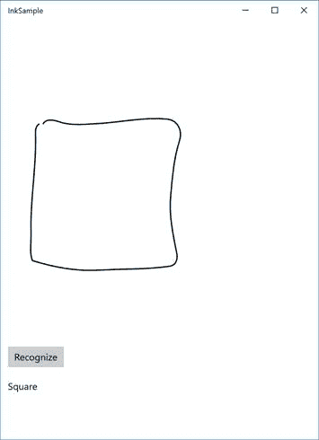

图 34:一个带有正方形的墨迹画布，下面是使用墨迹分析类识别的形状名称

#### 使用墨迹工具栏增强画布的功能

周年更新增加了一个新的控件，通过提供一组工具来执行`InkCanvas`控件的高级操作，如更改笔画颜色、使用标尺等，从而更容易为用户创造更丰富的体验。这是一个非常强大的控件，但是添加起来非常简单，正如您在下面的示例中看到的:

代码清单 125

```cs
  <StackPanel>
      <InkToolbar TargetInkCanvas="{x:Bind Ink}"
  />
      <InkCanvas x:Name="Ink" Width="1200" Height="500"  />
  </StackPanel>

```

如您所见，在页面中添加一个`InkToolbar`控件就足够了，通过使用我们在上一章中学习的`x:Bind`标记表达式，我们可以指定要连接的`InkCanvas`控件的名称。仅此而已！现在，用户将看到一个工具栏，允许他们自定义绘图体验，如:

*   改变笔的颜色和粗细。
*   使用不同种类的铅笔。
*   用抽屉画直线，可以用手指在画布上移动。

下图显示了放置在画布顶部的`InkToolbar`:

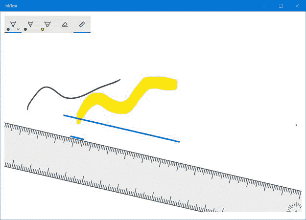

图 InkToolbar 控件允许对绘图体验进行高级定制。

开发应用程序时，一个非常常见的要求是向用户显示正在进行的操作的状态。我们需要通知他们有事情正在发生，在操作完成之前，应用程序可能还没有完全准备好使用。通用视窗平台包括两个控件来实现这一目标。

`ProgressRing`控件用于加载阻止用户与应用程序交互的操作。在操作完成之前，用户没有其他事情可以做，所以他们只需要等待(例如，新闻阅读器正在加载最新的新闻，并且在操作完成之前，用户没有任何内容可以与之交互)。该控件只是显示一个旋转环，它将通知用户操作正在进行。

使用这个控件非常简单。动画由`IsActive`属性控制，该属性为`bool`类型。当其值为`true`时，进度环将旋转；到了`false`的时候，进度环会被隐藏。通常，你会在手术开始前展示出来；然后，一旦工作完成，你就会把它藏起来。以下是该控件的 XAML 声明示例:

代码清单 126

```cs
<ProgressRing x:Name="Progress" />
```

相反，下面是您如何使用`ProgressRing`控件理想地管理代码加载操作(例如，从互联网下载一些数据):

代码清单 127

```cs
  protected override void OnNavigatedTo(NavigationEventArgs e)
  {
      Progress.IsActive = true;
      //start loading the data
      Progress.IsActive = false;
  }
```

与`ProgressRing`不同的是，`ProgressBar`控件可以用在操作发生在后台的场景中，即使在操作过程中，用户也可以保持与应用程序的交互。`ProgressBar`控件用使用`Value`属性填充的条进行渲染。您可以指定一个从 0(空条)到 100(满条)的数值。此功能还使控件对于可以估计其状态的操作非常有用，例如从互联网下载文件。

例如，在下载操作期间，您可以确定总文件大小中已经下载了多少字节，并计算要在`Value`属性中设置的百分比。这样，用户可以持续更新下载状态。

否则，`ProgressBar`控制可以用来通知用户操作正在进行，而不显示确切的状态。通过将`IsIndeterminate`属性设置为`true`，该条将被一系列从屏幕左侧向右侧连续移动的点所取代。这样，您将获得与`ProgressRing`控件更接近的用户体验:

代码清单 128

```cs
<ProgressBar x:Name="Progress" IsIndeterminate="True" />
```

移动应用程序中最常见的需求之一是显示数据集合。我们已经在第 2 章中看到了如何使用绑定和数据模板轻松实现这个场景。在本节中，我们将看到通用视窗平台中最重要的控件来显示集合。

`GridView`和`ListView`是在通用视窗平台应用程序中最常用的两个显示数据集合的控件，因为它们都能够提供符合平台指南的外观和感觉。这两个控件提供相同的功能和属性。主要区别是`GridView`控件可以水平滚动，使用网格结构；相反，`ListView`控件使用传统的列表进行渲染，用户可以从上到下滚动。

#### 显示平面集合

使用这些控件的最简单方法是显示平面数据集合。在这种情况下，它们的行为就像显示列表的其他标准控件一样，这意味着:

*   您需要为`ItemTemplate`属性定义一个`DataTemplate`，它定义了用于渲染集合中每个元素的布局。
*   您需要将想要显示的数据集合分配给`ItemsSource`属性。

您需要使用稍后将详细介绍的方法之一来管理用户选择的项目。以下 XAML 代码显示了使用`ListView`控件显示的平面集合的示例定义:

代码清单 129

```cs
  <ListView x:Name="List" SelectionChanged="List_OnSelectionChanged">
      <ListView.ItemTemplate>
          <DataTemplate>
              <StackPanel>
                  <TextBlock Text="{Binding Path=Name}" />
                  <TextBlock Text="{Binding Path=Surname}" />
              </StackPanel>
          </DataTemplate>
      </ListView.ItemTemplate>
  </ListView>
```

该列表的`ItemTemplate`被配置为显示具有两个属性的对象集合，称为`Name`和`Surname`。以下是此对象的示例定义:

代码清单 130

```cs
  public class Person
  {
      public string Name { get; set; }
      public string Surname { get; set; }
  }
```

下面是在代码隐藏中，我们如何创建一个`Person`对象的样本集合，并将其分配给`ListView`控件:

代码清单 131

```cs
  protected override void OnNavigatedTo(NavigationEventArgs e)
  {
      List<Person>
  people = new List<Person>
      {
          new Person
          {
              Name = "Matteo",
              Surname = "Pagani"
          },
          new Person
          {
              Name = "Angela",
              Surname = "Olivieri"
          }
      };

  List.ItemsSource = people;
  }
```

`GridView`控件被广泛用于通用视窗平台应用程序，因为它更容易创建自适应布局体验。事实上，该控件能够自动实现**重排**体验，这意味着项目会根据屏幕大小自动移动到新行或移动回原始行。

当您在桌面上启动应用程序时，这种方法清晰可见。一旦您开始调整窗口大小，您会注意到项目会根据可用空间来回移动，帮助您始终提供出色的用户体验，无论哪个设备正在运行该应用程序。

#### 显示分组集合

`ListView`或`GridView`控件提供的最有趣的特性之一是分组集合支持。您将能够显示按不同类别分组的数据集合。除了滚动列表之外，用户还可以快速地从一个类别跳到另一个类别。

许多原生 Windows 10 应用程序都利用了这种方法。例如，如果您打开“人员”应用程序，您会注意到联系人根据姓名的首字母分组在不同的类别中。轻按一封信，就会打开一个显示所有可用信件的新视图，这样用户就可以快速地从一组联系人跳到另一组联系人。

让我们通过改变我们之前定义的`Person`类来看一个真实的例子:

代码清单 132

```cs
  public class Person
  {
      public string Name { get; set; }
      public string Surname { get; set; }
      public string City { get; set; }
  }
```

我们添加了一个名为`City`的新属性；我们将使用它来按照人们居住的城市对我们收集的人进行分组。

实现我们的目标。我们需要引入一个由 Windows Runtime 提供的新类，称为`CollectionViewSource`，它充当数据收集和显示数据的控件(在我们的例子中，是`GridView`或`ListView`控件)之间的代理。我们将控件的`ItemsSource`属性连接到这个代理对象，而不是直接连接到我们的集合，代理对象提供了许多高级功能，比如自动分组支持。

`CollectionViewSource`在 XAML 可以定义为常规资源。以下示例显示了定义为页面资源的`CollectionViewSource`对象:

代码清单 133

```cs
  <Page.Resources>
      <CollectionViewSource x:Name="People" IsSourceGrouped="True" />
  </Page.Resources>
```

如您所见，由于`IsSourceGrouped`属性，我们可以轻松地指定存储在该集合中的数据将被分组。下一步是将我们的数据连接到这个代理类。该过程类似于我们所看到的平面列表，只是这次我们需要指定组标准。多亏了 LINQ 和`GroupBy()`分机，我们可以轻松做到这一点。这里有一个例子:

代码清单 134

```cs
  protected override void OnNavigatedTo(NavigationEventArgs e)
  {
      List<Person>
  people = new List<Person>
      {
          new Person
          {
              Name = "Matteo",
              Surname = "Pagani",
              City = "Como"
          },
          new Person
          {
              Name = "Ugo",
              Surname = "Lattanzi",
              City = "Milan"
          },
          new Person
          {
              Name = "Roberto",
              Surname = "Freato",
              City = "Milan"
          },
          new Person
          {
              Name = "Massimo",
              Surname = "Bonanni",
              City = "Rome"
          }
      };
      var groups = people.GroupBy(x => x.City);
      People.Source = groups;
  }
```

我们通过对原始集合应用`GroupBy()`扩展方法，按照名为`City`的属性对集合进行了分组。然后，我们将得到的分组集合分配给我们之前在页面中定义为资源的`CollectionViewSource`对象的`Source`属性。

我们已经完成了代码的工作。然而，我们的目标还没有实现，因为我们需要定义集合的视觉布局。默认情况下，实际上无论是`GridView`还是`ListView`控件都不知道如何可视化显示组。`ItemTemplate`属性定义了单个项目的外观，但没有定义整个组的渲染方式。因此，我们需要对控件的 XAML 定义进行一些更改。

以下示例显示了一个`GridView`控件，该控件被配置为显示我们的分组集合:

代码清单 135

```cs
  <GridView ItemsSource="{Binding Source={StaticResource People}}">
      <GridView.ItemTemplate>
          <DataTemplate>
              <StackPanel>
                  <TextBlock Text="{Binding Path=Name}" />
                  <TextBlock Text="{Binding Path=Surname}" />
              </StackPanel>
          </DataTemplate>
      </GridView.ItemTemplate>
      <GridView.GroupStyle>
          <GroupStyle HidesIfEmpty="True">
              <GroupStyle.HeaderTemplate>
                  <DataTemplate>
                      <Border Background="LightGray">
                          <TextBlock Text="{Binding Key}" Foreground="Black" Margin="10" FontSize="22"/>
                      </Border>
                  </DataTemplate>
              </GroupStyle.HeaderTemplate>
          </GroupStyle>
      </GridView.GroupStyle>
  </GridView>
```

你会注意到的第一件事是我们正在以不同的方式设置`ItemsSource`属性。由于`CollectionViewSource`对象已经被定义为资源，我们使用`StaticResource`标记扩展来分配它。

然后我们需要设置列表的不同视觉样式:

*   第一个不应该是一个惊喜:就像我们管理一个平面列表一样，我们定义了`ItemTemplate`，用于渲染集合中每一项的模板。我们使用的是之前看到的显示人名和姓氏的同一个图标。
*   第二个是`GroupStyle`元素，它定义了组的行为。通过将`HidesIfEmpty`属性设置为`True`，我们确保如果组中没有元素，则不会显示该组。在我们的情况下，如果集合中没有来自米兰的人，我们不希望展示米兰组。
*   `GroupStyle`控件提供了一个名为`HeaderTemplate`的重要属性。它是用于呈现显示在每个组开头的组标题的模板。这个目标是通过增加一个连接到`Key`场的`TextBlock`控制器来实现的。这是什么？当我们使用`GroupBy()`方法对集合进行分组时，我们基本上已经为每个组(用户的城市)创建了另一个具有一个元素的集合。每个元素包含属于该组的项目列表(居住在该城市的人)和带有该组名称的密钥(T5)属性。有了这个`DataTemplate`，我们将简单地显示一个带有城市名称的文本，后面是居住在那里的人的列表。

下图显示了前面的代码是如何在实际应用程序中呈现的。


图 36:分组的网格视图。

如前所述，`ListView`控件的工作方式完全相同。通过替换对`GridView`控件的所有引用来简单地改变之前的代码，我们将能够把网格变成传统的垂直列表，如下图所示。

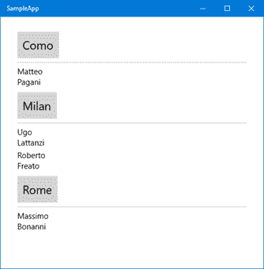

图 37:分组列表视图

如您所见，方向差异不会应用于组，而是应用于组内的元素。在这两种情况下，组都是垂直显示的，一个在另一个的下面。但是，根据控件的类型，内部元素(每个`Person`对象)水平或垂直放置。

如果我们也想改变组的方向，我们需要改变控件的`ItemsPanel`，用于渲染每个组的面板。对于这个场景，我们可以利用`ItemWrapGrid`面板，它允许我们根据我们想要利用的方向自动将组分成多行和多列。

以下是我们更新后的 XAML 代码:

代码清单 136

```cs
  <GridView ItemsSource="{Binding Source={StaticResource People}}">
      <GridView.ItemTemplate>
          <DataTemplate>
              <StackPanel Width="200">
                  <TextBlock Text="{Binding Path=Name}" />
                  <TextBlock Text="{Binding Path=Surname}" />
              </StackPanel>
          </DataTemplate>
      </GridView.ItemTemplate>
      <GridView.ItemsPanel>

  <ItemsPanelTemplate>

  <ItemsWrapGrid
  MaximumRowsOrColumns="3" />

  </ItemsPanelTemplate>
      </GridView.ItemsPanel>

      <GridView.GroupStyle>
          <GroupStyle HidesIfEmpty="True">
              <GroupStyle.HeaderTemplate>
                  <DataTemplate>
                      <Border Background="LightGray">
                          <TextBlock Text="{Binding Key}" Foreground="Black" Margin="10" FontSize="22"/>
                      </Border>
                  </DataTemplate>
              </GroupStyle.HeaderTemplate>
          </GroupStyle>
      </GridView.GroupStyle>
  </GridView>
```

用黄色突出显示，您可以看到我们添加的新属性。我们通过将`ItemsWrapGrid`控件作为模板来设置`GridView`控件的`ItemsPanel`属性。使用`MaximumRowsOrColumns`数字，我们可以指定在控件开始将组拆分成新的行或列之前，我们想要显示的最大行数或列数。

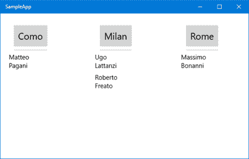

图 38:使用 ItemsWrapGrid 作为面板模板的 GridView。

#### 处理项目选择

处理数据集合时，最常见的需求是管理选择。用户点击一个项目，我们想检测哪个项目被选中，这样我们就可以执行额外的操作(比如将用户重定向到详细页面)。有四种方法来管理选择，您可以通过设置`SelectionMode`属性来选择您最喜欢的方法:

*   `Single`:默认模式下，用户只能选择一个项目，高亮显示，直到选择另一个项目。
*   `Multiple`:该模式允许用户选择多个项目。每次他们点击一个项目，它就会自动添加到所选项目的列表中。
*   `Extended`:前两种模式的组合。轻按一下会触发标准选择，而用鼠标右键单击会将其添加到所选项目的列表中。
*   `None`:禁用选择。没有可选择的项目，不触发`SelectionChanged`事件。

除了最后一个，当用户点击一个项目时，这些模式总是触发`SelectionChanged`事件。唯一不同的是，在单次选择的情况下，我们可以只使用控件的`SelectedItem`属性，该属性包含所选项。否则，在多重选择的情况下，我们可以使用`SelectedItems`属性，一个包含所有标记项目的集合。

以下示例显示了当触发`SelectionChanged`事件时如何使用`SelectedItem`属性以弹出窗口显示所选人员的姓名:

代码清单 137

```cs
  private async void List_OnSelectionChanged(object sender, SelectionChangedEventArgs e)
  {
      Person selectedPerson = List.SelectedItem as Person;
      if (selectedPerson != null)
      {
          MessageDialog dialog = new MessageDialog(selectedPerson.Name);
          await dialog.ShowAsync();
      }
  }
```

需要强调的是，由于`GridView`或`ListView`控件可以显示任何数据集合，`SelectedItem`属性是通用的`object`。在访问它的属性之前，我们需要将其转换为我们期望的类型(在我们的例子中，它是一个`Person`对象的集合)。

下面的示例显示了一个类似的场景，但是启用了多重选择。在这种情况下，我们向用户显示他们在列表中选择的项目数。

代码清单 138

```cs
  private async void List_OnSelectionChanged(object sender, SelectionChangedEventArgs e)
  {
      int selectedItems = List.SelectedItems.Count;
      MessageDialog dialog = new MessageDialog(selectedItems.ToString());
      await dialog.ShowAsync();
  }
```

`GridView`和`ListView`控件还提供了一种管理选择的替代方法，这在我们不必对所选项目执行任何特殊操作，而只想在单击项目时将用户重定向到另一个页面时非常有用。在这种模式下，项目被视为按钮。当你点击其中一个按钮时，一个名为`ItemClick`的事件将被触发，它将包含所选项目作为参数。

要启用此模式，您必须将`IsItemClickEnabled`属性设置为`True`，然后订阅`ItemClick`活动。通常，当您启用此模式时，将`SelectionMode`设置为`None`也很有用，以避免两种选择模式重叠，并避免同时触发`ItemClick`和`SelectionChanged`事件。

在代码隐藏中管理`ItemClick`事件很容易，您可以在下面的示例中看到:

代码清单 139

```cs
  private async void List_OnItemClick(object sender, ItemClickEventArgs e)
  {
      Person person = e.ClickedItem as Person;
      if (person != null)
      {
          MessageDialog dialog = new MessageDialog(person.Name);
          await dialog.ShowAsync();
      }
  }
```

事件处理程序的参数(一个`ItemClickEventArgs`类型)包含一个名为`ClickedItem`的属性，引用了所选项。像往常一样，由于控件可以显示任何类型的数据，`ClickedItem`属性包含一个通用对象，因此我们需要在使用它之前执行强制转换。

语义缩放是 Windows 提供的本地体验的一部分，它为用户提供了两种不同的方式来浏览数据集合。有一个传统的，有所有的细节(就像我们刚才看到的讨论`GridView`和`ListView`控件的那个)，还有一个“高级”的，它让用户看一眼所有可用的组，允许他们快速地从一个跳到另一个。

通用视窗平台的`SemanticZoom`控制很容易理解:

代码清单 140

```cs
  <SemanticZoom>
      <SemanticZoom.ZoomedInView>
          <!-- standard visualization
  -->
      </SemanticZoom.ZoomedInView>
      <SemanticZoom.ZoomedOutView>
          <!-- groups visualization -->
      </SemanticZoom.ZoomedOutView>
  </SemanticZoom>
```

`SemanticZoom`控件可以管理两种不同的状态，由两个特定的属性表示。`ZoomedInView`定义显示传统列表和所有细节的布局。`ZoomedOutView`定义显示所有组的布局。在这些属性中，你不能定义任何任意的 XAML。只有支持`ISemanticZoomInformation`界面的控件才能正常使用该功能。Windows Runtime 提供了三个支持该界面的本机控件:`GridView`、`ListView`和`Hub`。

说到管理`ZoomedInView`，这与我们所了解的`GridView`或`ListView`控制没有什么不同。在这个视图中，我们需要管理传统的列表，因此我们将创建一个数据集合，将其定义为一个`CollectionViewSource`对象，并将其连接到控件的`ItemsSource`属性。`ZoomedInView`属性将包含一组 XAML 代码，如下所示:

代码清单 141

```cs
  <Page.Resources>
      <CollectionViewSource x:Name="People" IsSourceGrouped="True" />
  </Page.Resources>

  <SemanticZoom>
      <SemanticZoom.ZoomedInView>
          <GridView ItemsSource="{Binding Source={StaticResource People}}">
              ...
          </GridView>
      </SemanticZoom.ZoomedInView>
  </SemanticZoom>
```

如您所见，`GridView`控件简单地连接到`CollectionViewSource`对象，该对象已被定义为页面资源。

然而`ZoomedOutView`需要以不同的方式管理。启用后，我们不需要显示集合中的所有项目，只需要显示数据被分成的组。为了实现我们的目标，`CollectionViewSource`提供了一个名为`CollectionGroups`的属性，它包含了数据被拆分成的所有组。你还记得我们之前看到的样本吗？样本中有一份按居住城市分组的人员名单。在我们的例子中，`CollectionGroups`属性将只包含城市列表。

以下是`ZoomedOutView`属性的示例定义:

代码清单 142

```cs
  <SemanticZoom>
      <SemanticZoom.ZoomedOutView>
          <ListView ItemsSource="{Binding Source={StaticResource People},
  Path=CollectionGroups}">
              ...
          </ListView>
      </SemanticZoom.ZoomedOutView>
  </SemanticZoom>
```

我们再次使用`ListView`控件来显示组列表，但是我们没有将`ItemsSource`属性直接与`CollectionViewSource`对象绑定，而是将其绑定到特定的`CollectionGroups`属性。

最后一步是定义`ZoomedOutView`模式的视觉布局。我们使用的是标准的`ListView`控件，所以我们只需要用适当的`DataTemplate`定义`ItemTemplate`属性，如下例所示:

代码清单 143

```cs
  <SemanticZoom>
      <SemanticZoom.ZoomedOutView>
          <ListView ItemsSource="{Binding Source={StaticResource People},Path=CollectionGroups}">
              <ListView.ItemTemplate>
                  <DataTemplate>
                      <Border Background="LightGray" Width="300" Padding="5">
                          <TextBlock Text="{Binding Group.Key}" Foreground="Black" TextAlignment="Center" FontSize="22" />
                      </Border>
                  </DataTemplate>
              </ListView.ItemTemplate>
          </ListView>
      </SemanticZoom.ZoomedOutView>
      <SemanticZoom.ZoomedInView>
          <GridView ItemsSource="{Binding Source={StaticResource People}}">
              ...
          </GridView>
      </SemanticZoom.ZoomedInView>
  </SemanticZoom>
```

这是一个标准的`DataTemplate`:唯一需要强调的是`TextBlock`控件连接到一个名为`Group.Key`的属性，该属性包含我们想要显示的组的名称(在我们的例子中是城市)。

下图显示了从标准列表中缩小时应用程序中发生的情况:

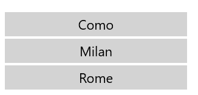

图 39:使用语义缩放控件显示的组列表。

`FlipView`控件提供了另一种显示项目集合的方式，当您想要将用户的注意力集中在所选项目上时，例如在照片库中，这种方式非常有用。事实上，当您使用`FlipView`控件时，只有选定的项目是可见的，并且它占据了所有可用的空间。用户需要向左或向右滑动(或使用应用程序在带鼠标和键盘的设备上运行时屏幕两侧显示的按钮)来显示集合中的其他项目。

除了这个差异之外，`FlipView`控件的行为类似于`GridView`或`ListView`控件:

*   您需要设置`ItemTemplate`属性来定义所选项目的布局。
*   您需要将项目集合分配给`ItemsSource`属性。

您可以订阅`SelectionChanged`事件，每次用户向左或向右滑动以显示另一个项目时都会收到通知。如果需要发现当前显示的是哪个项目，可以使用`SelectedItem`属性。

以下 XAML 代码显示了用于显示图像库的`FlipView`控件的示例定义:

代码清单 144

```cs
  <FlipView x:Name="Images">
      <FlipView.ItemTemplate>
          <DataTemplate>
              <Grid>
                  <Image Source="{Binding Image}" Stretch="UniformToFill"/>
                  <Border Background="#A5000000" Height="80" VerticalAlignment="Bottom">
                      <TextBlock Text="{Binding Title}" FontFamily="Segoe
  UI" FontSize="26" Foreground="#CCFFFFFF" Padding="15,20"/>
                  </Border>
              </Grid>
          </DataTemplate>
      </FlipView.ItemTemplate>
  </FlipView>
```

此类别包括所有可用于定义应用程序导航体验的控件，这意味着用户可以在应用程序的不同部分和页面间移动。一种导航方法并不比另一种好，因为这完全取决于您的场景和您想要显示的内容类型。

`Hub`控件通常用于定义应用程序的主页，它由一个接一个的不同部分组成。用户可以向左或向右滑动屏幕以查看上一节或下一节。为了帮助用户理解 sections 的概念，一个节不会占据页面的整个空间:右边的空白用来显示下一个节的一瞥，这样用户就可以理解有更多的内容要看和发现。

通常情况下，`Hub`控件不是用来包含大量数据的，而是用来提供数据的子集，并提供对应用程序不同部分的快速访问。例如，在新闻阅读器应用程序中，您不会使用`Hub`控件来显示所有可用的新闻；此任务可以分配给应用程序的特定页面。然而，`Hub`控件的一部分可以只显示最近的新闻，然后提供一个链接来查看所有的新闻。

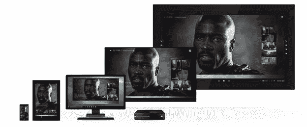

图 40:不同类型的 Windows 10 设备上显示的集线器控件。

以下是`Hub`控件的定义示例:

代码清单 145

```cs
  <Hub Header="Page title">
      <HubSection Header="First
  section">
          <DataTemplate>
              <Image Source="/Assets/image.png"
  />
          </DataTemplate>
      </HubSection>
      <HubSection Header="Second
  section">
          <DataTemplate>
              <StackPanel>
                  <TextBlock Text="Some
  content" />
              </StackPanel>
          </DataTemplate>
      </HubSection>
  </Hub>
```

`Hub`控件可以包括显示在顶部的标题。它是使用`Header`属性设置的，该属性接受一个简单的字符串。借助`HeaderTemplate`属性，您还可以通过定义新模板来完全自定义标题。

正如我们之前提到的，`Hub`控件被分成不同的部分。每一个都由`HubSection`控制器识别。每个部分都有独特的功能:

*   `HubSection`控件提供了一个名为`Header`的属性，该属性包含该部分的标题，并显示在每个部分的顶部。
*   使用`DataTemplate`定义该部分的内容。需要强调的是，尽管有这种行为，`Hub`控件不能显示数据集合。事实上，你会注意到`ItemsSource`房产不见了。

与定义简单页面的布局相比，使用`DataTemplate`来定义部分的外观会带来一些挑战。事实上，由于它是一个`DataTemplate`，我们不能简单地使用`x:Name`属性给控件分配一个名称，然后在代码隐藏中访问它。事实上，这些控件不是页面的一部分，而是包含在连接到`HubSection`的`DataTemplate`中。

让我们看一个真实的例子来更好地理解这个问题。以下面的 XAML 代码为例:

代码清单 146

```cs
  <Hub>
      <HubSection Header="First
  section">
          <DataTemplate>
              <TextBlock x:Name="Name" />
          </DataTemplate>
      </HubSection>
  </Hub>
```

通常，如果你想从代码中更新`TextBlock`的内容，你可以编写一个如下所示的事件处理程序:

代码清单 147

```cs
  private void OnButtonClicked(object sender, RoutedEventArgs e)
  {
      Name.Text = "Matteo";
  }
```

但是由于关键字`Name`标识的`TextBlock`控件是在一个`DataTemplate`里面定义的，所以这段代码不会编译，所以不能直接访问。解决方案是使用绑定，正如我们在第 2 章中所学的。

之前的`Hub`控制定义需要按照以下方式进行更改:

代码清单 148

```cs
  <Hub x:Name="MainHub">
      <HubSection Header="First
  section">
          <DataTemplate>
              <TextBlock Text="{Binding Name}" />
          </DataTemplate>
      </HubSection>
  </Hub>
```

我们还需要更改代码隐藏中的代码，以正确设置控件的`DataContext`，以便它可以找到名为`Name`的属性来解析绑定表达式:

代码清单 149

```cs
  public MainPageView()
  {
      this.InitializeComponent();
      Person person = new Person();
      person.Name = "Matteo";

  MainHub.DataContext = person;
  }
```

`Hub`控件支持的另一个功能是交互式标题。当我们启用它时，标题附近会出现一个标记为**查看更多**的链接，用户可以点击该链接，这样我们就可以执行额外的操作或导航。例如，一个部分可以只显示几条新闻，但是通过点击标题，用户可以被重定向到应用程序的另一个页面，在那里他们可以阅读所有可用的新闻。

要启用此功能，您需要在每个想要以这种方式管理的`HubSection`控件上将`IsHeaderInteractive`属性设置为`true`。然后，您需要实现由`Hub`控件直接提供的`SectionHeaderClick`事件。

以下示例显示了一个`Hub`控件，其中第一部分已被配置为支持交互式标题:

代码清单 150

```cs
  <Hub SectionHeaderClick="Hub_OnSectionHeaderClick">
      <HubSection Header="First
  section"
  IsHeaderInteractive="True">
          <DataTemplate>
              <Image Source="/Assets/image.jpg"
  />
          </DataTemplate>
      </HubSection>
      <HubSection Header="Second
  section">
          <DataTemplate>
              <StackPanel>
                  <TextBlock Text="Some
  content" />
              </StackPanel>
          </DataTemplate>
      </HubSection>
  </Hub>
```

下面的代码展示了如何管理`SectionHeaderClick`事件，这样我们就可以在每次用户点击标题时得到通知:

代码清单 151

```cs
  private async void Hub_OnSectionHeaderClick(object sender, HubSectionHeaderClickEventArgs e)
  {
      MessageDialog dialog = new MessageDialog(e.Section.Header.ToString());
      await dialog.ShowAsync();
  }
```

事件处理程序提供了一个参数(T0 类型)，该参数包含一个名为`Header`的属性，即触发事件的`HubSection`控件。您可以使用它来确定点击了哪个部分，并执行正确的导航。在前面的示例中，我们只显示带有弹出消息的选定部分的标题。

`Hub`控件是在 Windows 8 中引入的，但是 Windows 10 增加了一个新功能。您可以使用`Orientation`属性更改方向。默认情况下，`Hub`控件水平跨越，但是您可以将此属性更改为`Vertical`，因此所有部分将一个接一个地显示，而不是一个接一个地显示。

例如，商店应用程序使用这种方法在主页面中显示各种类别的应用程序，如下图所示:

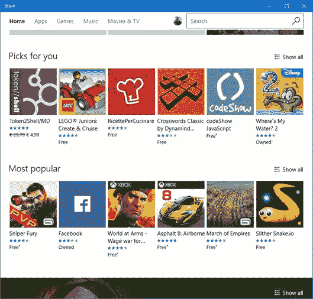

图 41:配置为使用垂直方向的集线器控件。

在上图中，**为您挑选的**和**最受欢迎的**是一个`Hub`控件的两个`HubSection`，它们一个接一个地显示。你也会注意到`IsHeaderInteractive`房产已经被设定为`True`。您可以在每个部分的末尾看到**显示全部**链接，该链接将用户重定向到应用程序的另一个页面，列出所选类别中的所有应用程序。

`Pivot`控件(在 Windows 10 之前，它只在手机上可用)提供的用户体验与其他移动平台中 tab 控件提供的用户体验相似。`Pivot`被分成不同的部分，用户可以通过向屏幕的左侧或右侧滑动(或者通过点击两侧的箭头，如果它们可见的话；如果应用程序运行在带有鼠标和键盘的设备上，这是另一个提供优化体验的控件)。然而，在这种情况下，每个部分都将适合页面的整个大小。为了帮助用户理解还有其他部分，顶部栏将显示其他部分的名称，当前部分以不同的颜色突出显示。

`Pivot`控制通常用于两种不同的情况:

*   您需要向用户显示相同类型的信息，但是要参考不同的上下文。微软的 MSN News 应用就是一个很好的例子。pivot 的所有部分都显示相同类型的信息(新闻)，但被不同的类别(政治、金融、科学等)过滤。).
*   您需要向用户显示不同的信息类型，但是它们与相同的上下文相关。内置的人员应用程序就是一个很好的例子。当你点击一个联系人时，你可以看到他们的所有细节，比如电话号码、发布在社交网络上的照片、最新的互动等。所有这些信息都存储在页面的不同部分。

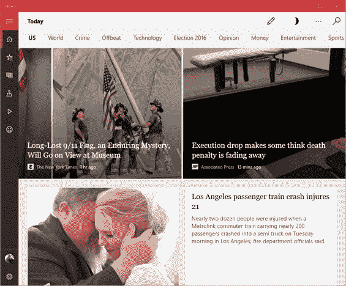

图 42:MSN News 应用程序使用 Pivot 控件(在顶部)允许用户从一个新闻类别切换到另一个。

以下示例显示了如何在 XAML 页面中使用`Pivot`控件:

代码清单 152

```cs
  <Pivot Title="Page title">
      <PivotItem Header="First
  header">
          <StackPanel>
              <TextBlock Text="Some
  content" />
          </StackPanel>
      </PivotItem>
      <PivotItem Header="Second
  section">
          <StackPanel>
              <TextBlock Text="Some
  other content" />
          </StackPanel>
      </PivotItem>
  </Pivot>
```

`Pivot`控件有一个名为`Title`的属性，它定义了页面的标题。另一方面，每个部分都由一个`PivotItem`控件标识，该控件嵌套在主`Pivot`控件中。每个标题都有自己的标题，即显示在顶部栏中的标题。要设置的属性称为`Header`。

除了这些特性之外，`PivotItem`控件充当了一个简单的容器。您可以在其中放置任何其他所需的 XAML 控件，当当前节处于活动状态时，该控件将呈现在页面中。

`Pivot`控件也可用于创建引导程序(如配置向导)。事实上，它提供了一个名为`IsLocked`的属性，当它被设置为`true`时，阻止用户移动到另一个部分。这样，只有当用户完成当前部分的所有必填字段时，您才能解锁下一部分。

`Pivot`控件也可以进行大量定制，使其更像选项卡控件。例如，Windows 10 中内置的报警&时钟应用程序使用这种方法来定义不同的部分，如下图所示。


图 43:闹钟应用程序使用定制的枢轴来创建标签效果。

然而，这种定制不是内置在控件中的；您需要对其模板进行许多更改。你可以在 GitHub 上的官方 [Windows 10 资源库](https://github.com/Microsoft/Windows-universal-samples/tree/master/Samples/XamlPivot)中找到一个工作样本。

`SplitView`控件是 Windows 10 中增加的另一个新功能，它允许您在应用程序中轻松创建“汉堡菜单”体验。汉堡菜单是什么？这是一个面板，通常放置在屏幕的左侧，可以通过点击按钮随时激活。这个按钮通常由三行标识，一行在另一行的下面，这让你想起了一个汉堡。

面板通常是让用户快速访问应用程序不同部分的一种方式。与其他导航方法不同(比如你可以用`Hub`或`Pivot`控件实现的导航方法)，汉堡菜单在应用程序的每一页上都是可用的。因此，无论用户访问哪个页面，他们总是能够快速跳转到应用程序的另一个部分。

许多 Windows 10 内置应用程序都利用了这种控制。下图显示了 Windows 10 音乐播放器 Groove Music，它使用汉堡菜单快速访问应用程序的各个部分，如专辑、艺术家、歌曲、设置等。

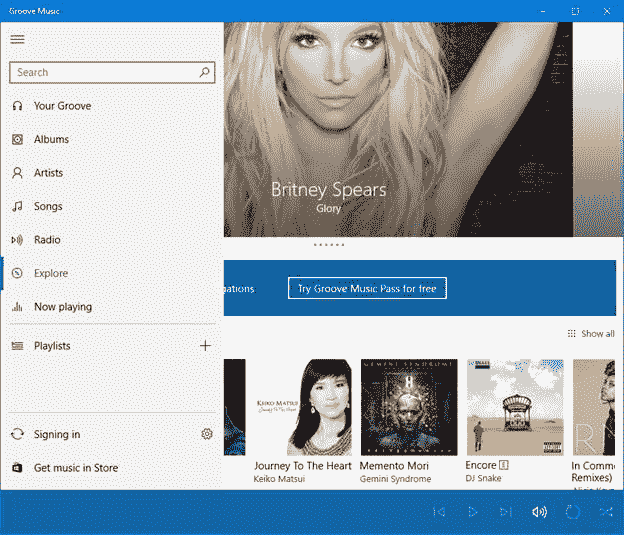

图 44:在 Groove Music 应用程序中实现的汉堡菜单。

然而，默认情况下，`SplitView`控件不提供任何内置功能来实现这种体验。事实上，它只是提供了一种将页面分成面板和主要内容的方法。在每个部分中，您可以通过利用任何 XAML 控件来定义自己的布局。以下是`SplitView`控件的一个非常简单的定义:

代码清单 153

```cs
  <SplitView DisplayMode="Inline" PanePlacement="Left" IsPaneOpen="True">
      <SplitView.Pane>
          <TextBlock Text="This
  is the panel"
  FontSize="24" 
                      HorizontalAlignment="Center"
                      VerticalAlignment="Center" />
      </SplitView.Pane>

      <TextBlock HorizontalAlignment="Center"
                  VerticalAlignment="Center" 
                  FontSize="24"
                  Text="This is the content" />
  </SplitView>
```

面板的内容包含在名为`Pane`的属性中，而页面的内容(在前面的示例中，由`TextBlock`生成)作为`SplitView`控件的子控件直接包含。在示例中，您可以看到控件提供的一些最重要的属性:

*   `DisplayMode`定义面板的显示方式。
*   `Inline`表示面板打开时，会占用内容区域的空间。
*   `CompactInline`表示当面板关闭时，一小部分仍然可见。当它打开时，它的行为类似于`Inline`属性，因此它从内容区域中占据空间。
*   `Overlay`表示面板打开时与内容区域重叠，不占用空间。
*   `CompactOverlay`表示当面板关闭时，一小部分仍然可见。当它打开时，它的行为类似于`Overlay`属性，因此它与内容区域重叠。
*   `PanePlacement`可用于将面板定位在屏幕的左侧或右侧。
*   `IsPaneOpen`定义面板是否可见。该物业的结果与`DisplayMode`严格相关。在常规显示模式下，如果该属性设置为`False`，则完全不可见。在紧凑显示模式下，只有当属性设置为`True`时，一小部分才可见并展开。

下图显示了上一个 XAML 代码的呈现方式:

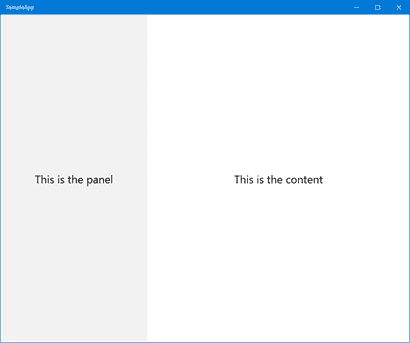

图 45:拆分视图控件。

`SplitView`控件提供的方法有一些优点和一些缺点。最大的优点是非常灵活。如您所见，您可以使用任何 XAML 控件定义面板，您可以自定义位置，您可以自定义行为等。缺点是，如果你想提供一个标准的汉堡菜单体验，就像我们在 Groove Music 应用程序中看到的那样，你必须自己做所有的事情。该框架没有提供内置控件来创建汉堡按钮(放置在顶部以显示/隐藏面板的按钮)，或者定义各种部分等。

因此，有许多第三方库推出了自己的基于`SplitView`控件的汉堡菜单实现，这使得重新创建内置 Windows 10 应用程序的用户体验变得更加容易。

在撰写本文时，您可以在应用程序中利用的最有用的实现是:

*   **UWP 社区工具包**中的`HamburgerMenu`控件，这是一个由微软创建的开源项目，目标是通过提供额外的控件和服务来扩展通用视窗平台提供的功能。作为一个开源项目，它允许社区的每个成员支持和改进它。此外，作为第三方库，而不是嵌入到平台中的东西，它可以比通用视窗平台更新得更频繁。工具箱的首页是[这里是](https://developer.microsoft.com/en-us/windows/uwp-community-toolkit)。从那里，您可以访问文档、GitHub 存储库和一个示例应用程序(在商店上发布)，您可以在其中尝试各种控件。具体来说，您可以在[本页](https://developer.microsoft.com/en-us/windows/uwp-community-toolkit/controls/hamburgermenu)找到关于`HamburgerMenu`控件的文档和示例代码。
*   **模板 10** 中的`HamburgerMenu`控件，这是微软创建的另一个开源项目，目标是提供结构更好、更易于使用的模板，作为创建通用视窗平台应用程序的起点。作为一个开源项目，它可以在 [GitHub](https://github.com/Windows-XAML/Template10) 上获得。该存储库包含许多示例，此外，您可以为 Visual Studio 2015 安装一个扩展，在 Windows 部分的“通用”类别中添加一组新模板。其中一个包含`HamburgerMenu`控件的示例实现，因此如果您计划在应用程序中利用这种导航方法，这是一个很好的起点。您可以在此处阅读完整的文档。

此外，这两个工具包都允许您使用`SplitView`控件解决其中一个挑战。默认情况下，通用视窗平台应用程序嵌入到`Frame`中，这是应用程序所有页面的容器。感谢`Frame` 类，您可以利用一组 API 从一个页面移动到另一个页面。使用`SplitView`控件的问题在于，由于默认情况下您在应用程序中使用一个空的`Frame`，您需要找到一种方法在每个页面上应用相同的菜单，同时保持导航流一致。这两个工具包都提供了一种方法，通过`HamburgerMenu`控制将`Frame`从一个空容器变成一个容器。这样，应用程序的所有其他页面都将托管在这个容器中，它们将共享同一个菜单。

您将在本系列的第二本书中看到更多细节，我们将详细讨论如何在通用视窗平台应用程序中处理导航。

我不会在本章详细描述如何使用两个提到的`HamburgerMenu`控件。这将超出本书的范围，因为它们是不断发展的开源项目的一部分，因此，这些信息可能很快就会过时。

应用程序栏是 Windows 中的关键控件之一，被许多应用程序广泛使用。它提供了一个栏，可以包含不同的交互元素(如按钮)，这些元素通常提供一组选项来与当前显示的内容进行交互。

例如，内置的邮件和日历应用程序在您阅读邮件时利用应用程序栏来提供最常用的功能，如回复、全部回复、转发等。，或者当您使用日历时，可以快速创建新约会、移动到当前日期等。

为了创建应用程序栏，通用视窗平台提供了一个名为`CommandBar`的控件，该控件在页面级别定义，可以放在两个位置:

*   在屏幕顶部，通过利用`Page`类的`TopAppBar`属性。
*   在屏幕底部，通过利用`Page`类的`BottomAppBar`属性。

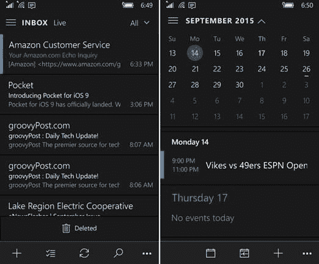

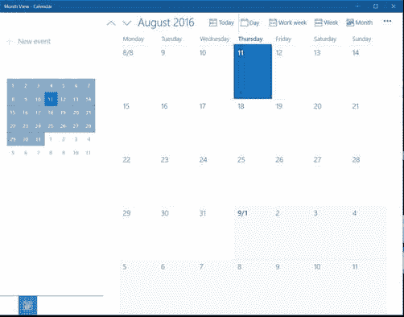

图 46:邮件和日历应用程序利用了基于平台的两种方法。在移动设备上，应用程序栏位于底部(顶部图像)，在桌面上，它位于顶部(底部图像)。

不管位置如何，一个`CommandBar`提供两种命令:

*   `PrimaryCommands`是最重要的，它们总是可见的。它们显示有一个图标和一个标签，其中包含该功能的简要描述。
*   `SecondaryCommands`与次要功能有关。默认情况下，它们是隐藏的，只有当用户点击右侧的三个点来展开应用程序栏时才会显示。它们没有图标，只有文字描述。

以下示例定义了放置在页面底部的`CommandBar`:

代码清单 154

```cs
  <Page
      x:Class="SampleApp.MainPage"

      xmlns:x="http://schemas.microsoft.com/winfx/2006/xaml"
      xmlns:d="http://schemas.microsoft.com/expression/blend/2008"
      xmlns:mc="http://schemas.openxmlformats.org/markup-compatibility/2006"
      mc:Ignorable="d">

      <Page.BottomAppBar>
          <CommandBar>
              <CommandBar.PrimaryCommands>
                  <!-- primary commands -->
              </CommandBar.PrimaryCommands>
              <CommandBar.SecondaryCommands>
                  <!-- secondary commands -->
              </CommandBar.SecondaryCommands>
          </CommandBar>
      </Page.BottomAppBar>

      <Grid>
          <!-- page content -->
      </Grid>
  </Page>
```

`CommandBar`支持三种不同类型的命令:

*   一个按钮，由`AppBarButton`类标识。
*   一个切换按钮(可保持开/关状态)，由`AppBarToggleButton`类标识。
*   分隔符，用于将命令分组到不同的部分，由`AppBarSeparator`标识。

按钮的视觉布局由两个重要属性定义:`Label`和`Icon`。标签是显示在按钮下方的文本。`Icon`是按钮内部显示的图像，其工作方式不同于标准的`Image`控制。默认情况下，您不能简单地指定图像路径，而是指定属于 Segoe UI 字体系列的符号之一。您可以在 [MSDN 文档](http://s.qmatteoq.com/AppBarSymbols)中找到所有可用符号的列表。

以下示例显示了带有`Save`图标的`AppBarButton`控件:

代码清单 155

```cs
  <Page.BottomAppBar>
      <CommandBar>
          <CommandBar.PrimaryCommands>
              <AppBarButton Label="Save" Icon="Save" />
          </CommandBar.PrimaryCommands>
      </CommandBar>
  </Page.BottomAppBar>
```

但是，如果您找不到合适的图标，仍然有一种方法可以使用扩展语法定义`Icon`属性，将自己的图像用作图标，如下例所示:

代码清单 156

```cs
  <Page.BottomAppBar>
      <CommandBar>
          <CommandBar.PrimaryCommands>
              <AppBarButton Label="Save">
                  <AppBarButton.Icon>
                      <BitmapIcon UriSource="/Assets/image.png"
  />
                  </AppBarButton.Icon>
              </AppBarButton>
          </CommandBar.PrimaryCommands>
      </CommandBar>
  </Page.BottomAppBar>
```

在管理用户与应用程序栏命令的交互时，与常规的`Button`控件没有区别。事实上，它们公开了一个`Click`事件，您可以在代码隐藏中订阅该事件，以便在单击按钮时执行一些操作。以下代码显示了一个完整的`CommandBar`示例:

代码清单 157

```cs
  <Page.BottomAppBar>
      <CommandBar>
          <CommandBar.PrimaryCommands>
              <AppBarButton Label="refresh" Click="OnButton1Clicked" Icon="Refresh" />
              <AppBarSeparator />
              <AppBarToggleButton Label="add" Click="OnButton2Clicked" Icon="Favorite" />
          </CommandBar.PrimaryCommands>
          <CommandBar.SecondaryCommands>
              <AppBarButton Label="save" Click="OnButton3Clicked" Icon="Save" />
          </CommandBar.SecondaryCommands>
      </CommandBar>
  </Page.BottomAppBar>
```

周年更新在`CommandBar`控件中增加了一项新功能，使创建自适应布局变得更加容易。到目前为止，我们已经看到，当您向栏中添加项目时，您必须在主命令和辅助命令之间分割它们。然而，这种方法在创建能够适应多种设备和屏幕尺寸的用户界面时有缺点。无论您的应用程序可以使用多少空间，除非用户点击三个点，否则辅助命令将始终隐藏。

周年更新增加了一个新属性`IsDynamicOverflowEnabled`。当设置为`True`时，您可以开始在`CommandBar`控件内添加项目，而无需将其分类为主要或次要命令。然后，`CommandBar`会自动尝试将它们中的大部分渲染为主要的，如果没有剩余空间，它会将它们移动到次要的。

您可以通过为每个可以放在`CommandBar`中的控件提供的`DynamicOverflowOrder`属性分配一个数值来影响哪些命令对您的场景来说不太重要。让我们看看下面的示例实现:

代码清单 158

```cs
  <Page.BottomAppBar>
      <CommandBar IsDynamicOverflowEnabled="True">
          <AppBarButton Label="Favorite" Icon="Favorite" />
          <AppBarButton Label="Pin" Icon="Pin" />
          <AppBarButton Label="Website" Icon="World" />
          <AppBarButton Label="Buy" Icon="Shop" DynamicOverflowOrder="1" />
          <AppBarButton Label="Trailer" Icon="Play" DynamicOverflowOrder="2" />
          <AppBarButton Label="Similar
  shows" Icon="People" DynamicOverflowOrder="3" />
      </CommandBar>
  </Page.BottomAppBar>
```

如你所见，这个`CommandBar`包含六个`AppBarButton`控件。其中三个将`DynamicOverflowOrder`属性设置为数值，这意味着一旦窗口开始缩小，根据我们定义的顺序，它们将是第一个移动到辅助命令的(因此购买按钮将是第一个移动的，然后是预告片和类似节目)。

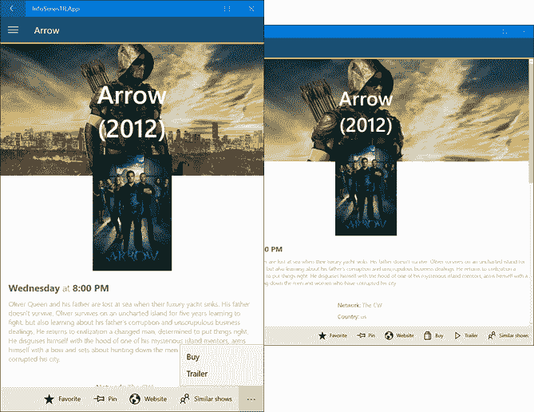

图 47:两幅图像显示了同一个页面，但显示的屏幕大小不同。应用程序栏中的一些按钮会自动移动到较小窗口中的辅助命令。

`StatusBar`是目前仅在移动平台上可用的控件，因为它是放置在顶部的系统托盘，操作系统在那里显示一些重要信息，如时间、信号强度等。要访问该控件，您首先需要添加一个对**Windows Mobile Extensions for Mobile**库的引用，当您右键单击项目时可以找到该库，选择**添加引用，**并移动到**通用 Windows - > Extensions** 部分。通用视窗平台允许开发人员与此栏交互以执行额外的操作。

然而，由于这是一个只适用于手机的控件，你不能从 XAML 直接与它交互。我们需要通过使用`StatusBar`类(部分`Windows.UI.ViewManagement`命名空间)在代码隐藏中管理它，该类提供了一个名为`GetForCurrentView()`的方法，该方法返回对 bar 的引用。

但是，请记住，在使用这些 API 之前，您需要利用第 1 章中描述的能力检测方法。事实上，如果您试图在桌面或控制台上调用以下 API 之一，您会得到一个异常，因为这些平台上没有实现这个控件。

因此，大多数情况下，您将编写如下代码:

代码清单 159

```cs
  private void
  CustomizeSystemTray()
  {
      var api = "Windows.UI.ViewManagement.StatusBar";
      if (ApiInformation.IsTypePresent(api))
      {
          StatusBar statusBar = StatusBar.GetForCurrentView();
          //do something with the status bar
      }
  }
```

这里有一些主要的操作，一旦你有了对当前栏的引用，你就可以做。

作为开发人员，您可以隐藏状态栏，以便应用程序可以使用屏幕上的所有可用空间。如果您的应用程序使用自定义主题，该功能也很有用，因为默认情况下，它会保持手机的相同主题颜色(黑色或白色)，所以与顶部栏混合在一起看起来会很糟糕。

但是，您必须谨慎使用此功能。隐藏状态栏意味着一些重要信息将被隐藏，除非用户决定从屏幕顶部下拉操作中心。因此，例如，如果您的应用程序大量使用数据连接，隐藏状态栏不是一个好主意，因为用户无法立即判断问题是否是由网络问题引起的(比如她没有手机信号)。

要隐藏状态栏，只需调用`HideAsync()`方法即可，如下例所示:

代码清单 160

```cs
  private async void OnChangeSystemTrayClicked(object sender, RoutedEventArgs e)
  {
      StatusBar statusBar = StatusBar.GetForCurrentView();
      await statusBar.HideAsync();
  }
```

如果想再次显示，只需调用`ShowAsync()`方法:

代码清单 161

```cs
  private async void OnChangeSystemTrayClicked(object sender, RoutedEventArgs e)
  {
      StatusBar statusBar = StatusBar.GetForCurrentView();
      await statusBar.ShowAsync();
  }
```

如果你不想隐藏状态栏，但你仍然不想让你的应用程序看起来很糟糕，因为状态栏的颜色与你的主题不太协调，`StatusBar`控件提供了更多的选择。

一种方法是改变条的不透明度。这样，你就能使它透明，从而使各种指标(时间、信号强度等。)仍然可见，但它们将显示在应用程序的主题上，不会干扰应用程序。为此，您需要使用您喜欢的不透明度值设置`BackgroundOpacity`属性，如下例所示:

代码清单 162

```cs
  private void
  OnChangeSystemTrayClicked(object
  sender, RoutedEventArgs e)
  {
      StatusBar statusBar = StatusBar.GetForCurrentView();

  statusBar.BackgroundOpacity = 0.4;
  }
```

 `BackgroundOpacity`属性结合使用的另一种方法是通过设置`BackgroundColor`属性来更改背景颜色，如下例所示:

代码清单 163

```cs
  private void
  OnChangeSystemTrayClicked(object
  sender, RoutedEventArgs e)
  {
      StatusBar statusBar = StatusBar.GetForCurrentView();
      statusBar.BackgroundOpacity
  = 1.0;

  statusBar.BackgroundColor = Colors.Red;
  }
```

在本章前面，我们学习了如何使用`ProgressBar`和`ProgressRing`等控件向用户显示运行操作的状态。然而，在 Windows 10 上还有另一种选择。您可以在屏幕顶部的状态栏中显示进度条，而不是在页面内部显示进度条。在这种情况下，你需要使用`ProgressIndicator`控件，它和`ProgressBar`一样，支持两种动画。默认值是一个不确定值，用于跟踪您无法确定确切持续时间的操作。否则，如果要显示标准进度条，可以用介于`0`(空条)和`1`(满条)之间的值填充`ProgressValue`属性。

无论您选择何种行为，您也可以使用显示在进度条下方的`Text`属性添加文本，如下例所示:

代码清单 164

```cs
  private async void
  OnChangeSystemTrayClicked(object
  sender, RoutedEventArgs e)
  {
      StatusBar statusBar = StatusBar.GetForCurrentView();

  statusBar.ProgressIndicator.Text = "Loading...";
      await
  statusBar.ProgressIndicator.ShowAsync();
  }
```

一旦您配置了由`StatusBar`控件公开的`ProgessIndicator`属性，您就可以通过调用`ShowAsync()`方法来显示它，或者通过使用`HideAsync()`方法来隐藏它。

应用程序中的另一个常见要求是显示一条对话消息，例如，要求用户确认他想要继续操作。

在通用视窗平台应用程序中，有两种对话框可以利用:对话框和弹出窗口。

#### 对话

对话框有一种模态方法，它们通常显示在屏幕的中间，迫使用户做出选择。在用户选择可用选项之一之前，该对话框不会消失。

最简单的对话框控件称为`MessageDialog`，通常用于显示警告或消息，用户只需按下**关闭**按钮即可确认。

代码清单 165

```cs
  private async void OnShowDialog(object sender, RoutedEventArgs e)
  {
      MessageDialog dialog = new MessageDialog("Internet connection not available. Try again later.", "Error");
      await dialog.ShowAsync();
  }
```

我们创建一个新的`MessageDialog`对象，传递内容(必需)和标题(可选)作为参数。最后，我们调用`ShowAsync()`方法来显示对话框。

下图显示了之前代码的结果:

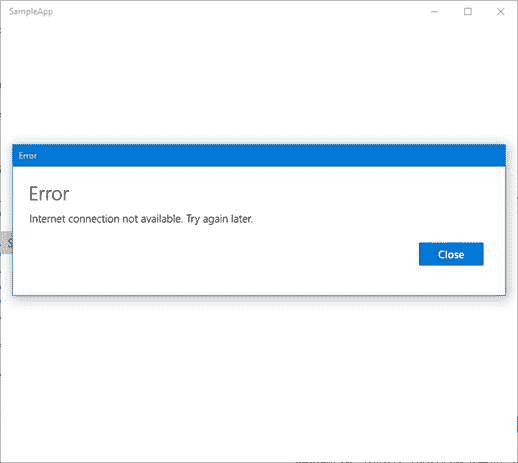

图 48:一个简单的消息对话框。

更可定制的对话框类型是`ContentDialog`类，它可以提供定制的内容和多个按钮。通常，当您想要向用户呈现一个选择时会用到它。请看下面的代码:

代码清单 166

```cs
  private async void OnShowDialog(object sender, RoutedEventArgs e)
  {
      ContentDialog dialog = new ContentDialog();
      dialog.Title = "Cancel item";
      dialog.Content = "Do you want to cancel the
  selected item?";
      dialog.PrimaryButtonText = "Ok";

  dialog.SecondaryButtonText = "Cancel";
      ContentDialogResult result = await dialog.ShowAsync();

      if (result == ContentDialogResult.Primary)
      {
          //delete the item
      }
      else
      {
          //cancel the operation
      }
  }
```

我们创建了一个新的`ContentDialog`对象，除了像`MessageDialog`类那样分配一个`Title`和`Content`之外，我们还使用`PrimaryButtonText`和`SecondaryButtonText`属性设置了将在对话框中显示的两个按钮的文本。

在这种情况下，当我们调用`ShowAsync()`方法时，我们也得到一个结果，它是一个类型为`ContentDialogResult`的枚举器。由于这个返回值，我们可以了解哪个按钮被按下，并以适当的方式行动。下图显示了之前运行的代码:

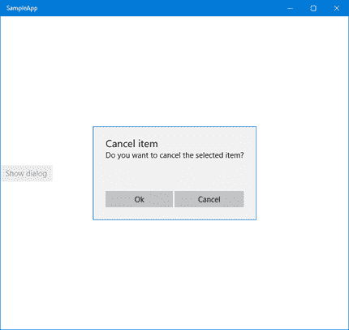

图 49:简单的内容对话框。

如果您愿意，还可以通过利用通用视窗平台中的特定项目模板，对`ContentDialog`布局的外观进行更深入的控制。在这种情况下，我们可以使用 XAML 的全部能力来定义对话框的方面，而不是像以前那样利用 C# 代码中的基础`ContentDialog`类。

为了达到这个结果，你可以右击你的项目，选择**添加- >新项目- >内容对话框**。您将获得具有以下定义的新 XAML 文件:

代码清单 167

```cs
  <ContentDialog
      x:Class="SampleApp.CustomContentDialog"

      xmlns:x="http://schemas.microsoft.com/winfx/2006/xaml"
      xmlns:local="using:SampleApp"
      xmlns:d="http://schemas.microsoft.com/expression/blend/2008"
      xmlns:mc="http://schemas.openxmlformats.org/markup-compatibility/2006"
      mc:Ignorable="d"
      Title="Cancel Item"
      PrimaryButtonText="Ok"
      SecondaryButtonText="Cancel"
      PrimaryButtonClick="ContentDialog_PrimaryButtonClick"
      SecondaryButtonClick="ContentDialog_SecondaryButtonClick">

      <Grid>

  <!-- content of the
  dialog -->
      </Grid>
  </ContentDialog>

```

如你所见，这不是一个普通的页面，因为根节点被称为`ContentDialog`。然而，它的行为就像一个。它有一个 XAML 文件(带有用户界面定义)和一个. cs 文件(处理逻辑并包含 C# 代码)。您还可以看到我们以前在代码中设置的属性(如`Title`或`PrimaryButtonText`)现在如何直接在 XAML 设置。

与以前的方法相比，主要区别是:

*   `Content`可以用完整的 XAML 堆栈来表示，而不是用简单的字符串。我们可以在`Grid`中放置任何我们想要的 XAML 内容，因此，完全定制对话框的外观和感觉。
*   默认情况下，当用户点击两个按钮(`PrimaryButtonClick`和`SecondaryButtonClick`)时，对话框会提供两个事件。这样，除了仅仅知道哪个按钮被按下，我们还可以包括一些额外的逻辑(例如，如果用户按下按钮以确认他想要取消所选项目，我们可以在本地设置中存储一些数据)。

下面的例子展示了一个完全定制的`ContentDialog`，这里的`Content`不仅仅是一个普通的弦，而是由各种 XAML 控件组成，像一个`StackPanel`、`Image`和一个`TextBlock`:

代码清单 168

```cs
  <ContentDialog
      x:Class="SampleApp.CustomContentDialog"

      xmlns:x="http://schemas.microsoft.com/winfx/2006/xaml"
      xmlns:local="using:SampleApp"
      xmlns:d="http://schemas.microsoft.com/expression/blend/2008"
      xmlns:mc="http://schemas.openxmlformats.org/markup-compatibility/2006"
      mc:Ignorable="d"
      Title="Question"
      PrimaryButtonText="Yes"
      SecondaryButtonText="No"
      PrimaryButtonClick="ContentDialog_PrimaryButtonClick"
      SecondaryButtonClick="ContentDialog_SecondaryButtonClick">

      <Grid>
          <StackPanel Orientation="Horizontal">
              <Image Source="/Assets/image.jpg" Width="100" />
              <TextBlock Text="Do
  you like this logo?"
  />
          </StackPanel>
      </Grid>
  </ContentDialog>

```

要显示这个对话框，你只需要创建一个你已经创建的自定义对话框的新实例，然后调用`ShowAsync()`方法。从`x:Class`属性中可以看到，这个对话框连接到一个名为`CustomContentDialog`的代码隐藏类，下面是我们如何用 C# 代码显示它:

代码清单 169

```cs
  private async void OnShowDialog(object sender, RoutedEventArgs e)
  {
      CustomContentDialog dialog = new CustomContentDialog();
      ContentDialogResult result = await dialog.ShowAsync();

      if (result == ContentDialogResult.Primary)
      {
          //handle the positive feedback
      }
      else
      {
          //handle the negative
  feedback
      }
  }
```

#### 飞来飞去

弹出按钮就像对话框，但它们应该用于显示瞬态信息。它们不是模态的，但它们有一个轻微的消除行为(这意味着如果用户在对话框外点击或轻敲，它将被自动消除，而不会迫使他们做出选择)。由于大多数处理与用户交互的 XAML 控件所公开的`Flyout`属性，通常会定义弹出按钮。`Button`控件就是其中之一，如下例所示:

代码清单 170

```cs
  <Button Content="Delete item">
      <Button.Flyout>
          <Flyout>
              <StackPanel>
                  <TextBlock Text="Do
  you really want to delete it?" />
                  <StackPanel Orientation="Horizontal">
                      <Button Content="Yes" Click="OnDelete" />
                      <Button Content="No" Click="OnCancel" />
                  </StackPanel>
              </StackPanel>
          </Flyout>
      </Button.Flyout>
  </Button>
```

在由`Button`控件公开的`Flyout`属性中，我们定义了一个简单地包含其他 XAML 控件的`Flyout`控件。在这种情况下，我们会在用户按下按钮时询问他是否真的想删除某个项目。与我们之前看到的`ContentDialog`对照样本不同的是，这一次用户不会被迫做出选择。他们只需在弹出按钮外单击即可隐藏对话框。我们不需要调用任何 C# 代码来显示弹出按钮。按下按钮显示就足够了。以下是前面的代码在示例应用程序中的外观:

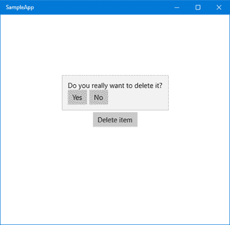

图 50:弹出控件。

与`Button`控件的标准用法的主要区别在于，在这种情况下，我们不会处理`Button`控件的`Click`事件。它的目的只是显示弹出按钮。将由弹出按钮中包含的两个按钮(是和否)来处理`Click`事件并执行预期的逻辑(如如果用户按下是则删除项目，或者如果用户按下否则取消操作)。

#### 上下文菜单

通用视窗平台提供了一个特殊版本的`Flyout`控件，称为`MenuFlyout`，可用于创建上下文菜单，允许您对选定的项目执行额外的操作。这个概念在桌面上被广泛使用。当您用鼠标右键单击某个项目时，会出现一个选项列表，您可以从中进行选择。

由于`ContextFlyout`属性，每个 XAML 控件都支持这种弹出型。以下示例显示了添加到`TextBlock`控件的`MenuFlyout`:

代码清单 171

```cs
  <TextBlock Text="This is an item">
      <TextBlock.ContextFlyout>
          <MenuFlyout>
              <MenuFlyoutItem Text="Open" Click="OnOpen" />
              <MenuFlyoutItem Text="Edit" Click="OnEdit" />
              <MenuFlyoutSeparator />
              <MenuFlyoutItem Text="Delete" Click="OnDelete" />
              <ToggleMenuFlyoutItem Text="Is
  active" />
          </MenuFlyout>
      </TextBlock.ContextFlyout>
  </TextBlock>
```

可以看到，一个`MenuFlyout`可以包含不同种类的项目:

*   `MenuFlyoutItem`只是列表中的一个项目，它有一个`Text`属性(标签)和一个`Click`事件(当您选择它时处理要执行的操作)。
*   `MenuFlyoutSeparator`增加了一个分隔符，可以用来将不同的选项分组到多个类别中。
*   `ToggleMenuFlyoutItem`的行为类似于`ToggleButton`控件，可以根据`IsChecked`属性的值呈现两种状态，活动或不活动。

下图显示了实现前面代码的应用程序:

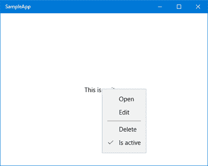

图 51:一个菜单输出控件。