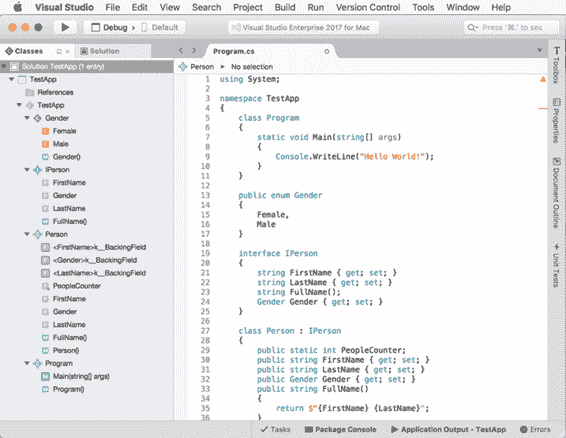
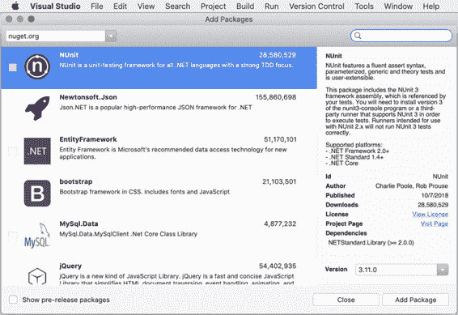

# 二、探索集成开发环境

Visual Studio for Mac 提供了一个非常强大的集成开发环境(IDE)，它具有非常通用的代码编辑器和大量的生产力工具。本章提供了如何利用集成工具并从生产效率方面充分利用集成开发环境的指导。

## 欢迎页面

启动时，Visual Studio for Mac 会显示欢迎页面。这包含许多简化常见任务的快捷方式和链接。图 1 显示了它是如何出现的。

图 1:欢迎页面

选择**窗口** > **欢迎页面**可以随时打开欢迎页面。这一页由几个区域组成，在接下来的段落中都有描述。

### 开始区域

在欢迎页面的左侧，您可以找到**开始**区域。在这里，您可以找到到官方在线资源的链接，您可以阅读这些资源来获得关于 Visual Studio for Mac 的更多信息。NET 核心，以及 Xamarin。

### 最近的区域

**最近的**区域显示最近使用的项目列表，位于“开始”区域的右侧。如果这是您第一次打开 Visual Studio，“最近”区域将为空。在图 1 中，您可以看到一个最近使用的项目列表的例子，它出现在我的机器上。

只需点击项目名称即可打开。您也可以通过在**过滤器**文本框内输入来过滤列表。当您将鼠标悬停在项目名称上时，您还会看到带有 x 符号的图标，这允许您从列表中删除项目。请注意，此操作不会从磁盘上删除项目；它只是将项目从最近使用的列表中移除。

### 开发商新闻区

**开发者新闻**区域位于欢迎页面的右侧，聚合了来自 Visual Studio 团队博客和其他微软资源的新闻和更新。只需点击一个超链接，打开你的网络浏览器，在线阅读完整的文章或博客文章。这是一种非常方便的方式来接收来自微软官方来源的更新，并了解 Visual Studio 中针对 Mac 的新功能和版本。

#### 报告反馈

在开发者新闻区的顶部，你还会看到两个快捷方式，分别叫做**报告问题**和**提供建议**。第一个快捷方式允许您直接向微软报告在 Visual Studio 中发现的任何问题。Visual Studio 显示了一个对话框，您可以在其中输入详细信息，也可以选择添加屏幕截图。第二个快捷方式**提供建议**，将在浏览器中打开用户语音网站。用户语音是用户可以发送他们对特定微软产品的建议或功能请求的地方。

## 创建项目

您可以通过**欢迎使用**页面上的**新项目**按钮，或者通过选择**文件** > **新解决方案**来创建项目。这两个动作都会打开**新建项目**对话框，您可以在其中看到可用项目模板的完整列表。图 2 显示了完整列表的摘录，您可以通过滚动对话框左侧的列表来查看。

图 2:创建一个新项目

在下一小节中，您将阅读更多关于可用项目模板的详细信息，然后在第 3 章和第 4 章中，您将学习如何使用一些模板。NET 核心和 Xamarin。请记住，您只需单击项目模板，即可在对话框的右侧看到描述。例如，在图 2 中，您可以看到 ASP.NET 核心网络应用程序项目模板的描述。在这种情况下，描述解释了这个项目模板如何生成一个由 ASP.NET 核心应用程序组成的解决方案，其中包括示例 ASP.NET 剃刀页面。单击其他项目模板时，您会得到类似的描述。

|  | 提示:您必须滚动左边的列表才能看到所有可用的项目模板。此外，“新建项目”对话框显示一个名为“最近使用”的选项卡，您将在其中看到最近使用的项目模板列表。 |

Visual Studio for Mac 允许从 web()构建各种不同的应用程序。NET Core)到移动(Xamarin)到云(Azure)。此外，它还允许构建应用程序。NET，使用 Mono 作为开发平台。表 1 总结了 Visual Studio 中可供 Mac 使用的项目类别。

表 1

| 可用的项目类别 |
| --- |
| **类别** | **描述** |
| 多平台 | 包含 Xamarin 项目模板，这些模板专注于代码重用，以构建跨平台应用程序、游戏和库。 |
| ios | 包含基于 Xamarin.iOS 的项目模板，允许您为 iPhone 和 iPad 构建应用程序、游戏和库。 |
| 电视呢 | 包含基于 Xamarin 的项目模板。允许你为苹果电视操作系统构建应用程序、游戏和库的 TVOS。 |
| 机器人 | 包含基于 Xamarin 的项目模板。允许你为安卓设备(包括可穿戴设备)构建应用、游戏和库的安卓系统。 |
| 。净核心 | 包含允许您基于构建跨平台控制台和 web 应用程序的项目模板。NET 核心。 |
| 苹果个人计算机 | 包含基于 Xamarin 的项目模板。允许你为苹果电脑构建应用程序和游戏的苹果电脑。 |
| 云 | 包含允许在 C#中开发 Azure 函数的项目模板。 |
| 其他的 | 包含杂项项目模板；大多数相关模板都允许构建在 Mono 上运行的 Console 和 ASP.NET 网络应用程序和服务。 |

每个类别由一个或多个专门的项目模板组成。所有项目类别包括三个子类别:应用程序、库和测试。应用子类别包括您用于应用开发的项目模板；库包含可以用来创作库的项目模板，这两个库都是带有。NET 标准规范和特定于平台的库；和 Tests 包括可以用来编写单元测试的项目模板(。NET Core)和自动化 UI 测试(Xamarin)。作为例外，“云”类别仅包含一个名为“常规”的子类别。

|  | 注意:安装了正确的工具后，Unity 游戏开发的项目模板将出现在“新建项目”对话框中。 |

### 创建你的第一个 C#项目

为了发现 Visual Studio for Mac IDE 的优点，您至少需要创建一个基本项目。在**新建项目**对话框中，选择下方的**控制台应用**模板。网芯(见图 2)，然后点击**下一步**。在下一个屏幕上，选择的最高版本。网芯在你的机器上可用，然后点击**下一步**。在最后一个屏幕上(见图 3)，为新的示例应用程序输入您选择的名称。

图 3:输入项目名称

**位置**文本框允许您为新解决方案指定文件夹。默认情况下，Visual Studio for Mac 会在 Mac 的主目录下创建一个**项目**文件夹。您可以点击**浏览**选择不同的文件夹，或者您可以简单地键入一个新的文件夹名称，也可以在 IDE 选项中更改默认文件夹。我建议您保持选中“在解决方案目录中创建项目目录”旁边的复选框此选项确保为解决方案创建根文件夹，并在解决方案文件夹中为新项目创建子文件夹。这有助于保持解决方案的结构井然有序，尤其是如果您计划稍后向解决方案中添加新的或现有的项目。

“新建项目”对话框在右侧**预览**下提供了解决方案文件夹结构的可视化表示。您将看到此预览如何根据选中还是取消选中目录复选框而变化。您还可以选择为解决方案启用 Git 版本控制，但这将在第 5 章中详细讨论。

准备好之后，点击**创建**。几秒钟后，你的新项目就准备好了。如果您从未对集成开发环境进行过自定义，默认情况下，您会在工作区的左侧看到解决方案面板，在右侧看到代码编辑器。您可能还会看到其他便笺簿，如“错误”。如果您没有看到代码编辑器，请在解决方案面板中展开项目视图，然后双击 **Program.cs** 文件。此时，您的工作空间应该如图 4 所示。

图 4:一个新的 C#控制台应用程序项目就绪

当您创建新项目或打开现有解决方案时，Visual Studio for Mac 将自动尝试刷新对外部库(如 NuGet 包)的任何引用。这可能需要几秒钟；您将在上方的状态栏中看到还原操作的进度(通常可以在那里看到 Visual Studio 图标和产品名称)。记住这一点很重要，因为您可能有依赖项的项目，并且在库恢复完成之前，您可能会在代码编辑器中看到一些错误标记。

解决方案板(您可以在图 4 的左侧看到)是一个非常重要的工具，您将一直使用它。它基本上提供了解决方案的分层视图，并允许您浏览文件和文件夹。您也可以右键单击解决方案名称，然后选择**添加** > **新项目**或**添加** > **现有项目**来添加新项目或现有项目。您还可以添加单个文件和文件夹(称为解决方案项)，这些文件和文件夹不属于生成输出的一部分，但您可能需要用于多种目的，例如您可能希望包含在团队中的文档或图像。

对于解决方案中的每个项目，解决方案面板不仅显示文件，还显示项目对特定 SDK 的依赖关系(例如。NET Core)或外部库。请注意代码编辑器如何为任何受支持的语言提供语法着色，正如您所料。

### 运行项目

作为一种常见行为，Visual Studio for Mac 通过**构建全部**、**重建全部**、**构建**和**重建**命令，在**构建**菜单中提供编译代码的命令。在编译代码时，还需要选择一个构建配置，Visual Studio for Mac 公开了 Debug 和 Release 配置，这些配置是不言自明的，尤其是如果您有使用 Visual Studio for PC 的经验。您可以从标准工具栏中选择配置(参见图 5)。

图 5:标准工具栏

请注意，根据特定于平台的项目模板，可能会有其他配置可用，但这两种配置肯定适用于所有项目。您可以使用工具栏中的**开始**按钮和**运行**菜单中的两个命令运行您的解决方案:**开始调试**和**开始但不调试**。在第一种情况下，首先选择**调试**配置，然后调用命令。这将从附加了调试器实例的 IDE 中启动应用程序，并将启用 Visual Studio 中强大的调试工具，您将很快学会利用这些工具。在第二种情况下，您可以选择**发布**配置，应用程序将在没有调试器实例的情况下启动，从 IDE 中分离出来。在不进行调试的情况下运行应用程序时，您当然可以选择调试配置，但是生成的调试符号将被忽略。

选择配置后，您可以启动应用程序，除了运行菜单中的两个命令，最简单的方法是单击**开始**按钮，如图 5 所示。当您启动应用程序时，Visual Studio 首先保存所有最近的更改，然后如果它检测到上次生成的某些更改(或者如果您从未生成过解决方案)，它将执行“全部生成”操作。如果在启动应用程序之前已经调用了“全部生成”或“全部重建”，则不会执行“全部生成”操作。图 6 显示了在终端中运行的示例控制台应用程序。

图 6:终端中运行的示例应用程序

在这种情况下，应用程序已经在启用调试配置的情况下启动，因此附加了调试器的实例。到目前为止，您看到的所有步骤都适用于所有支持的项目类型，唯一的区别是应用程序主机，根据项目类型，它可以是终端窗口、网络服务器、设备模拟器或物理设备。

## 理解垫

pad 是负责各种任务的浮动工具窗口。Visual Studio for Mac 中的 pad 可以比作 windows 上 Visual Studio 中的工具窗口，也可以比作苹果 Xcode 中的 pad。Pads 可以根据您的喜好在工作区中进行停靠和排列，这样您就可以以最适合自己的方式定制开发环境。

在前几节中，您使用了解决方案面板，它允许您浏览和管理解决方案中的项目和代码文件。在本节中，您将了解 Visual Studio 中用于 Mac 的其他最重要和最常见的 pad。在适当的情况下，将讨论其他一些特定的焊盘。

一般来说，可以通过**查看** > **pads** 启用 Pads。当您打开一个面板时，它会自动停靠并定位在 IDE 中的特定位置，但是您可以根据需要重新排列它，也可以取消停靠面板并将其视为独立窗口。

您还可以自动隐藏焊盘，以便仅在必要时显示它们，并通过单击它们的标签来最大化编辑器区域。为了取消停靠焊盘，您可以单击其标题并通过按住鼠标左键并拖动来移动它，然后当您看到其高度未被限制在工作区的其他区域时，您可以释放它。在未停靠状态下，pad 像独立窗口一样工作；因此，它有经典的三个按钮来关闭、最小化和最大化它。只需点击浮动板工具栏上的**停靠**按钮，即可停靠浮动板。Visual Studio 将自动将焊盘停靠在先前停靠的位置。在停靠状态下，停靠按钮变为**自动隐藏**，您可以点击该按钮来完全隐藏除标签之外的焊盘，您可以点击该按钮来打开焊盘。然后，一旦你点击它的外部，它将再次自动隐藏。

在图 4 中，您可以看到许多处于隐藏状态的 pad，只有它们的标签可见，如**类**、**工具箱**、**属性**、**文档大纲**、**单元测试**，还有前台的**错误** pad。也可以通过点击其工具栏上的**关闭**按钮来完全关闭一个 pad，但之后需要选择**查看**>**pad**才能再次打开。为了在工作区中重新排列焊盘，您可以单击焊盘的标题并将其移动到所需的位置。在接下来的段落中，将对可用的焊盘进行解释。

### 班级垫

“类”面板提供了解决方案中项目内定义的所有类型及其成员的分层视图。图 7 提供了一个基于包含几个类、一个接口和一个枚举的命名空间的例子。

图 7:类面板

如您所见，类显示了命名空间中定义的所有类型，并且可以扩展以显示它们定义的成员。名称空间由灰色图标和一个方括号表示。值类型由绿色图标和类型的第一个字母表示(E 代表枚举，S 代表结构)。引用类型由浅蓝色图标和类型的第一个字母表示(C 代表类，I 代表接口，D 代表委托)。类型成员用紫色图标表示字段和属性，用浅蓝色图标表示方法，用红色图标表示常数，加上成员类型的第一个字母(F 表示字段，P 表示属性，M 表示方法，C 表示常数)。

请注意，在 C#自动实现属性的情况下，Classes pad 还显示编译器在幕后生成的隐式私有支持字段。图标还有助于理解类型或成员的可见性:如果类型或成员是公共的，图标没有边框；如果是私有的，图标有很强的边框；如果受到保护，图标会有一个细边框；如果是内部图标，则图标仅在其拐角处有细边框。请注意，对于静态成员，代表四个黑色方块的覆盖图标是如何添加到对象图标的。如果在“类”面板中双击某个类型或成员，代码编辑器会立即将光标移动到该类型或成员，并且还会突出显示代码文件中该类型或成员名称的所有匹配项。“类”面板作为解决方案中对象层次结构的可视化表示非常有用，是解决方案面板的完美伴侣。

### 错误面板

“错误”面板显示了 Visual Studio for Mac 在应用程序开发过程中生成的所有消息。消息可以是错误、警告和消息。错误包括编译器遇到的任何阻止代码成功编译的问题或阻塞错误，从而阻止应用程序运行。警告包括关于潜在问题的消息，这些问题实际上并不妨碍您的代码成功编译，但是不应该被忽略。编译器还会报告警告，帮助您保持代码干净，例如，使用未使用的声明变量。消息只是信息性消息，对构建过程没有影响。图 8 显示了显示错误信息的错误板示例。

图 8:错误板

对于每个错误、警告或消息，“错误”面板显示代码文件中的行号(行列)、错误描述(描述列)、检测到问题的代码文件(文件列)、项目名称(项目列)和路径(路径列)。或者，“错误”面板可以根据。NET 编码规则。只需单击相应的按钮或在搜索框中键入关键字，就可以过滤消息，以排除错误、警告和消息。如果双击一条消息，代码编辑器会将光标移动到检测到问题的代码文件和行号。此外，您可以右键单击一条消息并选择**显示错误参考**以在互联网上查找有关错误代码的信息。

错误板不是 Visual Studio 报告错误和警告的唯一方法。事实上，代码编辑器在这方面也起着关键作用，它用所谓的波浪线强调错误和警告，波浪线出现在代码问题下，红色代表错误，绿色代表警告。

### 属性面板

因为您经常需要为。NET 对象、布局和文件，Visual Studio for Mac 提供了一个方便的工具来设置文件和对象的属性，称为属性面板。根据您需要为其设置属性的项目，属性面板的外观会有所不同，但它通常显示为一个两列表，其中左列显示属性名称，右列显示或设置属性值。图 9 显示了一个 C#代码文件的属性面板的例子。

图 9:属性面板

您将经常使用属性面板，因此将在适当的地方提供额外的解释。在 web 或 Xamarin 项目中使用用户界面元素时，“属性”面板特别有用，因为它允许您使用可视化工具设置对象属性，而不是在代码中手动设置所有属性。

### 工具箱垫

工具箱使向代码或用户界面的元素添加项变得容易。您可以将项目从工具箱拖放到代码编辑器或设计器表面，而不是手动编写代码片段或编写在设计时定义用户界面的代码。图 10 显示了工具箱的一个例子，它在 C#代码文件中可用，给出了可用代码片段的列表。

图 10:工具箱板

在这种情况下，“工具箱”面板包含一个代码片段列表，您可以将其拖到代码编辑器中以插入一个随时可用的代码块。

## 使用代码编辑器

Visual Studio for Mac 中的代码编辑器是您在开发人员生命中花费最多时间的地方，因此它值得一个彻底的解释。在本节中，您将学习如何最大限度地利用代码编辑器的功能来提高您的工作效率，并且您将看到大多数工具是如何直接在活动编辑器窗口中工作的，这样您就永远不会失去对代码的关注。

通常，每次双击解决方案面板中的代码文件时，Visual Studio 都会打开一个新的编辑器窗口。每个代码文件都位于一个单独的编辑器窗口中，该窗口由一个选项卡表示。Visual Studio 可以处理无限的编辑器窗口(和选项卡)。默认情况下，代码编辑器显示代码文件的完整视图，但是您可以使用**视图** > **编辑器列** > **两列**将单个编辑器窗口拆分为两列。当您需要在同一代码文件的不同位置同时工作时，这很有用。使用**视图** > **编辑器列** > **一列**恢复原始视图。

### 语法着色

正如您所料，Visual Studio for Mac 的代码编辑器为所有支持的语言提供了语法着色，例如 C#、F#、XML、XAML、HTML、JavaScript、JSON 和 Visual Basic。在所有其他情况下，代码编辑器会将文件视为纯文本文档。

### 编辑菜单

**编辑**菜单提供编辑源文本的常用命令，如**复制**、**粘贴**、**剪切**、**撤销**、**重做**、**全选**。还提供了**格式**子菜单，包括**文档格式**、**缩进**、**取消缩进**等固定空格的命令。您还可以使用相同名称的命令将行、字符串或标识符快速转换为大写和小写。使用**连接线**，可以将多行选定的代码合并成一行。使用**切换行注释**，您可以快速注释或取消注释一行或多行。对于每个命令，“编辑”菜单还会显示正确的键盘快捷键。最常见的有命令+ C(复制)、命令+ V(粘贴)、命令+ X(剪切)和命令+ Z(撤消)。

### 缩放代码编辑器

您可以通过按下**选项**然后向上(缩小)或向下(放大)移动鼠标滚轮来缩放活动编辑器的内容。

### 智能感知

IntelliSense 一直是微软 Visual Studio 在 Windows 上的最大优势点之一，现在这项技术也在 VS for Mac 上可用。智能感知是一个高级的单词完成引擎，它根据上下文提供建议，并提供如何使用类型或成员的帮助和提示。当您开始在代码编辑器中键入时，智能感知会显示出来。图 11 显示了一个开发人员开始编写类型名的例子。

图 11:智能感知的关键字完成

智能感知会在您键入时自动过滤可用单词列表以供完成。当您滚动列表并选择一个项目时，会出现一个工具提示，并显示有关该项目的文档。您可以按空格键或制表符来插入选定的单词。请注意，列表中的项目具有与您之前在“类”面板中看到的相同的图标和颜色。值得一提的是，这里的 IntelliSense 只显示它认为在当前上下文中合适的内容，所以它不显示不应该在方法体中的保留词或其他对象。如果您插入一个单词，然后按下圆点，智能感知将显示可用于插入项目的对象。当您滚动成员列表时，您将看到带有成员签名和文档的工具提示。在方法的情况下，如果您按下左右光标键，您将能够滚动方法重载的列表。此外，当您插入方法时，当您打开左括号时，智能感知将显示方法参数的上下文化文档。

|  | 提示:IntelliSense 如何提供上下文化建议的另一个演示是在命名空间声明之外:在这种情况下，只支持几个保留字，因此 IntelliSense 只正确地建议编译器接受的位于命名空间声明之外的字，例如 using、unchecked 和 namespace 保留字。 |

IntelliSense 还使通过所谓的模板插入现成的代码片段变得更加容易。当您在单词完成列表中遇到(…)图标时，您可以按 Tab 键插入给定模板的代码段。例如，您可以选择(…)接口项来快速插入接口存根。然后，代码编辑器将突出显示您可能想要重命名或需要注意的所有自动生成的标识符。

### 实时静态代码分析

代码编辑器利用。NET 编译器平台(也称为[项目“罗斯林”](https://github.com/dotnet/roslyn))在您键入时检测代码问题，并提供所有支持语言的快速修复和建议。当检测到代码问题时，代码编辑器会对有问题的代码加下划线，红色曲线表示错误，绿色曲线表示警告。代码编辑器在代码问题附近放置一条包含错误描述的内嵌消息。图 12 显示了一个基于应该实现`IDisposable`接口的类的例子，但实际上没有。

图 12:实时代码问题检测

|  | 提示:虽然曲线可以立即看到，但内嵌消息可能看不到。在这种情况下，构建项目，以便代码编辑器将使用内嵌消息和错误板进行刷新。 |

由于编译器引发了大多数错误和警告，Visual Studio 也能够提供适当的修复。例如，如果您右键单击一个代码问题，然后选择**快速修复**，代码编辑器将为该上下文提供一个或多个可能的代码修复，并实时预览修复后的代码。在当前示例中，代码编辑器提供了四种不同的方法来实现`IDisposable`界面，每种方法都有一个实时预览(见图 13)。或者，您可以单击带有下划线的单词，然后等待在该单词上出现一条覆盖线，您可以单击该覆盖线来启用快速修复操作。

图 13:代码编辑器建议对当前上下文进行快速修复

您可以选择一个建议的修复，代码编辑器将根据您的选择实现代码。列出并描述编译器可以检测到的所有错误和警告的所有可用代码修复在这里是不可能的，但是请记住，当使用微软的 C#语言和库时，可以对出现的代码问题进行修复。实时分析和代码修复极大地改善了您的编码体验，因为它们提供了一种在活动编辑器窗口中修复代码问题的便捷方式，帮助您将注意力集中在代码上。

|  | 提示:您可以在 Visual Studio 首选项中看到可用分析规则和快速修复操作的列表。为此，请选择 Visual Studio >首选项>文本编辑器>源代码分析> C#。该对话框将分为两个选项卡:一个包含代码问题列表，另一个包含操作列表。您也可以通过相应的复选框禁用和启用这两种功能 |

### 代码重构

重构是以更好的方式重写一段代码，而不改变其原始行为的过程。通过利用 C#编译器的 API，Visual Studio for Mac 中的代码编辑器提供了大量内置的代码重构。一般来说，您可以选择一段代码，右键单击，然后选择**重构**或**快速修复**来查看代码重构是否可用。此外，Visual Studio 会自动检测特定代码块的代码重构可用性，因此它会在关键字或代码块下面加上一个覆盖图标，您可以通过三个小点来识别该图标，单击该图标可以发现潜在的重构。请记住这些选项，因为这里只讨论最常见的重构。您可以选择单个标识符或类型名、一行代码，甚至一个代码块，因为重构在不同的级别都是可用的。

常见的内置重构包括以下内容:

**移除冗余代码:**未使用的变量或名称空间的名称用灰色而不是黑色表示，或者引用冗余代码的关键字用浅蓝色表示。当您看到多余的代码时，您可以用鼠标悬停在上面，代码编辑器将显示完整消息的描述性工具提示。然后右击多余的代码，选择**快速修复**，选择合适的修复。

**提取代码块**:可以从另一个方法内部的一组代码行创建一个方法。为此，选择要提取的代码块，右键单击，选择**快速修复** > **提取方法**。创建方法后，您将可以选择输入新的方法名称。另一个有用的重构允许从类中提取接口。为此，右键单击一个类名，选择**快速修复** > **提取界面**。

**重命名标识符**:代码编辑器允许您直接内联轻松重命名标识符，无需模态对话框。例如，您可以右键单击一个变量名，然后选择**重构** > **重命名**。此时，标识符将被突出显示。只需键入新名称，您将看到标识符的所有匹配项将如何在您键入时被重命名。此外，代码编辑器突出显示正在重命名标识符的行的行号。

**更改访问修饰符**:访问修饰符表示类型和成员的可见性，由`public`、`private`、`internal`、`protected`和`protected`、`internal`等关键字表示。大多数代码块共享重构，允许您快速更改访问修饰符，例如将**更改为公共的**和将**更改为私有的**。

**更改方法定义**:c#编译器为方法和方法参数提供了一些有趣的代码重构。表 2 提供了一个快速总结。

表 2

| 方法重构 |
| --- |
| **名称** | **范围** | **描述** |
| 更改签名 | 方法 | 允许您快速更改方法的签名。 |
| 致… | 方法 | 允许您快速更改方法的访问修饰符。 |
| 创建无参数的霸王 | 方法 | 如果不存在方法重载，则提供创建不带参数的方法重载。 |
| 为参数添加空检查 | 参数 | 介绍检查参数值是否为空的代码段(仅适用于引用类型)。 |
| 添加合同要求参数不能为空 | 参数 | 引入基于代码契约库的代码段，确保参数值不为空。 |

不要忘记在代码编辑器中右键单击一个对象，然后选择**快速修复**或**重构**来查看还有哪些代码重构可用。

## 导航您的代码

Visual Studio for Mac 提供了许多功能，允许您快速、轻松地在文件、类型和成员之间浏览源代码。本节介绍这些功能以及如何在编辑过程中提高您的工作效率。

### 在文件之间导航

您可以按下控制+ Tab 键，而不是使用解决方案面板移动到不同的文件。Visual Studio 将显示一个弹出窗口，其中包含可以用编辑器窗口打开的文件列表。您可以简单地保持按住 Control 键，然后继续按 Tab 键来选择不同的文件。做出选择后，只需松开两个键。或者，您可以打开窗口菜单，在编辑器中选择要打开的文件，或者选择**窗口** > **下一个文档**和**窗口** > **上一个文档**快速浏览打开文件的顺序。

### 滚动条

编辑器的滚动条不仅仅允许你在源代码文件中快速移动；它是一个高级工具，可以直观、即时地表示代码中的任何相关信息。为了更好地理解，请考虑图 14，其中您可以看到一个 C#代码文件，该文件包含两个有意的错误(第 9 行缺少分号，第 24 行缺少右括号)，以及`Main`方法的`args`参数上的警告，该参数从未使用过，被认为是多余的。

图 14:滚动条突出了代码问题

如您所见，滚动条显示了许多符号，这些符号使您更容易理解错误、警告、注释和光标的位置。一般来说，您可以将鼠标悬停在符号上，并看到描述相关消息的工具提示，然后您可以单击符号，代码编辑器会将光标移动到受信息影响的行。更具体地说，错误用红线表示，而警告用黄线表示。如果代码包含任何错误或警告，滚动条将在顶部显示一个小的彩色圆圈。如果代码仅包含警告，该圆圈将为黄色；如果代码至少包含一个错误，该圆圈将为红色。您可以将鼠标悬停在圆圈上查看详细消息，也可以单击它快速转到下一个错误或警告。

### 最小化模式

您可以右键单击滚动条并选择**显示小地图**来启用滚动条上的小代码预览，如图 15 所示。您可以滚动地图或单击代码地图来快速移动到代码文件的不同部分。您可以通过右键单击滚动条，然后选择**显示任务**来禁用小地图模式。

图 15:滚动条的小地图模式

代码映射对于长代码文件非常有用，并在其右侧继续显示图标和字形。

### 块分隔符选择

对于复杂、长且嵌套的代码片段，可能很难理解封闭块。当您单击给定代码块的开始或结束标记时，Mac 的 VS 会自动突出显示两个封闭标记，如括号或圆括号。

### 查找参考文献

查找引用是一种工具，它允许您快速查看对象在整个解决方案中被使用的次数和位置。要使用此工具，右键单击对象名称并选择**查找参考**。图 16 显示了一个基于在名为`Animal`的类中找到名为`Name`的属性的所有引用的例子。

图 16:查找类型和成员的引用

参考列表会出现在“搜索结果”面板中。在便笺簿的底部，您可以看到结果的数量。“项目”列显示在其中找到引用的项目的名称。“文件”列包含找到引用的代码文件的名称和行。文本列非常有用，因为它显示了包含带有语法着色的引用的代码的预览。“路径”列显示代码文件的文件夹路径。您可以双击一个引用以移动到编辑器中的相关代码，如果与活动编辑器窗口不同，Visual Studio 将在文件上打开一个新的编辑器窗口。该引用将在代码中自动突出显示。

### 导航

导航工具的工作方式类似于查找引用，但它为特定场景提供了更高级的功能。导航可以通过右键单击代码中的一个项目，然后选择**导航**来启用。该子菜单提供了表 3 中总结的导航命令，其结果显示在搜索结果面板中，就像查找引用一样。

表 3

| 导航工具的选项 |
| --- |
| **名称** | **描述** |
| 查找所有重载的引用 | 查找已在解决方案中使用的方法的所有重载的所有引用。 |
| 基本符号 | 显示调用导航的类型从其继承或实现的基类型和接口的列表。如果在一个方法上调用了导航，它会显示当前方法覆盖的方法列表。 |
| 派生符号 | 显示从调用导航的类型继承的类型列表。如果在一个方法上调用了导航，它会显示覆盖当前方法的方法列表。 |
| 扩展方法 | 显示调用导航的对象使用的扩展方法列表。 |
| 成员 ooverlord | 显示调用导航的类型成员的重载定义列表。 |
| 实施成员 | 显示实现抽象类型或成员或接口或其成员的类型或成员列表。 |

例如，如果您有一个从`Animal`继承的类`Cat`，然后您想查看从`Animal`派生的类型列表，您可以右键单击`Animal`类型名称，然后选择**导航** > **派生符号**。这将产生如图 17 所示的结果。

图 17:查找派生符号列表

### 浏览代码文件中的对象

Visual Studio for Mac 提供了一种直观的方法来快速浏览代码文件中的类型和成员。每个代码编辑器窗口都有选项卡，您可以单击这些选项卡来显示活动代码文件中定义的类型列表。当您选择一个类型时，您将能够看到它的成员列表。图 18 显示了一个例子。如果单击成员名称，代码编辑器会将光标移动到该成员的定义上。

图 18:浏览代码文件中的类型和成员

### 折叠码块

代码块可以通过单击代码编辑器边框附近的–符号来折叠，也可以通过单击+来展开。在 Visual Studio 中折叠和展开代码块称为**折叠**。“视图”菜单提供带有以下命令的折叠子菜单:

*   禁用折叠:使用此命令，代码块不能再折叠。然后，您可以选择**启用折叠**来重新启用该功能。
*   切换折叠:使用此命令，您可以折叠或展开单个代码块。
*   切换所有折叠:使用此命令，您可以折叠或展开代码文件中的所有代码块。
*   切换定义:该命令对于折叠嵌套在类型或成员定义中的所有代码块非常有用。

当您有长文件并且只需要关注代码的特定部分时，折叠代码块会很有用。

### 动态生成类型

作为一名开发人员，您通常会意识到在编码时需要创建新的类型。Visual Studio for Mac 通过一种特殊的代码重构，使动态生成新类型变得更加容易。例如，假设您声明了一个类型为`Dog`的新变量，但该类型在您的解决方案中尚不存在:

`Dog dog1 = new Dog();`

如您所料，编辑器用红色曲线在类型下面加下划线，并报告一个错误，说它找不到该类型。现在，如果您右键单击类型名称并选择**快速修复**，您将看到许多允许您生成新类型的选项，如图 19 所示。

图 19:动态生成新类型

以下选项可用:

*   在新文件中生成类:创建一个新的代码文件，其名称基于类型名称，并添加一个带有内部访问修饰符的空类定义。
*   生成类:使用内部访问修饰符在活动代码文件中生成一个新类。
*   生成嵌套类:使用私有访问修饰符生成嵌套在当前类型中的新类。
*   生成新类型:显示一个对话框，允许您通过指定要创建的类型(类、接口或枚举)、访问修饰符和目标来自定义类型生成。

这个快速修复非常有用，可以让你在写代码的时候专注于代码。

### 启用多角色

按住 Command + Option +鼠标左键，然后将指针拖到一个区域或多行上，可以启用多个光标。为了理解这是如何有用的，可以考虑一个类，它公开了许多您想要批量更改为公共的内部属性。可以按下 Command + Option +鼠标左键，只选择所有内部关键字。然后可以开始输入**公共**，所有选中的行上的原文都会被替换。

### 导航至

有时您需要在 Visual Studio 中调用一个工具或命令，但是您不记得确切的名称，或者不记得可以从哪个菜单调用它。在其他情况下，您可能有一个包含数千个文件的解决方案，但是您并不确切地记得您需要的文件在哪里。

Visual Studio for Mac 通过提供一个名为**导航到**的搜索框，使您的生活变得更加轻松，该搜索框位于 IDE 的右上角，您可以在其中键入所需工具或文件的名称，或者只键入其中的一部分。Visual Studio 将显示匹配结果的上下文列表，如图 20 所示。如果您来自 Windows 上的 Visual Studio，这是快速启动工具的对应工具。

图 20:使用导航到查找工具和命令

该列表会在您键入时进行筛选，并显示符合搜索条件的类型、代码文件和命令的名称。如果您单击**搜索包**，Visual Studio 将打开添加包对话框，并搜索符合您的搜索标准的任何 NuGet 包。您也可以单击搜索框中放大镜图标附近的箭头，按文件、类型和成员过滤搜索结果。

## 管理依赖关系

任何应用程序都需要核心运行时平台或库来工作——这些被称为依赖关系。例如。NET Core SDK 是任何。NET 核心应用程序。相反，Mono 运行时是任何 Xamarin 项目的依赖项。Visual Studio for Mac 会根据您创建的项目类型添加适当的引用。

通常情况下，您的应用程序需要使用第三方库，或者您开发的库，这些库公开了核心库没有提供的 API 和对象。当这种情况发生时，您就引入了额外的依赖性。在 VS for Mac 中，您有两种主要的方法来添加和使用应用程序中的依赖项:添加对磁盘上库的引用，以及下载 NuGet 包。本节将介绍这两种情况。

### 参考库

如果您需要使用磁盘上的库，无论是第三方的还是您自己开发的，您都可以在解决方案面板中添加对该库的引用。根据项目类型的不同，向项目添加引用的方式也会有所不同。事实上，在. NET Core 项目中，右键单击解决方案面板中的**依赖关系**节点，然后选择**编辑引用**；在 Xamarin 和中。NET 项目中，右键单击解决方案面板中的**引用**节点，然后选择**编辑引用**。无论项目类型如何，编辑引用都会打开**编辑引用**对话框，您可以在四个不同选项卡的帮助下选择库:全部、包、项目和。Net 程序集。图 21 显示了一个基于 Xamarin 项目的例子。

图 21:编辑引用对话框

“包”选项卡列出了 Visual Studio 能够检测到的可用于当前项目的已安装库。“项目”选项卡允许您添加对解决方案中其他项目的引用，这在类库项目公开自定义对象或应用编程接口时非常常见。那个。“网络程序集”选项卡显示了。项目当前引用的. NET 程序集。例如，您只需双击“包”选项卡中列出的库，即可立即添加引用。如果需要的库没有列出，但是在磁盘上有，可以点击**浏览**，找到库，选择它添加引用。此时，您将能够在代码中使用库公开的对象。

这种添加依赖关系的方法有三个重要的局限性:

*   它要求您在磁盘上有库。
*   它不会自动解析您引用的库可能依赖的任何附加依赖项，因此这是您必须手动处理的事情。
*   一旦有了新版本，就很难管理库的不同版本及其依赖关系。例如，如果库的新版本可用，并且依赖于依赖项的更新版本，则必须手动处理这两者。如果你想降级到一个不太新的版本，同样的概念也适用。

NuGet 解决了所有这些问题。

### 获取包管理器

NuGet 是一个集成的包管理器，自 2010 年推出以来，在 Windows 和 Xamarin Studio 上使用微软 Visual Studio 的开发人员中非常受欢迎。通过方便、集成的用户界面，NuGet Package Manager 允许您下载和引用大量流行的库，它还自动解决库可能需要的任何进一步的依赖。

NuGet 使得管理库的不同版本及其依赖关系变得极其容易。库被捆绑到所谓的 NuGet 包中，这些包是带有。nupkg 扩展包含库本身、帮助开发人员识别库的元数据以及关于库需要正确使用的依赖关系的信息。

NuGet 包托管在(并且可以发布到)NuGet.org的在线存储库中。如果您访问此网站，您将能够浏览 Visual Studio 外部的图库，并查看可用的图库。我建议你花点时间熟悉一下 NuGet，因为它正在成为管理苹果的 Visual Studio 和视窗的 Visual Studio 之间依赖关系的事实上的*标准。*

 *一般来说，在解决方案面板中，右键单击**依赖关系**节点。NET 核心项目和 Xamarin 和的**参考**节点。NET 项目，然后选择**添加 NuGet 包**。这将打开添加包对话框，如图 22 所示。

图 22:添加包对话框

“添加软件包”对话框显示来自 NuGet.org 的可用软件包列表。对于每个包，您可以看到描述、作者、发布日期、下载次数，非常重要的是，还可以看到许可协议以及包所需的附加依赖项。默认情况下，只显示稳定版本，但是您可以选择**显示预发布包**复选框来显示预发布版本。在“版本”下拉框中，您可以看到默认可用的最新版本，但您可以选择不同的版本。

当您选择要安装的 NuGet 软件包时，Visual Studio 将显示一个对话框，其中包含将安装的所有库的列表以及每个库的许可协议链接。准备好之后，点击**接受**接受所有库的许可协议。当 Visual Studio 下载并安装 NuGet 包及其依赖项时，您将在状态栏中看到操作进度。完成后，在解决方案面板中，您将看到一个名为“依赖项”下的“获取”的新节点。如果展开此节点，您将看到刚刚安装的库以及该库依赖的依赖项列表(如果有)。基于牛顿英尺的示例见图 23。Json 包。

图 23:浏览 NuGet 包及其依赖关系

安装 NuGet 包及其依赖项后，Visual Studio for Mac 会自动添加一个引用，以便您可以使用代码中的库。如果要安装已安装软件包的不同版本，您有两种选择。

第一个选项是自动将 NuGet 包更新到可用的最新稳定版本，方法是右键单击解决方案面板中的解决方案名称，然后选择**更新 NuGet 包**，或者选择**项目** > **更新 NuGet 包**。

第二个选项允许您选择 NuGet 包的特定版本:只需右键单击 **NuGet** 节点并选择**添加包**。选择要升级(或降级)的包，在版本下拉框中选择版本号，点击**添加包**。

每当 Visual Studio for Mac 执行任何与 NuGet 包相关的操作时，它都会将输出显示到包控制台面板中，您可以使用**查看** > **面板** > **包控制台**来启用该面板。图 24 显示了一个例子。

图 24:包装控制台

当安装 NuGet 包失败时，包控制台板特别有用，因为它提供了详细的消息。失败的一个常见原因是选择了与当前项目不兼容的 NuGet 包，或者选择了与当前项目不兼容的 NuGet 包的依赖项。

管理 NuGet 包的方式有一点不同，这取决于您正在使用的开发平台。为了。NET Core 中，所需的 NuGet 包的列表存储在。csproj 项目文件。此外，当下载 NuGet 包时，它们被存储在本地缓存中，以便于重用。对于其他项目类型，如 Xamarin 和 full。NET 中，numget 包被下载到名为 packages 的项目子文件夹中，Visual Studio 将所需包的列表存储在名为 Packages.config 的文件中。在这两种情况下，Visual Studio for Mac 总是知道一个解决方案需要什么 numget 包。这很重要，因为如果库丢失，Visual Studio 可以轻松地将其恢复。

例如，如果一个解决方案在源代码控制之下，库不被发送到服务器并不罕见。因此，当您第一次从自己选择的 Git 源代码管理存储库中下载解决方案时，VS for Mac 将检查是否所有的 NuGet 包都在本地可用。如果没有，它将执行恢复操作。

当需要恢复 NuGet 包时，另一个例子是当您与其他人共享解决方案时，例如以. zip 存档的形式或在网站上。因为您的解决方案可能依赖于大量的包，所以您可以将它们从归档中排除，以节省大量空间。这是 Xamarin 或 full 的典型情况。NET 项目中，您可以完全删除 Packages 子文件夹的内容。当其他人在他们的计算机上打开解决方案时，Visual Studio 会检查所需的库是否可用；如果没有，它会读取 Packages.config 的内容，然后执行恢复操作。

通常，当您打开解决方案时，恢复 NuGet 包会自动发生，但您可以通过右键单击解决方案面板中的解决方案名称并选择**恢复 NuGet 包**或选择**项目** > **恢复 NuGet 包**来手动恢复包。

## 章节总结

Visual Studio 中用于 Mac 的集成开发环境非常强大，提供了使用最高效的工具开发高质量应用程序所需的一切。使用 pad，您可以根据上下文轻松启用特定工具。代码编辑器是您开发人员生活的主要部分，它不仅为所有受支持的语言提供语法着色，还通过智能感知和实时静态代码分析提供高级的单词补全，在您键入时检测代码问题，并提供快速修复和重构。

有许多工具可以帮助您在代码文件之间以及类型和成员之间快速导航。最后，VS for Mac 使管理依赖关系变得很容易，尤其是使用 NuGet 包，帮助开发人员使用具有一个或多个依赖关系的库。在概述了集成开发环境所提供的功能之后，是时候浏览一下强大的调试工具了。*