# 第三章调试应用

调试是应用程序生命周期中最重要的部分之一，Visual Studio for Mac 为所有支持的应用程序类型提供了统一、强大的工具。本章介绍了可用的工具，并提供了有用的提示。

## 可用调试器

Visual Studio for Mac 利用了它所依赖的两个主要框架附带的调试器。为了。NET 核心，Visual Studio 依赖于微软。NET 核心调试器，它包含在。您在第 1 章中安装的 NET Core SDK。这与环境(如 Windows 上的 Visual Studio 代码和 Visual Studio)使用的调试器相同。NET 核心应用程序。对于 Xamarin，Visual Studio 利用了[单声道软调试器](https://bit.ly/2p4MwHc)，这是一个针对单声道的特定调试器。它的主要特点是它是一个内置在 Mono 框架中的集成调试器，不同于大多数调试器，后者是独立的进程。

本章的目的不是解释调试器的幕后发生了什么。相反，它是为了解释集成开发环境为调试应用程序提供的强大、统一的工具，而不考虑支持调试器。显然，安卓和 iOS 是两个不同的系统，因此，单声道软调试器将根据当前平台发送不同类型的消息。同样的概念也适用于微软。NET 核心调试器，它的行为与 Mono Soft 完全不同，它会显示自己的消息，有自己的特点。

## 树立榜样

在了解所有强大的调试工具之前，有必要编写一些包含有意错误的代码，用于演示目的。按照第 2 章中看到的步骤，创建一个新的。NET 核心控制台应用程序，并编写代码清单 1 所示的代码。

代码清单 1

```
      // Add a using System.IO; directive.
      class Program
      {
          static void Main(string[] args)
          {
              string welcomeMessage = "Please wait...";
              Console.WriteLine(welcomeMessage);

              string content;

              // Attempt to open a text file from disk.
              FileStream fileStream = new FileStream("file.txt", 

  FileMode.Open);
              using (StreamReader reader = 

  new StreamReader(fileStream))
              {
                  content = reader.ReadLine();
              }

              // Show the file content.
              Console.WriteLine(content);

          }
      } 

```

代码非常简单:它显示存储在变量中的消息，然后尝试读取将在屏幕上显示的文本文件的内容，假设该文件存在。请注意，将消息存储在变量中，而不是直接将其作为参数传递给`Console.WriteLine`并缺少一个`try..catch`块来处理输入/输出异常是有意的错误，需要演示如何利用集成开发环境中的一些调试工具。

|  | 注意:从现在开始，您将启动示例应用程序或任何您想要用于学习目的的附加了调试器实例的应用程序。正如您在第 2 章中所学的，这是通过运行>开始调试或通过标准工具栏上的开始按钮来完成的。 |

## 从调试器读取输出

在整个应用程序生命周期中，Visual Studio 显示调试器发送到应用程序输出板的任何消息。图 25 显示了一个基于前面提供的示例代码的示例，您还可以看到调试器是如何捕获异常的。

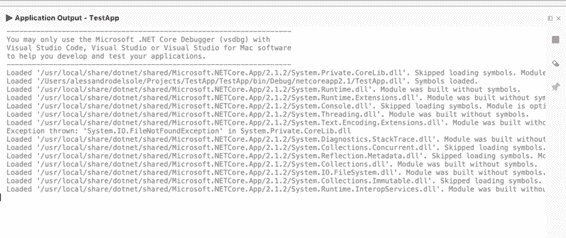

图 25:应用输出板

**应用程序输出** pad 在调试时至关重要，因为它显示了调试器发送的所有信息流，如果应用程序引发运行时问题和异常，或者系统在托管应用程序时可能遇到错误，这一点尤其重要。与任何其他面板一样，应用程序输出面板可以自动隐藏并停靠在集成开发环境中的不同位置，以方便您。

## 使用断点和数据可视化工具

断点可能是您最常用的调试工具。它们基本上允许您控制应用程序的执行流程。断点会导致应用程序在断点所在的位置中断执行。这也称为*中断模式*。当遇到断点并且应用程序执行中断时，您可以采取必要的操作，例如在执行点调查变量值或逐行执行代码。添加断点的最简单方法是单击代码编辑器中最左边的列，该列对应于您希望应用程序执行中断的代码行。断点以红色突出显示代码行，如图 26 所示。

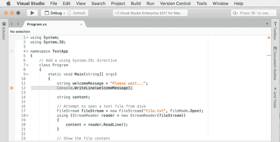

图 26:断点用红色突出显示一行代码

为了控制执行流程，可以在不同的代码文件中添加多个断点。现在开始调试应用程序，看看断点是如何工作的。当调试器遇到断点时，它中断执行，并在执行代码行之前用黄色突出显示正在调试的代码行，如图 27 所示。

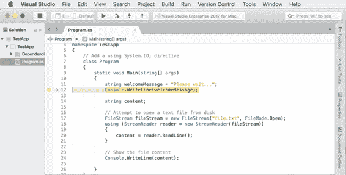

图 27:一个断点被命中

一旦断点被命中，代码行以黄色突出显示，您就可以执行许多操作，例如分步调试(稍后讨论)或使用所谓的*数据可视化工具*调查对象和变量的内容。数据可视化工具是当您将鼠标悬停在局部变量、字段或属性上时出现的小弹出窗口，并在特定时间点显示其内容。例如，如果您将鼠标悬停在`welcomeMessage`变量上，您将看到一个显示其值的数据提示(参见图 28)。

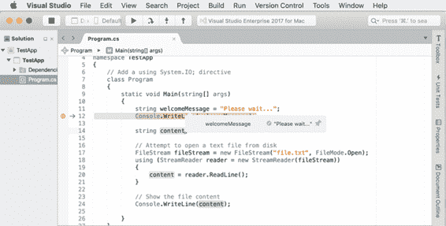

图 28:用数据可视化工具研究变量

在这种情况下，`welcomeMessage`的值已经在代码中提供，但是当变量包含计算或表达式求值的结果时，数据可视化工具非常有用，它们允许您查看实际值是否是预期结果。如果没有，您可以执行额外的调查，看看问题出在哪里。也可以通过单击代码编辑器右侧的图标，将数据可视化工具固定到代码编辑器。

数据可视化工具也可以在本地 pad 中找到，稍后会讨论。调试时，您将多次使用数据可视化工具，因为它们可以快速帮助您了解对象是否按预期填充。目前只需按工具栏中的**启动**即可恢复应用执行。在下一节中，您将了解关于分步执行代码的更多信息。

### 配置断点

可以配置断点，以便您可以决定它们应该何时以及如何限制应用程序的执行。如果右击断点的红色字形，然后选择**编辑断点**，将进入**编辑断点**对话框。您可以在这里指定条件和操作。条件决定调试器在遇到断点时应何时中断应用程序执行，而操作允许在遇到断点时执行特殊任务。他们可以一起工作，让你最大限度地控制执行流程。图 29 显示了**编辑断点**对话框是如何出现的。

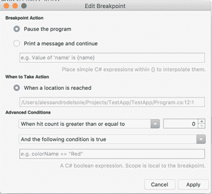

图 29:编辑断点的配置

在**断点动作**组中，默认选择是**暂停程序**，这只是导致调试器在遇到断点时中断应用程序的执行。这是您在放置断点后运行示例代码时看到的行为。作为替代方案，**打印消息并继续**选项不会中断应用程序的执行；相反，它将在应用程序输出面板中显示一条消息。有趣的是，在消息中，您可以在花括号内插入任何 C#表达式，这对于评估变量或对象属性的值很有用。在**何时采取行动**组中，只有一个选项，叫做**到达某个位置时**。此设置的值是当前放置断点的文件名和代码行，由于这是只读设置，您不能更改它。

关于条件:默认情况下，每次遇到断点时，应用程序都会进入中断模式。但是，有时您可能想要设置断点，但是只有在某个条件为真时才中断应用程序的执行。

例如，如果您用`foreach`循环迭代一个集合，您可能希望仅在一定次数的迭代后中断应用程序的执行。为此，您可以从**高级条件**组合框中选择一个可用条件(见图 29)。当命中数为时，你可以看到每个条件的名称是如何以**开头的。对于“命中”，我们指的是每次遇到断点，因此应用程序执行应该停止。换句话说，条件允许你控制命中的行为。**

例如，**当命中次数大于或等于**时，只有当断点被命中的次数大于或等于您用右边的选择器指定的次数时，应用程序执行才会中断。其他条件名称是不言而喻的，每个条件的行为都是相似的，只是条件将小于或大于。

您也可以使用**指定附加条件，如果以下条件为真**和**，则以下表达式将更改**选项。第一个选项允许您指定一个 C#表达式，为了中断应用程序的执行，该表达式必须被评估为 true，而第二个选项允许您决定当所提供的 C#表达式的值改变时，应用程序应该进入中断模式。总之，当您希望断点仅在特定情况下被命中时，条件和操作非常有用，并且它们允许更好的执行流程。

### 功能和异常断点

之前，您看到了如何以简单的方式添加断点，然后看到了如何使用条件和操作编辑断点。Visual Studio for Mac 还允许您在添加新断点时直接指定条件和操作，以及其他选项，方法是右键单击代码编辑器中最左边的列，然后选择**新建断点**。这将打开**创建断点**对话框，如图 30 所示。

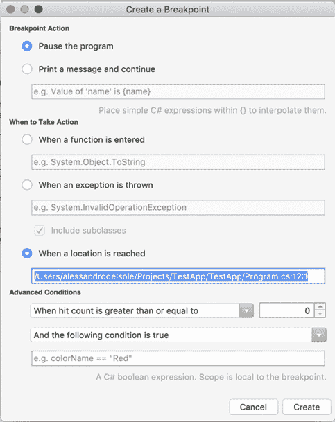

图 30:函数和异常断点

大多数选项与我们讨论的“编辑断点”对话框相同。另外，您会在**何时采取行动**组中发现以下两个行动:**当一个功能进入**时和**当抛出异常时**(默认行动是遇到断点时命中断点)。第一个动作也被称为函数断点，而第二个选项也被称为异常捕捉点。

函数断点将导致调试器在调用指定的方法调用时中断应用程序的执行，而不管它在代码中的位置如何。当在运行时引发指定的异常时，异常捕捉点将导致调试器中断应用程序的执行，而不管它发生在哪里。非常有趣的是，这两个选项都与任何一行代码无关；它们将充当断点，但在代码编辑器中它们真的不需要断点。Visual Studio 跟踪函数断点和异常捕捉点，并允许您在断点面板中控制它们，您很快就会发现这一点。当你准备好了，点击**创建**，断点将被放置在当前代码行上。

## 分析运行时错误

运行时错误发生在应用程序执行期间，它们通常是由于在编译时不可见的编程错误，并且可能涉及不可预测的情况。例如，如果应用程序赋予用户读取文件的能力，但是在磁盘上找不到该文件，则会出现运行时错误。再举一个例子，如果应用程序试图连接到由于网络连接问题而无法访问的数据库，将会出现运行时错误。

显然，在现实应用中，作为开发人员，您有责任预测这种可能性并实现适当的`try..catch` 块。但是，由于各种原因，可能会出现未处理的运行时错误，Visual Studio for Mac 中的调试器提供了适当的工具来帮助您了解问题的原因。

如果在没有断点的情况下运行开头提供的示例代码，几秒钟后，运行时错误将导致调试器中断应用程序的执行，因为代码正在搜索一个不存在的文件。此时，Visual Studio 突出显示导致错误的代码行，并将显示包含异常名称和错误描述的工具提示，如图 31 所示。

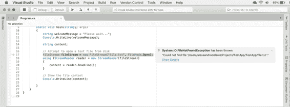

图 31:关于运行时异常的细节

在这种情况下，代码失败是因为它正在搜索一个不存在的文件，因此抛出了一个`FileNotFoundException`错误，并且没有被任何`try..catch`块处理；因此，应用程序的执行被中断。Visual Studio 显示引发的异常的名称和未找到的文件名(这包含在异常消息中)。实际上，Visual Studio 允许您进一步调查异常，并检索调试器能够收集的所有细节。为此，点击**显示详细信息**，打开**异常捕获**对话框(见图 32)。

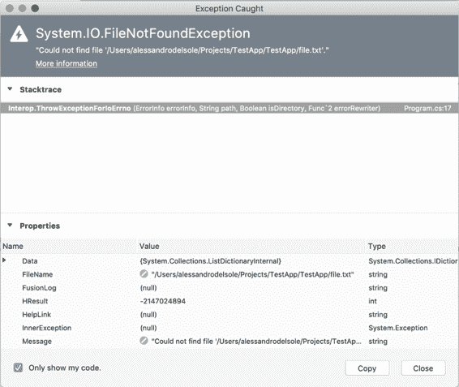

图 32:查看异常的详细信息

“异常捕获”对话框显示关于异常的所有信息，并且由于异常是从`System.Exception`继承的. NET 类型，您将看到异常属性的列表，这取决于特定的异常类型(在`FileNotFoundException`的情况下，您将看到`FileName`属性显示未找到的文件)。

在对话框的顶部，`StackTrace`项显示了对有效产生错误的类和方法的调用的层次结构。默认情况下，`StackTrace`仅显示您的代码信息，因此如果您想查看整个呼叫层次结构，您需要禁用底部的**仅显示我的代码**选项。

`InnerException`属性也很有用。在我们的特定案例示例中，它被设置为`null`，但是这个项目显示一个异常树，使您能够更好地理解实际导致错误的原因，这并不罕见。“捕获异常”对话框还允许您使用数据可视化工具进一步调查属性值，因此您可以将鼠标悬停在属性名称或其值上，并启用适当的可视化工具。

## 分步执行代码

当应用程序执行中断时，例如当调试器遇到断点时，您有不同的选项来继续执行。例如，您可以完全恢复执行，或者您可以一次只执行一行代码，或者一次执行一小部分代码。要实现这一点，您可以使用许多在**运行**菜单和调试工具栏中可用的命令(以及通过相关的键盘快捷键)。表 4 描述了这些命令。

表 4

| 分步执行代码的命令 |
| --- |
| **命令** | **描述** |
| 继续调试 | 从中断点恢复应用程序的执行。 |
| 进入 | 一次执行一条指令。它类似于单步执行，但如果要执行的指令是一个方法，则该方法每次执行一条指令，完成后，执行返回给调用方。 |
| 跨过 | 每次执行一条指令。与单步执行的区别在于，如果要执行的指令是一个方法，调试器不会进入该方法并在返回调用方之前完成其执行。当您需要调试调用您已经测试过的几个方法的一部分代码，并且不需要每次都深入研究时，这可能会很有用。 |
| 走出去 | 执行当前方法旁边的所有方法行，直到该方法完成。“跳出”在方法之外不起作用。 |
| 运行至光标 | 允许运行所有代码，直到选定的行。您可以通过右键单击一行代码，然后选择“运行到光标”来调用它。 |
| 设置下一条语句 | 在代码块中，允许设置在断点或停止后恢复应用程序执行时要执行的下一条语句。 |
| 显示下一条语句 | 将光标移动到下一条可执行语句。如果您有很长的代码文件，并且断点不能立即看到，这将非常有用。 |
| 显示当前执行行 | 将光标移动到当前语句。当光标位于完全不同的位置时，对于长代码文件很有用。 |

**运行至光标**、**设置下一条语句**、**显示下一条语句**和**显示当前执行行**命令在调试工具栏中不可用，您可以在运行菜单中或通过右键单击代码编辑器找到它们。

## 调试板

为了更容易地分析应用程序的行为，Visual Studio for Mac 提供了特殊的焊盘，您可以在调试时使用。当您开始调试应用程序时，Visual Studio 会自动显示这些面板。如果您决定在调试时关闭一个或多个焊盘，您始终可以使用**查看** > **调试焊盘**单独重新启用，也可以使用**查看** > **调试**全部启用。

### 断点面板

“断点”面板提供了解决方案中所有断点的可视化表示，以及许多快捷方式，使添加、编辑和删除断点变得更加容易。图 33 显示了一个例子，其中您可以看到一个断点和一个异常捕捉点。

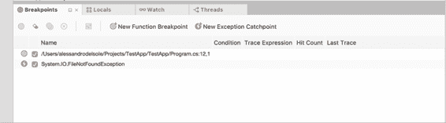

图 33:断点面板

“断点”面板显示断点、函数断点和异常捕捉点的列表，每个断点都可以通过特定的图标识别。对于断点，它显示代码文件、行号和命中计数(如果指定了条件的话)。调试时，每次遇到断点时，命中数都会增加。您可以双击断点，代码编辑器会将光标移动到断点所在的行。您也可以使用左侧的复选框禁用一个或多个断点。pad 的工具栏有一个按钮，允许您禁用、删除、编辑和添加断点。

### 当地人垫

“局部变量”面板显示调试时活动的局部变量及其值。图 34 显示了一个例子，当进入`Main`方法时，您可以看到前面提供的示例代码的活动变量。例如，您可以看到`welcomeMessage`变量的值是怎样的**请等待……**。这非常有用，尤其是对于其值是计算或赋值结果的局部变量。

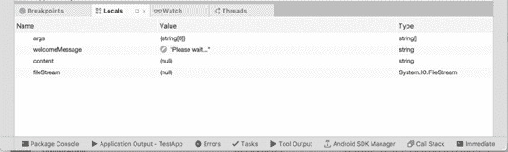

图 34:本地人 pad

对于每个变量，局部变量栏不仅显示名称和值，还显示类型。当变量尚未初始化时，它会显示默认值(如引用类型为 null 或整数为零)。您可以将鼠标悬停在变量上，并使用数据可视化工具查看其内容，甚至可以通过双击每个变量来更改其值。在“局部变量”面板中，数据可视化工具还根据变量类型显示适当的预览。例如，如果一个变量代表一种颜色，数据可视化工具将显示一个描述颜色的框，并显示 RGB 属性，而不仅仅是 C#值。特定预览可用于表示位置坐标、图像、大小、点、贝塞尔曲线、实现`IEnumerable`界面的集合，当然还有字符串的类型。

### 手表垫

监视板允许监视对象变量、方法或表达式，以便您可以监视变量正在做什么。在中断模式下，您可以输入监视板并键入变量的名称。Visual Studio 将在该特定时间显示变量值(参见图 35)。

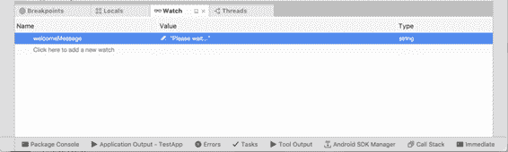

图 35:手表垫

您需要进入代码，等待表达式被求值并赋给您在监视板中输入的变量。每次评估结果发生变化时，pad 都会更新。

### 调用堆栈板

调用堆栈板允许您查看方法调用的层次结构。默认情况下，Call Stack 只显示代码中的调用，但您可以右键单击并选择**显示外部代码**来查看对本机函数等外部代码的调用。图 36 显示了一个基于应用程序代码的示例，没有外部代码。

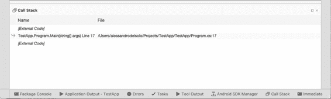

图 36:调用堆栈板

您可以右键单击视图并选择多个选项，如**显示外部代码**，以可视化对本机函数的调用，或者您可以选择**列** > **语言**以查看编写方法时使用的编程语言。调用堆栈对于异常特别有用，因为它帮助您遍历方法调用的层次结构，以便您可以了解异常的实际来源。

### 螺纹垫

如您所知，许多应用程序可以运行多个线程，对于来说也是如此。NET 核心和 Xamarin 应用程序。为了查看正在运行的线程，您可以打开线程板。它显示了一个正在运行的线程列表，其中包含概要信息，如线程标识、名称(如果可用)以及对与该线程相关的代码的引用(参见图 37)。

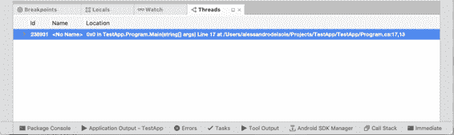

图 37:螺纹垫

当您需要了解特定代码块指的是什么线程时，这个 pad 对于多线程应用程序非常有用。

## 章节总结

在这一章中，您已经了解了一些重要的功能，如断点和命令，断点允许您控制代码的执行流程，命令允许您逐步执行代码。在数据可视化工具的帮助下，您总是可以在调试时调查变量的内容。VS for Mac 还提供了许多专用于调试的 pad，在本章中，您看到了哪些 pad 可用，以及您可以使用它们来分析您的代码和应用程序的行为。现在，您已经掌握了使用 Visual Studio 的 IDE 的所有必要知识，现在，您终于可以开始接触一些代码了。