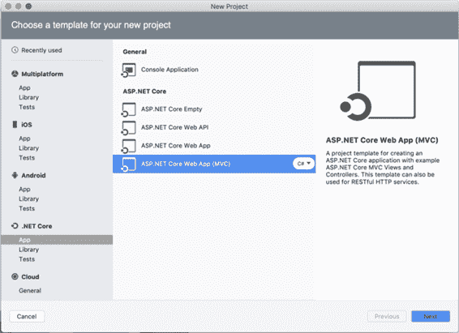
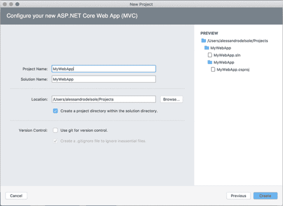
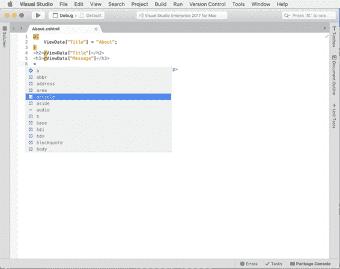
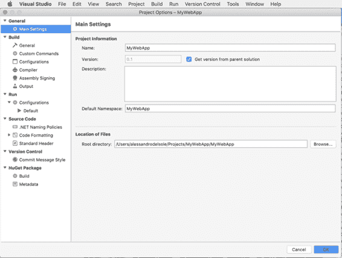
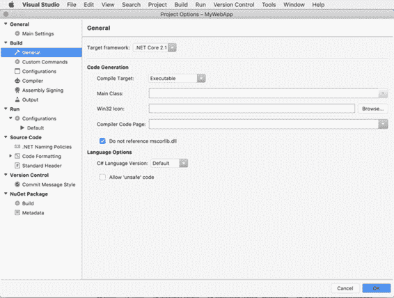
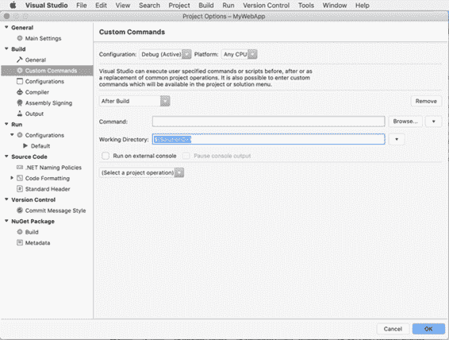
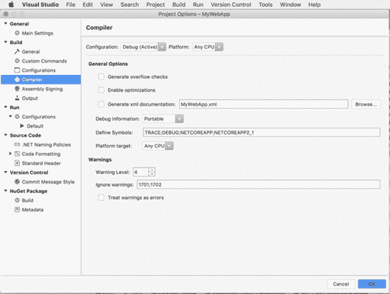
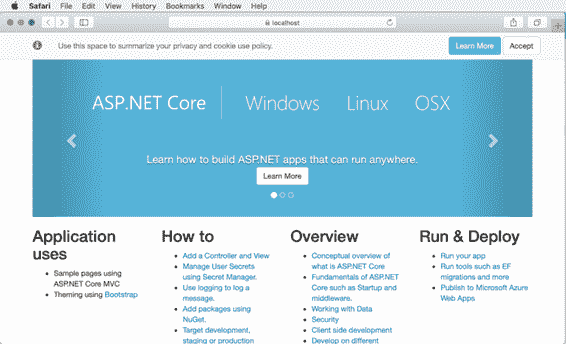
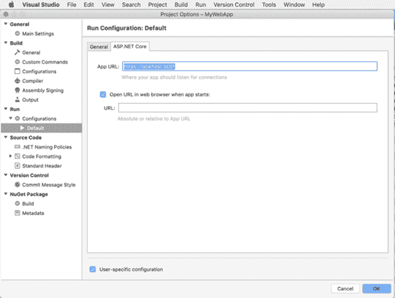
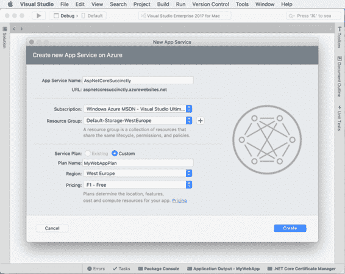

# 四、创建 .NET 核心应用

那个。NET Core 可以被认为是。NET 框架，运行在 Windows、macOS 和 Linux 上。更具体地说。NET Core 是一个跨平台、开源、模块化和通用的开发平台，包含在。微软支持和维护的. NET 基金会(dotnetfoundation.org)。NET [开发者社区](http://github.com/dotnet/core)。

那个。NET Core 也运行在设备上，可能包括移动设备和 IoT 设备，所以不局限于经典的桌面和服务器环境。这是一个模块化框架，因为它以 NuGet 包的形式发布，其思想是一个建立在。NET Core 将只包含它实际需要的库(模块)，而不是像的情况那样依赖一个完整的框架。NET 框架。这一章解释了什么。NET Core 由组成，并展示了如何创建。NET 核心应用程序。

|  | 注意:在简洁系列的纯精神中，本章不能详细解释 MVC 编程模式和网络应用的 ASP.NET 核心 API。相反，这一章侧重于生成和维护应用程序的集成开发环境工具，简化了生命周期。 |

## 。NET 核心架构

。NET Core 是由几个基本部分组成的，它们共同为这项惊人的技术带来了所有的功能、灵活性和兼容性。下面的小节提供了组成部分的概要。NET 核心。

### The。NET 核心运行时

那个。NET Core 运行时，被称为 CoreCLR，是一个可移植的、跨平台的组件，它为应用程序提供了一个执行环境。CoreCLR 包含一个带有基类的类型系统。NET 数据类型、实时编译器(JIT)、垃圾收集器和名为 mscorlib 的基类库。

CLR 代表公共语言运行时，它基本上意味着所有。NET 应用程序运行在同一个运行时平台上，不管它们是用什么编程语言编写的。与完全不同。NET 框架，应用程序需要的地方。NET 安装在目标系统上，以利用公共语言运行库。CoreCLR 与应用程序和所需的库一起打包。这避免了对预安装运行时的需要。CoreCLR 是一个开源项目[，可在 GitHub](https://github.com/dotnet/coreclr) 上获得。

### 。NET 核心库

而。NET Core 运行时包括基类库，其他类型对于严肃的开发是必要的。。NET Core 提供了大量作为 NuGet 包提供的库，并公开了文件访问、集合、XML 等类型。提供的完整列表。NET 核心库不是必需的，因为 Visual Studio for Mac 在创建 MVC 和 Web API 项目时会自动包含适当的库。

### 。核心软件开发工具包:工具和语言

那个。NET Core SDK 是构建应用程序所需的一组工具。NET 核心。这包括。NET 命令行界面和带有编译器的编程语言。命令行界面将在下一节中详细介绍，但首先是关于编程语言的几个词。

目前，。NET Core 允许您使用 C#和 F#编写应用程序。言外之意是，你不仅可以像过去那样在 Windows 上编写 C#和 F#代码，现在也可以在 macOS 和 Linux 上编写。这是可能的，因为微软一直在努力使这些流行的编程语言跨平台。

|  | 注:在。NET Core，你基本上所有的事情都是通过命令行界面完成的，所以非常重要。但是，像 Visual Studio for Mac 这样的程序会代表您在幕后调用适当的命令，因此您不需要直接与之交互。在这本书里。NET Core CLI 不再进一步讨论，但是您可以查看[文档](https://docs.microsoft.com/en-us/dotnet/core/tools)了解所有命令的详细信息。 |

## 支持。NET 核心项目类型

用于苹果电脑的 Visual Studio 支持。NET 核心项目类型汇总在表 5 中，所有类型都可以通过“新建项目”对话框获得。

表 5

| 可用。NET 核心项目类型 |
| --- |
| **项目类型** | **描述** |
| 控制台应用程序 | 为独立的空控制台应用程序生成包含 C#项目的解决方案。 |
| ASP.NET 核心空了 | 生成包含空的 ASP.NET 核心网站项目的解决方案。 |
| ASP.NET 核心网络应用编程接口 | 生成包含 ASP.NET 核心项目的解决方案，该项目基于网络应用编程接口框架构建 RESTful 服务。 |
| ASP.NET 核心网络应用 | 生成包含 ASP.NET 核心项目的解决方案，该项目基于 Razor 页面构建 web 应用程序。 |
| ASP.NET 核心网络应用 | 生成一个解决方案，该解决方案包含一个 ASP.NET 核心项目，该项目使用视图和控制器构建基于 MVC 框架的 web 应用程序。 |

|  | 注意:在“新建项目”对话框中，您还将看到“库”和“测试”项目类别。这些允许创建可重用的库和自动化测试，但是本章不会涉及它们。您可以在“新建项目”对话框中阅读项目模板的描述。 |

您之前已经看到了一个控制台应用程序的例子，所以在本章中，您将创建一个 Web MVC 应用程序，它包含了一个具有页面的全功能网站的基本基础结构。

## 用 Visual Studio 做 Mac 的网络应用

第一次和。NET Core，您可以使用 C#创建跨平台的 web 应用程序。这是一个巨大的好处，因为你不再局限于发布你的。NET 网络应用程序到 Windows 主机(包括 Azure)，您可以重用现有的 C#技能轻松地将网络应用程序部署到 Mac 和 Linux 服务器。

在本章中，您将学习如何创建 ASP.NET 核心网络应用程序，以及如何直接从 Visual Studio for Mac 将其发布到作为主机的 Microsoft Azure。您将看到集成开发环境如何简化从开发到部署的整个应用程序生命周期。更具体地说，您将看到内置的项目模板如何使创建具有页面和控制器的应用程序变得容易，以及如何将应用程序快速部署到 Microsoft Azure。

### 介绍 ASP.NET 芯

ASP.NET 核心是一个开源的跨平台框架，用于构建现代的、基于云的互联应用，如网络应用、物联网应用和移动后端。ASP.NET 核心为部署到云或内部运行的应用程序提供了优化的开发框架，这些应用程序由模块化组件组成。ASP.NET 核心的源代码可以在 [GitHub](http://github.com/aspnet/Home) 上获得，微软正在接受开发者社区的贡献。

比如。NET Core，ASP.NET Core 完全作为 NuGet 包发货，以提高模块化，应用程序和服务都可以托管在互联网信息服务上，也可以在您自己的流程中自行托管。正如您将在本章后面看到的，ASP.NET 核心从 ASP.NET 继承了所谓的模型绑定，这是一个运行时特性，可以将通过 HTTP 请求传递的参数映射到的属性。NET 对象。

简而言之，如果您想要构建跨平台运行、完全可测试并且无论主机是基于云还是内部部署都可以轻松部署的网络应用和服务，ASP.NET 核心将是您的首选框架。在分层架构中，ASP.NET 核心是一层又一层。NET Core 体系结构，所以它依赖于 CoreCLR、核心库和 NuGet 包、建立在罗斯林之上的 C#编译器，以及。NET 标准。

### 引入 MVC

MVC 代表模型-视图-控制器，它是建立在以下元素之上的编程模式的名称:

*   模型:表示应用程序需要处理的数据的业务对象。
*   控制器:基于业务逻辑规则公开和管理模型的中间对象。
*   视图:应用程序的用户界面，基于用户输入调用控制器中的操作并显示结果。

在 ASP.NET 和 ASP.NET 核心中，模型由代表数据的 C#类组成。例如，映射数据库中的表的 C#类是模型的一部分。控制器是实现业务逻辑的 C#类，如查询或 C.R.U.D(创建、读取、更新、删除)操作。视图是一个完整的用户界面，由在控制器中调用操作的 HTML 页面组成，就像用户单击按钮加载或插入数据一样。例如，如果您构建一个订单管理应用程序，`Order`类可能是表示数据库中订单表的模型，`OrderController`可能公开允许查询、添加和更新订单的方法，然后您可能有一个显示活动订单列表的 HTML 页面，以及允许基于用户输入添加或更新订单的控件。

请注意，模型和控制器并不限于对数据库进行操作:事实上，您可以用业务对象映射任何需要的东西，甚至可以在没有模型的情况下从控制器执行操作，例如，当您调用 web 服务时。此外，ASP.NET 核心 MVC 框架支持身份管理，并自动提供配置应用程序启动的管道代码。

### 搭建一个 MVC 应用程序

在 Visual Studio for Mac 中，点击欢迎页面中的**新建项目**(或选择**文件** > **新建解决方案**)。在**新建项目**对话框中，选择**ASP.NET 核心网 App (MVC)** 项目模板，然后点击**下一步**(见图 38)。

图 38:选择 MVC 项目模板

在下一个对话框中，选择的版本。你想瞄准的核心。可用版本的数量因您的配置而异，但您可以选择最高版本以保持一致性。单击**下一步**，在第三个也是最后一个对话框中，输入示例项目的名称，如图 39 所示。如您所见，在对话框的右上角可以看到解决方案结构的预览，以及创建解决方案文件和将解决方案与 Git 版本控制相关联的选项。

图 39:指定项目名称

点击**创建**，几秒钟后，解决方案就准备好了。MVC 解决方案有一个特殊的结构，其元素在表 6 中描述。

表 6

| MVC 解决方案中的常见元素 |
| --- |
| **名称** | **范围** | **描述** |
| 属国 | 文件夹 | 包含应用程序所需的 NuGet 包和 SDK 库。 |
| 控制器 | 文件夹 | 包含实现应用程序业务逻辑的 C#控制器类。 |
| 视图 | 文件夹 | 包含。cshtml 文件和子文件夹。定义应用程序用户界面的 cshtml 文件。 |
| 你错了 | 文件夹 | 包含所有静态文件，如资产、字体、级联样式表(CSS)文件、JavaScript 文件和 HTML 文件。它还包含所有必要的 JQuery 文件。 |
| favicon.ico | 文件 | 将出现在 web 浏览器中的应用程序图标。 |
| bower.json | 文件 | 包含代表附加依赖项的客户端 Bower 包列表。 |
| appsettings.json | 文件 | 允许用 JSON 符号定义应用程序设置。 |
| appsettings.development.json | 文件 | 允许用开发时可以使用的 JSON 符号定义应用程序设置。 |
| Program.cs | 文件 | 定义`Main` C#方法，该方法是主要的应用程序入口点，允许配置应用程序主机。 |
| Startup.cs | 文件 | 定义 MVC 路由策略，并允许您配置框架服务和主机设置。 |

在**视图** > **首页**子文件夹下，可以找到几个。表示用户界面视图或页面的 cshtml 文件。Visual Studio for Mac 中的代码编辑器完全支持这类标记文件，并支持智能感知，如图 40 所示。

图 40:的智能感知。cshtml 文件

### 配置项目选项

Visual Studio for Mac 为您提供了对项目选项和属性的深度控制。您可以使用**项目**、 ***项目名称*选项**(其中*项目名称*代表您的项目名称)或右键单击解决方案面板中的项目名称并选择**选项**来访问项目选项。此时出现**项目选项**窗口(见图 41)。

图 41:配置项目选项

在**常规**节点，你可以找到**主设置**，对于所有支持的项目类型来说都是一样的。在这里，您可以指定不同的项目名称、特定的版本号、可选的描述和根 C#命名空间，并且可以更改存储项目文件的根目录。默认情况下，项目版本继承自解决方案版本，但您可以取消选中**从父解决方案获取版本**复选框并提供新版本。

其他设置是根据您创建项目时提供的信息生成的，除非您有特定的要求，否则我建议您保持不变。这些设置也可用于 Xamarin 项目。在“项目选项”对话框的**构建**节点中(见图 42)，**常规**选项卡允许您更改最新的目标框架。NET Core 运行时版本。

图 42:配置构建选项

在**代码生成**组中，可以更改编译目标(可执行文件、库、带 GUI 的可执行文件或模块)**主类**框中的启动 C#类、 **Win32 图标**框中的图标文件、**编译器代码页**框中的源文件编码代码页。我建议您不要更改默认选项，包括**不要引用 mscorlib.dll**复选框的值，因为默认选项已经针对您的项目进行了优化，更改这些选项通常只对完全有意义。NET 项目，而不是。NET 核心项目。

此外，您可以在“C#语言版本”框中指定编译器应该使用的 C#版本。默认设置确保编译器使用可用语言的最新版本。在. NET Core 项目中，**允许“不安全”代码**复选框应该保持未选中状态，因为您通常不会调用本机代码。

**自定义命令**选项卡允许您指定在构建或清理过程之前、期间或之后应该执行的任何操作。操作是针对每个配置的，因此您可以为不同的配置指定不同的操作，默认情况下，“配置”下拉框显示活动的生成配置，但是您可以选择不同的配置并提供任何操作。您可以使用**选择项目操作**下拉框指定一个或多个操作。支持的操作有**构建前**、**构建**、**构建后**、**清洁前**、**清洁**、**清洁后**、**自定义命令**。图 43 显示了一个基于构建后操作的例子。

图 43:配置自定义命令

您可以通过在**命令**文本框中提供应用程序名称来指定必须执行的操作(或者您可以单击**浏览**而不是手动键入名称)。命令可能需要接收参数，例如解决方案或项目名称。因为 VS for Mac 使用特殊常数来标识这些参数，所以您可以通过单击带有箭头图标的按钮并从下拉列表中选择一个不言自明的值来选择适当的常数。这同样适用于**工作目录**复选框，您可以在其中指定应该执行命令的目录。

在图 43 中，您可以看到`$(SolutionDir)`常量代表解决方案目录，并在**常量**下拉框中被列为解决方案目录。**配置**选项卡允许您管理构建配置。默认情况下，它显示调试和发布配置。您可以分别使用**添加**、**复制**、**删除**和**重命名**按钮来添加、复制、删除和重命名配置。**编译器**选项卡允许您影响编译过程，图 44 显示了它是如何出现的。

图 44:配置编译器选项

编译器选项是按配置的，默认是活动的构建配置，但是您可以在**配置**下拉框中选择不同的配置。这样，当您使用指定的配置构建解决方案时，将应用您在此选项卡中所做的更改。

在**常规选项**中，**生成溢出检查**复选框强制编译器检查整数计算溢出，如果发现溢出，则在编译时抛出`OverflowException`。启用此选项有助于加快整数计算速度，避免存储结果时出现任何错误。**启用优化**复选框强制编译器优化构建输出，因此生成的应用程序、库或包可能会更小、更快、更高效。但是，由于优化过程需要以多种方式重新排列代码，调试体验可能会更困难，也更不完整。因此，此复选框仅在版本配置中自动启用。**生成 xml 文档**复选框使 Visual Studio for Mac 为您的对象生成一个 XML 文档文件。您可以在文本框中指定输出文件名。只有当您用 XML 注释对源代码进行注释时，选择此选项才有意义。

**程序集签名**选项卡允许您使用数字签名(也称为强名称)对程序集进行签名。支持的文件有。snk(“强密钥”)和。pfx(“个人交换格式”)文件。那个。pfx 格式也允许指定密码，因此应该是首选。要指定数字签名，请启用**对此组件进行签名**复选框，然后单击**浏览**选择您的。snk 或。来自磁盘的 pfx 文件。在**输出**选项卡中，如果您想要更改默认设置，您可以为构建输出指定程序集名称和目录。

### 运行调试

如果按下标准工具栏上的**开始**按钮，应用程序将开始调试，如图 45 所示。

图 45:运行的 MVC 应用程序

应用程序运行后，您将能够使用第 3 章中讨论的所有调试工具。调试。NET 核心应用程序依赖于。NET 调试器，Visual Studio for Mac 附加到正在运行的。NET 应用程序。然而，就 ASP.NET 核心而言，这还不够。事实上，web 应用程序需要托管在 web 服务器上才能启动。

如果您使用开发了 ASP.NET 应用程序。过去，您可以选择互联网信息服务(IIS)和互联网信息服务快递来托管应用程序。这些仅在 Windows 上可用，因此。NET Core 附带了一个特殊的开源开发网络服务器，名为[红隼](https://github.com/aspnet/KestrelHttpServer)。红隼的行为与 IIS Express 非常相似，重要的区别在于它跨平台运行，这意味着 macOS、Linux 和 Windows。

使用红隼，您可以像在真正的网络服务器上一样运行、调试和测试应用程序。正如您对开发服务器的期望，应用程序的 URL 总是以 http://localhost 开头，后跟端口号。您只需单击地址栏即可查看当前端口号。如果您希望提供不同的端口号，您可以在**解决方案**面板中右键单击项目名称，然后选择**选项**，并在**运行** > **配置**下的**默认运行配置**中查看当前值。ASP.NET 核心选项卡中的应用程序网址字段(见图 46)包含当前网址，在这里您可以提供不同的端口号。

图 46:更改红隼的默认端口

### 发布 ASP.NET 核心应用

|  | 注意:您需要一个活动的 Azure 订阅来完成本节中描述的步骤。您可以在此申请免费试用[。](https://azure.microsoft.com/en-us/free/) |

ASP.NET 核心网的应用程序可以发布到任何主机支持。NET Core，如互联网信息服务，但 Visual Studio for Mac 集成了对自动部署到微软 Azure 的支持。为此，您可以选择**构建** > **发布** > **发布到 Azure** 。在**发布到 Azure 应用服务**对话框中，您将看到现有 Azure 应用服务的列表(如果有)，以及创建新应用服务的链接。点击**新建应用服务**。

图 47:创建新的应用服务

此时，您将需要指定应用程序服务名称，该名称也将成为应用程序的网址的一部分。您将能够选择哪个 Azure 订阅(计费机制)将托管应用程序(如果您有多个订阅)和一个资源组，该资源组可以被视为相关实体的组织机制，例如应用程序和应用程序的数据存储。顾名思义，Azure 中的资源组包含多个 web 资源，包括应用程序。

如果您想使用现有资源组中的一个，请从列表中选择一个或单击 **+** 按钮创建新的资源组。我建议您在**地区**组合框中选择离您居住最近的地区，并在**定价**组合框中选择**F1–免费计划**。付费计划提供了更多的计算资源，但出于演示目的，免费计划就足够了。当您单击**创建**时，Visual Studio 将开始将网络应用程序发布到指定的 Azure 应用程序服务。几分钟后，您的应用程序就可以在新应用程序服务对话框中定义的网址上运行了(见图 47)。

### 用实例进行测试

正如我在本章开头提到的，不可能在 Visual Studio for Mac 中讨论所有的 ASP.NET 核心特性和所有可以用这个平台解决的开发场景。由于这个原因，看看如何使用端到端的例子是一个好主意。更具体地说，你可以下载 ASP.NET 核心官方教程的[伴随代码](https://github.com/aspnet/Docs/tree/master/aspnetcore/data/ef-mvc/intro/samples/cu-final)。该存储库包含许多跨开发场景的示例，包括通过实体框架使用数据库。我建议您看一看这些例子，以更好地理解您可以用 ASP.NET 核心做什么。

## 章节总结

ASP.NET 核心是跨平台、开源、模块化的运行时，用于创建在 macOS、Linux 和 Windows 上以 C#运行的网络应用程序。Visual Studio for Mac 允许您使用方便的集成工具创建 ASP.NET 核心网络应用程序，避免使用命令行界面。在 MVC 模式的情况下，集成开发环境生成实现模型类、控制器和视图的项目。在本章中，您还发现了一个名为“红隼”的新开发网络服务器，它允许您在本地测试和调试 ASP.NET 核心，以及 Visual Studio 中为 Mac 提供的常用、强大的调试工具。最后，您已经看到了如何在几分钟内用很少的点击量将应用程序发布到微软 Azure，以及如何在几分钟内上市。