# 第 5 章创建 Xamarin 项目

Xamarin 是一种技术，允许开发人员使用 C#为安卓、iOS、macOS、Windows 10 和 Tizen 构建本机应用程序。在这一章中，您将了解到使用 Visual Studio for Mac 开发 Xamarin 的概况，它提供了一个完整的解决方案，通过在微软堆栈上重用您现有的技能来构建高质量、跨平台的移动应用程序。

## 介绍 Xamarin 和 Xamarin。形式

使用 Xamarin，您可以使用 C#作为编程语言为多个平台构建本机应用程序。Xamarin 提供了将本机 API 包装到。NET 类型和成员，允许完全访问所有的 iOS、Android、macOS、Windows 10 和 Tizen 功能。

随着 Xamarin 的增长，增加了对其他平台的支持；例如，对 WPF 的支持是一项正在进行的工作。像 Xamarin.iOS，Xamarin 这样的平台。麦克和 Xamarin。安卓允许你编写 C#代码，分别为 iOS、macOS 和安卓创建原生应用。在你需要构建用户界面元素对所有平台都通用的应用程序的情况下，Xamarin。表单是一个有趣的选择，因为它允许您从一个共享的 C#代码库中定位多个平台。

|  | 注意:Xamarin 是一项巨大的技术，教你如何用 Xamarin 和 Xamarin 构建应用程序。这本书里不可能有表格。如果对跨平台手机应用开发感兴趣，可以免费下载 [Xamarin。简洁的 macOS 表单](https://www.syncfusion.com/ebooks/xamarin_forms_for_mac_os_succinctly)和 [Xamarin。简洁地形成本书同一作者的](https://www.syncfusion.com/ebooks/xamarin_forms_succinctly) (Windows 版)书籍。 |

## 可用的项目类型

Visual Studio for Mac 附带了大量用于 Xamarin 开发的项目模板，这些模板在“新建项目”对话框中可用。图 48 显示了其中的一些。

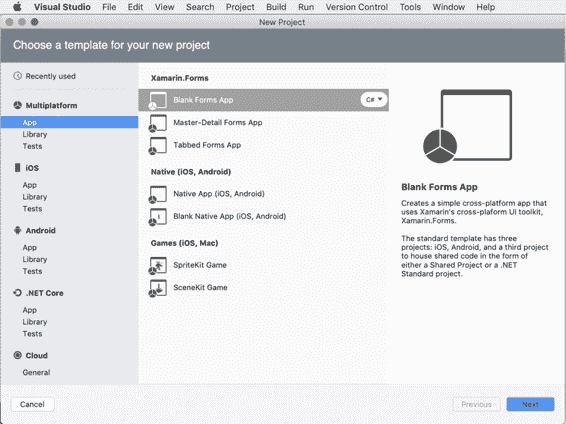

图 48:一些 Xamarin 项目模板

### 多平台项目模板

让我们从多平台类别开始，它提供旨在最大化代码重用的项目模板。在这个类别中，您可以找到允许按平台共享代码的模板，例如 Xamarin。窗体，或按项目种类，如共享项目和。NET 标准库。

多平台类别分为三个子类别:应用程序、库和测试。子类别的名称是不言自明的:应用程序包含允许创建应用程序的项目模板，库包含允许生成可重用库的项目模板，测试包含允许为用户界面测试自动化创建项目的项目模板。你也会在 iOS 和安卓模板类别中找到相同的子类别。表 7 列出了应用类别中的项目模板。

表 7

| 多平台类别中的项目模板 |
| --- |
| **目标平台** | **项目类型** | **描述** |
| Xamarin。形式 | 表单应用程序 | 生成包含跨平台 Xamarin 的解决方案。表单项目和一个基于。NET Core，并针对发布到微软 Azure 进行了优化。Xamarin。表单项目包含示例数据和示例视图来模拟待办事项列表应用程序，包括 CRUD 操作和身份验证。 |
| Xamarin。形式 | 空白表单应用程序 | 生成包含空白 Xamarin 的解决方案。表单项目。 |
| 原生(iOS、安卓) | 原生应用(iOS、安卓) | 生成包含 Xamarin.iOS 项目的解决方案。安卓项目，以及在两个 Xamarin 项目之间共享代码的项目。这可以是共享项目，也可以是. NET 标准库。Xamarin 项目包括基于的 ASP.NET 网络应用编程接口后端。NET Core 和示例数据和视图来模拟待办事项列表应用程序，包括 CRUD 操作和身份验证。后端项目针对分发到微软 Azure 进行了优化。 |
| 原生(iOS、安卓) | 空白原生应用(iOS、安卓) | 生成包含空白 Xamarin.iOS 和 Xamarin 的解决方案。安卓项目，加上一个在两者之间共享代码的项目，可以是共享项目，也可以是. NET 标准库。 |
| 游戏(iOS、Mac) | 喝酒游戏 | 生成一个包含 Xamarin.iOS 项目的解决方案，该项目允许基于苹果的 SpriteKit 框架创建 2D 游戏。 |
| 游戏(iOS、Mac) | 场景工具包游戏 | 生成一个包含 Xamarin.iOS 项目的解决方案，该项目允许基于苹果公司的 SceneKit 框架创建 3D 游戏。 |

“库”类别包含允许创建可重用库或共享项目的项目模板。表 8 列出了该类别中可用的项目模板。

表 8

| “库”类别中的项目模板 |
| --- |
| **目标平台** | **项目类型** | **描述** |
| 一般 | 共享项目 | 生成包含所谓共享项目的解决方案，该解决方案允许在项目之间共享松散的文件分类。 |
| 一般 | 多平台库 | 生成一个解决方案，该解决方案包含一个可移植类库和一个相应的可编译并分发到 NuGet 库的 NuGet 包。 |
| 一般 | 。NET 标准库 | 基于生成包含 C#库的解决方案。NET 标准规范。在撰写本文时，Visual Studio for Mac 支持的版本为 2.0。NET 标准。 |
| Xamarin。形式 | 类库 | 生成包含可由 Xamarin 使用的. NET 标准库的解决方案。表单项目。 |

|  | 注:该。NET 标准规范为所有。NET 开发平台，如。. NET 框架。NET Core 和 Mono 必须实现。这允许统一。NET 平台，有助于避免未来的碎片化。通过创建. NET 标准库，您将确保您的代码可以在任何。NET 平台，不需要选择任何目标。微软有一篇关于。NET 标准，它的目标和实现你可以在这里找到。 |

最后一类叫做测试，只包含一个模板，叫做用户界面测试应用。该项目模板生成了一个解决方案，该解决方案包含一个项目，该项目允许在本地和 Xamarin Test Cloud 上对用户界面进行自动化测试，Xamarin Test Cloud 是一个平台，它提供了一个基于云的环境，有几十个设备可以用来测试应用程序的行为。

### iOS 和 tvOS 项目模板

iOS 类别包含项目模板，允许您生成 Xamarin.iOS 项目，您可以使用这些项目用 C#构建本机 iOS 应用程序。表 9 提供了每个模板的概要描述。

表 9

| iOS 类别中的项目模板 |
| --- |
| **目标平台** | **项目类型** | **描述** |
| 一般 | 单视图应用程序 | 为带有故事板对象的单页应用程序生成一个解决方案，该解决方案包含一个 Xamarin.iOS 项目，该故事板对象包含一个视图、一个视图控制器和一个用于命令代码的 C#类。 |
| 一般 | 主-细节应用 | 基于“主-详细”视图生成包含 Xamarin.iOS 项目的解决方案，并显示示例项目列表。它针对不同的屏幕外形进行了优化，包括 iPhone 的导航控制器和 iPad 的分割视图。 |
| 一般 | 选项卡式应用 | 基于选项卡中包含的多个页面生成包含 Xamarin.iOS 项目的解决方案。它为每个选项卡栏项目包括一个选项卡栏控制器和一个视图控制器。 |
| 一般 | 基于页面的应用 | 生成包含 Xamarin.iOS 项目的解决方案，该解决方案展示了如何使用页面视图控制器在多个页面之间实现导航。 |
| 一般 | 网页视图应用程序 | 基于 Razor 模板引擎，生成一个包含 Xamarin.iOS 项目的解决方案，该项目允许在 WebView 对象中显示 HTML 内容。 |
| 比赛 | 喝酒游戏 | 生成一个包含 Xamarin.iOS 项目的解决方案，该项目允许基于苹果的 SpriteKit 框架创建 2D 游戏。 |
| 比赛 | 场景工具包游戏 | 生成一个包含 Xamarin.iOS 项目的解决方案，该项目允许基于苹果公司的 SceneKit 框架创建 3D 游戏。 |
| 比赛 | 金属游戏 | 生成一个包含 Xamarin.iOS 项目的解决方案，该项目允许基于 Metal 创建游戏，Metal 是苹果公司推出的 GPU 加速 3D 框架。 |
| 比赛 | OpenGL 游戏 | 生成包含 Xamarin.iOS 项目的解决方案，该项目允许基于 OpenGL 框架 API 创建 2D 和 3D 游戏。 |

库类别提供了两个项目模板:类库，它允许生成为 Xamarin.iOS 定制的 C#类库，以及绑定库，这是一个特殊的项目模板，它允许生成可以为 iOS 使用第三方 Objective-C 库的 C#类库。这本书不会涉及这个特定的主题，但是 Xamarin 文档有一个[特定的页面](https://developer.xamarin.com/guides/cross-platform/macios/binding/objective-c-libraries/)。

测试类别提供了两个项目模板，称为用户界面测试应用程序和单元测试应用程序。第一个项目模板类似于它在多平台类别中的相应模板，但是是为 Xamarin.iOS 定制的，并且允许在本地和 Xamarin 测试云上对用户界面进行自动化测试。第二个模板为 Xamarin.iOS 应用程序和库创建了一个测试项目，您可以在其中基于 Touch 编写单元测试。单元框架。关于电视操作系统:Visual Studio for Mac 提供了项目模板，可以生成针对这种设备优化的 Xamarin.iOS 项目。支持的项目模板有单视图应用、选项卡式应用、场景游戏、精灵游戏和金属游戏，描述与表 9 提供的相同。

### 安卓项目模板

安卓类别仍然分为三个子类别:应用程序、库和测试。一般来说，安卓类别包含允许生成 Xamarin 的项目模板。你可以用 C#来构建原生安卓应用的安卓项目。表 10 提供了每个模板的详细描述。

表 10

| 安卓类别中的项目模板 |
| --- |
| **目标平台** | **项目类型** | **描述** |
| 一般 | Android 应用程序 | 生成包含 Xamarin 的解决方案。安卓项目，单个样本屏幕(活动)，带有按钮和标签。 |
| 一般 | 穿戴应用 | 生成包含 Xamarin 的解决方案。针对安卓穿戴操作系统的安卓项目。此项目模板仅适用于 API 级别 20 或更高。 |
| 一般 | 空白安卓应用 | 生成包含 Xamarin 的解决方案。安卓项目，单个样本屏幕(活动)和空用户界面。 |
| 一般 | 网页视图应用程序 | 生成包含 Xamarin 的解决方案。基于 Razor 模板引擎，允许在 WebView 对象中显示 HTML 内容的安卓项目。 |
| 比赛 | OpenGL 游戏 | 生成包含 Xamarin 的解决方案。安卓项目，允许创建基于 OpenGL 框架的 2D 和 3D 游戏。 |
| 比赛 | OpenGL 是 2.0 游戏 | 生成包含 Xamarin 的解决方案。安卓项目，允许创建基于 OpenGL ES 2.0 应用编程接口的 2D 和 3D 游戏。ES 代表嵌入式系统。 |
| 比赛 | OpenGL 是 3.0 游戏 | 生成包含 Xamarin 的解决方案。安卓项目，允许创建基于 OpenGL ES 3.0 应用编程接口的 2D 和 3D 游戏。这是具有新功能的最新版本，并且向后兼容 2.0。 |

库类别提供了两个项目模板:类库，它允许生成为 Xamarin 定制的 C#类库。安卓和绑定库，一个允许生成 C#类库的项目模板，可以为安卓使用第三方 Java 库。这本书不会涉及这个特定的主题，但是 Xamarin 文档有一个[特定的页面](https://developer.xamarin.com/guides/android/advanced_topics/binding-a-java-library/)。

测试类别提供了两个项目模板，称为用户界面测试应用程序和单元测试应用程序。类似于 iOS 模板，第一个项目模板类似于多平台类别中相应的模板。然而，它是为 Xamarin 量身定制的。并且允许在本地和 Xamarin 测试云上对用户界面进行自动化测试。第二个模板为 Xamarin 创建了一个测试项目。安卓应用和库，你可以在其中编写单元测试。

### 【macOS 的项目模板

Mac 类别提供项目模板，允许使用 Xamarin 为 macOS 操作系统构建应用程序、游戏和库。带 C#的 Mac。该类别分为应用程序和库子类别，表 11 更详细地描述了应用程序类别的模板。

表 11

| Mac 类别中的项目模板 |
| **目标平台** | **项目类型** | **描述** |
| 一般 | 可可应用 | 生成包含 Xamarin 的解决方案。带有故事板的苹果项目，用于基于苹果可可框架的独立苹果应用程序。 |
| 比赛 | 喝酒游戏 | 生成包含 Xamarin 的解决方案。苹果公司的一个项目，允许基于苹果公司的 SpriteKit 框架创建 2D 游戏。 |
| 比赛 | 场景工具包游戏 | 生成包含 Xamarin 的解决方案。允许基于苹果的场景框架创建 3D 游戏的苹果项目。 |
| 比赛 | 金属游戏 | 生成包含 Xamarin 的解决方案。Mac 项目，允许创建基于 Metal 的游戏，Metal 是来自苹果的 GPU 加速 3D 框架。 |

“库”类别包含类库和绑定库项目模板。它们的目的与 Xamarin.iOS 中描述的同类完全相同，但对类库模板进行了重要的澄清:这一个依赖于所谓的统一 API，这意味着这个库中的代码可以在 Xamarin 之间共享。32 位和 64 位系统上的 Mac 和 Xamarin.iOS。

## 创建 Xamarin。表单项目

Xamarin。Forms 允许从一个共享的 C#代码库中创建针对多个平台的项目，例如 iOS 和 Android。Xamarin。表单本质上是一个库，它将本机控件包装成对象，您可以使用这些对象编写一次代码，然后运行时生成本机应用程序，将这些对象转换成适当的特定于平台的可视元素。您可以在 Visual Studio 中为 Mac 创建各种 Xamarin 项目，但是要使用 Xamarin。表单，你会更好地理解跨平台开发变得容易。

选择**文件** > **新建解决方案**，然后在**新建项目**对话框中，选择**空白表单 App** 项目模板(见图 48)，然后点击**下一步**。在第二个屏幕中，在**应用名称**文本框中为您的项目指定一个名称(见图 49)，并确保您填写了**组织标识符**文本框。

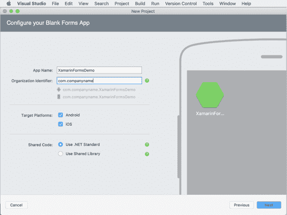

图 49:输入项目信息

**组织标识符**是一个非常重要的字段，因为安卓和 iOS 都使用它来唯一标识您在 Google Play 和 App Store 中的应用程序。按照惯例，组织标识符具有以下形式:

`com.companyname.appname`

其中`com.`为固定前缀，`companyname`代表您公司的名称，`appname`代表您申请的名称。您实际上不需要在“组织标识符”文本框中输入应用程序名称，因为 Visual Studio 会自动将其与您刚才提供的组织标识符连接起来。

在**目标平台**组中，可以选择自己想要瞄准的平台，比如安卓和 iOS。现在，保持两者都选中。**共享代码**组至关重要，因为它允许您决定在项目中使用哪种代码共享策略:. NET 标准库还是所谓的共享项目。两者各有利弊，但要了解更多细节，请务必阅读 *[Xamarin。macOS 表单简洁](https://www.syncfusion.com/ebooks/xamarin_forms_for_mac_os_succinctly)* 电子书。

现在，选择**使用。NET 标准**选项，然后点击**下一步**。在最后一个屏幕中(参见图 50)，您将可以选择查看项目信息和解决方案的结构，并且您将能够使用 Git 将解决方案添加到源代码管理中，以及将 UI 测试项目添加到解决方案中。不要选择这些选项，只需点击**创建**。

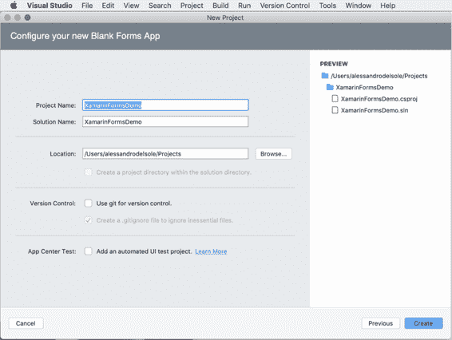

图 50:项目摘要信息

几秒钟后，解决方案就准备好了，它的所有元素在解决方案面板中都是可见的，如图 51 所示。

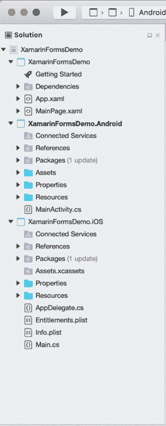

图 Xamarin。在解决方案面板中形成可见的解决方案

该解决方案包含三个项目:第一个项目是一个. NET Standard 库，其中包含所有可以跨平台共享的代码，例如 iOS 和 Android 中都存在的视觉元素(标签、文本框、按钮等)。另外两个项目是本地 Xamarin。安卓和 Xamarin.iOS 项目，这些项目将包含您需要编写的任何特定于平台的代码，以便访问支持 Xamarin 的 API。表单不能在平台间共享。

在 Xamarin。表单，更一般地说，在移动应用程序开发中，用户界面以页面呈现。当您创建 Xamarin 时。表单解决方案中，一个名为 MainPage.xaml 的文件中也提供了类型为`ContentPage`的根页面。表单是通过 XAML(可扩展应用程序标记语言)语言定义的，该语言将可视元素映射到 XML 节点，并将它们的属性映射到 XML 属性。

对于每页，在中定义。xaml 文件中，还有一个 C#代码隐藏文件，您可以在其中编写实现用户界面逻辑和操作的代码。在 MainPage.xaml 的情况下，代码隐藏文件称为 MainPage.xaml.cs，可以通过展开解决方案面板中的 MainPage.xaml 项来打开。

您将通过**文件** > **新文件**添加新的 XAML 文件，具体取决于您在应用程序中需要多少页面。例如，假设您将 MainPage.xaml 文件(应用程序的根页面)的默认 XAML 代码替换为以下代码。

代码清单 2

```
<?xml version="1.0" encoding="utf-8"?>
<ContentPage  xmlns:x="http://schemas.microsoft.com/winfx/2009/xaml" xmlns:local="clr-namespace:XamarinFormsDemo" x:Class="XamarinFormsDemo.MainPage">
    <StackLayout>
        <Label Text="Enter some text" HorizontalOptions="Center" 
               VerticalOptions="CenterAndExpand" />
        <Entry x:Name="InputBox" HorizontalOptions="FillAndExpand"/>

        <Button x:Name="Button1" Text="Tap here" 
                Clicked="Button1_Clicked" 
                HorizontalOptions="FillAndExpand" />
    </StackLayout>
</ContentPage> 

```

您将获得一个带有根控件容器(`StackLayout`)的页面，该容器允许您将多个控件放置在彼此附近，一条文本消息(`Label`)、一个文本框(`Entry`)和一个`Button`控件，该控件公开了一个可以用 C#代码处理的`Clicked`事件。下面的简单示例显示了一条包含用户输入的文本的消息。

代码清单 3

```
async void Handle_Clicked(object sender, System.EventArgs e)
{
string message = $"You entered {this.InputBox.Text}";
await DisplayAlert("Information", message, "OK");
} 

```

值得一提的是，当您在 XAML 代码编辑器中键入一个事件的名称时，Visual Studio 将提供生成一个新的 C#事件处理程序——只需按 Tab 键即可。此时，C#代码编辑器将要求您指定新事件处理程序在代码中的位置，如图 52 所示。

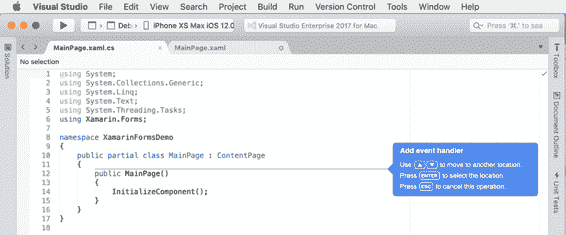

图 52:添加新的 C#事件处理程序

当 Visual Studio 添加新的事件处理程序存根时，代码只是抛出一个新的`NotImplementedException`，您将需要用自己的代码替换默认代码，就像前面的例子一样。编写 XAML 代码来定义用户界面当然是直观的，尤其是因为代码编辑器提供了智能感知完成的专门版本。然而，当您编写代码时，有预览用户界面的选项会很好。幸运的是，Mac VS 中的 XAML 代码编辑器包含一个名为预览的功能，您可以通过单击位于每个 XAML 编辑器选项卡右上角的同名按钮来启用该功能。预览器看起来如图 53 所示，它显示了来自 XAML 代码示例的结果预览。

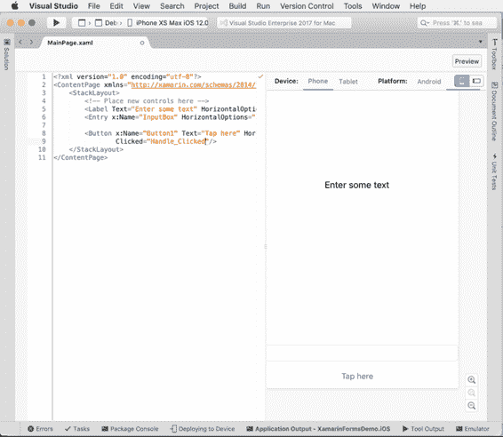

图 53:预览 XAML 代码的结果

你可以决定基于手机或平板电脑获得预览，也可以决定基于 iOS 或安卓获得预览。图 53 显示了基于 iOS 渲染器的预览。

|  | 提示:您需要先构建解决方案，然后才能首次使用预览。此外，如果渲染器失败，它将显示任何错误详细信息，以便您可以修复代码并重试查看预览。 |

在 Visual Studio for Mac 中，调试和测试 Xamarin 项目非常简单。在标准工具栏中，您可以通过选择安卓或 iOS 项目作为启动项目来选择您想要瞄准的平台，然后您可以从可用设备列表中选择一个，包括仿真器和物理设备(如果连接到 Mac)。一旦选择了目标平台和设备，就可以按下标准工具栏上的**开始**开始调试。图 54 显示了示例应用程序在 iOS 和安卓模拟器中的外观。

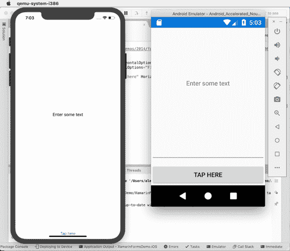

图 54:在模拟器中运行的示例应用程序

您将能够使用第 3 章中描述的所有调试工具。

|  | 提示:为了在物理 iOS 设备上测试您的应用程序，Visual Studio 需要调用 Xcode SDK 工具来生成证书和配置文件。关于这些主题的更多信息可以在官方的 Xamarin.iOS 文档中找到。 |

## Xamarin 项目选项

Xamarin 项目的选项可以深度定制。例如，在 Xamarin 中。以前创建的表单解决方案，在解决方案面板中，右键单击。NET 标准库项目，然后选择**选项**。在本节中，将只讨论**构建**选项卡，因为其他选项卡具有您已经看到的相同选项和目的。NET 核心项目。在**构建**选项卡中(见图 55)，您可以更改的版本。项目支持的. NET 标准。

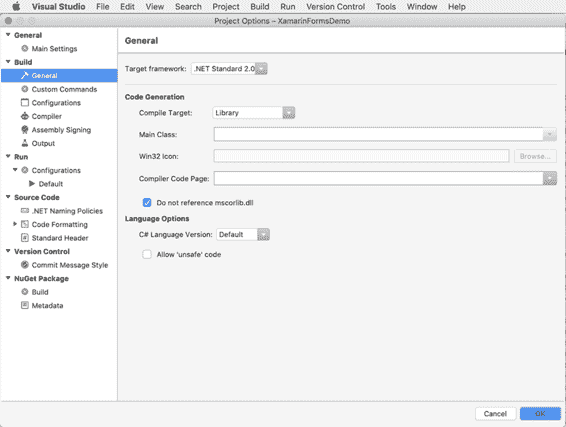

图 55:的构建选项。Xamarin 中的. NET 标准项目。形式

现在关闭对话框，右键单击解决方案面板中的安卓项目名称，然后选择**选项**。你会发现几个与安卓开发相关的标签，如**安卓构建**、**安卓应用**、**安卓包签约**。在第一个选项卡中，您将找到控制编译过程的选项，使用安卓包签名，您将找到签名的选项。apk 生成的包，在将应用发布到 Google Play 之前，您需要该包。这里将不详细介绍这些选项卡中提供的选项；提供了关于 Android Application 选项卡的附加注释，如图 56 所示。

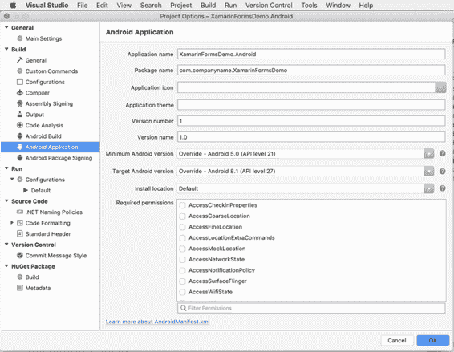

图 56:安卓应用程序选项

在这里，您可以在**应用程序名称**框中指定一个应用程序友好的名称，因为它将出现在您的客户面前。您还可以提供图标并指定版本号。最重要的选项与用于编译的工具版本和**所需权限**组相关。在**最低安卓版本**组合框中，您可以指定运行应用程序所需的最低安卓版本。在**目标安卓版本**组合框中，可以指定用于构建应用的安卓 SDK 版本。

在底部，您将看到一个权限列表，如果您的应用程序需要访问特定的系统功能，您必须选择该列表。例如，如果您的应用程序需要访问互联网，您需要选择**互联网**权限。请记住，如果您没有指定应用程序所需的权限，将会出现运行时异常。

关闭对话框，右键单击**解决方案**面板中的 iOS 项目名称，然后选择**选项**。在 iOS 项目选项中，有以下特定于 iOS 开发的选项卡:

*   iOS 构建，包含允许控制构建过程的选项。
*   iOS 调试，其中包含允许配置调试器端口和 WiFi 调试的选项。
*   iOS 点播资源，其中包含允许将主应用捆绑包拆分为多个块以减小应用大小的选项。
*   iOS 捆绑签名，这一点极其重要，因为它允许您通过“签名身份”框选择将用于签署应用程序包的证书(如开发证书或分发证书)，它还允许您根据需要完成的任务(开发或分发)选择预配配置文件。
*   iOS IPA 选项，允许你自定义生成的属性。ipa (iOS 应用商店)应用包。

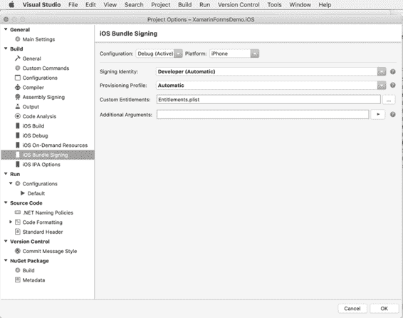

图 57:iOS 捆绑包签名选项

实际上，对于 iOS 项目来说，大多数应用程序属性都是通过 Info.plist(信息属性列表)文件设置的，您可以在解决方案面板中看到该文件，而 Visual Studio for Mac 提供了一个特定的编辑器，双击文件名后就会出现该编辑器。

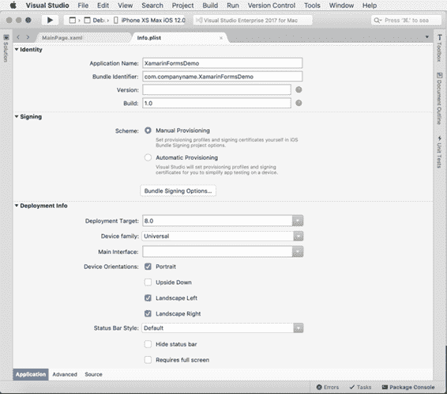

图 58:信息列表编辑器

**标识**组包含标识应用程序的选项，如应用程序友好名称、捆绑包标识符(在您创建项目时生成)、版本号和内部版本号。**签名**组允许您选择设置配置文件，Visual Studio for Mac 允许您在**手动设置**和**自动设置**之间进行选择。对于后者，如果您使用苹果 ID 登录，Visual Studio for Mac 将能够生成在物理设备上运行您的应用程序所需的所有证书和所有配置文件。如果您点击**捆绑包签名选项**按钮，您将被重定向到选项对话框的 iOS 捆绑包签名选项卡，如图 57 所示。

在**部署**组中，您可以指定最低要求版本(**部署目标**)、设备系列(通用、iPhone/iPod 或 iPad)、启动屏幕(**主界面**)和设备方向等选项。您可以选择指定状态栏样式，隐藏状态栏，并将应用程序设置为要求全屏。

## 发布应用的提示

为了发布你用 Visual Studio 为 Mac 构建的应用，你需要在[谷歌 Play](https://developer.android.com/distribute/console/) 和[苹果商店](https://developer.apple.com/programs/)上有付费开发者账户。然后，集成开发环境简化了发布的整个过程，假设您执行了两个存储所需的所有初步步骤。

对于安卓，你需要在应用清单中指定所有需要的属性，然后你可以选择**发布**或**临时**配置，并运行**构建** > **发布档案**命令。此命令生成一个。apk 包，你将需要用你在谷歌开发者控制台中获得的密钥进行签名。图 59 展示了 Visual Studio 如何轻松生成用于发布的归档的示例。

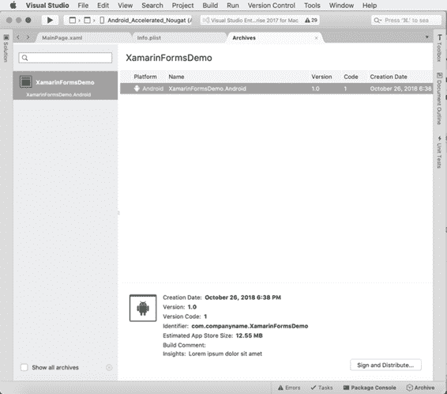

图 59:归档用于发布的包

然后您就可以上传签名的。通过开发者控制台将 apk 包下载到 Google Play。对于 iOS 来说，事情有点复杂。您需要在苹果开发者门户中生成和下载分发证书，并通过 Info.plist 编辑器的**签名身份**选项将它们与您的应用程序相关联(见图 58)。您还需要将应用程序的捆绑包标识符与开发人员帐户相关联。集成开发环境集成了简化部署过程的工具，但是由于所需的初步步骤的复杂性，我建议您阅读[官方文档](https://docs.microsoft.com/en-us/xamarin/ios/deploy-test/app-distribution/app-store-distribution/publishing-to-the-app-store?tabs=macos)。

## 章节总结

移动应用程序开发对微软至关重要，而 Visual Studio for Mac 为您提供了使用强大的集成工具开发、构建和发布应用程序所需的一切。Xamarin 是允许有微软背景的开发人员用 C#编写应用程序的首选技术。本章概述了 Xamarin 和 Xamarin。表单，以及可用的项目模板，并演示了如何使用模拟器测试您的应用程序，并提供了关于应用程序发布的提示。

Visual Studio for Mac 还允许集成的团队协作，下一章是关于 Git 的版本控制。