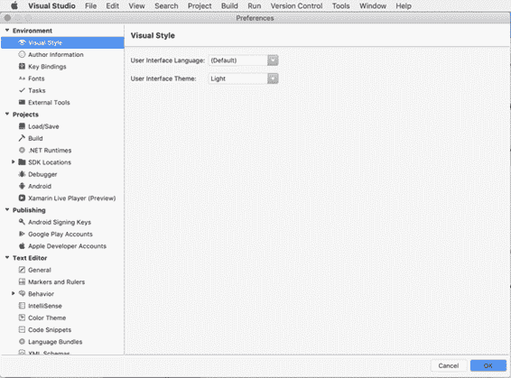
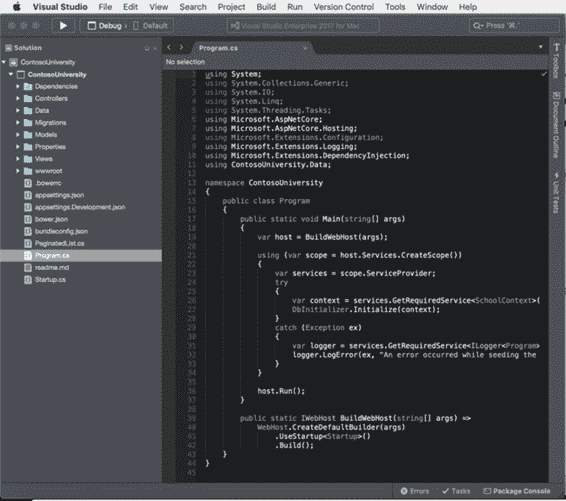
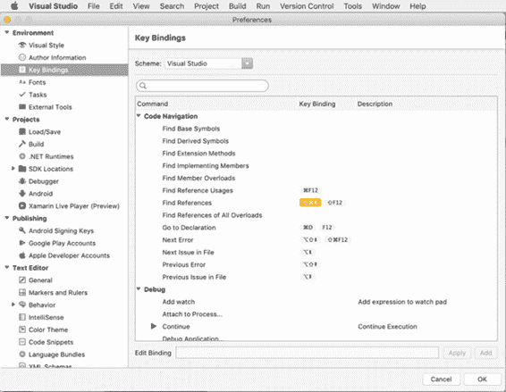
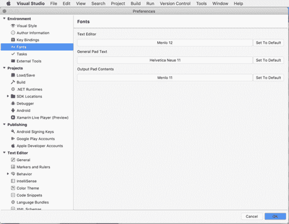
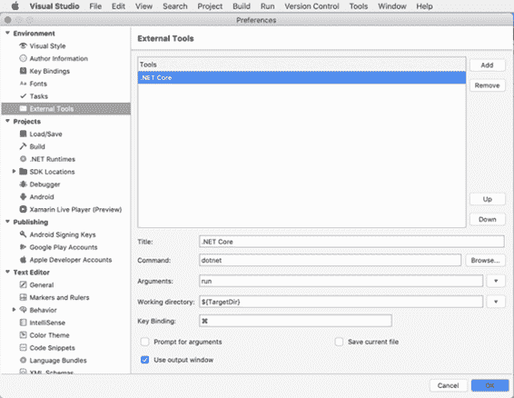
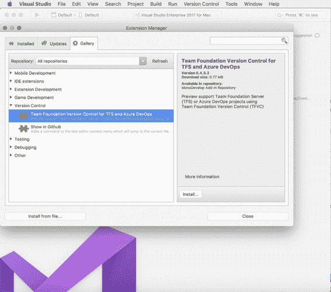

# 第 7 章为 Mac 定制和扩展 Visual Studio

一个开发环境只有能够让开发人员有宾至如归的感觉时才是有成效的，而 Visual Studio for Mac 当然有。作为一个强大的工具，它可以在许多方面进行定制和扩展，正如您将在本章中学习的那样。

## 为 Mac 定制 Visual Studio

Visual Studio for Mac 可以通过多种方式进行自定义，以便更好地符合您的偏好。大多数自定义设置可通过首选项对话框获得，您可以通过 **Visual Studio** > **首选项**启用该对话框。弹出首选项对话框后，您可以浏览可用选项。

### 应用主题

Visual Studio for Mac 中的主题有两种类型:第一种类型是关于用户界面的语言，第二种类型是关于更改用户界面的颜色。两者都可以在**视觉样式**标签中找到(见图 71)。

图 71:视觉样式选项卡

使用**用户界面语言**下拉菜单，您可以选择不同的语言。默认选择称为**默认**，并使 Visual Studio 使用与您的 Mac 上检测到的语言相同的语言。如果不支持系统语言，英语将被设置为默认语言。使用**用户界面主题**，您可以在亮(默认)和暗之间选择视觉主题。图 72 显示了 Visual Studio for Mac 在深色主题下的外观。

图 72:黑暗主题

每次选择主题时，您都需要为 Mac 重新启动 Visual Studio。

### 自定义作者信息

**作者信息**选项卡提供了一些框，您可以用自己的个人信息填写这些框，以便这些信息将自动用于所有项目，从而将您识别为开发人员。

### 自定义按键绑定

**键绑定**选项卡(见图 73)允许自定义键盘快捷键。您可以通过从**方案**下拉框中选择预定义的方案并编辑单个绑定来进行自定义。可用的方案有 Visual Studio、Resharper/Rider、Visual Studio (Windows)、Visual Studio(混合)、Visual Studio Code 和 Xcode，您还可以创建自定义方案。

图 73:编辑键绑定

然后，您可以单击现有的键绑定，并在**编辑绑定**文本框中输入所选命令的组合键。

### 自定义字体

您可以自定义用于代码编辑器、常规面板和输出面板的字体。这可以通过**字体**选项卡(见图 74)轻松完成，您只需单击当前字体，并在出现的字体编辑器中将其更改为不同的字体(具有不同的大小和颜色)。

图 74:定制字体

### 自定义评论颜色

编码时，添加`TODO`、`FIXME`等代币并不罕见。在 Visual Studio for Mac 中，您可以让代码编辑器以不同的颜色呈现这些标记。在**首选项**对话框的**任务**选项卡中，您可以指定令牌，然后根据令牌优先级选择颜色。您还可以添加自定义令牌来获得更定制的体验。

### 自定义工具

有时，您可能需要从集成开发环境中调用外部工具。**外部工具**选项卡允许添加菜单命令来调用外部工具，如编译器、编辑器和 SDK 应用程序。

在图 75 中，您可以看到一个示例，显示如何添加一个调用`dotnet`命令行工具的新命令，传递`run`参数和工作目录。后者可以指定为纯路径或代表特定目录的常数。本示例使用`${TargetDir}`常量，该常量表示构建过程的结果所在的目录。

图 75:添加自定义工具

请注意如何为新命令指定键绑定，以及如何决定将外部工具的输出重定向到输出面板。当您单击**确定**时，新命令会添加到工具菜单中。

### 引入自定义布局

通常，您会根据正在处理的项目类型或正在执行的任务来组织工作区的布局。例如，使用 Xamarin 解决方案，您可能需要打开和排列一些 pad，而在 ASP.NET Core 项目中，您可能需要其他 pad。或者，在调试应用程序时，您可能需要调试面板，在完成调试后，您可能需要其他面板。

为了让事情变得更简单，Visual Studio for Mac 有布局的概念。“视图”菜单提供了一些称为“代码”、“设计”、“调试”和“测试”的内置布局，每个布局都被配置为根据当前任务显示适当的面板，例如编写代码、设计用户界面、调试和测试代码。在**视图**菜单中点击布局名称，可以快速从一个布局切换到另一个布局。

您还可以创建自定义布局，允许您按照您想要的方式排列所需的焊盘，并存储布局以供以后重复使用。为此，选择**查看** > **保存当前布局**。在出现的对话框中，只需为布局指定一个自定义名称，然后单击**创建布局**。此时，您的新布局将出现在带有内置布局的“视图”菜单中，您只需单击其名称即可应用它。Visual Studio for Mac 还会为您的自定义布局显示一个“删除”命令。

## 为 Mac 扩展 Visual Studio

Visual Studio for Mac 可以通过附加工具和组件进行扩展，例如新的项目模板、对话框、为附加开发平台和服务提供支持的工具等。您可以通过**扩展管理器**对话框来管理扩展，该对话框可以通过 **Visual Studio** > **扩展**来启用。

扩展管理器工具由三个选项卡组成。第一个标签(**已安装**)列出了已安装的扩展。您可以展开每个组并选择单个扩展查看详细信息，也可以通过**禁用**和**卸载**按钮禁用或卸载扩展。**更新**选项卡列出了扩展更新(如果有)。**图库**选项卡(见图 76)允许您在互联网上搜索扩展名。

图 76:为 Mac 扩展 Visual Studio

您可以选择一个扩展在右侧查看其详细信息，然后只需点击**安装**即可下载并安装到您的 Mac 上。

## 为 Mac 更新 Visual Studio

默认情况下，Visual Studio for Mac 将自动搜索集成开发环境的新更新。NET 核心库和 Xamarin 库。更新将被下载，但不会被安装，直到您给予这样做的许可。您也可以通过选择 **Visual Studio** > **检查更新**来手动检查更新。执行此操作时，将出现“Visual Studio 更新”对话框，并列出可用的更新。您也可以在此对话框中选择更新通道，如稳定、测试和 Alpha。显然，Beta 和 Alpha 包含不稳定的软件，应该避免使用，除非您想尽早访问不能在生产中使用的位。

|  | 提示:如果您使用 Xamarin 为 iOS 构建应用程序，请确保当 Apple Xcode 的新版本或更新发布时，用于 Mac 的 Visual Studio 会收到更新。事实上，苹果 SDK 和 Xamarin 之间的版本匹配对于构建没有错误的应用程序至关重要。 |

## 章节总结

Visual Studio for Mac 可以通过多种方式进行定制和扩展。您可以更改用户界面的语言和主题，更改字体和键盘快捷键，添加自定义命令，以及保存自定义键盘布局以备后用。您还可以安装扩展，以提供更多功能并增加对新平台和服务的支持。Visual Studio for Mac 使检查产品更新变得容易，这样您就可以始终使用最新版本。