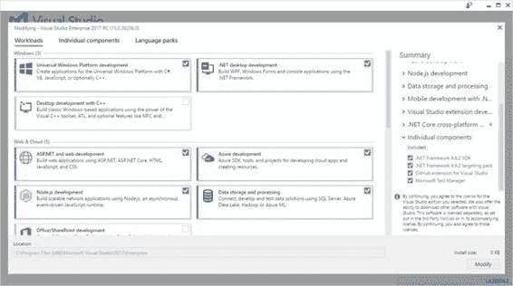
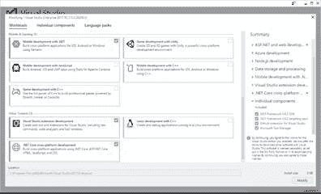
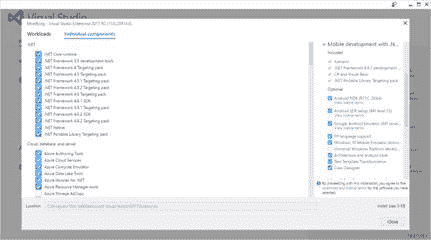
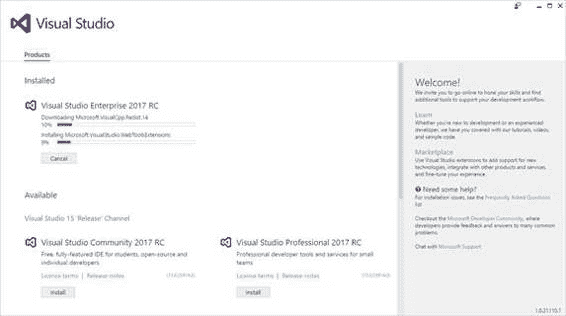

微软 Visual Studio 一直是一个极其强大的开发环境。其强大的原因之一是它可以针对多个开发平台，并且在 2013 和 2015 版本中，它甚至增加了针对非微软技术和操作系统的选项。例如，考虑同时使用 Xamarin 和 Apache Cordova 开发安卓和 iOS。但是强大的功能也意味着复杂的基础设施，在过去，Visual Studio 需要许多小时的安装时间和大量的磁盘空间。在 Visual Studio 2017 中，微软带来了新的安装体验，简化了安装过程，节省了时间和磁盘空间。安装 Visual Studio 2017 将是您使用新版本的第一次体验，值得深入讨论。

## 解决 Visual Studio 安装的复杂性

考虑到其 premiere 开发工具的整体性能和效率的重要性，微软对 Visual Studio 2017 的目标之一是简化安装过程，以节省开发人员的时间和磁盘空间。使用 Visual Studio 2015，完整安装需要在磁盘上存储数千兆字节，并且需要几个小时才能完成。解决这个问题意味着重新思考整个集成开发环境基础设施，改变 Visual Studio 使用它所依赖的组件的方式以及它允许针对不同开发平台的方式。基于这些变化，Visual Studio 2017 现在由包含代码编辑器和基本工具的核心外壳组成，称为 **Visual Studio 核心编辑器**。这提供了用多种语言编写代码的能力，包括(但不限于)Visual Basic、C#、C++和 Python，以及语法着色、智能感知和调试支持，所有这些都在熟悉的 Visual Studio 环境中进行(参见[第 5 章“使用解决方案、文件夹和语言”](5.html#_Chapter_5_))。

此外，Visual Studio 2017 支持添加组件集，每个组件集都针对特定的开发场景。每组组件被称为一个**工作负荷**。工作负载使安装和维护变得更加容易，并允许开发人员在没有不必要的组件、软件开发工具包和工具的情况下安装他们实际需要的东西。为了获得基本的编码环境，您甚至可以决定只安装 Visual Studio 核心编辑器，而不安装任何额外的工作负载，这将把 Visual Studio 安装所需的空间减少到大约 750 兆字节。您可能需要的不仅仅是语法突出显示，这意味着您需要选择合适的工作负载，这只是让您了解 Visual Studio 的基础架构是如何被重新审视的。下一节将描述如何安装 Visual Studio 2017，并解释关于工作负载的更多信息以及您可以对每个工作负载做些什么。

|  | 提示:Visual Studio 2017 可以在安装了早期版本的 ide 的机器上并排安装。 |

启动安装程序时，系统会提示您一个全新的用户界面，其中显示了工作负载列表。这如图 1 所示。

图 1:开始安装 Visual Studio 2017

如您所见，工作负载按以下类别分组:

*   Windows 操作系统
*   网络和云
*   移动和游戏
*   其他工具集

通过滚动列表可以发现所有可用的工作负载(参见图 2)。

图 2:附加工作负载

您可以使用 Visual Studio 2017 选择日常工作所需的所有工作负载。如果选择无工作负载，将只安装 Visual Studio 核心编辑器。在对话框的右侧，您可以展开工作负载名称，查看它包含哪些组件以及附加的单个组件列表。表 1 更详细地描述了可用的工作负载。

表 Visual Studio 2017 的可用工作负载

| **名称** | **描述** |
| 通用视窗平台开发 | 如果要为 Windows 10 编写通用应用程序，包括 PC、平板电脑、智能手机、HoloLens、Xbox 和 IoT 设备，请选择此工作负载。 |
| 。NET 桌面开发 | 如果要使用构建带有 WPF、Windows 窗体和控制台应用程序的经典 Windows 桌面应用程序，请选择此工作负载。NET 框架。这缩短了解决方案加载时间，并改进了智能感知、代码导航和重构。它包括新功能，如 XAML 编辑和继续和点击运行调试，这两者都在这本电子书中讨论。 |
| 用 C++进行桌面开发 | 如果您希望使用 C++语言和环境创建、构建和调试运行在从 Windows XP 到最新 Windows 10 版本的本机经典桌面应用程序，请选择此工作负载。 |
| ASP.NET 与网络发展 | 选择此工作负载来使用 ASP.NET 和基于标准的技术(如 HTML、JavaScript、CSS 和 JSON)开发 web 应用程序。就像。NET desktop，该工作负载包括更短的解决方案加载时间、改进的 IntelliSense、代码导航和更多重构，它使您能够快速将应用程序部署到 web 服务器或 Azure。 |
| 蔚蓝发展 | 此工作负载为安装最新的 Azure SDK。NET 和用于 Visual Studio 2017 的工具。它允许您在云资源管理器中查看资源，使用 Azure 资源管理器工具创建资源，并构建准备在 Azure 中托管的应用程序和服务。 |
| Node.js 开发 | 这个工作负载添加了为 Node.js 构建应用程序所需的一切，包括 IntelliSense、本地和远程调试、概要分析、npm 集成、交互式窗口、测试运行器和 Azure 集成。 |
| 数据存储和处理 | 该工作负载提供了访问内部 SQL Server 数据库以及 Azure 和 Azure 数据湖资源上的 SQL 数据库的工具。它还在 Azure 上提供对 U-SQL、Hive 和大数据的支持。 |
| Office/SharePoint 开发 | 此工作负载提供了 Office 开发人员工具，这些工具允许创建 Office 和 SharePoint 加载项和解决方案。 |
| 。NET Core 跨平台开发 | 这个工作负载安装了编写跨平台 web 应用程序所需的所有工具。NET Core，支持部署到 Docker 容器。 |
| 移动开发。网 | 该工作负载安装 Xamarin，该技术允许您使用共享的 C#代码库创建本机 iOS、Android 和通用 Windows 平台应用程序。 |
| 用 Unity 开发游戏 | 如果您想使用统一框架和 Visual Studio 2017 集成工具开发跨平台的 2D 和 3D 游戏，请选择此工作负载。 |
| 用 JavaScript 进行移动开发 | 该工作负载安装 Apache Cordova，用于在 Visual Studio 中使用 HTML 和 JavaScript 创建跨平台移动应用程序。 |
| 用 C++进行移动开发 | 如果您想使用 C++创建跨平台移动应用程序，请选择此工作负载。 |
| 用 C++开发游戏 | 如果要使用 C++创建游戏，请选择此工作负载。 |
| Visual Studio 扩展开发 | 此工作负载安装 Visual Studio SDK，并允许您编写扩展，如新命令、工具窗口和模板。 |
| 用 C++开发 Linux | 此工作负载使您能够在 Visual Studio 2017 中为 Linux 服务器、桌面和设备创作 C++代码。 |

为了本电子书的教学目的，我已经安装了所有可用的工作负载。你不需要做同样的事情——只选择你需要的。以后可以根据需要安装额外的工作负载。

尽管工作负载有助于简化安装，但您可能仍然需要安装单个组件。在图 2 中，您将看到一个名为**的项目:单个组件**。单击它可以访问独立组件的完整列表，这些组件可以在不考虑所选工作负载的情况下安装(参见图 3)。

图 3:选择单个组件

例如，默认情况下不会选择 Visual Studio 2017 的 GitHub 扩展，这意味着如果您计划在该流行服务上使用 Git 存储库，您可能希望选择该组件。做出选择后，点击**关闭**，选择要安装的 Visual Studio 2017 版本。一个对话框将显示操作的进度(见图 4)。

图 4:安装进度

完成安装所需的时间取决于工作负载的数量和您的互联网连接。但是，即使选择了许多工作负载，您也会注意到它比以前的 Visual Studio 安装要快得多。

借助 Visual Studio 2017，您最终可以在同一台机器上安装多个版本。这个伟大的功能意味着您可以在同一台机器上安装社区版、专业版和企业版(或其中任意两个)。现在这是可能的，因为每个版本都安装在系统上的特定子文件夹中。除了运行单独的安装程序，您还可以直接从当前的安装程序启动新的安装程序。图 4 显示了安装企业版时社区版和专业版的安装按钮。

|  | 注意:Visual Studio 核心程序集不再安装到全局程序集缓存(GAC)中。为了支持多个版本的安装，Visual Studio 2017 所需的大多数程序集现在都驻留在 C:\ Program file(x86)\ Microsoft Visual Studio \ 2017 \ %editionName% \ common 7 \ IDE \ public assemblies 中，其中% editionName %是已安装的版本(如社区、专业版或企业版)。 |

Visual Studio 2017 为修改现有安装提供了新的快捷方式。你只需进入**窗口** > **所有程序**菜单，选择 **Visual Studio Installer** 快捷方式。这将启动安装程序，您可以选择添加或删除工作负载或单个组件。

与其前身一样，Visual Studio 2017 在“所有程序”菜单中使用相同名称的快捷方式启动。当它第一次启动时，Visual Studio 将要求您的 Microsoft 帐户凭据登录(可选)。您可能知道，输入微软帐户将允许跨机器同步设置。这也将自动恢复您在现有 VS 2017 安装上可能拥有的自定义设置。启动 Visual Studio 时，您会立即认识到比 Visual Studio 2015 更好的性能和更快的启动速度。启动时的其他新功能将在下一章中介绍。

Visual Studio 2017 引入了基于 Visual Studio 核心编辑器和大量工作负载的全新安装体验，每个工作负载都针对特定的开发场景。这不仅简化了安装过程，而且安装 Visual Studio 现在更快、更高效。您仍然可以完全控制已安装的组件，甚至可以在同一台机器上安装多个版本的 Visual Studio 2017。现在您已经设置了环境，第一次启动 Visual Studio 2017 时，您会发现一些新功能。