# 三、代码编辑器改进

代码编辑器是您花费大部分开发人员生命的地方，微软在 IDE 的每个主要版本中都引入了生产力改进。Visual Studio 2017 也不例外——它引入了许多优秀的功能来改善您的编码体验。

|  | 注意:本章中描述的所有主题都适用于 C#和 Visual Basic，除非另有明确说明。此外，请记住，C#、Visual Basic、C++和 F#还提供了许多本章没有涉及的新语言功能，这些功能侧重于代码编辑体验。有关 Visual Studio 2017 中编程语言的更多信息，请访问 [Visual Studio 文档](https://docs.microsoft.com/en-us/visualstudio/#pivot=languages)。 |

长期以来，智能感知工具一直是每个使用微软 Visual Studio 的开发人员最好的朋友。在 Visual Studio 2017 中，智能感知得到了重大改进，这将有助于您在编码时节省时间。首先，智能感知现在在过滤方面更加智能。它不会提示列表中的顶部项目，而是根据您键入的内容自动显示最佳匹配结果。并且，不限于此，当您键入时，它开始以粗体突出显示单词，如图 8 所示。

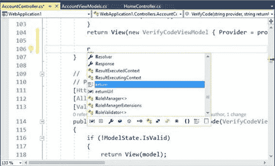

图 8:智能感知建议和过滤器

基于特定类型或成员的筛选是 Visual Studio 中的另一个重要改进。如图 8 所示，在 IntelliSense 的底部有一个带有许多图标的新栏，每个图标代表一种特定的对象或成员，如局部变量、常数、属性、字段、方法、接口、类、值类型、枚举、委托、命名空间、保留字，甚至代码片段。例如，图 9 显示了如何将智能感知的成员搜索限制在方法、类和代码片段。

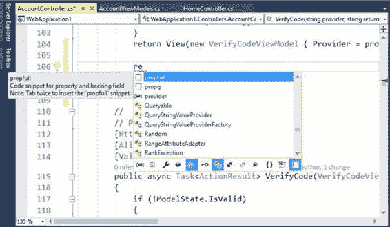

图 9:过滤智能感知搜索

单击图标添加或删除指定的过滤器。这个新选项极大地简化了您利用单词补全的方式，尤其是当您事先知道需要处理什么类型的对象时。

在类型定义和成员调用或赋值之间快速移动对于工作效率至关重要，尤其是对于几十个代码文件。Visual Studio 2017 引入了许多有趣的代码导航改进，从而提高了您的工作效率。

“查找所有引用”是一个流行的工具窗口，您可以使用它来查看对象或成员在解决方案中的使用位置和方式。对于无法利用 CodeLens 工具的开发人员来说，它仍然更有用，该工具仅在企业版中可用。在 Visual Studio 的早期版本中，“查找所有引用”显示了使用对象或成员的代码行列表，包括其定义，并提供了一个选项，可以双击列表中的一行，并立即重定向到编辑器中的代码行。在 Visual Studio 2017 中，“查找所有引用”通过语法着色和更直观的用户界面，先按项目再按类型对对象和成员引用进行分组。图 10 显示了一个基于对名为`Person`的类的引用的例子，该类用于两个不同的项目。

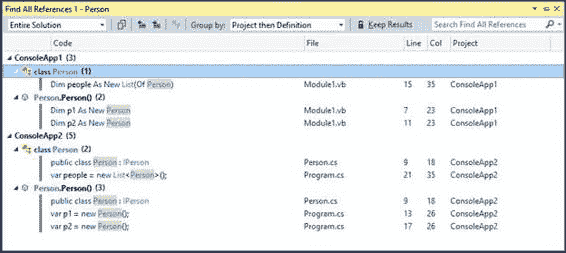

图 10:使用语法着色查找所有引用组引用

如您所见，新视图使您更容易看到对象在哪里以及如何被使用。工具窗口显示项目名称附近的引用数量、类型及其成员。您仍然可以双击某个项目，在选定的行上打开代码编辑器。如果将鼠标悬停在引用上，彩色工具提示会显示引用对象或成员的代码块的预览(参见图 11)。

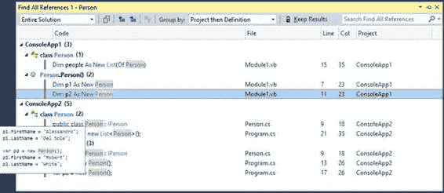

图 11:彩色工具提示显示了引用对象的代码块的预览

默认情况下，“查找所有引用”显示整个解决方案中的引用。您可以通过打开的文档、当前项目、当前文档和具有待定更改的文档来筛选列表。此外，默认情况下，“查找所有引用”按项目分组，然后按对象定义分组。表 2 显示了您可以在**分组依据**组合框中找到的可用分组对象列表。

表 2:查找所有引用的分组选项

| **选项** | **描述** |
| 项目然后定义 | 按项目分组，然后按对象定义分组(默认)。 |
| 仅定义 | 按对象或成员定义分组，没有项目层次结构。 |
| 定义然后是项目 | 按对象定义分组，然后按项目分组。 |
| 定义然后是路径 | 按对象定义分组，然后按包含该定义的代码文件的路径分组。 |
| 定义，项目，然后路径 | 按对象定义分组，然后按项目分组，最后按代码文件的路径分组。 |

您也可以使用**搜索查找所有引用**文本框在结果中搜索，并通过单击**保留结果**锁定当前结果。

### 带转到的导航代码

Visual Studio 2017 引入了一个名为**转到**的新导航功能，它取代并改进了另一个流行的工具“导航到”。要启用转到，只需按下 Ctrl+T。一个导航弹出窗口出现，并自动列出当您按下 Ctrl+T 时光标所在的标识符的所有出现。图 12 显示了一个示例。

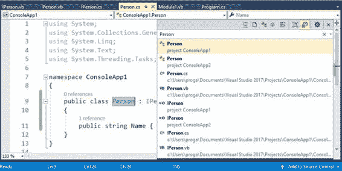

图 12:转到列出指定标识符的出现

您可以通过在搜索栏中键入来优化搜索。该列表将自动更新为与您键入的内容相匹配的任何单词。像智能感知一样，“转到”在顶部有一个新的工具栏，可以根据对象类型轻松过滤。您可以按代码文件、类型、方法、对象成员和代码行进行筛选。使用“转到”，一次只能应用一个过滤器。请注意，当您单击筛选按钮时，搜索框会在单词或标识符前显示特殊字符。例如，搜索框中任何单词前面的`t`字符将按类型过滤列表，而`#`字符将按方法过滤。其他支持的字符有`f`(文件)、`m`(成员)和`:`(行号)。这些都很有用。如果你事先知道你在搜索什么样的对象或成员，他们可以加快你的搜索速度。

“转到”具有可自定义的设置。如果您点击工具栏右上角的**显示设置**按钮，您将能够决定是显示预览选项卡还是启用详细视图。图 13 显示了一个定制的视图，它根据类型进行过滤，并显示了项目、代码文件和包含所选类型的行号等细节。

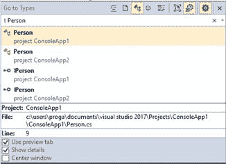

图 13:定制转到视图

实际上，Ctrl+T 是**编辑**菜单中**转到所有**命令的快捷方式。“编辑”菜单有附加的“转到”命令(例如，“转到类型”和“转到成员”)，每个命令都映射到“转到”工具窗口中的过滤器。如果选择其中一个命令，将显示“转到”，并启用相应的过滤器。这可以加快代码导航速度，尤其是在使用提供的键盘快捷键时。

### 结构引导线

Visual Studio 2017 的代码编辑器引入了一个名为**结构可视化工具**的功能，该功能以前在 Visual Studio 2015 的生产力电动工具扩展中可用。启用此功能后，编辑器会绘制结构辅助线，即每个代码块附近的小灰色垂直线，以便于查看代码的结构。如果将鼠标悬停在结构化辅助线上，编辑器将显示工具提示，其中包含当前块的父代码预览。图 14 展示了这一点。

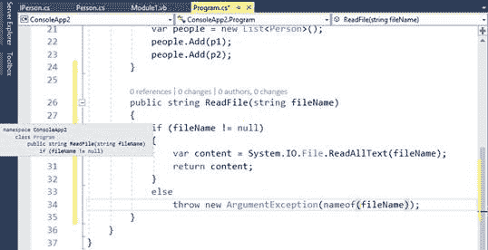

图 14:用引导线可视化代码结构

该功能对于长代码块非常有用，默认情况下是启用的。如果要禁用，请转到**工具** > **选项** > **文本编辑器**，清除**显示结构引导线**选项。

随着 Visual Studio 2017 的发布，微软将发布 C# 7.0 和 Visual Basic 15，以及的更新版本。NET 编译器平台，也称为[项目罗斯林](https://github.com/dotnet/roslyn)。那个。NET 编译器平台为开源的 C#和 Visual Basic 编译器提供了丰富的代码分析 API。有了这个平台，编译器作为一种服务提供，开发人员可以利用他们的 API 对源代码执行许多操作。如果你想了解更多关于罗斯林的信息，可以阅读电子书 [*罗斯林简洁*](https://www.syncfusion.com/resources/techportal/details/ebooks/roslyn) (也是我写的)。从 Visual Studio 2015 开始，包括代码编辑器在内的大量工具不再由 IDE 本身提供动力；相反，它们由罗斯林提供动力。这些工具包括在键入时检测问题的实时代码分析和代码重构。如 [*中所述，当编译器在您键入时检测到代码问题时，编辑器会提供灯泡和快速操作来修复问题或重构代码块。Visual Studio 2017 向前迈出了一些步伐，提供了新的重构工具和基于罗斯林的增强编码体验。*](https://www.syncfusion.com/resources/techportal/details/ebooks/roslyn)

罗斯林的新版本提供了更多有趣的代码重构。以下是新功能的详细列表。

#### 简化对象初始化

第一个新的重构简化了对象初始化。它将基于属性赋值的对象初始化替换为基于对象初始化的对象初始化。图 15 展示了这个重构的实际操作。请注意，当代码编辑器检测到一个对象初始化的可能重构时，它会用三个灰点给构造函数调用加下划线。

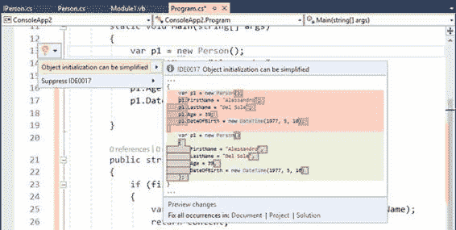

图 15:对象初始化重构

此代码重构还提供了适当的缩进。

#### 转换为插值字符串

另一个非常有用的重构将对`string.Format`的调用转换为插值字符串。这如图 16 所示。

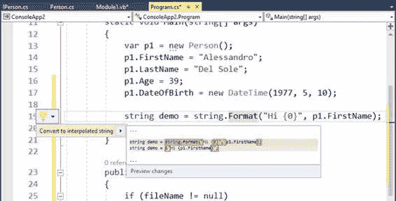

图 16:转换字符串。格式转换为字符串插值

您可以通过右键单击`string.Format`调用而不是赋值来启用这种重构。如果您想了解更多关于字符串插值的信息，请访问 MSDN 的[文档页面](https://msdn.microsoft.com/en-us/library/dn961160.aspx)。

#### 将类型移动到匹配的文件

假设您有一个类，它不是在单个文件中定义的，而是在包含其他类型定义或更一般的其他代码的代码文件中定义的。新的罗斯林重构允许您将指定的类型快速移动到与该类型同名的新文件中。例如，图 17 显示了一个在 Program.cs 中定义的名为`Person`的类。如果你右键单击`Person`，你会看到一个重构，提供将类型移动到一个名为 Person.cs 的新文件中。

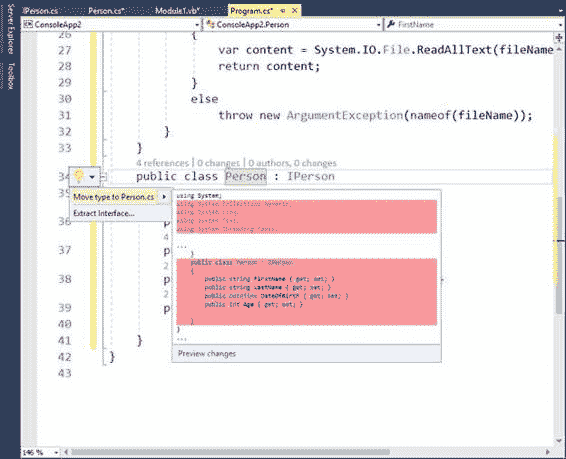

图 17:将类型定义移动到匹配文件中

如果您使用此功能在一个代码文件中定义多种类型，则此功能非常有用。唯一的警告是，如果目标文件已经存在，Visual Studio 将生成一个新文件，并且不会使用现有文件。在当前示例中，如果 Person.cs 已经存在，则 Visual Studio 将生成 Person1.cs 并将该类型放入新创建的文件中。

#### 正在同步类型名和文件名

如果文件中的类型定义名称与类型名称不匹配，新的重构将简化保持类型名称和文件名同步的工作。例如，如果您在一个名为 Human.cs 的文件中定义了一个`Person`类，您可以重命名该文件或重命名类型以使它们匹配。图 18 显示了这个重构的实际操作，您可以通过右键单击类型名来启用它。

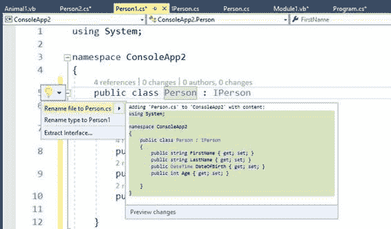

图 18:保持类型名和文件名同步

重命名文件重构提供重命名文件以匹配类型名。或者，重命名类型提供重命名类型以匹配文件名。

#### 内联输出变量声明

|  | 注意:这种重构在 Visual Basic 15 中不可用。 |

C# 7.0 引入了一个名为 [out 变量](https://github.com/dotnet/roslyn/issues/6183)的新特性，它提供了在变量用作 out 参数的地方声明变量的能力。罗斯林现在提供了一个新的重构来支持这个特性，如图 19 所示。

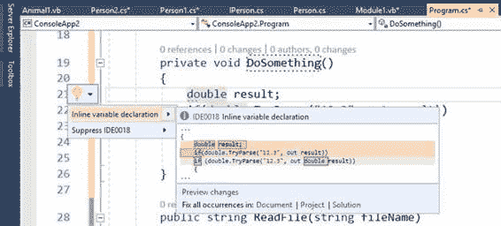

图 19:引入内联输出变量

通过内联变量声明重构，可以简化使用引入内联声明的外部变量的代码。

有了 Roslyn，编译器可以在您键入时报告代码问题，无论使用哪种基于 Roslyn 的 IDE。在 Visual Studio 和 Roslyn 之前，代码编辑器只能分析微软设计的规则代码。罗斯林最大的优势之一是，它允许您引入自己的分析规则(带有修复和重构)，编译器将报告不遵守这些规则的代码的问题。虽然我们当然可以完全控制我们编写的规则，但在 Visual Studio 2017 之前，我们无法控制在微软编写的规则，除了禁用警告。例如，在 Visual Studio 2015 中，后台编译器总是将 C#和 VB 中的`this`和`Me`关键字的使用报告为冗余，除非该关键字用于引用与我们正在分配的变量同名的成员(例如，`this.name = name`)。

又如，在 Visual Studio 2015 中，编译器总是建议我们用相应的关键字替换框架类型名称；比如建议我们用`int` (C#)或者`Integer` (VB)来代替`System.Int32`。然而，有很多理由可以让你使用这些编码风格。为了让开发人员有机会决定他们想要使用哪些编码风格，借助 Visual Studio 2017，微软引入了一个名为代码风格的新工具。这个工具使您能够决定编译器应该如何处理我们的一些编码偏好，包括命名。选择**工具** > **选项** > **文本编辑器**，然后选择 **C#** 或 **Visual Basic** ，最后选择**代码样式**节点，即可到达代码样式设置。我将提供基于 C#的描述，但同样适用于 Visual Basic(稍后我将总结两者的可用首选项)。在 C#中，代码样式有常规、格式(仅限 C#)和命名选项。

|  | 提示:在幕后，该功能基于 [EditorConfig](http://editorconfig.org/) 文件格式。如果您希望进一步配置代码样式，您可以从。微软的 NET 团队。 |

#### 通用代码样式

常规设置可能是改变代码风格最有趣的选项。它们允许您更改一些内置编码规则的首选项。每组首选项都允许您指定首选项和严重性级别。如果您的代码与首选项不匹配，编译器将根据您选择的严重级别报告建议、警告或错误。默认的严重性是无，这意味着编译器将简单地忽略该首选项，并且不报告任何内容。

|  | 提示:请记住，错误严重级别将阻止您构建项目，直到代码问题得到解决。 |

例如，假设您想要在引用对象的属性时使用`this`关键字，并且如果您的代码不使用该关键字，编译器应该报告一个建议。图 20 显示了如何实现这一点。

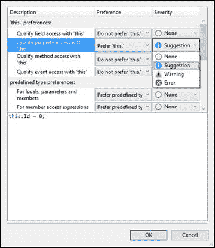

图 20:更改代码样式首选项

请注意图 20 中对话框底部是如何显示代码预览的，而图 21 显示了设置该首选项的结果——编译器报告了一个没有`this`的属性赋值建议，灯泡提供了解决问题的方法。

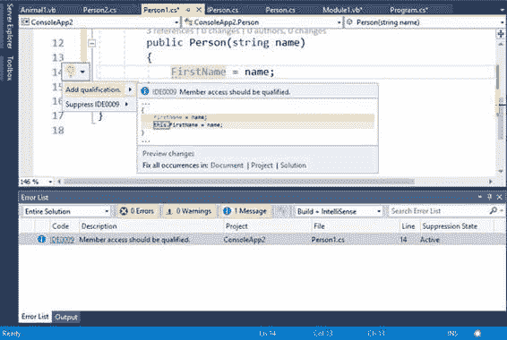

图 21:更改`this`关键字的代码样式

作为另一个例子，假设您想要控制`var`关键字的代码样式。更具体地说，假设您希望避免使用内置类型的`var`，并且希望避免从赋值表达式中明显看出类型的`var`。图 22 显示了如何实现这一点。

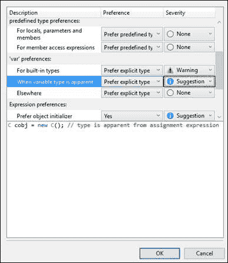

图 22:更改`var`关键字的代码样式

在第一种情况下，每次您使用`var`而不是内置类型时，编译器都会报告一个警告，并且它会提供适当的代码修复，如图 23 所示。

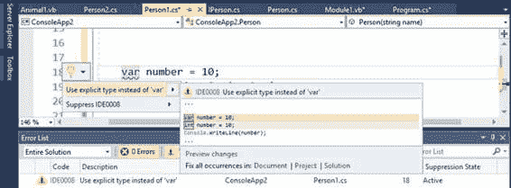

图 23:编译器检测并修复不正确的`var`用法

在表观赋值的情况下，图 24 显示了编译器如何检测到将`Person`类型的实例赋值给变量是一个表观赋值。因此，编译器报告了用明确的`Person`类型替换`var`的建议，通过灯泡提供适当的修复。

图 24:编译器检测到带有明显赋值的不正确的`var`用法

表 3 和表 4 分别总结了 C#和 Visual Basic 的一些可用首选项。请记住，每个样式的代码预览显示在**选项**对话框中。

|  | **偏好** | **描述** |
| --- | --- | --- |
| 这个。偏好；喜好；优先；参数选择 | 用“此”限定字段访问权限 | 设置您是否应该使用`this`关键字来限定对字段的访问。 |
| 这个。偏好；喜好；优先；参数选择 | 用“this”限定属性访问权限 | 设置您是否应该使用`this`关键字来限定对属性的访问。 |
| 这个。偏好；喜好；优先；参数选择 | 用“this”限定方法访问 | 设置您是否应该使用`this`关键字来限定对方法的访问。 |
| 这个。偏好；喜好；优先；参数选择 | 用“this”限定事件访问权限 | 设置您是否应该使用`this`关键字来限定对事件的访问。 |
| 预定义的类型首选项 | 对于局部变量、参数和成员 | 设置您是否应该更喜欢带有局部变量、方法参数和对象成员的预定义类型(例如，`int`、`double`)而不是框架类型(例如，`System.Int32`、`System.Double`)。 |
| 预定义的类型首选项 | 对于成员访问表达式 | 设置在访问类型成员时，是否应该首选预定义类型而不是框架类型。 |
| var 的偏好 | 对于内置类型 | 设置是否应该选择显式类型，而不是内置类型的`var`关键字，如`int`、`string`、`double`等。 |
| var 的偏好 | 当变量类型明显时 | 设置当类型可以通过表达式的赋值很容易发现时，是否应该选择显式类型而不是`var`关键字。 |
| var 的偏好 | 在别处 | 设置在所有其他情况下是否应该选择显式类型而不是`var`关键字。 |
| 代码块首选项 | 首选大括号、方法、构造函数、运算符、属性、索引器和访问器 | 设置代码块是应该使用块体还是表达式体(即使用 lambda 表达式)来实现。 |
| 表达式首选项 | 首选对象初始值设定项 | 设置在实例化对象并填充其成员时是否应该更喜欢对象初始值设定项。报告时，这将调用上一节中描述的简化对象初始化重构。 |
| 表达式首选项 | 首选集合初始值设定项 | 设置在实例化对象集合时是否应该更喜欢集合初始值设定项。当报告时，编辑器提供适当的修复。 |
| 表达式首选项 | 与“强制转换”检查相比，首选模式匹配 | 设置代码是否应该使用模式匹配强制执行强制转换检查。 |
| 表达式首选项 | 优先选择模式匹配，而不是带有“空”检查的“as” | 设置代码是否应该使用模式匹配，而不是使用`as`转换运算符进行空值检查。 |
| 表达式首选项 | 首选显式元组名称 | C# 7.0 中的元组允许隐式名称。此选项设置代码应该使用显式还是隐式元组名称。 |
| 可变偏好 | 首选内联变量声明 | 设置是否应该使用内联变量声明。报告时，这将调用上一节中描述的内联输出变量声明重构。 |
| 空“检查” | 偏好投掷表情 | 使用空值检查，设置您是否应该使用 C# 7.0 中带有空值合并操作符(`??`)的新抛出表达式功能，而不是将变量与`null` `.`进行比较 |
| '空检查' | 首选条件委托调用 | 使用空检查，设置您是否应该更喜欢空条件运算符(`?.`)和委托“`Invoke`”方法，而不是使用`!= null`表达式计算对象。 |
| '空检查' | 首选合并表达式 | 使用空检查，设置是否应该使用合并运算符(`??`)而不是基于条件运算符(`?.`)的表达式 |
| '空检查' | 首选零传播 | 使用空检查，设置您是否应该更喜欢空传播(`?.`)而不是基于条件运算符`?:`的条件比较。 |

表 Visual Basic 的代码样式首选项

| **偏好组** | **偏好** | **描述** |
| --- | --- | --- |
| “我。”偏好；喜好；优先；参数选择 | 用“我”限定字段访问权限 | 设置您是否应该使用`Me`关键字来限定对字段的访问。 |
| “我。”偏好；喜好；优先；参数选择 | 用“我”限定财产访问权限 | 设置您是否应该使用`Me`关键字来限定对属性的访问。 |
| “我。”偏好；喜好；优先；参数选择 | 用“我”限定方法访问 | 设置您是否应该使用`Me`关键字来限定对方法的访问。 |
| “我。”偏好；喜好；优先；参数选择 | 用“我”限定活动访问 | 设置您是否应该使用`Me`关键字来限定对事件的访问。 |
| 预定义的类型首选项 | 对于局部变量、参数和成员 | 设置您是否应该更喜欢带有局部变量、方法参数和对象成员的预定义类型(例如，`Integer`、`Date`)而不是框架类型(例如，`System.Int32`、`System.DateTime`)。 |
| 预定义的类型首选项 | 对于成员访问表达式 | 设置在访问类型成员时，是否应该首选预定义类型而不是框架类型。 |
| 表达式首选项 | 首选对象初始值设定项 | 设置在实例化对象并填充其成员时是否应该更喜欢对象初始值设定项。报告时，这将调用上一节中描述的简化对象初始化重构。 |
| 表达式首选项 | 首选集合初始值设定项 | 设置在实例化对象集合时是否应该更喜欢集合初始值设定项。当报告时，编辑器提供适当的修复。 |
| 表达式首选项 | 首选显式元组名称 | Visual Basic 15 中的元组允许隐式名称。此选项设置代码应该使用显式还是隐式元组名称。 |
| “无”检查 | 首选合并表达式 | 设置是否应该调用带有短路评估的`If`运算符进行空值检查。 |
| “无”检查 | 首选零传播 | 设置是否应该优先使用空条件运算符`?.`进行空检查。 |

这个特性非常有用，尤其是当你觉得编译器的一些默认建议很烦人的时候。

#### 格式化代码样式

格式化代码样式仅适用于 C#。这很有意义，因为格式化的主要目标是控制大括号和代码的自动格式化和缩进，这些代码在您键入时应该在大括号内。格式化还允许您控制如何将一些代码块或语句添加到特定的结构中。所有可用的选项都有不言自明的名称，并且**选项**对话框显示了选择特定选项后代码的外观预览。例如，图 25 显示了选择了**将块留在单行上**选项(在**环绕**节点下)时属性定义的外观，而图 26 显示了未选择该选项时相同的属性定义的外观。

图 25:代码块应该在一行上

图 26:代码块应该在多行上

#### 命名代码样式

命名代码样式首选项地址。NET 类型和成员的命名约定。通过命名规范，您可以控制编译器应该如何报告不符合指定命名约定的代码问题。例如，如果一个接口的名称不是以`I`开头，编译器将报告一个修复其名称的建议。每个规范可以有一种风格和一个严重级别。严重级别可以是无、建议、警告或错误。有三种内置样式和四种内置规格，分别总结在表 5 和表 6 中。默认情况下，所有规范都具有建议严重性级别。

表 5:内置命名风格

| **风格名称** | **描述** |
| 从我开始 | 在指定的规范中选择的类型或成员的名称应以`I` `.`开头 |
| 帕斯卡·凯斯 | 在指定给它的规范中选择的类型或成员的名称应该遵循 Pascal 大小写命名约定。 |

表 6:内置命名规范

| **规格名称** | **描述** |
| 连接 |  开头。 |
| 类型 | 。 |
| 非外地成员 | 确定不同于字段的对象成员应遵循“样式”列中指定的命名规则。默认样式是帕斯卡大小写。 |

|  | 注意:我强烈建议您不要更改这四个规格。它们反映了中一些最重要的通用命名约定。NET，应该保持原样。 |

图 27 显示了命名代码样式选项的默认设置。

图 27:命名代码样式的默认设置

您对命名设置有很大的控制权。事实上，您可以添加自己的规格和样式，并且可以为同一规格组合多种样式。您甚至可以通过单击**管理规格**和**管理样式**来编辑现有的规格和样式。例如，假设您想要为私有枚举添加一个新的命名约定，并且希望样式为 camel case。为此，点击**管理规格**。这将显示活动规范的完整列表(见图 28)。

图 28:可用规格列表

对于每个规格，可以点击**编辑**(用铅笔图标)更改其属性或**删除**删除(不推荐)。

|  | 提示:编辑一个现有的规范将打开刚才描述的相同的符号规范对话框(在图 29 中可见)。 |

如您所见，`Enum`类型的规范已经存在，但是假设您想专门为私有枚举添加一个。点击**添加**(绿色`+`图标)。在出现的**符号规范**对话框中，您将看到可用类型、修饰符和访问器的列表。确保只选择了`enum`和`private`，然后在**符号规范标题**文本框中分配**私有枚举**标题(见图 29)，最后点击**确定**。

图 29:创建自定义规范

再次点击**确定**关闭**管理规格对话框。此时，新规范将列在命名代码样式列表中。现在你需要创建一个新的样式，所以点击**管理样式**。**管理命名样式**对话框将显示当前样式列表，其中包含[表 5](#Table5) 中描述的三种样式。点击**添加**添加新的。在**命名样式**对话框中(见图 30)，为新样式提供一个标题，如驼色案例，然后从**大写**组合框中选择**驼色案例名称**选项。如您所见，您还可以选择指定前缀、后缀和单词分隔符(这种情况下不需要)。**

图 30:创建自定义样式

单击**确定**关闭命名样式对话框，然后单击**确定**关闭管理命名样式对话框。此时，您将能够为之前创建的规范分配新的样式，如图 31 所示(请注意，也已经分配了警告的严重级别)。

图 31:将自定义样式分配给自定义规范

如果你想看到你工作的实际结果，你必须采取额外的步骤。因为类型规范包括具有任何可见性访问器的所有类型，所以您应该编辑此规范并从列表中删除私有访问器。可以参考[图 28](#Figure28)[图 29](#Figure29) 。当然，我们这样做只是为了演示，但是默认规范不应该改变。然而，有了这些自定义规范和样式，编译器现在检测到违反私有枚举的命名规则，显示一条警告消息，并提供适当的修复，如图 32 所示。

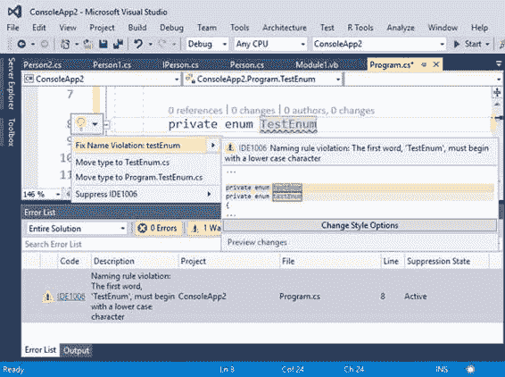

图 32:自定义命名规则违规的检测和代码修复

因此，您不仅限于创建将由实时分析引擎检查的自定义命名规则，您还将获得违规的代码修复，这真的很神奇。

##  的编辑改进

Visual Studio 2017 还对 C++和 F#的代码编辑体验进行了改进。对于 C++，“智能感知”、“转到定义”和“查找所有引用”等功能现在依赖于存储 IDE 所需信息的 SQLite 数据库，以便在代码行之间快速移动，这大大提高了性能。此外，C++的代码编辑器现在提供了两个新的重构:更改签名和提取函数。第一个重构允许您更快地更改方法的签名，而第二个重构允许您将代码块封装到函数中。使用 F#，代码编辑器现在提供了改进的智能感知，具有更好的完成和过滤器，以及类型着色。此外，F#代码编辑器现在构建在罗斯林工作区上，许多功能现在都由罗斯林提供，包括转到定义、查看定义、括号匹配、缩进、断点解析和调试数据提示。

微软通过投资于 IntelliSense、代码导航和集成的 Roslyn 代码分析，提高了 Visual Studio 2017 中 C#和 Visual Basic 的代码编辑器生产力。智能感知具有更好的性能，并允许类型过滤，这使得更容易使用您需要的对象和成员。对于代码导航，“查找所有引用”现在呈现带有语法着色的对象分组列表。“转到”是“导航到”的改进替代，具有类型过滤和在大型代码库中快速搜索功能。最后，结构指南帮助我们理解代码片段属于哪个代码块。借助罗斯林提供的实时代码分析，C#和 Visual Basic 都可以进行新的重构，您现在可以使用新的代码样式功能来控制微软编码的样式和命名规则。代码编辑器的改进不仅限于 C#和 Visual Basic——XAML 代码编辑器也有令人兴奋的新功能和更新的功能，这将在下一章中讨论。