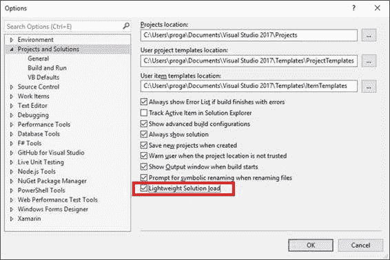
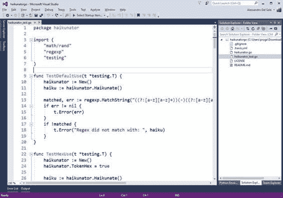
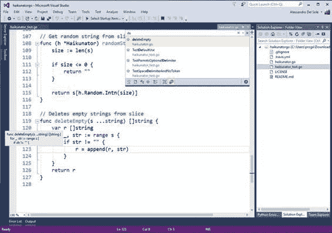
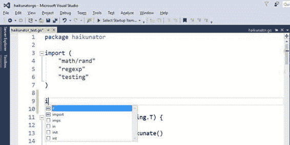
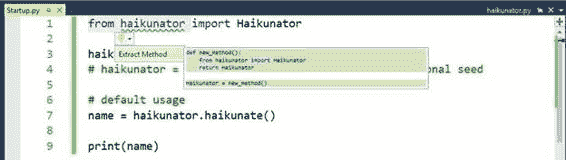
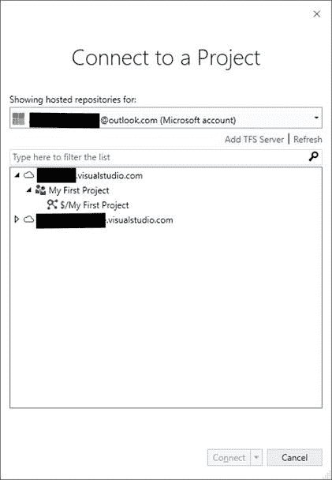
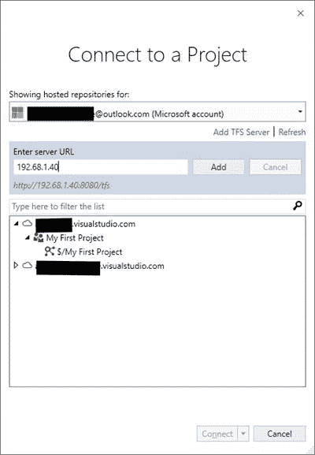

# 五、使用解决方案、文件夹和语言

Visual Studio 2017 对解决方案模型和 IDE 管理项目的方式进行了更新。这带来了更高的性能和可靠性，尤其是大型解决方案。Visual Studio 2017 还支持更多的语言和代码文件，无论它们属于哪个项目系统。所有这些好东西在这一章都有详细的描述。

通常，企业应用程序由非常大的解决方案组成，有时有几十个项目。但是，加载非常大的解决方案会对 Visual Studio 的整体性能产生负面影响。为此，Visual Studio 2017 引入了一个名为轻量级解决方案加载的新功能。此功能优化了加载大型解决方案的过程，提供了更好的响应能力和性能。该功能默认不启用，您可以通过导航至**工具** > **选项** > **项目和解决方案**，然后选择**轻量级解决方案加载**来手动启用(见图 43)。



图 43:启用轻量级解决方案加载

在使用此功能之前，您必须了解默认情况下不启用它的原因:

*   只有在大型解决方案中使用此功能，您才能从中受益。
*   它经过优化，可以处理由 C#/VB 项目或 C#和 C++项目混合组成的解决方案。并非所有项目类型都受益于此功能。
*   Visual Studio 2017 可以自动检测加载给定的解决方案是否可以使用此功能进行优化。在这种情况下，它会提示您一条消息，并请求您允许为您启用该功能。

在幕后，轻量级解决方案加载会延迟加载一些项目，直到您真正需要它们。这意味着某些功能，如代码重构、代码导航或内联重命名，在您第一次调用它们时可能需要一些额外的毫秒数。总之，轻量级解决方案加载是一个非常有用的补充，但只能用于由 C#/VB 项目组成的大型解决方案或混合 C#/C++解决方案。

开箱即用，Visual Studio 2017 为比过去版本更广泛的语言集提供内置支持。这种支持包括语法着色、代码片段、导航和通过 Visual Studio 核心编辑器完成代码，这意味着即使没有安装工作负载，它也是可用的。如果您安装了针对特定语言的工作负载(例如。NET 面向 C#和 VB 的桌面开发)，这些语言将得到更广泛的支持，例如但不限于 IntelliSense、灯泡和快速动作、调试等。这个特性的价值将在下一节“打开文件夹:使用任何代码库”中展示同时，看看表 7，它总结了支持的语言和每种语言的特性。

表 Visual Studio 2017 中支持的语言和功能

| **功能** | **语言** |
| 只有语法着色和代码完成 | 批处理、Clojure、CoffeeScript、CSS、Docker、F#、INI、Jade、JSON、LESS、Make、Markdown、Objective-C、PowerShell、Python、Rust、ShaderLab、SQL、YAML |
| 代码片段、语法着色和代码完成 | CMake、Groovy、HTML、Javadoc、Lua、Perl、R、Ruby、ShellScript、Swift、XML |
| 转至、代码片段、语法着色和代码完成 | C++，C#，Go，Java，JavaScript，PHP，TypeScript，Visual Basic |

通过支持这些语言，您可以使用不同平台的源代码，并利用进化的编辑功能，即使没有安装工作负载。如果您不耐烦，您可以尝试用任何支持的语言打开单个代码文件，但最大的好处是使用文件夹。下一节提供了一些实际的例子。

很多开发环境都有自己的项目体系，Visual Studio 也不例外。项目包含构建应用程序所需的一切，包括源代码文件、对外部库、资产和元数据的引用。微软 Visual Studio 一直有自己的基于解决方案的专有项目系统(。sln 文件)和项目。xxproj 扩展，其中 xx 代表目标开发平台、使用的编程语言或两者。解决方案可以被视为项目的集合。NET 术语它通常被称为 MSBuild 解决方案，因为 MSBuild.exe 是 Visual Studio 用来生成应用程序的工具，该应用程序以正确的顺序编译解决方案中的所有项目。Visual Studio 2017 的抱负是成为任何平台上任何开发人员的开发环境，因此它通过支持大量非。NET 语言(见[表 7](#Table7) )。Visual Studio 2017 还支持使用文件夹；这意味着您可以在磁盘上打开包含多个代码和资产文件的文件夹，Visual Studio 将在该环境中以最佳方式组织它们。这使得 Visual Studio 独立于任何专有的项目系统(当然，解决方案除外)。它将一个文件夹中的所有代码文件作为一个松散的分类加载，通过将文件和子文件夹组织到一个根文件夹中来提供一个结构化视图，以便于在**解决方案资源管理器**中导航。根文件夹实际上是您打开的文件夹的名称。让我们看几个例子。

对于示例，我将使用一个名为 Haikunator 的不错的开源项目，它提供了为 [Heroku](http://www.heroku.com) 平台生成随机子域名称的函数。这个项目有各种编程语言，没有专有的项目系统，所以非常适合我们的需求。我将使用两个版本:用 Go 编写的版本和用 Python 编写的版本。第一个示例将用于展示 Visual Studio 核心编辑器的功能，第二个示例将用于展示调试器和智能感知的广泛语言支持。也就是说，遵循以下步骤:

1.  前往[github.com/Atrox/haikunatorgo](https://github.com/Atrox/haikunatorgo)获取 Go 版本。
2.  点击**克隆或下载**，然后**下载 ZIP** 。
3.  提取下载的内容。将档案压缩到您选择的文件夹中。
4.  前往[github.com/Atrox/haikunatorpy](https://github.com/Atrox/haikunatorpy)获取 Python 版本，然后重复第二步和第三步。

记下提取这两者的文件夹。zip 存档，因为它们很快就会被使用。

我们的第一个例子是基于用 Go 编程语言编写的 Haikunator 项目版本。在 Visual Studio 2017 中，选择**文件** > **打开** > **文件夹**。浏览磁盘，直到找到提取代码的文件夹，然后点击**选择文件夹**。几秒钟后，**解决方案资源管理器**将显示用于导航的根文件夹以及该文件夹中的文件(见图 44)。如果用。转到扩展，您将看到 Visual Studio 2017 如何为这种受支持的语言提供语法着色，即使没有安装工作负载，也即使当前语言不属于。NET 系列(见图 44)。



图 44:打开一个文件夹并编辑任何支持的代码文件

此外，您还可以获得代码导航功能，例如“转到”和结构引导线，如图 45 所示，在这里您可以看到如何在您键入时过滤项目列表。



图 45:Visual Studio 核心编辑器中的代码导航特性

对于每种受支持的语言，您还可以获得代码补全，这一功能使编写和编辑代码变得更快、更容易。图 46 显示了一个例子。



图 46:代码完成简化了代码编写

包括 Go 在内的一些语言也支持 TextMate 代码片段，这些代码片段可通过代码完成弹出窗口获得。代码片段可以通过空白表单的图标来识别(见图 46)。比如选择 **init** 片段，然后按 **Tab** ，代码编辑器会插入一个名为`init`的函数存根，如图 47 所示。

图 47:插入代码片段

请注意代码编辑器如何用黄色突出显示应该用您的代码替换的代码。请记住，代码片段并非对所有语言都可用，但是您可以参考[表 7](#Table7) 作为该功能可用性的快速参考。这里需要强调的重要一点是，无论语言、项目系统和安装的工作负载如何，您都可以从一个进化的代码编辑器中获得您所期望的一切。

|  | 注意:代码完成不是智能感知。这是一个重要的澄清。IntelliSense 是一个进化的工具，通常由后台编译器或完成数据库提供动力，它允许 IDE 根据类型、成员、标识符等来显示和分组项目。毫不奇怪，Visual Studio 中的智能感知仅适用于有限数量的语言，这些语言具有特定工作负载和工具提供的广泛支持。代码完成更加有限，通常基于一个小的内置关键字列表和编辑器在代码中检测到的文字，但实际上它对任何语言都是可用的。 |

对于某些语言，Visual Studio 2017 允许通过特定的安装工作负载或第三方工具添加广泛的支持。想想 Python，这是一种非常流行的编程语言。Visual Studio 核心编辑器为它提供了基本支持，包括语法着色和代码完成。但是，Visual Studio 2017 允许对您的源代码执行外部程序；这意味着，如果安装 [Python 解释器](https://www.python.org/downloads/)，就可以从开发环境中执行您的 Python 代码。

|  | 提示:最后一句适用于所有支持的语言，而不仅仅是 Python。 |

在 Visual Studio 2017 的预发布版本中，微软还包括了 Python 开发的特定安装工作负载，其中包括调试器集成和其他增强工具，以便从 IDE 中使用 Python。对于 RTM，Python 工作负载已从 Visual Studio 安装程序中删除。Visual Studio 2017 Python 的 Visual Studio Tools 将单独提供，计划在 Visual Studio 2017 达到 RTM 里程碑几天后发布。因此，基于 Haikunator 项目的 Python 版本的下一个示例实际上是基于 Visual Studio Installer 以前包含的 Visual Studio Tools 的预发布，并且在更新的工具发货后仍然有效。

|  | 注意:我之所以展示一个基于 Python 的示例，尽管它只有在 RTM 发布后才可用，是因为它完美地展示了具有调试功能和代码重构的广泛语言支持。 |

完成后，用**打开文件夹**命令打开包含 Python 项目的文件夹。然后，打开任何。py 代码文件，查看代码编辑器如何提供预期的语法着色。图 48 显示了一个基于 tests.py 文件的例子。

图 48:Python 的语法着色

当您开始键入时，您将看到智能感知在运行，而不仅仅是代码完成。图 49 展示了 Python 的智能感知如何用图标显示项目，解释项目的范围，例如关键字、函数和类型。请记住，由于特定的安装工作负载，智能感知对 Python 是可用的，否则只有代码完成是可用的。

图 49:Python 的智能感知

您可能会看到一条警告消息，提示需要刷新完成数据库。发生这种情况是因为 Python 的智能感知由外部数据库填充，这与 C#和 VB 不同，在 c#和 VB 中，罗斯林应用编程接口向 Visual Studio 公开可用的成员。如果看到警告消息，请单击智能感知弹出窗口中的 **Python 环境**超链接(参见图 49)。该操作将打开 Python 环境工具窗口，您可以在其中看到可用环境和解释器的列表(参见图 50)。Python 开发工作负载从 Python 软件基金会官方网站安装最新版本的解释器——在本例中是 3.5 版本。根据您的机器，工作负载安装 32 位或 64 位版本。您将在 Python 环境附近看到一个**刷新**按钮—单击它开始刷新完成数据库。

图 50 显示了正在进行的操作。请注意，并非所有可用的环境都在本地安装。例如，在图 50 中，您可以看到 Anaconda 环境是如何显示为禁用的，这意味着可用但未安装。这可以在 Visual Studio 安装程序中作为单独的组件提供，也可以单独安装。

图 50:Python 环境工具窗口

该窗口中还有其他快捷方式，但它们与 Visual Studio 的 Python 工具严格相关——解决它们超出了本电子书的范围。现在，是时候通过编写一点 Python 代码来发现 Visual Studio 编辑器的一些好处了。

#### 设置启动项目

正如我们所知，安装扩展语言支持的工具的一大好处是能够直接在 Visual Studio 中运行程序。Python 语言也是如此。为了运行代码，Visual Studio 2017 需要我们设置一个启动项，这是它将用来启动程序的代码文件。如果您的文件夹已经包含一个启动项，您就被设置了。在当前示例中，Haikunator 项目是一个不包含启动项目的库。要添加一个，右键单击**解决方案资源管理器**中的根文件夹，然后选择**添加** > **新文件**。您将在文件夹中看到一个新文件。您可以键入任何您喜欢的名称，但是为了本章的一致性，请输入 **Startup.py** 并按回车键。此时，键入代码清单 1 所示的代码。您将在键入时获得智能感知，这将使您的编码体验真正令人敬畏。

代码清单 1

```
  from haikunator import Haikunator
  haikunator =
  Haikunator()
  name =
  haikunator.haikunate()
  print(name)

```

代码非常简单——它导入在 haikunator 包中定义的`Haikunator`类型，并生成一个调用`haikunate`方法的随机名称。然后它简单地在屏幕上打印名字。这足以演示代码编辑器的许多特性。当您在新的或现有的特定文件上打开代码编辑器时，它将自动设置为启动项目。在这种情况下，Startup.py 被自动设置为程序的启动项目。如果您希望使用不同的启动文件，只需打开它或在**解决方案资源管理器**中右键单击它的名称，然后选择**设置为启动项目**。

#### 运行程序

与任何其他 Visual Studio 项目一样，您可以通过按 F5(调试模式)、Ctrl+F5(不调试)或单击标准工具栏上的**开始**来运行程序。当使用文件夹时，“开始”按钮显示了启动项目的名称(见图 51)。

图 51:开始按钮显示启动项目的名称

无论您选择哪种启动选项，您的程序都将按预期运行。在这种特殊情况下，您不需要手动调用 Python 解释器。启动示例程序将产生如图 52 所示的结果(生成的随机名称会因您的机器而异)。

图 52:从 Visual Studio 2017 运行 Python 程序

请注意，具体到 Python，安装工作负载会自动配置 Visual Studio 2017，以便在 IDE 中针对选定的启动项目运行解释器。对于其他语言和其他工具，Visual Studio 2017 必须手动配置为运行编译器或解释器。我们将在本章的后面讨论这些情况。现在，仔细看看图 52——注意 Visual Studio 的状态栏是橙色的，这意味着它处于调试模式。这也意味着新的 IDE 可以使用外部调试工具。

#### 排除故障

Visual Studio 2017 可以扩展调试器以支持其他语言。特定的工作负载或第三方工具可以安装调试组件，集成开发环境可以将这些组件集成到其强大的开发体验中。为了更好地理解这一点，在代码编辑器中打开 **haikunator.py** 文件。移动到代码的最后一行，像在 C#或 Visual Basic 中一样放置一个断点。确保打开 **Startup.py** 文件，使其再次设置为启动项，然后运行程序。几秒钟后，调试器将因为断点而中断应用程序的执行。此时，您将能够使用已经知道的强大调试功能，例如数据提示、局部变量和其他调试窗口。图 53 显示了一个例子。

图 53:对 Python 的调试器支持和集成

我们需要记住，调试和智能感知等功能并不适用于所有受支持的语言，而是可以通过特定的工作负载或第三方工具获得。然而，Visual Studio 2017 为非。NET 语言，这对任何开发人员来说都是巨大的附加价值。

#### 代码重构

对于特定语言，Visual Studio 2017 代码编辑器还提供了灯泡和快速操作，以提供进化的代码编辑体验。例如，在 Python 中，您可以像使用 C#和 Visual Basic 重构那样选择一个代码块并提取一个方法。图 54 展示了这一点。



图 54:Python 的代码重构

凭借对集成智能感知、重构和调试器等功能的支持，Visual Studio 2017 作为任何平台上任何开发人员的开发工具，肯定不负众望。

#### 自定义任务

以前，我们看到只需按 F5 就可以轻松运行 Python 程序。这是真的，因为 Visual Studio 的 Python 工具会自动配置环境，以针对选定的源代码文件运行解释器。并非所有语言都有特定的集成工具，但对于许多语言，我们仍然可以通过创建和定制**任务**来自动执行外部程序，如解释器、编译器或 Windows 命令。

|  | 提示:如果您熟悉 Visual Studio Code 中的任务，您会注意到与 Visual Studio 2017 中的任务非常相似。它们有不同的位置和不同的语法，但它们的目的完全相同。 |

任务是一个具有许多设置的操作，用 JSON 标记表示。设置包括要执行的命令及其命令行参数。稍后将提供解释，但是现在假设您希望能够编译或运行 Go 程序。你首先需要一个 Go 编译器和正确的设置。[围棋编程语言](https://golang.org)网站有你需要的一切，包括二进制文件和文档。首先，下载并安装 Windows 的[二进制文件](https://golang.org/dl/)。其次，创建一个文件夹，您将在其中编写一个简单的 Go 程序，并配置`GOPATH`环境变量，如[文档](https://golang.org/doc/install)中所述，该文档还解释了使用 Go 编写、编译和运行代码所需了解的一切。安装程序会自动配置`GOROOT`环境变量，以便您可以从任何位置运行 Go.exe 编译器。在当前示例中，我将使用一个名为 C:\GoWork 的文件夹。现在，我们编译和运行围棋程序所需的一切都准备好了。

|  | 注意:显然，不同的编程语言使用不同的二进制文件和系统配置，这意味着配置任务需要与任何语言相同的步骤，但设置不同。在这本电子书中，我提供了一个基于 Go 的例子，因为安装它的二进制文件非常容易，尽管配置系统需要一些手动步骤。 |

在 Visual Studio 2017 中，打开您创建的文件夹(如我的 C:\GoWork)。准备好之后，添加一个名为 **HelloWorld.go** 的新文件。接下来，输入代码清单 2 所示的代码。

代码清单 2

```
  package main

  import "fmt"

  func main() {
      fmt.Printf("hello world from Visual
  Studio 2017!\n")
  }

```

我用的是新的“你好世界！”编程，而不是 Haikunator 项目，因为 Go 要求我们先安装和配置软件包，然后才能使用它们。我们应该编译并安装 Haikunator 库，然后提供正确的配置(这需要我们对 Go 规则有所熟悉)。

虽然提供这些细节超出了本电子书的范围，但是[围棋文档](https://golang.org/doc/install)提供了很好的解释。代码清单 2 简单地定义了一个名为`main`的包，并导入了一个名为`fmt`的基础库，然后在屏幕上打印一条简单的消息。现在，在**解决方案资源管理器**中，右键单击 **Helloworld.go** 文件并选择**自定义任务设置**。此操作将创建一个名为 tasks.vs.json 的新 JSON 文件，该文件位于名为**的隐藏文件夹中。vs** 而那就驻留在你的工作空间里。这个 JSON 文件包含 Visual Studio 需要知道的指令，以便执行许多任务，包括启动启动项目。以下是每个任务共有的 JSON 属性列表:

*   `taskName`:将在**解决方案资源管理器**上下文菜单中显示的任务名称。
*   `appliesTo`:指定当前任务的目标，通常是一个特定的文件。
*   `type`:代表任务的类型，一般是命令。

您必须编辑 tasks.vs.json，并指定它必须针对当前源代码文件执行 Go.exe 编译器。代码清单 3 展示了如何通过添加`command`和`args`属性来实现这一点。

```
  {
    "version": "0.2.1",
    "tasks": [
      {
        "taskName": "Run Hello World",
        "appliesTo": "Helloworld.go",
        "type": "command",
        "command": "Go.exe",
        "args": ["run", "Helloworld.go"]
      }
    ]
  }

```

注意`command`是如何指定必须执行的外部程序名称的。在这种情况下，您指定的编译器文件名没有路径，因为安装程序已经设置了一个环境变量。相反，`args`以 JSON 数组的形式为命令指定任何命令行参数。在这种情况下，第一个参数是一个名为`run`的选项，它指示编译器构建和运行一个程序，第二个参数是要编译的文件的名称。

|  | 注意:Tasks.vs.json 可以包含许多任务，例如构建一个完整的文件夹或清理构建输出。有关其他配置选项，您可以阅读[这篇来自 Visual C++团队的博文](https://blogs.msdn.microsoft.com/vcblog/2016/10/05/bring-your-c-codebase-to-visual-studio-with-open-folder/)，其中他们提供了关于多个任务配置、支持的常量、文字和宏的进一步解释。 |

此时，右键单击**解决方案资源管理器**中的 **Helloworld.go** 文件名，然后从上下文菜单中选择**运行 Hello World** (这是您之前提供的`taskName`)。该操作将启动 Go 编译器，并使程序输出在**输出**窗口中可见，如图 55 所示。

图 55:运行带有任务的围棋程序

虽然您没有调试支持或用于执行的控制台窗口，但是您已经能够从 Visual Studio 2017 中运行 Go 程序。任务自动化的许多其他可能性对您来说是可用的，它们对所有支持的语言提供了更大的控制。

Visual Studio 2017 对团队协作也有一些新的东西。事实上，您现在可以使用新的对话框来连接到 Visual Studio 团队服务和 Team Foundation Server。例如，在团队资源管理器中，单击**管理连接**，然后单击**连接到团队项目**。此时，您将看到一个名为**连接到项目**的新对话框，其中显示了您订阅的所有 Visual Studio Team Service 帐户和 TFS 服务器(见图 56)。默认情况下，Visual Studio 会查找与您用来登录 IDE 的 Microsoft 帐户相关联的存储库，但是您可以通过帐户下拉列表添加多个帐户。当你点击 **Connect** 时，Visual Studio 会打开 Team Explorer，显示一个标有 **Map & Get** 的按钮，该按钮提供了一个将远程存储库映射到本地文件夹并从服务器获取最新版本源代码的快捷方式。



图 56:连接到 Visual Studio 团队服务存储库

如果您单击**添加** **TFS 服务器**，您将能够添加并连接到内部 TFS 实例。图 57 显示了一个基于虚构信息的例子。



图 57:添加内部 TFS 实例

与**团队服务**选项卡一样，在这里您仍然能够将存储库映射到本地文件夹，并获得源代码的最新版本。与团队协作相关的所有其他功能，包括团队资源管理器，都保持不变。

|  | 提示:您也可以通过“团队”菜单中的“管理连接”命令来启用连接对话框。 |

|  | 注意:Visual Studio 2015 Update 2 在团队资源管理器中引入了更多 Git 命令，并在状态栏的右下角引入了 Git 存储库的快捷方式。Visual Studio 2017 继承了这些功能，但没有引入任何新功能。如果您想了解这些功能的更多信息，请阅读 [Visual Studio 2015 Update 2 发行说明](https://www.visualstudio.com/en-us/news/releasenotes/vs2015-update2-vs)的 Visual Studio IDE 和团队资源管理器部分。 |

Visual Studio 2017 为解决方案、项目和代码文件引入了非常重要的改进和功能。借助轻量级解决方案加载，可以更高效、更快速地加载大型解决方案。新的集成开发环境还支持更广泛的编程语言，即使没有安装工作负载，核心编辑器也可以处理包含代码文件的文件夹，不仅提供结构化、有组织的表示，还提供语法着色和代码完成等基本功能，以及智能感知、调试和代码片段等进化功能。为了支持这些和其他新的或更新的功能，Visual Studio 2017 的体系结构与以前的版本有很大不同，这影响了可扩展性，我们将在下一章中看到。